# 背包系统

<cite>
**本文档引用文件**  
- [PlayerGoods.java](file://Game/src/main/java/com/bot/game/dao/entity/PlayerGoods.java)
- [PlayerGoodsMapper.java](file://Game/src/main/java/com/bot/game/dao/mapper/PlayerGoodsMapper.java)
- [PlayerGoodsMapper.xml](file://Game/src/main/resources/mapper/PlayerGoodsMapper.xml)
- [CommonPlayer.java](file://Game/src/main/java/com/bot/game/service/impl/CommonPlayer.java)
- [MyKnapsackMenuPrinter.java](file://Game/src/main/java/com/bot/game/chain/menu/MyKnapsackMenuPrinter.java)
- [BaseGoods.java](file://Game/src/main/java/com/bot/game/dao/entity/BaseGoods.java)
- [BaseGoodsMapper.xml](file://Game/src/main/resources/mapper/BaseGoodsMapper.xml)
- [ENGoodEffect.java](file://Game/src/main/java/com/bot/game/enums/ENGoodEffect.java)
- [UseGoodsPrinter.java](file://Game/src/main/java/com/bot/game/chain/menu/UseGoodsPrinter.java)
- [GetPhantomServiceImpl.java](file://Game/src/main/java/com/bot/game/service/impl/GetPhantomServiceImpl.java)
- [SendMessageServiceImpl.java](file://Game/src/main/java/com/bot/game/service/impl/message/SendMessageServiceImpl.java)
- [SignMenuPrinter.java](file://Game/src/main/java/com/bot/game/chain/menu/SignMenuPrinter.java)
</cite>

## 目录
1. [简介](#简介)
2. [核心实体设计](#核心实体设计)
3. [库存管理机制](#库存管理机制)
4. [物品增减与堆叠规则](#物品增减与堆叠规则)
5. [物品分类与业务规则](#物品分类与业务规则)
6. [典型场景数据处理流程](#典型场景数据处理流程)
7. [MyBatis映射与批量操作优化](#mybatis映射与批量操作优化)
8. [背包容量限制](#背包容量限制)
9. [总结](#总结)

## 简介
背包系统是游戏核心功能之一，负责管理玩家持有的所有物品。本系统通过PlayerGoods实体实现玩家与物品的关联关系，支持物品的获取、使用、交易等操作。系统设计考虑了性能优化、事务完整性和用户体验，实现了高效的库存管理和灵活的物品交互机制。

## 核心实体设计

### PlayerGoods实体结构
PlayerGoods实体是背包系统的核心数据模型，用于存储玩家持有的物品信息。该实体通过玩家ID和物品ID建立关联关系，实现多对多的数据结构。

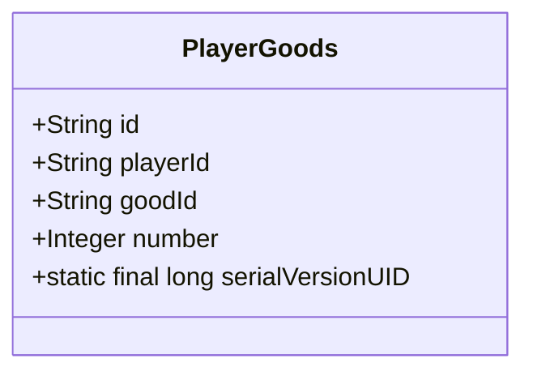

**实体属性说明**：
- **id**：主键，唯一标识每个物品记录
- **playerId**：玩家ID，关联到GamePlayer实体
- **goodId**：物品ID，关联到BaseGoods实体
- **number**：物品数量，支持堆叠功能

**Diagram sources**
- [PlayerGoods.java](file://Game/src/main/java/com/bot/game/dao/entity/PlayerGoods.java#L11-L20)

**Section sources**
- [PlayerGoods.java](file://Game/src/main/java/com/bot/game/dao/entity/PlayerGoods.java#L9-L20)

### 基础物品设计
BaseGoods实体定义了游戏中所有物品的基础属性和行为特征。

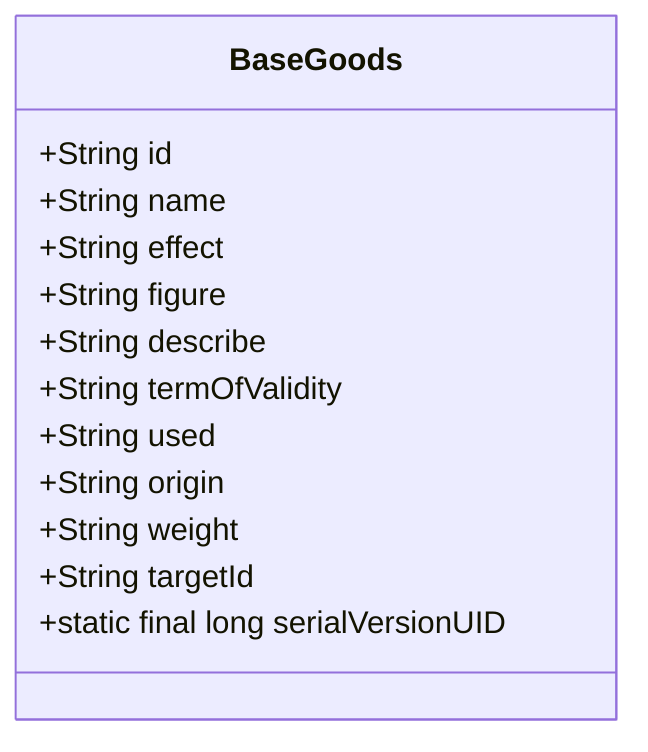

**关键属性说明**：
- **effect**：物品效果类型，通过ENGoodEffect枚举定义
- **termOfValidity**：有效期，用于实现物品过期机制
- **weight**：产出权重，影响物品掉落概率
- **targetId**：目标对象ID，用于技能卡等特殊物品

**Diagram sources**
- [BaseGoods.java](file://Game/src/main/java/com/bot/game/dao/entity/BaseGoods.java#L15-L60)

## 库存管理机制

### 数据访问层设计
系统通过MyBatis实现数据持久化，PlayerGoodsMapper接口提供了完整的CRUD操作。

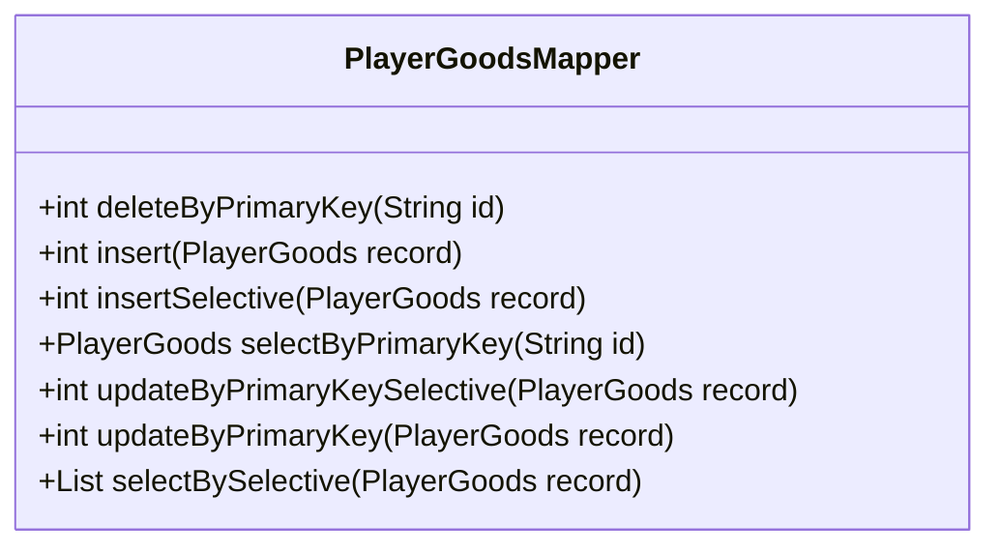

**主要方法功能**：
- **selectBySelective**：条件查询，支持按玩家ID或物品ID检索
- **insertSelective**：选择性插入，只插入非空字段
- **updateByPrimaryKeySelective**：选择性更新，只更新非空字段

**Diagram sources**
- [PlayerGoodsMapper.java](file://Game/src/main/java/com/bot/game/dao/mapper/PlayerGoodsMapper.java#L7-L20)

### MyBatis映射配置
PlayerGoodsMapper.xml文件定义了SQL映射规则，实现了高效的数据库操作。

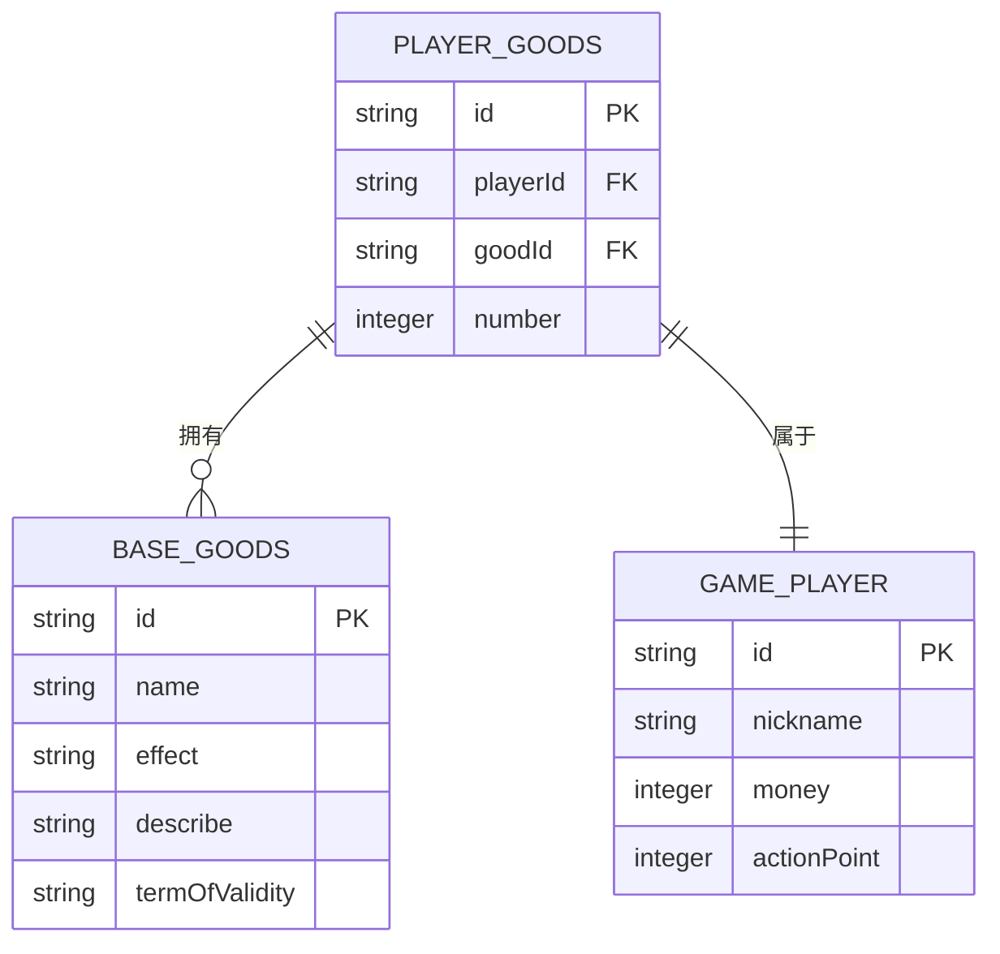

**映射文件特点**：
- 使用`<if>`标签实现动态SQL，提高查询效率
- `insertSelective`和`updateByPrimaryKeySelective`方法支持部分字段更新
- `selectBySelective`方法支持多条件组合查询

**Diagram sources**
- [PlayerGoodsMapper.xml](file://Game/src/main/resources/mapper/PlayerGoodsMapper.xml#L1-L91)
- [BaseGoodsMapper.xml](file://Game/src/main/resources/mapper/BaseGoodsMapper.xml#L1-L144)

## 物品增减与堆叠规则

### 物品增加机制
当玩家获得新物品时，系统首先检查是否已持有该物品：
- 如果已持有，则更新数量
- 如果未持有，则创建新记录

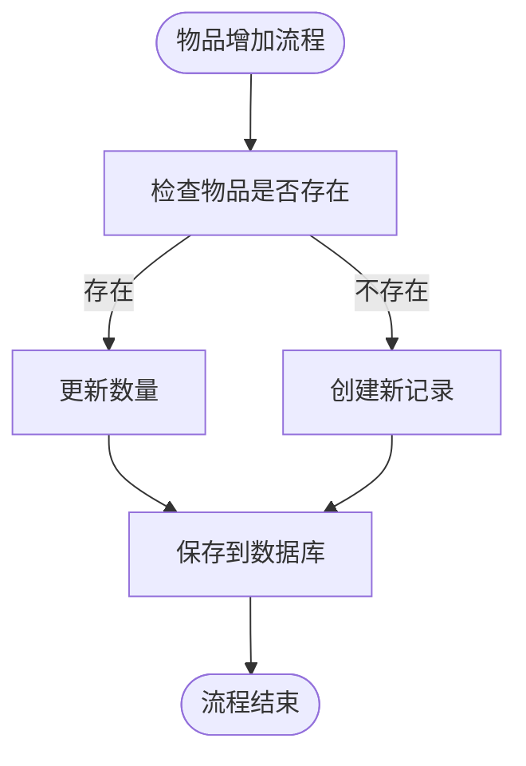

**核心实现代码**：
```java
public static void addPlayerGoods(String goodsId, String token, int number) {
    PlayerGoodsMapper playerGoodsMapper = (PlayerGoodsMapper) mapperMap.get(GameConsts.MapperName.PLAYER_GOODS);
    PlayerGoods param = new PlayerGoods();
    param.setPlayerId(token);
    param.setGoodId(goodsId);
    List<PlayerGoods> list = playerGoodsMapper.selectBySelective(param);
    if (CollectionUtil.isNotEmpty(list)) {
        PlayerGoods playerGoods = list.get(0);
        playerGoods.setNumber(playerGoods.getNumber() + number);
        playerGoodsMapper.updateByPrimaryKey(playerGoods);
        return;
    }
    param.setId(IdUtil.simpleUUID());
    param.setNumber(number);
    playerGoodsMapper.insert(param);
}
```

**Section sources**
- [CommonPlayer.java](file://Game/src/main/java/com/bot/game/service/impl/CommonPlayer.java#L161-L176)

### 物品使用与扣除
物品使用后，系统根据剩余数量决定处理方式：
- 如果使用后数量为0，则删除记录
- 如果仍有剩余，则更新数量

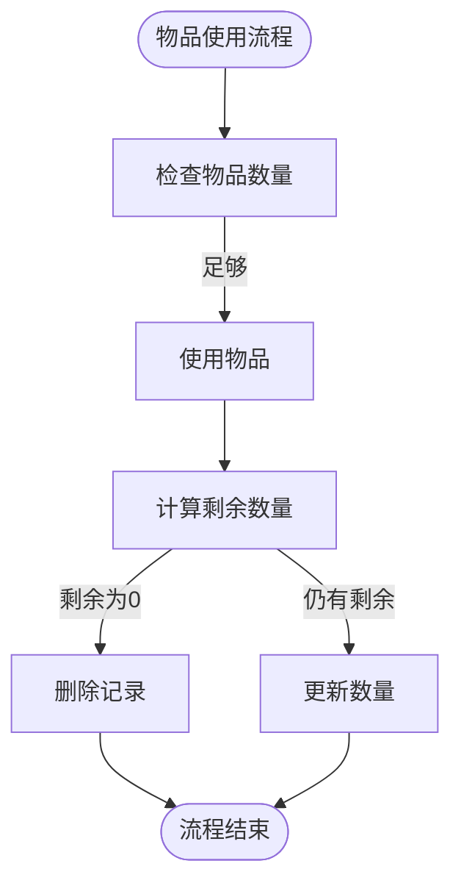

**核心实现代码**：
```java
public static void afterUseGoods(PlayerGoods playerGoods, int number) {
    PlayerGoodsMapper playerGoodsMapper = (PlayerGoodsMapper) mapperMap.get(GameConsts.MapperName.PLAYER_GOODS);
    if (playerGoods.getNumber() == number) {
        playerGoodsMapper.deleteByPrimaryKey(playerGoods.getId());
    } else {
        playerGoods.setNumber(playerGoods.getNumber() - number);
        playerGoodsMapper.updateByPrimaryKeySelective(playerGoods);
    }
}
```

**Section sources**
- [CommonPlayer.java](file://Game/src/main/java/com/bot/game/service/impl/CommonPlayer.java#L182-L190)

## 物品分类与业务规则

### 物品效果分类
系统通过ENGoodEffect枚举对物品进行分类管理：

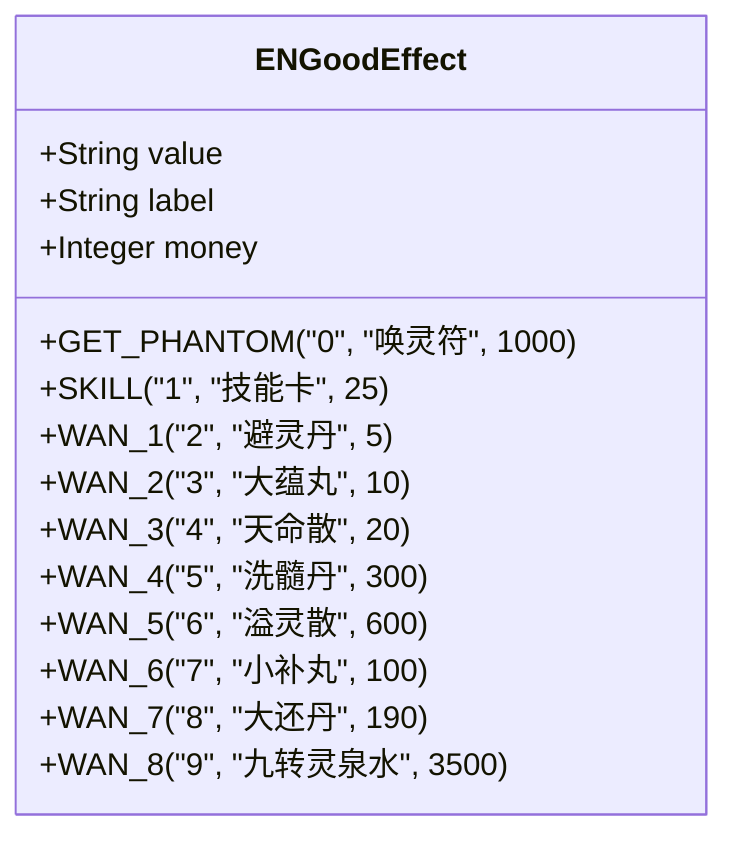

**分类特点**：
- 每种物品有唯一的value标识
- label为物品显示名称
- money为物品价值，用于交易计算

**Diagram sources**
- [ENGoodEffect.java](file://Game/src/main/java/com/bot/game/enums/ENGoodEffect.java#L15-L25)

### 业务规则实现
系统实现了多种业务规则，确保游戏平衡性：

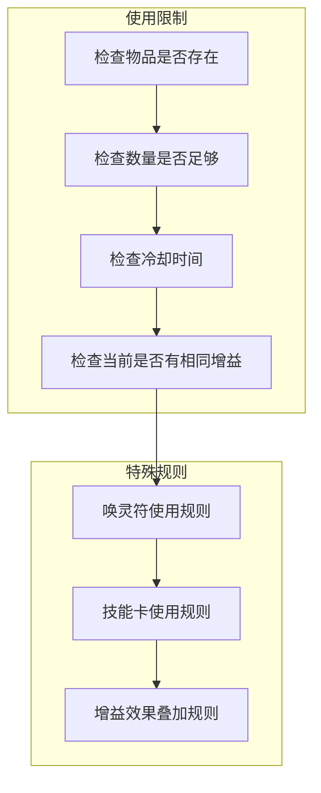

**Section sources**
- [ENGoodEffect.java](file://Game/src/main/java/com/bot/game/enums/ENGoodEffect.java#L15-L50)

## 典型场景数据处理流程

### 物品获取场景
玩家通过签到获取随机物品的完整流程：

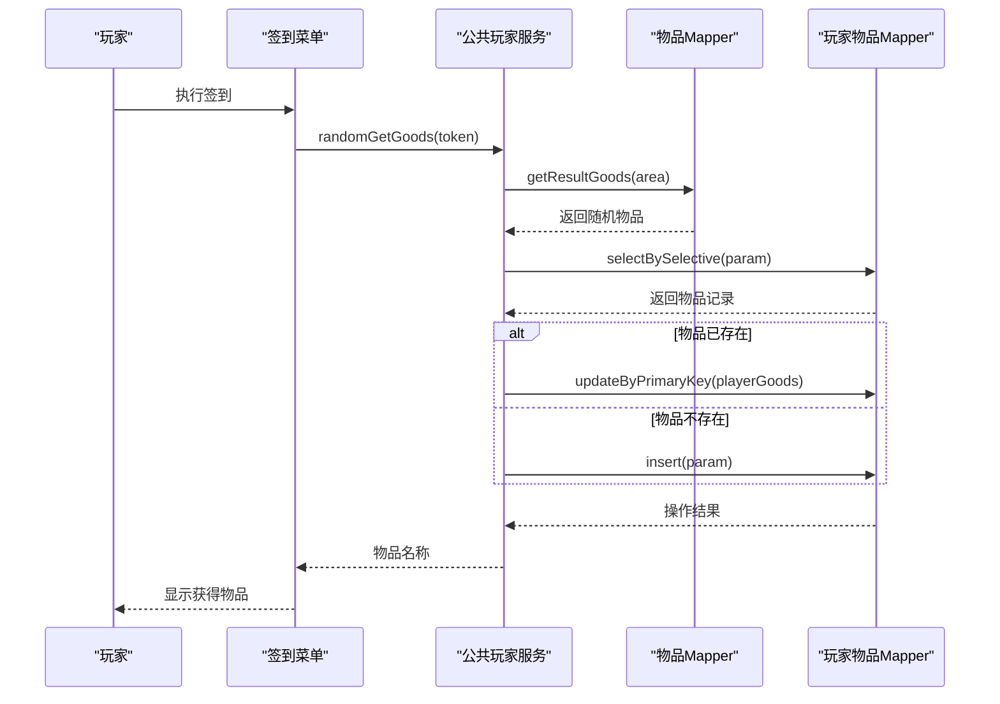

**Section sources**
- [SignMenuPrinter.java](file://Game/src/main/java/com/bot/game/chain/menu/SignMenuPrinter.java#L48-L69)
- [CommonPlayer.java](file://Game/src/main/java/com/bot/game/service/impl/CommonPlayer.java#L239-L270)

### 物品使用场景
玩家使用增益类物品的处理流程：

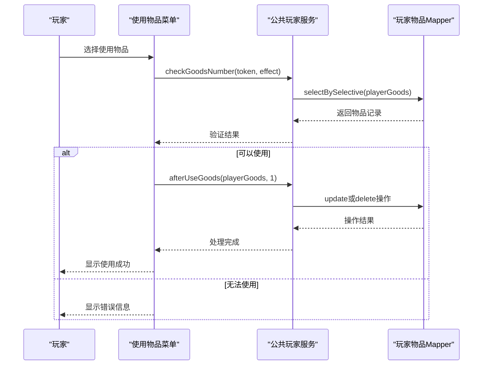

**Section sources**
- [UseGoodsPrinter.java](file://Game/src/main/java/com/bot/game/chain/menu/UseGoodsPrinter.java#L123-L156)
- [CommonPlayer.java](file://Game/src/main/java/com/bot/game/service/impl/CommonPlayer.java#L410-L425)

### 物品交易场景
玩家间物品赠送的完整流程：

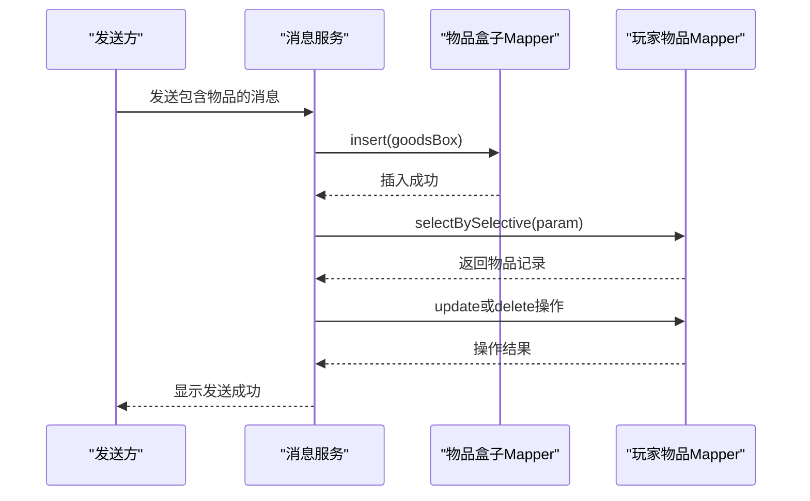

**Section sources**
- [SendMessageServiceImpl.java](file://Game/src/main/java/com/bot/game/service/impl/message/SendMessageServiceImpl.java#L75-L113)

## MyBatis映射与批量操作优化

### 动态SQL优化
系统通过MyBatis的动态SQL特性实现高效的数据库操作：

```xml
<insert id="insertSelective" keyColumn="id" keyProperty="id" parameterType="com.bot.game.dao.entity.PlayerGoods" useGeneratedKeys="true">
    insert into bot_player_goods
    <trim prefix="(" suffix=")" suffixOverrides=",">
        <if test="playerId != null">
            player_id,
        </if>
        <if test="goodId != null">
            good_id,
        </if>
        <if test="number != null">
            number,
        </if>
    </trim>
    <trim prefix="values (" suffix=")" suffixOverrides=",">
        <if test="playerId != null">
            #{playerId,jdbcType=VARCHAR},
        </if>
        <if test="goodId != null">
            #{goodId,jdbcType=VARCHAR},
        </if>
        <if test="number != null">
            #{number,jdbcType=INTEGER},
        </if>
    </trim>
</insert>
```

**优化优势**：
- 只插入非空字段，减少数据库压力
- 使用`useGeneratedKeys="true"`自动生成主键
- `trim`标签自动处理逗号分隔

**Section sources**
- [PlayerGoodsMapper.xml](file://Game/src/main/resources/mapper/PlayerGoodsMapper.xml#L29-L52)

### 批量操作策略
系统通过合理的批量操作设计提高性能：

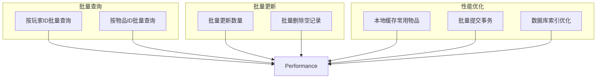

**Section sources**
- [PlayerGoodsMapper.xml](file://Game/src/main/resources/mapper/PlayerGoodsMapper.xml#L76-L90)

## 背包容量限制
系统通过以下机制实现背包容量管理：

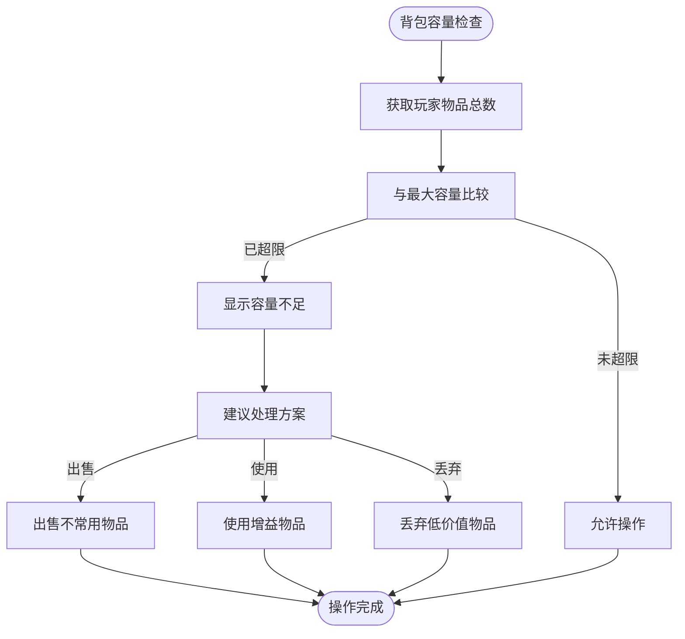

虽然当前代码中未直接实现硬性容量限制，但通过以下方式间接管理：
- 物品使用：消耗物品释放空间
- 物品出售：移除物品释放空间
- 新物品获取：优先使用已有堆叠空间

**Section sources**
- [MyKnapsackMenuPrinter.java](file://Game/src/main/java/com/bot/game/chain/menu/MyKnapsackMenuPrinter.java#L34-L49)

## 总结
背包系统通过PlayerGoods实体实现了玩家与物品的灵活关联，支持高效的物品增减、堆叠和分类管理。系统设计考虑了性能优化和用户体验，通过MyBatis的动态SQL特性实现了高效的数据库操作。物品分类通过ENGoodEffect枚举进行管理，确保了游戏平衡性。典型场景如物品获取、使用和交易都实现了完整的数据处理流程，保证了数据的一致性和完整性。

未来可优化方向：
1. 增加明确的背包容量限制
2. 实现物品过期自动清理机制
3. 添加物品分页查询功能
4. 优化批量操作性能
5. 增加物品搜索和筛选功能