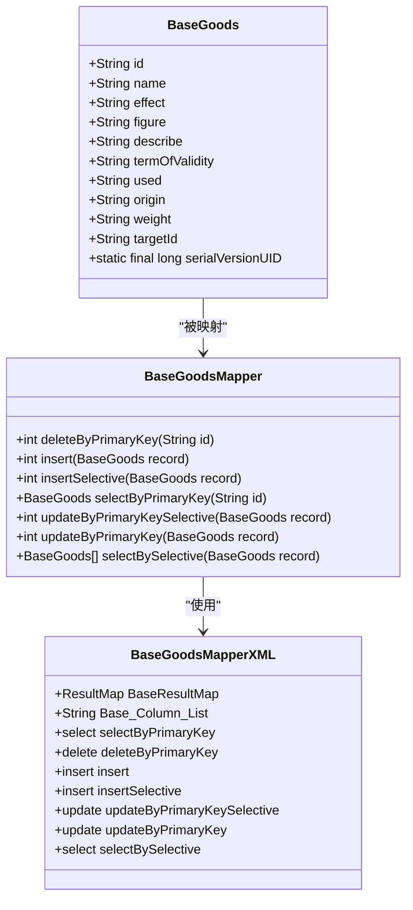
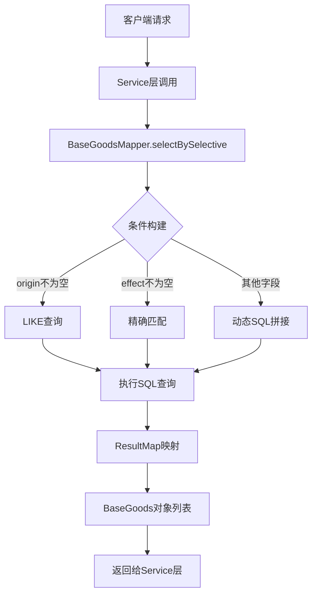
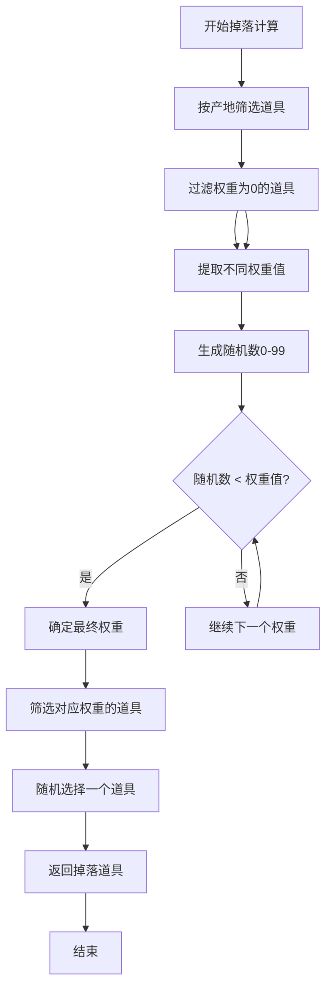
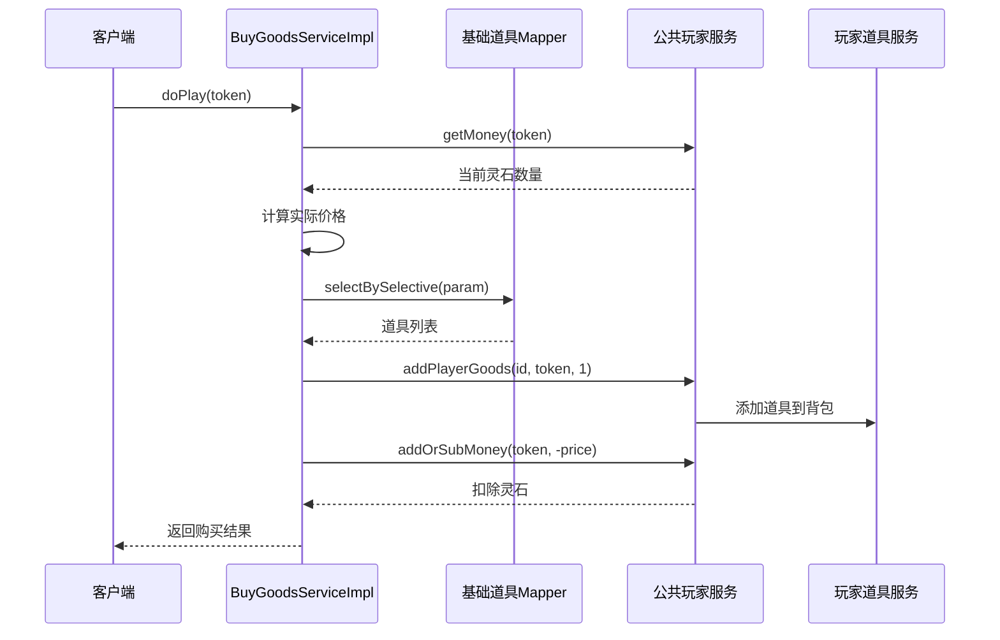
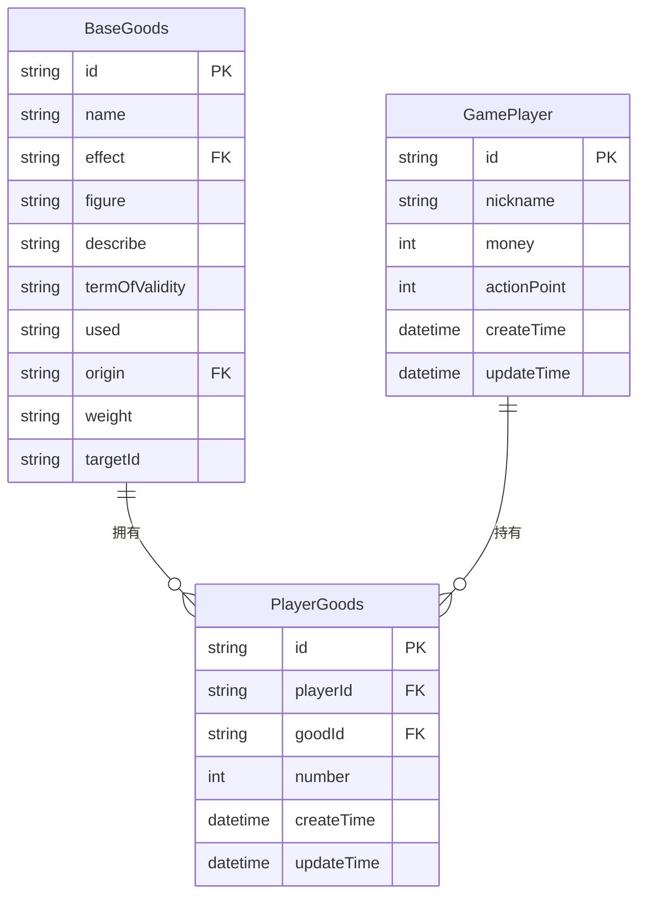
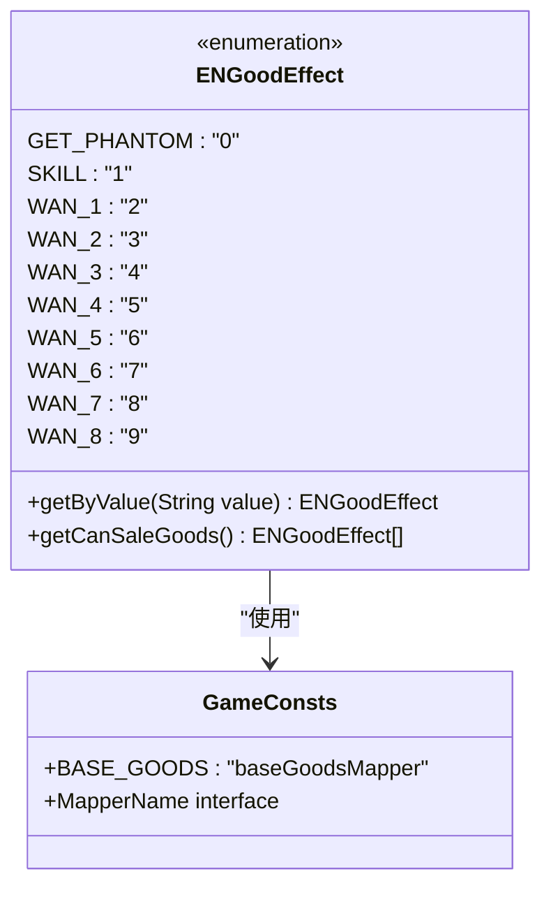

# 基础道具模型

<cite>
**本文档引用的文件**
- [BaseGoods.java](file://Game/src/main/java/com/bot/game/dao/entity/BaseGoods.java)
- [BaseGoodsMapper.java](file://Game/src/main/java/com/bot/game/dao/mapper/BaseGoodsMapper.java)
- [BaseGoodsMapper.xml](file://Game/src/main/resources/mapper/BaseGoodsMapper.xml)
- [BuyGoodsServiceImpl.java](file://Game/src/main/java/com/bot/game/service/impl/BuyGoodsServiceImpl.java)
- [CommonPlayer.java](file://Game/src/main/java/com/bot/game/service/impl/CommonPlayer.java)
- [ENGoodEffect.java](file://Game/src/main/java/com/bot/game/enums/ENGoodEffect.java)
- [GameConsts.java](file://Common/src/main/java/com/bot/common/constant/GameConsts.java)
- [SignMenuPrinter.java](file://Game/src/main/java/com/bot/game/chain/menu/SignMenuPrinter.java)
</cite>

## 目录
1. [概述](#概述)
2. [数据模型设计](#数据模型设计)
3. [核心字段业务含义](#核心字段业务含义)
4. [SQL映射机制](#sql映射机制)
5. [随机掉落算法](#随机掉落算法)
6. [服务层集成](#服务层集成)
7. [用户背包关联](#用户背包关联)
8. [扩展性设计](#扩展性设计)
9. [最佳实践](#最佳实践)
10. [总结](#总结)

## 概述

基础道具模型（BaseGoods）是游戏系统中用于定义静态配置道具属性的核心数据结构。它作为道具系统的基础配置表，承载着所有道具的基础属性信息，包括名称、效果、数值、描述、有效期、使用状态、产地和权重等关键字段。该模型不仅定义了道具的静态特性，还通过权重机制实现了基于产地的随机掉落规则，为游戏中的道具获取、购买、掉落等核心玩法提供了数据支撑。

## 数据模型设计

### 实体类结构

基础道具模型采用标准的Java实体类设计，继承Serializable接口以支持序列化操作。该设计遵循ORM映射原则，确保与数据库表结构的一致性。

**图表来源**
- [BaseGoods.java](file://Game/src/main/java/com/bot/game/dao/entity/BaseGoods.java#L10-L63)
- [BaseGoodsMapper.java](file://Game/src/main/java/com/bot/game/dao/mapper/BaseGoodsMapper.java#L7-L21)
- [BaseGoodsMapper.xml](file://Game/src/main/resources/mapper/BaseGoodsMapper.xml#L4-L15)

### 数据库表结构

基础道具表（bot_base_goods）采用MySQL存储，包含以下核心字段：

| 字段名 | 类型 | 约束 | 说明 |
|--------|------|------|------|
| id | VARCHAR(255) | PRIMARY KEY | 道具唯一标识符 |
| name | VARCHAR(255) | NOT NULL | 道具名称 |
| effect | CHAR(1) | NOT NULL | 效果类型编码 |
| figure | VARCHAR(255) | NULLABLE | 效果数值描述 |
| describe | VARCHAR(255) | NULLABLE | 道具详细描述 |
| term_of_validity | VARCHAR(255) | NULLABLE | 有效期说明 |
| used | CHAR(1) | NOT NULL | 是否可用标识 |
| origin | CHAR(1) | NULLABLE | 产地/区域标识 |
| weight | INTEGER | NULLABLE | 掉落权重值(1-100) |
| target_id | INTEGER | NULLABLE | 目标对象关联ID |

**节来源**
- [BaseGoods.java](file://Game/src/main/java/com/bot/game/dao/entity/BaseGoods.java#L15-L60)
- [BaseGoodsMapper.xml](file://Game/src/main/resources/mapper/BaseGoodsMapper.xml#L4-L14)

## 核心字段业务含义

### 名称字段（name）
- **业务含义**：标识道具的显示名称，如"唤灵符"、"大蕴丸"等
- **约束要求**：非空，最大长度255字符
- **用途**：用户界面显示、道具识别

### 效果字段（effect）
- **业务含义**：定义道具的主要功能效果，采用单字符编码
- **取值范围**：参考ENGoodEffect枚举定义
- **作用**：决定道具的具体功能类型，如"0"代表唤灵符，"1"代表技能卡等

### 数值字段（figure）
- **业务含义**：描述效果的具体数值或参数
- **示例**：治疗量、攻击力提升百分比、持续回合数等
- **灵活性**：支持多种格式的数值表达

### 描述字段（describe）
- **业务含义**：详细的道具说明文字
- **用途**：帮助玩家理解道具功能和使用方法
- **国际化**：支持多语言描述

### 有效期字段（termOfValidity）
- **业务含义**：说明道具的有效期限或使用限制
- **格式**：可自定义的时间描述格式
- **应用场景**：限时道具、周期性效果道具

### 使用状态字段（used）
- **业务含义**：标识道具是否处于可用状态
- **取值**：通常为"Y"/"N"或"1"/"0"
- **管理**：用于临时禁用或维护特定道具

### 产地字段（origin）
- **业务含义**：标识道具的来源区域或活动范围
- **取值**：如"天"、"地"、"玄"、"黄"等
- **作用**：实现基于区域的道具掉落和获取机制

### 权重字段（weight）
- **业务含义**：决定道具在相同产地下的掉落概率
- **取值范围**：1-100的整数值
- **特殊值**：0表示不掉落
- **算法**：权重越大，掉落概率越高

### 目标对象字段（targetId）
- **业务含义**：关联特定的目标对象或技能
- **用途**：限定道具的适用范围
- **可选性**：允许为空，表示通用道具

**节来源**
- [BaseGoods.java](file://Game/src/main/java/com/bot/game/dao/entity/BaseGoods.java#L18-L60)
- [ENGoodEffect.java](file://Game/src/main/java/com/bot/game/enums/ENGoodEffect.java#L16-L25)

## SQL映射机制

### MyBatis映射配置

BaseGoodsMapper.xml采用MyBatis框架实现数据访问层，提供完整的CRUD操作和条件查询功能。

**图表来源**
- [BaseGoodsMapper.xml](file://Game/src/main/resources/mapper/BaseGoodsMapper.xml#L114-L143)
- [BaseGoodsMapper.java](file://Game/src/main/java/com/bot/game/dao/mapper/BaseGoodsMapper.java#L20)

### 关键查询方法

#### selectBySelective方法
该方法实现灵活的条件查询，支持多个字段的组合查询：

- **产地模糊查询**：`origin like concat('%',#{origin,jdbcType=CHAR},'%')`
- **效果精确匹配**：`effect = #{effect,jdbcType=CHAR}`
- **其他字段动态拼接**：根据传入参数动态生成WHERE条件

#### selectByOrigin查询
虽然源码中未直接显示，但可以通过origin字段实现基于产地的道具查询，这是随机掉落算法的基础。

**节来源**
- [BaseGoodsMapper.xml](file://Game/src/main/resources/mapper/BaseGoodsMapper.xml#L114-L143)
- [BaseGoodsMapper.java](file://Game/src/main/java/com/bot/game/dao/mapper/BaseGoodsMapper.java#L20)

## 随机掉落算法

### 权重随机选择机制

基础道具模型的核心特色在于其基于权重的随机掉落算法，该算法确保了道具掉落的公平性和趣味性。

**图表来源**
- [CommonPlayer.java](file://Game/src/main/java/com/bot/game/service/impl/CommonPlayer.java#L239-L270)

### 算法实现细节

#### 权重验证流程
1. **权重过滤**：首先排除权重为0的道具（不掉落）
2. **权重去重**：提取所有不同的权重值
3. **随机抽样**：生成0-99的随机数
4. **命中判断**：比较随机数与权重值，确定最终选择的权重
5. **随机选择**：在选定权重的道具中随机选择一个

#### 概率计算原理
- 权重值决定了道具在相同产地下的相对掉落概率
- 总权重值越高的道具，被选中的机会越大
- 权重为0的道具完全不会掉落

**节来源**
- [CommonPlayer.java](file://Game/src/main/java/com/bot/game/service/impl/CommonPlayer.java#L239-L270)

## 服务层集成

### BuyGoodsServiceImpl购买服务

购买服务展示了基础道具在商业化场景中的应用，体现了道具模型与经济系统的集成。

**图表来源**
- [BuyGoodsServiceImpl.java](file://Game/src/main/java/com/bot/game/service/impl/BuyGoodsServiceImpl.java#L23-L36)
- [CommonPlayer.java](file://Game/src/main/java/com/bot/game/service/impl/CommonPlayer.java#L411-L426)

### 道具获取服务

#### getResultGoods方法
该方法实现了基于产地的随机道具获取逻辑：

1. **产地筛选**：根据指定区域获取相关道具
2. **权重过滤**：排除不可掉落的道具
3. **权重抽样**：实现基于权重的概率选择
4. **随机返回**：从最终候选列表中随机选择

#### getBoosGoods方法
针对世界BOSS战斗的特殊奖励机制：
- 根据伤害量确定奖励效果类型
- 选择对应的道具作为奖励
- 支持多种奖励等级的差异化处理

**节来源**
- [CommonPlayer.java](file://Game/src/main/java/com/bot/game/service/impl/CommonPlayer.java#L239-L292)
- [BuyGoodsServiceImpl.java](file://Game/src/main/java/com/bot/game/service/impl/BuyGoodsServiceImpl.java#L23-L36)

## 用户背包关联

### PlayerGoods关联模型

基础道具与用户背包的关联通过PlayerGoods实体实现，建立了玩家与道具之间的多对多关系。

### 背包操作流程

#### 道具添加机制
1. **检查现有道具**：查询玩家是否已拥有该道具
2. **数量更新**：如果存在则增加数量，否则创建新记录
3. **唯一标识**：使用UUID保证每条记录的唯一性

#### 道具使用校验
1. **效果匹配**：根据道具效果类型查询基础配置
2. **数量检查**：验证玩家背包中是否有足够数量
3. **使用处理**：扣除相应数量并执行道具效果

**节来源**
- [SignMenuPrinter.java](file://Game/src/main/java/com/bot/game/chain/menu/SignMenuPrinter.java#L49-L70)
- [CommonPlayer.java](file://Game/src/main/java/com/bot/game/service/impl/CommonPlayer.java#L411-L426)

## 扩展性设计

### 枚举扩展机制

ENGoodEffect枚举提供了良好的扩展点，支持新道具类型的添加：

**图表来源**
- [ENGoodEffect.java](file://Game/src/main/java/com/bot/game/enums/ENGoodEffect.java#L16-L25)
- [GameConsts.java](file://Common/src/main/java/com/bot/common/constant/GameConsts.java#L159-L173)

### 地区扩展支持
- **产地字段**：支持新的区域标识符添加
- **权重分配**：可根据新区域特点调整掉落权重
- **地域特色**：体现不同区域的道具特色

### 功能扩展方向
1. **道具分类**：支持更细粒度的道具类型划分
2. **效果增强**：扩展效果字段的表达能力
3. **条件限制**：增加使用条件和限制机制
4. **批量操作**：支持批量购买和使用功能

**节来源**
- [ENGoodEffect.java](file://Game/src/main/java/com/bot/game/enums/ENGoodEffect.java#L16-L50)
- [GameConsts.java](file://Common/src/main/java/com/bot/common/constant/GameConsts.java#L159-L173)

## 最佳实践

### 数据设计原则
1. **单一职责**：每个道具专注于特定功能
2. **最小依赖**：减少不必要的字段和关联
3. **性能优化**：合理使用索引和查询条件
4. **扩展预留**：为未来功能预留字段空间

### 权重配置建议
1. **平衡性**：确保各类型道具的总体掉落概率合理
2. **稀有度**：高价值道具应设置较低的权重
3. **频率控制**：避免某类道具过于频繁出现
4. **测试验证**：通过实际游戏数据验证权重设置

### 业务集成要点
1. **事务一致性**：确保道具获取和扣费操作的原子性
2. **状态同步**：及时更新玩家背包状态
3. **异常处理**：妥善处理各种异常情况
4. **日志记录**：记录重要的道具操作日志

### 性能优化策略
1. **缓存机制**：缓存常用道具配置信息
2. **索引优化**：为常用查询字段建立索引
3. **批量操作**：支持批量道具查询和更新
4. **分页处理**：对于大量道具的查询使用分页

## 总结

基础道具模型（BaseGoods）作为游戏系统的核心数据结构，通过精心设计的字段体系和算法机制，实现了道具系统的完整功能。该模型不仅定义了道具的基础属性，还通过权重机制实现了公平合理的随机掉落规则，为游戏的经济系统和玩法设计提供了坚实的数据基础。

### 核心优势
1. **结构清晰**：字段设计简洁明了，易于理解和维护
2. **功能完整**：涵盖道具的所有基本属性和业务需求
3. **算法公平**：基于权重的概率算法确保了掉落的公平性
4. **扩展性强**：良好的架构设计支持未来的功能扩展
5. **集成便利**：与服务层和用户系统的无缝集成

### 应用价值
- **商业化支持**：为游戏内购和道具销售提供数据基础
- **玩法丰富**：支持多样化的道具获取和使用机制
- **用户体验**：通过随机掉落增加游戏的趣味性和期待感
- **系统稳定**：可靠的数据模型保障系统运行的稳定性

基础道具模型的设计充分体现了游戏系统中数据建模的最佳实践，为构建高质量的游戏系统提供了优秀的参考范例。