# 用户道具实例模型

<cite>
**本文档引用的文件**
- [BotUserBox.java](file://Game/src/main/java/com/bot/game/dao/entity/BotUserBox.java)
- [GoodsBox.java](file://Game/src/main/java/com/bot/game/dao/entity/GoodsBox.java)
- [BotUserBoxMapper.xml](file://Game/src/main/resources/mapper/BotUserBoxMapper.xml)
- [GoodsBoxMapper.xml](file://Game/src/main/resources/mapper/GoodsBoxMapper.xml)
- [BuyGoodsServiceImpl.java](file://Game/src/main/java/com/bot/game/service/impl/BuyGoodsServiceImpl.java)
- [MyKnapsackMenuPrinter.java](file://Game/src/main/java/com/bot/game/chain/menu/MyKnapsackMenuPrinter.java)
- [CommonPlayer.java](file://Game/src/main/java/com/bot/game/service/impl/CommonPlayer.java)
- [BotUserBoxExample.java](file://Game/src/main/java/com/bot/game/dao/entity/BotUserBoxExample.java)
</cite>

## 目录
1. [简介](#简介)
2. [项目结构概述](#项目结构概述)
3. [核心数据模型](#核心数据模型)
4. [架构概览](#架构概览)
5. [详细组件分析](#详细组件分析)
6. [MyBatis映射配置](#mybatis映射配置)
7. [业务流程分析](#业务流程分析)
8. [高并发优化策略](#高并发优化策略)
9. [性能考虑](#性能考虑)
10. [故障排除指南](#故障排除指南)
11. [总结](#总结)

## 简介

用户道具实例模型是游戏系统中负责管理玩家拥有的各种道具的核心模块。该模型主要包含两个核心实体：BotUserBox和GoodsBox，分别用于记录玩家背包中的道具信息和消息附件等特殊场景的数据存储。

BotUserBox作为基础的用户道具实例，记录了用户ID、道具类型、数量等关键信息，支持动态的增删改查操作。GoodsBox则专门用于处理消息附件、临时道具等特殊场景，提供了更灵活的状态管理机制。

## 项目结构概述

用户道具实例模型在项目中的组织结构体现了清晰的分层架构设计：

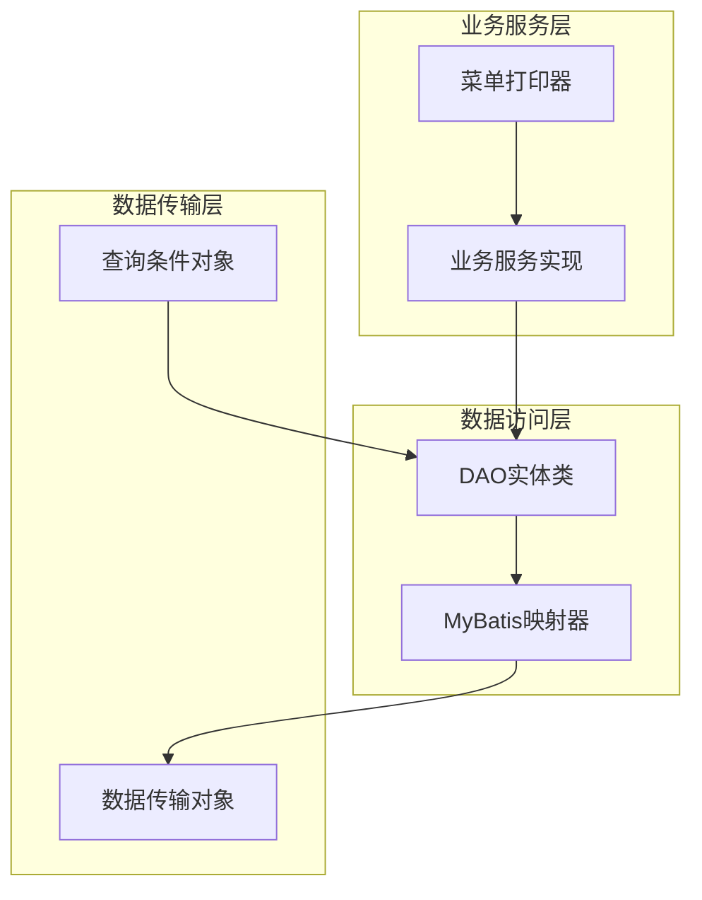

**图表来源**
- [BotUserBox.java](file://Game/src/main/java/com/bot/game/dao/entity/BotUserBox.java#L1-L203)
- [GoodsBox.java](file://Game/src/main/java/com/bot/game/dao/entity/GoodsBox.java#L1-L27)

## 核心数据模型

### BotUserBox模型设计

BotUserBox是用户道具实例的基础模型，采用了简洁而高效的设计理念：

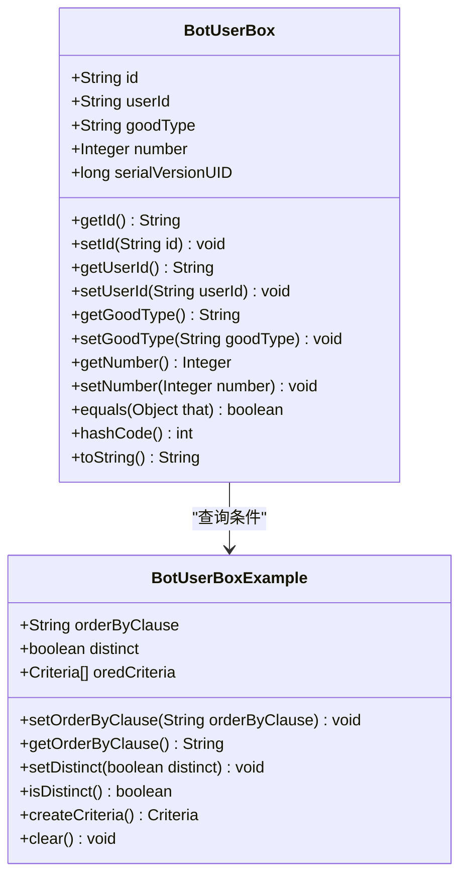

**图表来源**
- [BotUserBox.java](file://Game/src/main/java/com/bot/game/dao/entity/BotUserBox.java#L5-L203)
- [BotUserBoxExample.java](file://Game/src/main/java/com/bot/game/dao/entity/BotUserBoxExample.java#L6-L572)

#### 字段设计考量

BotUserBox的字段设计体现了以下核心考量：

1. **id字段**：采用字符串类型，便于分布式环境下的唯一性保证
2. **userId字段**：记录所属用户，支持多用户隔离
3. **goodType字段**：标识道具类型，便于分类管理和功能区分
4. **number字段**：记录道具数量，支持动态变化

每个字段都包含了相应的getter和setter方法，确保了良好的封装性和可维护性。

**章节来源**
- [BotUserBox.java](file://Game/src/main/java/com/bot/game/dao/entity/BotUserBox.java#L12-L140)

### GoodsBox模型设计

GoodsBox专门用于处理特殊场景下的道具存储需求：

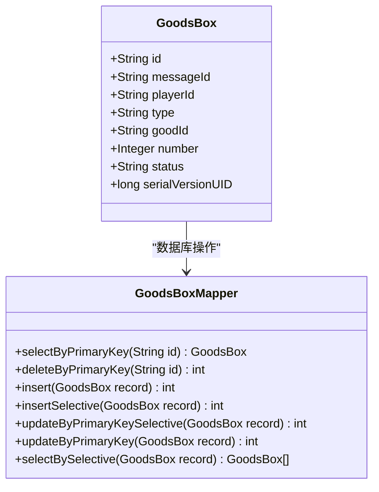

**图表来源**
- [GoodsBox.java](file://Game/src/main/java/com/bot/game/dao/entity/GoodsBox.java#L11-L27)

#### 特殊场景支持

GoodsBox的设计特别考虑了以下特殊场景：

1. **消息附件**：通过messageId字段关联到具体的消息
2. **临时道具**：通过playerId字段标识归属
3. **状态管理**：通过status字段支持道具的生命周期管理
4. **类型区分**：通过type字段区分不同类型的道具

**章节来源**
- [GoodsBox.java](file://Game/src/main/java/com/bot/game/dao/entity/GoodsBox.java#L11-L27)

## 架构概览

用户道具实例模型的整体架构采用了经典的三层架构模式：

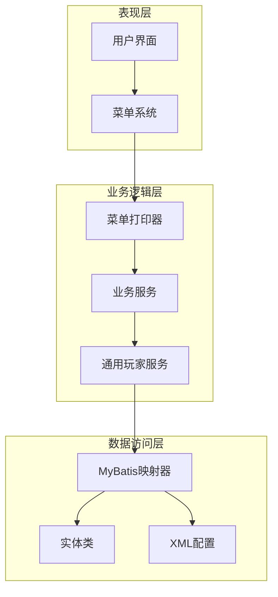

**图表来源**
- [MyKnapsackMenuPrinter.java](file://Game/src/main/java/com/bot/game/chain/menu/MyKnapsackMenuPrinter.java#L23-L78)
- [CommonPlayer.java](file://Game/src/main/java/com/bot/game/service/impl/CommonPlayer.java#L26-L445)

## 详细组件分析

### BotUserBoxMapper映射器

BotUserBoxMapper提供了完整的CRUD操作支持，包括单条记录操作和批量操作：

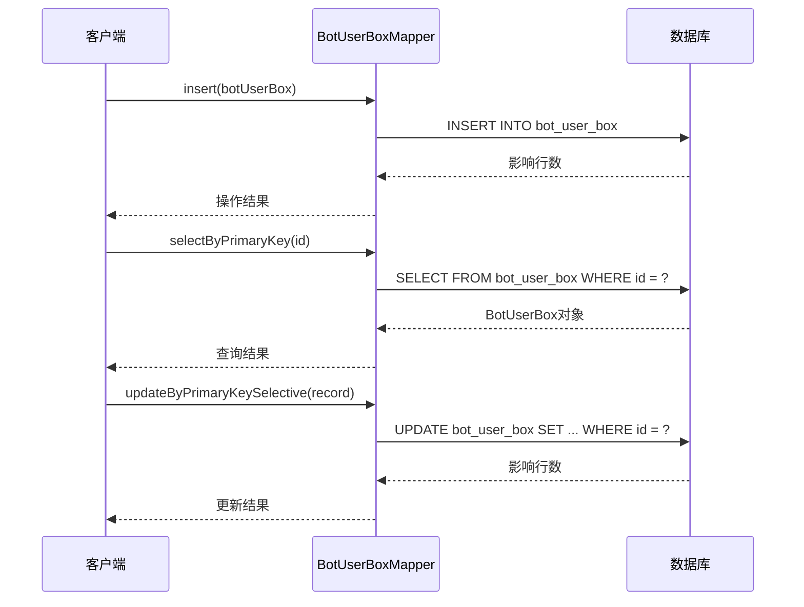

**图表来源**
- [BotUserBoxMapper.xml](file://Game/src/main/resources/mapper/BotUserBoxMapper.xml#L133-L256)

#### 批量操作支持

BotUserBoxMapper支持多种批量操作模式：

1. **条件查询**：通过BotUserBoxExample实现复杂的查询条件组合
2. **选择性插入**：只插入非空字段，提高插入效率
3. **选择性更新**：只更新指定字段，避免全量更新
4. **示例查询**：支持基于Example的动态查询构建

**章节来源**
- [BotUserBoxMapper.xml](file://Game/src/main/resources/mapper/BotUserBoxMapper.xml#L87-L104)

### GoodsBoxMapper映射器

GoodsBoxMapper专注于特殊场景下的道具管理：

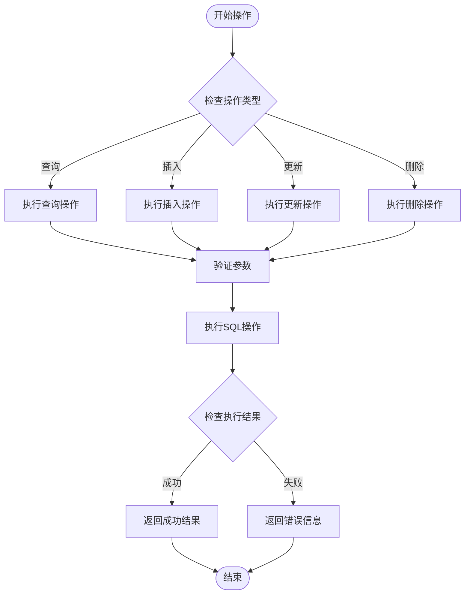

**图表来源**
- [GoodsBoxMapper.xml](file://Game/src/main/resources/mapper/GoodsBoxMapper.xml#L117-L141)

**章节来源**
- [GoodsBoxMapper.xml](file://Game/src/main/resources/mapper/GoodsBoxMapper.xml#L16-L141)

### CommonPlayer通用服务

CommonPlayer提供了用户道具的核心业务逻辑：

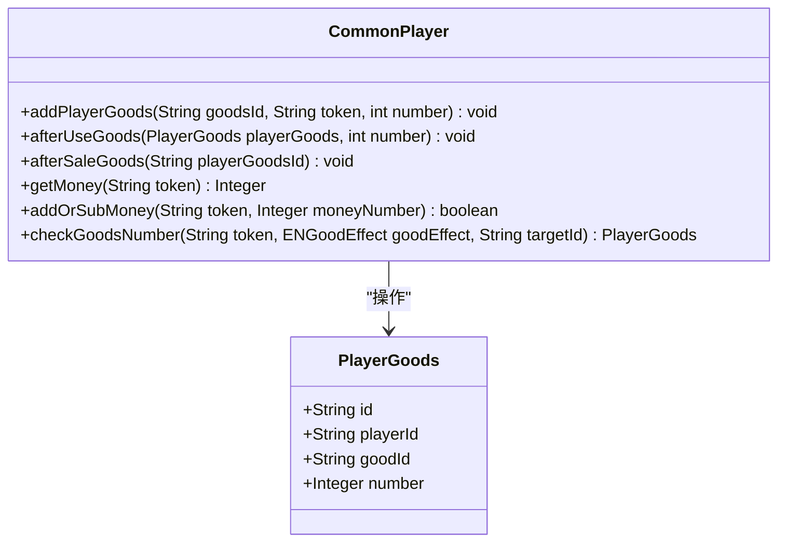

**图表来源**
- [CommonPlayer.java](file://Game/src/main/java/com/bot/game/service/impl/CommonPlayer.java#L161-L199)

#### 道具操作流程

CommonPlayer中的道具操作遵循以下流程：

1. **添加道具**：先查询是否存在相同道具，存在则更新数量，不存在则创建新记录
2. **使用道具**：根据使用数量决定是更新还是删除记录
3. **出售道具**：直接删除对应记录
4. **数量校验**：在使用前检查道具数量是否充足

**章节来源**
- [CommonPlayer.java](file://Game/src/main/java/com/bot/game/service/impl/CommonPlayer.java#L161-L199)

### MyKnapsackMenuPrinter菜单打印器

MyKnapsackMenuPrinter负责将用户道具信息以菜单形式展示给用户：

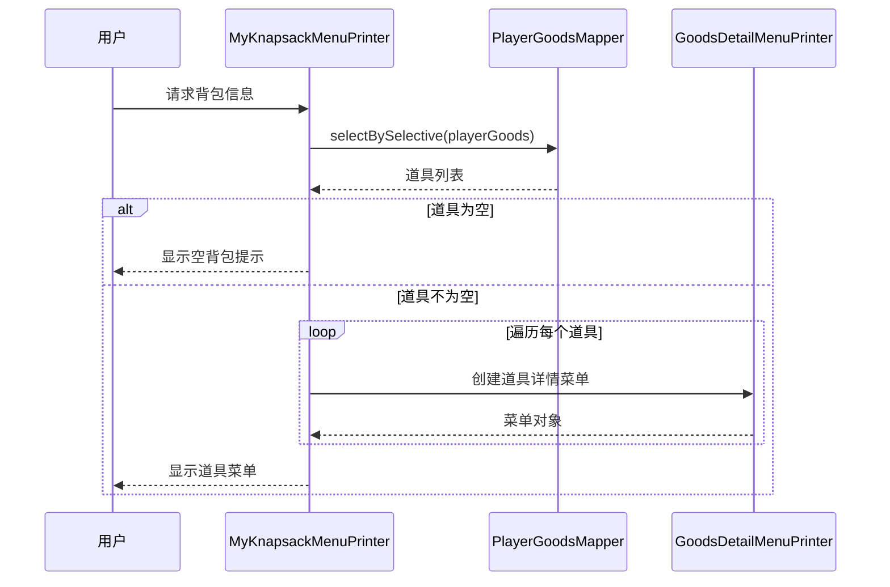

**图表来源**
- [MyKnapsackMenuPrinter.java](file://Game/src/main/java/com/bot/game/chain/menu/MyKnapsackMenuPrinter.java#L35-L78)

**章节来源**
- [MyKnapsackMenuPrinter.java](file://Game/src/main/java/com/bot/game/chain/menu/MyKnapsackMenuPrinter.java#L35-L78)

## MyBatis映射配置

### BotUserBoxMapper.xml配置

BotUserBoxMapper的XML配置展现了MyBatis的强大功能：

| 操作类型 | SQL语句 | 参数类型 | 返回类型 |
|---------|---------|----------|----------|
| 单条查询 | SELECT id, user_id, good_type, number FROM bot_user_box WHERE id = #{id} | String | BotUserBox |
| 条件查询 | SELECT DISTINCT id, user_id, good_type, number FROM bot_user_box WHERE ... | BotUserBoxExample | List<BotUserBox> |
| 插入操作 | INSERT INTO bot_user_box (id, user_id, good_type, number) VALUES (#{id}, #{userId}, #{goodType}, #{number}) | BotUserBox | int |
| 更新操作 | UPDATE bot_user_box SET user_id = #{userId}, good_type = #{goodType}, number = #{number} WHERE id = #{id} | BotUserBox | int |
| 删除操作 | DELETE FROM bot_user_box WHERE id = #{id} | String | int |

**章节来源**
- [BotUserBoxMapper.xml](file://Game/src/main/resources/mapper/BotUserBoxMapper.xml#L105-L256)

### GoodsBoxMapper.xml配置

GoodsBoxMapper的配置更加灵活，支持多种查询条件：

| 查询方式 | 支持字段 | 使用场景 |
|---------|---------|----------|
| 主键查询 | id | 快速定位特定记录 |
| 条件查询 | messageId, playerId, type, goodId, number, status | 多维度筛选 |
| 选择性插入 | 所有字段 | 只插入非空字段 |
| 选择性更新 | 所有字段 | 只更新指定字段 |

**章节来源**
- [GoodsBoxMapper.xml](file://Game/src/main/resources/mapper/GoodsBoxMapper.xml#L16-L141)

## 业务流程分析

### 购买道具流程

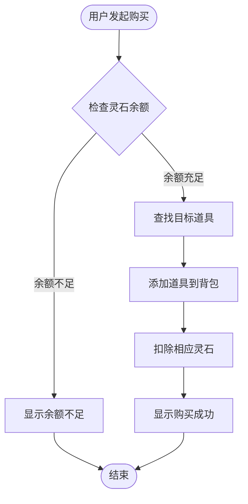

**图表来源**
- [BuyGoodsServiceImpl.java](file://Game/src/main/java/com/bot/game/service/impl/BuyGoodsServiceImpl.java#L23-L36)

**章节来源**
- [BuyGoodsServiceImpl.java](file://Game/src/main/java/com/bot/game/service/impl/BuyGoodsServiceImpl.java#L23-L36)

### 道具使用流程

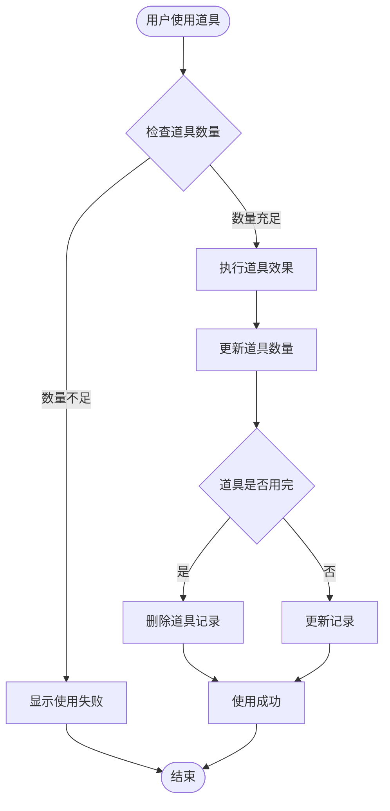

**图表来源**
- [CommonPlayer.java](file://Game/src/main/java/com/bot/game/service/impl/CommonPlayer.java#L183-L191)

### 背包展示流程

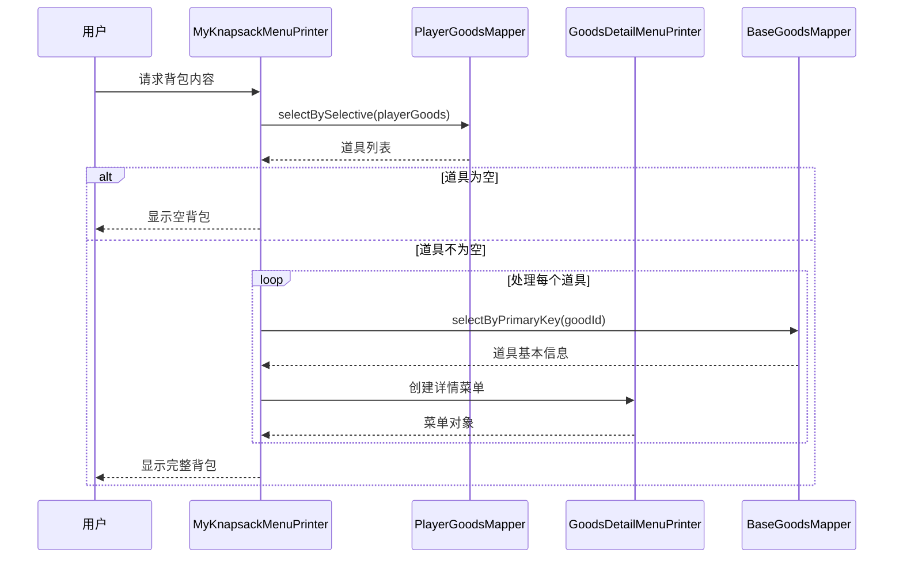

**图表来源**
- [MyKnapsackMenuPrinter.java](file://Game/src/main/java/com/bot/game/chain/menu/MyKnapsackMenuPrinter.java#L35-L78)

## 高并发优化策略

### 库存竞争问题分析

在高并发场景下，用户道具的增删改查操作可能面临以下竞争问题：

1. **库存超卖**：多个请求同时检查库存，导致实际库存小于0
2. **重复购买**：同一用户同时发起多次购买请求
3. **数据一致性**：并发操作可能导致数据不一致

### 优化方案

#### 方案一：乐观锁机制

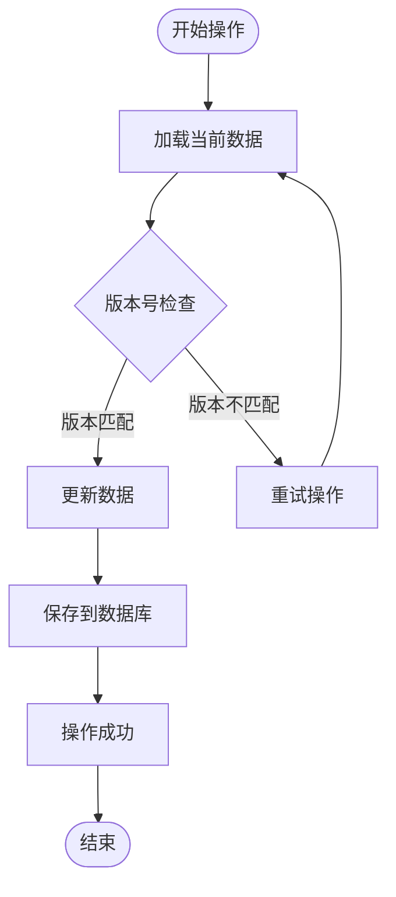

#### 方案二：Redis原子操作

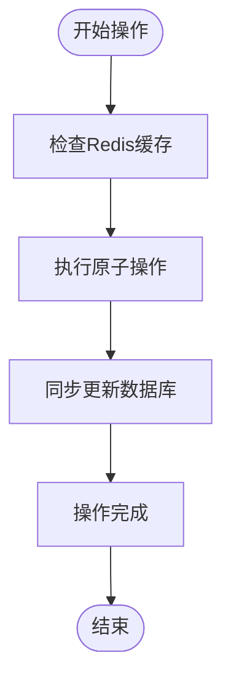

#### 方案三：分布式锁

对于关键业务操作，可以采用分布式锁机制：

1. **Redis分布式锁**：使用Redis的SETNX命令实现
2. **数据库锁**：使用SELECT ... FOR UPDATE
3. **Zookeeper锁**：利用Zookeeper的临时顺序节点

### 推荐优化策略

1. **读写分离**：对于查询密集的操作，采用读写分离架构
2. **缓存策略**：将常用道具信息缓存在内存中
3. **批量操作**：将多个小操作合并为批量操作
4. **异步处理**：对于非关键路径的操作采用异步处理

## 性能考虑

### 查询优化

1. **索引设计**：在userId、goodType等常用查询字段上建立索引
2. **分页查询**：对于大量数据的查询采用分页机制
3. **缓存命中**：合理使用缓存减少数据库访问

### 写入优化

1. **批量插入**：将多个插入操作合并为批量插入
2. **事务控制**：合理控制事务范围，避免长时间锁定
3. **异步写入**：对于非关键数据采用异步写入

### 内存优化

1. **对象池**：对于频繁创建销毁的对象使用对象池
2. **序列化优化**：优化对象的序列化和反序列化过程
3. **垃圾回收**：合理配置JVM参数，优化垃圾回收策略

## 故障排除指南

### 常见问题及解决方案

#### 1. 数据不一致问题

**症状**：用户看到的道具数量与实际不符

**排查步骤**：
- 检查数据库连接是否正常
- 验证事务是否正确提交
- 查看是否有并发冲突

**解决方案**：
- 实施数据校验机制
- 增加重试机制
- 使用分布式事务

#### 2. 性能下降问题

**症状**：道具操作响应时间过长

**排查步骤**：
- 分析慢查询日志
- 检查数据库索引使用情况
- 监控系统资源使用率

**解决方案**：
- 优化数据库查询
- 增加缓存层
- 实施读写分离

#### 3. 并发冲突问题

**症状**：出现库存超卖或重复操作

**排查步骤**：
- 检查并发控制机制
- 分析操作日志
- 验证锁机制有效性

**解决方案**：
- 实施乐观锁或悲观锁
- 优化业务流程
- 增加重试机制

**章节来源**
- [CommonPlayer.java](file://Game/src/main/java/com/bot/game/service/impl/CommonPlayer.java#L337-L361)

## 总结

用户道具实例模型作为游戏系统的核心组件，通过BotUserBox和GoodsBox两个实体类，实现了对玩家道具的全面管理。该模型具有以下特点：

1. **设计简洁**：字段设计精简，功能明确，易于理解和维护
2. **扩展性强**：支持多种查询条件和操作模式，适应不同的业务需求
3. **性能优异**：通过MyBatis映射配置和合理的索引设计，确保了良好的查询性能
4. **并发安全**：提供了多种并发控制机制，能够应对高并发场景

在实际应用中，建议根据具体的业务场景选择合适的优化策略，特别是在高并发环境下，需要重点关注数据一致性和性能优化。通过合理的架构设计和优化措施，用户道具实例模型能够为游戏系统提供稳定可靠的服务支撑。