# 道具与装备系统模型

<cite>
**本文档引用文件**  
- [BaseGoods.java](file://Game/src/main/java/com/bot/game/dao/entity/BaseGoods.java)
- [BaseWeapon.java](file://Game/src/main/java/com/bot/game/dao/entity/BaseWeapon.java)
- [GoodsBox.java](file://Game/src/main/java/com/bot/game/dao/entity/GoodsBox.java)
- [BotUserBox.java](file://Game/src/main/java/com/bot/game/dao/entity/BotUserBox.java)
- [PlayerGoods.java](file://Game/src/main/java/com/bot/game/dao/entity/PlayerGoods.java)
- [PlayerWeapon.java](file://Game/src/main/java/com/bot/game/dao/entity/PlayerWeapon.java)
- [BaseGoodsMapper.xml](file://Game/src/main/resources/mapper/BaseGoodsMapper.xml)
- [BaseWeaponMapper.xml](file://Game/src/main/resources/mapper/BaseWeaponMapper.xml)
- [GoodsBoxMapper.xml](file://Game/src/main/resources/mapper/GoodsBoxMapper.xml)
- [BotUserBoxMapper.xml](file://Game/src/main/resources/mapper/BotUserBoxMapper.xml)
- [BuyGoodsServiceImpl.java](file://Game/src/main/java/com/bot/game/service/impl/BuyGoodsServiceImpl.java)
- [CommonPlayer.java](file://Game/src/main/java/com/bot/game/service/impl/CommonPlayer.java)
- [ENGoodEffect.java](file://Game/src/main/java/com/bot/game/enums/ENGoodEffect.java)
- [EquipInfo.java](file://Base/src/main/java/com/bot/base/dto/jx/attribute/EquipInfo.java)
- [JXAttributeInitUtil.java](file://Base/src/main/java/com/bot/base/util/JXAttributeInitUtil.java)
- [InventoryServiceImpl.java](file://Life/src/main/java/com/bot/life/service/impl/InventoryServiceImpl.java)
</cite>

## 目录
1. [系统概述](#系统概述)
2. [核心数据模型设计](#核心数据模型设计)
3. [静态配置与动态实例分离策略](#静态配置与动态实例分离策略)
4. [MyBatis映射配置与复杂业务逻辑实现](#mybatis映射配置与复杂业务逻辑实现)
5. [典型使用场景的数据库操作序列](#典型使用场景的数据库操作序列)
6. [并发修改问题与解决方案](#并发修改问题与解决方案)
7. [总结](#总结)

## 系统概述

道具与装备系统是游戏核心功能模块之一，负责管理游戏中的各类道具、装备及其相关业务逻辑。系统采用分层架构设计，通过静态配置表与动态实例化数据的分离策略，实现了配置灵活性与运行效率的平衡。本系统支持道具购买、装备、合成、丢弃等核心玩法，并通过MyBatis框架实现复杂的数据持久化操作。

**本节来源**
- [浮生卷开发说明.md](file://浮生卷开发说明.md#L284-L286)

## 核心数据模型设计

### 基础道具模型（BaseGoods）

`BaseGoods`实体类定义了基础道具的静态属性，包括道具ID、名称、效果、数值、描述、有效期、可用状态、产地、产出权重和目标对象ID等字段。该模型作为道具系统的配置基础，存储了所有道具的元数据信息。

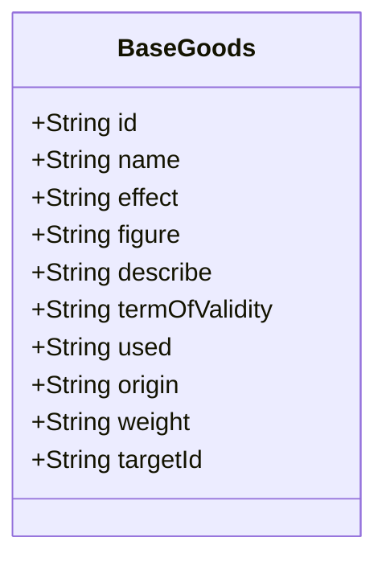

**图示来源**
- [BaseGoods.java](file://Game/src/main/java/com/bot/game/dao/entity/BaseGoods.java#L1-L63)

### 基础武器模型（BaseWeapon）

`BaseWeapon`实体类定义了基础武器的静态属性，包括武器ID、名称、效果和描述等字段。与基础道具类似，该模型存储了武器类装备的配置信息，为后续的装备属性继承提供了基础数据支持。

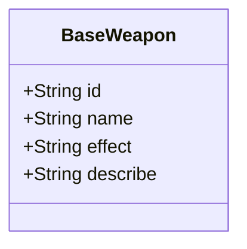

**图示来源**
- [BaseWeapon.java](file://Game/src/main/java/com/bot/game/dao/entity/BaseWeapon.java#L1-L21)

### 道具箱模型（GoodsBox）

`GoodsBox`实体类用于管理消息关联的道具箱，包含ID、消息ID、玩家ID、类型、道具ID、数量和状态等字段。该模型实现了道具与消息系统的关联，支持通过消息传递道具的功能。

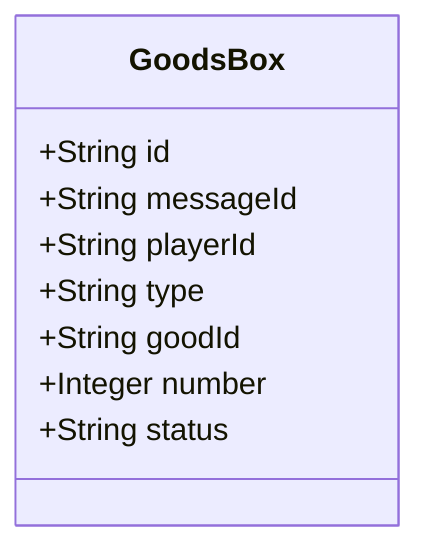

**图示来源**
- [GoodsBox.java](file://Game/src/main/java/com/bot/game/dao/entity/GoodsBox.java#L1-L27)

### 用户背包模型（BotUserBox）

`BotUserBox`实体类是用户道具库存的核心模型，包含ID、用户ID、道具类型和数量等字段。该模型实现了用户道具的库存管理，支持对用户拥有的各类道具进行增减操作。

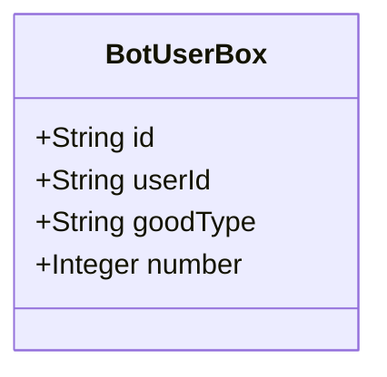

**图示来源**
- [BotUserBox.java](file://Game/src/main/java/com/bot/game/dao/entity/BotUserBox.java#L1-L203)

### 玩家道具实例模型（PlayerGoods）

`PlayerGoods`实体类表示玩家拥有的具体道具实例，包含ID、玩家ID、道具ID和数量等字段。该模型将基础道具配置与玩家实例关联，实现了道具的实例化管理。

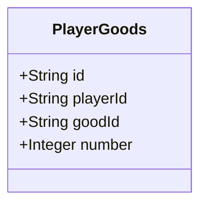

**图示来源**
- [PlayerGoods.java](file://Game/src/main/java/com/bot/game/dao/entity/PlayerGoods.java#L1-L21)

### 玩家武器实例模型（PlayerWeapon）

`PlayerWeapon`实体类表示玩家拥有的具体武器实例，包含ID、玩家ID、武器ID和等级等字段。该模型支持武器的等级系统，实现了武器的养成机制。

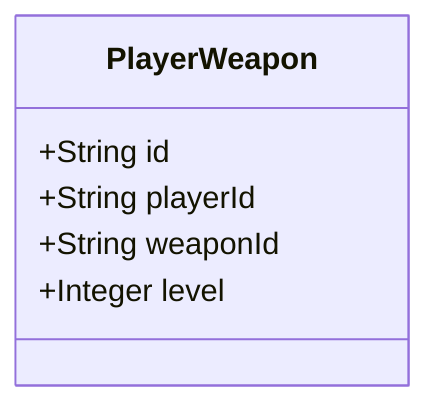

**图示来源**
- [PlayerWeapon.java](file://Game/src/main/java/com/bot/game/dao/entity/PlayerWeapon.java#L1-L21)

## 静态配置与动态实例分离策略

系统采用静态配置与动态实例分离的设计模式，将道具和装备的定义信息与玩家实例数据分开存储和管理。

### 静态配置层

静态配置层由`BaseGoods`和`BaseWeapon`等实体类构成，存储了所有道具和装备的基础属性。这些配置数据在游戏运行期间基本保持不变，可以通过后台管理系统进行更新。配置数据的分离使得游戏平衡性调整更加方便，无需修改代码即可调整道具属性。

### 动态实例层

动态实例层由`BotUserBox`、`PlayerGoods`和`PlayerWeapon`等实体类构成，存储了每个玩家拥有的具体道具和装备实例。这些数据在游戏运行过程中会频繁变化，反映了玩家的实际游戏进度和物品持有情况。

### 分离优势

1. **配置灵活性**：可以通过修改配置表调整游戏平衡性，无需重新编译代码。
2. **数据一致性**：确保所有玩家使用的同一道具具有相同的属性定义。
3. **扩展性**：新增道具类型时，只需添加配置数据，无需修改核心逻辑代码。
4. **维护性**：配置数据与实例数据分离，降低了数据管理的复杂度。

**本节来源**
- [BaseGoods.java](file://Game/src/main/java/com/bot/game/dao/entity/BaseGoods.java#L1-L63)
- [BaseWeapon.java](file://Game/src/main/java/com/bot/game/dao/entity/BaseWeapon.java#L1-L21)
- [BotUserBox.java](file://Game/src/main/java/com/bot/game/dao/entity/BotUserBox.java#L1-L203)
- [PlayerGoods.java](file://Game/src/main/java/com/bot/game/dao/entity/PlayerGoods.java#L1-L21)
- [PlayerWeapon.java](file://Game/src/main/java/com/bot/game/dao/entity/PlayerWeapon.java#L1-L21)

## MyBatis映射配置与复杂业务逻辑实现

### 装备属性继承实现

通过MyBatis的`resultMap`配置，系统实现了装备属性的继承机制。在`BaseWeaponMapper.xml`中，`BaseResultMap`定义了基础武器的属性映射关系，当查询具体武器实例时，会自动继承这些基础属性。

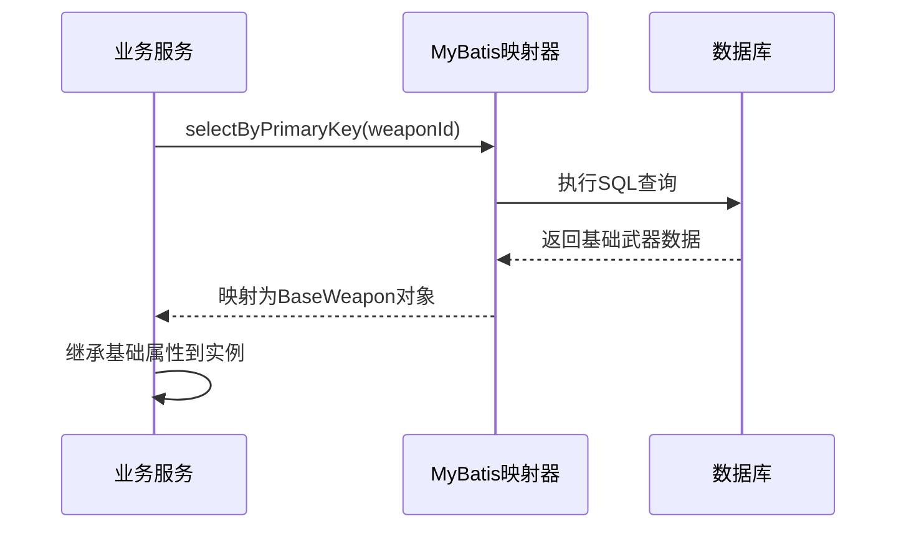

**图示来源**
- [BaseWeaponMapper.xml](file://Game/src/main/resources/mapper/BaseWeaponMapper.xml#L1-L86)

### 道具合成规则实现

道具合成规则通过`ENGoodEffect`枚举类和`BuyGoodsServiceImpl`服务类协同实现。枚举类定义了各种道具的效果和价格，服务类根据这些配置执行具体的合成逻辑。

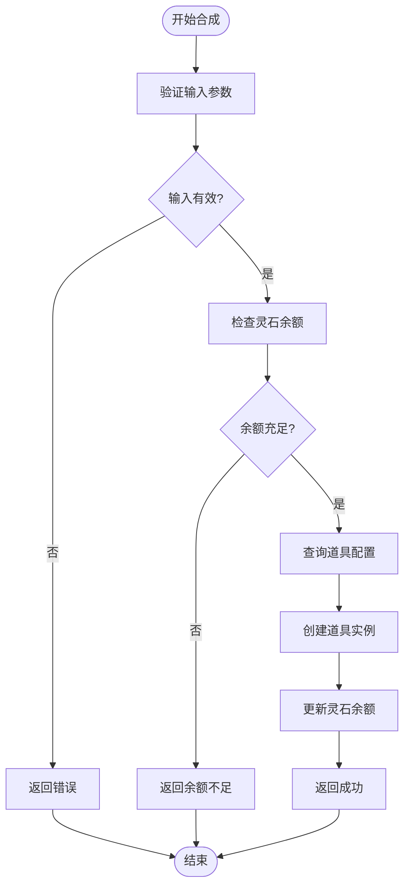

**图示来源**
- [ENGoodEffect.java](file://Game/src/main/java/com/bot/game/enums/ENGoodEffect.java#L1-L51)
- [BuyGoodsServiceImpl.java](file://Game/src/main/java/com/bot/game/service/impl/BuyGoodsServiceImpl.java#L1-L39)

## 典型使用场景的数据库操作序列

### 购买道具场景

购买道具的数据库操作序列如下：

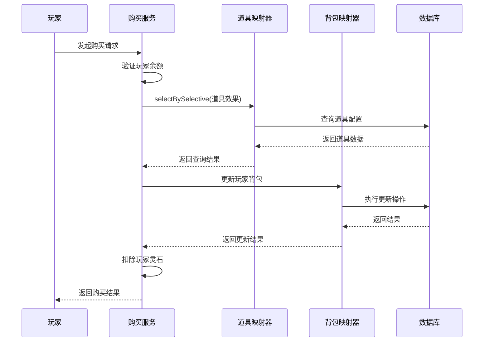

**图示来源**
- [BuyGoodsServiceImpl.java](file://Game/src/main/java/com/bot/game/service/impl/BuyGoodsServiceImpl.java#L1-L39)
- [BaseGoodsMapper.xml](file://Game/src/main/resources/mapper/BaseGoodsMapper.xml#L1-L144)
- [BotUserBoxMapper.xml](file://Game/src/main/resources/mapper/BotUserBoxMapper.xml#L1-L256)

### 装备武器场景

装备武器的数据库操作序列如下：

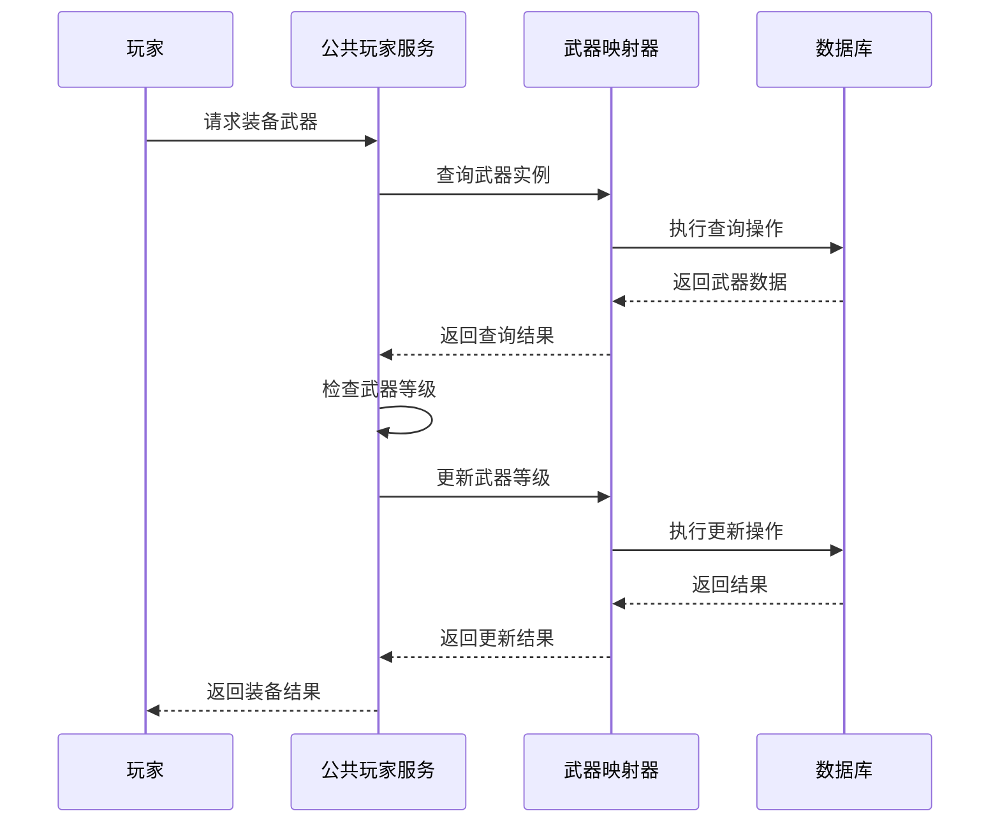

**图示来源**
- [CommonPlayer.java](file://Game/src/main/java/com/bot/game/service/impl/CommonPlayer.java#L76-L384)
- [BaseWeaponMapper.xml](file://Game/src/main/resources/mapper/BaseWeaponMapper.xml#L1-L86)

### 道具合成场景

道具合成的数据库操作序列如下：

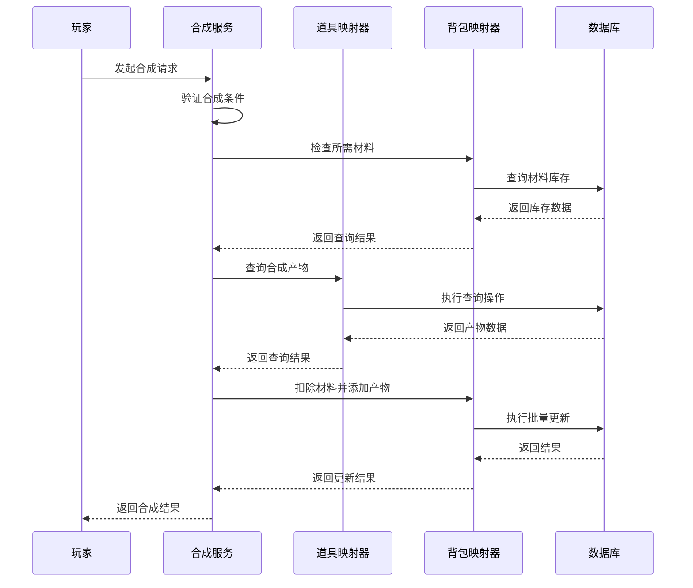

**图示来源**
- [BuyGoodsServiceImpl.java](file://Game/src/main/java/com/bot/game/service/impl/BuyGoodsServiceImpl.java#L1-L39)
- [BaseGoodsMapper.xml](file://Game/src/main/resources/mapper/BaseGoodsMapper.xml#L1-L144)
- [BotUserBoxMapper.xml](file://Game/src/main/resources/mapper/BotUserBoxMapper.xml#L1-L256)

### 丢弃道具场景

丢弃道具的数据库操作序列如下：

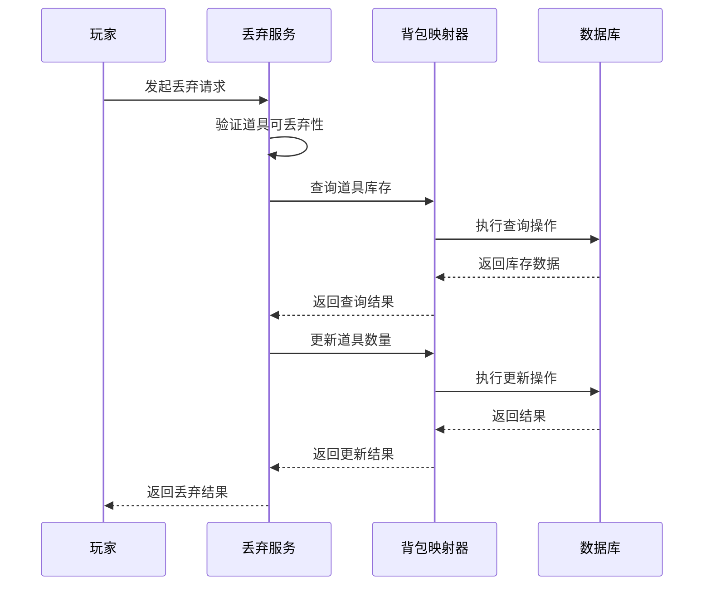

**图示来源**
- [BotUserBoxMapper.xml](file://Game/src/main/resources/mapper/BotUserBoxMapper.xml#L1-L256)

## 并发修改问题与解决方案

### 并发问题分析

道具系统在高并发场景下可能面临以下问题：
1. **库存超卖**：多个玩家同时购买限量道具，可能导致库存数量变为负数。
2. **数据不一致**：玩家同时进行多个道具操作，可能导致背包数据不一致。
3. **重复操作**：网络延迟导致玩家重复提交请求，造成道具重复获得。

### 解决方案

#### 版本号控制

通过在`BotUserBox`表中添加版本号字段，实现乐观锁机制。每次更新数据时，都会检查版本号是否匹配，确保数据的一致性。

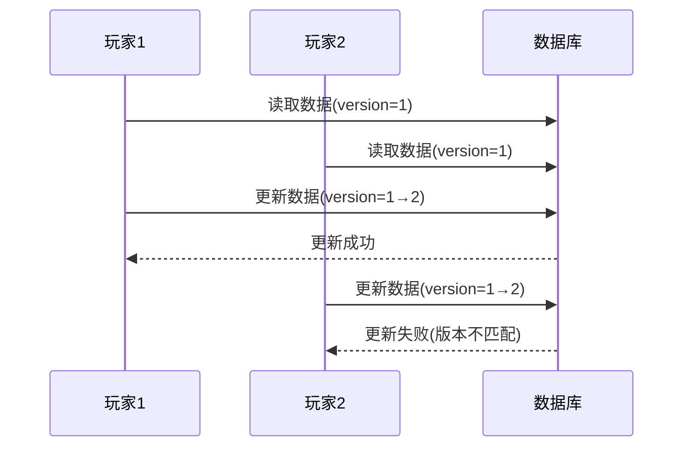

#### 分布式锁机制

对于关键操作，使用分布式锁确保同一时间只有一个请求能够执行。系统可以基于Redis实现分布式锁，防止并发修改问题。

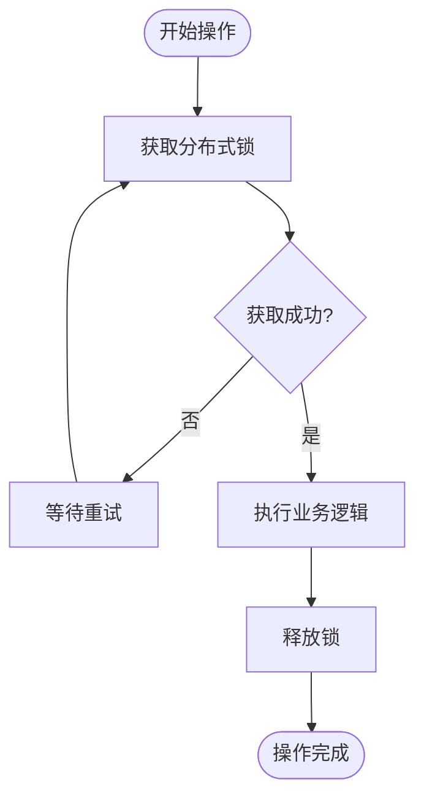

#### 数据库事务

对于涉及多个表的复杂操作，使用数据库事务确保操作的原子性。通过MyBatis的事务管理机制，确保所有操作要么全部成功，要么全部回滚。

**本节来源**
- [BotUserBoxMapper.xml](file://Game/src/main/resources/mapper/BotUserBoxMapper.xml#L1-L256)
- [CommonPlayer.java](file://Game/src/main/java/com/bot/game/service/impl/CommonPlayer.java#L76-L384)

## 总结

道具与装备系统通过精心设计的数据模型和合理的架构分离，实现了灵活的配置管理和高效的运行性能。系统采用静态配置与动态实例分离策略，通过MyBatis框架实现了复杂的业务逻辑。对于典型的使用场景，系统提供了完整的数据库操作序列，确保了数据的一致性和完整性。针对并发修改问题，建议采用版本号控制或分布式锁机制，以保障系统的稳定性和可靠性。

**本节来源**
- [BaseGoods.java](file://Game/src/main/java/com/bot/game/dao/entity/BaseGoods.java#L1-L63)
- [BaseWeapon.java](file://Game/src/main/java/com/bot/game/dao/entity/BaseWeapon.java#L1-L21)
- [GoodsBox.java](file://Game/src/main/java/com/bot/game/dao/entity/GoodsBox.java#L1-L27)
- [BotUserBox.java](file://Game/src/main/java/com/bot/game/dao/entity/BotUserBox.java#L1-L203)