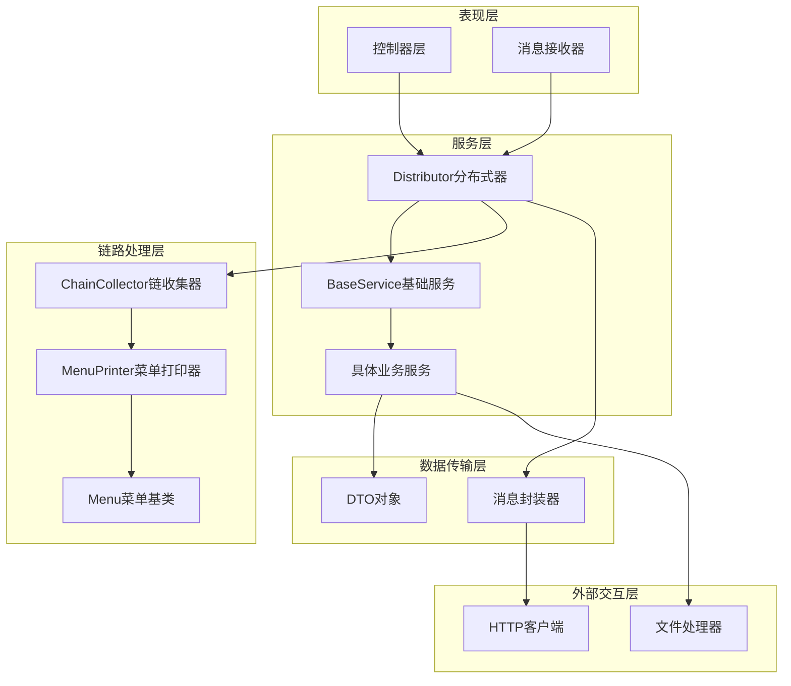
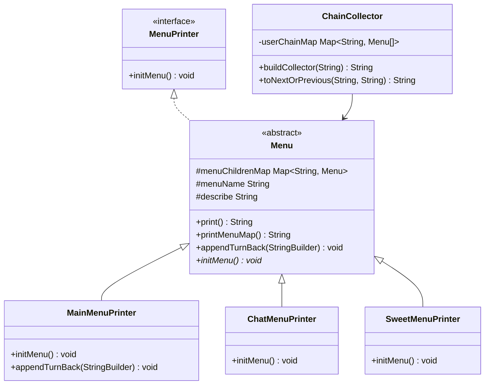
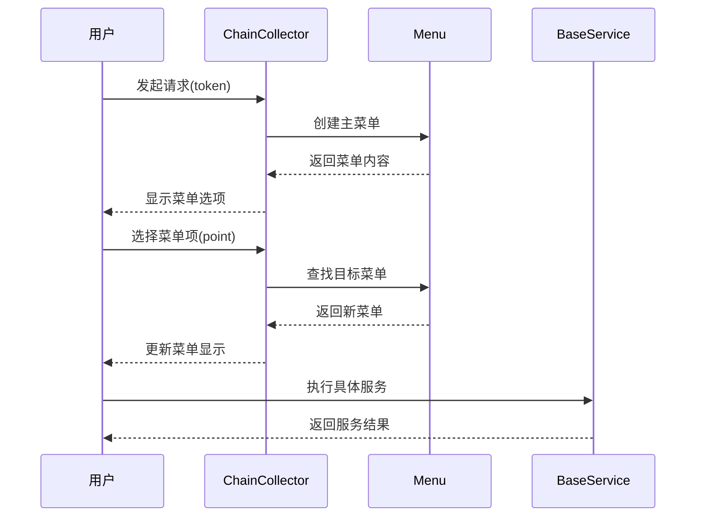
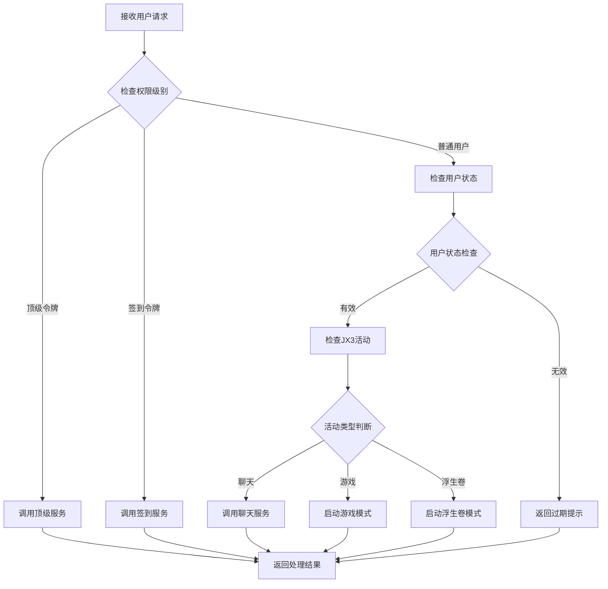
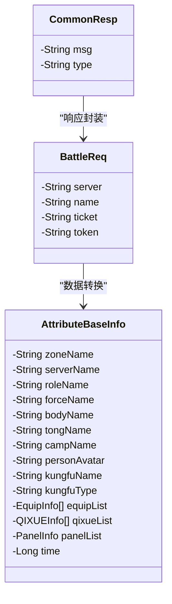
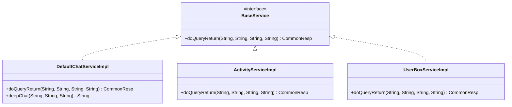

# Base模块深度解析

<cite>
**本文档中引用的文件**
- [MainMenuPrinter.java](file://Base/src/main/java/com/bot/base/chain/menu/MainMenuPrinter.java)
- [MenuPrinter.java](file://Base/src/main/java/com/bot/base/chain/MenuPrinter.java)
- [ChainCollector.java](file://Base/src/main/java/com/bot/base/chain/ChainCollector.java)
- [Menu.java](file://Base/src/main/java/com/bot/base/chain/Menu.java)
- [Collector.java](file://Base/src/main/java/com/bot/base/chain/Collector.java)
- [DistributorServiceImpl.java](file://Base/src/main/java/com/bot/base/service/impl/DistributorServiceImpl.java)
- [MessageSender.java](file://Base/src/main/java/com/bot/base/commom/MessageSender.java)
- [BaseService.java](file://Base/src/main/java/com/bot/base/service/BaseService.java)
- [Distributor.java](file://Base/src/main/java/com/bot/base/service/Distributor.java)
- [BattleReq.java](file://Base/src/main/java/com/bot/base/dto/jx/BattleReq.java)
- [AttributeBaseInfo.java](file://Base/src/main/java/com/bot/base/dto/jx/attribute/AttributeBaseInfo.java)
- [CommonResp.java](file://Base/src/main/java/com/bot/base/dto/CommonResp.java)
- [ChatMenuPrinter.java](file://Base/src/main/java/com/bot/base/chain/menu/ChatMenuPrinter.java)
- [SweetMenuPrinter.java](file://Base/src/main/java/com/bot/base/chain/menu/SweetMenuPrinter.java)
- [DefaultChatServiceImpl.java](file://Base/src/main/java/com/bot/base/service/impl/DefaultChatServiceImpl.java)
- [JXAttributeInitUtil.java](file://Base/src/main/java/com/bot/base/util/JXAttributeInitUtil.java)
</cite>

## 目录
1. [模块概述](#模块概述)
2. [核心架构设计](#核心架构设计)
3. [菜单打印体系详解](#菜单打印体系详解)
4. [指令收集与处理链](#指令收集与处理链)
5. [消息分发与发送机制](#消息分发与发送机制)
6. [外部系统数据交互](#外部系统数据交互)
7. [服务层统一接口](#服务层统一接口)
8. [扩展性与可维护性](#扩展性与可维护性)
9. [总结](#总结)

## 模块概述

Base模块作为整个机器人系统的基础服务提供者，承担着核心基础设施的角色。它提供了统一的菜单管理、指令处理、消息分发和外部系统交互能力，为上层业务模块提供了稳定可靠的基础支撑。

### 核心特性

- **菜单驱动的交互模式**：采用树形菜单结构，提供直观的用户交互体验
- **统一的服务接口**：通过BaseService接口实现服务的标准化管理
- **灵活的消息分发**：支持多种消息类型的封装和发送
- **强大的扩展能力**：基于Spring框架的依赖注入和组件化设计

## 核心架构设计

Base模块采用了分层架构设计，主要包含以下核心层次：

**图表来源**
- [DistributorServiceImpl.java](file://Base/src/main/java/com/bot/base/service/impl/DistributorServiceImpl.java#L41-L90)
- [BaseService.java](file://Base/src/main/java/com/bot/base/service/BaseService.java#L9-L18)

## 菜单打印体系详解

### 设计模式分析

Base模块的菜单打印体系采用了经典的策略模式和组合模式相结合的设计模式：

**图表来源**
- [MenuPrinter.java](file://Base/src/main/java/com/bot/base/chain/MenuPrinter.java#L7-L14)
- [Menu.java](file://Base/src/main/java/com/bot/base/chain/Menu.java#L15-L55)
- [MainMenuPrinter.java](file://Base/src/main/java/com/bot/base/chain/menu/MainMenuPrinter.java#L13-L37)

### MenuPrinter抽象类职责

MenuPrinter接口定义了菜单的基本契约，要求所有菜单实现类必须提供初始化菜单的能力。这种设计确保了菜单系统的统一性和可扩展性。

### 具体菜单实现类分析

#### 主菜单（MainMenuPrinter）

主菜单作为整个菜单体系的根节点，负责组织和管理所有子菜单：

**核心功能**：
- 定义主菜单的子菜单关系
- 提供菜单导航入口
- 实现菜单层级结构

**扩展机制**：
- 支持动态添加新的菜单项
- 可配置菜单显示顺序
- 支持菜单项的条件显示

#### 其他菜单实现

每个具体菜单类都有其特定的职责：

- **ChatMenuPrinter**：处理聊天相关功能
- **SweetMenuPrinter**：处理情话功能
- **GameMenuPrinter**：处理游戏相关功能

这些菜单类都继承自Menu基类，共享统一的打印和导航功能。

**章节来源**
- [MainMenuPrinter.java](file://Base/src/main/java/com/bot/base/chain/menu/MainMenuPrinter.java#L13-L37)
- [ChatMenuPrinter.java](file://Base/src/main/java/com/bot/base/chain/menu/ChatMenuPrinter.java#L8-L20)
- [SweetMenuPrinter.java](file://Base/src/main/java/com/bot/base/chain/menu/SweetMenuPrinter.java#L12-L24)

## 指令收集与处理链

### ChainCollector的作用机制

ChainCollector是Base模块中负责指令收集和处理链构建的核心组件，它实现了用户交互状态的管理和菜单链路的维护。

**图表来源**
- [ChainCollector.java](file://Base/src/main/java/com/bot/base/chain/ChainCollector.java#L24-L56)

### Collector接口设计

Collector接口定义了指令收集器的核心功能：

**核心方法**：
- `buildCollector(String token)`：构建初始菜单链路
- `toNextOrPrevious(String token, String point)`：导航到下一个或上一个菜单

### 处理链构建流程

1. **初始化阶段**：创建主菜单并建立用户与菜单的关联
2. **导航阶段**：根据用户输入在菜单树中导航
3. **执行阶段**：将非菜单指令路由到对应的服务

**章节来源**
- [ChainCollector.java](file://Base/src/main/java/com/bot/base/chain/ChainCollector.java#L18-L57)
- [Collector.java](file://Base/src/main/java/com/bot/base/chain/Collector.java#L7-L22)

## 消息分发与发送机制

### DistributorServiceImpl核心功能

DistributorServiceImpl是Base模块的消息分发中心，负责接收用户请求并分发给相应的服务处理。

**图表来源**
- [DistributorServiceImpl.java](file://Base/src/main/java/com/bot/base/service/impl/DistributorServiceImpl.java#L216-L361)

### MessageSender消息封装与发送

MessageSender负责将处理后的消息封装并通过HTTP协议发送给外部系统：

**核心功能**：
- 消息格式标准化
- HTTP请求封装
- 异常处理和日志记录

**配置参数**：
- RobotQQ：机器人QQ号
- Key：API密钥
- URL：发送接口地址

**章节来源**
- [DistributorServiceImpl.java](file://Base/src/main/java/com/bot/base/service/impl/DistributorServiceImpl.java#L41-L413)
- [MessageSender.java](file://Base/src/main/java/com/bot/base/commom/MessageSender.java#L18-L46)

## 外部系统数据交互

### DTO对象设计模式

Base模块通过精心设计的DTO（Data Transfer Object）对象来处理外部系统的数据交互，特别是在剑网3（JX3）相关的功能中。

**图表来源**
- [BattleReq.java](file://Base/src/main/java/com/bot/base/dto/jx/BattleReq.java#L10-L20)
- [AttributeBaseInfo.java](file://Base/src/main/java/com/bot/base/dto/jx/attribute/AttributeBaseInfo.java#L10-L82)
- [CommonResp.java](file://Base/src/main/java/com/bot/base/dto/CommonResp.java#L10-L19)

### 序列化与反序列化应用

#### JX3数据处理

JX3相关的DTO对象专门处理剑网3游戏数据的序列化和反序列化：

**核心功能**：
- 游戏角色属性信息的结构化存储
- 装备、技能、属性等复杂数据的嵌套处理
- 时间戳和状态信息的统一管理

#### 数据转换工具

JXAttributeInitUtil提供了强大的数据转换和图像生成能力：

**核心功能**：
- JSON数据解析和验证
- 图像合成和文字渲染
- 外部资源加载和缓存

**章节来源**
- [BattleReq.java](file://Base/src/main/java/com/bot/base/dto/jx/BattleReq.java#L10-L20)
- [AttributeBaseInfo.java](file://Base/src/main/java/com/bot/base/dto/jx/attribute/AttributeBaseInfo.java#L10-L82)
- [JXAttributeInitUtil.java](file://Base/src/main/java/com/bot/base/util/JXAttributeInitUtil.java#L25-L171)

## 服务层统一接口

### BaseService接口设计

BaseService接口定义了所有业务服务的统一契约，确保了服务的一致性和可测试性。

**图表来源**
- [BaseService.java](file://Base/src/main/java/com/bot/base/service/BaseService.java#L9-L18)
- [DefaultChatServiceImpl.java](file://Base/src/main/java/com/bot/base/service/impl/DefaultChatServiceImpl.java#L27-L198)

### 服务实现类特点

#### DefaultChatServiceImpl

作为默认聊天服务的实现，展示了BaseService接口的最佳实践：

**核心功能**：
- 多种聊天模式支持（文本、语音、生图）
- 会话状态管理
- AI对话集成

**扩展能力**：
- 支持多种AI模型
- 可配置的响应策略
- 丰富的多媒体内容生成

**章节来源**
- [BaseService.java](file://Base/src/main/java/com/bot/base/service/BaseService.java#L9-L18)
- [DefaultChatServiceImpl.java](file://Base/src/main/java/com/bot/base/service/impl/DefaultChatServiceImpl.java#L27-L198)

## 扩展性与可维护性

### Spring框架集成

Base模块充分利用了Spring框架的依赖注入和组件扫描功能：

**优势**：
- 自动化的组件发现和装配
- 灵活的配置管理
- 强大的AOP支持

### 配置驱动的扩展

通过配置文件和注解，Base模块实现了高度的可配置性：

**配置方式**：
- 属性文件配置
- 注解驱动的组件声明
- 条件装配支持

### 日志与监控

完善的日志记录和异常处理机制确保了系统的可观测性：

**监控点**：
- 请求处理时间统计
- 错误率监控
- 性能指标收集

## 总结

Base模块作为机器人系统的基础服务提供者，通过精心设计的架构和丰富的功能组件，为上层业务提供了强大而稳定的基础设施支撑。其核心特点包括：

1. **清晰的架构分层**：从表现层到数据传输层的完整分层设计
2. **灵活的菜单系统**：基于策略模式和组合模式的可扩展菜单体系
3. **统一的服务接口**：通过BaseService接口实现服务的标准化管理
4. **强大的消息处理**：完整的消息分发、封装和发送机制
5. **丰富的外部交互**：通过DTO对象实现与外部系统的无缝集成
6. **优秀的扩展性**：基于Spring框架的组件化设计和配置驱动的扩展能力

这种设计不仅保证了系统的稳定性和可维护性，还为未来的功能扩展和技术演进奠定了坚实的基础。Base模块的成功实践为大型机器人系统的架构设计提供了宝贵的参考价值。