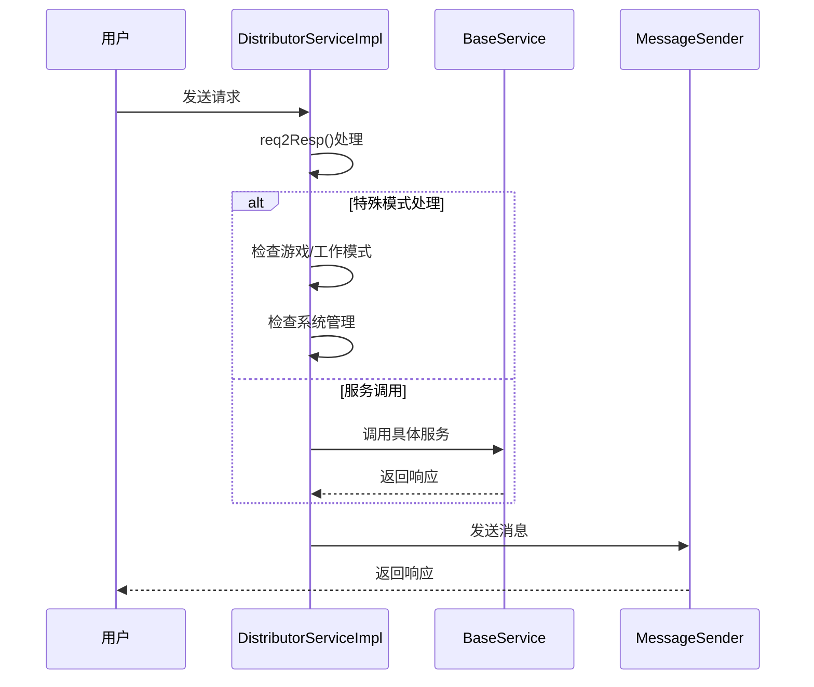
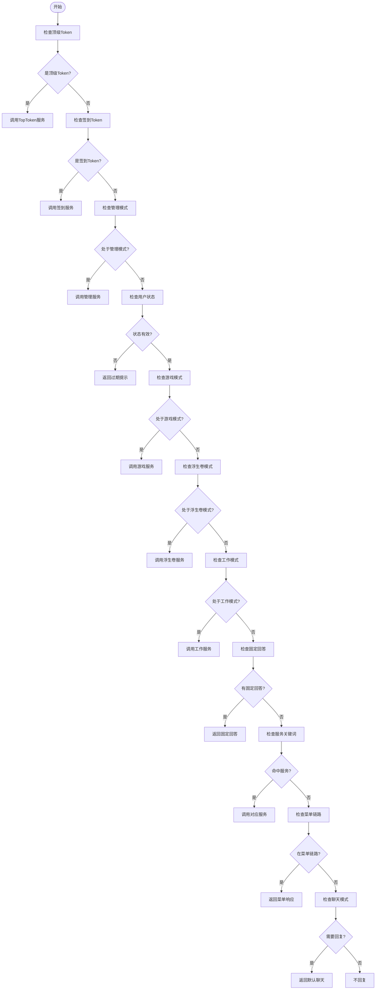
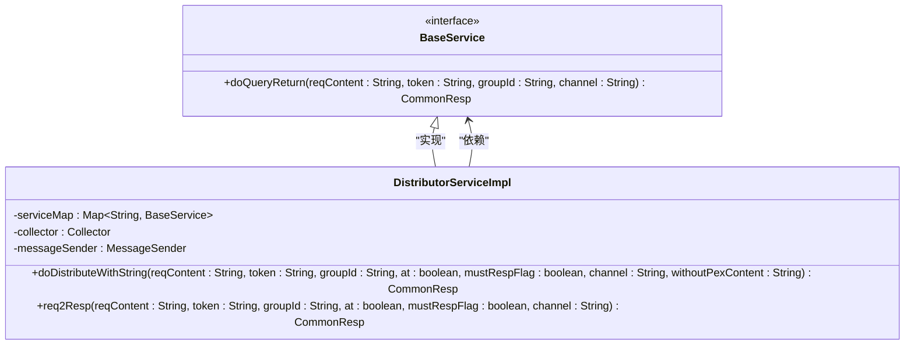
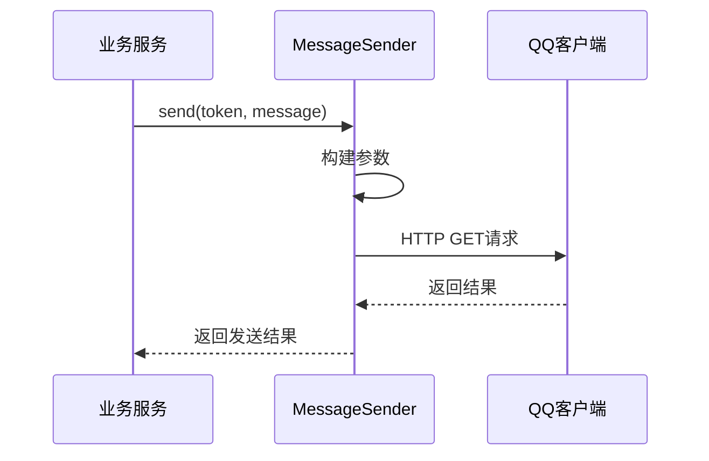
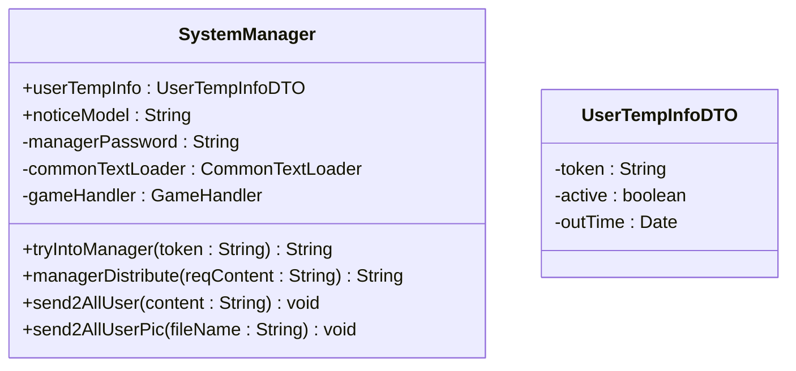
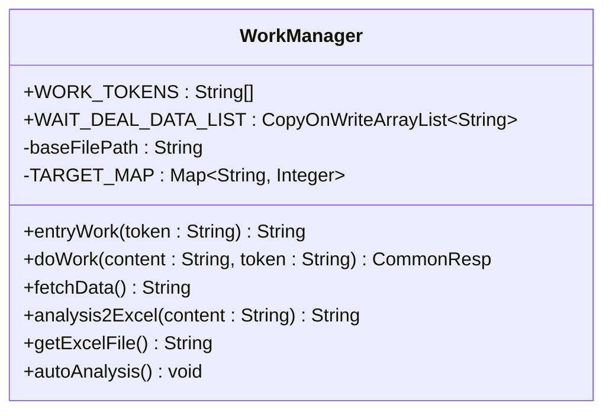
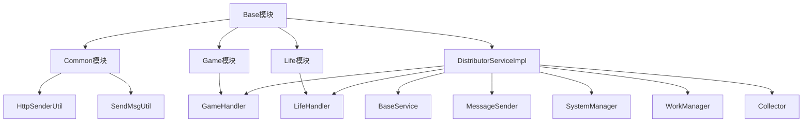

# 基础服务

<cite>
**本文档引用的文件**  
- [DistributorServiceImpl.java](file://Base/src/main/java/com/bot/base/service/impl/DistributorServiceImpl.java)
- [BaseService.java](file://Base/src/main/java/com/bot/base/service/BaseService.java)
- [Distributor.java](file://Base/src/main/java/com/bot/base/service/Distributor.java)
- [MessageSender.java](file://Base/src/main/java/com/bot/base/commom/MessageSender.java)
- [SystemManager.java](file://Base/src/main/java/com/bot/base/service/SystemManager.java)
- [WorkManager.java](file://Base/src/main/java/com/bot/base/service/WorkManager.java)
- [Collector.java](file://Base/src/main/java/com/bot/base/chain/Collector.java)
- [Menu.java](file://Base/src/main/java/com/bot/base/chain/Menu.java)
- [CommonResp.java](file://Base/src/main/java/com/bot/base/dto/CommonResp.java)
</cite>

## 目录
1. [引言](#引言)
2. [项目结构](#项目结构)
3. [核心组件](#核心组件)
4. [架构概述](#架构概述)
5. [详细组件分析](#详细组件分析)
6. [依赖分析](#依赖分析)
7. [性能考虑](#性能考虑)
8. [故障排除指南](#故障排除指南)
9. [结论](#结论)

## 引言
本文档全面解析Base模块中的核心服务组件及其协同工作机制。重点剖析DistributorServiceImpl作为消息分发中枢的职责，详细说明其doDistributeWithString()方法如何根据用户请求内容、token、群组ID等上下文信息，通过依赖注入的服务映射(serviceMap)、菜单收集器(collector)和消息发送器(messageSender)实现智能路由与响应生成。

## 项目结构
Base模块是整个系统的核心中枢，负责协调各个业务模块的请求分发与响应处理。其主要结构包括：
- **chain**: 菜单链式调用相关组件
- **commom**: 公共工具类，如消息发送器
- **dto**: 数据传输对象
- **service**: 核心服务接口与实现
- **task**: 定时任务
- **util**: 工具类

```mermaid
graph TD
subgraph "Base模块"
Distributor[DistributorServiceImpl]
BaseService[BaseService]
MessageSender[MessageSender]
SystemManager[SystemManager]
WorkManager[WorkManager]
Collector[Collector]
Menu[Menu]
end
Distributor --> BaseService : "依赖"
Distributor --> MessageSender : "使用"
Distributor --> SystemManager : "注入"
Distributor --> WorkManager : "注入"
Distributor --> Collector : "注入"
```

**图表来源**
- [DistributorServiceImpl.java](file://Base/src/main/java/com/bot/base/service/impl/DistributorServiceImpl.java)
- [BaseService.java](file://Base/src/main/java/com/bot/base/service/BaseService.java)
- [MessageSender.java](file://Base/src/main/java/com/bot/base/commom/MessageSender.java)
- [SystemManager.java](file://Base/src/main/java/com/bot/base/service/SystemManager.java)
- [WorkManager.java](file://Base/src/main/java/com/bot/base/service/WorkManager.java)
- [Collector.java](file://Base/src/main/java/com/bot/base/chain/Collector.java)
- [Menu.java](file://Base/src/main/java/com/bot/base/chain/Menu.java)

**章节来源**
- [DistributorServiceImpl.java](file://Base/src/main/java/com/bot/base/service/impl/DistributorServiceImpl.java)
- [BaseService.java](file://Base/src/main/java/com/bot/base/service/BaseService.java)

## 核心组件
Base模块的核心组件包括DistributorServiceImpl、BaseService、MessageSender、SystemManager和WorkManager。这些组件共同构成了系统的中枢神经系统，负责处理所有外部请求并协调内部服务的调用。

**章节来源**
- [DistributorServiceImpl.java](file://Base/src/main/java/com/bot/base/service/impl/DistributorServiceImpl.java)
- [BaseService.java](file://Base/src/main/java/com/bot/base/service/BaseService.java)
- [MessageSender.java](file://Base/src/main/java/com/bot/base/commom/MessageSender.java)

## 架构概述
Base模块采用分层架构设计，以DistributorServiceImpl为核心分发器，通过依赖注入的方式整合各个服务组件。当接收到用户请求时，DistributorServiceImpl根据请求内容和上下文信息，决定调用哪个具体的服务来处理请求。



**图表来源**
- [DistributorServiceImpl.java](file://Base/src/main/java/com/bot/base/service/impl/DistributorServiceImpl.java)
- [BaseService.java](file://Base/src/main/java/com/bot/base/service/BaseService.java)
- [MessageSender.java](file://Base/src/main/java/com/bot/base/commom/MessageSender.java)

## 详细组件分析

### DistributorServiceImpl分析
DistributorServiceImpl是Base模块的核心分发服务，负责处理所有用户请求并根据上下文信息进行智能路由。

#### 核心方法分析


**图表来源**
- [DistributorServiceImpl.java](file://Base/src/main/java/com/bot/base/service/impl/DistributorServiceImpl.java)

#### doDistributeWithString方法
该方法是DistributorServiceImpl的核心入口之一，负责处理字符串形式的请求分发。它根据用户请求内容、token、群组ID等上下文信息，通过依赖注入的服务映射(serviceMap)、菜单收集器(collector)和消息发送器(messageSender)实现智能路由与响应生成。

**章节来源**
- [DistributorServiceImpl.java](file://Base/src/main/java/com/bot/base/service/impl/DistributorServiceImpl.java#L125-L197)

#### req2Resp私有方法
该方法包含了复杂的业务判断逻辑链，按照优先级顺序处理各种请求：

1. **顶级Token处理**: 优先处理顶级Token用户的专属逻辑
2. **签到Token处理**: 处理签到资格用户的专属逻辑
3. **管理模式处理**: 处理系统管理相关的指令
4. **用户状态检查**: 检查用户是否过期
5. **游戏模式处理**: 处理山海见闻游戏模式
6. **浮生卷模式处理**: 处理浮生卷游戏模式
7. **工作模式处理**: 处理工作流相关的指令
8. **固定回答处理**: 处理完全匹配的固定回答
9. **服务关键词处理**: 根据关键词调用对应服务
10. **菜单链路处理**: 处理菜单导航相关的请求
11. **默认聊天处理**: 处理无法匹配的闲聊请求

**章节来源**
- [DistributorServiceImpl.java](file://Base/src/main/java/com/bot/base/service/impl/DistributorServiceImpl.java#L216-L411)

### BaseService分析
BaseService接口作为所有业务服务的统一契约，定义了核心的doQueryReturn方法。



**图表来源**
- [BaseService.java](file://Base/src/main/java/com/bot/base/service/BaseService.java)
- [DistributorServiceImpl.java](file://Base/src/main/java/com/bot/base/service/impl/DistributorServiceImpl.java)

**章节来源**
- [BaseService.java](file://Base/src/main/java/com/bot/base/service/BaseService.java#L9-L18)

### MessageSender分析
MessageSender组件负责封装HTTP请求，通过配置的URL、Key和RobotQQ向QQ客户端发送消息。



**图表来源**
- [MessageSender.java](file://Base/src/main/java/com/bot/base/commom/MessageSender.java)

**章节来源**
- [MessageSender.java](file://Base/src/main/java/com/bot/base/commom/MessageSender.java#L19-L46)

### SystemManager分析
SystemManager负责系统状态管理，包括管理模式、公告发布、邀请码生成等系统级功能。



**图表来源**
- [SystemManager.java](file://Base/src/main/java/com/bot/base/service/SystemManager.java)

**章节来源**
- [SystemManager.java](file://Base/src/main/java/com/bot/base/service/SystemManager.java#L46-L298)

### WorkManager分析
WorkManager负责工作流处理，包括工作模式的进入、数据收集、Excel文件处理等。



**图表来源**
- [WorkManager.java](file://Base/src/main/java/com/bot/base/service/WorkManager.java)

**章节来源**
- [WorkManager.java](file://Base/src/main/java/com/bot/base/service/WorkManager.java#L27-L272)

## 依赖分析
Base模块与其他模块存在紧密的依赖关系，通过依赖注入的方式整合各个服务组件。



**图表来源**
- [DistributorServiceImpl.java](file://Base/src/main/java/com/bot/base/service/impl/DistributorServiceImpl.java)
- [SystemManager.java](file://Base/src/main/java/com/bot/base/service/SystemManager.java)
- [WorkManager.java](file://Base/src/main/java/com/bot/base/service/WorkManager.java)

**章节来源**
- [DistributorServiceImpl.java](file://Base/src/main/java/com/bot/base/service/impl/DistributorServiceImpl.java#L43-L93)
- [SystemManager.java](file://Base/src/main/java/com/bot/base/service/SystemManager.java#L61-L80)
- [WorkManager.java](file://Base/src/main/java/com/bot/base/service/WorkManager.java#L27-L35)

## 性能考虑
Base模块在设计时考虑了多个性能优化点：

1. **缓存机制**: 使用静态Map缓存游戏模式和浮生卷模式的用户Token
2. **异步处理**: 工作模式的数据处理通过线程池异步执行
3. **连接池**: HTTP请求使用连接池管理
4. **批量操作**: 群发消息时采用批量处理
5. **资源复用**: Excel读写器重复利用

这些优化措施确保了系统在高并发场景下的稳定性和响应速度。

## 故障排除指南
当Base模块出现问题时，可以按照以下步骤进行排查：

1. **检查日志**: 查看logback-spring.xml配置的日志输出
2. **验证配置**: 确认application.properties中的配置项是否正确
3. **检查依赖**: 确保所有依赖的服务都正常运行
4. **测试分发**: 使用简单的请求测试分发逻辑是否正常
5. **检查网络**: 确认消息发送的URL是否可达

常见问题包括配置错误、依赖服务不可用、网络连接问题等。

**章节来源**
- [DistributorServiceImpl.java](file://Base/src/main/java/com/bot/base/service/impl/DistributorServiceImpl.java#L119-L121)
- [MessageSender.java](file://Base/src/main/java/com/bot/base/commom/MessageSender.java#L40-L42)
- [SystemManager.java](file://Base/src/main/java/com/bot/base/service/SystemManager.java#L272-L274)

## 结论
Base模块作为整个系统的核心中枢，通过DistributorServiceImpl实现了灵活的请求分发机制。它不仅能够处理各种业务场景，还能根据用户状态和上下文信息进行智能路由。BaseService接口为所有业务服务提供了统一的契约，而MessageSender、SystemManager和WorkManager等组件则分别负责消息发送、系统管理和工作流处理。这种模块化的设计使得系统具有良好的扩展性和维护性。