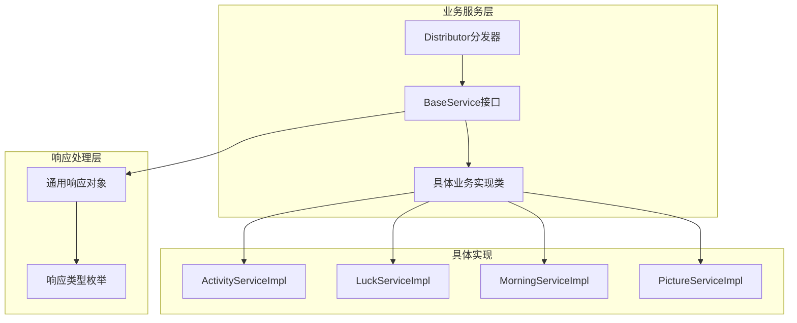
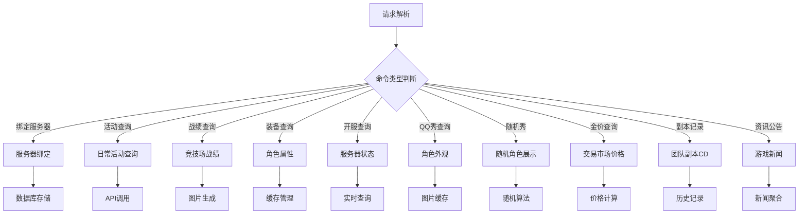
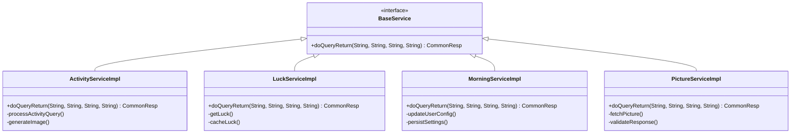
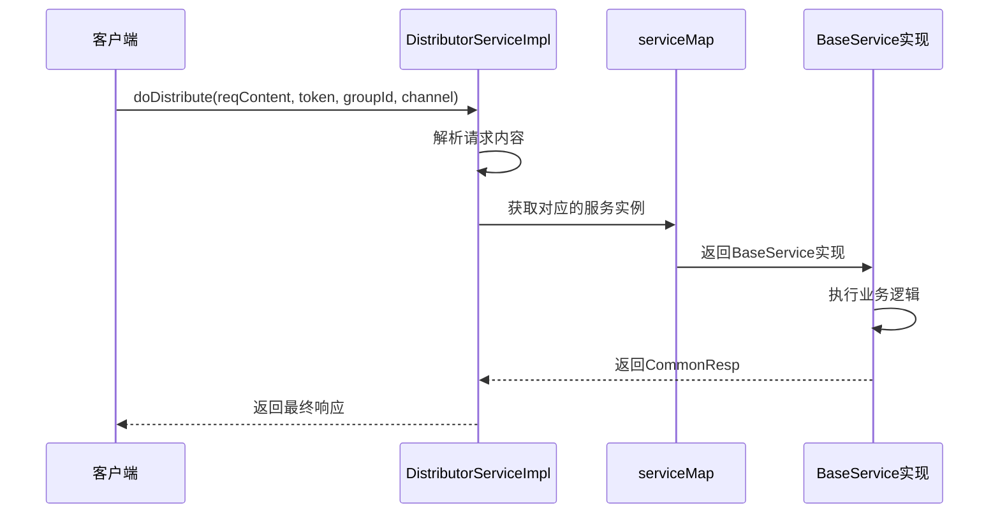
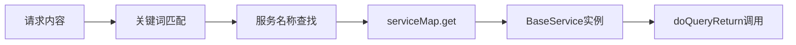

# 服务接口

<cite>
**本文档引用的文件**
- [BaseService.java](file://Base/src/main/java/com/bot/base/service/BaseService.java)
- [DistributorServiceImpl.java](file://Base/src/main/java/com/bot/base/service/impl/DistributorServiceImpl.java)
- [CommonResp.java](file://Base/src/main/java/com/bot/base/dto/CommonResp.java)
- [ActivityServiceImpl.java](file://Base/src/main/java/com/bot/base/service/impl/ActivityServiceImpl.java)
- [LuckServiceImpl.java](file://Base/src/main/java/com/bot/base/service/impl/LuckServiceImpl.java)
- [MorningServiceImpl.java](file://Base/src/main/java/com/bot/base/service/impl/MorningServiceImpl.java)
- [PictureServiceImpl.java](file://Base/src/main/java/com/bot/base/service/impl/PictureServiceImpl.java)
- [Distributor.java](file://Base/src/main/java/com/bot/base/service/Distributor.java)
- [PictureDistributor.java](file://Base/src/main/java/com/bot/base/service/PictureDistributor.java)
- [ENRespType.java](file://Common/src/main/java/com/bot/common/enums/ENRespType.java)
- [ENMorningType.java](file://Common/src/main/java/com/bot/common/enums/ENMorningType.java)
</cite>

## 目录
1. [引言](#引言)
2. [项目结构概览](#项目结构概览)
3. [BaseService接口设计](#baseservice接口设计)
4. [核心方法分析](#核心方法分析)
5. [具体实现类分析](#具体实现类分析)
6. [架构设计模式](#架构设计模式)
7. [依赖注入机制](#依赖注入机制)
8. [响应类型系统](#响应类型系统)
9. [业务功能扩展](#业务功能扩展)
10. [总结](#总结)

## 引言

BaseService接口作为整个机器人系统业务服务层的核心契约，定义了所有业务服务的统一规范。它采用统一的接口设计模式，通过标准化的方法签名实现了业务逻辑的解耦和可扩展性。本文档将深入分析BaseService接口的设计理念、实现细节以及在实际业务场景中的应用。

## 项目结构概览

机器人系统的业务服务层采用了清晰的分层架构，主要包含以下核心组件：



**图表来源**
- [BaseService.java](file://Base/src/main/java/com/bot/base/service/BaseService.java#L1-L19)
- [DistributorServiceImpl.java](file://Base/src/main/java/com/bot/base/service/impl/DistributorServiceImpl.java#L40-L50)

## BaseService接口设计

BaseService接口作为所有业务服务的统一契约，体现了面向接口编程的设计原则。该接口简洁而强大，仅定义了一个核心方法，却涵盖了复杂的业务逻辑处理需求。

### 接口定义特点

BaseService接口的设计遵循了单一职责原则和开闭原则：

- **简洁性**：仅包含一个核心方法，避免了过度设计
- **通用性**：方法签名能够适应各种业务场景
- **扩展性**：通过不同的实现类支持多样化的业务功能
- **一致性**：所有业务服务都遵循相同的调用规范

**章节来源**
- [BaseService.java](file://Base/src/main/java/com/bot/base/service/BaseService.java#L1-L19)

## 核心方法分析

### doQueryReturn方法签名设计

doQueryReturn方法是BaseService接口的核心，其签名设计体现了对业务场景的全面考虑：

```java
CommonResp doQueryReturn(String reqContent, String token, String groupId, String channel);
```

#### 参数设计分析

1. **reqContent（请求内容）**
   - 类型：String
   - 作用：传递用户的原始请求内容
   - 设计考量：支持多种格式的请求解析，包括文本命令、参数组合等

2. **token（身份标识）**
   - 类型：String  
   - 作用：标识请求来源，用于用户认证和权限控制
   - 设计考量：支持私聊和群聊两种场景的身份识别

3. **groupId（群组ID）**
   - 类型：String
   - 作用：标识群聊环境，支持群组特定的业务逻辑
   - 设计考量：区分私聊和群聊的不同处理流程

4. **channel（渠道参数）**
   - 类型：String
   - 作用：标识消息来源渠道，支持多平台适配
   - 设计考量：为不同平台（QQ、微信等）提供统一的抽象

#### 返回值设计

- **类型**：CommonResp
- **作用**：封装业务处理结果和响应类型
- **优势**：统一的响应格式便于上层处理

**章节来源**
- [BaseService.java](file://Base/src/main/java/com/bot/base/service/BaseService.java#L11-L16)

## 具体实现类分析

### ActivityServiceImpl - 剑三活动查询服务

ActivityServiceImpl是最复杂也是功能最丰富的实现类，支持剑网3游戏相关的全方位查询服务。

#### 核心功能模块



**图表来源**
- [ActivityServiceImpl.java](file://Base/src/main/java/com/bot/base/service/impl/ActivityServiceImpl.java#L84-L213)

#### 技术实现特点

1. **缓存策略**：针对不同数据类型采用不同的缓存策略
   - 角色属性：30分钟缓存
   - 战绩信息：1小时缓存  
   - 金价信息：12小时缓存
   - 新闻资讯：2小时缓存

2. **图片生成**：通过模板引擎动态生成美观的查询结果

3. **API集成**：与剑网3官方API深度集成，提供实时数据

**章节来源**
- [ActivityServiceImpl.java](file://Base/src/main/java/com/bot/base/service/impl/ActivityServiceImpl.java#L84-L213)

### LuckServiceImpl - 求签解签服务

LuckServiceImpl提供了简单而有效的运势占卜功能，体现了服务设计的简洁性原则。

#### 功能特性

- **求签功能**：每日一次随机运势抽取
- **解签功能**：基于缓存的解签结果查询
- **缓存机制**：按日期和用户维度缓存求签结果
- **响应类型**：支持图片和文本两种响应方式

#### 实现亮点

1. **状态管理**：通过静态缓存Map管理用户当日的求签状态
2. **用户体验**：提供完整的求签-解签流程
3. **性能优化**：避免重复的外部API调用

**章节来源**
- [LuckServiceImpl.java](file://Base/src/main/java/com/bot/base/service/impl/LuckServiceImpl.java#L35-L61)

### MorningServiceImpl - 早安设置服务

MorningServiceImpl专注于用户个性化设置，展示了服务设计的灵活性。

#### 核心功能

- **早安类型设置**：支持早、午、晚三种时间段设置
- **批量设置**：支持同时设置多个时间段
- **默认设置**：提供"全部"选项作为快捷操作
- **取消功能**：支持清空所有设置

#### 数据持久化

通过BotUserConfig表实现用户设置的持久化存储，确保设置的长期有效性和跨会话一致性。

**章节来源**
- [MorningServiceImpl.java](file://Base/src/main/java/com/bot/base/service/impl/MorningServiceImpl.java#L31-L78)

### PictureServiceImpl - 图片获取服务

PictureServiceImpl是最简单的实现类，展示了服务设计的最小化原则。

#### 功能特点

- **简单查询**：基于关键词的图片搜索
- **API代理**：转发第三方图片API请求
- **格式验证**：严格的响应格式验证
- **错误处理**：完善的异常情况处理

#### 技术实现

1. **参数提取**：从请求内容中提取关键词
2. **API调用**：向第三方图片服务发起HTTP请求
3. **响应解析**：JSON格式的数据解析
4. **类型转换**：将图片URL转换为CommonResp响应

**章节来源**
- [PictureServiceImpl.java](file://Base/src/main/java/com/bot/base/service/impl/PictureServiceImpl.java#L26-L38)

## 架构设计模式

### 策略模式的应用

BaseService接口的设计本质上体现了策略模式的思想：



**图表来源**
- [BaseService.java](file://Base/src/main/java/com/bot/base/service/BaseService.java#L9-L16)
- [ActivityServiceImpl.java](file://Base/src/main/java/com/bot/base/service/impl/ActivityServiceImpl.java#L41-L42)
- [LuckServiceImpl.java](file://Base/src/main/java/com/bot/base/service/impl/LuckServiceImpl.java#L26-L27)
- [MorningServiceImpl.java](file://Base/src/main/java/com/bot/base/service/impl/MorningServiceImpl.java#L21-L22)
- [PictureServiceImpl.java](file://Base/src/main/java/com/bot/base/service/impl/PictureServiceImpl.java#L18-L19)

### 工厂模式的体现

DistributorServiceImpl通过Map容器实现了工厂模式，动态选择合适的业务服务：



**图表来源**
- [DistributorServiceImpl.java](file://Base/src/main/java/com/bot/base/service/impl/DistributorServiceImpl.java#L363-L368)

**章节来源**
- [DistributorServiceImpl.java](file://Base/src/main/java/com/bot/base/service/impl/DistributorServiceImpl.java#L363-L368)

## 依赖注入机制

### Spring容器管理

所有BaseService实现类都通过Spring的@Service注解注册到容器中，实现了自动化的依赖注入：

```java
@Autowired
private Map<String, BaseService> serviceMap;
```

这种设计带来了以下优势：

1. **松耦合**：客户端代码无需知道具体的服务实现
2. **可扩展**：新增服务只需实现BaseService接口并标注@Service
3. **可测试**：便于单元测试和模拟对象的使用
4. **生命周期管理**：Spring负责服务的创建、初始化和销毁

### 动态服务发现

通过serviceMap的键值映射，系统能够根据请求内容动态选择合适的服务：



**图表来源**
- [DistributorServiceImpl.java](file://Base/src/main/java/com/bot/base/service/impl/DistributorServiceImpl.java#L330-L335)

**章节来源**
- [DistributorServiceImpl.java](file://Base/src/main/java/com/bot/base/service/impl/DistributorServiceImpl.java#L43-L44)

## 响应类型系统

### ENRespType枚举设计

系统通过ENRespType枚举定义了统一的响应类型体系：

| 类型 | 数值 | 描述 | 应用场景 |
|------|------|------|----------|
| TEXT | 0 | 文本消息 | 纯文字回复、状态更新 |
| IMG | 1 | 图片消息 | 图片展示、生成图片 |
| VIDEO | 2 | 视频消息 | 视频播放、演示内容 |
| FILE | 3 | 文件消息 | 文件下载、资源分享 |
| AUDIO | 4 | 语音消息 | 语音合成、音频播放 |

### CommonResp统一响应格式

CommonResp类提供了统一的响应封装：

```java
public class CommonResp {
    private String msg;      // 响应内容
    private String type;     // 响应类型
}
```

这种设计的优势：

1. **类型安全**：通过枚举限制响应类型的范围
2. **扩展性**：支持未来新增响应类型
3. **易用性**：简化了上层调用者的处理逻辑
4. **一致性**：所有服务都遵循相同的响应格式

**章节来源**
- [CommonResp.java](file://Base/src/main/java/com/bot/base/dto/CommonResp.java#L1-L20)
- [ENRespType.java](file://Common/src/main/java/com/bot/common/enums/ENRespType.java#L1-L20)

## 业务功能扩展

### 扩展性设计原则

BaseService接口的设计充分考虑了业务功能的扩展需求：

1. **参数扩展**：现有四个参数足以覆盖大多数业务场景
2. **响应扩展**：ENRespType枚举支持未来类型扩展
3. **实现分离**：每个业务功能独立实现，互不影响
4. **配置驱动**：通过配置文件控制服务行为

### 新增服务的最佳实践

基于现有设计，新增服务应遵循以下最佳实践：

1. **实现BaseService接口**：确保与现有架构的兼容性
2. **合理使用参数**：充分利用四个输入参数的语义
3. **统一响应格式**：始终返回CommonResp对象
4. **异常处理**：妥善处理各种异常情况
5. **日志记录**：添加适当的日志以便调试和监控

### 性能优化策略

不同服务采用了不同的性能优化策略：

- **ActivityServiceImpl**：多级缓存机制
- **LuckServiceImpl**：本地内存缓存
- **MorningServiceImpl**：数据库持久化
- **PictureServiceImpl**：API代理和格式验证

**章节来源**
- [ActivityServiceImpl.java](file://Base/src/main/java/com/bot/base/service/impl/ActivityServiceImpl.java#L250-L290)
- [LuckServiceImpl.java](file://Base/src/main/java/com/bot/base/service/impl/LuckServiceImpl.java#L38-L46)

## 总结

BaseService接口作为机器人系统业务服务层的核心契约，展现了优秀的软件设计原则：

### 设计优势

1. **简洁性**：单一方法签名涵盖复杂业务逻辑
2. **一致性**：统一的调用规范和响应格式
3. **可扩展性**：支持无限数量的新业务功能
4. **可维护性**：清晰的职责分离和模块化设计
5. **可测试性**：易于进行单元测试和集成测试

### 技术价值

1. **架构解耦**：通过接口抽象实现了高层模块与低层模块的解耦
2. **依赖注入**：充分利用Spring框架的依赖注入机制
3. **设计模式**：完美体现了策略模式和工厂模式的应用
4. **响应式设计**：支持多种响应类型的灵活处理

### 应用效果

在实际应用中，BaseService接口成功支撑了包括剑网3游戏查询、运势占卜、个性化设置、图片获取等多种业务功能，证明了其设计的有效性和实用性。通过DistributorServiceImpl的统一调度，系统实现了高度的模块化和可扩展性，为机器人的持续发展奠定了坚实的基础。

这种设计不仅满足了当前的业务需求，更为未来的功能扩展预留了充足的空间，是企业级应用开发中接口设计的优秀范例。