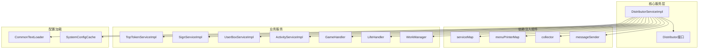
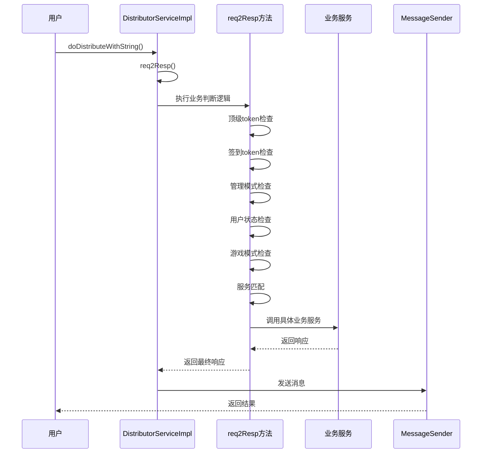
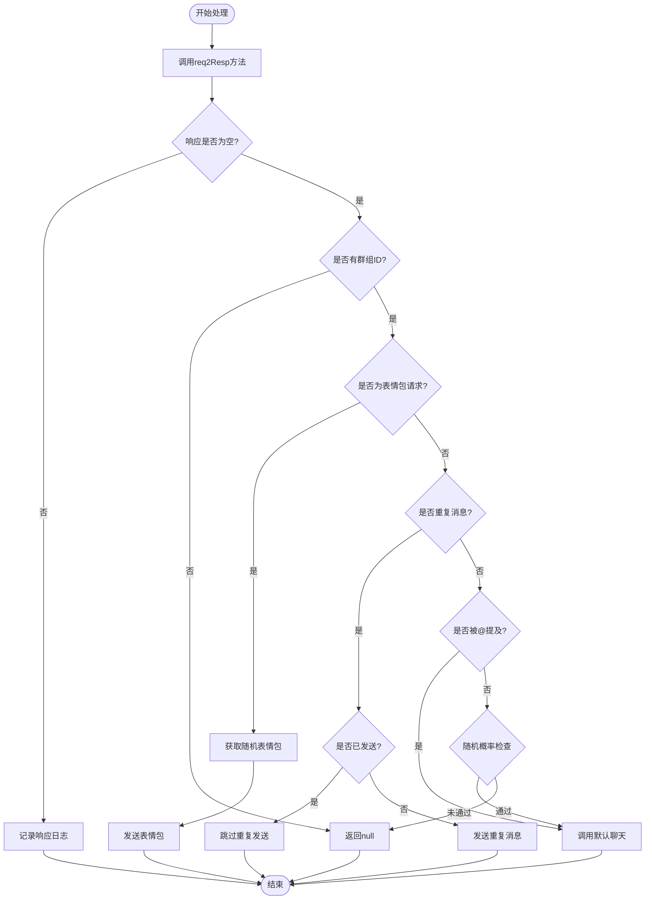
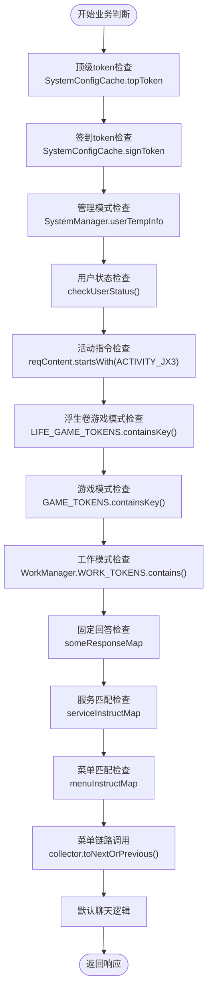
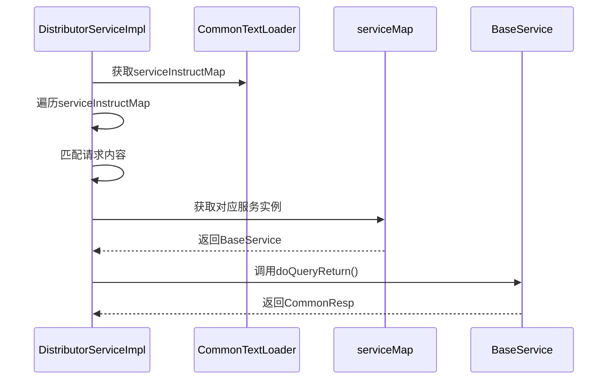
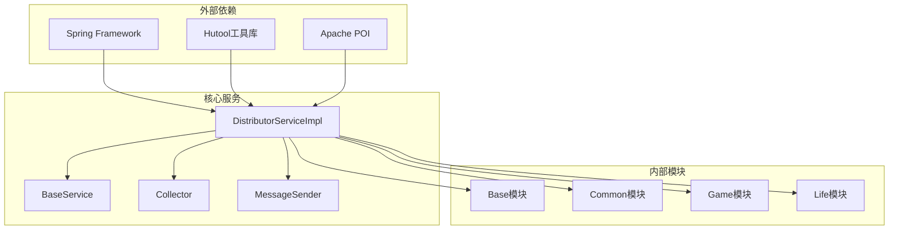

# 消息分发器

<cite>
**本文档引用的文件**
- [DistributorServiceImpl.java](file://Base/src/main/java/com/bot/base/service/impl/DistributorServiceImpl.java)
- [Distributor.java](file://Base/src/main/java/com/bot/base/service/Distributor.java)
- [CommonTextLoader.java](file://Common/src/main/java/com/bot/common/loader/CommonTextLoader.java)
- [MessageSender.java](file://Base/src/main/java/com/bot/base/commom/MessageSender.java)
- [BaseService.java](file://Base/src/main/java/com/bot/base/service/BaseService.java)
- [Collector.java](file://Base/src/main/java/com/bot/base/chain/Collector.java)
- [BaseConsts.java](file://Common/src/main/java/com/bot/common/constant/BaseConsts.java)
- [SystemManager.java](file://Base/src/main/java/com/bot/base/service/SystemManager.java)
- [WorkManager.java](file://Base/src/main/java/com/bot/base/service/WorkManager.java)
</cite>

## 目录
1. [简介](#简介)
2. [项目结构](#项目结构)
3. [核心组件](#核心组件)
4. [架构概览](#架构概览)
5. [详细组件分析](#详细组件分析)
6. [依赖关系分析](#依赖关系分析)
7. [性能考虑](#性能考虑)
8. [故障排除指南](#故障排除指南)
9. [结论](#结论)

## 简介

DistributorServiceImpl是整个机器人系统的核心消息分发中枢，负责接收用户请求内容、token、群组ID等参数，通过智能路由机制将消息分发到相应的业务服务模块。该组件采用高度模块化的设计，支持多种游戏模式、管理模式、工作模式以及默认聊天逻辑，实现了复杂的消息处理和业务流转。

## 项目结构

**图表来源**
- [DistributorServiceImpl.java](file://Base/src/main/java/com/bot/base/service/impl/DistributorServiceImpl.java#L40-L92)
- [Distributor.java](file://Base/src/main/java/com/bot/base/service/Distributor.java#L12-L36)

**章节来源**
- [DistributorServiceImpl.java](file://Base/src/main/java/com/bot/base/service/impl/DistributorServiceImpl.java#L1-L414)

## 核心组件

### 主要字段和依赖注入

DistributorServiceImpl通过Spring框架的依赖注入机制，整合了多个核心组件：

- **serviceMap**: 存储所有业务服务实例的映射表
- **menuPrinterMap**: 存储菜单打印器的映射表  
- **collector**: 菜单收集器，负责构建调用链
- **messageSender**: 消息发送器，负责将响应发送给用户
- **各种业务处理器**: 包括游戏处理器、生活处理器、工作管理器等

### 静态状态管理

系统维护了几个重要的静态Map来跟踪不同模式的状态：
- **GAME_TOKENS**: 跟踪处于游戏模式的用户
- **LIFE_GAME_TOKENS**: 跟踪处于浮生卷游戏模式的用户
- **TEMP_CHAT_RECORD**: 记录群聊中的临时聊天记录
- **BOT_SEND_RECORD**: 跟踪机器人已发送的消息记录

**章节来源**
- [DistributorServiceImpl.java](file://Base/src/main/java/com/bot/base/service/impl/DistributorServiceImpl.java#L93-L98)

## 架构概览

**图表来源**
- [DistributorServiceImpl.java](file://Base/src/main/java/com/bot/base/service/impl/DistributorServiceImpl.java#L124-L197)
- [DistributorServiceImpl.java](file://Base/src/main/java/com/bot/base/service/impl/DistributorServiceImpl.java#L216-L360)

## 详细组件分析

### doDistributeWithString() 方法分析

这是DistributorServiceImpl的核心入口方法，负责处理带字符串参数的消息分发：

#### 方法签名和参数
- **reqContent**: 用户请求内容
- **token**: 用户标识符
- **groupId**: 群组ID（可为空）
- **at**: 是否被@提及
- **mustRespFlag**: 是否必须回复标志
- **channel**: 通信渠道
- **withoutPexContent**: 去除前缀后的请求内容

#### 核心处理流程

**图表来源**
- [DistributorServiceImpl.java](file://Base/src/main/java/com/bot/base/service/impl/DistributorServiceImpl.java#L124-L197)

#### 群聊重复消息处理机制

系统实现了智能的群聊重复消息处理逻辑：

1. **消息记录**: 使用TEMP_CHAT_RECORD维护群聊消息历史
2. **重复检测**: 检查当前消息是否与最近一条消息相同
3. **发送控制**: 使用BOT_SEND_RECORD防止重复发送相同消息
4. **触发条件**: 当消息被@提及或包含特定关键词时触发回复

**章节来源**
- [DistributorServiceImpl.java](file://Base/src/main/java/com/bot/base/service/impl/DistributorServiceImpl.java#L124-L197)

### req2Resp() 私有方法深度分析

这是消息分发的核心业务判断逻辑链，按照优先级顺序处理各种情况：

#### 优先级处理逻辑

**图表来源**
- [DistributorServiceImpl.java](file://Base/src/main/java/com/bot/base/service/impl/DistributorServiceImpl.java#L216-L360)

#### 关键业务模式处理

##### 顶级Token处理
顶级Token拥有最高优先级，直接调用TopTokenServiceImpl进行专属逻辑处理。

##### 签到Token处理
签到Token优先执行签到服务，如果没有匹配结果则继续后续逻辑。

##### 管理模式处理
系统支持临时管理模式，通过SystemManager.userTempInfo进行状态管理。

##### 游戏模式处理
- **浮生卷游戏模式**: 通过LIFE_GAME_TOKENS跟踪，支持进入、退出和游戏逻辑
- **山海见闻游戏模式**: 通过GAME_TOKENS跟踪，支持加入确认和游戏逻辑
- **工作模式**: 通过WorkManager.WORK_TOKENS跟踪，支持数据录入和处理

##### 服务动态调用机制
系统通过CommonTextLoader.serviceInstructMap实现服务的动态匹配和调用：

**图表来源**
- [DistributorServiceImpl.java](file://Base/src/main/java/com/bot/base/service/impl/DistributorServiceImpl.java#L329-L339)
- [CommonTextLoader.java](file://Common/src/main/java/com/bot/common/loader/CommonTextLoader.java#L29-L30)

**章节来源**
- [DistributorServiceImpl.java](file://Base/src/main/java/com/bot/base/service/impl/DistributorServiceImpl.java#L216-L360)

### MessageSender 消息发送器

MessageSender负责将处理后的响应发送给用户，支持多种消息类型：

#### 核心功能
- **HTTP消息发送**: 通过HttpSenderUtil发送消息到指定目标
- **参数封装**: 自动封装RobotQQ、Key、QQ、Message等必要参数
- **异常处理**: 提供完善的异常捕获和日志记录

#### 配置依赖
- **robotQQ**: 机器人QQ号
- **url**: 消息发送API地址
- **key**: API密钥

**章节来源**
- [MessageSender.java](file://Base/src/main/java/com/bot/base/commom/MessageSender.java#L30-L44)

### CommonTextLoader 配置加载器

CommonTextLoader负责加载系统配置和指令映射：

#### 配置类型
- **serviceInstructMap**: 服务指令映射，将用户指令映射到具体服务类
- **menuInstructMap**: 菜单指令映射（已废弃）
- **someResponseMap**: 固定回答映射，提供预设的固定回复
- **defaultResponseMsg**: 默认回复列表

#### 加载机制
- **@PostConstruct**: 在Bean初始化后自动加载配置文件
- **文件读取**: 从指定路径读取配置文件
- **映射构建**: 将配置内容转换为内存中的Map结构

**章节来源**
- [CommonTextLoader.java](file://Common/src/main/java/com/bot/common/loader/CommonTextLoader.java#L60-L104)

## 依赖关系分析

**图表来源**
- [DistributorServiceImpl.java](file://Base/src/main/java/com/bot/base/service/impl/DistributorServiceImpl.java#L1-L32)

### 组件耦合度分析

- **低耦合设计**: 通过接口和依赖注入实现松耦合
- **高内聚特性**: 每个组件专注于特定功能领域
- **扩展性良好**: 新增服务只需实现BaseService接口并注册到serviceMap

**章节来源**
- [DistributorServiceImpl.java](file://Base/src/main/java/com/bot/base/service/impl/DistributorServiceImpl.java#L42-L92)

## 性能考虑

### 缓存策略
- **静态Map缓存**: 使用静态Map存储游戏状态和聊天记录
- **配置缓存**: CommonTextLoader加载后缓存在内存中
- **服务实例缓存**: Spring容器管理的服务实例缓存

### 异步处理
- **ThreadPoolManager**: 用于异步处理大量数据
- **消息发送优化**: 使用批量发送减少网络开销

### 内存管理
- **容量限制**: TEMP_CHAT_RECORD和BOT_SEND_RECORD设置合理的大小限制
- **定期清理**: 实现自动清理机制防止内存泄漏

## 故障排除指南

### 常见问题及解决方案

#### 1. 服务调用失败
**症状**: 系统抛出"未知服务"异常
**原因**: serviceMap中缺少对应的业务服务
**解决**: 检查服务注册和依赖注入配置

#### 2. 消息发送失败
**症状**: 用户未收到预期回复
**原因**: MessageSender配置错误或网络问题
**解决**: 检查robotQQ、url、key配置

#### 3. 游戏模式异常
**症状**: 游戏模式无法正常启动或退出
**原因**: GAME_TOKENS或LIFE_GAME_TOKENS状态不一致
**解决**: 检查状态管理和清理逻辑

#### 4. 群聊重复消息问题
**症状**: 重复消息被多次发送
**原因**: BOT_SEND_RECORD清理逻辑失效
**解决**: 检查TEMP_CHAT_RECORD和BOT_SEND_RECORD的同步机制

**章节来源**
- [DistributorServiceImpl.java](file://Base/src/main/java/com/bot/base/service/impl/DistributorServiceImpl.java#L363-L368)
- [DistributorServiceImpl.java](file://Base/src/main/java/com/bot/base/service/impl/DistributorServiceImpl.java#L405-L410)

## 结论

DistributorServiceImpl作为机器人系统的核心消息分发中枢，展现了优秀的软件架构设计：

### 设计优势
- **模块化架构**: 清晰的职责分离和接口定义
- **灵活扩展**: 支持动态服务注册和配置更新
- **智能路由**: 基于优先级的业务判断逻辑
- **状态管理**: 完善的游戏和工作模式状态跟踪

### 技术特点
- **依赖注入**: Spring框架的优雅应用
- **配置驱动**: 基于文件的配置管理系统
- **异常处理**: 完善的日志记录和错误处理
- **性能优化**: 缓存策略和异步处理机制

### 应用价值
该组件不仅实现了复杂的消息分发逻辑，更为整个机器人系统提供了稳定可靠的基础支撑，其设计理念和实现方式对类似项目的开发具有重要的参考价值。