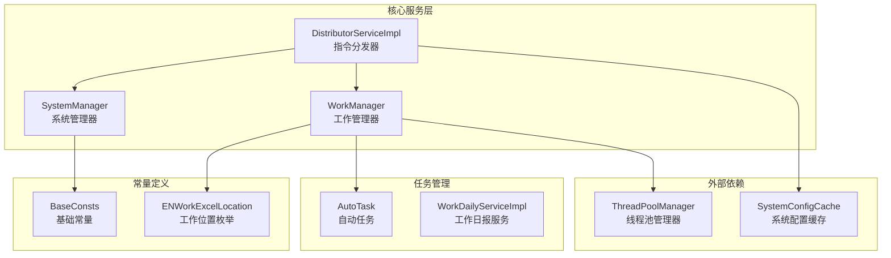
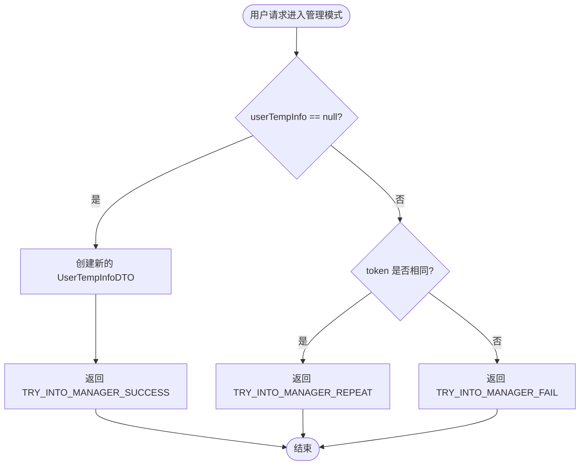
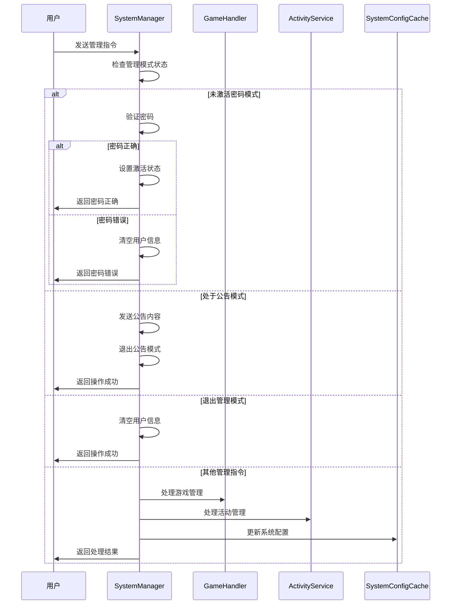
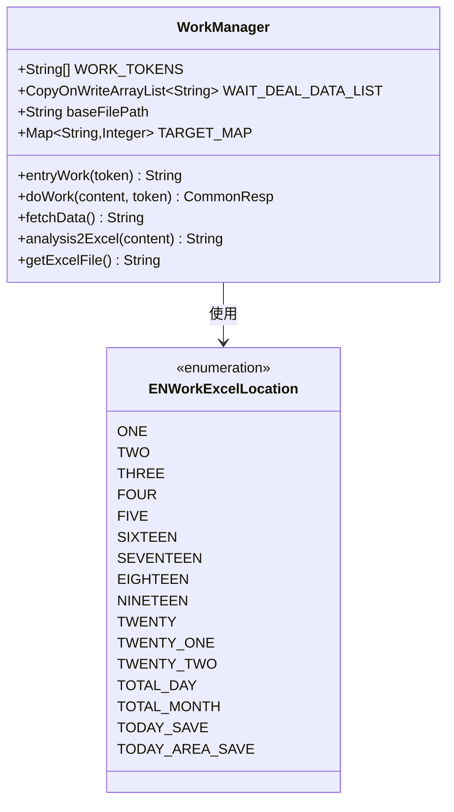
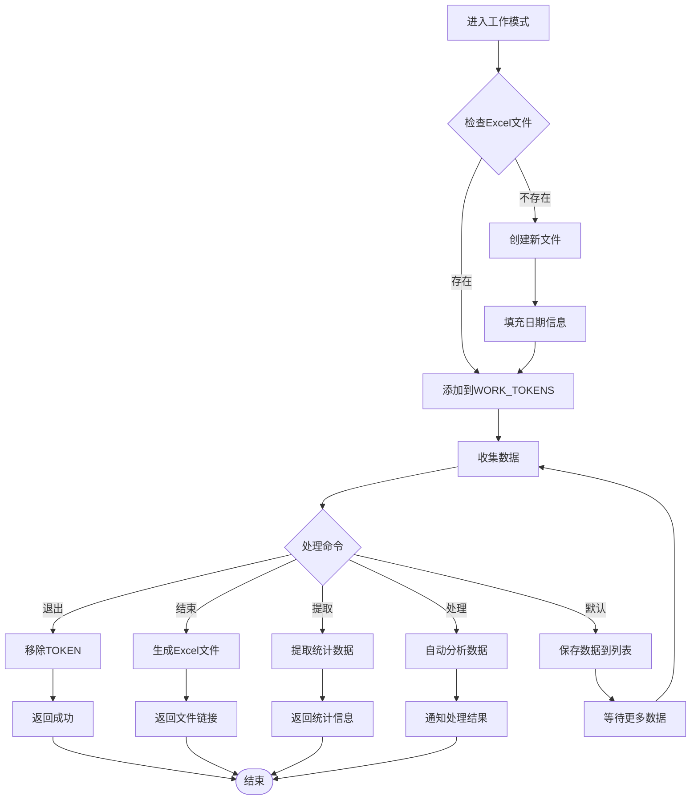
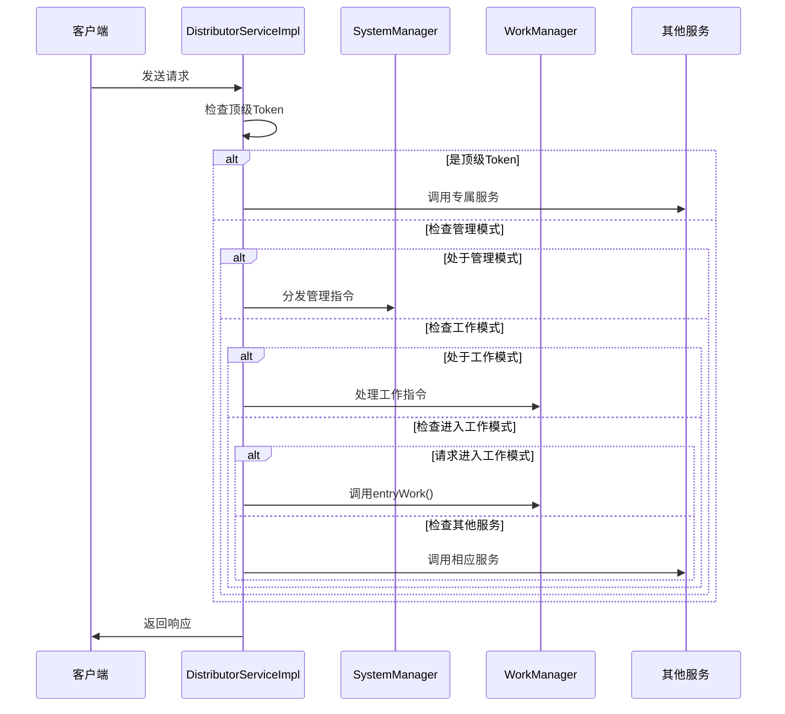
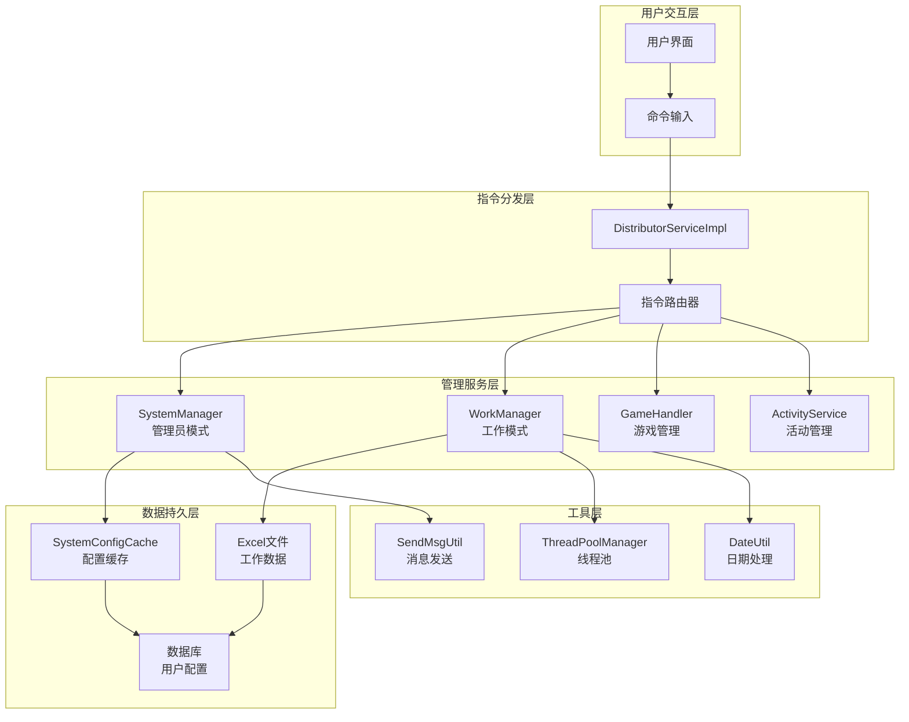
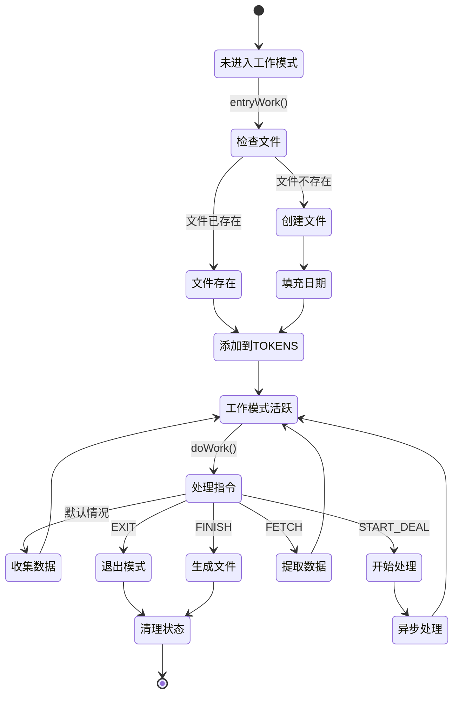
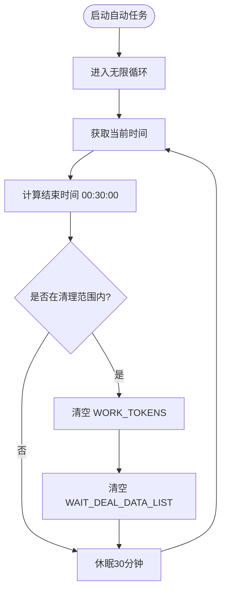
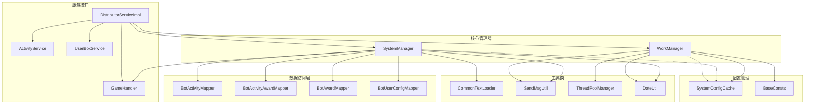

# 系统管理

<cite>
**本文档引用的文件**
- [SystemManager.java](file://Base/src/main/java/com/bot/base/service/SystemManager.java)
- [WorkManager.java](file://Base/src/main/java/com/bot/base/service/WorkManager.java)
- [DistributorServiceImpl.java](file://Base/src/main/java/com/bot/base/service/impl/DistributorServiceImpl.java)
- [BaseConsts.java](file://Common/src/main/java/com/bot/common/constant/BaseConsts.java)
- [ENWorkExcelLocation.java](file://Common/src/main/java/com/bot/common/enums/ENWorkExcelLocation.java)
- [AutoTask.java](file://Base/src/main/java/com/bot/base/task/AutoTask.java)
- [WorkDailyServiceImpl.java](file://Base/src/main/java/com/bot/base/service/impl/WorkDailyServiceImpl.java)
</cite>

## 目录
1. [简介](#简介)
2. [项目结构](#项目结构)
3. [SystemManager 核心功能](#systemmanager-核心功能)
4. [WorkManager 核心功能](#workmanager-核心功能)
5. [DistributorServiceImpl 协同机制](#distributorserviceimpl-协同机制)
6. [架构概览](#架构概览)
7. [详细组件分析](#详细组件分析)
8. [依赖关系分析](#依赖关系分析)
9. [性能考虑](#性能考虑)
10. [故障排除指南](#故障排除指南)
11. [结论](#结论)

## 简介

SystemManager 和 WorkManager 是 Bot 系统中负责系统状态管理和工作流处理的核心管理类。它们通过独特的设计模式实现了精细化的权限控制和工作流程管理，为系统提供了强大的管理员功能和高效的工作模式处理能力。

SystemManager 主要负责管理员模式的进入与指令分发，通过 tryIntoManager() 方法实现权限验证，通过 managerDistribute() 方法处理各种系统级管理指令。WorkManager 则专注于工作模式的管理，通过 WORK_TOKENS 静态集合跟踪处于工作模式的用户，并通过 entryWork() 和 doWork() 方法实现工作模式的进入与日常任务处理。

这两个管理类与 DistributorServiceImpl 协同工作，为特定用户提供专属的系统级功能，包括配置管理、数据查询等高级操作。

## 项目结构

**图表来源**
- [SystemManager.java](file://Base/src/main/java/com/bot/base/service/SystemManager.java#L45-L299)
- [WorkManager.java](file://Base/src/main/java/com/bot/base/service/WorkManager.java#L26-L273)
- [DistributorServiceImpl.java](file://Base/src/main/java/com/bot/base/service/impl/DistributorServiceImpl.java#L40-L414)

## SystemManager 核心功能

### 权限验证机制

SystemManager 的核心功能围绕管理员模式展开，通过 tryIntoManager() 方法实现严格的权限验证机制：

**图表来源**
- [SystemManager.java](file://Base/src/main/java/com/bot/base/service/SystemManager.java#L88-L97)

### 管理员指令分发

managerDistribute() 方法实现了复杂的指令分发逻辑，支持多种管理员操作：

**图表来源**
- [SystemManager.java](file://Base/src/main/java/com/bot/base/service/SystemManager.java#L105-L279)

**节来源**
- [SystemManager.java](file://Base/src/main/java/com/bot/base/service/SystemManager.java#L88-L279)

## WorkManager 核心功能

### 工作模式管理

WorkManager 通过 WORK_TOKENS 静态集合管理处于工作模式的用户，实现了高效的工作流程管理：

**图表来源**
- [WorkManager.java](file://Base/src/main/java/com/bot/base/service/WorkManager.java#L29-L43)
- [ENWorkExcelLocation.java](file://Common/src/main/java/com/bot/common/enums/ENWorkExcelLocation.java#L11-L50)

### 数据处理流程

WorkManager 实现了完整的工作数据处理流程：

**图表来源**
- [WorkManager.java](file://Base/src/main/java/com/bot/base/service/WorkManager.java#L51-L94)

**节来源**
- [WorkManager.java](file://Base/src/main/java/com/bot/base/service/WorkManager.java#L51-L273)

## DistributorServiceImpl 协同机制

### 指令路由机制

DistributorServiceImpl 作为系统的中央调度器，负责将用户请求路由到相应的管理器：

**图表来源**
- [DistributorServiceImpl.java](file://Base/src/main/java/com/bot/base/service/impl/DistributorServiceImpl.java#L216-L361)

### 状态管理协调

DistributorServiceImpl 通过维护各种状态映射来协调不同管理器的工作：

| 状态类型 | 数据结构 | 用途 |
|---------|---------|------|
| GAME_TOKENS | Map<String, String> | 游戏模式状态管理 |
| LIFE_GAME_TOKENS | Map<String, String> | 浮生卷游戏模式管理 |
| TEMP_CHAT_RECORD | Map<String, List<String>> | 临时聊天记录存储 |
| BOT_SEND_RECORD | Map<String, List<String>> | 机器人发送记录 |
| WORK_TOKENS | List<String> | 工作模式用户跟踪 |

**节来源**
- [DistributorServiceImpl.java](file://Base/src/main/java/com/bot/base/service/impl/DistributorServiceImpl.java#L94-L100)

## 架构概览

SystemManager 和 WorkManager 在整个系统架构中扮演着关键角色，它们通过与 DistributorServiceImpl 的紧密协作，形成了完整的系统管理框架：

**图表来源**
- [DistributorServiceImpl.java](file://Base/src/main/java/com/bot/base/service/impl/DistributorServiceImpl.java#L40-L90)
- [SystemManager.java](file://Base/src/main/java/com/bot/base/service/SystemManager.java#L45-L81)
- [WorkManager.java](file://Base/src/main/java/com/bot/base/service/WorkManager.java#L26-L43)

## 详细组件分析

### SystemManager 权限验证深度分析

SystemManager 的 tryIntoManager() 方法实现了基于令牌的简单但有效的权限验证机制：

#### 核心验证逻辑
- **单用户限制**：通过 userTempInfo 静态变量确保同一时间只能有一个用户处于管理模式
- **令牌唯一性**：通过比较令牌来防止重复进入
- **状态管理**：维护用户的状态信息和超时机制

#### 管理员指令处理流程
managerDistribute() 方法支持多种复杂的管理操作：

| 指令类型 | 功能描述 | 处理方式 |
|---------|---------|---------|
| 密码验证 | 验证管理员密码 | 直接比较密码字符串 |
| 公告发布 | 发布系统公告 | 设置公告模式并处理内容 |
| 文本刷新 | 重新加载系统文本 | 调用文本加载器 |
| 图片公告 | 发布带图片的公告 | 处理图片路径并发送 |
| 邀请码生成 | 生成用户邀请码 | 创建并返回邀请码列表 |
| 游戏管理 | 管理游戏相关功能 | 委托给 GameHandler 处理 |
| 抽奖管理 | 管理抽奖活动 | 操作数据库并更新缓存 |
| 日报发送 | 手动发送每日报告 | 遍历用户并发送图片 |

**节来源**
- [SystemManager.java](file://Base/src/main/java/com/bot/base/service/SystemManager.java#L88-L279)

### WorkManager 工作流程深度分析

WorkManager 实现了完整的工作数据处理生命周期：

#### 文件管理系统
- **动态文件创建**：根据月份自动生成 Excel 文件
- **模板继承**：基于模板文件创建新文件
- **日期填充**：自动填充表格中的日期信息

#### 数据处理机制
- **批量收集**：通过 WAIT_DEAL_DATA_LIST 收集待处理数据
- **异步处理**：使用 ThreadPoolManager 实现异步数据分析
- **格式验证**：通过 ENWorkExcelLocation 枚举验证数据格式

#### 工作模式状态管理

**图表来源**
- [WorkManager.java](file://Base/src/main/java/com/bot/base/service/WorkManager.java#L51-L94)

**节来源**
- [WorkManager.java](file://Base/src/main/java/com/bot/base/service/WorkManager.java#L51-L273)

### 自动任务管理

AutoTask 类实现了定时清理机制，确保系统资源的有效利用：

**图表来源**
- [AutoTask.java](file://Base/src/main/java/com/bot/base/task/AutoTask.java#L18-L41)

**节来源**
- [AutoTask.java](file://Base/src/main/java/com/bot/base/task/AutoTask.java#L18-L41)

## 依赖关系分析

SystemManager 和 WorkManager 与系统其他组件之间存在复杂的依赖关系：

**图表来源**
- [SystemManager.java](file://Base/src/main/java/com/bot/base/service/SystemManager.java#L62-L81)
- [WorkManager.java](file://Base/src/main/java/com/bot/base/service/WorkManager.java#L33-L43)
- [DistributorServiceImpl.java](file://Base/src/main/java/com/bot/base/service/impl/DistributorServiceImpl.java#L55-L93)

**节来源**
- [SystemManager.java](file://Base/src/main/java/com/bot/base/service/SystemManager.java#L62-L81)
- [WorkManager.java](file://Base/src/main/java/com/bot/base/service/WorkManager.java#L33-L43)
- [DistributorServiceImpl.java](file://Base/src/main/java/com/bot/base/service/impl/DistributorServiceImpl.java#L55-L93)

## 性能考虑

### SystemManager 性能优化

- **静态变量使用**：userTempInfo 和 noticeModel 使用静态变量减少内存分配
- **快速验证**：tryIntoManager() 方法采用简单的令牌比较避免复杂计算
- **延迟初始化**：密码验证在需要时才进行，减少不必要的计算

### WorkManager 性能优化

- **并发安全**：使用 CopyOnWriteArrayList 确保多线程环境下的数据一致性
- **异步处理**：通过 ThreadPoolManager 实现数据处理的异步化
- **内存管理**：自动清理机制防止内存泄漏

### 缓存策略

- **配置缓存**：SystemConfigCache 缓存频繁访问的系统配置
- **临时数据**：WAIT_DEAL_DATA_LIST 临时存储待处理数据
- **文件缓存**：Excel 文件本地缓存减少磁盘 I/O

## 故障排除指南

### SystemManager 常见问题

| 问题类型 | 症状 | 解决方案 |
|---------|------|---------|
| 权限冲突 | TRY_INTO_MANAGER_FAIL | 检查是否有其他用户处于管理模式 |
| 密码错误 | MANAGER_PASSWORD_ERROR | 确认配置文件中的密码设置 |
| 公告发送失败 | 无响应 | 检查 noticeModel 状态和用户配置 |

### WorkManager 常见问题

| 问题类型 | 症状 | 解决方案 |
|---------|------|---------|
| 文件创建失败 | ERROR | 检查 baseFilePath 配置和文件权限 |
| 数据解析错误 | ILL_INFO | 验证输入数据格式是否符合要求 |
| 处理超时 | 无响应 | 检查 WAIT_DEAL_DATA_LIST 大小和处理逻辑 |

### 调试建议

1. **日志监控**：启用 SLF4J 日志记录查看详细执行过程
2. **状态检查**：定期检查 WORK_TOKENS 和 WAIT_DEAL_DATA_LIST 状态
3. **资源监控**：监控 Excel 文件大小和内存使用情况

**节来源**
- [SystemManager.java](file://Base/src/main/java/com/bot/base/service/SystemManager.java#L105-L279)
- [WorkManager.java](file://Base/src/main/java/com/bot/base/service/WorkManager.java#L51-L273)

## 结论

SystemManager 和 WorkManager 作为 Bot 系统的核心管理组件，通过精心设计的架构实现了高效的系统状态管理和工作流程处理。它们不仅提供了强大的管理员功能和工作模式支持，还通过与 DistributorServiceImpl 的紧密协作，构建了一个完整、可靠的系统管理体系。

### 主要优势

1. **权限控制严格**：SystemManager 的单用户管理模式确保了管理员操作的安全性
2. **工作流程高效**：WorkManager 的异步处理机制提高了数据处理效率
3. **扩展性强**：模块化设计便于功能扩展和维护
4. **资源管理完善**：自动清理机制确保系统资源的有效利用

### 设计亮点

- **状态隔离**：不同管理器之间状态相互独立，避免冲突
- **异步处理**：大量使用异步机制提高系统响应速度
- **容错机制**：完善的错误处理和恢复机制
- **配置灵活**：通过配置文件支持灵活的系统定制

这种设计模式为大型聊天机器人系统提供了可参考的最佳实践，特别是在权限管理、工作流程控制和系统稳定性方面具有重要的借鉴价值。