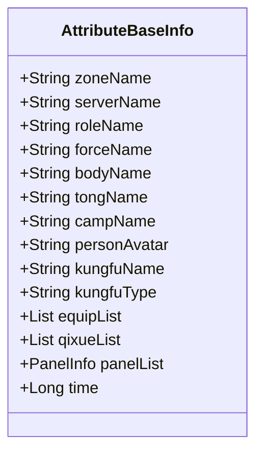
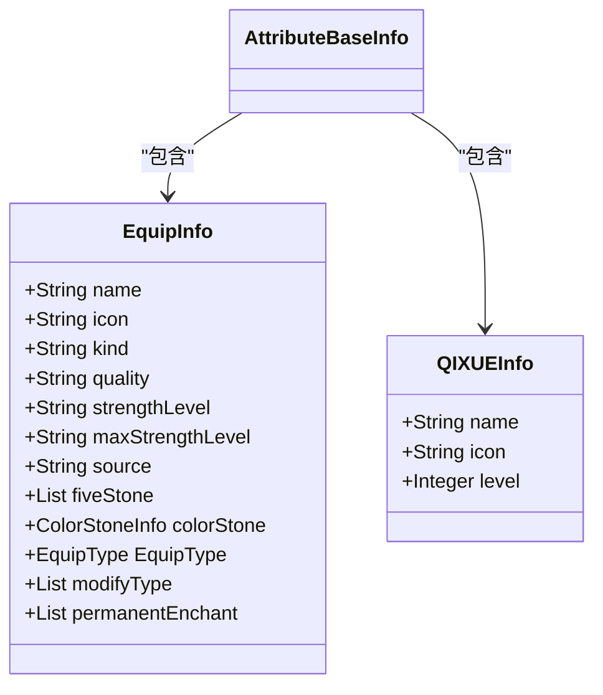
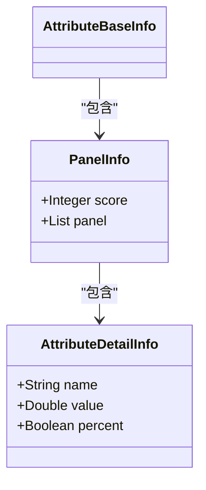
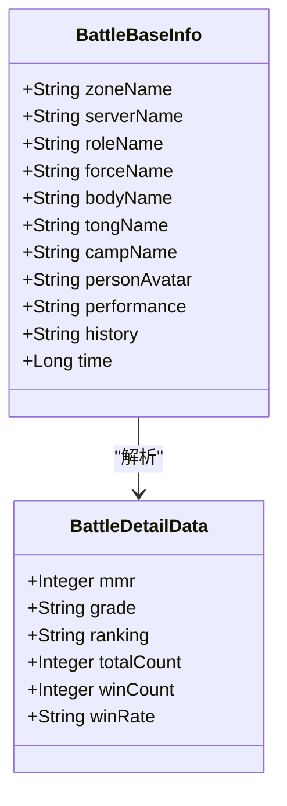
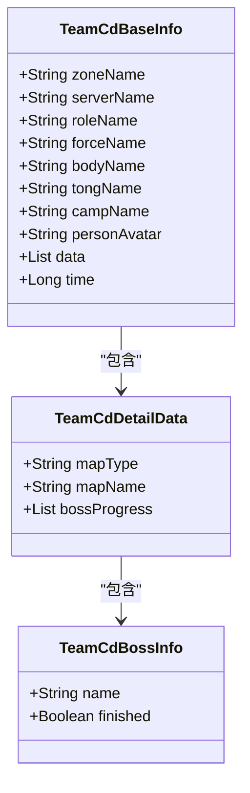
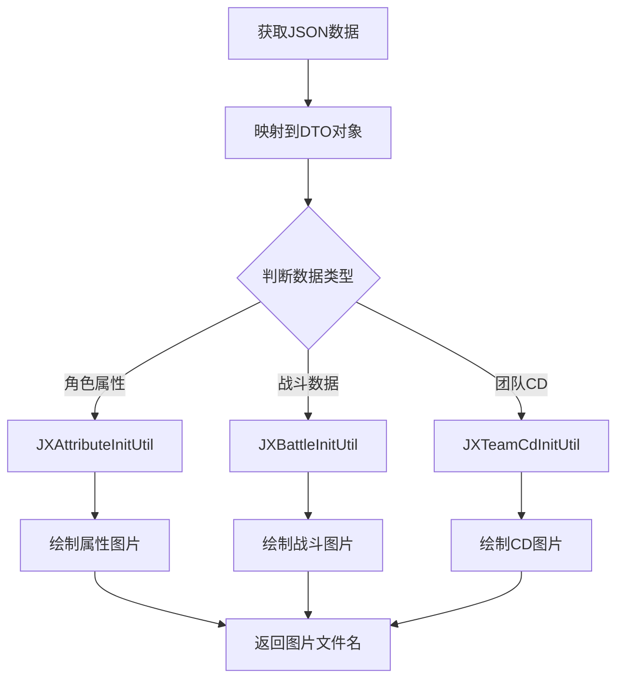

# 剑网3数据模型

<cite>
**本文档引用文件**  
- [AttributeBaseInfo.java](file://Base/src/main/java/com/bot/base/dto/jx/attribute/AttributeBaseInfo.java)
- [EquipInfo.java](file://Base/src/main/java/com/bot/base/dto/jx/attribute/EquipInfo.java)
- [QIXUEInfo.java](file://Base/src/main/java/com/bot/base/dto/jx/attribute/QIXUEInfo.java)
- [PanelInfo.java](file://Base/src/main/java/com/bot/base/dto/jx/attribute/PanelInfo.java)
- [BattleBaseInfo.java](file://Base/src/main/java/com/bot/base/dto/jx/battle/BattleBaseInfo.java)
- [TeamCdBaseInfo.java](file://Base/src/main/java/com/bot/base/dto/jx/teamcd/TeamCdBaseInfo.java)
- [JXAttributeInitUtil.java](file://Base/src/main/java/com/bot/base/util/JXAttributeInitUtil.java)
- [JXBattleInitUtil.java](file://Base/src/main/java/com/bot/base/util/JXBattleInitUtil.java)
- [JXTeamCdInitUtil.java](file://Base/src/main/java/com/bot/base/util/JXTeamCdInitUtil.java)
- [AttributeDetailInfo.java](file://Base/src/main/java/com/bot/base/dto/jx/attribute/AttributeDetailInfo.java)
- [BattleDetailData.java](file://Base/src/main/java/com/bot/base/dto/jx/battle/BattleDetailData.java)
- [TeamCdDetailData.java](file://Base/src/main/java/com/bot/base/dto/jx/teamcd/TeamCdDetailData.java)
</cite>

## 目录
1. [引言](#引言)
2. [角色基础信息模型](#角色基础信息模型)
3. [装备与奇穴信息结构](#装备与奇穴信息结构)
4. [属性面板数据封装](#属性面板数据封装)
5. [战斗数据模型分析](#战斗数据模型分析)
6. [团队副本冷却数据模型](#团队副本冷却数据模型)
7. [数据模型协同工作机制](#数据模型协同工作机制)
8. [结论](#结论)

## 引言
本文档系统化地文档化了剑网3游戏相关的数据传输对象（DTO）模型，重点分析了Base模块中定义的核心数据结构。这些DTO模型用于表示剑网3玩家的完整游戏数据，并通过外部API进行数据交换。文档详细阐述了角色基础信息、装备信息、奇穴信息、属性面板、战斗数据以及团队副本冷却数据的结构设计和初始化流程，展示了这些模型如何协同工作以完整呈现玩家的游戏状态。

## 角色基础信息模型

剑网3的角色基础信息由`AttributeBaseInfo`类定义，该类封装了玩家角色的核心属性。这些属性包括大区、区服、角色名称、门派、帮会、阵营、心法等关键信息，构成了玩家身份的基础标识。

**图示来源**  
- [AttributeBaseInfo.java](file://Base/src/main/java/com/bot/base/dto/jx/attribute/AttributeBaseInfo.java#L10-L82)

**本节来源**  
- [AttributeBaseInfo.java](file://Base/src/main/java/com/bot/base/dto/jx/attribute/AttributeBaseInfo.java#L10-L82)

## 装备与奇穴信息结构

装备信息（`EquipInfo`）和奇穴信息（`QIXUEInfo`）是角色数据的重要组成部分，它们通过集合形式集成到`AttributeBaseInfo`中，形成了角色的完整装备体系。

`EquipInfo`类详细描述了单件装备的属性，包括名称、图标、品质、精炼等级、来源以及镶嵌的五行石、五彩石或附魔效果。`QIXUEInfo`类则记录了奇穴的名称、图标和激活重数。这两个类通过`equipList`和`qixueList`字段与角色基础信息关联，实现了装备和奇穴数据的结构化存储。

**图示来源**  
- [EquipInfo.java](file://Base/src/main/java/com/bot/base/dto/jx/attribute/EquipInfo.java#L10-L71)
- [QIXUEInfo.java](file://Base/src/main/java/com/bot/base/dto/jx/attribute/QIXUEInfo.java#L8-L25)

**本节来源**  
- [EquipInfo.java](file://Base/src/main/java/com/bot/base/dto/jx/attribute/EquipInfo.java#L10-L71)
- [QIXUEInfo.java](file://Base/src/main/java/com/bot/base/dto/jx/attribute/QIXUEInfo.java#L8-L25)

## 属性面板数据封装

`PanelInfo`类负责封装角色的详细属性面板数据。它通过`score`字段表示装备总分，并通过`panel`字段存储一个`AttributeDetailInfo`对象的列表，该列表包含了力量、根骨、身法等各项具体属性的数值。

`PanelInfo`作为`AttributeBaseInfo`的一个字段（`panelList`），将宏观的角色信息与微观的属性数值连接起来。在`JXAttributeInitUtil`工具类的初始化流程中，系统会遍历`panelList`中的`panel`集合，并将每一项属性及其数值绘制到生成的图片上，从而实现属性数据的可视化展示。

**图示来源**  
- [PanelInfo.java](file://Base/src/main/java/com/bot/base/dto/jx/attribute/PanelInfo.java#L10-L22)
- [AttributeDetailInfo.java](file://Base/src/main/java/com/bot/base/dto/jx/attribute/AttributeDetailInfo.java)

**本节来源**  
- [PanelInfo.java](file://Base/src/main/java/com/bot/base/dto/jx/attribute/PanelInfo.java#L10-L22)
- [JXAttributeInitUtil.java](file://Base/src/main/java/com/bot/base/util/JXAttributeInitUtil.java#L65-L71)

## 战斗数据模型分析

`BattleBaseInfo`类定义了剑网3的战斗数据模型，其结构与`AttributeBaseInfo`高度相似，同样包含了大区、区服、角色名称、门派、帮会、阵营等基础字段。此外，它还包含`performance`（表现）和`history`（历史）两个特殊字段，用于存储玩家在竞技场等PVP模式中的详细战绩。

`JXBattleInitUtil`工具类负责处理`BattleBaseInfo`的初始化流程。它会解析`performance`字段中的JSON数据，提取出2v2、3v3、5v5等不同模式的MMPR值、段位、排名、胜率等详细信息，并将这些数据绘制到指定的模板图片上。这种设计将复杂的战斗数据结构化，并通过可视化的方式呈现给用户。

**图示来源**  
- [BattleBaseInfo.java](file://Base/src/main/java/com/bot/base/dto/jx/battle/BattleBaseInfo.java#L8-L65)
- [BattleDetailData.java](file://Base/src/main/java/com/bot/base/dto/jx/battle/BattleDetailData.java)

**本节来源**  
- [BattleBaseInfo.java](file://Base/src/main/java/com/bot/base/dto/jx/battle/BattleBaseInfo.java#L8-L65)
- [JXBattleInitUtil.java](file://Base/src/main/java/com/bot/base/util/JXBattleInitUtil.java#L68-L88)

## 团队副本冷却数据模型

`TeamCdBaseInfo`类用于表示团队副本的冷却数据。它同样继承了基础的角色信息字段，并通过`data`字段（`List<TeamCdDetailData>`）来存储具体的副本进度。

`JXTeamCdInitUtil`工具类是该模型的核心处理逻辑。它会遍历`data`集合，对于每一个`TeamCdDetailData`对象，提取其`mapType`（副本类型）、`mapName`（副本名称）以及`bossProgress`（BOSS进度列表）。在生成的图片上，系统会以迷你字体逐行绘制每个副本的名称，并用绿色或红色分别标记已完成和未完成的BOSS，从而清晰地展示玩家的团队副本挑战进度。

**图示来源**  
- [TeamCdBaseInfo.java](file://Base/src/main/java/com/bot/base/dto/jx/teamcd/TeamCdBaseInfo.java#L10-L62)
- [TeamCdDetailData.java](file://Base/src/main/java/com/bot/base/dto/jx/teamcd/TeamCdDetailData.java)
- [TeamCdBossInfo.java](file://Base/src/main/java/com/bot/base/dto/jx/teamcd/TeamCdBossInfo.java)

**本节来源**  
- [TeamCdBaseInfo.java](file://Base/src/main/java/com/bot/base/dto/jx/teamcd/TeamCdBaseInfo.java#L10-L62)
- [JXTeamCdInitUtil.java](file://Base/src/main/java/com/bot/base/util/JXTeamCdInitUtil.java#L69-L84)

## 数据模型协同工作机制

剑网3的这些DTO模型通过`JXAttributeInitUtil`、`JXBattleInitUtil`和`JXTeamCdInitUtil`三个工具类协同工作，共同完成玩家数据的可视化呈现。整个流程如下：

1.  **数据获取**：系统通过外部API获取JSON格式的原始数据。
2.  **对象映射**：利用`JSONUtil.toBean()`方法，将JSON数据映射到对应的DTO对象（如`AttributeBaseInfo`）。
3.  **数据处理**：工具类根据业务逻辑对DTO对象中的数据进行处理和提取（如解析`performance`字段）。
4.  **图像生成**：加载预设的图片模板，使用`Graphics2D` API将处理后的数据绘制到模板的指定位置。
5.  **结果输出**：生成最终的图片文件并返回文件名，供后续使用。

这种设计模式实现了数据与视图的分离，使得核心数据模型可以独立演进，而展示逻辑则通过工具类灵活实现，极大地提高了系统的可维护性和扩展性。

**本节来源**  
- [JXAttributeInitUtil.java](file://Base/src/main/java/com/bot/base/util/JXAttributeInitUtil.java)
- [JXBattleInitUtil.java](file://Base/src/main/java/com/bot/base/util/JXBattleInitUtil.java)
- [JXTeamCdInitUtil.java](file://Base/src/main/java/com/bot/base/util/JXTeamCdInitUtil.java)

## 结论
本文档详细分析了剑网3游戏数据模型的核心结构。`AttributeBaseInfo`、`BattleBaseInfo`和`TeamCdBaseInfo`作为顶层DTO，分别封装了角色属性、战斗数据和团队副本信息。它们通过`equipList`、`qixueList`、`panelList`和`data`等集合字段，与`EquipInfo`、`QIXUEInfo`、`PanelInfo`等子模型建立关联，形成了层次分明、结构清晰的数据体系。`JXAttributeInitUtil`等工具类则负责将这些结构化的数据转化为直观的可视化图片，完成了从数据到信息的转换。这一整套设计模式为剑网3相关功能的开发提供了坚实的数据基础。