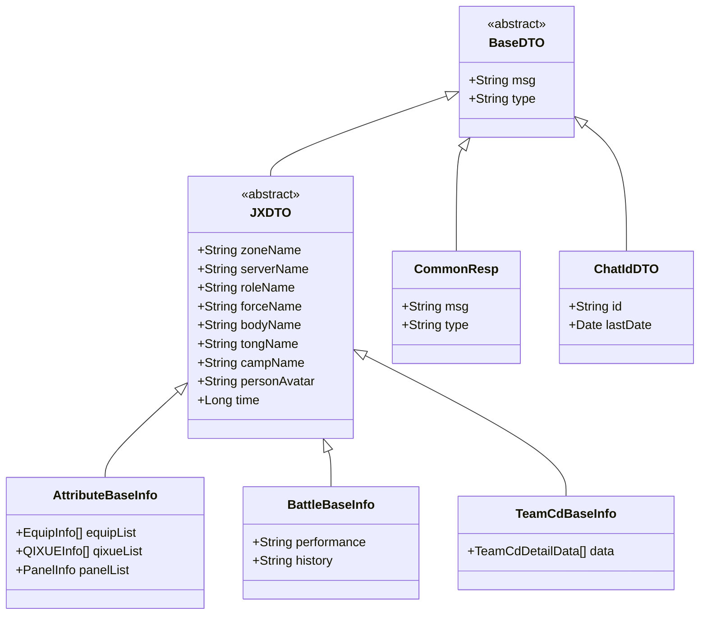
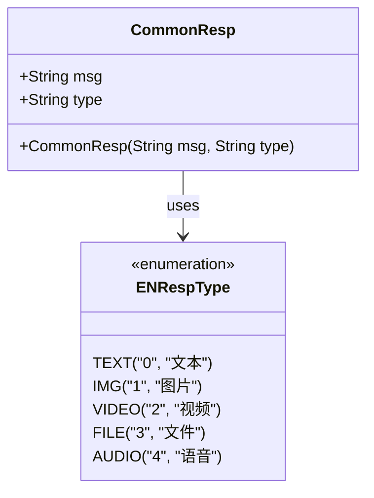
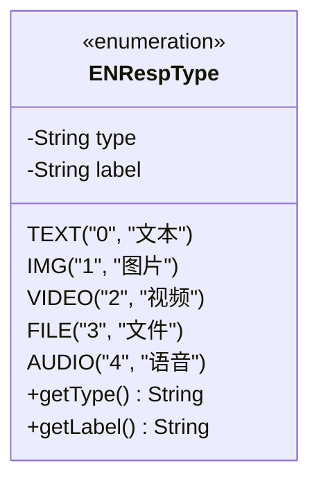
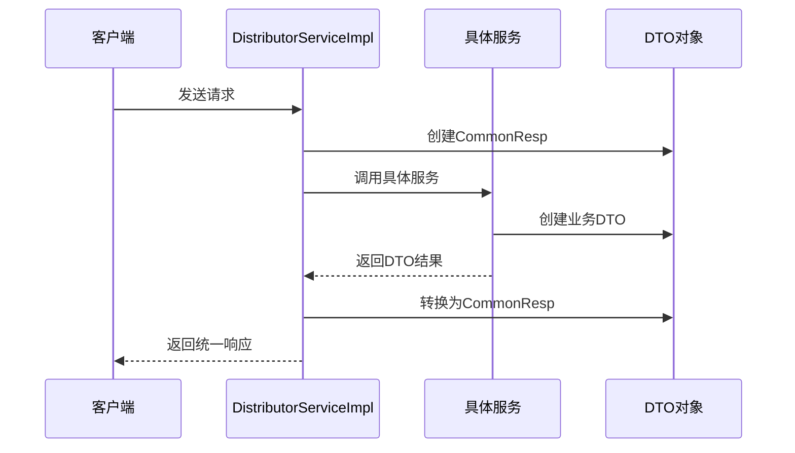
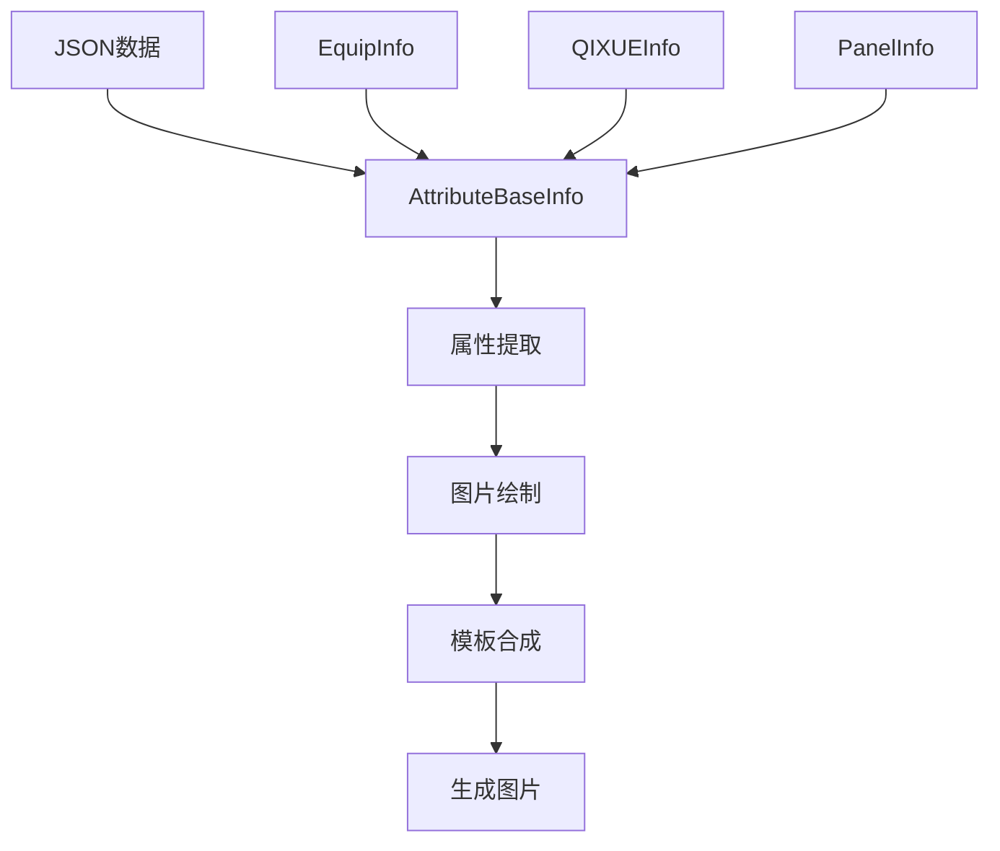
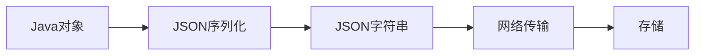
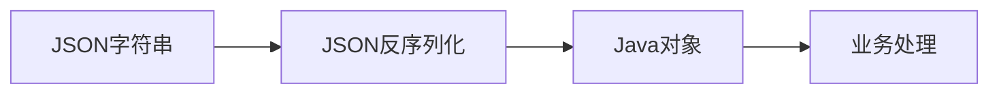

# 数据模型

<cite>
**本文档中引用的文件**
- [AttributeBaseInfo.java](file://Base/src/main/java/com/bot/base/dto/jx/attribute/AttributeBaseInfo.java)
- [BattleBaseInfo.java](file://Base/src/main/java/com/bot/base/dto/jx/battle/BattleBaseInfo.java)
- [TeamCdBaseInfo.java](file://Base/src/main/java/com/bot/base/dto/jx/teamcd/TeamCdBaseInfo.java)
- [CommonResp.java](file://Base/src/main/java/com/bot/base/dto/CommonResp.java)
- [ChatIdDTO.java](file://Base/src/main/java/com/bot/base/dto/ChatIdDTO.java)
- [CreatePicReq.java](file://Base/src/main/java/com/bot/base/dto/CreatePicReq.java)
- [DeepChatReq.java](file://Base/src/main/java/com/bot/base/dto/DeepChatReq.java)
- [WeChatResp.java](file://Base/src/main/java/com/bot/base/dto/WeChatResp.java)
- [WeChatRespData.java](file://Base/src/main/java/com/bot/base/dto/WeChatRespData.java)
- [ENRespType.java](file://Common/src/main/java/com/bot/common/enums/ENRespType.java)
- [DistributorServiceImpl.java](file://Base/src/main/java/com/bot/base/service/impl/DistributorServiceImpl.java)
- [JXAttributeInitUtil.java](file://Base/src/main/java/com/bot/base/util/JXAttributeInitUtil.java)
- [JXBattleInitUtil.java](file://Base/src/main/java/com/bot/base/util/JXBattleInitUtil.java)
- [JXTeamCdInitUtil.java](file://Base/src/main/java/com/bot/base/util/JXTeamCdInitUtil.java)
</cite>

## 目录
1. [概述](#概述)
2. [核心DTO架构](#核心dto架构)
3. [剑网3游戏数据DTO](#剑网3游戏数据dto)
4. [通用响应DTO](#通用响应dto)
5. [聊天引擎交互DTO](#聊天引擎交互dto)
6. [图片生成服务DTO](#图片生成服务dto)
7. [微信API响应DTO](#微信api响应dto)
8. [消息类型枚举](#消息类型枚举)
9. [实际应用场景](#实际应用场景)
10. [数据序列化与反序列化](#数据序列化与反序列化)
11. [总结](#总结)

## 概述

Base模块是剑网3机器人系统的核心数据层，负责定义和管理各种数据传输对象（DTO）。这些DTO在系统内外部数据交互中发挥着关键作用，包括接收和解析外部API返回的数据、封装请求参数、处理响应结果等。本文档将系统化地分析这些DTO的设计理念、结构特点及其在实际业务场景中的应用。

## 核心DTO架构

Base模块的DTO设计遵循清晰的层次结构和职责分离原则，主要分为以下几个类别：

**图表来源**
- [AttributeBaseInfo.java](file://Base/src/main/java/com/bot/base/dto/jx/attribute/AttributeBaseInfo.java#L1-L83)
- [BattleBaseInfo.java](file://Base/src/main/java/com/bot/base/dto/jx/battle/BattleBaseInfo.java#L1-L66)
- [TeamCdBaseInfo.java](file://Base/src/main/java/com/bot/base/dto/jx/teamcd/TeamCdBaseInfo.java#L1-L63)
- [CommonResp.java](file://Base/src/main/java/com/bot/base/dto/CommonResp.java#L1-L20)
- [ChatIdDTO.java](file://Base/src/main/java/com/bot/base/dto/ChatIdDTO.java#L1-L19)

## 剑网3游戏数据DTO

### AttributeBaseInfo - 玩家属性信息

AttributeBaseInfo是剑网3玩家属性数据的核心DTO，包含了角色的基本信息和详细属性数据。

#### 核心字段分析

| 字段名 | 类型 | 描述 | 用途 |
|--------|------|------|------|
| zoneName | String | 大区名称 | 标识玩家所属的游戏大区 |
| serverName | String | 区服名称 | 标识玩家所在的服务器 |
| roleName | String | 角色名称 | 玩家在游戏中的角色名字 |
| forceName | String | 门派名称 | 玩家选择的门派信息 |
| bodyName | String | 体型名称 | 角色的体型特征描述 |
| tongName | String | 帮会名称 | 玩家所属的帮会组织 |
| campName | String | 阵营名称 | 角色的阵营归属 |
| personAvatar | String | 头像URL | 角色的头像图片地址 |
| kungfuName | String | 心法名称 | 玩家修炼的心法名称 |
| kungfuType | String | 心法类型 | 心法的分类类型 |
| equipList | List<EquipInfo> | 装备列表 | 角色穿戴的所有装备信息 |
| qixueList | List<QIXUEInfo> | 奇穴列表 | 角色的奇穴配置信息 |
| panelList | PanelInfo | 详细属性 | 角色的各项属性面板数据 |
| time | Long | 时间戳 | 数据采集的时间点 |

#### 应用场景

AttributeBaseInfo主要用于：
- 玩家属性查询和展示
- 装备数据分析和优化建议
- 奇穴配置管理和推荐
- 属性面板的可视化生成

**节来源**
- [AttributeBaseInfo.java](file://Base/src/main/java/com/bot/base/dto/jx/attribute/AttributeBaseInfo.java#L1-L83)

### BattleBaseInfo - 战斗数据信息

BattleBaseInfo专门用于存储和传输剑网3玩家的战斗相关数据。

#### 核心字段分析

| 字段名 | 类型 | 描述 | 用途 |
|--------|------|------|------|
| zoneName | String | 大区名称 | 标识玩家所属的大区 |
| serverName | String | 区服名称 | 标识玩家所在的服务器 |
| roleName | String | 角色名称 | 玩家角色的名字标识 |
| forceName | String | 门派名称 | 玩家的门派信息 |
| bodyName | String | 体型名称 | 角色的体型特征 |
| tongName | String | 帮会名称 | 玩家所属帮会 |
| campName | String | 阵营名称 | 角色的阵营归属 |
| personAvatar | String | 头像URL | 角色头像的网络地址 |
| performance | String | 表现数据 | 玩家的战斗表现统计 |
| history | String | 历史记录 | 玩家的战斗历史信息 |
| time | Long | 时间戳 | 数据记录的时间点 |

#### 数据结构特点

BattleBaseInfo采用JSON格式存储performance和history字段，便于动态解析不同类型的战斗数据。

**节来源**
- [BattleBaseInfo.java](file://Base/src/main/java/com/bot/base/dto/jx/battle/BattleBaseInfo.java#L1-L66)

### TeamCdBaseInfo - 团队副本信息

TeamCdBaseInfo用于管理剑网3团队副本相关的冷却时间和进度信息。

#### 核心字段分析

| 字段名 | 类型 | 描述 | 用途 |
|--------|------|------|------|
| zoneName | String | 大区名称 | 标识玩家所属的大区 |
| serverName | String | 区服名称 | 标识玩家所在的服务器 |
| roleName | String | 角色名称 | 玩家角色的名字标识 |
| forceName | String | 门派名称 | 玩家的门派信息 |
| bodyName | String | 体型名称 | 角色的体型特征 |
| tongName | String | 帮会名称 | 玩家所属帮会 |
| campName | String | 阵营名称 | 角色的阵营归属 |
| personAvatar | String | 头像URL | 角色头像的网络地址 |
| data | List<TeamCdDetailData> | 冷却数据列表 | 各个副本的冷却时间信息 |
| time | Long | 时间戳 | 数据记录的时间点 |

#### 数据结构特点

TeamCdBaseInfo通过data字段存储复杂的副本冷却数据，每个TeamCdDetailData包含：
- 地图类型和名称
- BOSS击杀进度
- 冷却时间状态
- 解锁状态信息

**节来源**
- [TeamCdBaseInfo.java](file://Base/src/main/java/com/bot/base/dto/jx/teamcd/TeamCdBaseInfo.java#L1-L63)

## 通用响应DTO

### CommonResp - 统一响应体

CommonResp是整个系统中最基础且最重要的响应DTO，提供统一的消息响应格式。

#### 核心字段设计

**图表来源**
- [CommonResp.java](file://Base/src/main/java/com/bot/base/dto/CommonResp.java#L1-L20)
- [ENRespType.java](file://Common/src/main/java/com/bot/common/enums/ENRespType.java#L1-L21)

#### 字段说明

| 字段名 | 类型 | 描述 | 设计考虑 |
|--------|------|------|----------|
| msg | String | 响应消息内容 | 支持任意格式的消息内容 |
| type | String | 消息类型标识 | 与ENRespType枚举配合使用 |

#### 类型控制机制

CommonResp通过type字段与ENRespType枚举配合，实现了灵活的消息类型控制：

- **文本消息（0）**：纯文本内容，适用于普通对话和信息展示
- **图片消息（1）**：图片URL或本地路径，适用于视觉内容展示
- **视频消息（2）**：视频资源地址，适用于多媒体内容
- **文件消息（3）**：文件下载链接，适用于资源文件分享
- **语音消息（4）**：音频文件地址，适用于语音交互

**节来源**
- [CommonResp.java](file://Base/src/main/java/com/bot/base/dto/CommonResp.java#L1-L20)
- [ENRespType.java](file://Common/src/main/java/com/bot/common/enums/ENRespType.java#L1-L21)

## 聊天引擎交互DTO

### ChatIdDTO - 聊天会话标识

ChatIdDTO专门用于维护聊天引擎的会话状态和上下文信息。

#### 核心字段设计

| 字段名 | 类型 | 描述 | 应用场景 |
|--------|------|------|----------|
| id | String | 会话唯一标识 | 标识特定的聊天会话 |
| lastDate | Date | 最后活动时间 | 维护会话活跃状态，防止超时 |

#### 设计特点

ChatIdDTO采用简洁的设计，专注于会话管理的核心需求：
- **唯一性保证**：通过id字段确保每个会话的唯一性
- **状态跟踪**：通过lastDate字段跟踪会话活跃状态
- **轻量级设计**：最小化的字段设计，降低内存占用

**节来源**
- [ChatIdDTO.java](file://Base/src/main/java/com/bot/base/dto/ChatIdDTO.java#L1-L19)

### DeepChatReq - 深度聊天请求

DeepChatReq用于封装与深度聊天引擎交互的请求参数。

#### 核心字段分析

| 字段名 | 类型 | 描述 | 用途 |
|--------|------|------|------|
| inputs | Object | 输入数据 | 聊天引擎的原始输入数据 |
| query | String | 查询内容 | 用户的具体提问内容 |
| response_mode | String | 响应模式 | 控制聊天引擎的输出方式 |
| conversation_id | String | 对话ID | 维护多轮对话的上下文 |
| user | String | 用户标识 | 标识发起请求的用户 |

#### 应用场景

DeepChatReq主要用于：
- 与AI聊天引擎的交互
- 多轮对话上下文管理
- 自定义响应模式控制
- 用户身份识别和权限管理

**节来源**
- [DeepChatReq.java](file://Base/src/main/java/com/bot/base/dto/DeepChatReq.java#L1-L25)

## 图片生成服务DTO

### CreatePicReq - 图片生成请求

CreatePicReq定义了图片生成服务的输入参数规范。

#### 核心字段设计

| 字段名 | 类型 | 描述 | 默认值 | 用途 |
|--------|------|------|--------|------|
| model | String | AI模型名称 | - | 指定使用的AI图像生成模型 |
| prompt | String | 提示词 | - | 描述期望生成的图片内容 |
| image_size | String | 图片尺寸 | - | 指定生成图片的分辨率 |
| num_inference_steps | Integer | 推理步数 | - | 控制生成质量与速度的平衡 |

#### 参数说明

- **model**：支持不同的AI图像生成模型，如SDXL、DALL-E等
- **prompt**：详细的文本描述，直接影响生成图片的质量
- **image_size**：常见的尺寸选项如512x512、1024x1024等
- **num_inference_steps**：推理步数影响生成质量和处理时间

**节来源**
- [CreatePicReq.java](file://Base/src/main/java/com/bot/base/dto/CreatePicReq.java#L1-L19)

## 微信API响应DTO

### WeChatResp - 微信响应主体

WeChatResp是处理微信API响应的标准DTO结构。

#### 核心字段设计

| 字段名 | 类型 | 描述 | 用途 |
|--------|------|------|------|
| to_user | String | 目标用户 | 指定消息接收者 |
| data | WeChatRespData[] | 响应数据数组 | 包含具体的响应内容 |

### WeChatRespData - 微信响应数据

WeChatRespData定义了微信消息的具体内容结构。

#### 核心字段分析

| 字段名 | 类型 | 描述 | 应用场景 |
|--------|------|------|----------|
| at_someone | String | @提及的用户 | 实现群聊中的@功能 |
| cl | Integer | 消息类型代码 | 标识消息的具体类型 |
| msg | String | 文本消息内容 | 存储纯文本消息 |
| img_abspath | String | 图片绝对路径 | 存储本地图片文件路径 |
| file_abspath | String | 文件绝对路径 | 存储本地文件路径 |

#### 数据结构特点

WeChatRespData采用灵活的设计，支持多种消息类型的混合：
- **文本消息**：通过msg字段存储
- **图片消息**：通过img_abspath字段存储
- **文件消息**：通过file_abspath字段存储
- **特殊功能**：通过at_someone字段实现群聊@功能

**节来源**
- [WeChatResp.java](file://Base/src/main/java/com/bot/base/dto/WeChatResp.java#L1-L21)
- [WeChatRespData.java](file://Base/src/main/java/com/bot/base/dto/WeChatRespData.java#L1-L23)

## 消息类型枚举

### ENRespType - 响应类型枚举

ENRespType枚举定义了系统支持的所有消息类型，与CommonResp的type字段配合使用。

#### 枚举值定义

**图表来源**
- [ENRespType.java](file://Common/src/main/java/com/bot/common/enums/ENRespType.java#L1-L21)

#### 类型映射表

| 枚举值 | 类型标识 | 中文标签 | 适用场景 |
|--------|----------|----------|----------|
| TEXT | 0 | 文本 | 普通文字消息、命令回复 |
| IMG | 1 | 图片 | 图片展示、生成的图片 |
| VIDEO | 2 | 视频 | 视频播放、短视频分享 |
| FILE | 3 | 文件 | 文件下载、资源分享 |
| AUDIO | 4 | 语音 | 语音消息、音频文件 |

**节来源**
- [ENRespType.java](file://Common/src/main/java/com/bot/common/enums/ENRespType.java#L1-L21)

## 实际应用场景

### DistributorServiceImpl中的DTO使用

DistributorServiceImpl作为系统的指令分发器，大量使用了各种DTO来处理不同的业务场景。

#### 请求处理流程

**图表来源**
- [DistributorServiceImpl.java](file://Base/src/main/java/com/bot/base/service/impl/DistributorServiceImpl.java#L160-L360)

#### 关键使用场景

1. **用户状态检查**：使用CommonResp返回用户状态信息
2. **服务调用**：通过各种业务DTO传递参数和结果
3. **消息类型转换**：根据ENRespType确定消息展示方式
4. **错误处理**：统一的错误响应格式

**节来源**
- [DistributorServiceImpl.java](file://Base/src/main/java/com/bot/base/service/impl/DistributorServiceImpl.java#L160-L360)

### 工具类中的DTO应用

#### JXAttributeInitUtil - 属性初始化工具

该工具类展示了DTO在数据处理和可视化中的应用：

**图表来源**
- [JXAttributeInitUtil.java](file://Base/src/main/java/com/bot/base/util/JXAttributeInitUtil.java#L45-L170)

#### JXBattleInitUtil - 战斗数据处理

战斗数据的处理流程体现了复杂DTO结构的应用：

1. **JSON解析**：将API返回的JSON数据转换为BattleBaseInfo
2. **数据验证**：检查performance和history字段的有效性
3. **多维度展示**：支持2v2、3v3、5v5三种战斗模式的数据展示
4. **动态布局**：根据实际数据动态调整显示位置

**节来源**
- [JXBattleInitUtil.java](file://Base/src/main/java/com/bot/base/util/JXBattleInitUtil.java#L39-L110)

#### JXTeamCdInitUtil - 团队副本管理

团队副本数据的处理展示了列表型DTO的典型应用：

1. **数据聚合**：将多个副本的冷却数据整合到单一结构中
2. **状态可视化**：通过颜色区分已完成和未完成的BOSS击杀
3. **层级结构**：支持地图-副本-BOSS的三层嵌套结构
4. **动态扩展**：支持不同数量的副本和BOSS配置

**节来源**
- [JXTeamCdInitUtil.java](file://Base/src/main/java/com/bot/base/util/JXTeamCdInitUtil.java#L39-L95)

## 数据序列化与反序列化

### JSON处理流程

Base模块中的DTO广泛使用JSON进行数据序列化和反序列化：

#### 序列化过程

#### 反序列化过程

### 工具类支持

系统使用了多种工具类来简化JSON处理：

1. **JSONUtil**：cn.hutool.json包提供的JSON工具
2. **Lombok注解**：自动生成getter/setter方法
3. **Jackson注解**：支持更复杂的序列化配置

### 性能优化策略

1. **延迟加载**：对于大型DTO，采用延迟加载策略
2. **缓存机制**：对频繁访问的DTO进行缓存
3. **流式处理**：对于大数据量的JSON处理采用流式API
4. **内存管理**：及时释放不再使用的DTO对象

## 总结

Base模块的DTO设计体现了以下核心设计理念：

### 设计原则

1. **职责分离**：每种DTO都有明确的业务职责和边界
2. **类型安全**：强类型设计减少运行时错误
3. **扩展性**：良好的继承和组合关系支持功能扩展
4. **易用性**：简洁的API设计降低使用门槛

### 技术特点

1. **统一响应格式**：CommonResp提供一致的响应接口
2. **灵活的消息类型**：ENRespType支持多种消息类型的处理
3. **丰富的业务覆盖**：涵盖游戏数据、聊天交互、文件处理等多个领域
4. **高效的序列化**：基于JSON的高效数据交换机制

### 应用价值

1. **提升开发效率**：标准化的DTO设计减少重复开发工作
2. **增强系统稳定性**：类型检查和错误处理提高系统可靠性
3. **改善用户体验**：多样化的消息类型满足不同场景需求
4. **支持业务扩展**：灵活的架构设计支持新功能的快速集成

通过系统化的DTO设计，Base模块为整个剑网3机器人系统提供了坚实的数据层基础，支撑了复杂业务逻辑的实现和高效的数据交互。