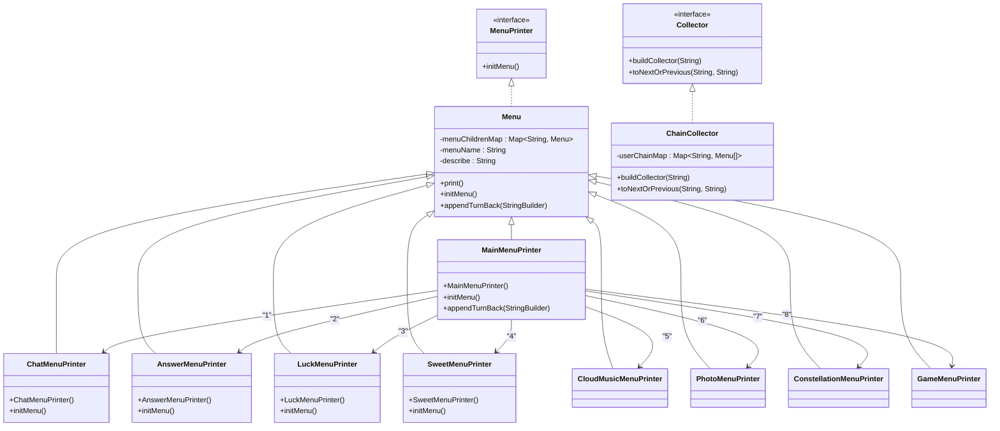
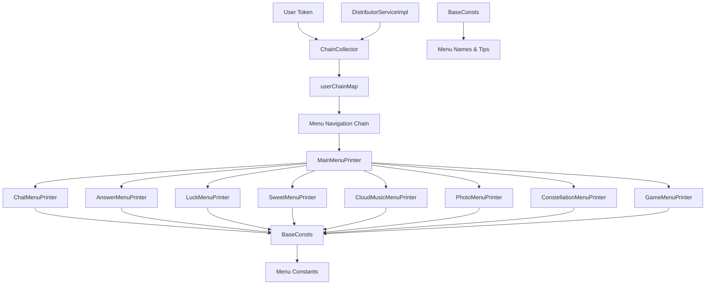

# 菜单系统

<cite>
**本文档中引用的文件**  
- [MenuPrinter.java](file://Base/src/main/java/com/bot/base/chain/MenuPrinter.java)
- [Menu.java](file://Base/src/main/java/com/bot/base/chain/Menu.java)
- [ChainCollector.java](file://Base/src/main/java/com/bot/base/chain/ChainCollector.java)
- [Collector.java](file://Base/src/main/java/com/bot/base/chain/Collector.java)
- [MainMenuPrinter.java](file://Base/src/main/java/com/bot/base/chain/menu/MainMenuPrinter.java)
- [ChatMenuPrinter.java](file://Base/src/main/java/com/bot/base/chain/menu/ChatMenuPrinter.java)
- [AnswerMenuPrinter.java](file://Base/src/main/java/com/bot/base/chain/menu/AnswerMenuPrinter.java)
- [LuckMenuPrinter.java](file://Base/src/main/java/com/bot/base/chain/menu/LuckMenuPrinter.java)
- [SweetMenuPrinter.java](file://Base/src/main/java/com/bot/base/chain/menu/SweetMenuPrinter.java)
- [CloudMusicMenuPrinter.java](file://Base/src/main/java/com/bot/base/chain/menu/CloudMusicMenuPrinter.java)
- [ConstellationMenuPrinter.java](file://Base/src/main/java/com/bot/base/chain/menu/ConstellationMenuPrinter.java)
- [GameMenuPrinter.java](file://Base/src/main/java/com/bot/base/chain/menu/GameMenuPrinter.java)
- [PhotoMenuPrinter.java](file://Base/src/main/java/com/bot/base/chain/menu/PhotoMenuPrinter.java)
- [BaseConsts.java](file://Common/src/main/java/com/bot/common/constant/BaseConsts.java)
- [DistributorServiceImpl.java](file://Base/src/main/java/com/bot/base/service/impl/DistributorServiceImpl.java)
</cite>

## 目录
1. [引言](#引言)
2. [核心组件分析](#核心组件分析)
3. [菜单系统架构](#菜单系统架构)
4. [详细组件分析](#详细组件分析)
5. [依赖关系分析](#依赖关系分析)
6. [性能与扩展性](#性能与扩展性)
7. [结论](#结论)

## 引言
本文档深入解析Base模块中的菜单系统设计与实现。该系统采用面向对象的设计模式，通过接口契约、继承多态和链式导航机制，构建了一个灵活可扩展的菜单体系。系统核心由MenuPrinter接口、Menu抽象类、具体菜单实现类以及ChainCollector导航控制器组成，实现了菜单的动态构建、用户导航和状态维护。

## 核心组件分析

### MenuPrinter接口：菜单实现的基础契约
MenuPrinter接口定义了所有菜单实现类必须遵循的基础契约，其核心方法initMenu()用于初始化菜单结构，包括设置菜单名称、描述信息和子菜单项。该接口作为所有菜单实现类的统一入口，确保了菜单行为的一致性。

**组件来源**
- [MenuPrinter.java](file://Base/src/main/java/com/bot/base/chain/MenuPrinter.java)

### Menu类：菜单节点的抽象表示
Menu类作为菜单系统的抽象基类，实现了MenuPrinter接口，并提供了菜单打印、子菜单管理等通用功能。它通过menuChildrenMap维护子菜单的映射关系，通过print()方法生成菜单显示内容，并通过initMenu()方法强制子类实现菜单初始化逻辑。主菜单通过重写appendTurnBack()方法移除返回选项，体现了对特殊场景的定制化处理。

**组件来源**
- [Menu.java](file://Base/src/main/java/com/bot/base/chain/Menu.java)

### 具体菜单实现类
系统包含多个具体菜单实现类，如MainMenuPrinter、ChatMenuPrinter、AnswerMenuPrinter等，它们均继承自Menu类并实现initMenu()方法。每个实现类在构造函数中调用initMenu()完成自身初始化，通过依赖BaseConsts常量类获取菜单名称和描述信息，实现了配置与代码的分离。

**组件来源**
- [MainMenuPrinter.java](file://Base/src/main/java/com/bot/base/chain/menu/MainMenuPrinter.java)
- [ChatMenuPrinter.java](file://Base/src/main/java/com/bot/base/chain/menu/ChatMenuPrinter.java)
- [AnswerMenuPrinter.java](file://Base/src/main/java/com/bot/base/chain/menu/AnswerMenuPrinter.java)
- [LuckMenuPrinter.java](file://Base/src/main/java/com/bot/base/chain/menu/LuckMenuPrinter.java)
- [SweetMenuPrinter.java](file://Base/src/main/java/com/bot/base/chain/menu/SweetMenuPrinter.java)
- [CloudMusicMenuPrinter.java](file://Base/src/main/java/com/bot/base/chain/menu/CloudMusicMenuPrinter.java)
- [ConstellationMenuPrinter.java](file://Base/src/main/java/com/bot/base/chain/menu/ConstellationMenuPrinter.java)
- [GameMenuPrinter.java](file://Base/src/main/java/com/bot/base/chain/menu/GameMenuPrinter.java)
- [PhotoMenuPrinter.java](file://Base/src/main/java/com/bot/base/chain/menu/PhotoMenuPrinter.java)

## 菜单系统架构

**图示来源**  
- [MenuPrinter.java](file://Base/src/main/java/com/bot/base/chain/MenuPrinter.java)
- [Menu.java](file://Base/src/main/java/com/bot/base/chain/Menu.java)
- [ChainCollector.java](file://Base/src/main/java/com/bot/base/chain/ChainCollector.java)
- [Collector.java](file://Base/src/main/java/com/bot/base/chain/Collector.java)
- [MainMenuPrinter.java](file://Base/src/main/java/com/bot/base/chain/menu/MainMenuPrinter.java)

## 详细组件分析

### 继承与多态关系
菜单系统采用典型的继承与多态设计模式。Menu类作为抽象基类，定义了菜单的通用结构和行为。所有具体菜单类（如ChatMenuPrinter、AnswerMenuPrinter等）通过继承Menu类获得基础功能，并通过重写initMenu()方法实现各自特有的初始化逻辑。这种设计使得系统能够以统一的方式处理不同类型的菜单，同时保持了良好的扩展性。

**组件来源**
- [Menu.java](file://Base/src/main/java/com/bot/base/chain/Menu.java)
- [ChatMenuPrinter.java](file://Base/src/main/java/com/bot/base/chain/menu/ChatMenuPrinter.java)
- [AnswerMenuPrinter.java](file://Base/src/main/java/com/bot/base/chain/menu/AnswerMenuPrinter.java)

### ChainCollector：菜单导航链管理
ChainCollector是菜单导航系统的核心控制器，实现了Collector接口。它通过静态的userChainMap维护每个用户（以token标识）的菜单导航链，支持菜单的前进与返回操作。

#### buildCollector()：构建初始菜单链
该方法在用户首次进入菜单系统时调用，创建以MainMenuPrinter为根节点的初始菜单链，并将其与用户token关联存储。这为后续的导航操作提供了起点。

#### toNextOrPrevious()：处理用户选择跳转
该方法根据用户输入的选项（point）决定导航方向：
- 当point为"0"时，执行返回操作，移除当前菜单并返回上一级菜单
- 当point为其他值时，查找当前菜单的子菜单映射，找到目标菜单并将其加入导航链，实现向前导航

这种栈式的数据结构设计确保了导航路径的可追溯性和正确性。

**组件来源**
- [ChainCollector.java](file://Base/src/main/java/com/bot/base/chain/ChainCollector.java)
- [Collector.java](file://Base/src/main/java/com/bot/base/chain/Collector.java)

### Collector接口：菜单链管理的抽象
Collector接口定义了菜单链管理的两个核心操作：构建初始链和处理导航跳转。该接口的抽象设计为未来可能的多策略实现提供了扩展点，例如可以实现基于数据库存储的持久化导航链，或基于会话的临时导航链等不同策略。

**组件来源**
- [Collector.java](file://Base/src/main/java/com/bot/base/chain/Collector.java)

## 依赖关系分析

**图示来源**  
- [ChainCollector.java](file://Base/src/main/java/com/bot/base/chain/ChainCollector.java)
- [MainMenuPrinter.java](file://Base/src/main/java/com/bot/base/chain/menu/MainMenuPrinter.java)
- [BaseConsts.java](file://Common/src/main/java/com/bot/common/constant/BaseConsts.java)
- [DistributorServiceImpl.java](file://Base/src/main/java/com/bot/base/service/impl/DistributorServiceImpl.java)

## 性能与扩展性

### 可扩展性设计
菜单系统具有良好的可扩展性。新增功能菜单时，只需创建新的Menu子类，实现initMenu()方法，并在主菜单的初始化逻辑中添加相应的映射即可。这种设计遵循开闭原则，对扩展开放，对修改关闭。

### 性能考虑
系统使用HashMap存储子菜单映射，保证了O(1)时间复杂度的菜单查找性能。导航链使用ArrayList实现，虽然移除末尾元素效率较高，但整体内存占用与用户导航深度成正比。对于长时间会话的用户，可能需要考虑链长度限制或超时清理机制。

**组件来源**
- [Menu.java](file://Base/src/main/java/com/bot/base/chain/Menu.java)
- [ChainCollector.java](file://Base/src/main/java/com/bot/base/chain/ChainCollector.java)

## 结论
Base模块的菜单系统通过精心设计的接口契约、继承体系和导航控制器，构建了一个结构清晰、易于扩展的菜单框架。MenuPrinter接口和Menu抽象类奠定了系统的基石，具体实现类通过多态机制提供了灵活的功能扩展能力，而ChainCollector则通过用户token维护了导航状态，实现了流畅的菜单交互体验。该设计充分体现了面向对象编程的优势，为系统的持续演进提供了坚实的基础。