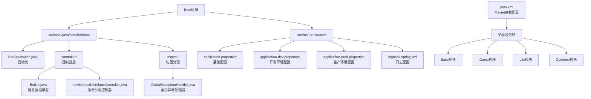
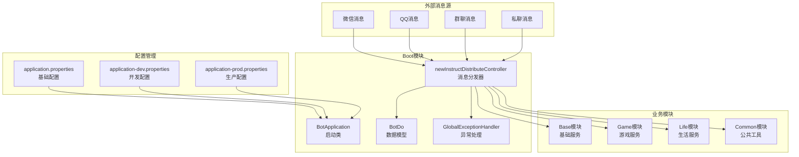
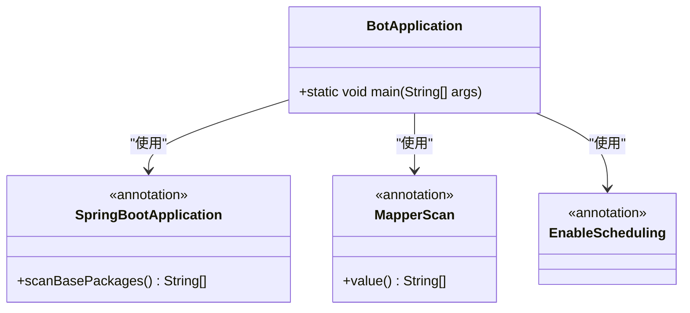
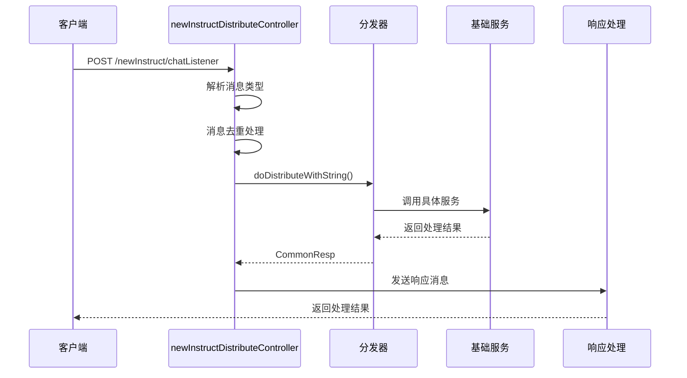
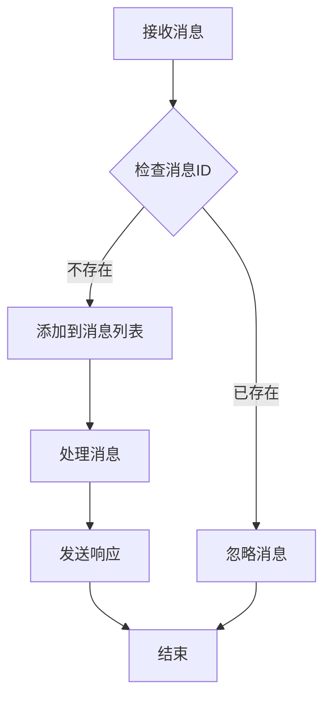
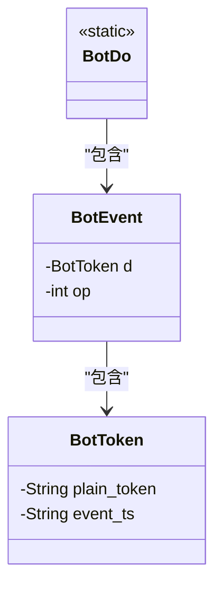
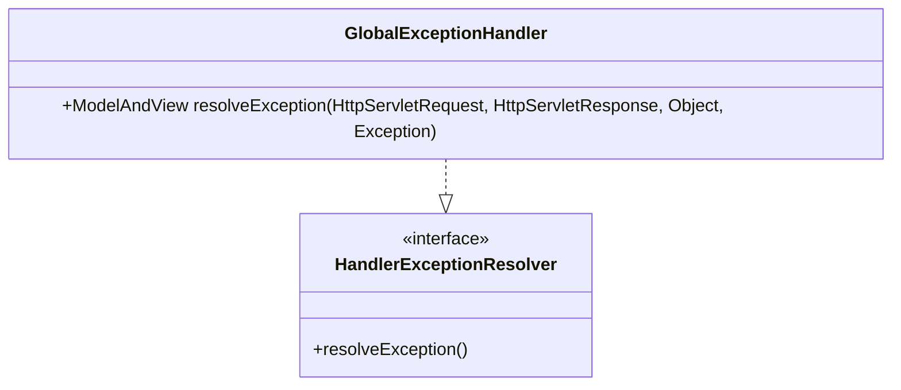
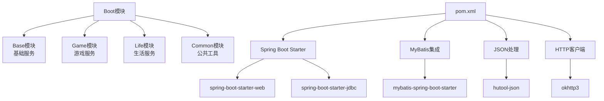

# Boot模块详细文档

<cite>
**本文档引用的文件**
- [BotApplication.java](file://Boot/src/main/java/com/bot/boot/BotApplication.java)
- [newInstructDistributeController.java](file://Boot/src/main/java/com/bot/boot/controller/newInstructDistributeController.java)
- [BotDo.java](file://Boot/src/main/java/com/bot/boot/controller/BotDo.java)
- [GlobalExceptionHandler.java](file://Boot/src/main/java/com/bot/boot/aspect/GlobalExceptionHandler.java)
- [application.properties](file://Boot/src/main/resources/application.properties)
- [application-dev.properties](file://Boot/src/main/resources/application-dev.properties)
- [application-prod.properties](file://Boot/src/main/resources/application-prod.properties)
- [pom.xml](file://Boot/pom.xml)
</cite>

## 目录
1. [简介](#简介)
2. [项目结构](#项目结构)
3. [核心组件](#核心组件)
4. [架构概览](#架构概览)
5. [详细组件分析](#详细组件分析)
6. [配置管理](#配置管理)
7. [模块依赖](#模块依赖)
8. [性能考虑](#性能考虑)
9. [故障排除指南](#故障排除指南)
10. [结论](#结论)

## 简介

Boot模块是整个Bot系统的启动入口和请求分发核心，负责接收来自不同渠道的QQ消息指令，并将其分发给相应的业务模块进行处理。该模块采用Spring Boot框架构建，提供了统一的消息处理接口和灵活的配置管理机制。

Boot模块的主要职责包括：
- 作为Spring Boot应用的启动入口
- 接收和解析来自微信、QQ等平台的消息
- 实现消息的统一分发和路由
- 提供全局异常处理机制
- 管理系统配置和环境变量

## 项目结构

Boot模块的文件组织结构清晰，遵循Spring Boot的标准目录结构：



**图表来源**
- [BotApplication.java](file://Boot/src/main/java/com/bot/boot/BotApplication.java#L1-L22)
- [newInstructDistributeController.java](file://Boot/src/main/java/com/bot/boot/controller/newInstructDistributeController.java#L1-L50)
- [pom.xml](file://Boot/pom.xml#L1-L55)

**章节来源**
- [BotApplication.java](file://Boot/src/main/java/com/bot/boot/BotApplication.java#L1-L22)
- [pom.xml](file://Boot/pom.xml#L1-L55)

## 核心组件

Boot模块包含以下核心组件：

### BotApplication启动类
BotApplication是整个应用的启动入口，负责初始化Spring Boot容器和配置扫描路径。

### newInstructDistributeController控制器
这是消息分发的核心控制器，处理来自不同渠道的消息请求，根据消息类型进行分类处理。

### BotDo数据模型
定义了消息传输过程中的数据结构，包括事件令牌和操作类型。

### 全局异常处理器
提供统一的异常处理机制，确保系统在出现错误时能够优雅地处理。

**章节来源**
- [BotApplication.java](file://Boot/src/main/java/com/bot/boot/BotApplication.java#L12-L21)
- [newInstructDistributeController.java](file://Boot/src/main/java/com/bot/boot/controller/newInstructDistributeController.java#L43-L65)
- [BotDo.java](file://Boot/src/main/java/com/bot/boot/controller/BotDo.java#L1-L19)
- [GlobalExceptionHandler.java](file://Boot/src/main/java/com/bot/boot/aspect/GlobalExceptionHandler.java#L1-L27)

## 架构概览

Boot模块在整个Bot系统中扮演着中枢角色，连接各个业务模块：



**图表来源**
- [BotApplication.java](file://Boot/src/main/java/com/bot/boot/BotApplication.java#L12-L14)
- [newInstructDistributeController.java](file://Boot/src/main/java/com/bot/boot/controller/newInstructDistributeController.java#L43-L65)

## 详细组件分析

### BotApplication启动类分析

BotApplication类是Spring Boot应用的入口点，具有以下关键特性：



**图表来源**
- [BotApplication.java](file://Boot/src/main/java/com/bot/boot/BotApplication.java#L12-L14)

#### 包扫描配置
BotApplication通过`scanBasePackages`属性配置了多个包的扫描路径，确保所有业务模块的组件都能被Spring容器管理：

- `com.bot.boot`：Boot模块自身
- `com.bot.base`：基础服务模块
- `com.bot.game`：游戏服务模块  
- `com.bot.life`：生活服务模块
- `com.bot.common.loader`：通用加载器

#### MyBatis映射扫描
通过`@MapperScan`注解配置了数据库访问层的扫描路径，支持多模块的Mapper接口管理。

**章节来源**
- [BotApplication.java](file://Boot/src/main/java/com/bot/boot/BotApplication.java#L12-L14)

### newInstructDistributeController控制器分析

newInstructDistributeController是消息分发的核心组件，负责处理来自不同渠道的消息请求：



**图表来源**
- [newInstructDistributeController.java](file://Boot/src/main/java/com/bot/boot/controller/newInstructDistributeController.java#L72-L250)

#### 消息类型处理
控制器支持多种消息类型的处理：

| 消息类型 | 描述 | 处理方式 |
|---------|------|----------|
| 60001 | 私聊文字消息 | 调用Distributor服务进行文本处理 |
| 80001 | 群聊文字消息 | 处理@机器人消息，支持私聊模式 |
| 60002 | 私聊图片消息 | 调用PictureDistributor处理图片 |
| 80002 | 群聊图片消息 | 处理群聊图片，支持@功能 |
| 60006 | 私聊表情消息 | 调用EmojiDistributor处理表情 |
| 80006 | 群聊表情消息 | 处理群聊表情 |
| 60022 | 私聊邀请消息 | 自动接受群聊邀请 |
| 85008/85009 | 进群消息 | 发送欢迎消息 |

#### 消息去重机制
控制器实现了基于消息ID的消息去重机制，防止重复处理相同的消息：



**图表来源**
- [newInstructDistributeController.java](file://Boot/src/main/java/com/bot/boot/controller/newInstructDistributeController.java#L70-L93)

**章节来源**
- [newInstructDistributeController.java](file://Boot/src/main/java/com/bot/boot/controller/newInstructDistributeController.java#L43-L250)

### BotDo数据模型分析

BotDo类定义了消息传输过程中的数据结构，主要包括：



**图表来源**
- [BotDo.java](file://Boot/src/main/java/com/bot/boot/controller/BotDo.java#L4-L18)

该数据模型主要用于QQ平台的消息验证和处理，其中：
- `BotEvent`：表示机器人事件对象
- `BotToken`：包含验证令牌和平台时间戳

**章节来源**
- [BotDo.java](file://Boot/src/main/java/com/bot/boot/controller/BotDo.java#L1-L19)

### 全局异常处理器分析

GlobalExceptionHandler提供了统一的异常处理机制：



**图表来源**
- [GlobalExceptionHandler.java](file://Boot/src/main/java/com/bot/boot/aspect/GlobalExceptionHandler.java#L17-L26)

该处理器确保系统在遇到未捕获的异常时能够返回统一的错误响应，提高系统的健壮性。

**章节来源**
- [GlobalExceptionHandler.java](file://Boot/src/main/java/com/bot/boot/aspect/GlobalExceptionHandler.java#L1-L27)

## 配置管理

Boot模块采用了多层次的配置管理策略，支持开发、测试、生产等多种环境：

### 配置文件层次结构

```mermaid
graph TD
A[application.properties<br/>基础配置] --> B[application-dev.properties<br/>开发环境配置]
A --> C[application-prod.properties<br/>生产环境配置]
B --> D[本地开发配置]
C --> E[线上生产配置]
F[spring.profiles.active] --> G[@profileActive@]
G --> H[动态选择环境]
I[数据库配置] --> J[MySQL连接池设置]
K[第三方API密钥] --> L[各服务API密钥管理]
M[日志配置] --> N[日志级别和输出路径]
```

**图表来源**
- [application.properties](file://Boot/src/main/resources/application.properties#L1-L70)
- [application-dev.properties](file://Boot/src/main/resources/application-dev.properties#L1-L59)
- [application-prod.properties](file://Boot/src/main/resources/application-prod.properties#L1-L92)

### 关键配置参数

#### 服务器配置
| 参数 | 开发环境 | 生产环境 | 说明 |
|------|----------|----------|------|
| server.port | 9091 | 9091 | 应用监听端口 |
| server.servlet.context-path | /bot | /bot | 应用上下文路径 |

#### 数据库配置
| 参数 | 开发环境 | 生产环境 | 说明 |
|------|----------|----------|------|
| spring.datasource.url | MySQL URL | MySQL URL | 数据库连接地址 |
| spring.datasource.username | root | root | 数据库用户名 |
| spring.datasource.password | gouzaizi@123 | gouzaizi@123 | 数据库密码 |
| spring.datasource.type | DruidDataSource | DruidDataSource | 连接池类型 |

#### 第三方API配置
Boot模块集成了多个第三方服务，每个服务都有对应的配置项：

| 服务类型 | 配置项 | 示例值 | 用途 |
|----------|--------|--------|------|
| 聊天服务 | chat.url | http://113.45.63.97/v1/chat-messages | AI对话接口 |
| 音乐服务 | cloud.music.url | https://api.uomg.com/api/rand.music | 随机音乐推荐 |
| 图片服务 | picture.path | https://api.btstu.cn/sjtx/api.php | 随机图片获取 |
| 星座服务 | constellation.path | http://web.juhe.cn:8080/constellation/getAll | 星座运势查询 |
| 京东API | jd.key | f15a38879f2aae87be1c46fdebfd9b39 | 京东智能云服务 |

**章节来源**
- [application.properties](file://Boot/src/main/resources/application.properties#L1-L70)
- [application-dev.properties](file://Boot/src/main/resources/application-dev.properties#L1-L59)
- [application-prod.properties](file://Boot/src/main/resources/application-prod.properties#L1-L92)

## 模块依赖

Boot模块作为整个系统的启动入口，需要依赖其他子模块才能正常运行：

### Maven依赖配置



**图表来源**
- [pom.xml](file://Boot/pom.xml#L14-L34)

### 依赖模块说明

#### Base模块
- **作用**：提供基础服务和通用功能
- **主要组件**：Distributor分发器、各种业务服务实现
- **依赖关系**：被Boot模块直接调用

#### Game模块  
- **作用**：提供游戏相关的业务逻辑
- **主要组件**：游戏状态管理、玩家操作处理
- **依赖关系**：通过Distributor间接被Boot模块调用

#### Life模块
- **作用**：提供生活模拟游戏功能
- **主要组件**：生活系统处理、角色管理
- **依赖关系**：通过Distributor间接被Boot模块调用

#### Common模块
- **作用**：提供通用工具和常量定义
- **主要组件**：工具类、枚举定义、配置缓存
- **依赖关系**：被所有模块共享使用

**章节来源**
- [pom.xml](file://Boot/pom.xml#L14-L34)

## 性能考虑

Boot模块在设计时充分考虑了性能优化：

### 消息处理性能
- **消息去重**：通过消息ID列表避免重复处理
- **异步处理**：对于耗时操作（如视频发送）使用线程池异步执行
- **内存管理**：及时清理消息ID列表，防止内存泄漏

### 数据库连接优化
- **连接池配置**：使用Druid连接池，支持高并发访问
- **连接参数优化**：合理的初始连接数、最大活跃连接数配置

### 缓存策略
- **系统配置缓存**：SystemConfigCache缓存系统配置信息
- **消息记录缓存**：临时消息记录缓存减少重复计算

## 故障排除指南

### 常见问题及解决方案

#### 1. 服务启动失败
**症状**：应用无法正常启动
**可能原因**：
- 数据库连接配置错误
- 端口被占用
- 依赖模块缺失

**解决方案**：
- 检查数据库连接配置
- 确认端口可用性
- 验证Maven依赖完整性

#### 2. 消息处理异常
**症状**：消息无法正确处理或响应
**可能原因**：
- 第三方API密钥过期
- 业务模块服务不可用
- 消息格式不正确

**解决方案**：
- 更新API密钥配置
- 检查业务模块健康状态
- 验证消息格式规范

#### 3. 性能问题
**症状**：消息响应延迟较高
**可能原因**：
- 数据库查询性能瓶颈
- 并发处理能力不足
- 网络请求超时

**解决方案**：
- 优化数据库查询语句
- 调整线程池配置
- 设置合理的超时时间

**章节来源**
- [GlobalExceptionHandler.java](file://Boot/src/main/java/com/bot/boot/aspect/GlobalExceptionHandler.java#L20-L25)

## 结论

Boot模块作为Bot系统的核心入口，成功实现了以下目标：

### 主要成就
1. **统一入口**：提供了一个统一的应用启动入口和消息处理接口
2. **灵活分发**：实现了基于消息类型的智能分发机制
3. **环境适配**：支持多环境配置管理，便于部署和维护
4. **异常处理**：建立了完善的异常处理机制，提高系统稳定性
5. **模块化设计**：清晰的模块划分，便于功能扩展和维护

### 技术特色
- 采用Spring Boot框架，简化了配置和部署
- 使用MyBatis进行数据库访问，支持复杂查询
- 实现了消息去重和异步处理机制
- 提供了灵活的配置管理策略

### 扩展性
Boot模块的设计具有良好的扩展性，可以轻松添加新的消息渠道和业务功能，为Bot系统的持续发展奠定了坚实的基础。