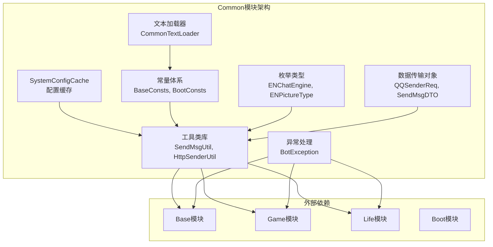
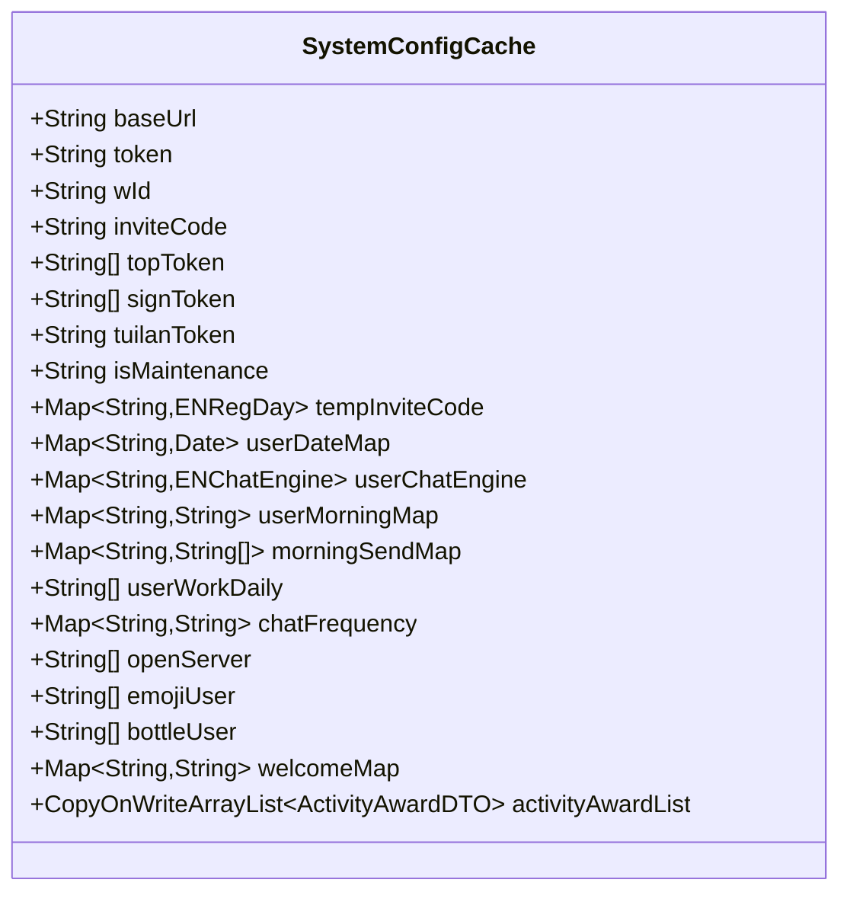
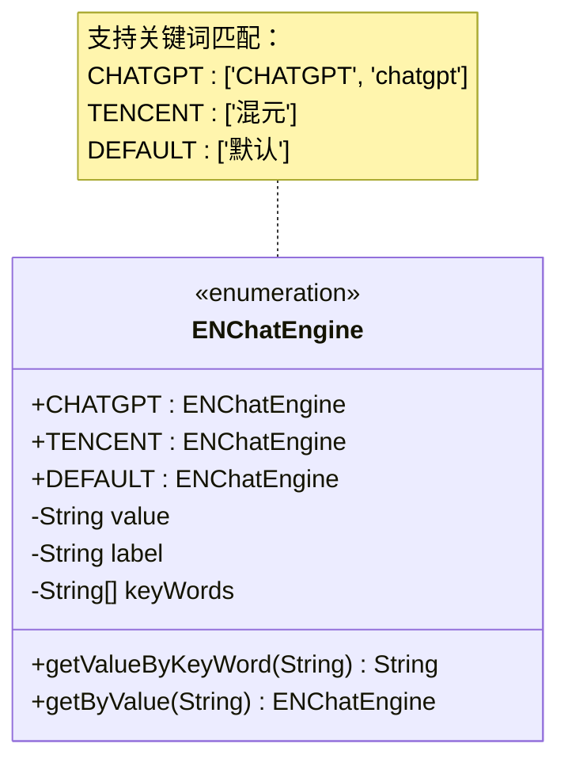
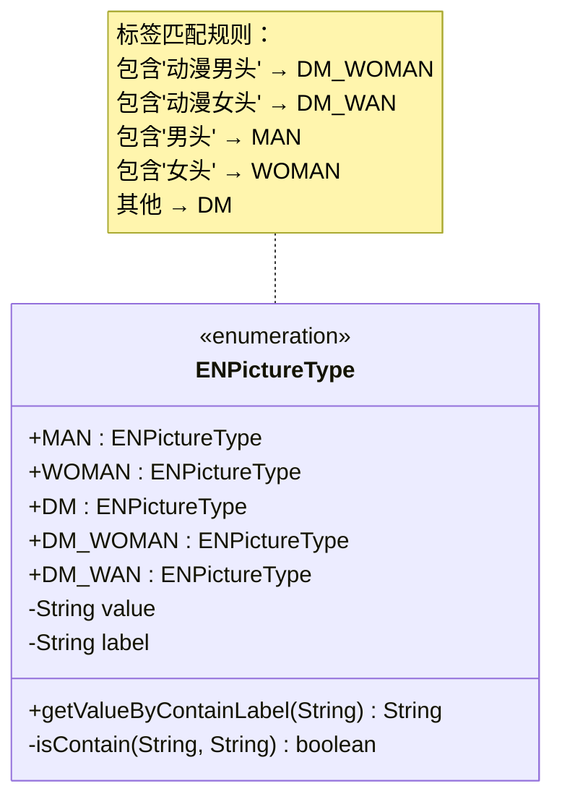
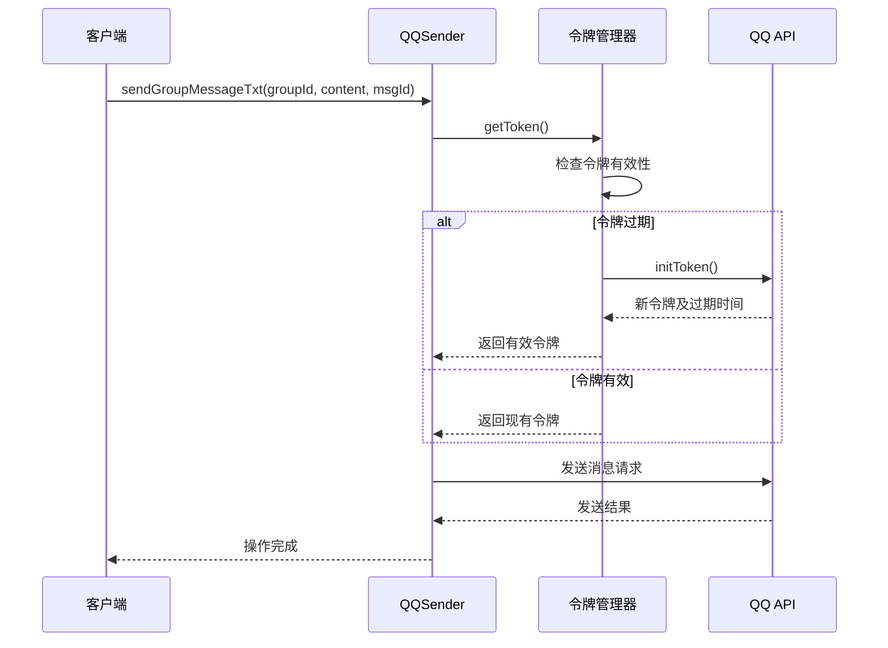
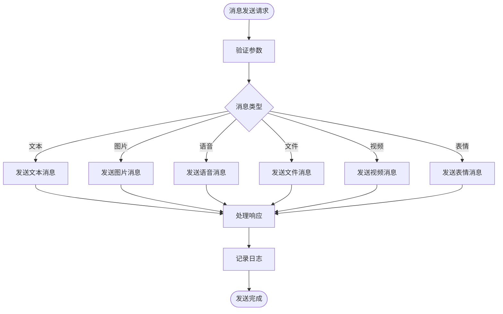
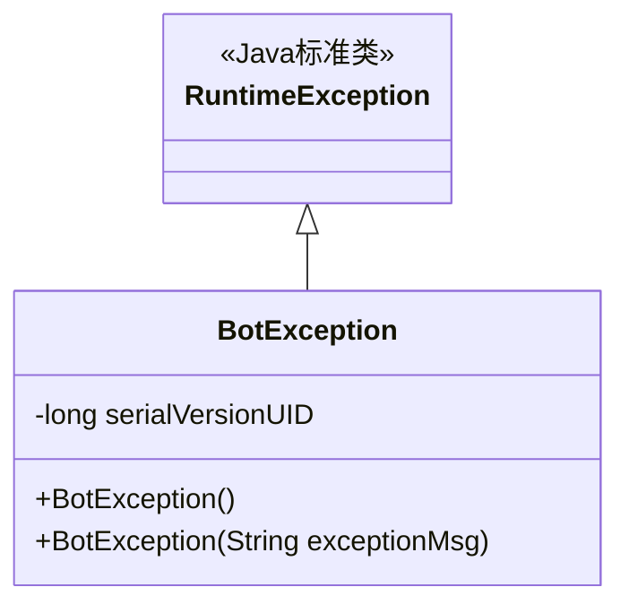
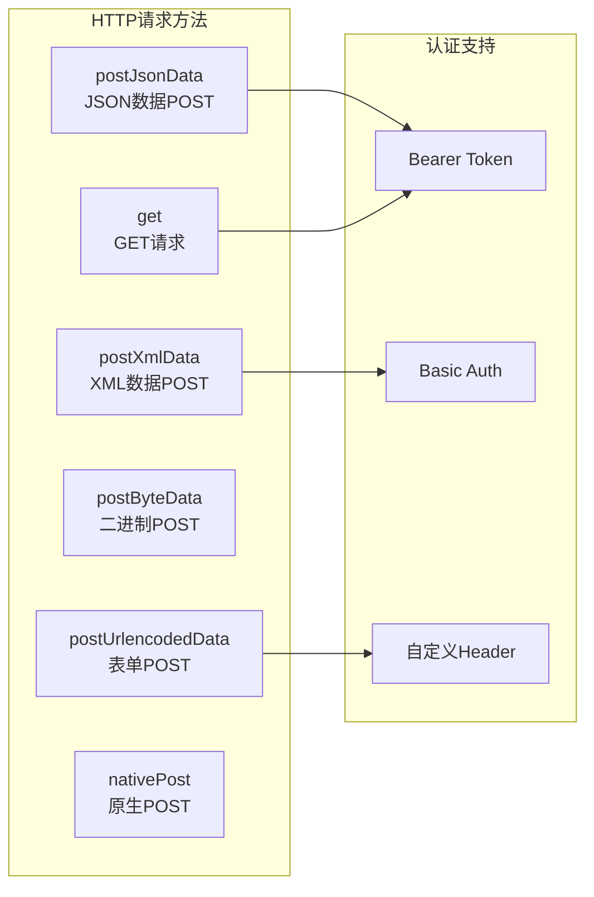
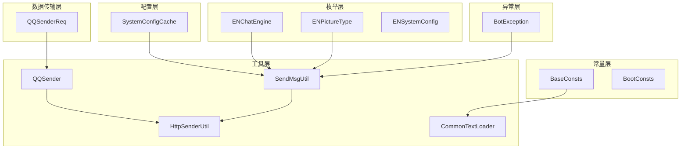

# Common模块

<cite>
**本文档引用的文件**
- [SystemConfigCache.java](file://Common/src/main/java/com/bot/common/config/SystemConfigCache.java)
- [BaseConsts.java](file://Common/src/main/java/com/bot/common/constant/BaseConsts.java)
- [BootConsts.java](file://Common/src/main/java/com/bot/common/constant/BootConsts.java)
- [ENChatEngine.java](file://Common/src/main/java/com/bot/common/enums/ENChatEngine.java)
- [ENPictureType.java](file://Common/src/main/java/com/bot/common/enums/ENPictureType.java)
- [ENSystemConfig.java](file://Common/src/main/java/com/bot/common/enums/ENSystemConfig.java)
- [QQSender.java](file://Common/src/main/java/com/bot/common/util/QQSender.java)
- [BotException.java](file://Common/src/main/java/com/bot/common/exception/BotException.java)
- [SendMsgUtil.java](file://Common/src/main/java/com/bot/common/util/SendMsgUtil.java)
- [HttpSenderUtil.java](file://Common/src/main/java/com/bot/common/util/HttpSenderUtil.java)
- [CommonTextLoader.java](file://Common/src/main/java/com/bot/common/loader/CommonTextLoader.java)
- [QQSenderReq.java](file://Common/src/main/java/com/bot/common/dto/qqsender/QQSenderReq.java)
</cite>

## 目录
1. [模块概述](#模块概述)
2. [系统架构](#系统架构)
3. [核心组件分析](#核心组件分析)
4. [配置管理系统](#配置管理系统)
5. [常量定义体系](#常量定义体系)
6. [枚举类型设计](#枚举类型设计)
7. [消息发送机制](#消息发送机制)
8. [异常处理体系](#异常处理体系)
9. [工具类库](#工具类库)
10. [模块依赖关系](#模块依赖关系)
11. [最佳实践指南](#最佳实践指南)
12. [总结](#总结)

## 模块概述

Common模块是Bot项目的核心公共组件库，作为整个系统的基础设施层，为各个业务模块提供统一的配置管理、常量定义、枚举类型、消息发送、异常处理等基础服务。该模块采用分层架构设计，通过清晰的职责划分和标准化的接口定义，实现了高度的可复用性和可维护性。

### 核心特性

- **集中化配置管理**：提供系统配置的统一存储和动态刷新机制
- **标准化常量定义**：建立完整的常量体系，确保代码的一致性和可维护性
- **类型安全的枚举**：通过枚举类型实现业务状态和配置项的类型安全管理
- **统一的消息发送**：封装多种消息类型的发送协议，简化业务逻辑
- **完善的异常处理**：建立分层的异常处理体系，提升系统的健壮性
- **灵活的工具类库**：提供丰富的工具方法，支持各种业务场景

## 系统架构

**图表来源**
- [SystemConfigCache.java](file://Common/src/main/java/com/bot/common/config/SystemConfigCache.java#L1-L116)
- [BaseConsts.java](file://Common/src/main/java/com/bot/common/constant/BaseConsts.java#L1-L288)
- [SendMsgUtil.java](file://Common/src/main/java/com/bot/common/util/SendMsgUtil.java#L1-L274)

## 核心组件分析

### SystemConfigCache - 配置缓存中心

SystemConfigCache是Common模块的核心配置管理组件，采用静态变量设计，提供系统配置的集中存储和动态访问功能。

#### 主要功能特性

- **实时配置更新**：支持运行时动态刷新系统配置
- **多维度配置管理**：涵盖用户配置、系统参数、业务状态等多个维度
- **线程安全设计**：使用CopyOnWriteArrayList确保并发安全性
- **类型化配置项**：为不同类型的配置提供专门的存储结构

#### 配置分类体系

**图表来源**
- [SystemConfigCache.java](file://Common/src/main/java/com/bot/common/config/SystemConfigCache.java#L11-L116)

**章节来源**
- [SystemConfigCache.java](file://Common/src/main/java/com/bot/common/config/SystemConfigCache.java#L1-L116)

### 常量体系设计

#### BaseConsts - 基础常量定义

BaseConsts提供了完整的业务常量定义体系，采用接口嵌套的方式组织不同业务领域的常量：

- **菜单常量**：定义系统菜单相关的数字标识和文本描述
- **分发器常量**：配置消息分发和处理的规则
- **业务功能常量**：涵盖答案之书、运势占卜、情话机器人等核心功能的配置
- **系统管理常量**：定义系统管理模式和权限控制相关配置

#### BootConsts - 启动配置常量

BootConsts专注于系统启动和初始化阶段的配置定义，目前主要包含异常处理相关的字符串常量。

**章节来源**
- [BaseConsts.java](file://Common/src/main/java/com/bot/common/constant/BaseConsts.java#L1-L288)
- [BootConsts.java](file://Common/src/main/java/com/bot/common/constant/BootConsts.java#L1-L13)

## 枚举类型设计

### ENChatEngine - 聊天引擎枚举

ENChatEngine定义了系统支持的不同聊天引擎类型，采用关键词匹配机制实现智能路由：

**图表来源**
- [ENChatEngine.java](file://Common/src/main/java/com/bot/common/enums/ENChatEngine.java#L11-L44)

### ENPictureType - 图片类型枚举

ENPictureType定义了系统支持的图片类型，提供基于标签的智能识别和分类功能：

**图表来源**
- [ENPictureType.java](file://Common/src/main/java/com/bot/common/enums/ENPictureType.java#L11-L57)

### ENSystemConfig - 系统配置枚举

ENSystemConfig定义了系统配置项的标准化枚举，为配置管理提供类型安全的访问方式。

**章节来源**
- [ENChatEngine.java](file://Common/src/main/java/com/bot/common/enums/ENChatEngine.java#L1-L44)
- [ENPictureType.java](file://Common/src/main/java/com/bot/common/enums/ENPictureType.java#L1-L57)
- [ENSystemConfig.java](file://Common/src/main/java/com/bot/common/enums/ENSystemConfig.java#L1-L24)

## 消息发送机制

### QQSender - QQ消息发送器

QQSender是QQ平台消息发送的核心工具类，实现了完整的OAuth认证流程和多种消息类型的发送支持：

#### 核心功能架构

**图表来源**
- [QQSender.java](file://Common/src/main/java/com/bot/common/util/QQSender.java#L33-L103)

#### 认证机制设计

QQSender实现了基于OAuth 2.0的认证机制，包括：
- **令牌自动获取**：首次调用时自动获取访问令牌
- **令牌自动刷新**：检测令牌过期并自动刷新
- **过期时间管理**：精确控制令牌的有效期（提前30秒过期）
- **错误处理**：完善的异常捕获和错误处理机制

**章节来源**
- [QQSender.java](file://Common/src/main/java/com/bot/common/util/QQSender.java#L1-L104)

### SendMsgUtil - 通用消息发送工具

SendMsgUtil提供了统一的消息发送接口，支持多种消息类型和发送场景：

#### 支持的消息类型

| 消息类型 | 方法名 | 功能描述 |
|---------|--------|----------|
| 文本消息 | sendMsg | 发送普通文本消息 |
| 图片消息 | sendImg | 发送图片链接 |
| 语音消息 | sendAudio | 发送音频文件 |
| 文件消息 | sendFile | 发送文件附件 |
| 视频消息 | sendVideo | 发送视频文件 |
| 表情消息 | sendEmoji | 发送表情包 |
| 群组消息 | sendGroupMsg | 发送群组消息 |
| 朋友圈消息 | snsSendImage | 发送朋友圈内容 |

#### 核心功能流程

**图表来源**
- [SendMsgUtil.java](file://Common/src/main/java/com/bot/common/util/SendMsgUtil.java#L27-L273)

**章节来源**
- [SendMsgUtil.java](file://Common/src/main/java/com/bot/common/util/SendMsgUtil.java#L1-L274)

## 异常处理体系

### BotException - 基础异常类

BotException是Common模块的基础异常类，采用RuntimeException设计，提供简洁的异常处理机制：

**图表来源**
- [BotException.java](file://Common/src/main/java/com/bot/common/exception/BotException.java#L7-L19)

#### 设计原则

- **轻量级设计**：继承RuntimeException，避免强制异常处理
- **序列化支持**：提供serialVersionUID确保序列化兼容性
- **简洁构造**：提供无参和带消息参数的构造方法
- **扩展性**：可通过继承实现更具体的异常类型

**章节来源**
- [BotException.java](file://Common/src/main/java/com/bot/common/exception/BotException.java#L1-L20)

## 工具类库

### HttpSenderUtil - HTTP请求工具

HttpSenderUtil提供了完整的HTTP通信能力，支持多种请求方式和认证机制：

#### 核心功能特性

- **多种请求方式**：支持GET、POST、PUT、DELETE等HTTP方法
- **多种数据格式**：支持JSON、XML、表单数据、二进制数据
- **认证机制**：支持Basic Auth、Bearer Token、自定义Header
- **SSL支持**：内置SSL证书验证和绕过机制
- **连接池管理**：优化网络连接性能

#### 请求方法分类

**图表来源**
- [HttpSenderUtil.java](file://Common/src/main/java/com/bot/common/util/HttpSenderUtil.java#L168-L226)

### CommonTextLoader - 文本资源加载器

CommonTextLoader负责系统文本资源的加载和管理，提供动态配置能力：

#### 加载功能

- **服务指令映射**：加载服务指令到服务类的映射关系
- **菜单指令映射**：加载菜单指令到菜单类的映射关系  
- **固定回答配置**：加载预设的固定回答内容
- **默认回复配置**：加载未知指令的默认回复列表
- **答案之书内容**：加载答案之书的回复内容
- **游戏历史记录**：加载游戏版本历史信息

**章节来源**
- [HttpSenderUtil.java](file://Common/src/main/java/com/bot/common/util/HttpSenderUtil.java#L1-L483)
- [CommonTextLoader.java](file://Common/src/main/java/com/bot/common/loader/CommonTextLoader.java#L1-L105)

## 模块依赖关系

### 内部依赖结构

**图表来源**
- [SystemConfigCache.java](file://Common/src/main/java/com/bot/common/config/SystemConfigCache.java#L1-L116)
- [SendMsgUtil.java](file://Common/src/main/java/com/bot/common/util/SendMsgUtil.java#L1-L274)

### 外部模块集成

Common模块作为基础设施层，被Base、Game、Life等业务模块广泛依赖，形成了稳定的依赖关系：

- **Base模块**：依赖常量定义、消息发送工具
- **Game模块**：依赖配置管理、异常处理
- **Life模块**：依赖工具类库、枚举类型
- **Boot模块**：依赖异常处理、配置缓存

## 最佳实践指南

### 配置管理最佳实践

1. **配置项命名规范**
   - 使用全大写字母和下划线分隔
   - 采用有意义的描述性名称
   - 区分环境特定配置和通用配置

2. **配置更新策略**
   - 实现配置变更的通知机制
   - 提供配置回滚功能
   - 记录配置变更历史

3. **配置安全考虑**
   - 敏感配置加密存储
   - 配置访问权限控制
   - 配置版本管理

### 枚举类型使用规范

1. **枚举设计原则**
   - 保持枚举的不可变性
   - 提供类型安全的访问方法
   - 实现合理的序列化支持

2. **枚举扩展机制**
   - 使用接口定义通用行为
   - 实现工厂方法模式
   - 提供便捷的查找方法

### 工具类使用指南

1. **工具类设计原则**
   - 保持工具类的无状态性
   - 提供完整的异常处理
   - 实现线程安全

2. **方法命名规范**
   - 使用动词开头的方法名
   - 明确的方法功能描述
   - 一致的参数命名风格

3. **错误处理策略**
   - 提供详细的错误信息
   - 实现优雅的降级处理
   - 记录详细的日志信息

### 异常处理最佳实践

1. **异常分类策略**
   - 区分业务异常和系统异常
   - 提供有意义的异常消息
   - 实现异常的层次化处理

2. **异常传播机制**
   - 在适当层次处理异常
   - 提供异常转换机制
   - 实现异常的链式传递

## 总结

Common模块作为Bot项目的公共组件库，通过精心设计的架构和完善的组件体系，为整个系统提供了稳定可靠的基础设施支撑。模块的主要优势包括：

### 核心价值

1. **统一性**：通过标准化的接口和规范，确保各业务模块的一致性
2. **可维护性**：清晰的职责分离和模块化设计，便于维护和扩展
3. **可复用性**：通用的工具类和配置管理，减少重复开发工作
4. **稳定性**：完善的异常处理和错误恢复机制，提升系统可靠性

### 技术特色

- **配置管理**：实现了集中化、动态化的配置管理体系
- **类型安全**：通过枚举类型和泛型设计，提供编译时类型检查
- **异步处理**：支持非阻塞的消息发送和网络请求
- **扩展性**：良好的接口设计支持功能的灵活扩展

### 应用建议

1. **合理使用配置缓存**：充分利用SystemConfigCache的动态刷新能力
2. **规范常量定义**：遵循BaseConsts的设计模式，保持常量的一致性
3. **谨慎使用枚举**：根据业务需求选择合适的枚举类型设计
4. **重视异常处理**：建立完善的异常处理机制，提升系统健壮性

Common模块的设计理念和实现方式为大型分布式系统的基础设施建设提供了宝贵的参考价值，其模块化、标准化的设计思路值得在类似项目中借鉴和应用。