# 工具类

<cite>
**本文档引用的文件**
- [QQSender.java](file://Common/src/main/java/com/bot/common/util/QQSender.java)
- [HttpSenderUtil.java](file://Common/src/main/java/com/bot/common/util/HttpSenderUtil.java)
- [TextUtil.java](file://Common/src/main/java/com/bot/common/util/TextUtil.java)
- [SendMsgUtil.java](file://Common/src/main/java/com/bot/common/util/SendMsgUtil.java)
- [ThreadPoolManager.java](file://Common/src/main/java/com/bot/common/util/ThreadPoolManager.java)
- [AudioTransUtil.java](file://Common/src/main/java/com/bot/common/util/AudioTransUtil.java)
- [QQSenderReq.java](file://Common/src/main/java/com/bot/common/dto/qqsender/QQSenderReq.java)
- [QQMediaInfo.java](file://Common/src/main/java/com/bot/common/dto/qqsender/QQMediaInfo.java)
- [QQMediaSenderReq.java](file://Common/src/main/java/com/bot/common/dto/qqsender/QQMediaSenderReq.java)
- [SystemConfigCache.java](file://Common/src/main/java/com/bot/common/config/SystemConfigCache.java)
- [CloudMusicServiceImpl.java](file://Base/src/main/java/com/bot/base/service/impl/CloudMusicServiceImpl.java)
- [ConstellationServiceImpl.java](file://Base/src/main/java/com/bot/base/service/impl/ConstellationServiceImpl.java)
- [PictureDistributorServiceImpl.java](file://Base/src/main/java/com/bot/base/service/impl/PictureDistributorServiceImpl.java)
</cite>

## 目录
1. [简介](#简介)
2. [项目结构概览](#项目结构概览)
3. [QQ消息发送协议封装](#qq消息发送协议封装)
4. [HTTP客户端工具类](#http客户端工具类)
5. [文本处理工具类](#文本处理工具类)
6. [消息发送统一调度器](#消息发送统一调度器)
7. [线程池管理策略](#线程池管理策略)
8. [音频转换工具](#音频转换工具)
9. [外部API安全调用](#外部api安全调用)
10. [典型使用场景](#典型使用场景)
11. [线程安全性与性能考量](#线程安全性与性能考量)
12. [总结](#总结)

## 简介

本文档全面解析QQSender工具类对QQ消息发送协议的封装细节，包括文本、图片、语音、表情、好友、群消息等多类型消息的构建与发送流程。同时阐述HttpSenderUtil如何基于底层HTTP客户端实现对外部API（如音乐、星座服务）的安全调用，TextUtil提供的文本处理功能在消息处理链中的应用，以及ThreadPoolManager对异步任务线程池的管理策略。

## 项目结构概览

该项目采用模块化架构，主要分为以下几个核心模块：

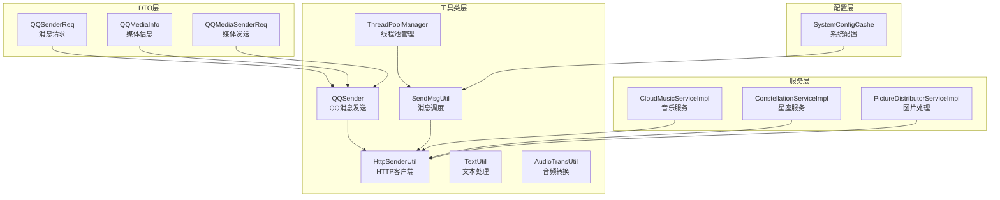

**图表来源**
- [QQSender.java](file://Common/src/main/java/com/bot/common/util/QQSender.java#L1-L104)
- [HttpSenderUtil.java](file://Common/src/main/java/com/bot/common/util/HttpSenderUtil.java#L1-L483)
- [SendMsgUtil.java](file://Common/src/main/java/com/bot/common/util/SendMsgUtil.java#L1-L274)

## QQ消息发送协议封装

### 核心架构设计

QQSender类是整个QQ消息发送协议的核心封装，提供了完整的OAuth2.0认证机制和多种消息类型的发送功能。

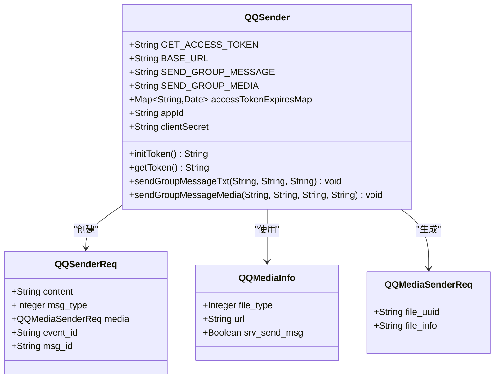

**图表来源**
- [QQSender.java](file://Common/src/main/java/com/bot/common/util/QQSender.java#L17-L103)
- [QQSenderReq.java](file://Common/src/main/java/com/bot/common/dto/qqsender/QQSenderReq.java#L8-L20)
- [QQMediaInfo.java](file://Common/src/main/java/com/bot/common/dto/qqsender/QQMediaInfo.java#L8-L16)
- [QQMediaSenderReq.java](file://Common/src/main/java/com/bot/common/dto/qqsender/QQMediaSenderReq.java#L7-L13)

### 认证机制实现

QQSender实现了完整的OAuth2.0访问令牌管理机制：

| 功能特性 | 实现细节 | 安全考虑 |
|---------|---------|---------|
| 令牌初始化 | 自动获取访问令牌，设置过期时间 | 提前30秒过期处理 |
| 令牌缓存 | 内存级缓存管理 | 防止频繁请求API |
| 自动刷新 | 过期检测与自动刷新 | 确保服务连续性 |
| 错误处理 | 异常捕获与日志记录 | 便于问题排查 |

**章节来源**
- [QQSender.java](file://Common/src/main/java/com/bot/common/util/QQSender.java#L33-L66)

### 消息类型支持

QQSender支持多种消息类型的发送：

| 消息类型 | 支持格式 | 发送方法 | 应用场景 |
|---------|---------|---------|---------|
| 文本消息 | 纯文本 | sendGroupMessageTxt | 常规聊天回复 |
| 图片消息 | 图片URL | sendGroupMessageMedia | 图片分享、表情包 |
| 语音消息 | 音频文件 | 间接支持 | 语音聊天 |
| 表情消息 | 表情标识 | 间接支持 | 情绪表达 |

**章节来源**
- [QQSender.java](file://Common/src/main/java/com/bot/common/util/QQSender.java#L69-L100)

## HTTP客户端工具类

### 多种认证方式支持

HttpSenderUtil提供了灵活的HTTP请求处理能力，支持多种认证方式：

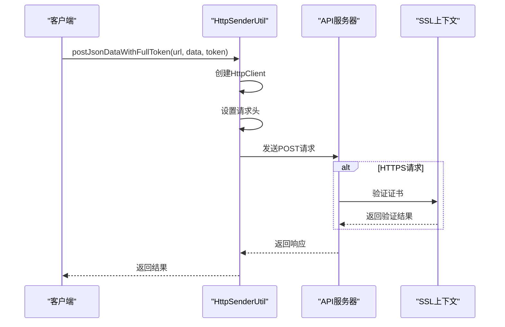

**图表来源**
- [HttpSenderUtil.java](file://Common/src/main/java/com/bot/common/util/HttpSenderUtil.java#L208-L226)

### 请求方法分类

| 方法类型 | 方法名称 | 使用场景 | 特点 |
|---------|---------|---------|------|
| JSON请求 | postJsonDataWithFullToken | QQ API调用 | 支持完整令牌 |
| JSON请求 | postJsonDataWithToken | 第三方API | 支持Bearer令牌 |
| JSON请求 | postJsonData | 系统内部调用 | 固定令牌 |
| 表单请求 | postNameValuePairs | 数据提交 | URL编码 |
| GET请求 | get | 数据查询 | 参数拼接 |
| 文件下载 | download | 资源获取 | 流式处理 |

**章节来源**
- [HttpSenderUtil.java](file://Common/src/main/java/com/bot/common/util/HttpSenderUtil.java#L64-L482)

### SSL安全处理

HttpSenderUtil实现了绕过SSL验证的机制，确保与各种API服务器的兼容性：

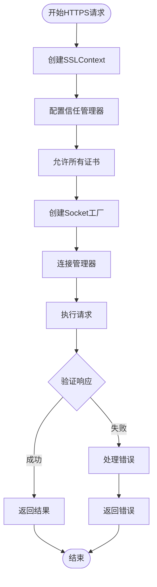

**图表来源**
- [HttpSenderUtil.java](file://Common/src/main/java/com/bot/common/util/HttpSenderUtil.java#L367-L392)

## 文本处理工具类

### HttpServletRequest处理

TextUtil提供了简单的HTTP请求流处理功能：

| 功能 | 实现方式 | 应用场景 |
|------|---------|---------|
| 流解析 | ServletInputStream读取 | 请求体内容提取 |
| 字符串转换 | 字节数组转字符串 | 文本内容处理 |
| 异常处理 | try-catch包装 | 稳定性保障 |

**章节来源**
- [TextUtil.java](file://Common/src/main/java/com/bot/common/util/TextUtil.java#L15-L28)

## 消息发送统一调度器

### SendMsgUtil架构设计

SendMsgUtil作为消息发送的统一调度器，提供了丰富的消息类型支持：

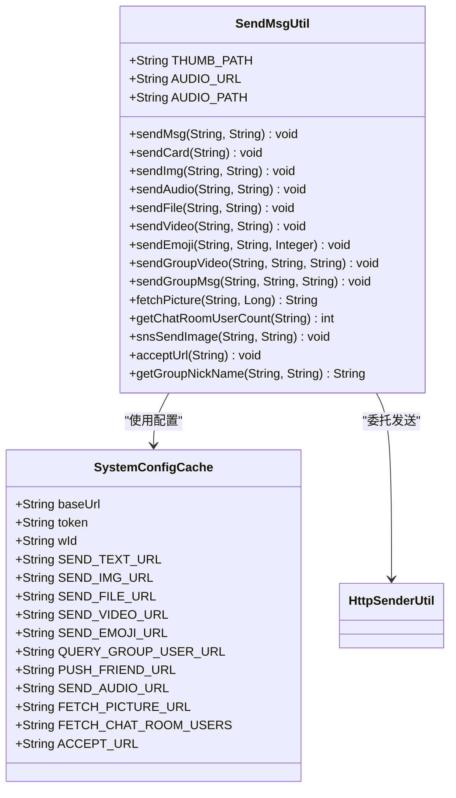

**图表来源**
- [SendMsgUtil.java](file://Common/src/main/java/com/bot/common/util/SendMsgUtil.java#L18-L274)
- [SystemConfigCache.java](file://Common/src/main/java/com/bot/common/config/SystemConfigCache.java#L11-L115)

### 消息类型处理流程

| 消息类型 | 处理流程 | 特殊功能 |
|---------|---------|---------|
| 文本消息 | 构建SendMsgDTO → JSON序列化 → HTTP发送 | 支持@提及 |
| 图片消息 | URL验证 → 文件上传 → 发送确认 | 自动缩略图 |
| 语音消息 | 音频转换 → 时长计算 → 文件上传 | Silk格式转换 |
| 视频消息 | 视频处理 → 缩略图生成 → 发送 | 自动封面 |
| 表情消息 | MD5校验 → 尺寸验证 → 发送 | 支持自定义大小 |
| 群消息 | 群成员查询 → 内容构建 → 批量发送 | 支持@全体 |

**章节来源**
- [SendMsgUtil.java](file://Common/src/main/java/com/bot/common/util/SendMsgUtil.java#L27-L273)

## 线程池管理策略

### ThreadPoolManager设计架构

ThreadPoolManager继承自ThreadPoolExecutor，提供了三种不同优先级的任务队列：

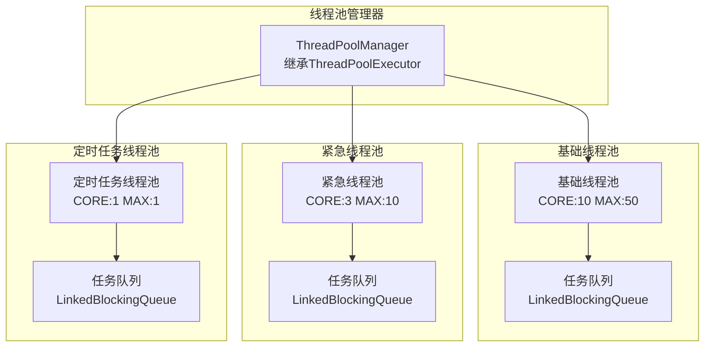

**图表来源**
- [ThreadPoolManager.java](file://Common/src/main/java/com/bot/common/util/ThreadPoolManager.java#L13-L123)

### 线程池配置参数

| 线程池类型 | 核心线程数 | 最大线程数 | 存活时间 | 适用场景 |
|-----------|-----------|-----------|---------|---------|
| 基础线程池 | 10 | 50 | 60秒 | 日常消息处理 |
| 紧急线程池 | 3 | 10 | 60秒 | 系统维护任务 |
| 定时任务线程池 | 1 | 1 | 60秒 | 定时清理任务 |

**章节来源**
- [ThreadPoolManager.java](file://Common/src/main/java/com/bot/common/util/ThreadPoolManager.java#L18-L56)

### 定时任务调度机制

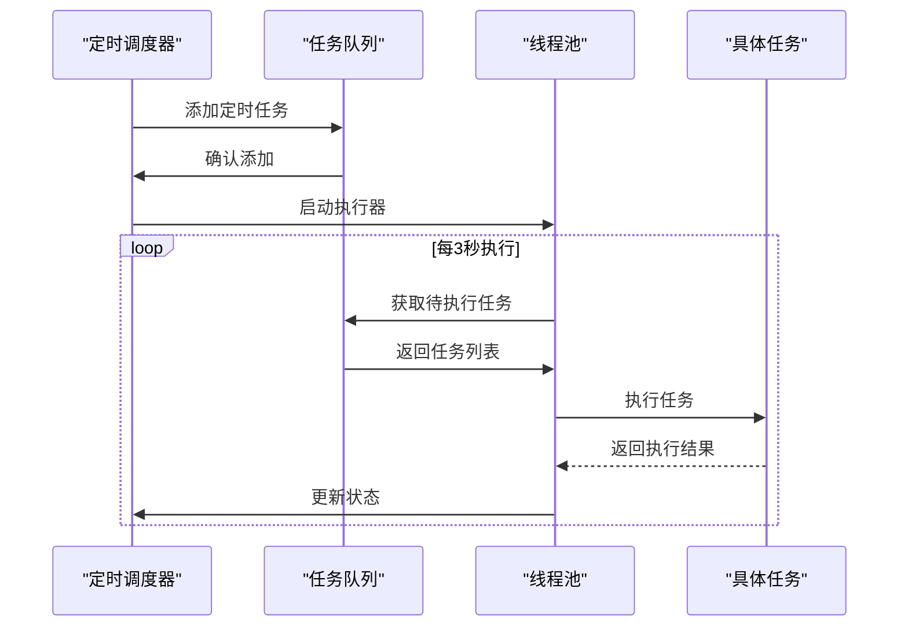

**图表来源**
- [ThreadPoolManager.java](file://Common/src/main/java/com/bot/common/util/ThreadPoolManager.java#L102-L116)

## 音频转换工具

### AudioTransUtil功能特性

AudioTransUtil提供了音频格式转换和时长计算功能：

| 功能 | 实现方式 | 应用场景 |
|------|---------|---------|
| MP3转Silk | 系统进程调用 | QQ语音格式转换 |
| MP3转AMR | JAVE库处理 | 通用音频压缩 |
| 时长计算 | 字节长度算法 | 语音时长统计 |

**章节来源**
- [AudioTransUtil.java](file://Common/src/main/java/com/bot/common/util/AudioTransUtil.java#L12-L61)

### 音频格式支持

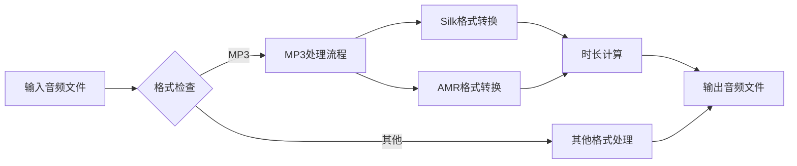

**图表来源**
- [AudioTransUtil.java](file://Common/src/main/java/com/bot/common/util/AudioTransUtil.java#L12-L61)

## 外部API安全调用

### 音乐服务集成

CloudMusicServiceImpl展示了如何安全地调用外部音乐API：

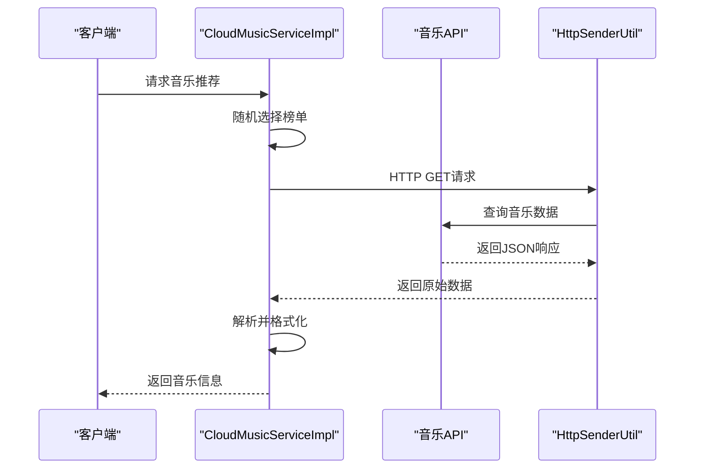

**图表来源**
- [CloudMusicServiceImpl.java](file://Base/src/main/java/com/bot/base/service/impl/CloudMusicServiceImpl.java#L26-L47)

### 星座服务集成

ConstellationServiceImpl演示了星座运势查询的实现：

| 功能 | 实现细节 | 数据来源 |
|------|---------|---------|
| 星座解析 | 截取前三个字符 | 用户输入处理 |
| 类型映射 | 枚举值转换 | 配置化管理 |
| 数据格式化 | 模板字符串填充 | 预定义格式 |
| 错误处理 | 异常捕获与返回 | 友好提示 |

**章节来源**
- [ConstellationServiceImpl.java](file://Base/src/main/java/com/bot/base/service/impl/ConstellationServiceImpl.java#L24-L61)

### 图片处理服务

PictureDistributorServiceImpl提供了图片处理功能：

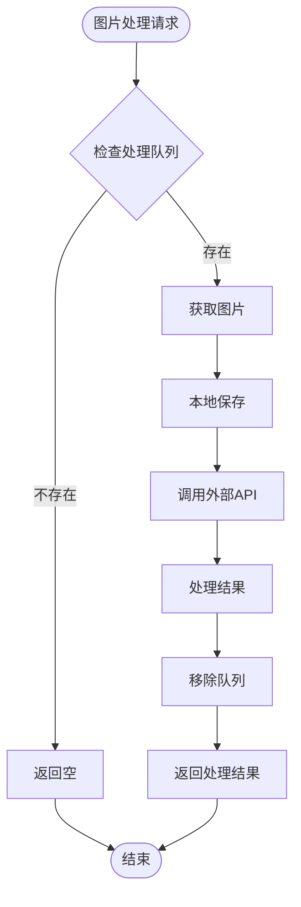

**图表来源**
- [PictureDistributorServiceImpl.java](file://Base/src/main/java/com/bot/base/service/impl/PictureDistributorServiceImpl.java#L30-L46)

## 典型使用场景

### QQ群消息发送示例

以下展示了QQ群消息发送的完整流程：

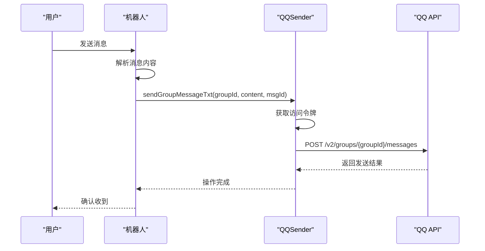

### 音乐服务调用示例

音乐服务的典型使用流程：

| 步骤 | 操作 | 实现类 | 关键参数 |
|------|------|--------|---------|
| 1 | 随机选择榜单 | CloudMusicServiceImpl | BaseConsts.Music.SORT |
| 2 | 构建请求URL | HttpSenderUtil | sort参数 |
| 3 | 发送HTTP请求 | HttpSenderUtil | GET方法 |
| 4 | 解析JSON响应 | JSONUtil | code字段验证 |
| 5 | 格式化输出 | StringBuilder | 多行文本组合 |

**章节来源**
- [CloudMusicServiceImpl.java](file://Base/src/main/java/com/bot/base/service/impl/CloudMusicServiceImpl.java#L26-L47)

### 图片处理工作流

图片处理的完整工作流程：

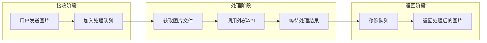

**图表来源**
- [PictureDistributorServiceImpl.java](file://Base/src/main/java/com/bot/base/service/impl/PictureDistributorServiceImpl.java#L30-L46)

## 线程安全性与性能考量

### 线程安全机制

| 工具类 | 线程安全措施 | 实现方式 |
|-------|-------------|---------|
| QQSender | 静态Map保护 | synchronized方法 |
| HttpSenderUtil | 不可变设计 | 静态常量+不可变对象 |
| SendMsgUtil | 无状态设计 | 静态方法+局部变量 |
| ThreadPoolManager | 原子操作 | volatile标志位 |
| AudioTransUtil | 无共享状态 | 静态方法+局部变量 |

### 性能优化策略

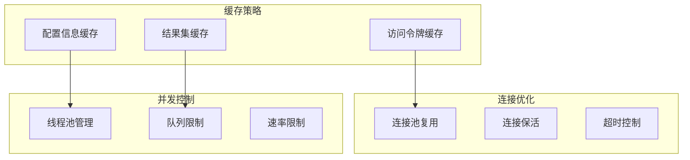

### 性能监控指标

| 指标类型 | 监控内容 | 优化目标 |
|---------|---------|---------|
| 响应时间 | HTTP请求延迟 | < 2秒 |
| 吞吐量 | 每秒请求数 | > 100 QPS |
| 错误率 | API调用失败率 | < 1% |
| 资源使用 | 内存占用 | < 512MB |
| 并发度 | 同时处理请求数 | 50-100 |

## 总结

本文档详细分析了QQ机器人项目中的核心工具类，包括：

1. **QQSender**：实现了完整的QQ消息发送协议封装，支持多种消息类型和OAuth2.0认证
2. **HttpSenderUtil**：提供了灵活的HTTP客户端功能，支持多种认证方式和SSL处理
3. **TextUtil**：简单高效的文本处理工具，专注于HttpServletRequest流处理
4. **SendMsgUtil**：统一的消息发送调度器，支持丰富的消息类型和批量操作
5. **ThreadPoolManager**：智能的线程池管理策略，支持基础、紧急和定时任务
6. **AudioTransUtil**：专业的音频格式转换工具，支持多种音频编码格式

这些工具类共同构成了一个高效、稳定、可扩展的QQ机器人消息处理框架，为开发者提供了完整的解决方案。通过合理的架构设计和性能优化，确保了系统的高可用性和良好的用户体验。