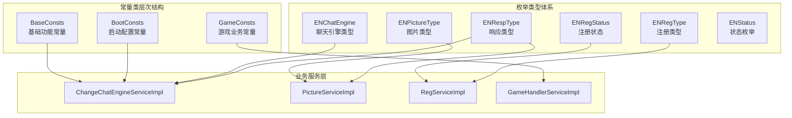
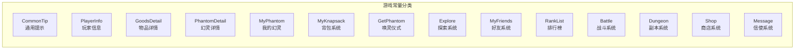
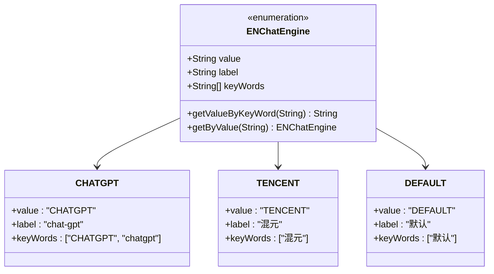
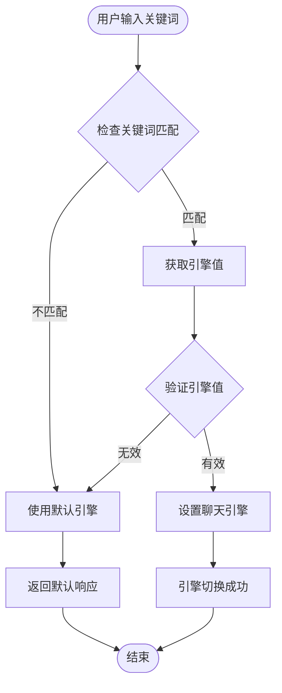
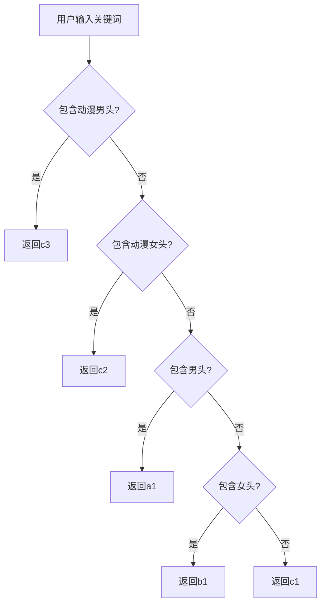
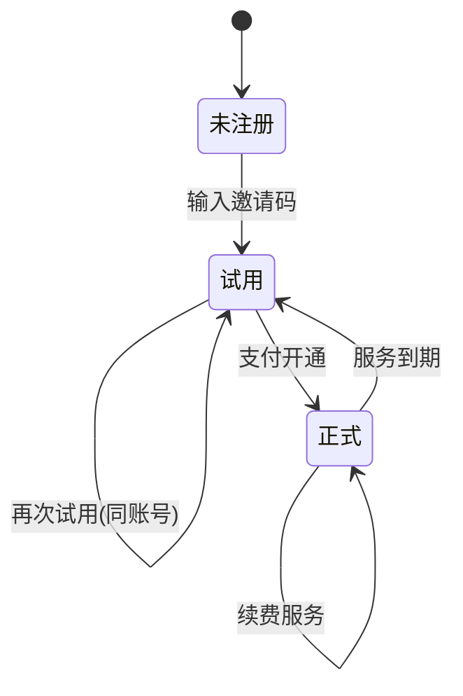
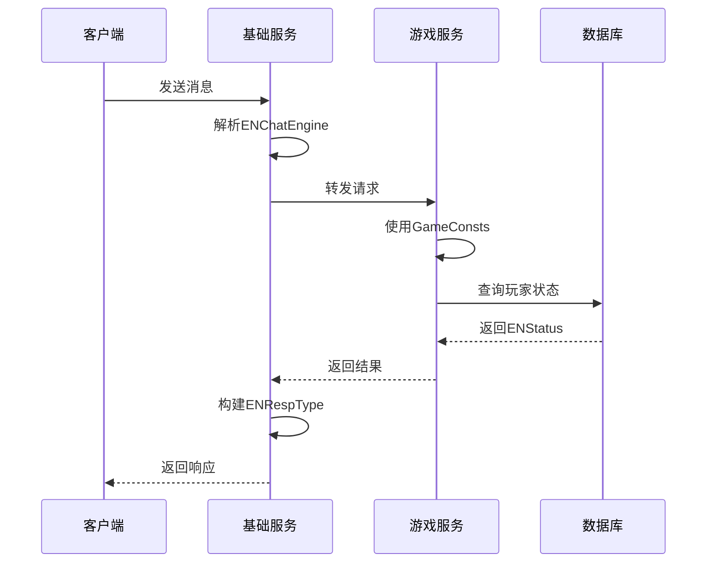

# 常量与枚举

<cite>
**本文档中引用的文件**
- [BaseConsts.java](file://Common/src/main/java/com/bot/common/constant/BaseConsts.java)
- [BootConsts.java](file://Common/src/main/java/com/bot/common/constant/BootConsts.java)
- [GameConsts.java](file://Common/src/main/java/com/bot/common/constant/GameConsts.java)
- [ENChatEngine.java](file://Common/src/main/java/com/bot/common/enums/ENChatEngine.java)
- [ENPictureType.java](file://Common/src/main/java/com/bot/common/enums/ENPictureType.java)
- [ENRegStatus.java](file://Common/src/main/java/com/bot/common/enums/ENRegStatus.java)
- [ENRegType.java](file://Common/src/main/java/com/bot/common/enums/ENRegType.java)
- [ENRespType.java](file://Common/src/main/java/com/bot/common/enums/ENRespType.java)
- [ENStatus.java](file://Common/src/main/java/com/bot/common/enums/ENStatus.java)
- [ChangeChatEngineServiceImpl.java](file://Base/src/main/java/com/bot/base/service/impl/ChangeChatEngineServiceImpl.java)
- [PictureServiceImpl.java](file://Base/src/main/java/com/bot/base/service/impl/PictureServiceImpl.java)
- [RegServiceImpl.java](file://Base/src/main/java/com/bot/base/service/impl/RegServiceImpl.java)
- [GameHandlerServiceImpl.java](file://Game/src/main/java/com/bot/game/service/impl/GameHandlerServiceImpl.java)
</cite>

## 目录
1. [引言](#引言)
2. [常量类架构设计](#常量类架构设计)
3. [三大常量类详解](#三大常量类详解)
4. [关键枚举类型分析](#关键枚举类型分析)
5. [枚举设计优势](#枚举设计优势)
6. [业务场景应用](#业务场景应用)
7. [最佳实践指南](#最佳实践指南)
8. [总结](#总结)

## 引言

Bot项目采用分层的常量与枚举设计架构，通过BaseConsts、BootConsts、GameConsts三大常量类和丰富的枚举类型体系，实现了代码的可读性、可维护性和类型安全性。这种设计不仅避免了魔法值的使用，还为不同业务场景提供了清晰的作用域划分和统一的引用规范。

## 常量类架构设计

### 设计原则

项目常量类遵循以下核心设计原则：

1. **作用域明确**：每个常量类服务于特定的业务领域
2. **层次化组织**：通过嵌套接口实现逻辑分组
3. **类型安全**：配合枚举使用，提供编译时检查
4. **易于维护**：集中管理，便于修改和扩展

### 架构图



**图表来源**
- [BaseConsts.java](file://Common/src/main/java/com/bot/common/constant/BaseConsts.java#L1-L288)
- [GameConsts.java](file://Common/src/main/java/com/bot/common/constant/GameConsts.java#L1-L358)
- [BootConsts.java](file://Common/src/main/java/com/bot/common/constant/BootConsts.java#L1-L13)

## 三大常量类详解

### BaseConsts - 基础功能常量

BaseConsts是项目中最复杂的常量类，涵盖了聊天机器人的核心功能模块。

#### 功能模块划分

| 模块名称 | 作用域 | 主要用途 |
|---------|--------|----------|
| ClassBeanName | 类名管理 | Spring Bean名称定义 |
| Menu | 菜单系统 | 用户交互界面标识 |
| Distributor | 分发器 | 消息分发规则配置 |
| AnswerBook | 答案之书 | 特殊问答功能 |
| Luck | 运势系统 | 占卜功能配置 |
| SystemManager | 系统管理 | 管理员功能控制 |
| Sweet | 情话功能 | 社交互动配置 |
| Music | 音乐功能 | 在线音乐服务 |
| Chat | 聊天功能 | 通用对话配置 |
| Picture | 图片功能 | 头像推荐服务 |
| Constellation | 星座功能 | 星座运势查询 |
| Work | 工作模式 | 数据处理工具 |
| Morning | 日报功能 | 新闻推送配置 |

#### 设计特点

- **嵌套接口结构**：每个功能模块独立定义为嵌套接口
- **国际化友好**：支持多语言文本配置
- **动态配置**：支持运行时参数调整
- **扩展性强**：预留接口便于功能扩展

**章节来源**
- [BaseConsts.java](file://Common/src/main/java/com/bot/common/constant/BaseConsts.java#L12-L288)

### GameConsts - 游戏业务常量

GameConsts专门服务于游戏业务场景，包含了完整的角色扮演系统配置。

#### 核心业务领域



**图表来源**
- [GameConsts.java](file://Common/src/main/java/com/bot/common/constant/GameConsts.java#L11-L358)

#### 关键配置项

| 配置类别 | 数值含义 | 业务价值 |
|---------|----------|----------|
| MAX_LEVEL | 25 | 角色成长上限 |
| SPEED_FOR_EVERY_LEVEL | 2 | 属性成长系数 |
| ATTACK_FOR_EVERY_LEVEL | 10 | 攻击力成长 |
| HP_FOR_EVERY_LEVEL | 100 | 生命值成长 |
| BASE_BUFF_FIGURE | 1.2 | 增益倍率 |
| BASE_DE_BUFF_FIGURE | 0.8 | 减益倍率 |

**章节来源**
- [GameConsts.java](file://Common/src/main/java/com/bot/common/constant/GameConsts.java#L189-L223)

### BootConsts - 启动配置常量

BootConsts是最简单的常量类，主要用于系统启动和异常处理的基础配置。

#### 核心配置

- **ResponseStr.EXCEPTION**：异常响应标识码"1111"

虽然配置简单，但为系统提供了统一的异常处理标准。

**章节来源**
- [BootConsts.java](file://Common/src/main/java/com/bot/common/constant/BootConsts.java#L7-L13)

## 关键枚举类型分析

### ENChatEngine - 聊天引擎类型

ENChatEngine枚举定义了系统支持的不同聊天引擎类型，体现了系统的可扩展性和灵活性。

#### 枚举结构设计



**图表来源**
- [ENChatEngine.java](file://Common/src/main/java/com/bot/common/enums/ENChatEngine.java#L11-L43)

#### 状态流转逻辑



**图表来源**
- [ChangeChatEngineServiceImpl.java](file://Base/src/main/java/com/bot/base/service/impl/ChangeChatEngineServiceImpl.java#L32-L37)

**章节来源**
- [ENChatEngine.java](file://Common/src/main/java/com/bot/common/enums/ENChatEngine.java#L1-L44)
- [ChangeChatEngineServiceImpl.java](file://Base/src/main/java/com/bot/base/service/impl/ChangeChatEngineServiceImpl.java#L1-L37)

### ENPictureType - 图片类型

ENPictureType枚举定义了系统支持的图片类型，为图片服务提供了标准化的分类体系。

#### 类型分类体系

| 类型 | 值 | 标签 | 应用场景 |
|------|----|----- |----------|
| MAN | a1 | 男头 | 男性头像推荐 |
| WOMAN | b1 | 女头 | 女性头像推荐 |
| DM | c1 | 动漫 | 动漫风格图片 |
| DM_WOMAN | c3 | 动漫男头 | 动漫男性角色 |
| DM_WAN | c2 | 动漫女头 | 动漫女性角色 |

#### 智能匹配算法

ENPictureType提供了智能匹配算法，能够根据用户输入的关键词自动选择合适的图片类型：



**图表来源**
- [ENPictureType.java](file://Common/src/main/java/com/bot/common/enums/ENPictureType.java#L30-L44)

**章节来源**
- [ENPictureType.java](file://Common/src/main/java/com/bot/common/enums/ENPictureType.java#L1-L57)
- [PictureServiceImpl.java](file://Base/src/main/java/com/bot/base/service/impl/PictureServiceImpl.java#L28-L39)

### ENRegStatus - 注册状态

ENRegStatus枚举定义了用户的注册状态，支持试用和正式两种模式。

#### 状态定义

| 状态 | 值 | 标签 | 权限级别 |
|------|----|----- |----------|
| TEMP | 0 | 试用 | 基础功能 |
| FOREVER | 1 | 正式 | 完整功能 |

#### 状态转换流程



**章节来源**
- [ENRegStatus.java](file://Common/src/main/java/com/bot/common/enums/ENRegStatus.java#L1-L18)
- [RegServiceImpl.java](file://Base/src/main/java/com/bot/base/service/impl/RegServiceImpl.java#L42-L144)

### 其他重要枚举

#### ENRespType - 响应类型

ENRespType枚举定义了系统支持的各种响应类型，确保消息格式的一致性。

| 类型 | 值 | 标签 | 用途 |
|------|----|----- |------|
| TEXT | 0 | 文本 | 纯文本消息 |
| IMG | 1 | 图片 | 图片消息 |
| VIDEO | 2 | 视频 | 视频消息 |
| FILE | 3 | 文件 | 文件传输 |
| AUDIO | 4 | 语音 | 语音消息 |

#### ENStatus - 状态枚举

ENStatus枚举用于系统对象的状态管理，支持正常和锁定两种状态。

| 状态 | 值 | 标签 | 影响 |
|------|----|----- |------|
| NORMAL | 0 | 正常 | 可正常使用 |
| LOCK | 1 | 锁定 | 功能受限 |

**章节来源**
- [ENRespType.java](file://Common/src/main/java/com/bot/common/enums/ENRespType.java#L1-L21)
- [ENStatus.java](file://Common/src/main/java/com/bot/common/enums/ENStatus.java#L1-L25)

## 枚举设计优势

### 提升代码可读性

枚举通过语义化的名称替代魔法值，使代码更具自解释性：

```java
// 使用枚举前：魔法值
String engine = "CHATGPT";

// 使用枚举后：语义清晰
ENChatEngine engine = ENChatEngine.CHATGPT;
```

### 避免魔法值

枚举从根本上消除了硬编码值，降低了维护成本和出错风险。

### 支持类型安全

编译器会在编译时检查枚举值的有效性，防止运行时错误。

### 提供额外功能

枚举可以包含方法和字段，提供更丰富的功能：

```java
// 自定义方法示例
public static ENChatEngine getByValue(String value) {
    for (ENChatEngine engine : values()) {
        if (engine.value.equals(value)) {
            return engine;
        }
    }
    return DEFAULT;
}
```

## 业务场景应用

### Service层引用规范

#### 1. 基础服务层（Base）

```java
@Service("changeChatEngineServiceImpl")
public class ChangeChatEngineServiceImpl implements BaseService {
    
    @Override
    public CommonResp doQueryReturn(String reqContent, String token, String groupId, String channel) {
        // 使用ENChatEngine枚举
        String content = reqContent.replace(BaseConsts.Change.CHANGE, "").trim();
        String value = ENChatEngine.getValueByKeyWord(content);
        
        if (value == null) {
            // 使用BaseConsts常量
            this.insertOrUpdate(ENChatEngine.DEFAULT.getValue(), token);
            return new CommonResp(BaseConsts.Change.NO_ENGINE, ENRespType.TEXT.getType());
        }
        // ...
    }
}
```

#### 2. 图片服务层

```java
@Service("pictureServiceImpl")
public class PictureServiceImpl implements BaseService {
    
    @Override
    public CommonResp doQueryReturn(String reqContent, String token, String groupId, String channel) {
        // 使用ENPictureType枚举
        String msg = reqContent.replaceAll(BaseConsts.Picture.SUFFIX, "");
        String pictureType = ENPictureType.getValueByContainLabel(msg);
        
        // 构建请求URL
        String response = HttpSenderUtil.get(url + "?lx=" + pictureType + "&format=json", null);
        // ...
    }
}
```

#### 3. 游戏服务层

```java
@Service
public class GameHandlerServiceImpl implements GameHandler {
    
    @Autowired
    private GamePlayerMapper gamePlayerMapper;
    
    private GamePlayer createNewPlayer(String token, String nickName) {
        GamePlayer gamePlayer = new GamePlayer();
        gamePlayer.setId(token);
        gamePlayer.setGameId(GameCommonHolder.GAMES.get(0).getId());
        gamePlayer.setNickname(nickName);
        gamePlayer.setRegTime(new Date());
        gamePlayer.setSoulPower(1);
        
        // 使用ENStatus枚举
        gamePlayer.setStatus(ENStatus.NORMAL.getValue());
        gamePlayer.setMoney(0);
        gamePlayer.setActionPoint(100);
        return gamePlayer;
    }
}
```

#### 4. 注册服务层

```java
@Service
public class RegServiceImpl implements RegService {
    
    @Override
    public String tryTempReg(String activeId, String inviteCode, ENRegType regType) {
        // 使用ENRegStatus枚举
        BotUser botUser = new BotUser();
        botUser.setId(activeId);
        botUser.setStatus(ENRegStatus.TEMP.getValue());
        botUser.setType(regType.getValue());
        botUser.setDeadLineDate(DateUtil.offsetDay(new Date(), 7));
        // ...
    }
}
```

### 跨模块调用一致性

通过统一的枚举和常量引用，确保跨模块调用的一致性：



**图表来源**
- [ChangeChatEngineServiceImpl.java](file://Base/src/main/java/com/bot/base/service/impl/ChangeChatEngineServiceImpl.java#L32-L37)
- [GameHandlerServiceImpl.java](file://Game/src/main/java/com/bot/game/service/impl/GameHandlerServiceImpl.java#L159-L161)

## 最佳实践指南

### 常量使用规范

1. **按功能分组**：在常量类中按功能模块组织常量
2. **命名规范**：使用UPPER_CASE命名法
3. **文档注释**：为每个常量添加清晰的注释
4. **类型安全**：优先使用枚举而非字符串常量

### 枚举设计原则

1. **单一职责**：每个枚举专注于特定的业务概念
2. **不可变性**：使用final修饰符确保不可变
3. **工厂方法**：提供便捷的查找和转换方法
4. **扩展性**：预留空间支持未来扩展

### 引用策略

1. **就近原则**：在业务逻辑附近引用常量
2. **抽象层封装**：通过服务层封装常量引用
3. **配置驱动**：支持运行时配置调整
4. **单元测试**：为常量和枚举编写测试用例

### 性能考虑

1. **静态初始化**：常量应在类加载时初始化
2. **缓存机制**：对于复杂计算的枚举方法可添加缓存
3. **内存优化**：避免在循环中重复创建枚举实例

## 总结

Bot项目的常量与枚举设计体现了优秀的软件架构原则：

1. **清晰的职责分离**：三大常量类各司其职，覆盖不同业务领域
2. **强类型安全保障**：枚举提供编译时检查，避免运行时错误
3. **良好的可扩展性**：设计支持功能扩展和配置调整
4. **统一的引用规范**：跨模块调用保持一致性和可维护性

通过合理使用常量与枚举，项目实现了代码质量的显著提升，为后续的功能扩展和维护奠定了坚实的基础。这种设计模式值得在类似的大型项目中推广和应用。