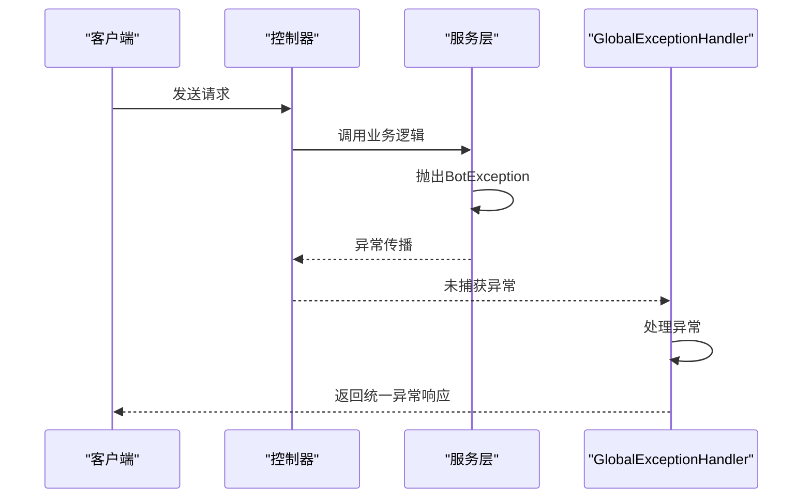

# 异常处理

<cite>
**本文档引用的文件**   
- [BotException.java](file://Common/src/main/java/com/bot/common/exception/BotException.java)
- [GlobalExceptionHandler.java](file://Boot/src/main/java/com/bot/boot/aspect/GlobalExceptionHandler.java)
- [DistributorServiceImpl.java](file://Base/src/main/java/com/bot/base/service/impl/DistributorServiceImpl.java)
- [Menu.java](file://Game/src/main/java/com/bot/game/chain/Menu.java)
- [ENCarriedStatus.java](file://Game/src/main/java/com/bot/game/enums/ENCarriedStatus.java)
- [DefaultChatServiceImpl.java](file://Base/src/main/java/com/bot/base/service/impl/DefaultChatServiceImpl.java)
- [BootConsts.java](file://Common/src/main/java/com/bot/common/constant/BootConsts.java)
</cite>

## 目录
1. [BotException异常体系设计](#botexception异常体系设计)
2. [全局异常处理机制](#全局异常处理机制)
3. [Service层异常抛出规范](#service层异常抛出规范)
4. [消息分发链异常处理](#消息分发链异常处理)
5. [自定义异常扩展指导](#自定义异常扩展指导)
6. [异常日志与监控集成](#异常日志与监控集成)

## BotException异常体系设计

`BotException`是项目中统一的业务异常基类，继承自`RuntimeException`，作为整个系统业务异常处理的核心。该异常类设计简洁，主要职责是封装业务层面的异常信息，便于在系统各层间传递和处理。

`BotException`类定义了两个构造函数：无参构造函数和接收异常信息字符串的构造函数。通过`super(exceptionMsg)`调用父类构造函数，将异常信息传递给`RuntimeException`。这种设计使得开发者可以在抛出异常时直接提供清晰的错误描述，便于后续的异常处理和日志记录。

异常类中定义了`serialVersionUID`字段，确保了序列化版本的一致性。作为项目中所有业务异常的基类，`BotException`被广泛应用于各个模块，当需要抛出业务异常时，直接或间接继承此类，确保了异常处理的一致性和可维护性。

**本节来源**
- [BotException.java](file://Common/src/main/java/com/bot/common/exception/BotException.java#L7-L19)

## 全局异常处理机制

项目通过Spring AOP的`HandlerExceptionResolver`接口实现了全局异常捕获与统一响应封装。`GlobalExceptionHandler`类实现了`HandlerExceptionResolver`接口，作为全局异常处理器，负责拦截所有未被捕获的异常。

当系统中抛出任何异常时，Spring MVC会调用`resolveException`方法。该方法接收请求、响应、处理器对象和异常对象作为参数。在`resolveException`方法中，创建一个`ModelAndView`对象，并通过`addObject`方法添加预定义的异常响应码。根据`BootConsts.java`中的定义，异常响应码为"1111"。

这种设计实现了异常的统一处理，无论在哪个层级抛出`BotException`或其他异常，最终都会被`GlobalExceptionHandler`捕获并转换为统一的响应格式。这不仅简化了各业务模块的异常处理逻辑，还确保了对外API响应的一致性，提高了系统的健壮性和用户体验。

**图示来源**
- [GlobalExceptionHandler.java](file://Boot/src/main/java/com/bot/boot/aspect/GlobalExceptionHandler.java#L18-L26)
- [BootConsts.java](file://Common/src/main/java/com/bot/common/constant/BootConsts.java#L9-L11)

**本节来源**
- [GlobalExceptionHandler.java](file://Boot/src/main/java/com/bot/boot/aspect/GlobalExceptionHandler.java#L18-L26)

## Service层异常抛出规范

在Service层抛出`BotException`有明确的标准方式。当业务逻辑中遇到无法继续执行的错误情况时，应直接实例化`BotException`并抛出。例如，在`DistributorServiceImpl`类中，当通过服务名称获取服务实例时，如果`serviceMap`中不存在对应的实现，则抛出`BotException("未知服务")`。

这种抛出方式简洁明了，直接在代码中明确指出了错误原因。异常信息应尽量具体，能够准确描述问题的本质，便于后续的调试和处理。在抛出异常前，应确保已经进行了必要的参数验证和状态检查，避免不必要的异常抛出。

此外，`BotException`的使用不仅限于服务层，在枚举类的`getByValue`方法中也广泛使用。当传入的值无法匹配到任何枚举项时，抛出`BotException("未知枚举值")`，确保了系统的健壮性，防止因无效输入导致的程序崩溃。

**本节来源**
- [DistributorServiceImpl.java](file://Base/src/main/java/com/bot/base/service/impl/DistributorServiceImpl.java#L363-L368)
- [ENCarriedStatus.java](file://Game/src/main/java/com/bot/game/enums/ENCarriedStatus.java#L29-L31)

## 消息分发链异常处理

在消息分发链中，异常的传播与处理机制体现了系统的分层设计思想。以`DistributorServiceImpl`为例，该类作为消息分发的核心，负责将用户请求路由到相应的服务处理器。

当`req2Resp`方法中调用`getService`获取服务实例时，如果服务不存在，会抛出`BotException`。这个异常不会在`DistributorServiceImpl`中被处理，而是继续向上层传播。最终，该异常会被`GlobalExceptionHandler`捕获，并转换为统一的响应格式返回给客户端。

这种设计实现了关注点分离：`DistributorServiceImpl`只负责业务逻辑的分发，不处理异常；异常处理由专门的切面负责。这不仅简化了业务代码，还确保了异常处理的一致性。同时，在`Collector`类的`toNextOrPrevious`方法中，如果无法找到下一个或上一个菜单，也会返回null而不是抛出异常，体现了对正常业务流程和异常流程的区分处理。

**本节来源**
- [DistributorServiceImpl.java](file://Base/src/main/java/com/bot/base/service/impl/DistributorServiceImpl.java#L216-L413)

## 自定义异常扩展指导

虽然项目中目前主要使用`BotException`作为统一的业务异常基类，但系统设计支持自定义异常类型的扩展。开发者可以根据具体的业务场景，创建继承自`BotException`的特定异常类。

例如，可以创建`ValidationException`用于处理参数验证错误，`AuthorizationException`用于处理权限验证失败等。这些自定义异常类可以在构造函数中添加特定的错误码和错误信息，便于前端进行精确的错误处理。

扩展自定义异常时，应遵循以下原则：保持异常层次结构的清晰性，避免过度复杂的继承关系；为每个自定义异常提供明确的文档说明；在抛出异常时提供足够的上下文信息，便于问题定位和解决。

**本节来源**
- [BotException.java](file://Common/src/main/java/com/bot/common/exception/BotException.java#L7-L19)

## 异常日志与监控集成

项目的异常日志记录主要通过`lombok.extern.slf4j.Slf4j`注解实现。在`GlobalExceptionHandler`和其他关键组件中，都使用了SLF4J日志框架进行异常记录。当捕获到异常时，会使用`log.error`方法记录错误级别日志，包含异常的完整堆栈信息。

日志配置由`logback-spring.xml`文件定义，配置了控制台输出和文件滚动记录两种方式。日志文件按天和大小进行滚动，最大保留30天的历史日志，单个文件最大100MB。这种配置既保证了日志的可追溯性，又避免了日志文件过大影响系统性能。

对于监控告警，虽然当前代码中没有直接体现，但可以通过集成外部监控系统（如Prometheus、Grafana）来实现。可以将异常日志作为监控指标，当特定类型的异常频率超过阈值时触发告警，实现对系统健康状况的实时监控。

**本节来源**
- [GlobalExceptionHandler.java](file://Boot/src/main/java/com/bot/boot/aspect/GlobalExceptionHandler.java#L16)
- [logback-spring.xml](file://Boot/src/main/resources/logback-spring.xml#L1-L58)