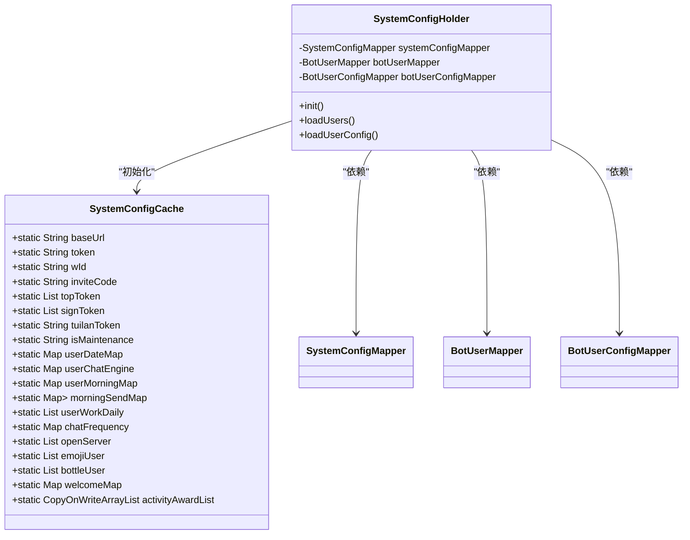
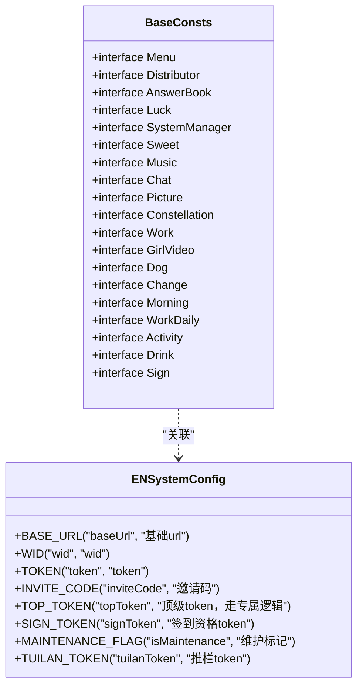
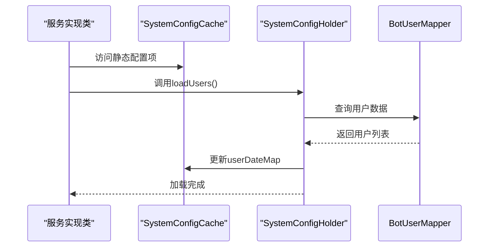
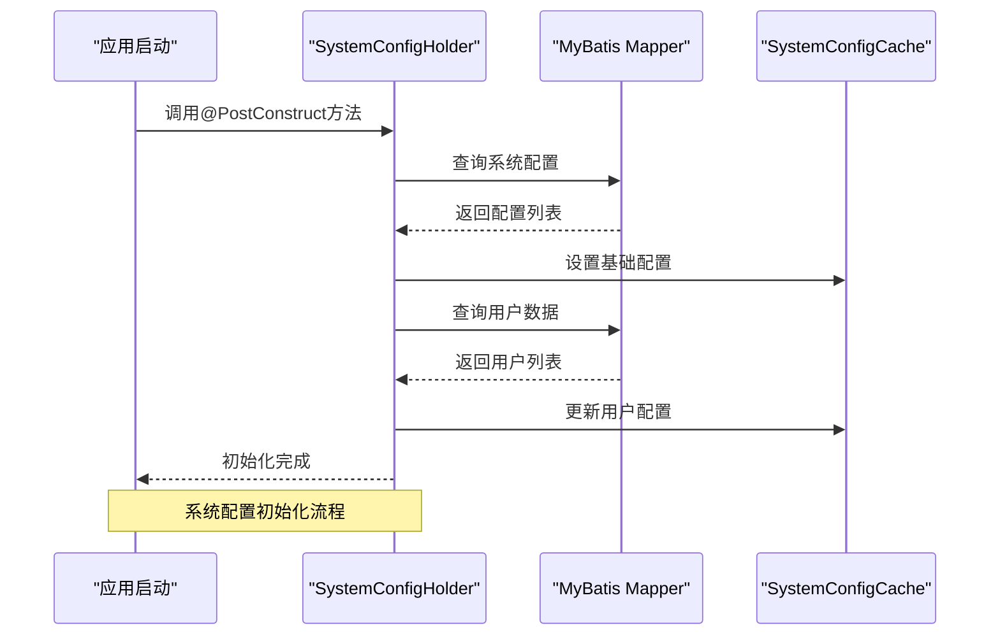

# 配置管理

<cite>
**本文档引用的文件**   
- [SystemConfigCache.java](file://Common/src/main/java/com/bot/common/config/SystemConfigCache.java)
- [BaseConsts.java](file://Common/src/main/java/com/bot/common/constant/BaseConsts.java)
- [ENSystemConfig.java](file://Common/src/main/java/com/bot/common/enums/ENSystemConfig.java)
- [CommonTextLoader.java](file://Common/src/main/java/com/bot/common/loader/CommonTextLoader.java)
- [SystemConfigHolder.java](file://Game/src/main/java/com/bot/game/service/SystemConfigHolder.java)
- [application.properties](file://Boot/src/main/resources/application.properties)
- [application-dev.properties](file://Boot/src/main/resources/application-dev.properties)
- [application-prod.properties](file://Boot/src/main/resources/application-prod.properties)
- [BotApplication.java](file://Boot/src/main/java/com/bot/boot/BotApplication.java)
</cite>

## 目录
1. [系统配置缓存机制](#系统配置缓存机制)
2. [配置项分类与命名规范](#配置项分类与命名规范)
3. [文本资源加载策略](#文本资源加载策略)
4. [配置使用与注入示例](#配置使用与注入示例)
5. [配置监听与刷新机制](#配置监听与刷新机制)

## 系统配置缓存机制

系统配置的集中化管理通过`SystemConfigCache`类实现，该类采用静态变量的方式存储所有系统配置项，实现了配置的集中化管理。配置项的加载通过Spring的`@Value`注解从配置文件中读取，并在应用启动时初始化。

`SystemConfigCache`类中的配置项分为两类：基础URL、Token等系统级配置，以及用户相关的配置如用户到期时间、聊天引擎选择等。这些配置项在应用启动时由`SystemConfigHolder`类负责加载和初始化。



**图表来源**
- [SystemConfigCache.java](file://Common/src/main/java/com/bot/common/config/SystemConfigCache.java#L1-L116)
- [SystemConfigHolder.java](file://Game/src/main/java/com/bot/game/service/SystemConfigHolder.java#L1-L83)

**章节来源**
- [SystemConfigCache.java](file://Common/src/main/java/com/bot/common/config/SystemConfigCache.java#L1-L116)
- [SystemConfigHolder.java](file://Game/src/main/java/com/bot/game/service/SystemConfigHolder.java#L1-L83)

## 配置项分类与命名规范

配置项的分类组织原则基于`BaseConsts`接口和`ENSystemConfig`枚举。`BaseConsts`接口定义了系统中各种常量，包括菜单选项、指令分隔符、功能描述等，而`ENSystemConfig`枚举则定义了系统配置项的类型和标签。

`ENSystemConfig`枚举包含了所有系统级配置项的定义，每个枚举值对应一个配置项的键值和描述。这种设计使得配置项的管理更加规范化和类型安全。例如，`BASE_URL`配置项对应系统的基础URL，`TOKEN`对应系统的认证Token等。



**图表来源**
- [BaseConsts.java](file://Common/src/main/java/com/bot/common/constant/BaseConsts.java#L1-L288)
- [ENSystemConfig.java](file://Common/src/main/java/com/bot/common/enums/ENSystemConfig.java#L1-L24)

**章节来源**
- [BaseConsts.java](file://Common/src/main/java/com/bot/common/constant/BaseConsts.java#L1-L288)
- [ENSystemConfig.java](file://Common/src/main/java/com/bot/common/enums/ENSystemConfig.java#L1-L24)

## 文本资源加载策略

文本资源的加载由`CommonTextLoader`类负责，该类实现了对各种文本资源的集中化加载和管理。`CommonTextLoader`通过`@Value("${text.path}")`注解从配置文件中读取文本资源的路径，并在应用启动时通过`@PostConstruct`注解标记的`loadText`方法加载所有文本资源。

加载的文本资源包括服务指令、菜单指令、默认回复、固定回答、答案之书内容等。这些资源被存储在静态变量中，供系统其他部分使用。例如，`serviceInstructMap`存储了服务指令与服务类名的映射，`menuInstructMap`存储了菜单指令与菜单类名的映射。

```mermaid
flowchart TD
Start([应用启动]) --> LoadText["加载文本资源"]
LoadText --> LoadServiceInstruct["加载服务指令"]
LoadServiceInstruct --> LoadMenuInstruct["加载菜单指令"]
LoadMenuInstruct --> LoadDefaultResponse["加载默认回复"]
LoadDefaultResponse --> LoadSomeResponse["加载固定回答"]
LoadSomeResponse --> LoadAnswers["加载答案之书"]
LoadAnswers --> LoadGameHistory["加载游戏版本历史"]
LoadGameHistory --> End([文本加载完成])
Note over LoadText,End: 文本资源加载流程
```

**图表来源**
- [CommonTextLoader.java](file://Common/src/main/java/com/bot/common/loader/CommonTextLoader.java#L1-L105)

**章节来源**
- [CommonTextLoader.java](file://Common/src/main/java/com/bot/common/loader/CommonTextLoader.java#L1-L105)

## 配置使用与注入示例

在其他模块中使用配置缓存时，可以直接通过静态引用访问`SystemConfigCache`中的配置项。例如，在服务实现类中可以通过`SystemConfigCache.token`访问系统Token，通过`SystemConfigCache.userDateMap`访问用户到期时间映射。

对于需要动态刷新的配置，可以通过注入`SystemConfigHolder`实例并调用其`loadUsers`或`loadUserConfig`方法来重新加载用户相关配置。这种设计使得配置的使用既简单又灵活。



**图表来源**
- [SystemConfigCache.java](file://Common/src/main/java/com/bot/common/config/SystemConfigCache.java#L1-L116)
- [SystemConfigHolder.java](file://Game/src/main/java/com/bot/game/service/SystemConfigHolder.java#L1-L83)

**章节来源**
- [SystemConfigCache.java](file://Common/src/main/java/com/bot/common/config/SystemConfigCache.java#L1-L116)
- [SystemConfigHolder.java](file://Game/src/main/java/com/bot/game/service/SystemConfigHolder.java#L1-L83)

## 配置监听与刷新机制

配置的动态刷新机制通过`SystemConfigHolder`类的`@PostConstruct`注解实现。在应用启动时，`init`方法会被自动调用，加载所有系统配置和用户配置。对于需要手动刷新的场景，可以通过调用`loadUsers`或`loadUserConfig`方法来重新加载特定的配置。

定时任务的配置在`BotApplication`类中通过`@EnableScheduling`注解启用，允许系统定期执行配置刷新任务。当配置发生变化时，系统可以通过调用`SystemConfigHolder`的相关方法来更新内存中的配置缓存，实现配置的热更新。



**图表来源**
- [SystemConfigHolder.java](file://Game/src/main/java/com/bot/game/service/SystemConfigHolder.java#L1-L83)
- [BotApplication.java](file://Boot/src/main/java/com/bot/boot/BotApplication.java#L1-L22)

**章节来源**
- [SystemConfigHolder.java](file://Game/src/main/java/com/bot/game/service/SystemConfigHolder.java#L1-L83)
- [BotApplication.java](file://Boot/src/main/java/com/bot/boot/BotApplication.java#L1-L22)