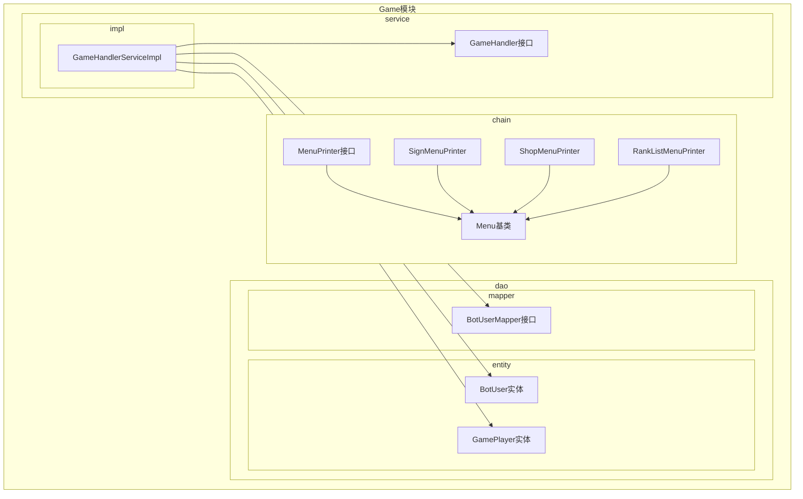
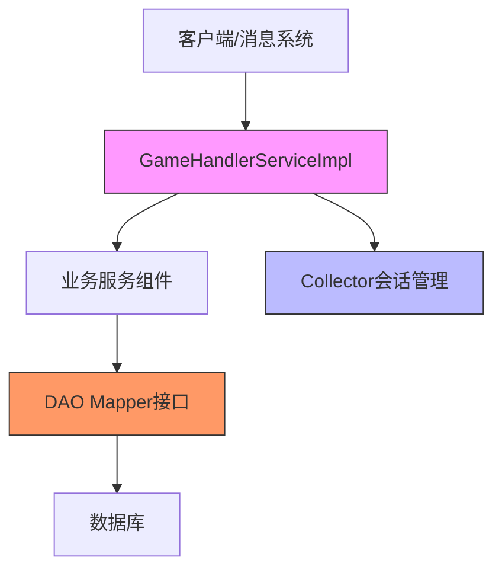
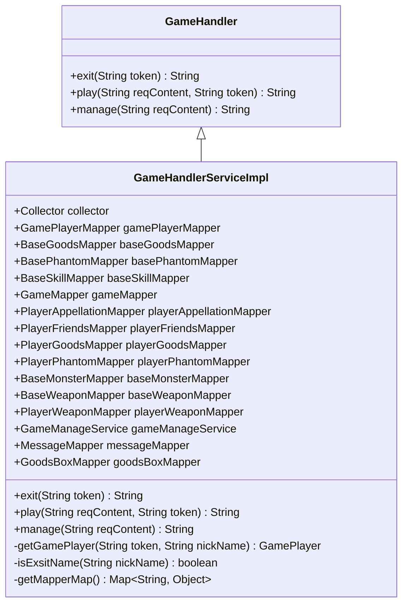
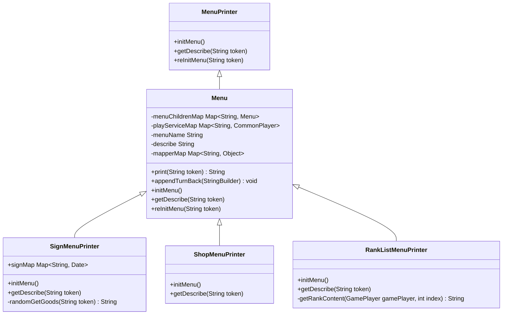
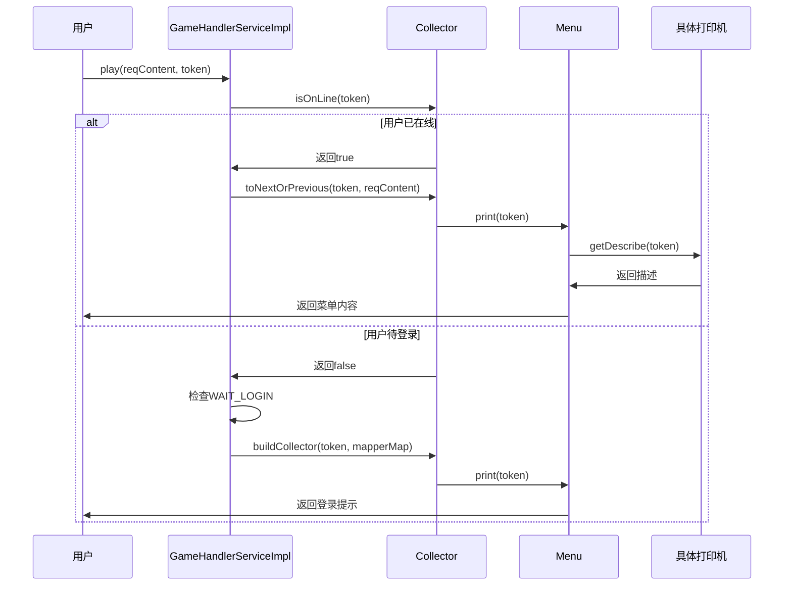
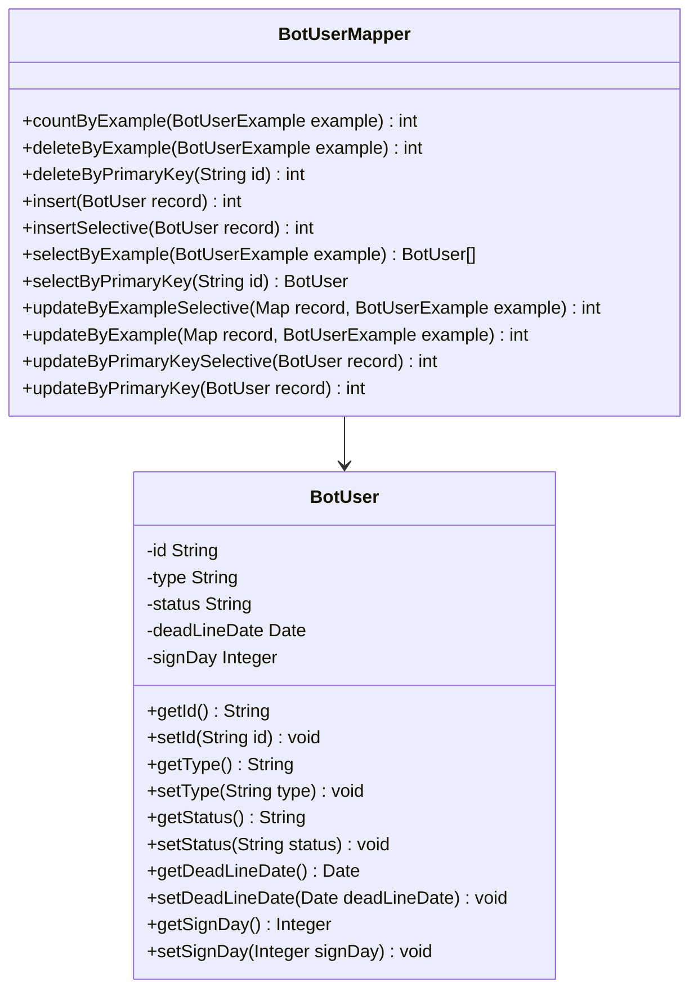
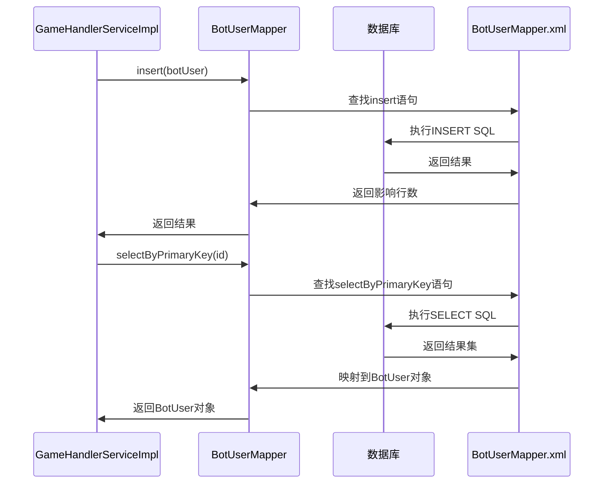
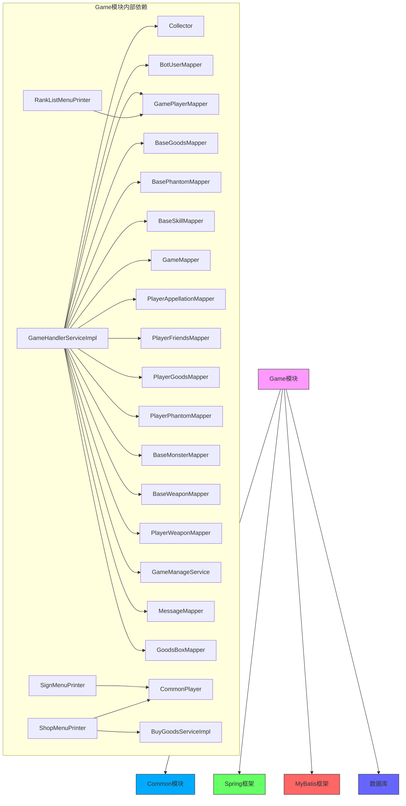

# Game模块

<cite>
**本文档引用的文件**
- [GameHandlerServiceImpl.java](file://Game/src/main/java/com/bot/game/service/impl/GameHandlerServiceImpl.java)
- [GameHandler.java](file://Game/src/main/java/com/bot/game/service/GameHandler.java)
- [MenuPrinter.java](file://Game/src/main/java/com/bot/game/chain/MenuPrinter.java)
- [Menu.java](file://Game/src/main/java/com/bot/game/chain/Menu.java)
- [SignMenuPrinter.java](file://Game/src/main/java/com/bot/game/chain/menu/SignMenuPrinter.java)
- [ShopMenuPrinter.java](file://Game/src/main/java/com/bot/game/chain/menu/ShopMenuPrinter.java)
- [RankListMenuPrinter.java](file://Game/src/main/java/com/bot/game/chain/menu/RankListMenuPrinter.java)
- [BotUserMapper.java](file://Game/src/main/java/com/bot/game/dao/mapper/BotUserMapper.java)
- [BotUserMapper.xml](file://Game/src/main/resources/mapper/BotUserMapper.xml)
- [BotUser.java](file://Game/src/main/java/com/bot/game/dao/entity/BotUser.java)
- [GamePlayer.java](file://Game/src/main/java/com/bot/game/dao/entity/GamePlayer.java)
- [GameConsts.java](file://Common/src/main/java/com/bot/common/constant/GameConsts.java)
</cite>

## 目录
1. [简介](#简介)
2. [项目结构](#项目结构)
3. [核心组件](#核心组件)
4. [架构概述](#架构概述)
5. [详细组件分析](#详细组件分析)
6. [依赖分析](#依赖分析)
7. [性能考虑](#性能考虑)
8. [故障排除指南](#故障排除指南)
9. [结论](#结论)

## 简介
Game模块实现了通用游戏系统功能，提供了一套完整的用户状态管理、游戏指令解析与响应生成机制。该模块通过GameHandlerServiceImpl作为核心游戏逻辑处理器，协调用户交互、状态管理和数据持久化。系统采用基于MyBatis的DAO层实现数据库访问，通过菜单打印机模式实现丰富的用户界面交互。游戏系统与基础消息分发机制集成，支持签到、商店、排行榜等多种游戏功能，为用户提供沉浸式的游戏体验。

## 项目结构
Game模块采用分层架构设计，包含chain、dao、dto、enums和服务实现等主要包结构。chain包包含菜单处理链和打印机实现，dao包包含实体类和MyBatis映射器，服务实现包包含核心业务逻辑。

**图源**
- [MenuPrinter.java](file://Game/src/main/java/com/bot/game/chain/MenuPrinter.java)
- [Menu.java](file://Game/src/main/java/com/bot/game/chain/Menu.java)
- [SignMenuPrinter.java](file://Game/src/main/java/com/bot/game/chain/menu/SignMenuPrinter.java)
- [ShopMenuPrinter.java](file://Game/src/main/java/com/bot/game/chain/menu/ShopMenuPrinter.java)
- [RankListMenuPrinter.java](file://Game/src/main/java/com/bot/game/chain/menu/RankListMenuPrinter.java)
- [GameHandlerServiceImpl.java](file://Game/src/main/java/com/bot/game/service/impl/GameHandlerServiceImpl.java)
- [GameHandler.java](file://Game/src/main/java/com/bot/game/service/GameHandler.java)
- [BotUserMapper.java](file://Game/src/main/java/com/bot/game/dao/mapper/BotUserMapper.java)
- [BotUser.java](file://Game/src/main/java/com/bot/game/dao/entity/BotUser.java)
- [GamePlayer.java](file://Game/src/main/java/com/bot/game/dao/entity/GamePlayer.java)

**本节来源**
- [Game/src/main/java/com/bot/game](file://Game/src/main/java/com/bot/game)

## 核心组件
Game模块的核心组件包括GameHandlerServiceImpl作为游戏逻辑处理器，负责处理用户请求、管理游戏状态和协调业务流程。MenuPrinter接口及其实现类负责菜单的渲染和用户交互，DAO层组件通过MyBatis实现数据持久化。系统通过Collector组件管理用户会话状态，确保多用户并发访问时的数据一致性。

**本节来源**
- [GameHandlerServiceImpl.java](file://Game/src/main/java/com/bot/game/service/impl/GameHandlerServiceImpl.java)
- [MenuPrinter.java](file://Game/src/main/java/com/bot/game/chain/MenuPrinter.java)
- [BotUserMapper.java](file://Game/src/main/java/com/bot/game/dao/mapper/BotUserMapper.java)

## 架构概述
Game模块采用典型的分层架构，分为表现层、业务逻辑层和数据访问层。表现层由菜单打印机实现，负责用户界面的渲染和交互。业务逻辑层以GameHandlerServiceImpl为核心，处理游戏规则和业务流程。数据访问层基于MyBatis框架，通过Mapper接口与数据库交互。

**图源**
- [GameHandlerServiceImpl.java](file://Game/src/main/java/com/bot/game/service/impl/GameHandlerServiceImpl.java)
- [Collector.java](file://Game/src/main/java/com/bot/game/chain/Collector.java)
- [BotUserMapper.java](file://Game/src/main/java/com/bot/game/dao/mapper/BotUserMapper.java)

## 详细组件分析

### GameHandlerServiceImpl分析
GameHandlerServiceImpl是游戏系统的核心处理器，实现了GameHandler接口，负责处理所有游戏相关的用户请求。该组件通过依赖注入获取必要的Mapper组件和Collector会话管理器，协调游戏状态流转。

**图源**
- [GameHandlerServiceImpl.java](file://Game/src/main/java/com/bot/game/service/impl/GameHandlerServiceImpl.java)
- [GameHandler.java](file://Game/src/main/java/com/bot/game/service/GameHandler.java)

**本节来源**
- [GameHandlerServiceImpl.java](file://Game/src/main/java/com/bot/game/service/impl/GameHandlerServiceImpl.java)

### 菜单打印机分析
菜单打印机组件采用策略模式实现，通过Menu基类提供通用菜单处理功能，具体打印机实现类负责特定菜单的业务逻辑。所有打印机实现MenuPrinter接口，确保统一的调用方式。

#### 菜单打印机类图

**图源**
- [MenuPrinter.java](file://Game/src/main/java/com/bot/game/chain/MenuPrinter.java)
- [Menu.java](file://Game/src/main/java/com/bot/game/chain/Menu.java)
- [SignMenuPrinter.java](file://Game/src/main/java/com/bot/game/chain/menu/SignMenuPrinter.java)
- [ShopMenuPrinter.java](file://Game/src/main/java/com/bot/game/chain/menu/ShopMenuPrinter.java)
- [RankListMenuPrinter.java](file://Game/src/main/java/com/bot/game/chain/menu/RankListMenuPrinter.java)

#### 菜单处理流程

**图源**
- [GameHandlerServiceImpl.java](file://Game/src/main/java/com/bot/game/service/impl/GameHandlerServiceImpl.java)
- [Collector.java](file://Game/src/main/java/com/bot/game/chain/Collector.java)
- [Menu.java](file://Game/src/main/java/com/bot/game/chain/Menu.java)
- [SignMenuPrinter.java](file://Game/src/main/java/com/bot/game/chain/menu/SignMenuPrinter.java)

**本节来源**
- [MenuPrinter.java](file://Game/src/main/java/com/bot/game/chain/MenuPrinter.java)
- [Menu.java](file://Game/src/main/java/com/bot/game/chain/Menu.java)
- [SignMenuPrinter.java](file://Game/src/main/java/com/bot/game/chain/menu/SignMenuPrinter.java)
- [ShopMenuPrinter.java](file://Game/src/main/java/com/bot/game/chain/menu/ShopMenuPrinter.java)
- [RankListMenuPrinter.java](file://Game/src/main/java/com/bot/game/chain/menu/RankListMenuPrinter.java)

### DAO层分析
DAO层采用MyBatis框架实现数据持久化，通过Mapper接口与XML映射文件配合完成数据库操作。实体类与数据库表对应，Mapper接口定义数据访问方法。

#### 数据访问类图

**图源**
- [BotUser.java](file://Game/src/main/java/com/bot/game/dao/entity/BotUser.java)
- [BotUserMapper.java](file://Game/src/main/java/com/bot/game/dao/mapper/BotUserMapper.java)

#### 数据库操作流程

**图源**
- [BotUserMapper.java](file://Game/src/main/java/com/bot/game/dao/mapper/BotUserMapper.java)
- [BotUserMapper.xml](file://Game/src/main/resources/mapper/BotUserMapper.xml)
- [BotUser.java](file://Game/src/main/java/com/bot/game/dao/entity/BotUser.java)

**本节来源**
- [BotUserMapper.java](file://Game/src/main/java/com/bot/game/dao/mapper/BotUserMapper.java)
- [BotUserMapper.xml](file://Game/src/main/resources/mapper/BotUserMapper.xml)
- [BotUser.java](file://Game/src/main/java/com/bot/game/dao/entity/BotUser.java)

## 依赖分析
Game模块依赖于Common模块的常量定义和基础组件，通过Spring框架实现组件间的依赖注入。DAO层依赖MyBatis框架进行数据库操作，业务逻辑层依赖Collector组件管理用户会话。

**图源**
- [GameHandlerServiceImpl.java](file://Game/src/main/java/com/bot/game/service/impl/GameHandlerServiceImpl.java)
- [pom.xml](file://Game/pom.xml)

**本节来源**
- [GameHandlerServiceImpl.java](file://Game/src/main/java/com/bot/game/service/impl/GameHandlerServiceImpl.java)
- [pom.xml](file://Game/pom.xml)

## 性能考虑
Game模块在设计时考虑了性能优化，通过静态变量缓存常用数据，减少数据库查询次数。Collector组件管理用户会话状态，避免重复的身份验证。Mapper组件由Spring容器管理，实现连接池复用。对于高频访问的数据，如用户签到状态，使用内存缓存减少数据库压力。

**本节来源**
- [GameHandlerServiceImpl.java](file://Game/src/main/java/com/bot/game/service/impl/GameHandlerServiceImpl.java)
- [SignMenuPrinter.java](file://Game/src/main/java/com/bot/game/chain/menu/SignMenuPrinter.java)

## 故障排除指南
当遇到游戏系统问题时，可按以下步骤进行排查：
1. 检查数据库连接是否正常
2. 验证Mapper XML文件与接口方法是否匹配
3. 确认Collector会话管理器是否正常工作
4. 检查GameHandlerServiceImpl的依赖注入是否正确
5. 验证菜单打印机的初始化是否成功

**本节来源**
- [GameHandlerServiceImpl.java](file://Game/src/main/java/com/bot/game/service/impl/GameHandlerServiceImpl.java)
- [Collector.java](file://Game/src/main/java/com/bot/game/chain/Collector.java)
- [MenuPrinter.java](file://Game/src/main/java/com/bot/game/chain/MenuPrinter.java)

## 结论
Game模块通过清晰的分层架构和组件化设计，实现了通用游戏系统的各项功能。核心的GameHandlerServiceImpl组件有效协调了用户状态管理、游戏指令解析和响应生成。菜单打印机模式提供了灵活的用户界面扩展能力，DAO层基于MyBatis的实现确保了数据持久化的可靠性。系统通过Collector组件管理用户会话，保证了多用户并发访问时的数据一致性。整体设计充分考虑了可维护性和扩展性，为游戏功能的持续迭代提供了坚实的基础。