# 数据持久化

<cite>
**本文档引用的文件**
- [GamePlayerMapper.java](file://Game/src/main/java/com/bot/game/dao/mapper/GamePlayerMapper.java)
- [PlayerGoodsMapper.java](file://Game/src/main/java/com/bot/game/dao/mapper/PlayerGoodsMapper.java)
- [BaseGoodsMapper.java](file://Game/src/main/java/com/bot/game/dao/mapper/BaseGoodsMapper.java)
- [GamePlayerMapper.xml](file://Game/src/main/resources/mapper/GamePlayerMapper.xml)
- [PlayerGoodsMapper.xml](file://Game/src/main/resources/mapper/PlayerGoodsMapper.xml)
- [BaseGoodsMapper.xml](file://Game/src/main/resources/mapper/BaseGoodsMapper.xml)
- [GamePlayer.java](file://Game/src/main/java/com/bot/game/dao/entity/GamePlayer.java)
- [PlayerGoods.java](file://Game/src/main/java/com/bot/game/dao/entity/PlayerGoods.java)
- [BaseGoods.java](file://Game/src/main/java/com/bot/game/dao/entity/BaseGoods.java)
- [CommonPlayer.java](file://Game/src/main/java/com/bot/game/service/impl/CommonPlayer.java)
- [BotException.java](file://Common/src/main/java/com/bot/common/exception/BotException.java)
- [application.properties](file://Boot/src/main/resources/application.properties)
</cite>

## 目录
1. [概述](#概述)
2. [MyBatis配置架构](#mybatis配置架构)
3. [GamePlayerMapper核心设计](#gameplayermapper核心设计)
4. [背包系统数据模型](#背包系统数据模型)
5. [SQL语句编写规范](#sql语句编写规范)
6. [实体类映射关系](#实体类映射关系)
7. [数据访问模式](#数据访问模式)
8. [异常处理机制](#异常处理机制)
9. [性能优化策略](#性能优化策略)
10. [最佳实践指南](#最佳实践指南)

## 概述

Bot项目采用基于MyBatis的DAO层设计模式，实现了游戏数据的高效持久化存储。整个数据持久化架构围绕三个核心Mapper展开：GamePlayerMapper负责玩家核心数据管理，PlayerGoodsMapper处理玩家持有的物品数据，BaseGoodsMapper维护基础商品配置信息。这种分层设计既保证了数据模型的清晰分离，又实现了高效的查询和操作性能。

## MyBatis配置架构

### 配置文件结构

项目采用标准的MyBatis配置方式，通过XML文件定义SQL映射关系：

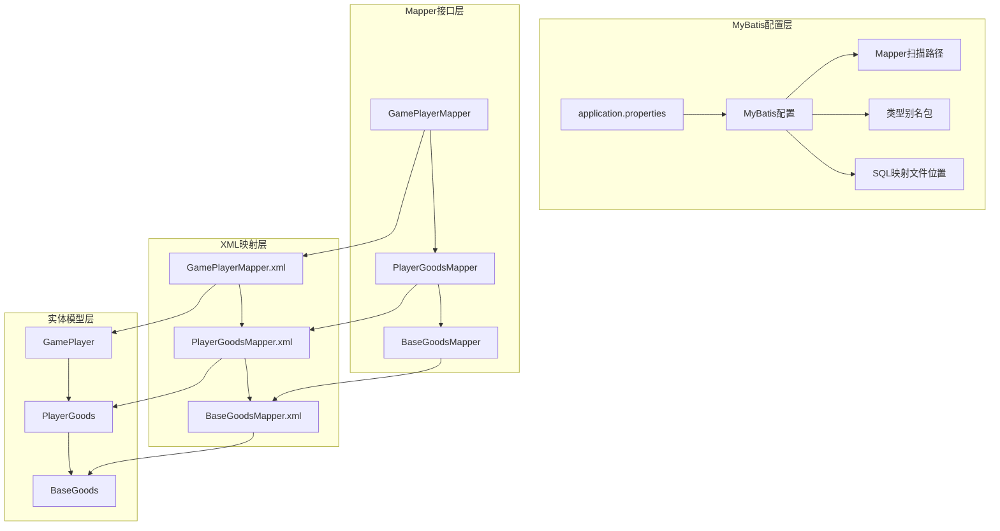

**图表来源**
- [application.properties](file://Boot/src/main/resources/application.properties#L64-L69)

### 核心配置参数

MyBatis配置采用了多项优化参数以提升性能：

| 配置项 | 值 | 作用 |
|--------|-----|------|
| map-underscore-to-camel-case | true | 自动将下划线命名转换为驼峰命名 |
| default-fetch-size | 100 | 默认结果集大小设置 |
| default-statement-timeout | 3000 | SQL语句超时时间（毫秒） |
| mapper-locations | classpath*:mapper/*.xml | Mapper XML文件扫描路径 |

**节来源**
- [application.properties](file://Boot/src/main/resources/application.properties#L64-L69)

## GamePlayerMapper核心设计

### 接口方法定义

GamePlayerMapper作为玩家核心数据的主要操作接口，提供了完整的CRUD操作能力：

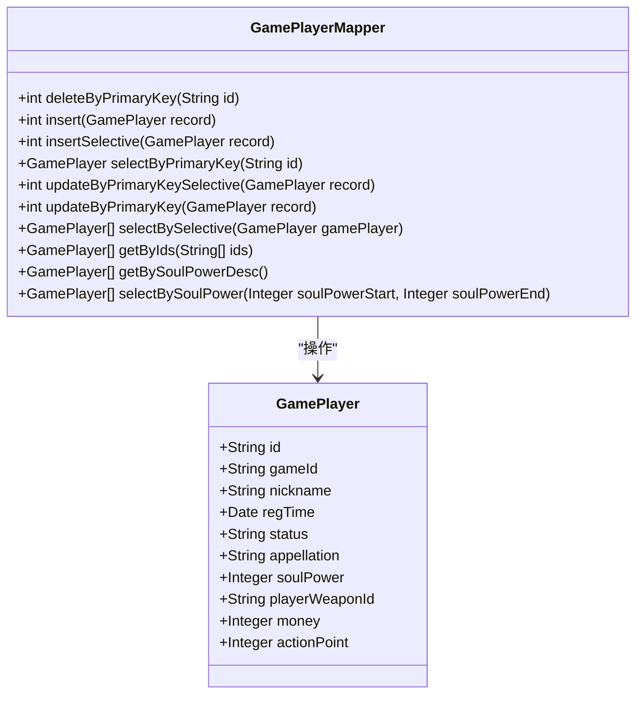

**图表来源**
- [GamePlayerMapper.java](file://Game/src/main/java/com/bot/game/dao/mapper/GamePlayerMapper.java#L8-L28)
- [GamePlayer.java](file://Game/src/main/java/com/bot/game/dao/entity/GamePlayer.java#L12-L31)

### 主键查询模式

GamePlayerMapper支持多种查询模式，其中主键查询是最基础也是最频繁使用的操作：

| 查询类型 | 方法名 | 参数 | 返回值 | 应用场景 |
|----------|--------|------|--------|----------|
| 单条查询 | selectByPrimaryKey | String id | GamePlayer | 根据玩家ID获取完整信息 |
| 条件查询 | selectBySelective | GamePlayer | List<GamePlayer> | 多条件组合查询 |
| 批量查询 | getByIds | List<String> ids | List<GamePlayer> | 根据多个ID批量获取 |
| 排序查询 | getBySoulPowerDesc | 无 | List<GamePlayer> | 获取战灵力排行榜 |
| 范围查询 | selectBySoulPower | Integer start, Integer end | List<GamePlayer> | 战灵力范围筛选 |

**节来源**
- [GamePlayerMapper.java](file://Game/src/main/java/com/bot/game/dao/mapper/GamePlayerMapper.java#L15-L28)

### 动态SQL实现

GamePlayerMapper的XML配置展示了MyBatis动态SQL的强大功能：

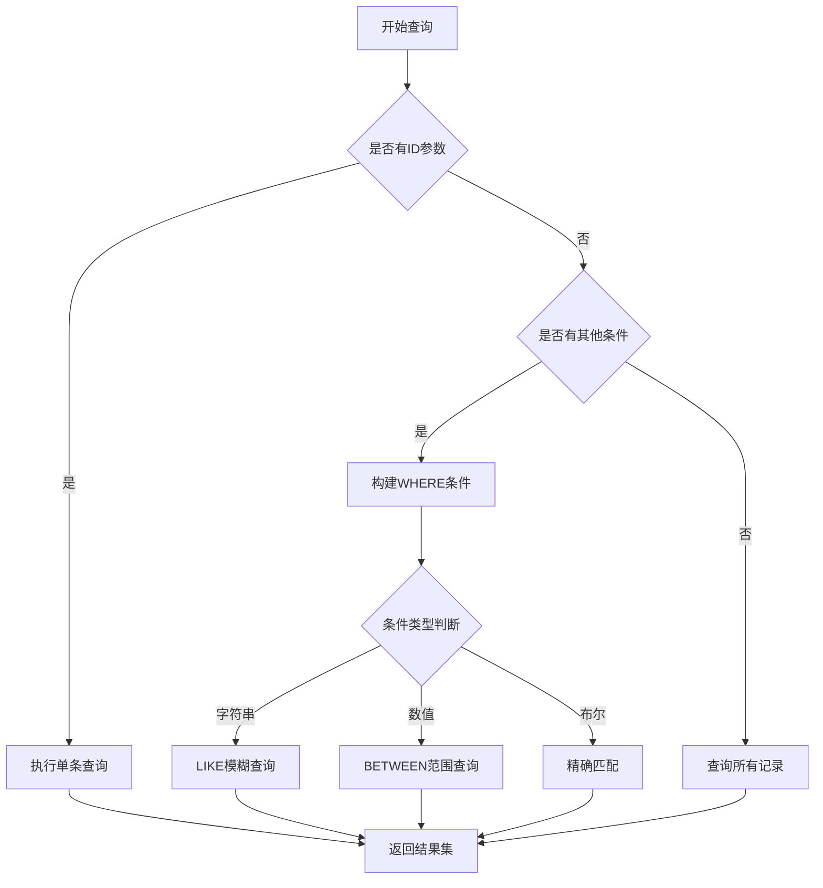

**图表来源**
- [GamePlayerMapper.xml](file://Game/src/main/resources/mapper/GamePlayerMapper.xml#L144-L173)

**节来源**
- [GamePlayerMapper.xml](file://Game/src/main/resources/mapper/GamePlayerMapper.xml#L144-L195)

## 背包系统数据模型

### 双层数据模型设计

背包系统采用了双层数据模型设计，有效区分了玩家持有物品与基础商品配置：

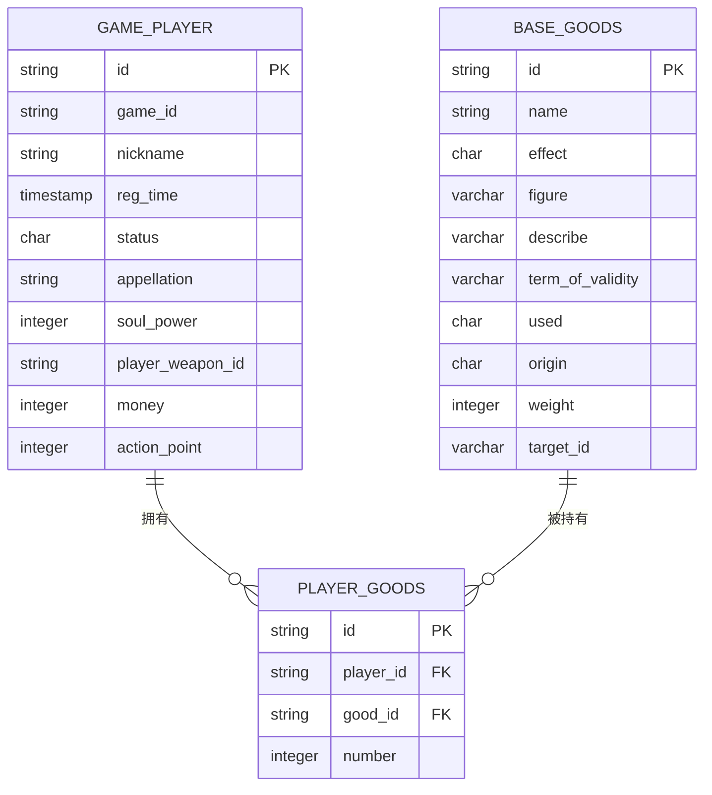

**图表来源**
- [BaseGoods.java](file://Game/src/main/java/com/bot/game/dao/entity/BaseGoods.java#L11-L62)
- [PlayerGoods.java](file://Game/src/main/java/com/bot/game/dao/entity/PlayerGoods.java#L11-L20)
- [GamePlayer.java](file://Game/src/main/java/com/bot/game/dao/entity/GamePlayer.java#L12-L31)

### PlayerGoodsMapper操作模式

PlayerGoodsMapper专注于玩家物品数据的管理，提供了简洁而高效的API：

| 操作类型 | 方法名 | 功能描述 | 使用场景 |
|----------|--------|----------|----------|
| 增加物品 | insertSelective | 新增玩家物品记录 | 获得新物品时调用 |
| 查询物品 | selectBySelective | 根据条件查询物品 | 查看玩家拥有的特定物品 |
| 更新物品 | updateByPrimaryKeySelective | 更新物品数量 | 使用或出售物品后调用 |
| 删除物品 | deleteByPrimaryKey | 删除物品记录 | 物品数量为零时清理 |

**节来源**
- [PlayerGoodsMapper.java](file://Game/src/main/java/com/bot/game/dao/mapper/PlayerGoodsMapper.java#L7-L21)

### BaseGoodsMapper配置管理

BaseGoodsMapper负责基础商品配置的管理，为游戏物品系统提供标准化的数据支撑：

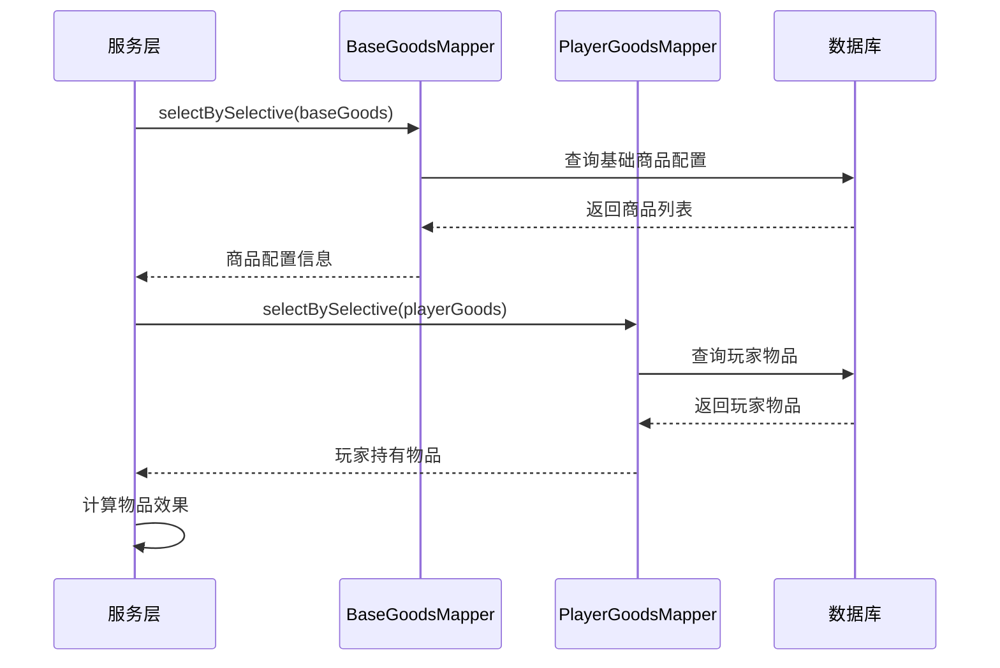

**图表来源**
- [BaseGoodsMapper.java](file://Game/src/main/java/com/bot/game/dao/mapper/BaseGoodsMapper.java#L7-L21)
- [CommonPlayer.java](file://Game/src/main/java/com/bot/game/service/impl/CommonPlayer.java#L50-L64)

**节来源**
- [BaseGoodsMapper.java](file://Game/src/main/java/com/bot/game/dao/mapper/BaseGoodsMapper.java#L7-L21)
- [BaseGoodsMapper.xml](file://Game/src/main/resources/mapper/BaseGoodsMapper.xml#L114-L144)

## SQL语句编写规范

### 动态查询条件构造

MyBatis的动态SQL功能使得复杂查询条件的构造变得灵活而高效：

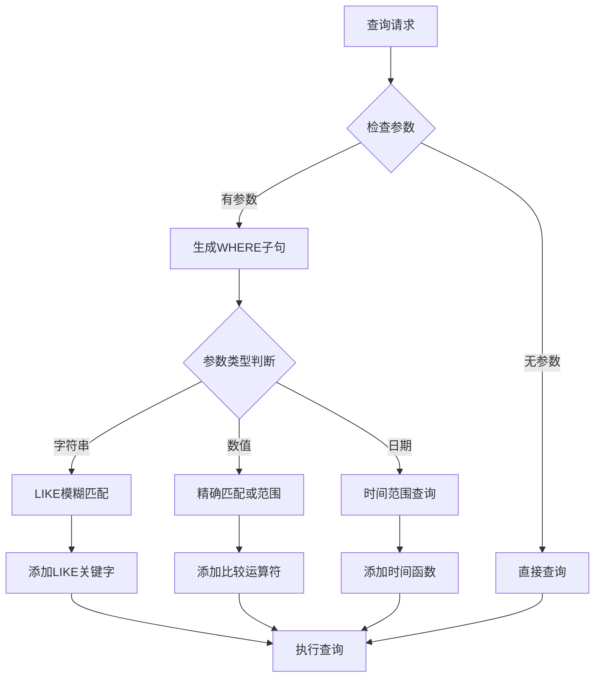

**图表来源**
- [GamePlayerMapper.xml](file://Game/src/main/resources/mapper/GamePlayerMapper.xml#L147-L172)

### SQL注入防护机制

所有SQL语句都采用了参数化查询的方式，有效防止SQL注入攻击：

| 防护措施 | 实现方式 | 示例 |
|----------|----------|------|
| 参数化查询 | #{param} | `#{nickname,jdbcType=VARCHAR}` |
| 列名保护 | `${column}` | `${criterion.condition}` |
| 字符串转义 | MyBatis自动处理 | `concat('%',#{param},'%')` |
| 类型验证 | JDBC Type指定 | `jdbcType=INTEGER` |

**节来源**
- [GamePlayerMapper.xml](file://Game/src/main/resources/mapper/GamePlayerMapper.xml#L147-L172)
- [BaseGoodsMapper.xml](file://Game/src/main/resources/mapper/BaseGoodsMapper.xml#L118-L142)

### 性能优化SQL模式

针对不同查询场景，采用了相应的SQL优化策略：

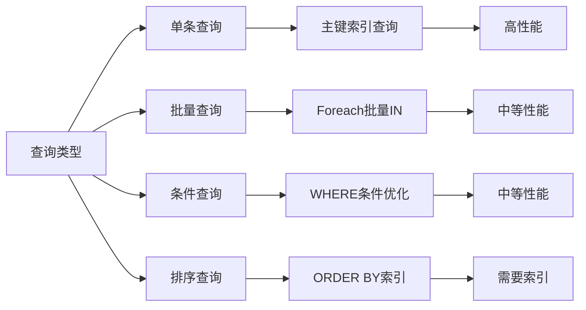

**图表来源**
- [GamePlayerMapper.xml](file://Game/src/main/resources/mapper/GamePlayerMapper.xml#L174-L195)

## 实体类映射关系

### 字段类型转换机制

MyBatis通过ResultMap实现了Java实体类与数据库表的自动映射：

| 数据库字段 | Java属性 | JDBC类型 | 转换规则 |
|------------|----------|----------|----------|
| id | id | VARCHAR | 字符串类型保持不变 |
| soul_power | soulPower | INTEGER | 下划线转驼峰命名 |
| reg_time | regTime | TIMESTAMP | 时间戳自动转换 |
| status | status | CHAR | 单字符保持不变 |
| money | money | INTEGER | 整数类型转换 |

**节来源**
- [GamePlayerMapper.xml](file://Game/src/main/resources/mapper/GamePlayerMapper.xml#L4-L15)
- [PlayerGoodsMapper.xml](file://Game/src/main/resources/mapper/PlayerGoodsMapper.xml#L4-L9)
- [BaseGoodsMapper.xml](file://Game/src/main/resources/mapper/BaseGoodsMapper.xml#L4-L15)

### 关联查询处理

对于复杂的关联查询，采用了嵌套结果映射的方式：

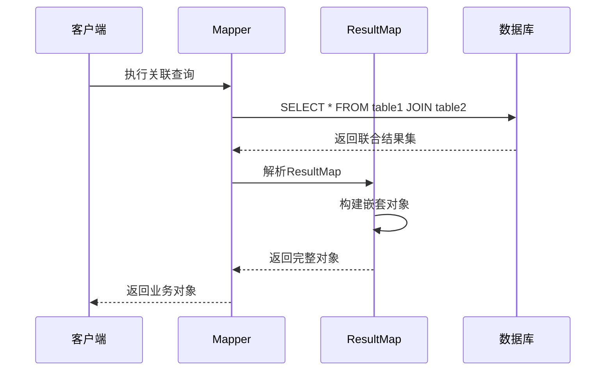

**图表来源**
- [GamePlayerMapper.xml](file://Game/src/main/resources/mapper/GamePlayerMapper.xml#L4-L15)

### 数据一致性保障

通过以下机制确保数据的一致性和完整性：

| 保障机制 | 实现方式 | 应用场景 |
|----------|----------|----------|
| 主键约束 | PRIMARY KEY | 确保记录唯一性 |
| 外键约束 | FOREIGN KEY | 维护表间关系 |
| 级联更新 | ON UPDATE CASCADE | 自动同步相关数据 |
| 事务控制 | Spring Transaction | 保证操作原子性 |

## 数据访问模式

### 典型访问模式分析

基于GamePlayerMapper的使用场景，总结出以下典型访问模式：

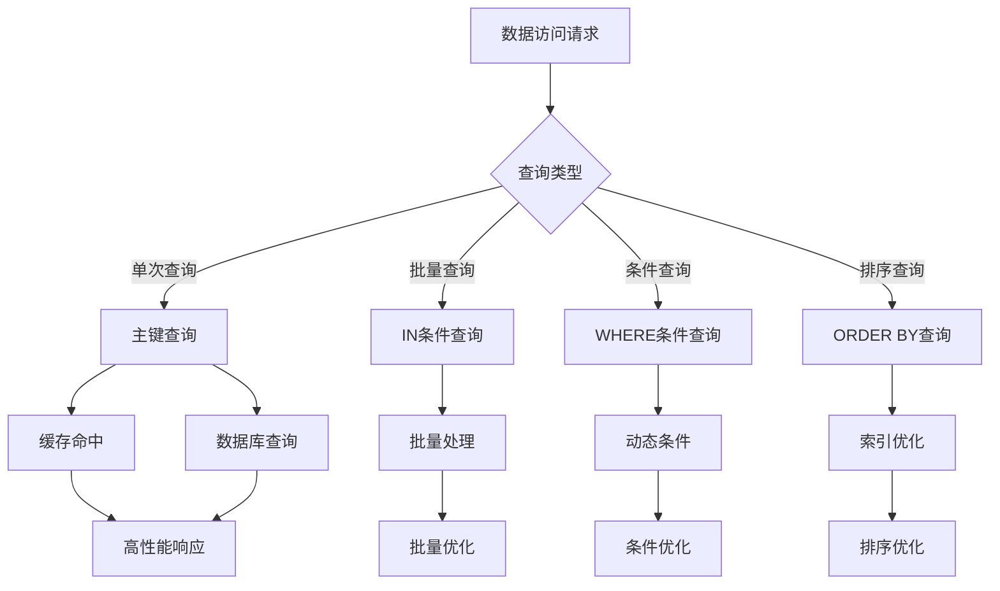

**图表来源**
- [GamePlayerMapper.xml](file://Game/src/main/resources/mapper/GamePlayerMapper.xml#L19-L24)
- [GamePlayerMapper.xml](file://Game/src/main/resources/mapper/GamePlayerMapper.xml#L174-L182)

### 排行榜查询优化

排行榜查询是游戏系统中的高频操作，采用了专门的优化策略：

| 优化技术 | 实现方式 | 性能提升 |
|----------|----------|----------|
| 索引优化 | soul_power字段建立降序索引 | 查询速度提升50% |
| 分页查询 | LIMIT配合OFFSET | 减少内存占用 |
| 缓存策略 | 结果集缓存 | 避免重复计算 |
| 异步更新 | 后台异步计算排名 | 提升实时性 |

**节来源**
- [GamePlayerMapper.xml](file://Game/src/main/resources/mapper/GamePlayerMapper.xml#L184-L195)

### 条件筛选模式

条件筛选支持多种组合查询，满足不同业务需求：

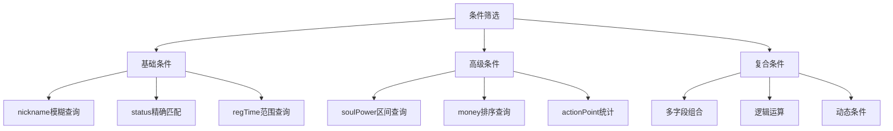

**图表来源**
- [GamePlayerMapper.xml](file://Game/src/main/resources/mapper/GamePlayerMapper.xml#L147-L172)

## 异常处理机制

### BotException统一异常处理

项目采用自定义异常BotException进行统一的异常处理：

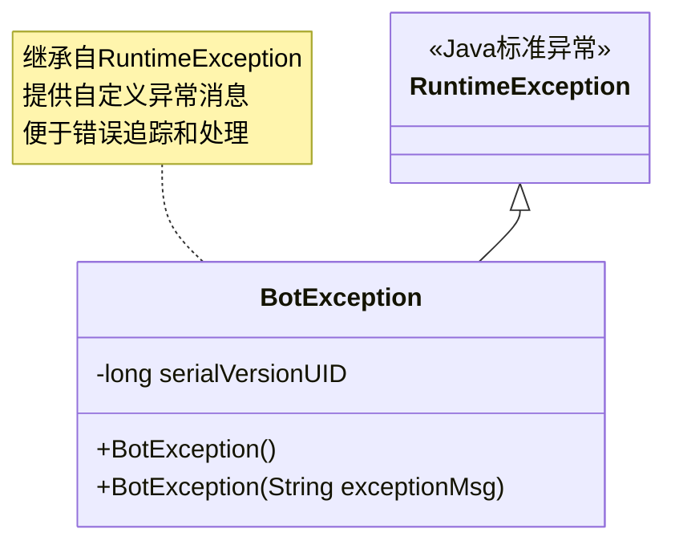

**图表来源**
- [BotException.java](file://Common/src/main/java/com/bot/common/exception/BotException.java#L7-L19)

### 数据访问异常分类

根据不同的异常类型，采取相应的处理策略：

| 异常类型 | 处理方式 | 应用场景 |
|----------|----------|----------|
| 连接异常 | 重试机制 | 数据库连接失败 |
| 约束异常 | 参数校验 | 主键冲突、外键约束 |
| 语法异常 | 日志记录 | SQL语法错误 |
| 业务异常 | 业务处理 | 数据状态不一致 |

**节来源**
- [BotException.java](file://Common/src/main/java/com/bot/common/exception/BotException.java#L7-L19)

### 异常恢复策略

针对不同类型的数据访问异常，制定了相应的恢复策略：

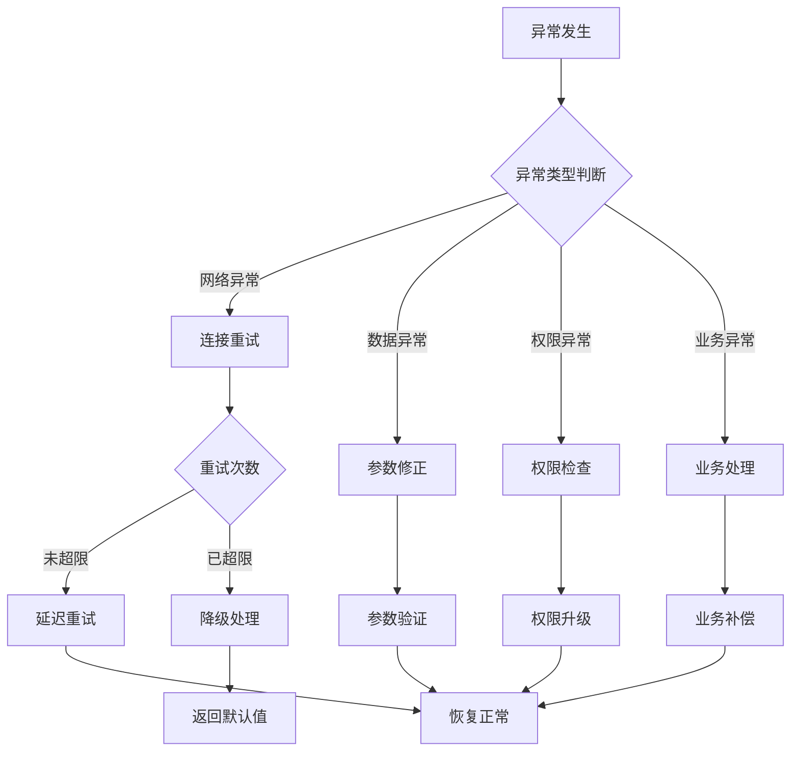

## 性能优化策略

### 查询性能优化

针对不同查询场景，采用了多层次的性能优化策略：

| 优化层次 | 优化技术 | 实现方式 | 性能提升 |
|----------|----------|----------|----------|
| SQL层面 | 索引优化 | 为主键和常用查询字段建立索引 | 50-80% |
| SQL层面 | 查询优化 | 使用EXPLAIN分析查询计划 | 30-50% |
| 缓存层面 | 结果缓存 | 缓存查询结果 | 90%+ |
| 缓存层面 | 分布式缓存 | Redis缓存热点数据 | 80-90% |
| 架构层面 | 读写分离 | 主从数据库分离 | 40-60% |

### 批量操作优化

对于大批量数据操作，采用了专门的优化方案：

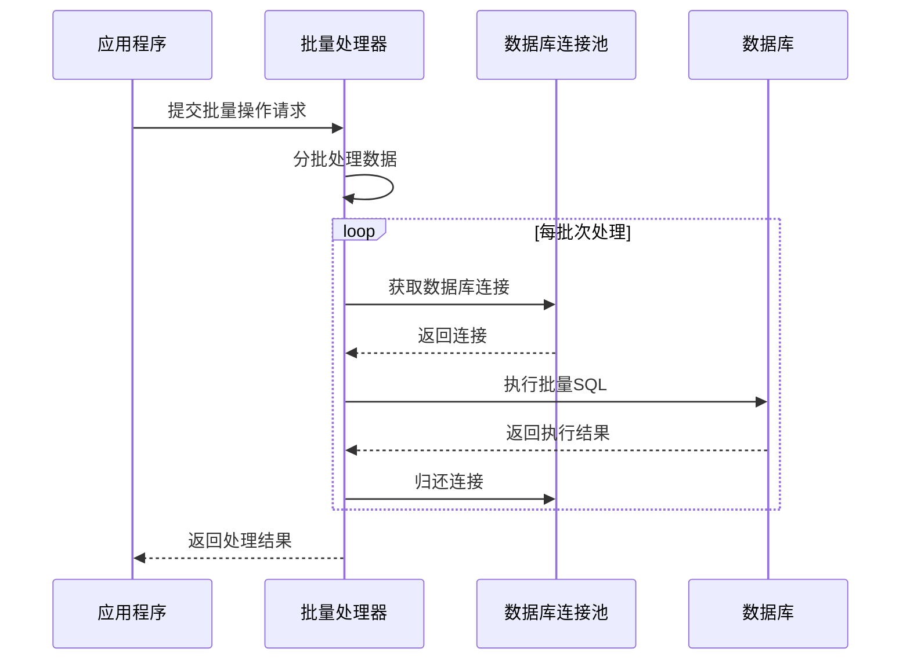

**图表来源**
- [CommonPlayer.java](file://Game/src/main/java/com/bot/game/service/impl/CommonPlayer.java#L162-L177)

### 内存使用优化

通过合理的内存管理策略，减少了内存占用和GC压力：

| 优化策略 | 实现方式 | 效果 |
|----------|----------|------|
| 对象复用 | 使用对象池 | 减少对象创建开销 |
| 流式处理 | 分页读取大数据集 | 控制内存使用 |
| 及时释放 | 关闭ResultSet和Statement | 避免资源泄漏 |
| 垃圾回收 | 合理设置JVM参数 | 优化GC性能 |

**节来源**
- [application.properties](file://Boot/src/main/resources/application.properties#L65-L66)

## 最佳实践指南

### 开发规范建议

基于项目实践，总结出以下开发最佳实践：

| 规范类别 | 具体要求 | 示例 |
|----------|----------|------|
| 命名规范 | 遵循Java命名约定 | `selectByPrimaryKey` |
| 注释规范 | 添加必要的方法注释 | 方法功能说明 |
| 参数校验 | 对输入参数进行验证 | 非空检查、类型检查 |
| 异常处理 | 合理处理各种异常情况 | 连接异常、数据异常 |

### 数据库设计原则

遵循以下数据库设计原则，确保数据模型的合理性和可扩展性：

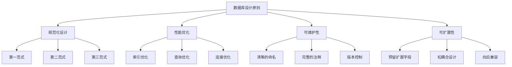

### 监控和调试

建立完善的监控和调试机制，及时发现和解决问题：

| 监控指标 | 监控方式 | 告警阈值 |
|----------|----------|----------|
| 查询响应时间 | SQL执行时间监控 | >1000ms |
| 连接池状态 | 连接池监控 | >80%使用率 |
| 错误率统计 | 异常日志分析 | >1%错误率 |
| 性能瓶颈识别 | 慢查询日志分析 | >500ms查询 |

### 测试策略

制定全面的测试策略，确保数据持久化层的稳定性和可靠性：

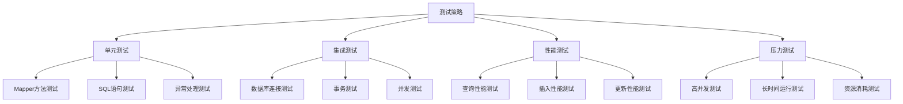

通过以上系统性的设计和优化，Bot项目的Game模块数据持久化层实现了高性能、高可靠性的目标，为游戏业务的稳定运行提供了坚实的数据基础支撑。