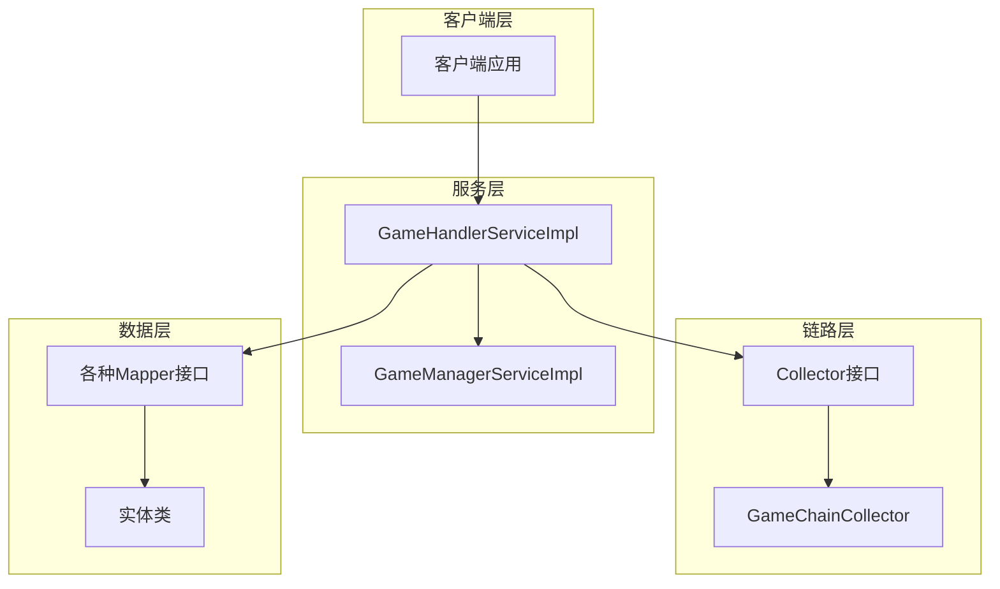
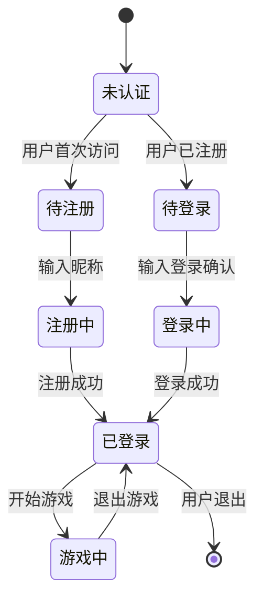
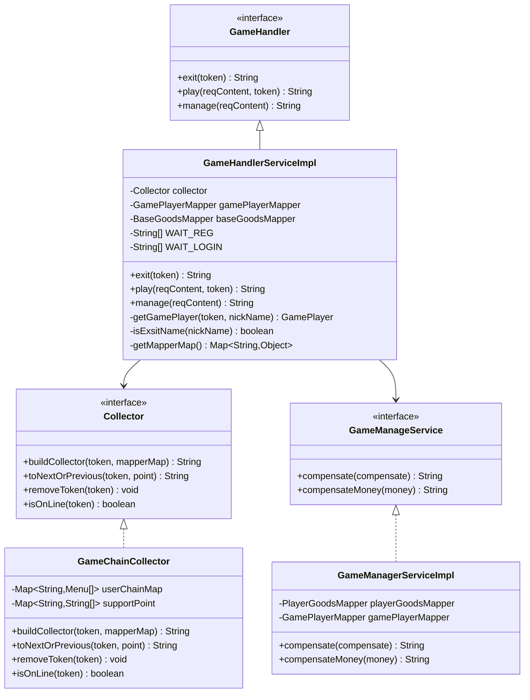
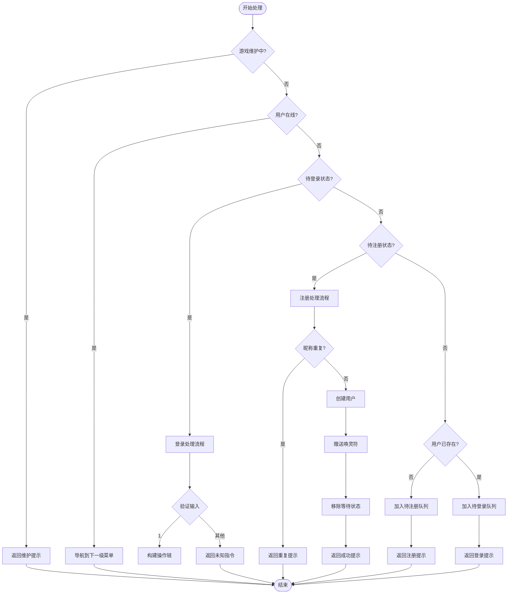
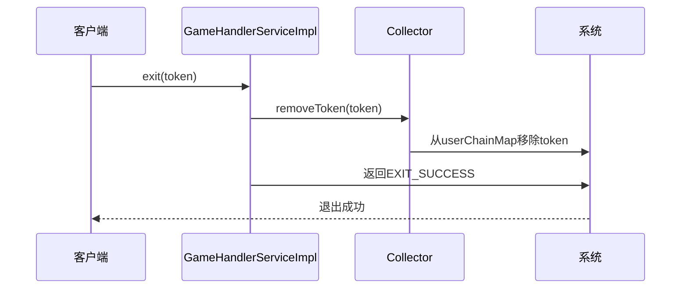
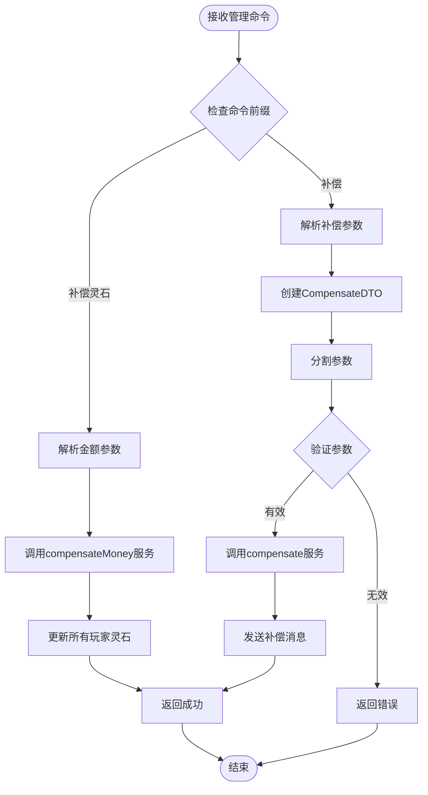
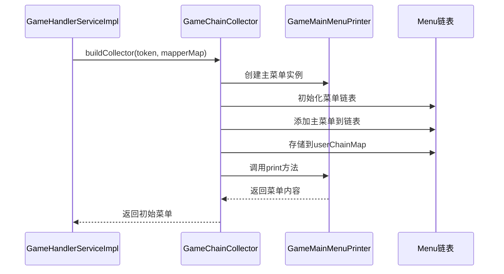
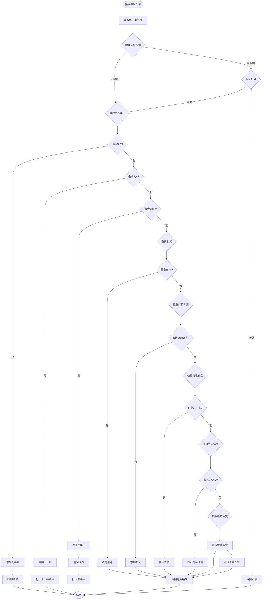
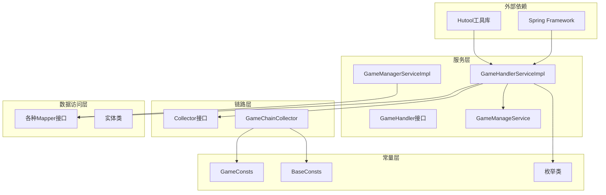

# 核心逻辑

<cite>
**本文档引用的文件**
- [GameHandlerServiceImpl.java](file://Game/src/main/java/com/bot/game/service/impl/GameHandlerServiceImpl.java)
- [GameHandler.java](file://Game/src/main/java/com/bot/game/service/GameHandler.java)
- [GameManageService.java](file://Game/src/main/java/com/bot/game/service/GameManageService.java)
- [Collector.java](file://Game/src/main/java/com/bot/game/chain/Collector.java)
- [GameChainCollector.java](file://Game/src/main/java/com/bot/game/chain/GameChainCollector.java)
- [GameManagerServiceImpl.java](file://Game/src/main/java/com/bot/game/service/impl/GameManagerServiceImpl.java)
- [CompensateDTO.java](file://Game/src/main/java/com/bot/game/dto/CompensateDTO.java)
- [CommonPlayer.java](file://Game/src/main/java/com/bot/game/service/impl/CommonPlayer.java)
- [ENStatus.java](file://Common/src/main/java/com/bot/common/enums/ENStatus.java)
- [GameConsts.java](file://Common/src/main/java/com/bot/common/constant/GameConsts.java)
- [BaseConsts.java](file://Common/src/main/java/com/bot/common/constant/BaseConsts.java)
</cite>

## 目录
1. [引言](#引言)
2. [项目结构概览](#项目结构概览)
3. [核心组件分析](#核心组件分析)
4. [架构概览](#架构概览)
5. [详细组件分析](#详细组件分析)
6. [依赖关系分析](#依赖关系分析)
7. [性能考虑](#性能考虑)
8. [故障排除指南](#故障排除指南)
9. [结论](#结论)

## 引言

GameHandlerServiceImpl是游戏系统的核心处理器，负责管理用户的游戏会话、状态流转和业务逻辑执行。该服务实现了三个核心接口：play（游戏交互）、exit（退出处理）和manage（管理员操作），并通过Collector接口构建用户操作链，实现复杂的菜单导航和状态管理功能。

## 项目结构概览

游戏系统的整体架构采用分层设计，主要包含以下模块：
- **服务层**：GameHandlerServiceImpl为核心业务处理器
- **链路层**：Collector接口及其具体实现GameChainCollector
- **数据访问层**：各种Mapper接口和实体类
- **常量配置层**：GameConsts和BaseConsts提供系统常量

**图表来源**
- [GameHandlerServiceImpl.java](file://Game/src/main/java/com/bot/game/service/impl/GameHandlerServiceImpl.java#L27-L189)
- [GameChainCollector.java](file://Game/src/main/java/com/bot/game/chain/GameChainCollector.java#L24-L119)

## 核心组件分析

### GameHandlerServiceImpl核心特性

GameHandlerServiceImpl作为游戏系统的核心处理器，具有以下关键特性：

1. **状态管理**：维护WAIT_REG和WAIT_LOGIN两个静态列表，分别管理待注册和待登录的用户状态
2. **链路构建**：通过Collector接口构建用户操作链，实现菜单导航和状态流转
3. **数据访问**：集成14个Mapper接口，提供完整的游戏数据访问能力
4. **异常处理**：完善的错误处理和状态检查机制

### 用户状态流转控制

系统通过WAIT_REG和WAIT_LOGIN两个列表实现用户会话生命周期管理：

**节源**
- [GameHandlerServiceImpl.java](file://Game/src/main/java/com/bot/game/service/impl/GameHandlerServiceImpl.java#L78-L80)
- [GameHandlerServiceImpl.java](file://Game/src/main/java/com/bot/game/service/impl/GameHandlerServiceImpl.java#L124-L132)

## 架构概览

游戏系统采用事件驱动的架构模式，通过状态机和链路模式实现复杂的游戏逻辑：

**图表来源**
- [GameHandler.java](file://Game/src/main/java/com/bot/game/service/GameHandler.java#L7-L29)
- [GameHandlerServiceImpl.java](file://Game/src/main/java/com/bot/game/service/impl/GameHandlerServiceImpl.java#L27-L189)
- [Collector.java](file://Game/src/main/java/com/bot/game/chain/Collector.java#L9-L39)
- [GameChainCollector.java](file://Game/src/main/java/com/bot/game/chain/GameChainCollector.java#L24-L119)

## 详细组件分析

### play接口实现机制

play方法是游戏系统的核心入口，负责处理用户的各种游戏操作请求：

#### 核心流程分析

**图表来源**
- [GameHandlerServiceImpl.java](file://Game/src/main/java/com/bot/game/service/impl/GameHandlerServiceImpl.java#L89-L132)

#### 用户状态管理策略

系统通过WAIT_REG和WAIT_LOGIN两个静态列表实现精确的状态管理：

| 状态 | WAIT_REG | WAIT_LOGIN | 处理逻辑 |
|------|----------|------------|----------|
| 新用户首次访问 | ✓ | ✗ | 加入待注册队列，要求输入昵称 |
| 已注册用户首次访问 | ✗ | ✓ | 加入待登录队列，显示欢迎信息 |
| 注册中 | ✗ | ✗ | 验证昵称，创建用户账户 |
| 登录中 | ✗ | ✗ | 验证登录，构建操作链 |
| 已登录 | ✗ | ✗ | 进入游戏主菜单 |

**节源**
- [GameHandlerServiceImpl.java](file://Game/src/main/java/com/bot/game/service/impl/GameHandlerServiceImpl.java#L78-L80)
- [GameHandlerServiceImpl.java](file://Game/src/main/java/com/bot/game/service/impl/GameHandlerServiceImpl.java#L124-L132)

### exit接口实现机制

exit方法负责清理用户会话和资源释放：

**图表来源**
- [GameHandlerServiceImpl.java](file://Game/src/main/java/com/bot/game/service/impl/GameHandlerServiceImpl.java#L82-L86)

### manage接口实现机制

manage方法提供管理员补偿功能，支持灵石补偿和物品补偿两种操作：

#### 补偿功能安全校验

**图表来源**
- [GameHandlerServiceImpl.java](file://Game/src/main/java/com/bot/game/service/impl/GameHandlerServiceImpl.java#L135-L149)
- [GameManagerServiceImpl.java](file://Game/src/main/java/com/bot/game/service/impl/GameManagerServiceImpl.java#L38-L60)

**节源**
- [GameHandlerServiceImpl.java](file://Game/src/main/java/com/bot/game/service/impl/GameHandlerServiceImpl.java#L135-L149)
- [GameManagerServiceImpl.java](file://Game/src/main/java/com/bot/game/service/impl/GameManagerServiceImpl.java#L38-L60)

### Collector接口关键作用

Collector接口在构建用户操作链中发挥关键作用，其实现类GameChainCollector提供了完整的链路管理和导航功能：

#### buildCollector初始化调用链

buildCollector方法负责初始化用户操作链，建立从主菜单开始的完整调用链：

**图表来源**
- [GameChainCollector.java](file://Game/src/main/java/com/bot/game/chain/GameChainCollector.java#L34-L45)

#### toNextOrPrevious实现菜单导航

toNextOrPrevious方法实现了复杂的菜单导航逻辑，支持前进、后退和跨菜单跳转：

**图表来源**
- [GameChainCollector.java](file://Game/src/main/java/com/bot/game/chain/GameChainCollector.java#L48-L107)

**节源**
- [GameChainCollector.java](file://Game/src/main/java/com/bot/game/chain/GameChainCollector.java#L34-L107)

### getMapperMap方法数据访问层管理

getMapperMap方法实现了数据访问层对象的集中注入与管理：

#### 数据访问层对象映射

| 映射键 | Mapper接口 | 功能描述 |
|--------|------------|----------|
| BASE_GOODS | BaseGoodsMapper | 基础物品数据访问 |
| BASE_PHANTOM | BasePhantomMapper | 基础幻灵数据访问 |
| BASE_SKILL | BaseSkillMapper | 基础技能数据访问 |
| GAME | GameMapper | 游戏基本信息访问 |
| GAME_PLAYER | GamePlayerMapper | 游戏玩家数据访问 |
| PLAYER_APPELLATION | PlayerAppellationMapper | 玩家称号数据访问 |
| PLAYER_FRIENDS | PlayerFriendsMapper | 玩家好友数据访问 |
| PLAYER_GOODS | PlayerGoodsMapper | 玩家物品数据访问 |
| PLAYER_PHANTOM | PlayerPhantomMapper | 玩家幻灵数据访问 |
| BASE_MONSTER | BaseMonsterMapper | 基础怪物数据访问 |
| BASE_WEAPON | BaseWeaponMapper | 基础法宝数据访问 |
| PLAYER_WEAPON | PlayerWeaponMapper | 玩家法宝数据访问 |
| MESSAGE | MessageMapper | 消息数据访问 |
| GOODS_BOX | GoodsBoxMapper | 商品箱数据访问 |

**节源**
- [GameHandlerServiceImpl.java](file://Game/src/main/java/com/bot/game/service/impl/GameHandlerServiceImpl.java#L172-L188)

## 依赖关系分析

游戏系统的依赖关系呈现清晰的分层结构：

**图表来源**
- [GameHandlerServiceImpl.java](file://Game/src/main/java/com/bot/game/service/impl/GameHandlerServiceImpl.java#L1-L22)
- [GameChainCollector.java](file://Game/src/main/java/com/bot/game/chain/GameChainCollector.java#L1-L17)

**节源**
- [GameHandlerServiceImpl.java](file://Game/src/main/java/com/bot/game/service/impl/GameHandlerServiceImpl.java#L1-L22)
- [GameChainCollector.java](file://Game/src/main/java/com/bot/game/chain/GameChainCollector.java#L1-L17)

## 性能考虑

### 线程安全设计

系统在多个层面考虑了线程安全：

1. **静态状态管理**：WAIT_REG和WAIT_LOGIN使用LinkedList，支持并发访问
2. **链路状态管理**：userChainMap使用HashMap，支持并发读取
3. **数据访问**：各Mapper接口基于Spring管理，具备线程安全性

### 性能优化点

1. **延迟加载**：通过getMapperMap方法实现Mapper的延迟注入
2. **缓存机制**：userChainMap作为内存缓存，避免频繁数据库查询
3. **批量操作**：GameManagerServiceImpl支持批量补偿操作

### 异常处理策略

系统实现了多层次的异常处理：

1. **输入验证**：play方法对用户输入进行严格验证
2. **状态检查**：exit方法确保用户处于有效状态
3. **资源清理**：exit方法保证会话资源的正确释放
4. **回滚机制**：manage方法提供操作失败的回滚能力

## 故障排除指南

### 常见问题及解决方案

#### 用户状态异常

**问题**：用户状态卡在WAIT_REG或WAIT_LOGIN
**原因**：网络中断或系统异常导致状态未正确清除
**解决方案**：系统会在一定时间后自动清理无效状态

#### 游戏维护状态

**问题**：用户收到"游戏维护中"提示
**原因**：GameConsts.CommonTip.LOCK状态被设置
**解决方案**：检查Game表的status字段，确保设置为NORMAL

#### 补偿功能异常

**问题**：管理员补偿功能失效
**原因**：权限验证或参数解析错误
**解决方案**：检查命令格式和参数有效性

**节源**
- [GameHandlerServiceImpl.java](file://Game/src/main/java/com/bot/game/service/impl/GameHandlerServiceImpl.java#L90-L94)
- [GameConsts.java](file://Common/src/main/java/com/bot/common/constant/GameConsts.java#L13-L43)

## 结论

GameHandlerServiceImpl作为游戏系统的核心处理器，展现了优秀的架构设计和业务逻辑实现。通过play、exit、manage三大接口的协同工作，配合Collector接口的链路管理功能，实现了完整的用户会话生命周期管理和复杂的游戏交互逻辑。

系统的主要优势包括：
1. **清晰的职责分离**：各接口职责明确，便于维护和扩展
2. **灵活的状态管理**：支持多种用户状态和会话流转
3. **强大的链路构建**：通过Collector接口实现复杂的菜单导航
4. **完善的数据访问**：集中管理所有数据访问层对象
5. **健壮的异常处理**：多层次的错误处理和恢复机制

这种设计不仅保证了系统的稳定性和可扩展性，也为后续的功能扩展和性能优化奠定了良好的基础。