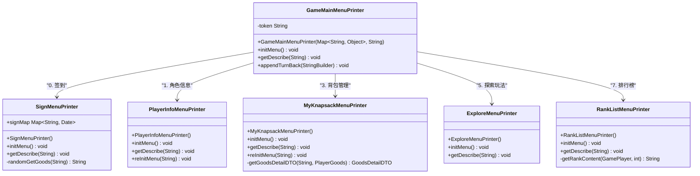

# 游戏菜单系统

<cite>
**本文档引用的文件**
- [GameMainMenuPrinter.java](file://Game/src/main/java/com/bot/game/chain/menu/GameMainMenuPrinter.java)
- [MenuPrinter.java](file://Game/src/main/java/com/bot/game/chain/MenuPrinter.java)
- [Menu.java](file://Game/src/main/java/com/bot/game/chain/Menu.java)
- [SignMenuPrinter.java](file://Game/src/main/java/com/bot/game/chain/menu/SignMenuPrinter.java)
- [ShopMenuPrinter.java](file://Game/src/main/java/com/bot/game/chain/menu/ShopMenuPrinter.java)
- [RankListMenuPrinter.java](file://Game/src/main/java/com/bot/game/chain/menu/RankListMenuPrinter.java)
- [ExploreMenuPrinter.java](file://Game/src/main/java/com/bot/game/chain/menu/ExploreMenuPrinter.java)
- [MyKnapsackMenuPrinter.java](file://Game/src/main/java/com/bot/game/chain/menu/MyKnapsackMenuPrinter.java)
- [PlayerInfoMenuPrinter.java](file://Game/src/main/java/com/bot/game/chain/menu/PlayerInfoMenuPrinter.java)
- [GameChainCollector.java](file://Game/src/main/java/com/bot/game/chain/GameChainCollector.java)
- [GoodsDetailMenuPrinter.java](file://Game/src/main/java/com/bot/game/chain/menu/GoodsDetailMenuPrinter.java)
- [DungeonEnterMenuPrinter.java](file://Game/src/main/java/com/bot/game/chain/menu/dungeon/DungeonEnterMenuPrinter.java)
</cite>

## 目录
1. [引言](#引言)
2. [系统架构概述](#系统架构概述)
3. [核心组件分析](#核心组件分析)
4. [MenuPrinter体系详解](#menuprinter体系详解)
5. [主菜单入口分析](#主菜单入口分析)
6. [功能菜单打印机详解](#功能菜单打印机详解)
7. [菜单导航与状态管理](#菜单导航与状态管理)
8. [文本格式化与用户输入解析](#文本格式化与用户输入解析)
9. [继承体系与代码复用](#继承体系与代码复用)
10. [总结](#总结)

## 引言

基于MenuPrinter体系的游戏菜单渲染机制是一个高度模块化和可扩展的文本界面系统，专为游戏中的各种交互场景设计。该系统通过统一的接口定义和继承体系，实现了菜单的标准化构建、导航管理和状态维护，为玩家提供了流畅的交互体验。

## 系统架构概述

游戏菜单系统采用分层架构设计，主要包含以下层次：

**图表来源**
- [GameChainCollector.java](file://Game/src/main/java/com/bot/game/chain/GameChainCollector.java#L1-L119)
- [MenuPrinter.java](file://Game/src/main/java/com/bot/game/chain/MenuPrinter.java#L1-L26)
- [Menu.java](file://Game/src/main/java/com/bot/game/chain/Menu.java#L1-L76)

## 核心组件分析

### MenuPrinter接口

MenuPrinter接口定义了菜单系统的核心契约，规定了所有菜单实现必须提供的基本功能：

**图表来源**
- [MenuPrinter.java](file://Game/src/main/java/com/bot/game/chain/MenuPrinter.java#L7-L25)
- [Menu.java](file://Game/src/main/java/com/bot/game/chain/Menu.java#L19-L76)
- [GameMainMenuPrinter.java](file://Game/src/main/java/com/bot/game/chain/menu/GameMainMenuPrinter.java#L16-L51)

**章节来源**
- [MenuPrinter.java](file://Game/src/main/java/com/bot/game/chain/MenuPrinter.java#L1-L26)
- [Menu.java](file://Game/src/main/java/com/bot/game/chain/Menu.java#L1-L76)

## MenuPrinter体系详解

### 接口设计原则

MenuPrinter接口采用了职责分离的设计原则，将菜单的不同功能分离到独立的方法中：

1. **initMenu()**: 负责菜单的初始化，建立菜单项之间的关联关系
2. **getDescribe()**: 生成菜单的具体内容描述，包括标题、选项和提示信息
3. **reInitMenu()**: 在需要时重新初始化菜单状态，确保数据的实时性

### 基类Menu的功能扩展

Menu基类在接口的基础上提供了完整的菜单渲染功能：

- **菜单树管理**: 通过`menuChildrenMap`维护菜单层级关系
- **服务映射**: 通过`playServiceMap`关联业务服务
- **格式化输出**: 提供统一的菜单格式化和输出机制
- **状态维护**: 支持菜单状态的动态更新和重置

**章节来源**
- [Menu.java](file://Game/src/main/java/com/bot/game/chain/Menu.java#L31-L76)
- [MenuPrinter.java](file://Game/src/main/java/com/bot/game/chain/MenuPrinter.java#L9-L25)

## 主菜单入口分析

### GameMainMenuPrinter结构设计

GameMainMenuPrinter作为主菜单的入口点，负责组织和管理所有子菜单的初始化：

**图表来源**
- [GameMainMenuPrinter.java](file://Game/src/main/java/com/bot/game/chain/menu/GameMainMenuPrinter.java#L26-L39)

### 主菜单响应逻辑

主菜单的响应逻辑体现了菜单系统的导航设计理念：

1. **初始化阶段**: 构造函数接收token参数，建立与用户的关联
2. **菜单构建**: 通过`initMenu()`方法建立子菜单的层次关系
3. **描述生成**: `getDescribe()`提供版本信息和操作提示
4. **导航控制**: `appendTurnBack()`控制返回选项的显示

**章节来源**
- [GameMainMenuPrinter.java](file://Game/src/main/java/com/bot/game/chain/menu/GameMainMenuPrinter.java#L16-L51)

## 功能菜单打印机详解

### SignMenuPrinter - 签到交互处理器

SignMenuPrinter专门处理每日签到功能，实现了随机奖励机制：

**图表来源**
- [SignMenuPrinter.java](file://Game/src/main/java/com/bot/game/chain/menu/SignMenuPrinter.java#L35-L70)

### ShopMenuPrinter - 商店商品展示器

ShopMenuPrinter负责展示商店商品和销售逻辑：

**图表来源**
- [ShopMenuPrinter.java](file://Game/src/main/java/com/bot/game/chain/menu/ShopMenuPrinter.java#L25-L31)

### RankListMenuPrinter - 排行榜数据生成器

RankListMenuPrinter实现了基于战灵力的排行榜功能：

**图表来源**
- [RankListMenuPrinter.java](file://Game/src/main/java/com/bot/game/chain/menu/RankListMenuPrinter.java#L31-L49)

### ExploreMenuPrinter - 探索玩法驱动器

ExploreMenuPrinter作为探索功能的入口，连接多个子功能：

- **区域探索**: `ExploreAllAreaPrinter` - 全区域探索
- **世界BOSS**: `WordBoosPrinter` - 世界BOSS挑战
- **副本系统**: `DungeonEnterMenuPrinter` - 副本进入
- **商店购物**: `ShopMenuPrinter` - 商店浏览

### MyKnapsackMenuPrinter - 背包物品管理者

MyKnapsackMenuPrinter实现了动态背包管理功能：

**图表来源**
- [MyKnapsackMenuPrinter.java](file://Game/src/main/java/com/bot/game/chain/menu/MyKnapsackMenuPrinter.java#L24-L78)
- [GoodsDetailMenuPrinter.java](file://Game/src/main/java/com/bot/game/chain/menu/GoodsDetailMenuPrinter.java#L14-L37)

### PlayerInfoMenuPrinter - 角色信息呈现器

PlayerInfoMenuPrinter负责展示和管理玩家基本信息：

- **基础信息**: 昵称、称号、幻灵数量、战灵力等
- **装备信息**: 法宝等级显示
- **功能入口**: 称号更换、武器更换

**章节来源**
- [SignMenuPrinter.java](file://Game/src/main/java/com/bot/game/chain/menu/SignMenuPrinter.java#L1-L73)
- [ShopMenuPrinter.java](file://Game/src/main/java/com/bot/game/chain/menu/ShopMenuPrinter.java#L1-L34)
- [RankListMenuPrinter.java](file://Game/src/main/java/com/bot/game/chain/menu/RankListMenuPrinter.java#L1-L61)
- [ExploreMenuPrinter.java](file://Game/src/main/java/com/bot/game/chain/menu/ExploreMenuPrinter.java#L1-L35)
- [MyKnapsackMenuPrinter.java](file://Game/src/main/java/com/bot/game/chain/menu/MyKnapsackMenuPrinter.java#L1-L78)
- [PlayerInfoMenuPrinter.java](file://Game/src/main/java/com/bot/game/chain/menu/PlayerInfoMenuPrinter.java#L1-L64)

## 菜单导航与状态管理

### GameChainCollector - 导航控制器

GameChainCollector是菜单系统的核心导航控制器，负责维护用户会话状态和菜单链路：

**图表来源**
- [GameChainCollector.java](file://Game/src/main/java/com/bot/game/chain/GameChainCollector.java#L34-L107)

### 状态维持机制

菜单系统通过以下机制维持用户状态：

1. **链路跟踪**: 使用`userChainMap`维护每个用户的菜单链路
2. **指令验证**: 通过`sUPPORTPoint`验证用户输入的有效性
3. **临时状态**: 维护如消息编辑、好友添加等临时状态
4. **数据刷新**: 支持菜单的动态重载和状态更新

### 跳转关系管理

菜单间的跳转遵循严格的层次结构：

**图表来源**
- [GameMainMenuPrinter.java](file://Game/src/main/java/com/bot/game/chain/menu/GameMainMenuPrinter.java#L28-L39)
- [ExploreMenuPrinter.java](file://Game/src/main/java/com/bot/game/chain/menu/ExploreMenuPrinter.java#L26-L32)

**章节来源**
- [GameChainCollector.java](file://Game/src/main/java/com/bot/game/chain/GameChainCollector.java#L23-L119)

## 文本格式化与用户输入解析

### 格式化输出策略

菜单系统采用统一的格式化模板来确保用户体验的一致性：

| 组件 | 格式模板 | 示例 |
|------|----------|------|
| 菜单标题 | `[菜单名称]` | `[个人信息]` |
| 选项格式 | `序号.选项名称` | `1. 更换称号` |
| 返回选项 | `0.返回` | `0.返回` |
| 双返回选项 | `00.返回主菜单` | `00.返回主菜单` |
| 分隔符 | 换行符 | `\n` |

### 用户输入解析规则

系统通过以下规则解析用户输入：

1. **数字指令**: 解析为菜单项的选择
2. **特殊指令**: 如`0`（返回）、`00`（返回主菜单）
3. **功能指令**: 如`Q`（查看战斗详情）、`A`（查看版本历史）
4. **文本输入**: 用于消息发送、好友添加等

### 动态内容生成

菜单系统支持多种动态内容生成方式：

- **参数化模板**: 使用`String.format()`生成带参数的内容
- **条件格式化**: 根据数据状态调整显示内容
- **国际化支持**: 通过常量配置支持多语言
- **实时数据**: 从数据库获取最新数据进行展示

**章节来源**
- [Menu.java](file://Game/src/main/java/com/bot/game/chain/Menu.java#L36-L53)

## 继承体系与代码复用

### 统一的Menu基类

Menu基类提供了完整的菜单功能框架，实现了代码复用：

**图表来源**
- [Menu.java](file://Game/src/main/java/com/bot/game/chain/Menu.java#L19-L76)
- [MenuPrinter.java](file://Game/src/main/java/com/bot/game/chain/MenuPrinter.java#L7-L25)

### 扩展性设计

MenuPrinter体系具有良好的扩展性：

1. **接口约束**: MenuPrinter接口确保所有菜单实现一致的行为
2. **基类功能**: Menu基类提供通用的渲染和导航功能
3. **特定实现**: 子类专注于具体的业务逻辑实现
4. **组合模式**: 支持菜单的嵌套和组合

### 最佳实践

在MenuPrinter体系中推荐的最佳实践：

- **单一职责**: 每个菜单只负责一个特定的功能领域
- **依赖注入**: 通过构造函数注入必要的依赖
- **状态隔离**: 每个菜单实例维护独立的状态
- **异常处理**: 统一的异常处理机制确保系统稳定性

**章节来源**
- [Menu.java](file://Game/src/main/java/com/bot/game/chain/Menu.java#L19-L76)
- [GameMainMenuPrinter.java](file://Game/src/main/java/com/bot/game/chain/menu/GameMainMenuPrinter.java#L20-L24)

## 总结

基于MenuPrinter体系的游戏菜单渲染机制展现了优秀的软件架构设计：

### 核心优势

1. **模块化设计**: 清晰的职责分离和模块化结构
2. **可扩展性**: 基于接口和抽象类的良好扩展能力
3. **代码复用**: 通过继承和组合实现高效的代码复用
4. **状态管理**: 完善的用户状态维护和导航控制
5. **用户体验**: 一致的格式化输出和直观的交互流程

### 设计亮点

- **统一接口**: MenuPrinter接口确保了系统的一致性
- **灵活导航**: GameChainCollector提供了强大的导航控制
- **动态渲染**: 支持根据实时数据动态生成菜单内容
- **错误处理**: 完善的输入验证和错误处理机制

### 应用价值

该菜单系统不仅适用于游戏场景，其设计理念和实现方式也为其他需要复杂菜单交互的应用提供了宝贵的参考。通过合理的架构设计和代码组织，实现了功能丰富、易于维护和扩展的菜单系统。