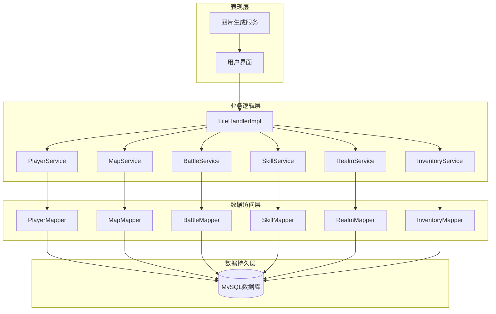
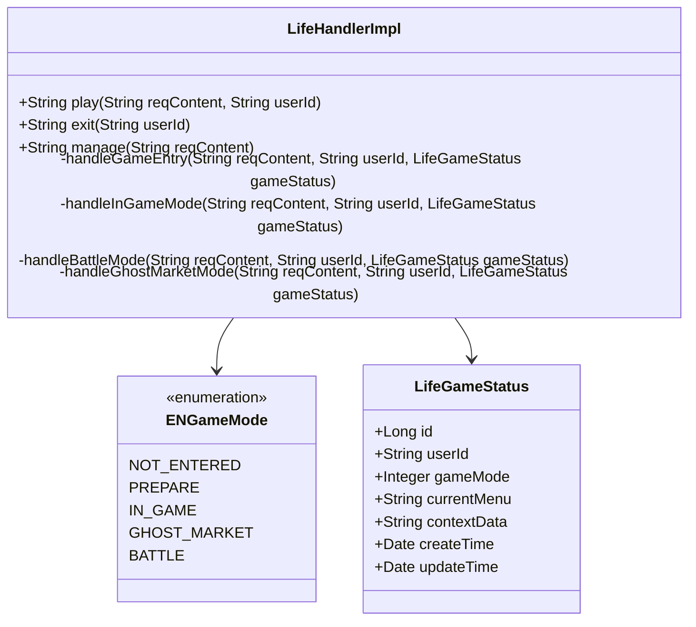
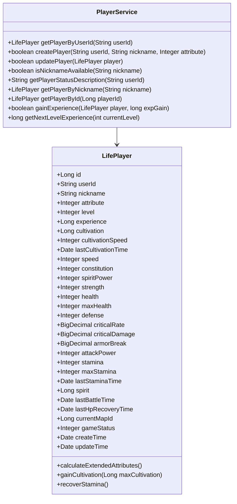
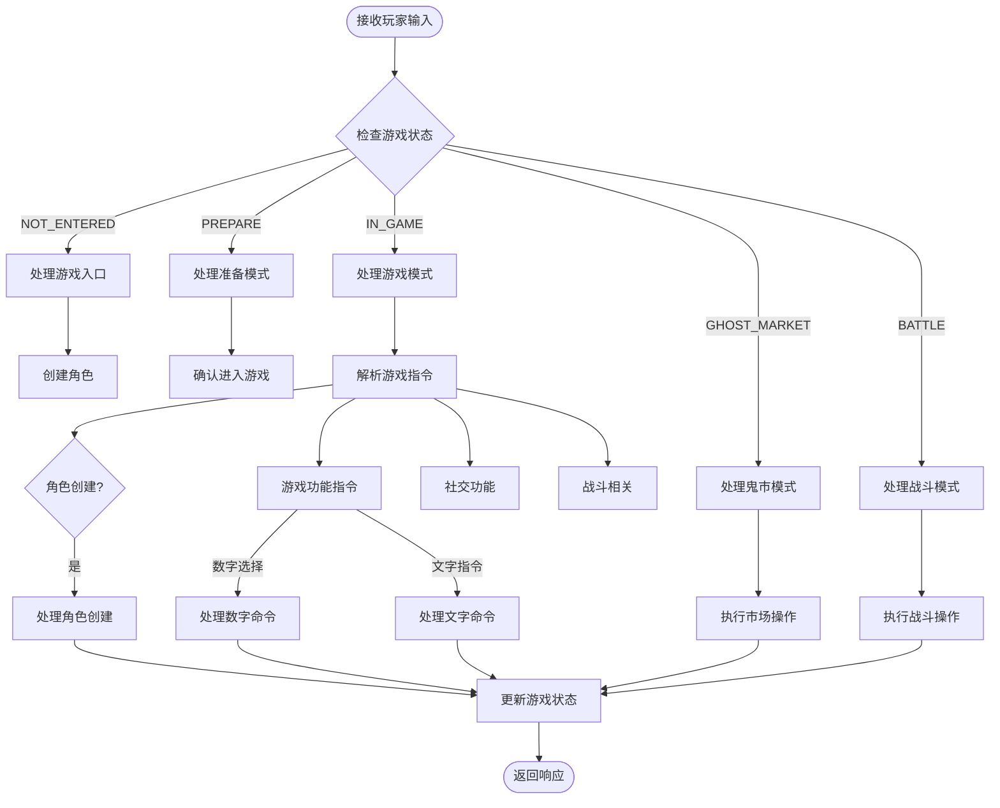
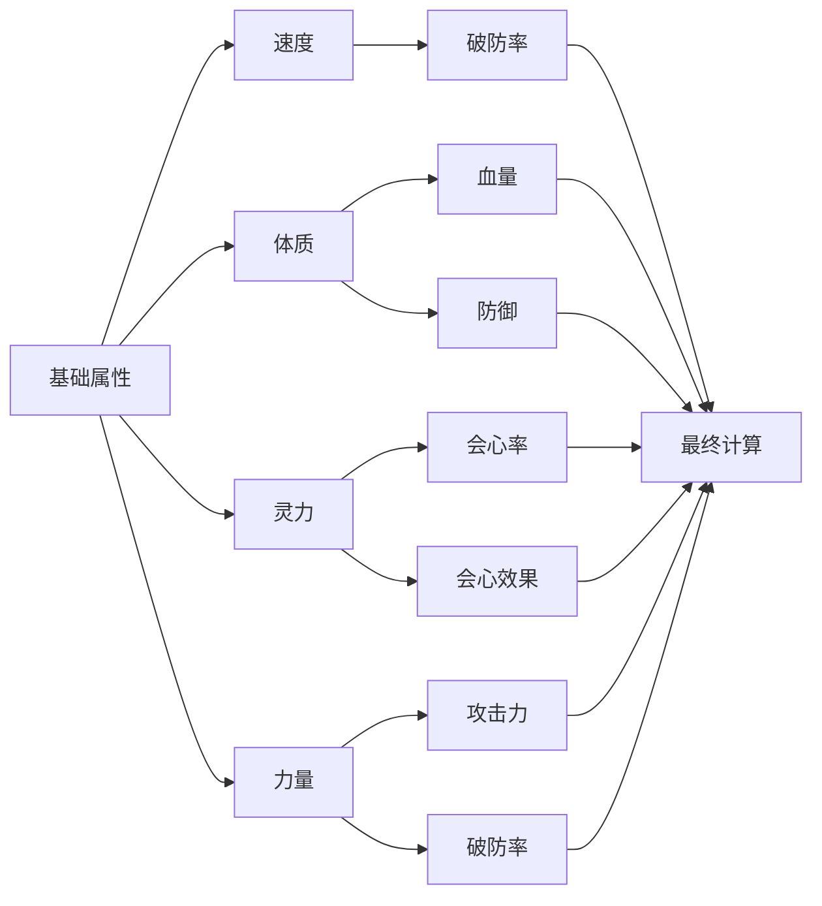
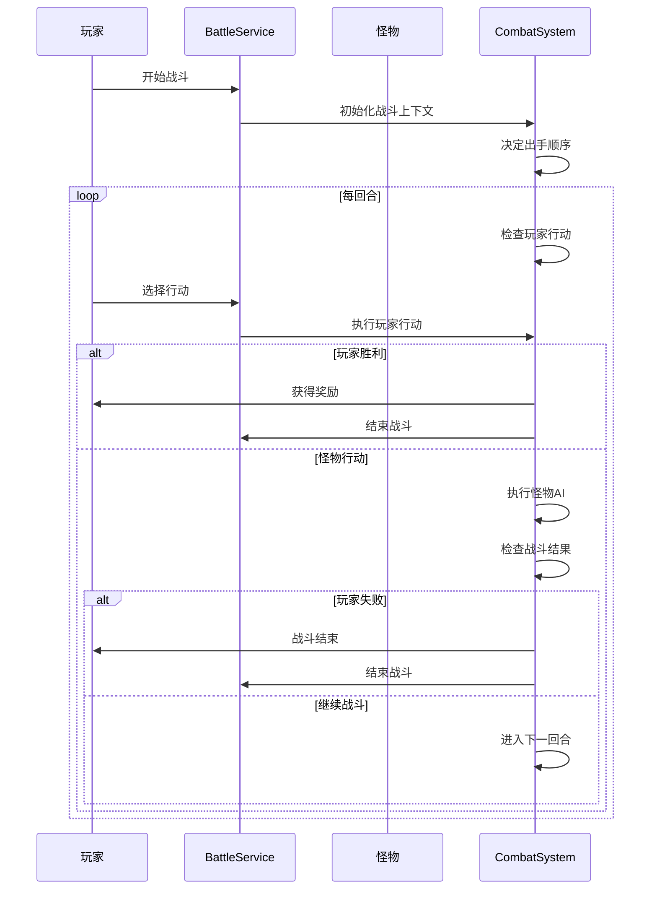
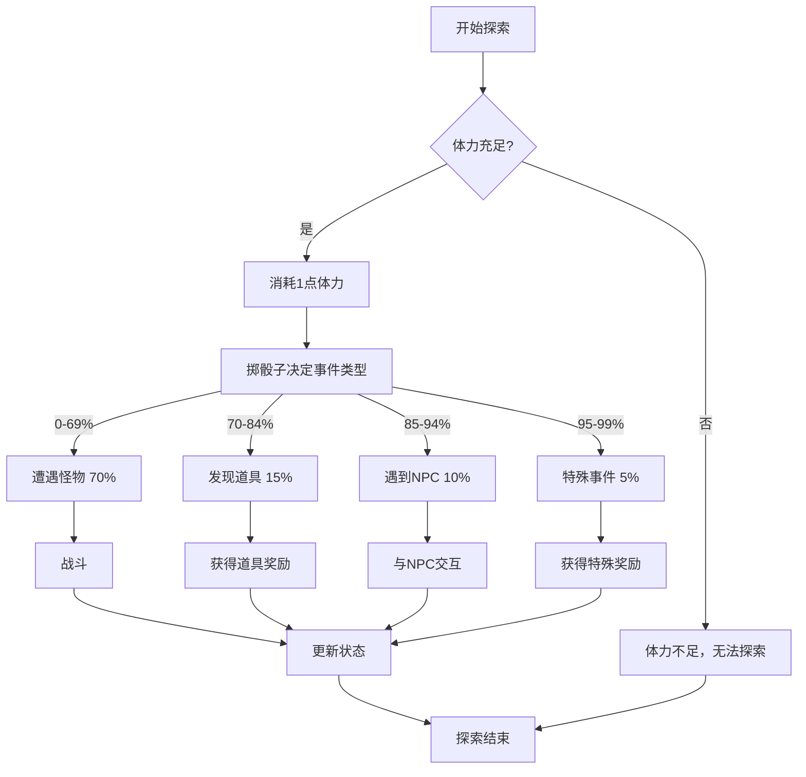
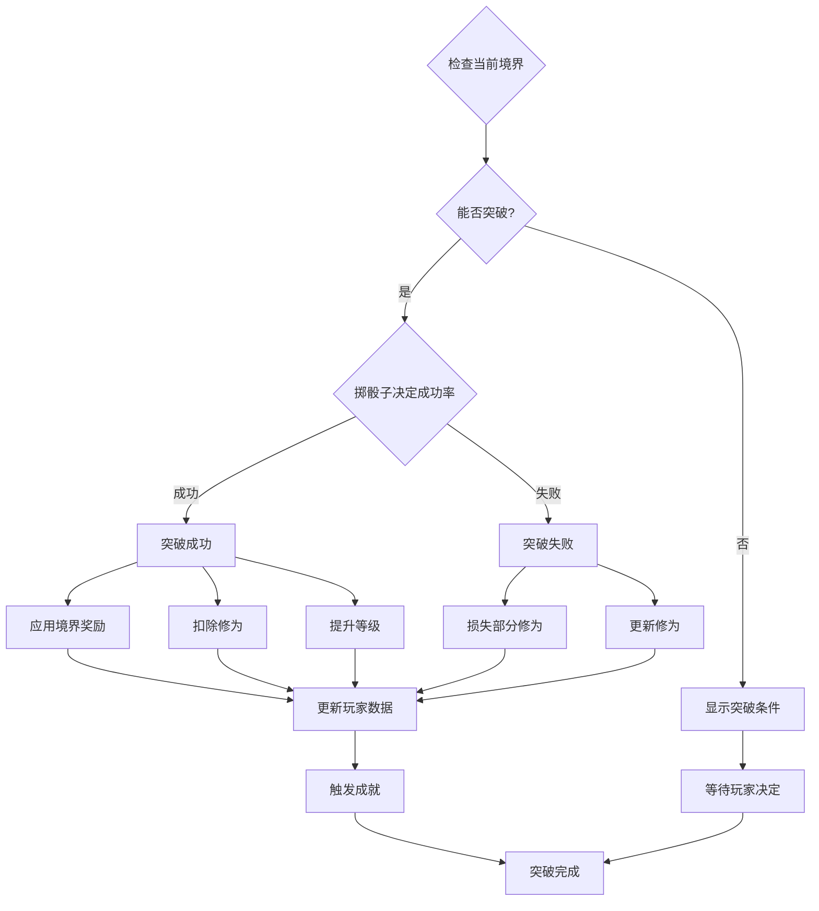
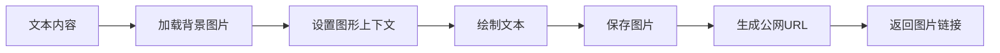

# Life模块

<cite>
**本文档引用的文件**
- [LifeHandlerImpl.java](file://Life/src/main/java/com/bot/life/service/impl/LifeHandlerImpl.java)
- [PlayerService.java](file://Life/src/main/java/com/bot/life/service/PlayerService.java)
- [PlayerServiceImpl.java](file://Life/src/main/java/com/bot/life/service/impl/PlayerServiceImpl.java)
- [LifePlayerMapper.java](file://Life/src/main/java/com/bot/life/dao/mapper/LifePlayerMapper.java)
- [LifePlayer.java](file://Life/src/main/java/com/bot/life/dao/entity/LifePlayer.java)
- [Life_Database_Init.sql](file://Life_Database_Init.sql)
- [Life_User_Manual.md](file://Life_User_Manual.md)
- [Life_Realm_System_Analysis.md](file://Life_Realm_System_Analysis.md)
- [BattleServiceImpl.java](file://Life/src/main/java/com/bot/life/service/impl/BattleServiceImpl.java)
- [MapServiceImpl.java](file://Life/src/main/java/com/bot/life/service/impl/MapServiceImpl.java)
- [ExplorationServiceImpl.java](file://Life/src/main/java/com/bot/life/service/impl/ExplorationServiceImpl.java)
- [InventoryServiceImpl.java](file://Life/src/main/java/com/bot/life/service/impl/InventoryServiceImpl.java)
- [RealmServiceImpl.java](file://Life/src/main/java/com/bot/life/service/impl/RealmServiceImpl.java)
- [SkillServiceImpl.java](file://Life/src/main/java/com/bot/life/service/impl/SkillServiceImpl.java)
- [ImageGenerationServiceImpl.java](file://Life/src/main/java/com/bot/life/service/impl/ImageGenerationServiceImpl.java)
</cite>

## 目录
1. [项目概述](#项目概述)
2. [系统架构](#系统架构)
3. [核心组件分析](#核心组件分析)
4. [游戏主循环与指令解析](#游戏主循环与指令解析)
5. [玩家数据管理系统](#玩家数据管理系统)
6. [游戏数据模型设计](#游戏数据模型设计)
7. [核心玩法系统](#核心玩法系统)
8. [消息系统集成](#消息系统集成)
9. [性能优化与扩展性](#性能优化与扩展性)
10. [总结](#总结)

## 项目概述

Life模块是"浮生卷"修仙文字游戏的核心系统，基于Spring Boot框架构建，实现了完整的修仙RPG游戏机制。该模块采用模块化设计，通过依赖注入实现松耦合的组件架构，为玩家提供了沉浸式的修仙体验。

### 主要特性

- **文字驱动的游戏体验**：所有交互通过文字指令完成，界面以图片形式展示
- **完整的修仙体系**：包含境界突破、属性修炼、技能学习等传统修仙元素
- **动态战斗系统**：实时战斗计算，包含属性克制、会心效果等深度战斗机制
- **丰富的社交功能**：好友系统、邮件系统、世界BOSS等多人互动玩法
- **自动化的资源管理**：修为自动增长、体力自动恢复等自动化机制

## 系统架构

Life模块采用分层架构设计，主要包含以下几个层次：



**图表来源**
- [LifeHandlerImpl.java](file://Life/src/main/java/com/bot/life/service/impl/LifeHandlerImpl.java#L54-L127)
- [PlayerServiceImpl.java](file://Life/src/main/java/com/bot/life/service/impl/PlayerServiceImpl.java#L22-L35)

**章节来源**
- [LifeHandlerImpl.java](file://Life/src/main/java/com/bot/life/service/impl/LifeHandlerImpl.java#L54-L127)
- [PlayerServiceImpl.java](file://Life/src/main/java/com/bot/life/service/impl/PlayerServiceImpl.java#L22-L35)

## 核心组件分析

### LifeHandlerImpl - 游戏处理器

LifeHandlerImpl是整个游戏系统的核心控制器，负责处理玩家的所有游戏请求和状态管理。

#### 核心功能架构



**图表来源**
- [LifeHandlerImpl.java](file://Life/src/main/java/com/bot/life/service/impl/LifeHandlerImpl.java#L128-L166)
- [LifeHandlerImpl.java](file://Life/src/main/java/com/bot/life/service/impl/LifeHandlerImpl.java#L174-L219)

#### 游戏状态管理

系统维护四种主要游戏状态：
- **NOT_ENTERED**：未进入游戏状态
- **PREPARE**：准备状态，等待玩家确认进入
- **IN_GAME**：正常游戏状态
- **GHOST_MARKET**：鬼市交易状态
- **BATTLE**：战斗状态

**章节来源**
- [LifeHandlerImpl.java](file://Life/src/main/java/com/bot/life/service/impl/LifeHandlerImpl.java#L128-L166)
- [LifeHandlerImpl.java](file://Life/src/main/java/com/bot/life/service/impl/LifeHandlerImpl.java#L174-L219)

### PlayerService - 玩家服务

PlayerService负责玩家数据的完整生命周期管理，包括角色创建、属性计算、经验管理等核心功能。

#### 玩家数据模型



**图表来源**
- [PlayerService.java](file://Life/src/main/java/com/bot/life/service/PlayerService.java#L9-L77)
- [PlayerServiceImpl.java](file://Life/src/main/java/com/bot/life/service/impl/PlayerServiceImpl.java#L42-L98)

**章节来源**
- [PlayerService.java](file://Life/src/main/java/com/bot/life/service/PlayerService.java#L9-L77)
- [PlayerServiceImpl.java](file://Life/src/main/java/com/bot/life/service/impl/PlayerServiceImpl.java#L42-L98)

## 游戏主循环与指令解析

### 主循环机制

游戏主循环通过LifeHandlerImpl的play方法实现，采用状态机模式处理不同游戏阶段的指令：



**图表来源**
- [LifeHandlerImpl.java](file://Life/src/main/java/com/bot/life/service/impl/LifeHandlerImpl.java#L148-L166)
- [LifeHandlerImpl.java](file://Life/src/main/java/com/bot/life/service/impl/LifeHandlerImpl.java#L221-L315)

### 指令解析策略

系统采用多层次的指令解析策略：

1. **基础指令识别**：识别退出、确认等通用指令
2. **功能分类处理**：按角色创建、战斗、社交等功能分类
3. **参数提取**：从复杂指令中提取具体参数
4. **权限验证**：检查玩家是否具备执行权限
5. **业务逻辑调用**：调用相应的服务处理业务

**章节来源**
- [LifeHandlerImpl.java](file://Life/src/main/java/com/bot/life/service/impl/LifeHandlerImpl.java#L221-L315)
- [LifeHandlerImpl.java](file://Life/src/main/java/com/bot/life/service/impl/LifeHandlerImpl.java#L316-L472)

## 玩家数据管理系统

### 数据管理策略

PlayerService采用多种策略管理玩家数据：

#### 1. 数据初始化策略
角色创建时自动初始化所有基础属性和扩展属性，确保数据完整性。

#### 2. 自动更新机制
- **修为自动增长**：离线期间持续增加修为
- **体力自动恢复**：每5分钟恢复1点体力
- **血量自动恢复**：战斗后自动恢复血量

#### 3. 属性计算引擎
系统提供复杂的属性计算引擎，根据基础属性动态计算战斗属性：



**图表来源**
- [PlayerServiceImpl.java](file://Life/src/main/java/com/bot/life/service/impl/PlayerServiceImpl.java#L93-L95)
- [PlayerServiceImpl.java](file://Life/src/main/java/com/bot/life/service/impl/PlayerServiceImpl.java#L187-L228)

**章节来源**
- [PlayerServiceImpl.java](file://Life/src/main/java/com/bot/life/service/impl/PlayerServiceImpl.java#L42-L98)
- [PlayerServiceImpl.java](file://Life/src/main/java/com/bot/life/service/impl/PlayerServiceImpl.java#L187-L228)

### 数据一致性保证

系统通过以下机制保证数据一致性：

1. **事务管理**：关键操作使用数据库事务
2. **并发控制**：使用乐观锁防止并发冲突
3. **缓存同步**：及时更新内存缓存
4. **数据验证**：严格的输入验证和边界检查

## 游戏数据模型设计

### 数据库架构概览

Life模块采用关系型数据库设计，包含30+张表，涵盖游戏的各个方面：

```mermaid
erDiagram
LIFE_PLAYER {
bigint id PK
varchar user_id UK
varchar nickname UK
tinyint attribute
int level
bigint experience
bigint cultivation
int cultivation_speed
datetime last_cultivation_time
int speed
int constitution
int spirit_power
int strength
int health
int max_health
int defense
decimal critical_rate
decimal critical_damage
decimal armor_break
int attack_power
int stamina
int max_stamina
datetime last_stamina_time
bigint spirit
datetime last_battle_time
datetime last_hp_recovery_time
bigint current_map_id
int game_status
datetime create_time
datetime update_time
}
LIFE_MAP {
bigint id PK
varchar name
tinyint type
int min_level
text description
datetime create_time
}
LIFE_MONSTER {
bigint id PK
varchar name
bigint map_id FK
tinyint monster_type
tinyint attribute
int level
int health
int attack_power
int defense
int speed
decimal critical_rate
decimal critical_damage
decimal armor_break
datetime create_time
}
LIFE_ITEM {
bigint id PK
varchar name
tinyint type
int effect_value
varchar effect_attribute
bigint skill_id FK
int max_use_count
tinyint can_use_in_battle
text description
datetime create_time
}
LIFE_PLAYER_ITEM {
bigint id PK
bigint player_id FK
bigint item_id FK
int quantity
int used_count
datetime create_time
datetime update_time
}
LIFE_SKILL {
bigint id PK
varchar name
tinyint type
tinyint attribute
int power
int cooldown
int required_level
int required_cultivation
int max_level
text description
}
LIFE_PLAYER_SKILL {
bigint id PK
bigint player_id FK
bigint skill_id FK
int skill_level
int current_cooldown
datetime last_used_time
datetime learn_time
}
LIFE_REALM_CONFIG {
bigint id PK
varchar realm_name
int min_level
int max_level
bigint required_cultivation
bigint max_cultivation
decimal success_rate
json attribute_bonus
text special_abilities
datetime create_time
}
LIFE_ACHIEVEMENT {
bigint id PK
varchar name
text description
tinyint condition_type
varchar condition_target
bigint condition_value
datetime create_time
}
LIFE_PLAYER_ACHIEVEMENT {
bigint id PK
bigint player_id FK
bigint achievement_id FK
datetime completed_time
}
LIFE_FRIEND {
bigint id PK
bigint player_id FK
bigint friend_id FK
tinyint status
datetime create_time
datetime update_time
}
LIFE_MAIL {
bigint id PK
bigint from_player_id FK
bigint to_player_id FK
varchar subject
text content
tinyint attachment_type
bigint attachment_id
int attachment_quantity
tinyint is_read
tinyint is_received
datetime create_time
}
LIFE_WORLD_BOSS {
bigint id PK
bigint monster_id FK
bigint map_id FK
time start_time
time end_time
int max_challenge_count
tinyint is_active
}
LIFE_SHOP {
bigint id PK
tinyint item_type
bigint item_id FK
int base_price
int current_price
decimal discount
tinyint in_stock
date last_refresh_date
datetime create_time
datetime update_time
}
LIFE_TEAM {
bigint id PK
bigint leader_id FK
bigint map_id FK
tinyint status
datetime create_time
datetime update_time
}
LIFE_TEAM_MEMBER {
bigint id PK
bigint team_id FK
bigint player_id FK
tinyint member_status
datetime join_time
}
LIFE_DUNGEON {
bigint id PK
varchar name
bigint map_id FK
bigint boss_id FK
int daily_limit
int min_level
}
LIFE_GAME_STATUS {
bigint id PK
varchar user_id UK
tinyint game_mode
varchar current_menu
text context_data
datetime create_time
datetime update_time
}
LIFE_PLAYER --> LIFE_PLAYER_ITEM : owns
LIFE_PLAYER --> LIFE_PLAYER_SKILL : knows
LIFE_PLAYER --> LIFE_FRIEND : has_friends
LIFE_PLAYER --> LIFE_MAIL : sends
LIFE_PLAYER --> LIFE_MAIL : receives
LIFE_PLAYER --> LIFE_TEAM_MEMBER : joins
LIFE_MAP --> LIFE_MONSTER : contains
LIFE_ITEM --> LIFE_PLAYER_ITEM : consumed_by
LIFE_SKILL --> LIFE_PLAYER_SKILL : learned_as
LIFE_MONSTER --> LIFE_PLAYER_ITEM : drops
LIFE_WORLD_BOSS --> LIFE_PLAYER_ITEM : rewards
LIFE_SHOP --> LIFE_ITEM : sells
LIFE_TEAM --> LIFE_TEAM_MEMBER : has_members
LIFE_DUNGEON --> LIFE_MONSTER : contains
```

**图表来源**
- [Life_Database_Init.sql](file://Life_Database_Init.sql#L6-L499)

### 设计理念

#### 1. 关联性设计
- **玩家相关**：玩家拥有的物品、技能、好友关系等
- **地图相关**：地图上的怪物、NPC、事件等
- **战斗相关**：战斗状态、技能效果、掉落物品等

#### 2. 扩展性考虑
- **JSON字段**：使用JSON存储可变配置，如境界奖励属性
- **枚举类型**：使用tinyint存储状态码，便于扩展
- **软删除**：通过状态字段实现逻辑删除

#### 3. 性能优化
- **索引设计**：为常用查询字段建立索引
- **分表策略**：大数据量表采用分表或分区
- **缓存机制**：关键配置数据缓存到内存

**章节来源**
- [Life_Database_Init.sql](file://Life_Database_Init.sql#L6-L499)

## 核心玩法系统

### 战斗系统

战斗系统是游戏的核心玩法之一，实现了完整的回合制战斗机制：

#### 战斗流程



**图表来源**
- [BattleServiceImpl.java](file://Life/src/main/java/com/bot/life/service/impl/BattleServiceImpl.java#L38-L117)

#### 战斗机制

1. **伤害计算**：基于攻击力、防御力、破防率等计算
2. **属性克制**：五行相克影响最终伤害
3. **会心系统**：暴击概率和效果计算
4. **逃跑机制**：基于速度差的概率逃跑

**章节来源**
- [BattleServiceImpl.java](file://Life/src/main/java/com/bot/life/service/impl/BattleServiceImpl.java#L38-L117)

### 地图探索系统

探索系统提供了随机事件和怪物遭遇的机制：

#### 探索事件概率



**图表来源**
- [ExplorationServiceImpl.java](file://Life/src/main/java/com/bot/life/service/impl/ExplorationServiceImpl.java#L35-L60)

**章节来源**
- [ExplorationServiceImpl.java](file://Life/src/main/java/com/bot/life/service/impl/ExplorationServiceImpl.java#L35-L60)

### 背包管理系统

背包系统管理玩家的所有物品和道具：

#### 道具分类

| 类型 | 描述 | 示例 |
|------|------|------|
| 修为类 | 直接增加修为 | 小修为丹、中修为丹、大修为丹 |
| 属性类 | 永久增加属性 | 大力丸、迅捷散、固本培元丹 |
| 体力类 | 恢复体力 | 大还丹、灵器合意散 |
| 恢复类 | 战斗中使用 | 回春丹、大回春丹 |
| 技能书 | 学习新技能 | 金元斩秘籍、木灵术秘籍 |

**章节来源**
- [InventoryServiceImpl.java](file://Life/src/main/java/com/bot/life/service/impl/InventoryServiceImpl.java#L135-L200)

### 境界突破系统

境界突破是修仙游戏的核心机制：

#### 突破流程



**图表来源**
- [RealmServiceImpl.java](file://Life/src/main/java/com/bot/life/service/impl/RealmServiceImpl.java#L42-L121)

**章节来源**
- [RealmServiceImpl.java](file://Life/src/main/java/com/bot/life/service/impl/RealmServiceImpl.java#L42-L121)

### 技能学习系统

技能系统提供了丰富的战斗技能和辅助技能：

#### 技能类型

| 类型 | 描述 | 示例 |
|------|------|------|
| 直接伤害 | 对敌人造成直接伤害 | 金元斩、木灵术、烈焰掌 |
| 增益技能 | 提升自身属性 | 金刚护体、生命回春、炎之狂怒 |
| 减益技能 | 降低敌人属性 | 寒冰护盾、大地之力 |

**章节来源**
- [SkillServiceImpl.java](file://Life/src/main/java/com/bot/life/service/impl/SkillServiceImpl.java#L31-L63)

## 消息系统集成

### 图片生成系统

系统通过ImageGenerationService将文本内容转换为精美的图片：

#### 图片生成流程



**图表来源**
- [ImageGenerationServiceImpl.java](file://Life/src/main/java/com/bot/life/service/impl/ImageGenerationServiceImpl.java#L44-L75)

#### 文本渲染特性

1. **字体支持**：使用Microsoft YaHei字体确保中文显示效果
2. **颜色主题**：深蓝色文字搭配浅色背景
3. **布局优化**：合理的行距和边距设计
4. **渐变背景**：使用渐变色提升视觉效果

**章节来源**
- [ImageGenerationServiceImpl.java](file://Life/src/main/java/com/bot/life/service/impl/ImageGenerationServiceImpl.java#L44-L75)

### 沉浸式交互体验

系统通过以下方式提供沉浸式体验：

1. **图片界面**：所有游戏界面以精美图片形式展示
2. **即时反馈**：玩家操作立即得到视觉反馈
3. **状态提示**：清晰的状态信息和进度条
4. **音效配合**：虽然文字游戏，但通过文字描述营造氛围

## 性能优化与扩展性

### 性能优化策略

#### 1. 数据库优化
- **连接池**：使用数据库连接池提高并发性能
- **索引优化**：为常用查询字段建立复合索引
- **查询优化**：避免N+1查询问题

#### 2. 内存优化
- **缓存策略**：缓存常用配置和玩家数据
- **对象池**：重用战斗相关的对象
- **垃圾回收**：及时释放不需要的对象

#### 3. 异步处理
- **定时任务**：修为增长、体力恢复等使用定时任务
- **异步通知**：成就触发、奖励发放等异步处理

### 扩展性设计

#### 1. 模块化架构
- **服务分离**：每个核心功能独立为服务
- **接口抽象**：使用接口定义服务契约
- **依赖注入**：通过Spring容器管理依赖关系

#### 2. 配置化管理
- **系统配置**：通过配置表管理游戏参数
- **动态调整**：无需重启即可调整游戏平衡
- **多环境支持**：支持开发、测试、生产环境

#### 3. 插件化扩展
- **事件系统**：支持自定义事件处理器
- **技能扩展**：易于添加新的技能类型
- **地图扩展**：支持添加新的地图和场景

## 总结

Life模块作为"浮生卷"修仙文字游戏的核心系统，展现了优秀的软件架构设计和游戏机制实现。通过模块化的设计、完善的业务逻辑和丰富的游戏玩法，为玩家提供了完整的修仙体验。

### 技术亮点

1. **完整的架构设计**：从表现层到数据持久层的完整分层架构
2. **灵活的数据模型**：关系型数据库设计支持复杂的修仙系统
3. **深度的游戏机制**：战斗、探索、修炼等传统修仙元素的完美融合
4. **优秀的用户体验**：图片界面和即时反馈提供沉浸式体验

### 扩展价值

该模块不仅是一个成功的游戏系统实现，也为其他文字游戏的开发提供了宝贵的参考。其模块化的设计思路、完善的扩展机制和优秀的性能表现，使其成为文字游戏开发的优秀范例。

通过深入分析Life模块的实现，我们可以看到一个成功的文字游戏系统需要在技术实现和游戏设计之间找到完美的平衡，既要保证系统的稳定性和可扩展性，又要提供丰富有趣的游戏体验。