# 境界突破系统

<cite>
**本文档引用文件**  
- [RealmService.java](file://Life\src\main\java\com\bot\life\service\RealmService.java)
- [RealmServiceImpl.java](file://Life\src\main\java\com\bot\life\service\impl\RealmServiceImpl.java)
- [LifeRealmConfig.java](file://Life\src\main\java\com\bot\life\dao\entity\LifeRealmConfig.java)
- [LifeRealmConfigMapper.xml](file://Life\src\main\resources\mapper\LifeRealmConfigMapper.xml)
- [LifePlayer.java](file://Life\src\main\java\com\bot\life\dao\entity\LifePlayer.java)
- [PlayerService.java](file://Life\src\main\java\com\bot\life\service\PlayerService.java)
- [LifeHandlerImpl.java](file://Life\src\main\java\com\bot\life\service\impl\LifeHandlerImpl.java)
- [Life_Realm_System_Analysis.md](file://Life_Realm_System_Analysis.md)
- [Life_Realm_Breakthrough_System.md](file://Life_Realm_Breakthrough_System.md)
</cite>

## 目录
1. [引言](#引言)
2. [境界等级划分与突破条件](#境界等级划分与突破条件)
3. [突破成功率计算与资源消耗](#突破成功率计算与资源消耗)
4. [突破奖励与属性加成](#突破奖励与属性加成)
5. [失败惩罚机制](#失败惩罚机制)
6. [境界系统与玩家服务的集成](#境界系统与玩家服务的集成)
7. [系统架构与数据持久化](#系统架构与数据持久化)
8. [游戏体验与长期成长感](#游戏体验与长期成长感)
9. [结论](#结论)

## 引言

境界突破系统是修仙类游戏的核心成长机制，为玩家提供了明确的进阶目标和长期的游戏动力。本系统通过精心设计的境界等级划分、突破条件、成功率计算、资源消耗和奖励机制，构建了一个富有策略深度和成长感的修仙世界。玩家通过积累修为，挑战境界突破，逐步从凡人成长为修仙大能。本系统不仅实现了复杂的业务逻辑，还通过与玩家服务的深度集成，确保了数据的一致性和状态的实时同步。

**本节来源**  
- [Life_Realm_System_Analysis.md](file://Life_Realm_System_Analysis.md)
- [Life_Realm_Breakthrough_System.md](file://Life_Realm_Breakthrough_System.md)

## 境界等级划分与突破条件

境界系统采用经典的修仙境界划分，从低到高依次为：练气期、筑基期、金丹期、元婴期、化神期和大乘期。每个境界都有明确的等级范围和突破条件，为玩家提供了清晰的成长路径。

### 境界配置

境界的配置信息存储在 `LifeRealmConfig` 实体类中，通过数据库表 `life_realm_config` 进行持久化。该配置表包含以下关键字段：

- **realmName**: 境界名称（如“练气期”）
- **minLevel** 和 **maxLevel**: 境界的最低和最高等级
- **requiredCultivation**: 突破到该境界所需的修为
- **maxCultivation**: 该境界的修为上限
- **successRate**: 突破成功率
- **attributeBonus**: 以JSON格式存储的突破奖励属性
- **specialAbilities**: 境界特殊能力描述


**图示来源**  
- [LifeRealmConfig.java](file://Life\src\main\java\com\bot\life\dao\entity\LifeRealmConfig.java)
- [LifeRealmConfigMapper.xml](file://Life\src\main\resources\mapper\LifeRealmConfigMapper.xml)

### 突破条件检查

玩家能否进行境界突破，由 `RealmService` 接口中的 `canBreakthrough` 方法决定。其核心逻辑是检查玩家当前的修为是否达到了下一境界所需的最低修为。

```mermaid
flowchart TD
A[开始] --> B{玩家存在?}
B --> |否| C[返回错误信息]
B --> |是| D[获取下一境界配置]
D --> E{存在下一境界?}
E --> |否| F[已达最高境界]
E --> |是| G{修为足够?}
G --> |否| H[返回不足信息]
G --> |是| I[可以突破]
```



**图示来源**  
- [RealmServiceImpl.java](file://Life\src\main\java\com\bot\life\service\impl\RealmServiceImpl.java#L124-L133)

**本节来源**  
- [LifeRealmConfig.java](file://Life\src\main\java\com\bot\life\dao\entity\LifeRealmConfig.java)
- [RealmServiceImpl.java](file://Life\src\main\java\com\bot\life\service\impl\RealmServiceImpl.java#L124-L133)
- [Life_Realm_System_Analysis.md](file://Life_Realm_System_Analysis.md#L80-L88)

## 突破成功率计算与资源消耗

境界突破并非必然成功，引入了成功率机制，增加了游戏的策略性和挑战性。

### 突破成功率

突破成功率由当前境界的配置决定，存储在 `LifeRealmConfig` 的 `successRate` 字段中。在 `attemptBreakthrough` 方法中，系统会生成一个随机数，并与配置的成功率进行比较，以此判定突破是否成功。

```java
// 计算突破成功率
double successRate = nextRealm.getSuccessRate().doubleValue();
boolean success = random.nextDouble() < successRate;
```

不同境界的成功率不同，境界越高，突破难度越大，成功率越低。例如，根据设计文档，练气期突破到筑基期的成功率为90%，而大乘期的成功率仅为50%。

### 修为消耗

突破需要消耗大量的修为资源。成功突破时，将消耗突破所需的全部修为；失败时，也会损失部分修为作为惩罚。

**本节来源**  
- [RealmServiceImpl.java](file://Life\src\main\java\com\bot\life\service\impl\RealmServiceImpl.java#L66-L68)
- [Life_Realm_System_Analysis.md](file://Life_Realm_System_Analysis.md#L80-L88)

## 突破奖励与属性加成

成功突破境界是玩家实力提升的关键时刻，系统会提供丰厚的奖励来激励玩家。

### 属性加成

突破奖励以JSON格式存储在 `LifeRealmConfig` 的 `attributeBonus` 字段中。`RealmServiceImpl` 的 `applyBreakthroughBonus` 方法负责解析此JSON并应用奖励。支持的属性包括：

- **speed**: 速度
- **constitution**: 体质
- **spirit_power**: 灵力
- **strength**: 力量
- **cultivation_speed**: 修炼速度


**图示来源**  
- [RealmServiceImpl.java](file://Life\src\main\java\com\bot\life\service\impl\RealmServiceImpl.java#L194-L236)
- [LifePlayer.java](file://Life\src\main\java\com\bot\life\dao\entity\LifePlayer.java)

### 新功能解锁

除了属性加成，每个境界还拥有独特的“境界特殊能力”（`specialAbilities`）。这些能力在突破成功后解锁，为玩家提供新的游戏功能或增强现有能力，例如“神识化形，修炼速度提升”。

**本节来源**  
- [RealmServiceImpl.java](file://Life\src\main\java\com\bot\life\service\impl\RealmServiceImpl.java#L194-L236)
- [Life_Realm_Breakthrough_System.md](file://Life_Realm_Breakthrough_System.md#L106-L137)

## 失败惩罚机制

为了增加突破的挑战性，系统设计了失败惩罚机制。

### 修为损失

当突破失败时，玩家将损失本次突破所需修为的20%。这一机制鼓励玩家在修为充足时再尝试突破，避免盲目挑战。

```java
// 失败时损失部分修为（20%）
long lostCultivation = nextRealm.getRequiredCultivation() / 5;
player.setCultivation(Math.max(0, player.getCultivation() - lostCultivation));
```

这种惩罚机制使得修为成为一种宝贵的、需要谨慎管理的战略资源。

**本节来源**  
- [RealmServiceImpl.java](file://Life\src\main\java\com\bot\life\service\impl\RealmServiceImpl.java#L106-L108)

## 境界系统与玩家服务的集成

境界系统与 `PlayerService` 紧密集成，实现了数据的持久化和状态同步。

### 服务依赖

`RealmServiceImpl` 通过Spring的 `@Autowired` 注解注入了 `PlayerService` 和 `LifePlayerMapper`，从而可以直接操作玩家数据。

```java
@Autowired
private PlayerService playerService;

@Autowired
private LifePlayerMapper playerMapper;
```

### 状态同步

当玩家进行任何可能影响修为的操作（如探索、战斗）时，`PlayerService` 会调用相关方法更新玩家状态。在获取玩家状态描述时，会先检查并更新修为，确保境界信息的准确性。

```java
// PlayerServiceImpl 中更新修为
long gainedCultivation = player.gainCultivation(maxCultivation);
player.recoverStamina();
updatePlayer(player);
```

**本节来源**  
- [RealmServiceImpl.java](file://Life\src\main\java\com\bot\life\service\impl\RealmServiceImpl.java#L32-L33)
- [PlayerService.java](file://Life\src\main\java\com\bot\life\service\PlayerService.java)
- [LifePlayer.java](file://Life\src\main\java\com\bot\life\dao\entity\LifePlayer.java#L98-L127)

## 系统架构与数据持久化

境界系统采用典型的分层架构，确保了代码的清晰和可维护性。

### 分层架构

- **Service层**: `RealmService` 接口定义了业务契约，`RealmServiceImpl` 实现了具体的业务逻辑。
- **DAO层**: `LifeRealmConfigMapper` 接口和 `LifeRealmConfigMapper.xml` 映射文件负责与数据库交互。
- **Entity层**: `LifeRealmConfig` 实体类映射数据库表。

### 数据持久化流程


**图示来源**  
- [RealmServiceImpl.java](file://Life\src\main\java\com\bot\life\service\impl\RealmServiceImpl.java)
- [LifeHandlerImpl.java](file://Life\src\main\java\com\bot\life\service\impl\LifeHandlerImpl.java#L844-L851)

## 游戏体验与长期成长感

境界系统极大地增强了游戏的长期成长感和策略深度。

### 明确的进阶目标

清晰的境界划分和可视化的修为进度条（如 `[██████████████░░░░░░]`）为玩家提供了明确的目标和即时的反馈，让玩家能够直观地感受到自己的成长。

### 策略深度

玩家需要在“积累更多修为以提高成功率”和“尽快突破以获得新能力”之间做出权衡。失败惩罚机制使得每一次突破都成为一次有意义的决策，而非简单的数值堆砌。

### 成就感

突破成功时的华丽提示（如“✨ 突破成功！✨”）和丰厚的属性奖励，为玩家带来了强烈的成就感，是驱动玩家持续游戏的核心动力。

**本节来源**  
- [Life_Realm_Breakthrough_System.md](file://Life_Realm_Breakthrough_System.md#L164-L183)

## 结论

境界突破系统是一个设计精良、实现完整的成长机制。它通过可配置的境界数据、动态的成功率计算、丰厚的奖励和适度的惩罚，构建了一个充满挑战和乐趣的修仙世界。系统与 `PlayerService` 的深度集成确保了数据的一致性和状态的实时性。该系统不仅实现了核心功能，还通过清晰的分层架构和良好的代码设计，保证了系统的可维护性和扩展性，为玩家提供了持久的游戏动力和强烈的成就感。