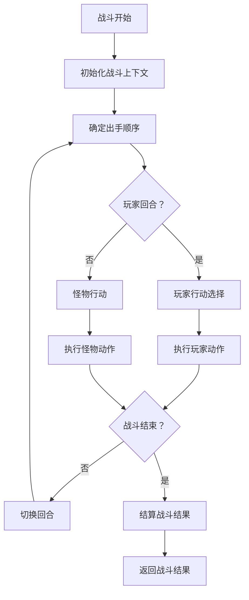
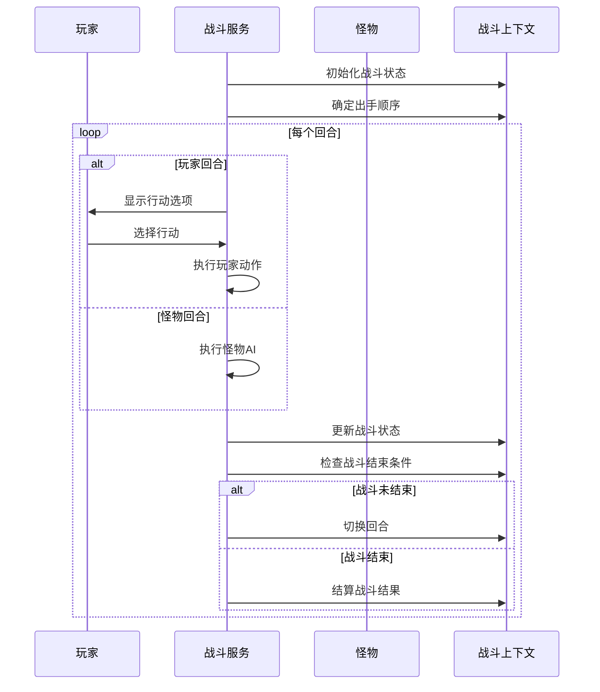
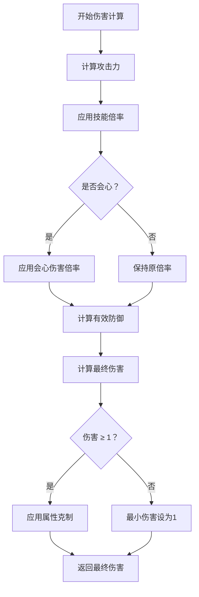
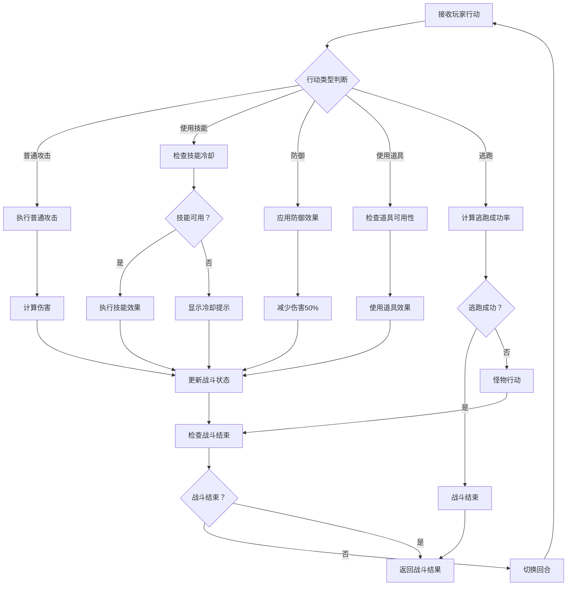
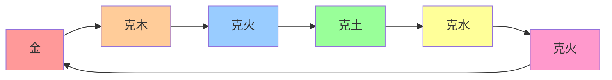
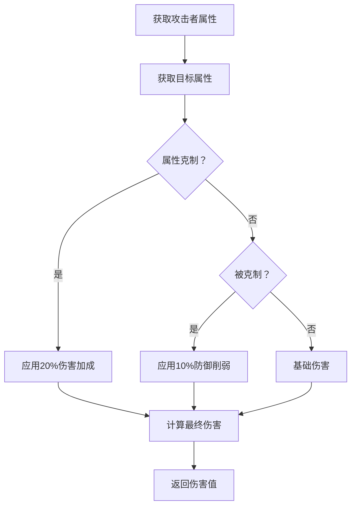
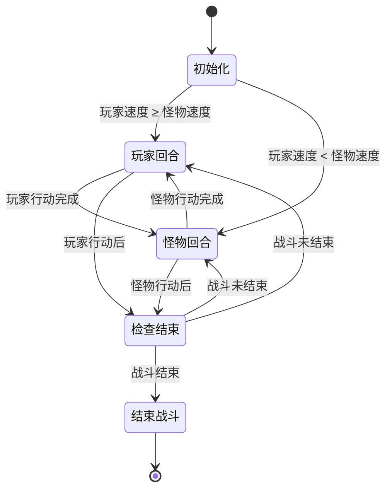
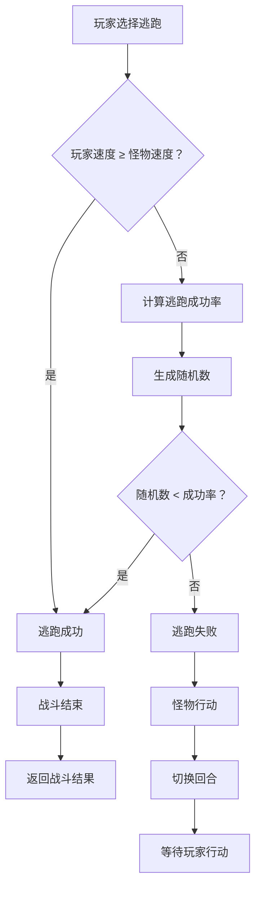
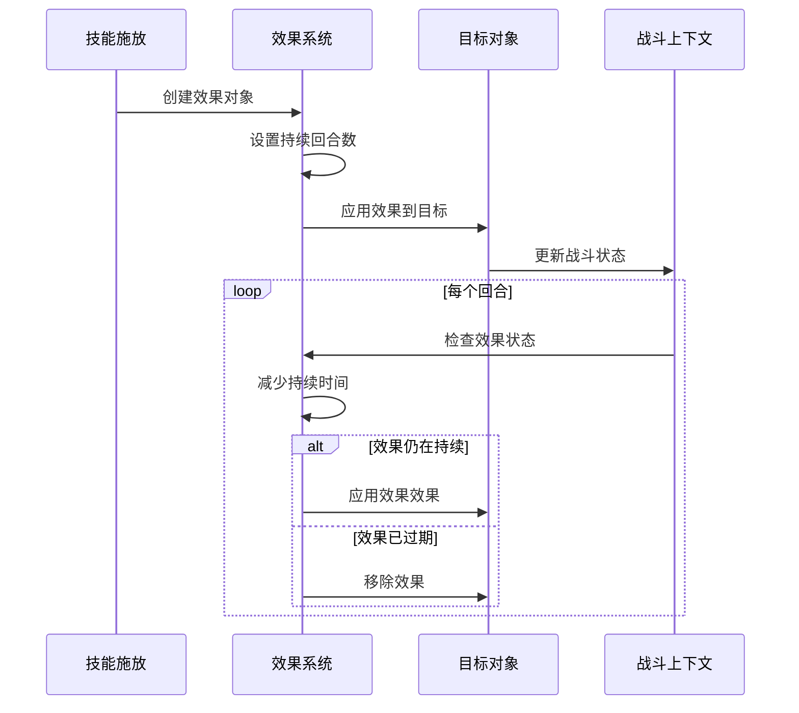

# 战斗系统

<cite>
**本文档引用的文件**
- [BattleServiceImpl.java](file://Game/src/main/java/com/bot/game/service/impl/BattleServiceImpl.java)
- [BattleServiceImpl.java](file://Life/src/main/java/com/bot/life/service/impl/BattleServiceImpl.java)
- [BattleContext.java](file://Life/src/main/java/com/bot/life/dto/BattleContext.java)
- [BattleResult.java](file://Life/src/main/java/com/bot/life/dto/BattleResult.java)
- [BattleEffect.java](file://Life/src/main/java/com/bot/life/dto/BattleEffect.java)
- [ENBattleAction.java](file://Life/src/main/java/com/bot/life/enums/ENBattleAction.java)
- [ENAttribute.java](file://Game/src/main/java/com/bot/game/enums/ENAttribute.java)
- [ENAttribute.java](file://Life/src/main/java/com/bot/life/enums/ENAttribute.java)
- [ENSkillEffect.java](file://Game/src/main/java/com/bot/game/enums/ENSkillEffect.java)
- [GameConsts.java](file://Common/src/main/java/com/bot/common/constant/GameConsts.java)
</cite>

## 目录
1. [系统概述](#系统概述)
2. [战斗流程架构](#战斗流程架构)
3. [核心战斗机制](#核心战斗机制)
4. [伤害计算系统](#伤害计算系统)
5. [行动选择与执行](#行动选择与执行)
6. [属性系统与克制关系](#属性系统与克制关系)
7. [战斗状态管理](#战斗状态管理)
8. [逃跑机制](#逃跑机制)
9. [战斗效果系统](#战斗效果系统)
10. [性能优化与资源消耗](#性能优化与资源消耗)

## 系统概述

战斗系统采用回合制战斗机制，支持多种战斗场景，包括普通战斗、副本战斗和世界BOSS战斗。系统分为两个主要模块：

- **Game模块战斗系统**：专注于幻灵战斗和传统回合制战斗
- **Life模块战斗系统**：提供更现代化的战斗体验，包含更多战斗选项

### 主要特性

- **回合制战斗**：基于速度决定出手顺序
- **多样化行动**：普通攻击、技能使用、防御、道具使用、逃跑
- **属性克制**：五行相克系统，影响伤害计算
- **实时效果**：支持增益/减益效果的叠加和持续
- **随机性设计**：会心一击、技能概率效果等随机元素

## 战斗流程架构



**图表来源**
- [BattleServiceImpl.java](file://Game/src/main/java/com/bot/game/service/impl/BattleServiceImpl.java#L88-L122)
- [BattleServiceImpl.java](file://Life/src/main/java/com/bot/life/service/impl/BattleServiceImpl.java#L39-L54)

**章节来源**
- [BattleServiceImpl.java](file://Game/src/main/java/com/bot/game/service/impl/BattleServiceImpl.java#L88-L122)
- [BattleServiceImpl.java](file://Life/src/main/java/com/bot/life/service/impl/BattleServiceImpl.java#L39-L54)

## 核心战斗机制

### 战斗初始化

战斗系统在启动时会进行以下初始化操作：

1. **战斗上下文创建**：构建BattleContext对象，包含玩家、怪物、战斗状态等信息
2. **速度比较**：根据玩家和怪物的速度决定谁先出手
3. **战斗记录初始化**：创建战斗日志StringBuilder用于记录战斗过程

### 回合控制机制



**图表来源**
- [BattleServiceImpl.java](file://Life/src/main/java/com/bot/life/service/impl/BattleServiceImpl.java#L56-L96)
- [BattleServiceImpl.java](file://Game/src/main/java/com/bot/game/service/impl/BattleServiceImpl.java#L189-L208)

**章节来源**
- [BattleServiceImpl.java](file://Life/src/main/java/com/bot/life/service/impl/BattleServiceImpl.java#L39-L96)
- [BattleServiceImpl.java](file://Game/src/main/java/com/bot/game/service/impl/BattleServiceImpl.java#L189-L208)

## 伤害计算系统

### 基础伤害公式

战斗系统采用以下伤害计算公式：

```
最终伤害 = 攻击力 × 倍率 - 防御 × (1 - 破防率)
```

### 伤害计算流程



**图表来源**
- [BattleServiceImpl.java](file://Life/src/main/java/com/bot/life/service/impl/BattleServiceImpl.java#L149-L162)

### 会心伤害机制

会心伤害通过以下公式计算：

```
会心伤害 = 基础伤害 × (会心效果 / 100)
```

其中会心效果默认为110%，可通过灵力属性提升。

### 破防系统

破防率限制在最高30%，计算公式：

```
有效防御 = 防御 × (1 - min(30%, 破防率))
```

**章节来源**
- [BattleServiceImpl.java](file://Life/src/main/java/com/bot/life/service/impl/BattleServiceImpl.java#L149-L162)

## 行动选择与执行

### 可用行动类型

战斗系统支持以下五种基本行动：

| 行动类型 | 代码 | 描述 | 实现状态 |
|---------|------|------|----------|
| 普通攻击 | NORMAL_ATTACK | 进行基础物理攻击 | 已实现 |
| 使用技能 | USE_SKILL | 使用角色技能 | 待实现 |
| 防御 | DEFEND | 提高防御力，减少伤害 | 已实现 |
| 使用道具 | USE_ITEM | 使用战斗道具 | 待实现 |
| 逃跑 | ESCAPE | 尝试逃离战斗 | 已实现 |

### 行动执行流程



**图表来源**
- [BattleServiceImpl.java](file://Life/src/main/java/com/bot/life/service/impl/BattleServiceImpl.java#L57-L85)
- [ENBattleAction.java](file://Life/src/main/java/com/bot/life/enums/ENBattleAction.java#L8-L12)

**章节来源**
- [BattleServiceImpl.java](file://Life/src/main/java/com/bot/life/service/impl/BattleServiceImpl.java#L57-L85)
- [ENBattleAction.java](file://Life/src/main/java/com/bot/life/enums/ENBattleAction.java#L8-L12)

## 属性系统与克制关系

### 五行属性体系

游戏采用传统的五行相克系统：



**图表来源**
- [ENAttribute.java](file://Game/src/main/java/com/bot/game/enums/ENAttribute.java#L13-L17)
- [ENAttribute.java](file://Life/src/main/java/com/bot/life/enums/ENAttribute.java#L8-L13)

### 属性克制效果

当攻击者属性克制目标属性时：

- **攻击伤害增加**：20%额外伤害
- **防御效果**：目标防御力降低10%

### 属性计算方法



**图表来源**
- [BattleServiceImpl.java](file://Life/src/main/java/com/bot/life/service/impl/BattleServiceImpl.java#L128-L132)

**章节来源**
- [ENAttribute.java](file://Game/src/main/java/com/bot/game/enums/ENAttribute.java#L13-L17)
- [ENAttribute.java](file://Life/src/main/java/com/bot/life/enums/ENAttribute.java#L45-L63)
- [BattleServiceImpl.java](file://Life/src/main/java/com/bot/life/service/impl/BattleServiceImpl.java#L128-L132)

## 战斗状态管理

### BattleContext数据结构

BattleContext作为战斗状态的核心容器，包含以下关键信息：

| 字段 | 类型 | 描述 |
|------|------|------|
| player | LifePlayer | 玩家对象 |
| monster | LifeMonster | 怪物对象 |
| teammates | List<LifePlayer> | 队友列表 |
| currentRound | Integer | 当前回合数 |
| battleId | String | 战斗唯一标识 |
| battleType | Integer | 战斗类型 |
| playerEffects | Map<String, BattleEffect> | 玩家效果 |
| monsterEffects | Map<String, BattleEffect> | 怪物效果 |
| isPlayerTurn | Boolean | 是否玩家回合 |
| battleEnded | Boolean | 战斗是否结束 |
| playerWin | Boolean | 玩家是否获胜 |
| battleLog | StringBuilder | 战斗日志 |

### 战斗状态流转



**图表来源**
- [BattleContext.java](file://Life/src/main/java/com/bot/life/dto/BattleContext.java#L16-L39)

### 战斗结果生成

BattleResult对象封装战斗结束后的所有信息：

| 字段 | 类型 | 描述 |
|------|------|------|
| victory | Boolean | 是否获胜 |
| escaped | Boolean | 是否逃跑 |
| damageDealt | Long | 造成的总伤害 |
| damageTaken | Long | 受到的总伤害 |
| roundsCount | Integer | 战斗回合数 |
| spiritReward | Long | 灵粹奖励 |
| cultivationReward | Long | 修为奖励 |
| itemRewards | List<ItemReward> | 道具奖励列表 |
| equipmentRewards | List<EquipmentReward> | 装备奖励列表 |
| battleLog | String | 战斗完整日志 |

**章节来源**
- [BattleContext.java](file://Life/src/main/java/com/bot/life/dto/BattleContext.java#L16-L54)
- [BattleResult.java](file://Life/src/main/java/com/bot/life/dto/BattleResult.java#L12-L40)

## 逃跑机制

### 逃跑成功率算法

逃跑成功率采用以下公式计算：

```
基础成功率 = 50%
速度差惩罚 = (怪物速度 - 玩家速度) / 10 × 2%
最终成功率 = max(10%, 基础成功率 - 速度差惩罚)
```

### 逃跑决策流程



**图表来源**
- [BattleServiceImpl.java](file://Life/src/main/java/com/bot/life/service/impl/BattleServiceImpl.java#L166-L177)

### 逃跑机制特点

- **速度优势**：当玩家速度不小于怪物时，逃跑必定成功
- **速度劣势**：速度差距越大，逃跑成功率越低
- **最低限制**：逃跑成功率不低于10%
- **即时反馈**：逃跑结果立即显示给玩家

**章节来源**
- [BattleServiceImpl.java](file://Life/src/main/java/com/bot/life/service/impl/BattleServiceImpl.java#L166-L177)

## 战斗效果系统

### 效果类型分类

战斗系统支持三种主要的效果类型：

| 效果类型 | 代码 | 描述 | 示例 |
|----------|------|------|------|
| 增益效果 | BUFF | 提升玩家属性或能力 | 攻击力提升、防御力提升 |
| 减益效果 | DEBUFF | 降低目标属性或能力 | 攻击力下降、防御力下降 |
| 持续效果 | DOT | 每回合造成固定伤害 | 中毒、灼烧效果 |

### 技能效果枚举

Game模块战斗系统定义了丰富的技能效果：

| 效果代码 | 名称 | 效果描述 | 影响类型 |
|----------|------|----------|----------|
| A01 | 双倍伤害 | 给目标造成双倍伤害 | 攻击 |
| A02 | 1.5倍伤害 | 给目标造成1.5倍伤害 | 攻击 |
| A03 | 3倍伤害 | 给目标造成3倍伤害，防御降低30% | 攻击+防御 |
| A04 | 50%三倍伤害 | 50%几率造成3倍伤害 | 攻击 |
| B01 | 5%生命转化 | 扣除自身5%生命值并造成等额伤害 | 特殊 |
| B02 | 10%生命转化 | 扣除自身10%生命值并造成等额伤害 | 特殊 |
| C01-C04 | 属性削弱 | 降低目标攻击或防御 | 减益 |
| C05 | 停止行动 | 使目标停止行动1回合 | 减益 |
| C06-C07 | 持续伤害 | 每回合自动扣除生命值 | 持续伤害 |
| C08 | 反弹伤害 | 对攻击者造成伤害反弹 | 特殊 |
| C09 | 生命恢复 | 回复生命值 | 增益 |
| C10 | 速度下降 | 降低目标速度 | 减益 |
| D01-D02 | 效果转移 | 盗取或移除效果 | 特殊 |

### 效果生命周期管理



**图表来源**
- [ENSkillEffect.java](file://Game/src/main/java/com/bot/game/enums/ENSkillEffect.java#L13-L28)
- [BattleServiceImpl.java](file://Game/src/main/java/com/bot/game/service/impl/BattleServiceImpl.java#L373-L407)

**章节来源**
- [ENSkillEffect.java](file://Game/src/main/java/com/bot/game/enums/ENSkillEffect.java#L13-L28)
- [BattleServiceImpl.java](file://Game/src/main/java/com/bot/game/service/impl/BattleServiceImpl.java#L373-L407)

## 性能优化与资源消耗

### 体力系统

战斗系统引入了体力消耗机制：

- **基础消耗**：每次战斗消耗1点体力
- **体力限制**：体力不足时无法发起战斗
- **恢复机制**：通过休息或其他方式恢复体力

### 内存优化策略

1. **对象池化**：重用BattleContext和BattleResult对象
2. **延迟加载**：按需加载战斗效果和技能数据
3. **缓存机制**：缓存常用的属性计算结果

### 并发处理

战斗系统支持多线程并发处理：

- **异步战斗**：战斗过程可在后台线程执行
- **状态同步**：确保战斗状态的一致性
- **超时保护**：防止战斗卡死或无限循环

### 性能监控指标

| 指标 | 目标值 | 监控方法 |
|------|--------|----------|
| 单次战斗耗时 | < 2秒 | 时间戳记录 |
| 内存占用 | < 50MB | JVM监控 |
| 并发战斗数 | > 100 | 线程池监控 |
| 错误率 | < 0.1% | 异常统计 |

**章节来源**
- [BattleServiceImpl.java](file://Game/src/main/java/com/bot/game/service/impl/BattleServiceImpl.java#L42-L46)

## 总结

战斗系统是一个复杂而精密的游戏机制，它融合了传统回合制战斗的策略性与现代游戏的交互性。通过合理的架构设计和丰富的功能实现，为玩家提供了深度的战斗体验。

### 核心优势

1. **灵活性**：支持多种战斗场景和战斗类型
2. **策略性**：属性克制、技能搭配等策略元素
3. **可扩展性**：模块化设计便于功能扩展
4. **稳定性**：完善的错误处理和状态管理

### 发展方向

1. **技能系统完善**：实现完整的技能使用机制
2. **道具系统扩展**：添加更多战斗道具和效果
3. **AI优化**：改进怪物AI行为模式
4. **视觉化**：添加战斗动画和特效

战斗系统作为游戏的核心机制，将继续演进以提供更好的游戏体验。