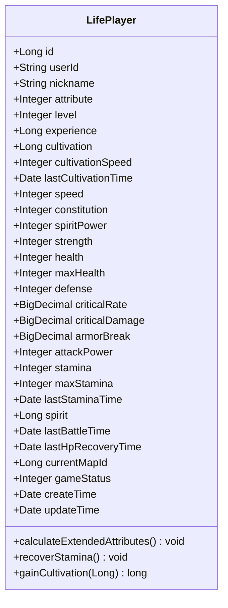
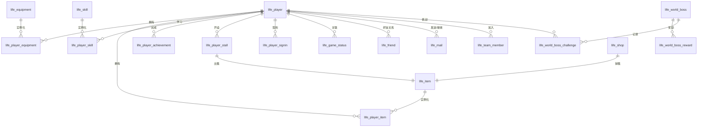
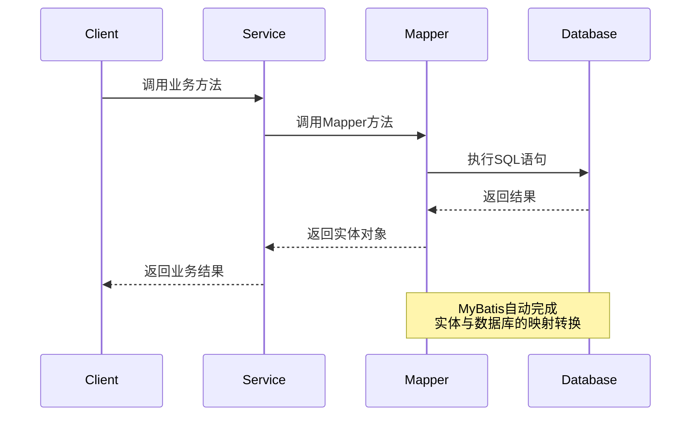
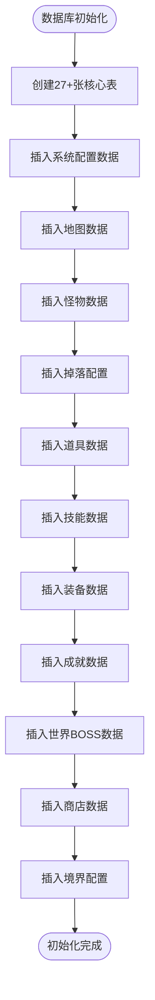
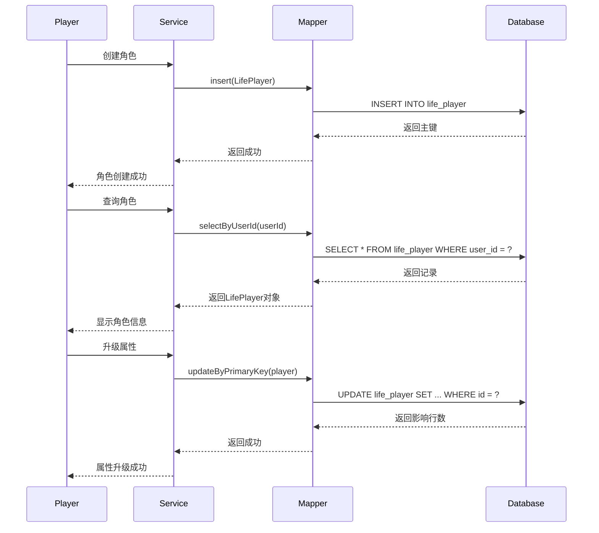

# 数据模型设计

<cite>
**本文档引用的文件**  
- [Life_Database_Init.sql](file://Life_Database_Init.sql)
- [Life_Database_Tables_Check.md](file://Life_Database_Tables_Check.md)
- [LifePlayer.java](file://Life/src/main/java/com/bot/life/dao/entity/LifePlayer.java)
- [LifePlayerMapper.java](file://Life/src/main/java/com/bot/life/dao/mapper/LifePlayerMapper.java)
- [LifePlayerMapper.xml](file://Life/src/main/resources/mapper/LifePlayerMapper.xml)
</cite>

## 目录
1. [引言](#引言)
2. [核心数据表结构](#核心数据表结构)
3. [life_player表字段设计详解](#life_player表字段设计详解)
4. [实体类与数据库映射关系](#实体类与数据库映射关系)
5. [MyBatis XML映射配置](#mybatis-xml映射配置)
6. [外键关联与数据完整性](#外键关联与数据完整性)
7. [索引优化策略](#索引优化策略)
8. [数据表初始化与版本管理](#数据表初始化与版本管理)
9. [数据访问模式与性能优化](#数据访问模式与性能优化)
10. [结论](#结论)

## 引言

"浮生卷"是一款修仙题材的文字游戏，其数据模型设计体现了典型的RPG游戏数据库架构。本系统基于MySQL数据库，采用MyBatis作为持久层框架，通过27+张核心表构建了完整的玩家角色、装备、技能、社交、经济和战斗系统。数据模型设计遵循规范化原则，同时兼顾游戏业务的特殊性，在数据完整性、查询性能和扩展性之间取得了良好平衡。

## 核心数据表结构

根据`Life_Database_Init.sql`和`Life_Database_Tables_Check.md`文件分析，系统共包含27张核心表，按功能可分为六大类：

```mermaid
graph TD
A[玩家相关] --> A1(life_player)
A --> A2(life_player_equipment)
A --> A3(life_player_item)
A --> A4(life_player_skill)
A --> A5(life_player_achievement)
A --> A6(life_player_stall)
A --> A7(life_player_signin)
A --> A8(life_game_status)
B[游戏内容] --> B1(life_equipment)
B --> B2(life_skill)
B --> B3(life_map)
B --> B4(life_monster)
B --> B5(life_item)
B --> B6(life_achievement)
B --> B7(life_realm_config)
C[社交系统] --> C1(life_friend)
C --> C2(life_mail)
C --> C3(life_team)
C --> C4(life_team_member)
D[活动挑战] --> D1(life_world_boss)
D --> D2(life_world_boss_reward)
D --> D3(life_world_boss_challenge)
D --> D4(life_dungeon)
E[经济系统] --> E1(life_shop)
F[辅助系统] --> F1(life_system_config)
F --> F2(life_battle_state)
F --> F3(life_temp_files)
```

**图表来源**  
- [Life_Database_Init.sql](file://Life_Database_Init.sql#L6-L645)
- [Life_Database_Tables_Check.md](file://Life_Database_Tables_Check.md#L7-L97)

## life_player表字段设计详解

`life_player`表是整个游戏系统的核心，存储了玩家角色的所有关键信息，其字段设计充分考虑了角色成长、战斗计算和状态管理的需求。

### 基础信息字段

| 字段名 | 类型 | 约束 | 说明 |
|--------|------|------|------|
| id | bigint | PRIMARY KEY, AUTO_INCREMENT | 主键ID |
| user_id | varchar(50) | NOT NULL, UNIQUE | 用户ID |
| nickname | varchar(21) | NOT NULL, UNIQUE | 角色昵称（中文，不超过7个字） |
| attribute | tinyint | NOT NULL | 角色属性：1金2木3水4火5土 |
| level | int | DEFAULT 1 | 等级 |
| experience | bigint | DEFAULT 0 | 经验值 |
| cultivation | bigint | DEFAULT 0 | 修为 |
| cultivation_speed | int | DEFAULT 10 | 修炼速度（修为/分钟） |
| last_cultivation_time | datetime | DEFAULT CURRENT_TIMESTAMP | 最后修炼时间 |

### 基础属性字段

| 字段名 | 类型 | 约束 | 说明 |
|--------|------|------|------|
| speed | int | DEFAULT 1 | 速度 |
| constitution | int | DEFAULT 1 | 体质 |
| spirit_power | int | DEFAULT 1 | 灵力 |
| strength | int | DEFAULT 1 | 力量 |

### 战斗属性字段

| 字段名 | 类型 | 约束 | 说明 |
|--------|------|------|------|
| health | int | DEFAULT 10 | 当前血量 |
| max_health | int | DEFAULT 10 | 最大血量 |
| defense | int | DEFAULT 1 | 防御 |
| critical_rate | decimal(5,3) | DEFAULT 0.000 | 会心率（%） |
| critical_damage | decimal(6,3) | DEFAULT 110.000 | 会心效果（%） |
| armor_break | decimal(5,3) | DEFAULT 0.000 | 破防（%） |
| attack_power | int | DEFAULT 6 | 攻击力 |

### 状态与资源字段

| 字段名 | 类型 | 约束 | 说明 |
|--------|------|------|------|
| stamina | int | DEFAULT 100 | 体力值 |
| max_stamina | int | DEFAULT 100 | 最大体力 |
| last_stamina_time | datetime | DEFAULT CURRENT_TIMESTAMP | 最后体力恢复时间 |
| spirit | bigint | DEFAULT 1000 | 灵粹（游戏货币） |
| last_battle_time | datetime | NULL | 最后战斗时间 |
| last_hp_recovery_time | datetime | DEFAULT CURRENT_TIMESTAMP | 最后血量恢复时间 |
| current_map_id | bigint | DEFAULT 1 | 当前所在地图 |
| game_status | tinyint | DEFAULT 0 | 游戏状态：0正常1战斗中2组队中 |

### 时间戳字段

| 字段名 | 类型 | 约束 | 说明 |
|--------|------|------|------|
| create_time | datetime | DEFAULT CURRENT_TIMESTAMP | 创建时间 |
| update_time | datetime | DEFAULT CURRENT_TIMESTAMP ON UPDATE CURRENT_TIMESTAMP | 更新时间 |

**图表来源**  
- [Life_Database_Init.sql](file://Life_Database_Init.sql#L6-L48)

## 实体类与数据库映射关系

系统采用MyBatis框架实现Java实体类与数据库表的映射，遵循"约定优于配置"的原则，通过Lombok注解简化代码。

### LifePlayer实体类分析

**图表来源**  
- [LifePlayer.java](file://Life/src/main/java/com/bot/life/dao/entity/LifePlayer.java#L1-L130)

### 核心实体类关系

**图表来源**  
- [Life_Database_Init.sql](file://Life_Database_Init.sql#L6-L645)
- [LifePlayer.java](file://Life/src/main/java/com/bot/life/dao/entity/LifePlayer.java#L1-L130)

## MyBatis XML映射配置

系统采用XML方式配置MyBatis映射，提供了良好的可读性和维护性。

### LifePlayerMapper.xml核心配置

**图表来源**  
- [LifePlayerMapper.xml](file://Life/src/main/resources/mapper/LifePlayerMapper.xml#L1-L135)

### 核心SQL语句分析

| SQL类型 | 方法名 | 说明 |
|--------|--------|------|
| 查询 | selectByPrimaryKey | 根据主键查询玩家 |
| 查询 | selectByUserId | 根据用户ID查询玩家 |
| 查询 | selectByNickname | 根据昵称查询玩家 |
| 查询 | selectAllPlayers | 查询所有玩家 |
| 插入 | insert | 插入新玩家记录 |
| 更新 | updateByPrimaryKey | 根据主键更新玩家 |
| 删除 | deleteByPrimaryKey | 根据主键删除玩家 |

### ResultMap配置

`BaseResultMap`定义了`life_player`表与`LifePlayer`实体类的字段映射关系，确保数据库字段与Java属性正确对应：

- 数据库字段使用下划线命名法（如`user_id`）
- Java属性使用驼峰命名法（如`userId`）
- MyBatis自动进行命名转换

**图表来源**  
- [LifePlayerMapper.xml](file://Life/src/main/resources/mapper/LifePlayerMapper.xml#L5-L36)

## 外键关联与数据完整性

系统通过外键约束和业务逻辑双重保障数据完整性。

### 外键约束设计

| 子表 | 外键字段 | 父表 | 父表字段 | 说明 |
|------|----------|------|----------|------|
| life_player_equipment | player_id | life_player | id | 玩家装备关联 |
| life_player_item | player_id | life_player | id | 玩家道具关联 |
| life_player_skill | player_id | life_player | id | 玩家技能关联 |
| life_player_achievement | player_id | life_player | id | 玩家成就关联 |
| life_player_stall | player_id | life_player | id | 玩家摊位关联 |
| life_player_signin | player_id | life_player | id | 玩家签到关联 |
| life_friend | player_id | life_player | id | 好友关系（发起方） |
| life_friend | friend_id | life_player | id | 好友关系（接收方） |
| life_mail | from_player_id | life_player | id | 邮件发送者 |
| life_mail | to_player_id | life_player | id | 邮件接收者 |
| life_team_member | player_id | life_player | id | 队伍成员 |
| life_world_boss_challenge | player_id | life_player | id | 世界BOSS挑战记录 |

### 数据完整性约束

1. **唯一性约束**：
   - `life_player.user_id`：确保用户ID唯一
   - `life_player.nickname`：确保昵称唯一
   - `life_player_achievement`：确保玩家与成就的组合唯一
   - `life_friend`：确保好友关系的组合唯一

2. **非空约束**：
   - 所有主键字段
   - `life_player.user_id`、`nickname`、`attribute`
   - 关键业务字段如`level`、`experience`等

3. **默认值约束**：
   - `level`默认为1
   - `experience`、`cultivation`默认为0
   - `health`、`max_health`等属性有合理初始值

**图表来源**  
- [Life_Database_Init.sql](file://Life_Database_Init.sql#L6-L645)

## 索引优化策略

系统通过合理的索引设计确保关键查询的高性能。

### 核心索引设计

| 表名 | 索引类型 | 字段 | 说明 |
|------|--------|------|------|
| life_player | PRIMARY KEY | id | 主键索引 |
| life_player | UNIQUE KEY | user_id | 用户ID唯一索引 |
| life_player | UNIQUE KEY | nickname | 昵称唯一索引 |
| life_player_equipment | KEY | player_id | 玩家ID索引 |
| life_player_item | KEY | player_id | 玩家ID索引 |
| life_player_skill | KEY | player_id | 玩家ID索引 |
| life_player_signin | KEY | player_id | 玩家ID索引 |
| life_friend | KEY | player_id | 玩家ID索引 |
| life_mail | KEY | to_player_id | 接收者ID索引 |
| life_team_member | KEY | team_id | 队伍ID索引 |
| life_team_member | KEY | player_id | 玩家ID索引 |
| life_world_boss_challenge | KEY | player_id, world_boss_id, challenge_time | 复合索引 |

### 索引设计原则

1. **高频查询字段**：为`player_id`、`user_id`等高频查询字段创建索引
2. **唯一性约束**：为需要唯一性的字段创建唯一索引
3. **复合索引**：为多条件查询场景创建复合索引
4. **避免过度索引**：平衡查询性能与写入性能

### 查询性能优化

- `selectByUserId`和`selectByNickname`方法通过唯一索引实现O(1)查询
- `selectAllPlayers`方法通过主键索引实现高效遍历
- 批量操作通过`player_id`索引快速定位相关记录

**图表来源**  
- [Life_Database_Init.sql](file://Life_Database_Init.sql#L6-L645)

## 数据表初始化与版本管理

系统通过脚本化方式管理数据库初始化和版本控制。

### 初始化流程

**图表来源**  
- [Life_Database_Init.sql](file://Life_Database_Init.sql#L391-L557)

### 版本管理策略

1. **脚本版本控制**：
   - `Life_Database_Init.sql`包含完整的初始化脚本
   - 使用`CREATE TABLE IF NOT EXISTS`确保幂等性
   - 脚本包含版本信息（版本: 1.0.0）

2. **数据完整性检查**：
   - `Life_Database_Tables_Check.md`文档记录了表完整性检查结果
   - 包含实体类与表的对应关系验证
   - 记录了问题发现与修复过程

3. **初始化数据管理**：
   - 基础配置数据（系统配置、地图、怪物等）在脚本中初始化
   - 动态数据（玩家数据、战斗记录等）在运行时生成
   - 使用`CURDATE()`等函数确保时间数据的实时性

### 问题修复与演进

- 发现`life_player_skill`表缺失，已添加创建语句
- 清理了重复的表定义（life_mail, life_team等）
- 确保所有实体类都有对应的数据库表
- 验证了22张核心表的完整性

**图表来源**  
- [Life_Database_Init.sql](file://Life_Database_Init.sql#L1-L645)
- [Life_Database_Tables_Check.md](file://Life_Database_Tables_Check.md#L1-L147)

## 数据访问模式与性能优化

系统设计考虑了高并发场景下的性能需求。

### 核心数据访问模式

**图表来源**  
- [LifePlayerMapper.java](file://Life/src/main/java/com/bot/life/dao/mapper/LifePlayerMapper.java#L1-L48)
- [LifePlayerMapper.xml](file://Life/src/main/resources/mapper/LifePlayerMapper.xml#L1-L135)

### 性能优化措施

1. **缓存策略**：
   - 频繁访问的系统配置数据可缓存
   - 玩家基本信息在会话期间可缓存
   - 使用Redis等缓存中间件减少数据库压力

2. **批量操作**：
   - 玩家道具、装备等批量操作使用批量SQL
   - 减少数据库连接开销

3. **连接池优化**：
   - 使用HikariCP等高性能连接池
   - 合理配置连接池大小

4. **读写分离**：
   - 高频查询操作可路由到只读副本
   - 写操作路由到主库

5. **分库分表**：
   - 当玩家数量增长时，可按`user_id`进行分库分表
   - 热点数据（如排行榜）可单独存储

### 高并发场景应对

- **乐观锁**：在`update_time`字段上实现乐观锁，避免并发更新冲突
- **唯一约束**：通过数据库唯一约束防止重复创建
- **事务管理**：关键操作（如交易、战斗结算）使用事务保证数据一致性
- **异步处理**：非关键操作（如日志记录）可异步处理

**图表来源**  
- [LifePlayer.java](file://Life/src/main/java/com/bot/life/dao/entity/LifePlayer.java#L56-L128)
- [LifePlayerMapper.xml](file://Life/src/main/resources/mapper/LifePlayerMapper.xml#L77-L98)

## 结论

"浮生卷"游戏的数据模型设计体现了良好的架构思想和工程实践。通过27+张核心表构建了完整的修仙游戏世界，`life_player`表的设计充分考虑了角色成长、战斗计算和状态管理的需求。系统采用MyBatis框架实现Java实体类与数据库的映射，通过合理的外键关联、索引设计和约束规则保障了数据完整性。数据库初始化脚本和完整性检查文档确保了系统的可维护性和可靠性。在性能方面，通过索引优化、缓存策略和高并发设计，为游戏的稳定运行提供了坚实基础。整体设计既满足了当前业务需求，又为未来的功能扩展预留了空间。