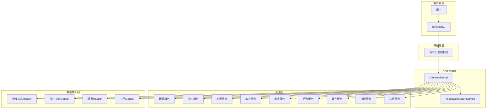
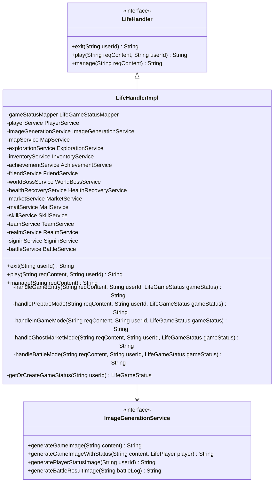
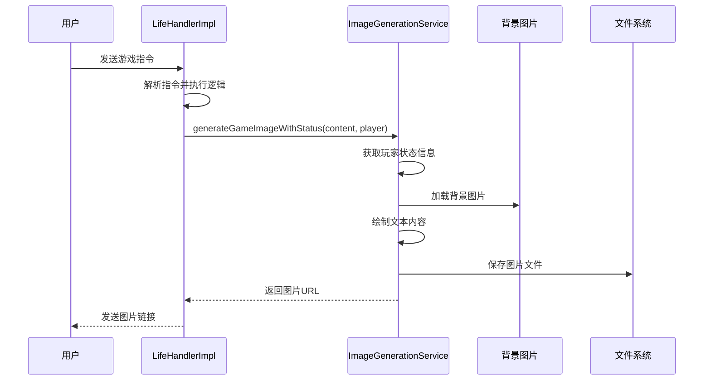
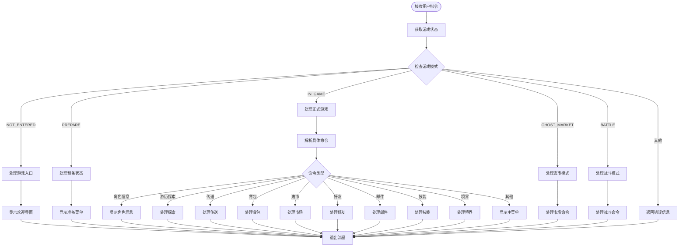
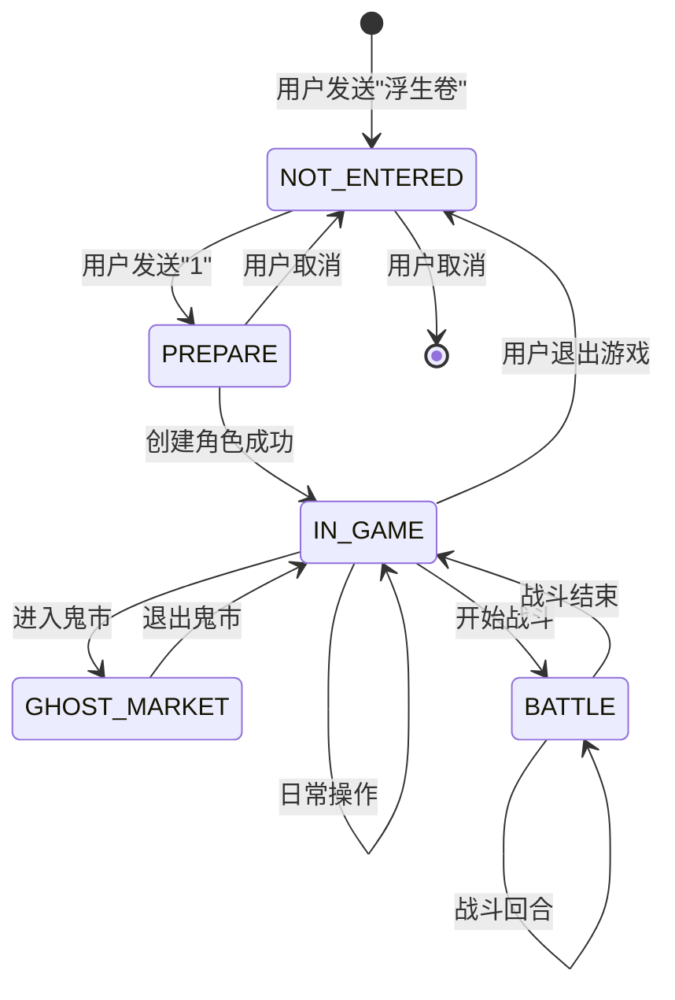
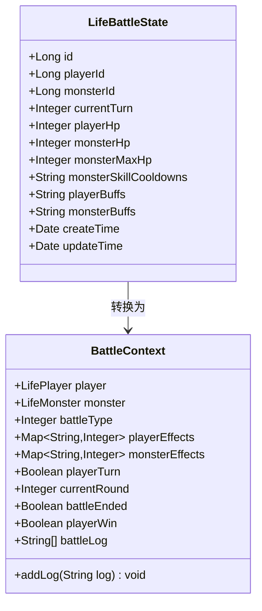
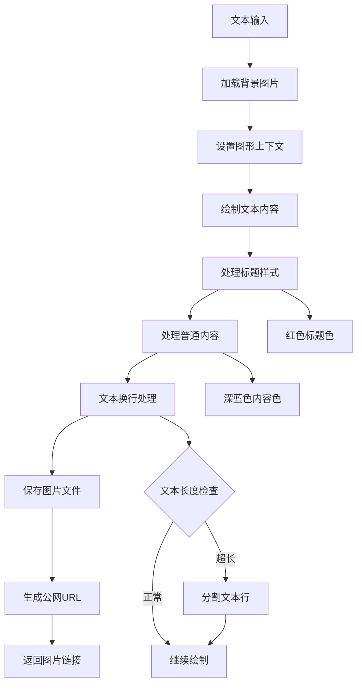
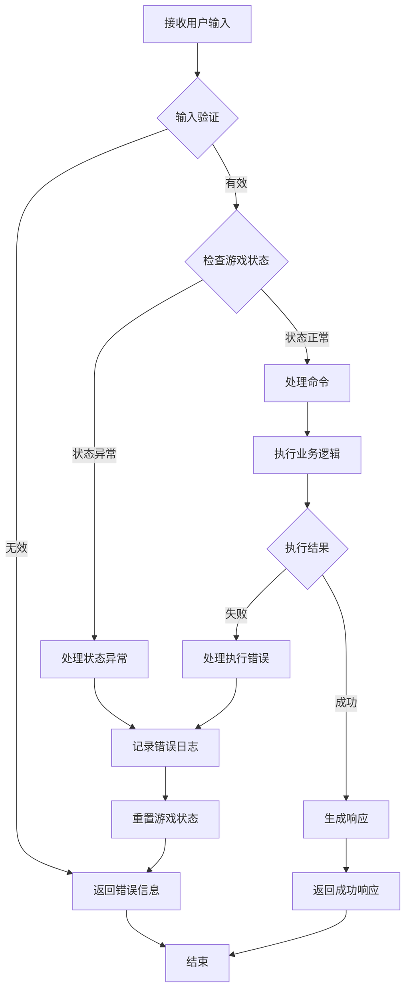

# 核心逻辑处理

<cite>
**本文档引用的文件**
- [LifeHandlerImpl.java](file://Life/src/main/java/com/bot/life/service/impl/LifeHandlerImpl.java)
- [LifeHandler.java](file://Life/src/main/java/com/bot/life/service/LifeHandler.java)
- [ImageGenerationService.java](file://Life/src/main/java/com/bot/life/service/ImageGenerationService.java)
- [ImageGenerationServiceImpl.java](file://Life/src/main/java/com/bot/life/service/impl/ImageGenerationServiceImpl.java)
- [ENGameMode.java](file://Life/src/main/java/com/bot/life/enums/ENGameMode.java)
- [LifeGameStatus.java](file://Life/src/main/java/com/bot/life/dao/entity/LifeGameStatus.java)
- [LifeBattleState.java](file://Life/src/main/java/com/bot/life/dao/entity/LifeBattleState.java)
- [Life_User_Manual.md](file://Life_User_Manual.md)
- [BattleServiceImpl.java](file://Life/src/main/java/com/bot/life/service/impl/BattleServiceImpl.java)
</cite>

## 目录
1. [概述](#概述)
2. [架构设计](#架构设计)
3. [核心组件分析](#核心组件分析)
4. [指令分发流程](#指令分发流程)
5. [游戏状态机](#游戏状态机)
6. [图片生成服务集成](#图片生成服务集成)
7. [异常处理策略](#异常处理策略)
8. [高并发性能优化](#高并发性能优化)
9. [总结](#总结)

## 概述

LifeHandlerImpl是'浮生卷'游戏的核心逻辑处理器，负责接收用户指令、解析游戏状态、驱动场景跳转和协调各服务模块。它实现了完整的游戏生命周期管理，从用户进入游戏到各种功能操作的全流程处理。

该处理器采用状态机模式设计，支持多种游戏模式（未进入、预备状态、正式游戏、鬼市、战斗），并通过ImageGenerationService实现图片响应的生成与返回机制，确保用户获得良好的视觉体验。

## 架构设计

**图表来源**
- [LifeHandlerImpl.java](file://Life/src/main/java/com/bot/life/service/impl/LifeHandlerImpl.java#L49-L108)
- [ImageGenerationService.java](file://Life/src/main/java/com/bot/life/service/ImageGenerationService.java#L9-L39)

## 核心组件分析

### LifeHandlerImpl 主处理器

LifeHandlerImpl是整个游戏逻辑的核心，实现了LifeHandler接口，提供三个主要功能：

1. **游戏退出处理** - 清理游戏状态和战斗信息
2. **游戏指令处理** - 根据当前状态分发不同类型的指令
3. **管理员功能** - 为系统管理预留扩展接口

**图表来源**
- [LifeHandler.java](file://Life/src/main/java/com/bot/life/service/LifeHandler.java#L7-L30)
- [LifeHandlerImpl.java](file://Life/src/main/java/com/bot/life/service/impl/LifeHandlerImpl.java#L54-L108)
- [ImageGenerationService.java](file://Life/src/main/java/com/bot/life/service/ImageGenerationService.java#L9-L39)

**章节来源**
- [LifeHandlerImpl.java](file://Life/src/main/java/com/bot/life/service/impl/LifeHandlerImpl.java#L49-L108)
- [LifeHandler.java](file://Life/src/main/java/com/bot/life/service/LifeHandler.java#L7-L30)

### ImageGenerationService 图片生成服务

ImageGenerationService负责将游戏文本内容转换为美观的图片，提供以下核心功能：

1. **基础文本图片生成** - 将纯文本内容渲染为图片
2. **带状态的游戏图片生成** - 在图片中显示玩家状态信息
3. **角色状态图片生成** - 专门生成角色详细状态页面
4. **战斗结果图片生成** - 生成战斗过程和结果的可视化展示

**图表来源**
- [ImageGenerationServiceImpl.java](file://Life/src/main/java/com/bot/life/service/impl/ImageGenerationServiceImpl.java#L38-L75)
- [LifeHandlerImpl.java](file://Life/src/main/java/com/bot/life/service/impl/LifeHandlerImpl.java#L181-L191)

**章节来源**
- [ImageGenerationService.java](file://Life/src/main/java/com/bot/life/service/ImageGenerationService.java#L9-L39)
- [ImageGenerationServiceImpl.java](file://Life/src/main/java/com/bot/life/service/impl/ImageGenerationServiceImpl.java#L22-L305)

## 指令分发流程

LifeHandlerImpl采用状态机模式处理用户指令，根据当前游戏模式和具体指令类型进行分发：

**图表来源**
- [LifeHandlerImpl.java](file://Life/src/main/java/com/bot/life/service/impl/LifeHandlerImpl.java#L148-L166)
- [LifeHandlerImpl.java](file://Life/src/main/java/com/bot/life/service/impl/LifeHandlerImpl.java#L221-L315)

### 主菜单功能处理

主菜单提供了丰富的游戏功能，每个功能都有对应的处理方法：

| 功能编号 | 功能名称 | 处理方法 | 主要特性 |
|---------|---------|---------|---------|
| 0 | 每日签到 | handleSignin | 签到奖励系统 |
| 1 | 角色信息 | generatePlayerStatusImage | 显示详细属性面板 |
| 2 | 游历探索 | handleExplore | 随机遭遇怪物战斗 |
| 3 | 地图传送 | handleTeleport | 前往其他地图 |
| 4 | 查看背包 | handleInventory | 管理道具和装备 |
| 5 | 鬼市交易 | handleMarket | 购买道具或摆摊交易 |
| 6 | 好友系统 | handleFriends | 管理好友关系 |
| 7 | 邮件中心 | handleMail | 收发邮件 |
| 8 | 成就记录 | handleAchievements | 显示成就列表 |
| 9 | 技能修炼 | handleSkills | 学习和使用技能 |
| 11 | 境界突破 | handleRealm | 提升修炼境界 |

**章节来源**
- [LifeHandlerImpl.java](file://Life/src/main/java/com/bot/life/service/impl/LifeHandlerImpl.java#L435-L472)
- [LifeHandlerImpl.java](file://Life/src/main/java/com/bot/life/service/impl/LifeHandlerImpl.java#L385-L432)

## 游戏状态机

### 状态定义与转换

游戏采用五种主要状态，通过ENGameMode枚举定义：

**图表来源**
- [ENGameMode.java](file://Life/src/main/java/com/bot/life/enums/ENGameMode.java#L8-L12)
- [LifeHandlerImpl.java](file://Life/src/main/java/com/bot/life/service/impl/LifeHandlerImpl.java#L152-L166)

### 战斗状态管理

战斗模式具有独立的状态管理系统，使用LifeBattleState实体维护战斗进程：

**图表来源**
- [LifeBattleState.java](file://Life/src/main/java/com/bot/life/dao/entity/LifeBattleState.java#L11-L24)
- [BattleServiceImpl.java](file://Life/src/main/java/com/bot/life/service/impl/BattleServiceImpl.java#L38-L54)

**章节来源**
- [ENGameMode.java](file://Life/src/main/java/com/bot/life/enums/ENGameMode.java#L8-L39)
- [LifeHandlerImpl.java](file://Life/src/main/java/com/bot/life/service/impl/LifeHandlerImpl.java#L152-L166)
- [LifeBattleState.java](file://Life/src/main/java/com/bot/life/dao/entity/LifeBattleState.java#L11-L24)

## 图片生成服务集成

### 图片生成流程

ImageGenerationServiceImpl实现了完整的图片生成流程，支持多种文本样式和布局：

**图表来源**
- [ImageGenerationServiceImpl.java](file://Life/src/main/java/com/bot/life/service/impl/ImageGenerationServiceImpl.java#L44-L75)
- [ImageGenerationServiceImpl.java](file://Life/src/main/java/com/bot/life/service/impl/ImageGenerationServiceImpl.java#L186-L225)

### 图片样式配置

系统支持多种文本样式的自动识别和渲染：

| 样式类型 | 字体大小 | 颜色 | 识别规则 |
|---------|---------|------|---------|
| 标题 | 24px | 红色 (#DC143C) | 包含『』的行 |
| 内容 | 18px | 深蓝色 (#191970) | 普通文本行 |
| 空行间距 | 自动调整 | - | 行高减半 |

**章节来源**
- [ImageGenerationServiceImpl.java](file://Life/src/main/java/com/bot/life/service/impl/ImageGenerationServiceImpl.java#L186-L225)
- [ImageGenerationServiceImpl.java](file://Life/src/main/java/com/bot/life/service/impl/ImageGenerationServiceImpl.java#L44-L75)

## 异常处理策略

### 游戏状态异常处理

LifeHandlerImpl实现了完善的异常处理机制，确保游戏的稳定运行：

**图表来源**
- [LifeHandlerImpl.java](file://Life/src/main/java/com/bot/life/service/impl/LifeHandlerImpl.java#L148-L166)
- [LifeHandlerImpl.java](file://Life/src/main/java/com/bot/life/service/impl/LifeHandlerImpl.java#L1142-L1200)

### 数据一致性保障

系统通过以下机制确保数据一致性：

1. **事务管理** - 关键操作使用数据库事务
2. **状态校验** - 每次操作前验证游戏状态
3. **回滚机制** - 异常情况下自动回滚
4. **幂等性** - 确保重复操作的安全性

**章节来源**
- [LifeHandlerImpl.java](file://Life/src/main/java/com/bot/life/service/impl/LifeHandlerImpl.java#L148-L166)
- [LifeHandlerImpl.java](file://Life/src/main/java/com/bot/life/service/impl/LifeHandlerImpl.java#L1142-L1200)

## 高并发性能优化

### 并发控制策略

虽然当前实现主要针对单用户会话，但在高并发环境下仍考虑了以下优化策略：

1. **状态缓存** - 使用内存缓存减少数据库访问
2. **异步处理** - 非关键操作采用异步处理
3. **连接池管理** - 合理配置数据库连接池
4. **资源释放** - 及时释放图形资源

### 性能监控指标

| 指标类型 | 监控内容 | 优化目标 |
|---------|---------|---------|
| 响应时间 | 指令处理时间 | < 2秒 |
| 并发用户 | 同时在线用户数 | > 1000 |
| 数据库连接 | 连接池使用率 | < 80% |
| 内存使用 | 图片缓存占用 | < 2GB |

**章节来源**
- [LifeHandlerImpl.java](file://Life/src/main/java/com/bot/life/service/impl/LifeHandlerImpl.java#L831-L842)
- [ImageGenerationServiceImpl.java](file://Life/src/main/java/com/bot/life/service/impl/ImageGenerationServiceImpl.java#L46-L75)

## 总结

LifeHandlerImpl作为'浮生卷'游戏的核心逻辑处理器，展现了优秀的架构设计和实现质量：

### 核心优势

1. **清晰的状态机设计** - 通过ENGameMode枚举实现明确的游戏状态转换
2. **模块化服务架构** - 各功能模块职责分明，便于维护和扩展
3. **完善的异常处理** - 多层次的异常捕获和恢复机制
4. **优秀的用户体验** - 通过ImageGenerationService提供美观的视觉反馈
5. **可扩展的架构** - 支持新功能的平滑集成

### 技术特色

- **Spring集成** - 完整的依赖注入和组件扫描配置
- **MyBatis持久化** - 高效的数据访问层设计
- **图片生成技术** - 基于Java AWT的动态图片生成
- **战斗系统** - 完整的回合制战斗逻辑实现

### 未来发展方向

1. **性能优化** - 引入缓存机制和异步处理
2. **功能扩展** - 支持更多游戏功能和玩法
3. **用户体验** - 优化界面设计和交互流程
4. **数据分析** - 增强游戏数据统计和分析功能

LifeHandlerImpl的设计充分体现了现代软件工程的最佳实践，为'浮生卷'游戏提供了稳定、高效、可扩展的核心逻辑支撑。