# 玩家数据管理

<cite>
**本文档引用的文件**
- [PlayerService.java](file://Life/src/main/java/com/bot/life/service/PlayerService.java)
- [PlayerServiceImpl.java](file://Life/src/main/java/com/bot/life/service/impl/PlayerServiceImpl.java)
- [LifePlayer.java](file://Life/src/main/java/com/bot/life/dao/entity/LifePlayer.java)
- [LifePlayerMapper.java](file://Life/src/main/java/com/bot/life/dao/mapper/LifePlayerMapper.java)
- [HealthRecoveryTask.java](file://Life/src/main/java/com/bot/life/task/HealthRecoveryTask.java)
- [RealmServiceImpl.java](file://Life/src/main/java/com/bot/life/service/impl/RealmServiceImpl.java)
- [Life_Database_Init.sql](file://Life_Database_Init.sql)
- [ENAttribute.java](file://Life/src/main/java/com/bot/life/enums/ENAttribute.java)
- [GameConsts.java](file://Game/src/main/java/com/bot/game/constant/GameConsts.java)
</cite>

## 目录
1. [引言](#引言)
2. [项目架构概览](#项目架构概览)
3. [核心数据模型](#核心数据模型)
4. [角色创建流程](#角色创建流程)
5. [等级系统实现](#等级系统实现)
6. [属性计算体系](#属性计算体系)
7. [修为系统设计](#修为系统设计)
8. [体力系统机制](#体力系统机制)
9. [数据持久化方案](#数据持久化方案)
10. [性能优化措施](#性能优化措施)
11. [总结](#总结)

## 引言

本文档深入解析了《浮生卷》游戏中PlayerService对玩家全生命周期数据的管理策略。该系统采用现代化的Java Spring架构，实现了完整的角色养成体系，包括角色创建、等级提升、属性计算、修为增长、体力恢复等多个核心功能模块。

系统的核心设计理念是以玩家为中心的数据管理模式，通过LifePlayer实体类统一管理玩家的所有属性数据，包括基础属性、战斗属性、修为状态、体力状态等。同时，系统采用了事件驱动的设计模式，通过定时任务和异步处理确保数据的实时性和一致性。

## 项目架构概览

系统采用分层架构设计，主要包含以下层次：

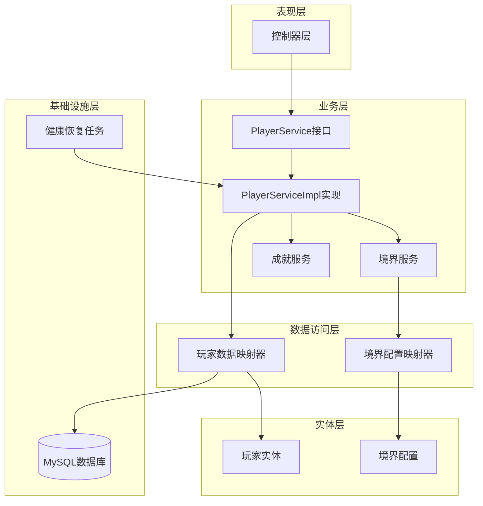

**图表来源**
- [PlayerServiceImpl.java](file://Life/src/main/java/com/bot/life/service/impl/PlayerServiceImpl.java#L21-L35)
- [LifePlayerMapper.java](file://Life/src/main/java/com/bot/life/dao/mapper/LifePlayerMapper.java#L11-L47)

**章节来源**
- [PlayerServiceImpl.java](file://Life/src/main/java/com/bot/life/service/impl/PlayerServiceImpl.java#L1-L230)
- [LifePlayer.java](file://Life/src/main/java/com/bot/life/dao/entity/LifePlayer.java#L1-L130)

## 核心数据模型

### LifePlayer实体结构

LifePlayer是整个玩家数据管理系统的核心实体，包含了玩家的所有属性信息：

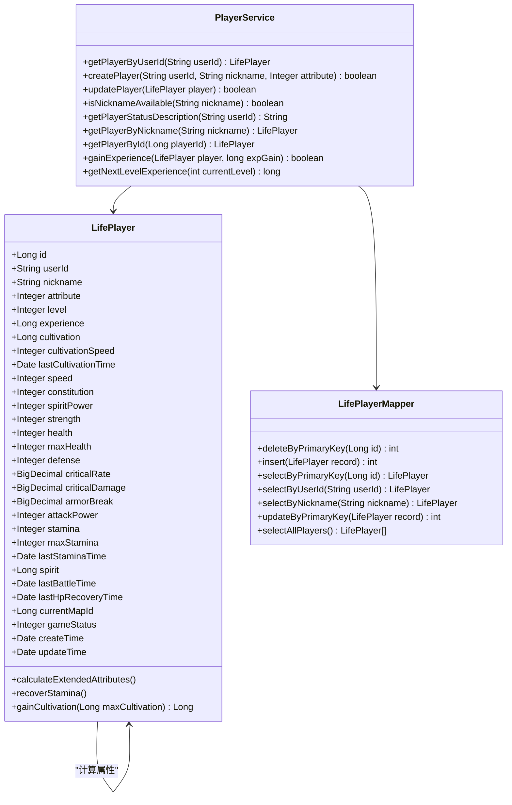

**图表来源**
- [LifePlayer.java](file://Life/src/main/java/com/bot/life/dao/entity/LifePlayer.java#L12-L129)
- [PlayerService.java](file://Life/src/main/java/com/bot/life/service/PlayerService.java#L8-L75)
- [LifePlayerMapper.java](file://Life/src/main/java/com/bot/life/dao/mapper/LifePlayerMapper.java#L11-L47)

### 数据库表结构

系统采用MySQL数据库存储玩家数据，主要表结构如下：

| 字段名 | 类型 | 默认值 | 说明 |
|--------|------|--------|------|
| id | bigint | - | 主键ID |
| user_id | varchar(50) | - | 用户唯一标识 |
| nickname | varchar(21) | - | 角色昵称 |
| attribute | tinyint | 1 | 角色属性(1金2木3水4火5土) |
| level | int | 1 | 等级 |
| experience | bigint | 0 | 经验值 |
| cultivation | bigint | 0 | 修为 |
| cultivation_speed | int | 10 | 修炼速度(修为/分钟) |
| speed | int | 1 | 速度 |
| constitution | int | 1 | 体质 |
| spirit_power | int | 1 | 灵力 |
| strength | int | 1 | 力量 |
| health | int | 10 | 血量 |
| max_health | int | 10 | 最大血量 |
| defense | int | 1 | 防御 |
| critical_rate | decimal(5,3) | 0.000 | 会心率(%) |
| critical_damage | decimal(6,3) | 110.000 | 会心效果(%) |
| armor_break | decimal(5,3) | 0.000 | 破防(%) |
| attack_power | int | 6 | 攻击力 |
| stamina | int | 100 | 体力值 |
| max_stamina | int | 100 | 最大体力 |
| spirit | bigint | 1000 | 灵粹(游戏货币) |
| current_map_id | bigint | 1 | 当前所在地图 |
| game_status | tinyint | 0 | 游戏状态(0正常1战斗中2组队中) |
| create_time | datetime | CURRENT_TIMESTAMP | 创建时间 |
| update_time | datetime | CURRENT_TIMESTAMP | 更新时间 |

**章节来源**
- [LifePlayer.java](file://Life/src/main/java/com/bot/life/dao/entity/LifePlayer.java#L14-L51)
- [Life_Database_Init.sql](file://Life_Database_Init.sql#L6-L48)

## 角色创建流程

### 创建流程架构

角色创建是一个复杂的多步骤流程，涉及多个验证和初始化步骤：

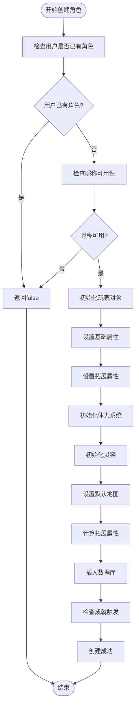

**图表来源**
- [PlayerServiceImpl.java](file://Life/src/main/java/com/bot/life/service/impl/PlayerServiceImpl.java#L42-L106)

### 昵称校验机制

系统实现了严格的昵称校验机制，确保每个昵称的唯一性：

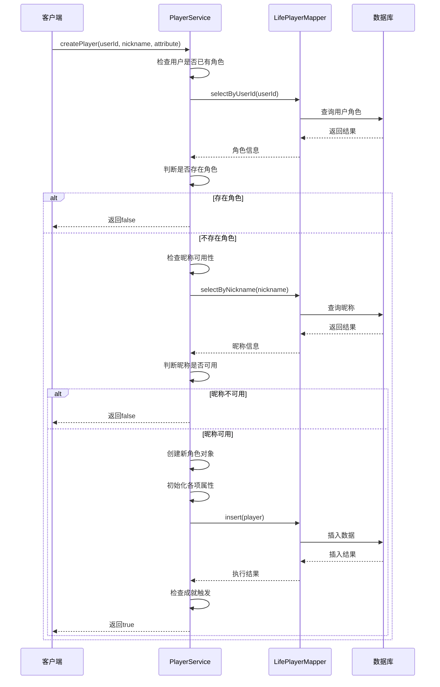

**图表来源**
- [PlayerServiceImpl.java](file://Life/src/main/java/com/bot/life/service/impl/PlayerServiceImpl.java#L42-L106)

### 五行属性初始化

系统支持五种五行属性，每种属性都有其独特的初始配置：

| 属性类型 | 数值 | 说明 |
|----------|------|------|
| 金属性 | 1 | 克木属性，克制木属性敌人20%伤害 |
| 木属性 | 2 | 克土属性，克制土属性敌人20%伤害 |
| 水属性 | 3 | 克火属性，克制火属性敌人20%伤害 |
| 火属性 | 4 | 克金属性，克制金属性敌人20%伤害 |
| 土属性 | 5 | 克水属性，克制水属性敌人20%伤害 |

**章节来源**
- [PlayerServiceImpl.java](file://Life/src/main/java/com/bot/life/service/impl/PlayerServiceImpl.java#L42-L106)
- [ENAttribute.java](file://Life/src/main/java/com/bot/life/enums/ENAttribute.java#L8-L13)

## 等级系统实现

### 经验值计算公式

系统采用动态经验值计算公式，确保随着等级提升，升级所需经验呈指数增长：

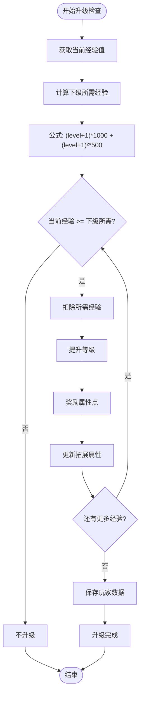

**图表来源**
- [PlayerServiceImpl.java](file://Life/src/main/java/com/bot/life/service/impl/PlayerServiceImpl.java#L186-L229)

### 自动升级机制

系统实现了智能的自动升级机制，能够一次性处理多个等级的提升：

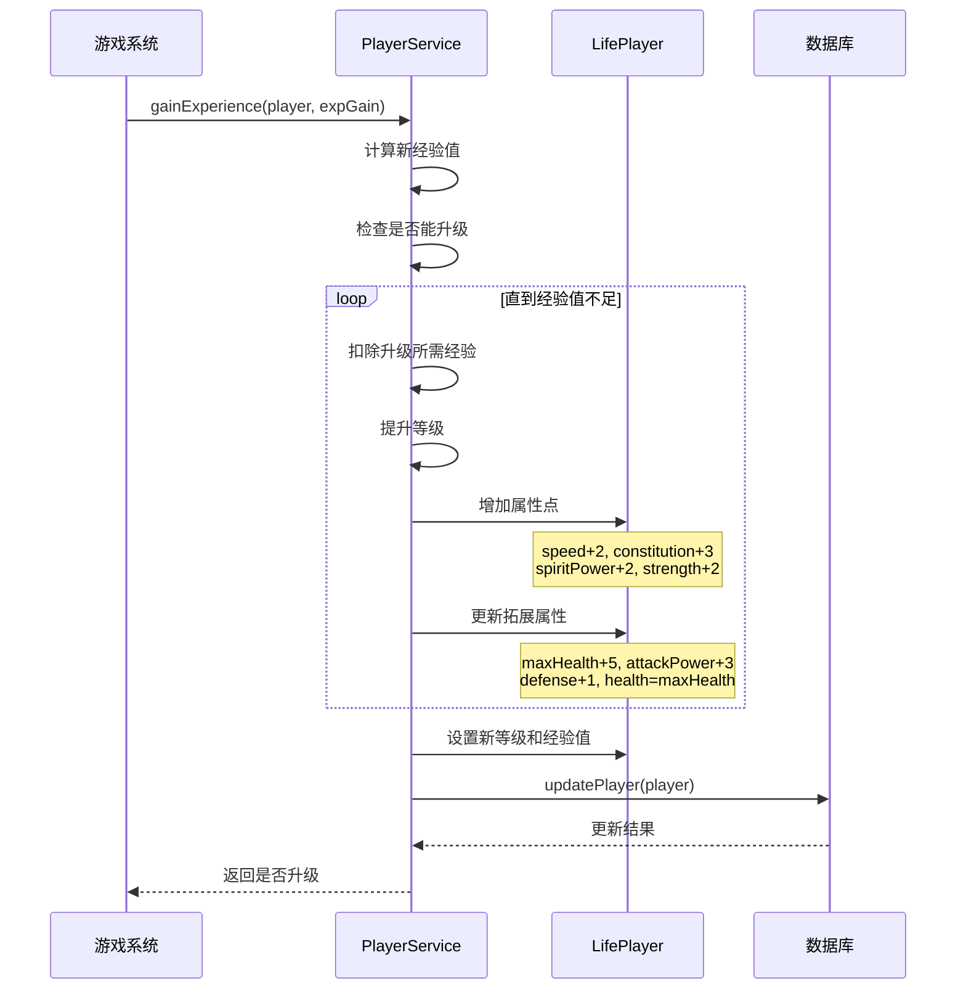

**图表来源**
- [PlayerServiceImpl.java](file://Life/src/main/java/com/bot/life/service/impl/PlayerServiceImpl.java#L186-L229)

### 属性奖励机制

每次升级都会获得固定的属性奖励，促进玩家角色的成长：

| 属性类型 | 升级奖励 | 说明 |
|----------|----------|------|
| 速度 | +2 | 影响出手顺序和破防能力 |
| 体质 | +3 | 增加血量和防御力 |
| 灵力 | +2 | 提升会心率和会心效果 |
| 力量 | +2 | 增强攻击力和破防能力 |
| 最大血量 | +5 | 提升生命值上限 |
| 攻击力 | +3 | 增强物理伤害输出 |
| 防御力 | +1 | 减少受到的伤害 |

**章节来源**
- [PlayerServiceImpl.java](file://Life/src/main/java/com/bot/life/service/impl/PlayerServiceImpl.java#L195-L212)

## 属性计算体系

### 基础属性与战斗属性的关系

系统采用数学公式将基础属性转换为战斗属性，确保属性之间的平衡性：

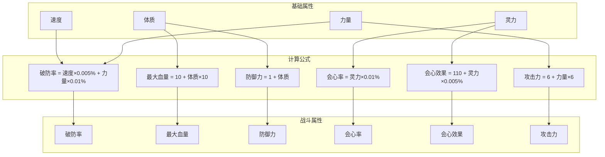

**图表来源**
- [LifePlayer.java](file://Life/src/main/java/com/bot/life/dao/entity/LifePlayer.java#L55-L76)

### 属性计算方法

LifePlayer实体提供了专门的属性计算方法，确保属性的一致性：

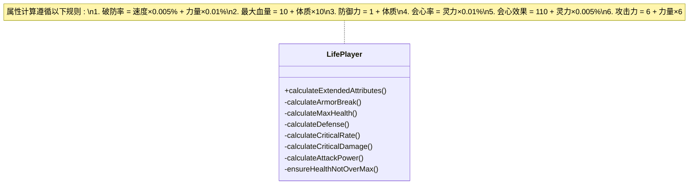

**图表来源**
- [LifePlayer.java](file://Life/src/main/java/com/bot/life/dao/entity/LifePlayer.java#L55-L76)

**章节来源**
- [LifePlayer.java](file://Life/src/main/java/com/bot/life/dao/entity/LifePlayer.java#L55-L76)

## 修为系统设计

### 离线增长机制

系统实现了智能的离线增长机制，让玩家即使离线也能获得修为收益：

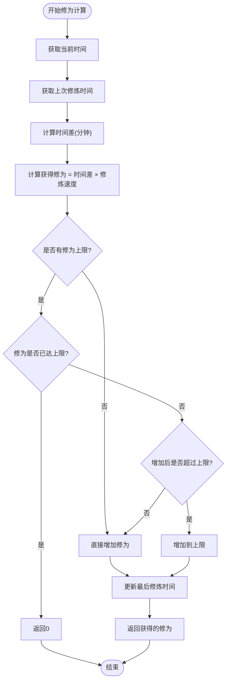

**图表来源**
- [LifePlayer.java](file://Life/src/main/java/com/bot/life/dao/entity/LifePlayer.java#L101-L127)

### 修炼速度加成

系统支持多种方式提升修炼速度，包括境界突破、装备加成、道具使用等：

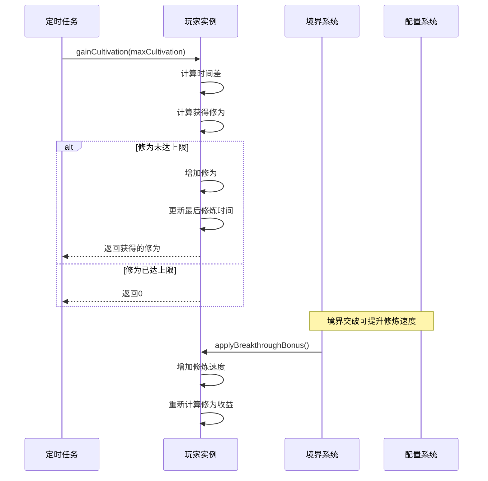

**图表来源**
- [LifePlayer.java](file://Life/src/main/java/com/bot/life/dao/entity/LifePlayer.java#L101-L127)
- [RealmServiceImpl.java](file://Life/src/main/java/com/bot/life/service/impl/RealmServiceImpl.java#L193-L236)

**章节来源**
- [LifePlayer.java](file://Life/src/main/java/com/bot/life/dao/entity/LifePlayer.java#L101-L127)
- [RealmServiceImpl.java](file://Life/src/main/java/com/bot/life/service/impl/RealmServiceImpl.java#L193-L236)

## 体力系统机制

### 体力恢复机制

系统实现了基于时间的体力恢复机制，确保玩家的游戏体验：

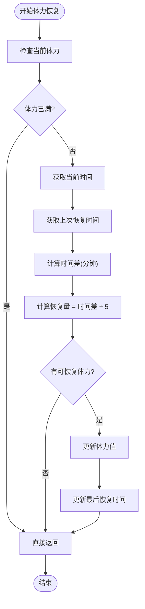

**图表来源**
- [LifePlayer.java](file://Life/src/main/java/com/bot/life/dao/entity/LifePlayer.java#L81-L95)

### 体力系统特性

| 特性 | 设计 | 说明 |
|------|------|------|
| 初始值 | 100 | 玩家初始拥有100点体力 |
| 恢复速率 | 5分钟/1点 | 每5分钟恢复1点体力 |
| 上限 | 100 | 体力值永远不会超过100 |
| 恢复条件 | 时间间隔 | 只有经过足够时间才会恢复 |
| 恢复触发 | 异步处理 | 通过定时任务自动恢复 |

**章节来源**
- [LifePlayer.java](file://Life/src/main/java/com/bot/life/dao/entity/LifePlayer.java#L81-L95)

## 数据持久化方案

### 数据库设计策略

系统采用关系型数据库进行数据持久化，设计遵循以下原则：

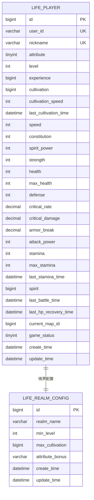

**图表来源**
- [Life_Database_Init.sql](file://Life_Database_Init.sql#L6-L48)

### 数据访问层设计

系统采用MyBatis框架进行数据访问，提供清晰的DAO接口：

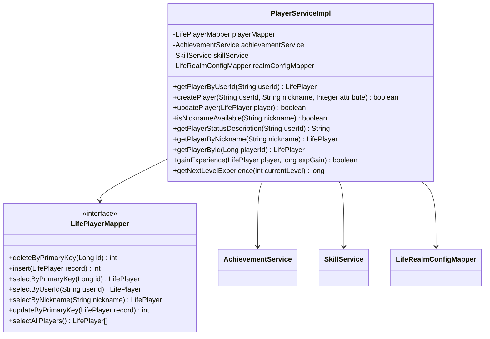

**图表来源**
- [LifePlayerMapper.java](file://Life/src/main/java/com/bot/life/dao/mapper/LifePlayerMapper.java#L11-L47)
- [PlayerServiceImpl.java](file://Life/src/main/java/com/bot/life/service/impl/PlayerServiceImpl.java#L21-L35)

**章节来源**
- [LifePlayerMapper.java](file://Life/src/main/java/com/bot/life/dao/mapper/LifePlayerMapper.java#L11-L47)
- [PlayerServiceImpl.java](file://Life/src/main/java/com/bot/life/service/impl/PlayerServiceImpl.java#L21-L35)

## 性能优化措施

### 定时任务优化

系统采用Spring Scheduled注解实现定时任务，确保关键功能的及时执行：

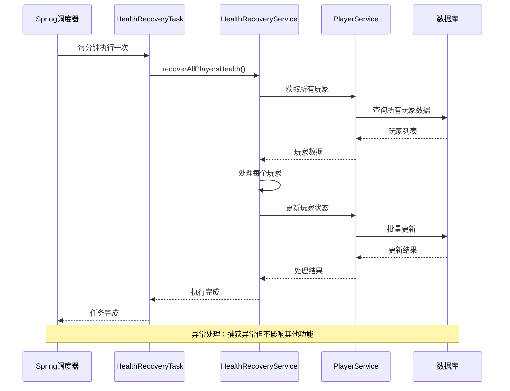

**图表来源**
- [HealthRecoveryTask.java](file://Life/src/main/java/com/bot/life/task/HealthRecoveryTask.java#L19-L30)

### 数据库连接优化

系统采用以下策略优化数据库性能：

| 优化策略 | 实现方式 | 效果 |
|----------|----------|------|
| 连接池配置 | HikariCP连接池 | 提高并发处理能力 |
| 事务管理 | Spring声明式事务 | 确保数据一致性 |
| 索引优化 | 关键字段建立索引 | 加快查询速度 |
| 批量操作 | 批量插入和更新 | 减少数据库交互 |
| 缓存策略 | 内存缓存常用数据 | 降低数据库压力 |

### 内存管理优化

系统通过以下方式优化内存使用：

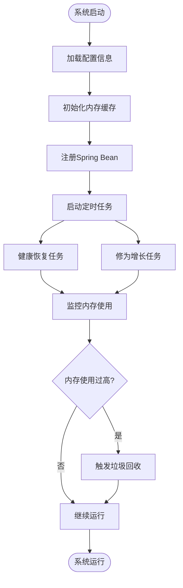

**章节来源**
- [HealthRecoveryTask.java](file://Life/src/main/java/com/bot/life/task/HealthRecoveryTask.java#L19-L30)

## 总结

《浮生卷》的玩家数据管理系统展现了现代游戏开发的最佳实践。系统通过以下核心特性实现了完整的玩家生命周期管理：

### 技术亮点

1. **完整的数据模型**：LifePlayer实体涵盖了玩家的所有属性，从基础属性到战斗属性，形成了完整的属性体系。

2. **智能的升级机制**：采用动态经验值公式和批量升级处理，确保游戏体验的流畅性。

3. **平衡的属性计算**：通过数学公式将基础属性转换为战斗属性，保证了属性之间的平衡性。

4. **实时的数据同步**：通过定时任务和异步处理，确保玩家数据的实时性和一致性。

5. **优秀的性能设计**：采用数据库连接池、缓存策略和批量操作，优化了系统性能。

### 架构优势

- **分层清晰**：表现层、业务层、数据访问层职责明确，便于维护和扩展
- **接口规范**：PlayerService接口定义了标准的服务契约
- **异常处理**：完善的异常处理机制，确保系统的稳定性
- **测试友好**：良好的依赖注入设计，便于单元测试和集成测试

这套玩家数据管理系统不仅满足了游戏的核心需求，还为未来的功能扩展奠定了坚实的基础。通过持续的优化和改进，系统能够支持更大规模的玩家群体和更复杂的游戏玩法。