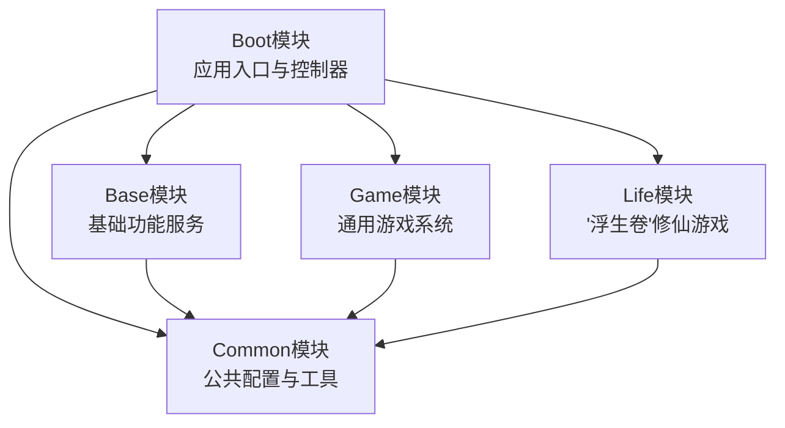
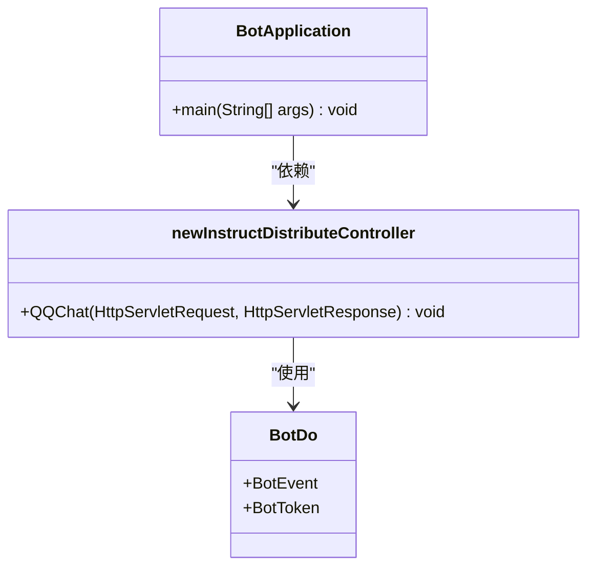
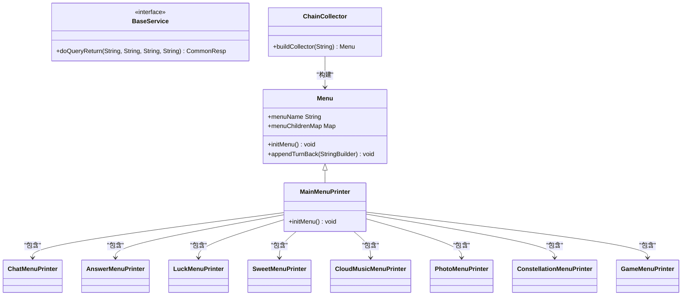
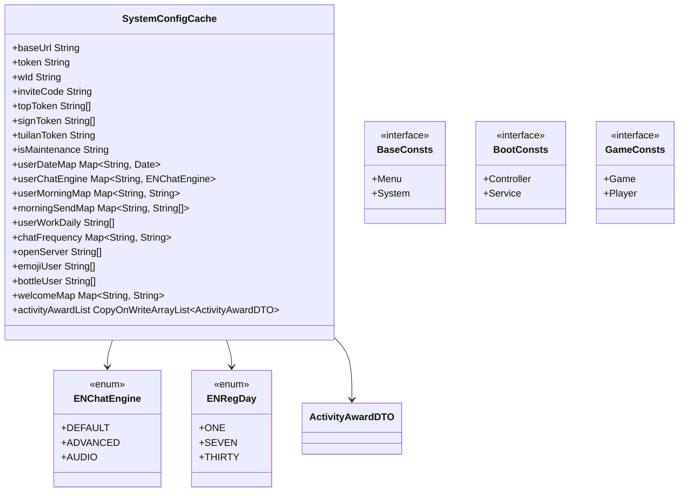
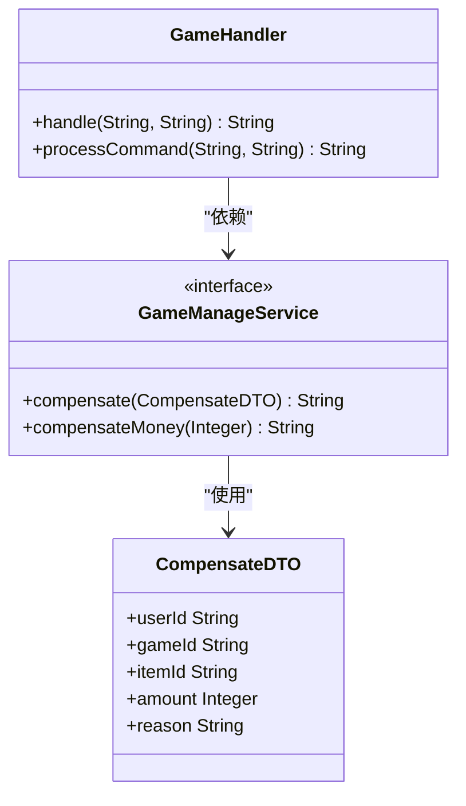
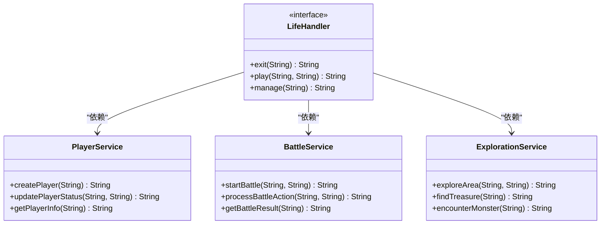
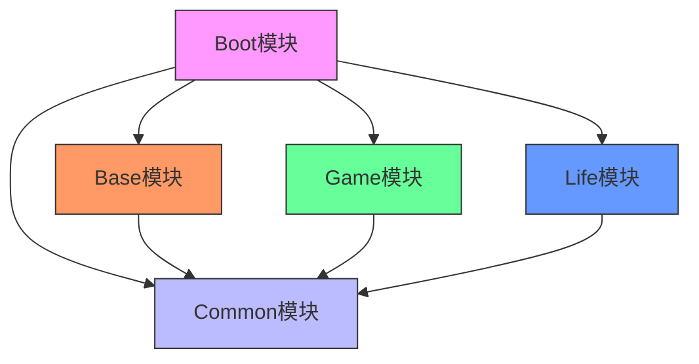

# 模块详解

<cite>
**本文档引用文件**  
- [pom.xml](file://pom.xml)
- [Boot/pom.xml](file://Boot/pom.xml)
- [Base/pom.xml](file://Base/pom.xml)
- [Common/pom.xml](file://Common/pom.xml)
- [Game/pom.xml](file://Game/pom.xml)
- [Life/pom.xml](file://Life/pom.xml)
- [Boot/src/main/java/com/bot/boot/BotApplication.java](file://Boot/src/main/java/com/bot/boot/BotApplication.java)
- [Boot/src/main/resources/application.properties](file://Boot/src/main/resources/application.properties)
- [Boot/src/main/resources/application-dev.properties](file://Boot/src/main/resources/application-dev.properties)
- [Boot/src/main/resources/application-prod.properties](file://Boot/src/main/resources/application-prod.properties)
- [Common/src/main/java/com/bot/common/config/SystemConfigCache.java](file://Common/src/main/java/com/bot/common/config/SystemConfigCache.java)
- [Base/src/main/java/com/bot/base/service/BaseService.java](file://Base/src/main/java/com/bot/base/service/BaseService.java)
- [Base/src/main/java/com/bot/base/chain/menu/MainMenuPrinter.java](file://Base/src/main/java/com/bot/base/chain/menu/MainMenuPrinter.java)
- [Game/src/main/java/com/bot/game/service/GameManageService.java](file://Game/src/main/java/com/bot/game/service/GameManageService.java)
- [Life/src/main/java/com/bot/life/service/LifeHandler.java](file://Life/src/main/java/com/bot/life/service/LifeHandler.java)
- [Boot/src/main/java/com/bot/boot/controller/BotDo.java](file://Boot/src/main/java/com/bot/boot/controller/BotDo.java)
</cite>

## 目录
1. [项目结构概述](#项目结构概述)
2. [模块职责详解](#模块职责详解)
3. [模块依赖关系](#模块依赖关系)
4. [模块配置说明](#模块配置说明)
5. [使用场景与扩展建议](#使用场景与扩展建议)

## 项目结构概述

Bot项目采用多模块Maven架构，包含五个核心模块：Boot、Base、Common、Game和Life。项目基于Spring Boot框架构建，通过模块化设计实现了功能解耦和职责分离。



**模块来源**
- [pom.xml](file://pom.xml#L6-L11)
- [Boot/pom.xml](file://Boot/pom.xml#L12)
- [Base/pom.xml](file://Base/pom.xml#L12)
- [Common/pom.xml](file://Common/pom.xml#L13)
- [Game/pom.xml](file://Game/pom.xml#L12)
- [Life/pom.xml](file://Life/pom.xml#L12)

## 模块职责详解

### Boot模块

Boot模块作为Spring Boot应用的入口和控制器层，负责整个系统的启动、配置管理和请求分发。该模块是整个Bot系统的核心控制中心。

**主要职责：**
- 应用启动入口
- Spring Boot配置管理
- 请求路由与分发
- 系统监控与调度



**模块来源**
- [Boot/src/main/java/com/bot/boot/BotApplication.java](file://Boot/src/main/java/com/bot/boot/BotApplication.java)
- [Boot/src/main/java/com/bot/boot/controller/BotDo.java](file://Boot/src/main/java/com/bot/boot/controller/BotDo.java)
- [Boot/src/main/java/com/bot/boot/controller/newInstructDistributeController.java](file://Boot/src/main/java/com/bot/boot/controller/newInstructDistributeController.java)

### Base模块

Base模块提供基础功能服务，实现了Bot系统的核心业务逻辑和通用功能。该模块通过责任链模式组织各种功能菜单，为上层应用提供统一的服务接口。

**主要职责：**
- 实现基础功能服务
- 组织功能菜单结构
- 提供通用业务逻辑
- 管理任务调度



**模块来源**
- [Base/pom.xml](file://Base/pom.xml)
- [Base/src/main/java/com/bot/base/service/BaseService.java](file://Base/src/main/java/com/bot/base/service/BaseService.java)
- [Base/src/main/java/com/bot/base/chain/menu/MainMenuPrinter.java](file://Base/src/main/java/com/bot/base/chain/menu/MainMenuPrinter.java)

### Common模块

Common模块封装了系统的公共配置和工具类，为其他所有模块提供基础支持。该模块作为整个系统的基础设施，包含了配置缓存、常量定义、工具方法等核心组件。

**主要职责：**
- 管理系统配置缓存
- 定义全局常量
- 提供通用工具方法
- 封装数据传输对象



**模块来源**
- [Common/pom.xml](file://Common/pom.xml)
- [Common/src/main/java/com/bot/common/config/SystemConfigCache.java](file://Common/src/main/java/com/bot/common/config/SystemConfigCache.java)
- [Common/src/main/java/com/bot/common/constant/BaseConsts.java](file://Common/src/main/java/com/bot/common/constant/BaseConsts.java)

### Game模块

Game模块实现了通用游戏系统的功能，为Bot提供标准化的游戏服务接口。该模块通过服务接口定义了游戏管理的通用操作，支持游戏补偿、奖励发放等核心功能。

**主要职责：**
- 提供通用游戏服务
- 管理游戏补偿机制
- 处理游戏奖励发放
- 支持游戏状态管理



**模块来源**
- [Game/pom.xml](file://Game/pom.xml)
- [Game/src/main/java/com/bot/game/service/GameManageService.java](file://Game/src/main/java/com/bot/game/service/GameManageService.java)
- [Game/src/main/java/com/bot/game/dto/CompensateDTO.java](file://Game/src/main/java/com/bot/game/dto/CompensateDTO.java)

### Life模块

Life模块实现了"浮生卷"修仙游戏的完整功能，是Bot系统中最复杂的游戏模块。该模块提供了完整的修仙游戏体验，包括角色管理、战斗系统、探索机制等核心功能。

**主要职责：**
- 实现"浮生卷"修仙游戏
- 管理玩家角色状态
- 处理游戏指令逻辑
- 支持管理员操作



**模块来源**
- [Life/pom.xml](file://Life/pom.xml)
- [Life/src/main/java/com/bot/life/service/LifeHandler.java](file://Life/src/main/java/com/bot/life/service/LifeHandler.java)
- [Life/src/main/java/com/bot/life/service/PlayerService.java](file://Life/src/main/java/com/bot/life/service/PlayerService.java)

## 模块依赖关系

Bot项目的模块间存在明确的依赖关系，形成了清晰的层次结构。Boot模块作为顶层模块，依赖所有其他功能模块；Common模块作为基础模块，被所有其他模块依赖。



**依赖关系说明：**
- **Boot模块依赖**：Base、Game、Life、Common
- **Base模块依赖**：Common、Game、Life
- **Game模块依赖**：Common
- **Life模块依赖**：Common
- **Common模块**：无外部模块依赖

这种依赖结构确保了系统的可维护性和可扩展性：
1. Common模块作为基础依赖，提供了所有模块共享的配置和工具
2. Boot模块作为控制中心，整合所有功能模块
3. 功能模块（Base、Game、Life）可以独立开发和测试
4. 模块间的依赖关系清晰，避免了循环依赖

**模块来源**
- [pom.xml](file://pom.xml)
- [Boot/pom.xml](file://Boot/pom.xml)
- [Base/pom.xml](file://Base/pom.xml)
- [Game/pom.xml](file://Game/pom.xml)
- [Life/pom.xml](file://Life/pom.xml)

## 模块配置说明

### Boot模块配置

Boot模块通过Spring Boot的配置文件管理系统配置，支持多环境配置（开发、生产）。

**application.properties 配置示例：**
```properties
# 基础配置
server.port=9091
server.servlet.context-path=/bot

# 日志配置
logback.level=INFO
logback.rootPath=C:\\logs\\bot

# 系统配置
system.robot.qq=2732151511
system.message.send.key=murongyehua123
system.message.send.url=http://127.0.0.1:21213/SendTempIM.do

# 数据库信息
spring.datasource.url=jdbc:mysql://47.92.127.30:3306/bot?useUnicode=true&characterEncoding=utf8&useSSL=false&serverTimezone=UTC
spring.datasource.username=root
spring.datasource.password=gouzaizi@123
```

**环境配置文件：**
- application-dev.properties：开发环境配置
- application-prod.properties：生产环境配置

**配置来源**
- [Boot/src/main/resources/application.properties](file://Boot/src/main/resources/application.properties)
- [Boot/src/main/resources/application-dev.properties](file://Boot/src/main/resources/application-dev.properties)
- [Boot/src/main/resources/application-prod.properties](file://Boot/src/main/resources/application-prod.properties)

### Common模块配置

Common模块通过SystemConfigCache类管理运行时配置，实现了配置的动态加载和缓存。

**SystemConfigCache 配置示例：**
```java
public class SystemConfigCache {
    // 基础URL
    public static String baseUrl = "";
    
    // 认证令牌
    public static String token = "";
    
    // 用户到期时间映射
    public static final Map<String, Date> userDateMap = new HashMap<>();
    
    // 用户聊天引擎映射
    public static final Map<String, ENChatEngine> userChatEngine = new HashMap<>();
    
    // 当前开启的抽奖活动奖品
    public static final CopyOnWriteArrayList<ActivityAwardDTO> activityAwardList = new CopyOnWriteArrayList<>();
}
```

**配置来源**
- [Common/src/main/java/com/bot/common/config/SystemConfigCache.java](file://Common/src/main/java/com/bot/common/config/SystemConfigCache.java)

## 使用场景与扩展建议

### 使用场景

#### Boot模块使用场景
- **系统启动**：通过BotApplication.main()方法启动整个Bot系统
- **请求处理**：接收外部请求并分发到相应的处理模块
- **环境管理**：根据不同的配置文件切换开发、生产环境

#### Base模块使用场景
- **功能扩展**：通过继承Menu类添加新的功能菜单
- **服务实现**：实现BaseService接口提供新的基础服务
- **任务调度**：利用AutoTask、NoticeTask等实现定时任务

#### Common模块使用场景
- **配置管理**：通过SystemConfigCache访问系统配置
- **常量引用**：使用BaseConsts、GameConsts等常量类
- **工具方法**：调用SendMsgUtil、HttpSenderUtil等工具类

#### Game模块使用场景
- **游戏管理**：通过GameManageService接口进行游戏补偿和奖励发放
- **新游戏开发**：参考现有结构开发新的通用游戏
- **服务集成**：将Game模块服务集成到其他应用中

#### Life模块使用场景
- **修仙游戏**：启动"浮生卷"修仙游戏，提供完整的修仙体验
- **角色管理**：管理玩家角色的状态和属性
- **战斗系统**：实现回合制战斗机制

### 扩展建议

#### 模块扩展原则
1. **遵循单一职责原则**：每个模块只负责特定领域的功能
2. **保持松耦合**：通过接口而非具体实现进行模块间通信
3. **避免循环依赖**：确保模块依赖关系为有向无环图
4. **配置分离**：将配置信息与代码逻辑分离

#### 新模块开发建议
1. **创建新模块**：在项目根目录下创建新的Maven模块
2. **配置pom.xml**：设置正确的父项目和依赖关系
3. **实现核心功能**：编写业务逻辑代码
4. **注册到Boot模块**：在Boot模块的pom.xml中添加新模块依赖
5. **更新扫描包**：在BotApplication.java中添加新的扫描包

#### 性能优化建议
1. **缓存优化**：合理使用SystemConfigCache减少数据库访问
2. **异步处理**：对耗时操作使用异步处理机制
3. **连接池配置**：优化Druid连接池参数以提高数据库性能
4. **日志级别**：根据环境调整日志级别，生产环境使用INFO级别

#### 安全性建议
1. **敏感信息保护**：避免在代码中硬编码敏感信息
2. **输入验证**：对所有外部输入进行严格验证
3. **权限控制**：实现细粒度的权限控制机制
4. **日志审计**：记录关键操作日志用于审计

**模块来源**
- [pom.xml](file://pom.xml)
- [Boot/pom.xml](file://Boot/pom.xml)
- [Base/pom.xml](file://Base/pom.xml)
- [Common/pom.xml](file://Common/pom.xml)
- [Game/pom.xml](file://Game/pom.xml)
- [Life/pom.xml](file://Life/pom.xml)