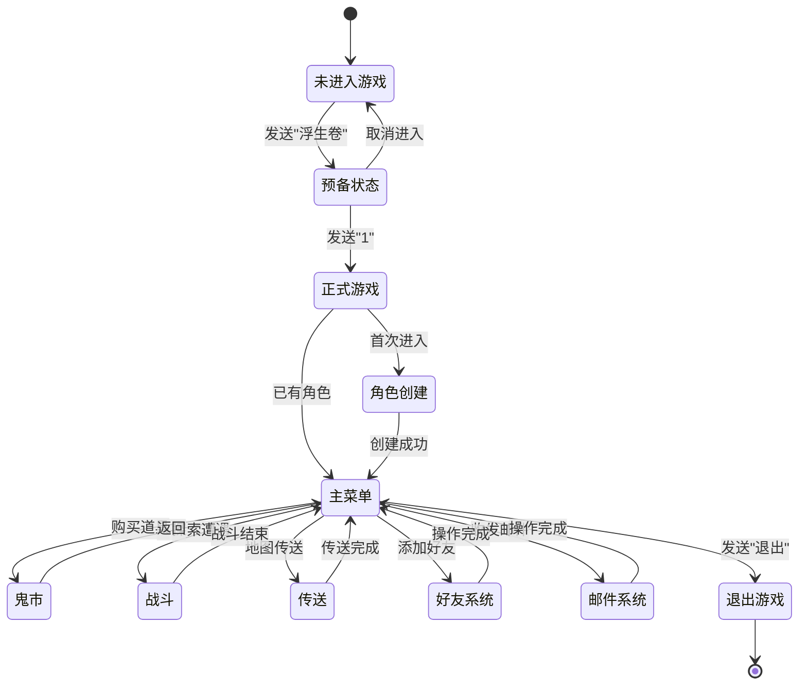
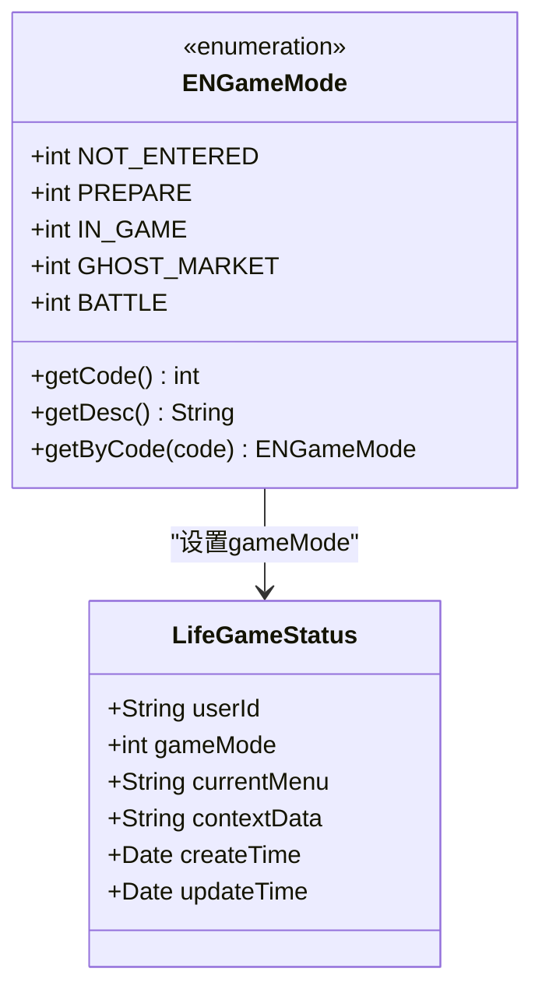

# 基础操作

<cite>
**本文档引用的文件**
- [LifeHandlerImpl.java](file://Life/src/main/java/com/bot/life/service/impl/LifeHandlerImpl.java)
- [ENGameMode.java](file://Life/src/main/java/com/bot/life/enums/ENGameMode.java)
- [Life_User_Manual.md](file://Life_User_Manual.md)
- [MainMenuPrinter.java](file://Base/src/main/java/com/bot/base/chain/menu/MainMenuPrinter.java)
- [GameMenuPrinter.java](file://Base/src/main/java/com/bot/base/chain/menu/GameMenuPrinter.java)
- [GameMainMenuPrinter.java](file://Game/src/main/java/com/bot/game/chain/menu/GameMainMenuPrinter.java)
- [PlayerServiceImpl.java](file://Life/src/main/java/com/bot/life/service/impl/PlayerServiceImpl.java)
</cite>

## 目录
1. [游戏概述](#游戏概述)
2. [游戏入口流程](#游戏入口流程)
3. [角色创建系统](#角色创建系统)
4. [游戏主菜单](#游戏主菜单)
5. [退出游戏](#退出游戏)
6. [游戏状态管理](#游戏状态管理)
7. [新手操作指南](#新手操作指南)

## 游戏概述

浮生卷是一款修仙主题的文字RPG游戏，集成在聊天机器人中。玩家通过文字指令进行游戏，所有游戏界面以图片形式展示。游戏采用多阶段的状态管理模式，支持完整的角色创建、游戏进行和退出流程。



**图表来源**
- [LifeHandlerImpl.java](file://Life/src/main/java/com/bot/life/service/impl/LifeHandlerImpl.java#L148-L166)
- [ENGameMode.java](file://Life/src/main/java/com/bot/life/enums/ENGameMode.java#L6-L11)

## 游戏入口流程

### 第一步：启动游戏

**指令映射：**
- **触发指令：** `浮生卷`
- **响应内容：** 欢迎界面 + 进入选项说明

**操作步骤：**
1. 在聊天窗口发送 `浮生卷`
2. 系统显示欢迎界面，介绍游戏背景
3. 显示进入选项：
   - 发送 `1` 正式进入游戏
   - 发送其他内容取消进入

**代码实现路径：** [`handleGameEntry()`](file://Life/src/main/java/com/bot/life/service/impl/LifeHandlerImpl.java#L174-L195)

### 第二步：确认进入

**指令映射：**
- **确认指令：** `1`
- **取消指令：** 任意其他内容

**状态转换：**
- 输入 `1` → 进入 `PREPARE`（预备状态）
- 输入其他内容 → 返回 `NOT_ENTERED`（未进入）

**代码实现路径：** [`handlePrepareMode()`](file://Life/src/main/java/com/bot/life/service/impl/LifeHandlerImpl.java#L197-L218)

**节来源**
- [LifeHandlerImpl.java](file://Life/src/main/java/com/bot/life/service/impl/LifeHandlerImpl.java#L174-L218)
- [Life_User_Manual.md](file://Life_User_Manual.md#L9-L18)

## 角色创建系统

### 创建前检查

在正式进入游戏前，系统会检查玩家是否已有角色：

**检查逻辑：**
1. 查询玩家是否存在现有角色
2. 如果存在角色，直接进入主菜单
3. 如果不存在角色，进入角色创建流程

**代码实现路径：** [`handlePrepareMode()`](file://Life/src/main/java/com/bot/life/service/impl/LifeHandlerImpl.java#L204-L210)

### 角色创建格式

**标准格式：** `昵称-派系`

**示例：**
- `张三-金`
- `李四-木`
- `王五-水`

### 角色属性验证

系统对角色创建信息进行严格验证：

| 验证项目 | 验证规则 | 错误提示 |
|---------|---------|---------|
| 格式验证 | 必须包含"-"且只有两部分 | "格式错误！请按照格式输入：昵称-派系" |
| 昵称长度 | 不能超过7个字 | "昵称不能超过7个字！" |
| 字符类型 | 只能包含中文字符 | "昵称只能包含中文！" |
| 唯一性 | 昵称不能与其他玩家重复 | "昵称已被使用，请选择其他昵称！" |
| 派系验证 | 必须是金、木、水、火、土之一 | "派系错误！请选择：金、木、水、火、土" |

**代码实现路径：** [`handleCharacterCreation()`](file://Life/src/main/java/com/bot/life/service/impl/LifeHandlerImpl.java#L337-L382)

### 派系特性对比

| 派系 | 特色描述 | 攻击力 | 防御力 | 养成难度 |
|------|---------|--------|--------|----------|
| 金 | 强大破坏力，一力破万法 | ★★★★★ | ★★ | ★★★★ |
| 木 | 强大恢复能力，治疗用毒 | ★★★ | ★★★★ | ★★★ |
| 水 | 包容万物，各领域涉及 | ★★★★ | ★★★★ | ★★★★ |
| 火 | 持续伤害，可观爆发力 | ★★★★ | ★★★ | ★★★ |
| 土 | 超强防御，不俗控制力 | ★★★ | ★★★★★ | ★★★★★ |

### 角色初始化属性

创建成功后，系统会初始化以下基础属性：

| 属性类别 | 初始值 | 说明 |
|---------|--------|------|
| 基础属性 | 1 | 速度、体质、灵力、力量 |
| 血量 | 10/10 | 当前血量/最大血量 |
| 防御 | 1 | 基础防御力 |
| 攻击力 | 6 | 普通攻击伤害 |
| 会心率 | 0% | 暴击概率 |
| 会心效果 | 110% | 暴击伤害倍数 |
| 体力 | 100/100 | 当前体力/最大体力 |
| 灵粹 | 1000 | 游戏货币 |
| 地图 | 1 | 默认初始地图 |

**代码实现路径：** [`createPlayer()`](file://Life/src/main/java/com/bot/life/service/impl/PlayerServiceImpl.java#L53-L87)

**节来源**
- [LifeHandlerImpl.java](file://Life/src/main/java/com/bot/life/service/impl/LifeHandlerImpl.java#L317-L382)
- [PlayerServiceImpl.java](file://Life/src/main/java/com/bot/life/service/impl/PlayerServiceImpl.java#L44-L87)
- [Life_User_Manual.md](file://Life_User_Manual.md#L21-L41)

## 游戏主菜单

### 主菜单功能列表

进入游戏后，玩家可以通过发送对应数字访问各种功能：

| 数字 | 功能名称 | 指令格式 | 主要用途 |
|------|---------|---------|---------|
| 0 | 每日签到 | `0` | 领取每日奖励 |
| 1 | 角色信息 | `1` | 查看详细属性面板 |
| 2 | 游历探索 | `2` | 随机遭遇怪物战斗 |
| 3 | 地图传送 | `3` | 前往其他地图 |
| 4 | 查看背包 | `4` | 管理道具和装备 |
| 5 | 鬼市交易 | `5` | 购买道具或摆摊交易 |
| 6 | 好友系统 | `6` | 管理好友关系 |
| 7 | 邮件中心 | `7` | 收发邮件 |
| 8 | 成就记录 | `8` | 查看已完成成就 |
| 9 | 技能修炼 | `9` | 学习和管理技能 |
| 11 | 境界突破 | `11` 或 `境界` | 查看和尝试突破境界 |

### 主菜单显示内容

主菜单包含以下信息：

1. **血量恢复提示**（如有）
2. **功能菜单表格**
3. **世界BOSS信息**（如果当前地图有活跃BOSS）
4. **操作提示**

**代码实现路径：** [`showMainMenu()`](file://Life/src/main/java/com/bot/life/service/impl/LifeHandlerImpl.java#L385-L432)

### 自动恢复机制

主菜单加载时会触发以下自动恢复：
- **血量恢复**：根据恢复算法计算并应用
- **修为增长**：根据修炼速度计算
- **体力恢复**：每5分钟恢复1点体力

**代码实现路径：** [`showMainMenu()`](file://Life/src/main/java/com/bot/life/service/impl/LifeHandlerImpl.java#L397-L406)

**节来源**
- [LifeHandlerImpl.java](file://Life/src/main/java/com/bot/life/service/impl/LifeHandlerImpl.java#L385-L432)
- [Life_User_Manual.md](file://Life_User_Manual.md#L86-L96)

## 退出游戏

### 退出指令

在游戏模式中，随时可以通过发送 `退出` 来退出游戏模式。

**退出流程：**
1. 发送 `退出` 指令
2. 系统重置游戏状态
3. 清理战斗状态
4. 返回正常聊天模式

### 状态清理

退出时系统会执行以下清理操作：

**游戏状态重置：**
- 游戏模式设置为 `NOT_ENTERED`
- 清空当前菜单状态
- 清空上下文数据
- 更新时间戳

**战斗状态清理：**
- 检查并结束正在进行的战斗
- 清理战斗相关的临时数据

**代码实现路径：** [`exit()`](file://Life/src/main/java/com/bot/life/service/impl/LifeHandlerImpl.java#L128-L144)

### 退出确认

系统会返回确认消息："已退出浮生卷游戏模式"

**节来源**
- [LifeHandlerImpl.java](file://Life/src/main/java/com/bot/life/service/impl/LifeHandlerImpl.java#L128-L144)
- [Life_User_Manual.md](file://Life_User_Manual.md#L17-L19)

## 游戏状态管理

### 游戏模式枚举

游戏采用状态机模式管理不同阶段：



**图表来源**
- [ENGameMode.java](file://Life/src/main/java/com/bot/life/enums/ENGameMode.java#L6-L37)
- [LifeHandlerImpl.java](file://Life/src/main/java/com/bot/life/service/impl/LifeHandlerImpl.java#L831-L841)

### 状态转换表

| 当前状态 | 下一步操作 | 新状态 | 触发条件 |
|---------|-----------|--------|---------|
| NOT_ENTERED | 发送"浮生卷" | PREPARE | 用户请求进入游戏 |
| PREPARE | 发送"1" | IN_GAME | 用户确认进入 |
| PREPARE | 其他内容 | NOT_ENTERED | 用户取消 |
| IN_GAME | 发送"退出" | NOT_ENTERED | 用户主动退出 |
| IN_GAME | 进入鬼市 | GHOST_MARKET | 用户选择购买功能 |
| IN_GAME | 开始战斗 | BATTLE | 遭遇怪物 |
| GHOST_MARKET | 返回 | IN_GAME | 完成交易 |
| BATTLE | 战斗结束 | IN_GAME | 战斗完成 |

### 状态持久化

游戏状态通过数据库持久化存储：

**核心字段：**
- `userId`：用户唯一标识
- `gameMode`：当前游戏模式
- `currentMenu`：当前菜单状态
- `contextData`：上下文数据
- `createTime`：创建时间
- `updateTime`：最后更新时间

**代码实现路径：** [`getOrCreateGameStatus()`](file://Life/src/main/java/com/bot/life/service/impl/LifeHandlerImpl.java#L831-L841)

**节来源**
- [ENGameMode.java](file://Life/src/main/java/com/bot/life/enums/ENGameMode.java#L6-L37)
- [LifeHandlerImpl.java](file://Life/src/main/java/com/bot/life/service/impl/LifeHandlerImpl.java#L831-L841)

## 新手操作指南

### 第一次游戏流程

1. **启动游戏**
   ```
   发送：浮生卷
   系统回复：欢迎来到浮生卷...
   ```

2. **确认进入**
   ```
   发送：1
   系统回复：角色创建界面...
   ```

3. **创建角色**
   ```
   发送：张三-金
   系统回复：角色创建成功！欢迎踏上修仙之路...
   ```

4. **进入主菜单**
   ```
   发送：任意内容
   系统回复：主菜单界面...
   ```

### 常见操作示例

**查看角色信息：**
```
发送：1
系统回复：角色属性面板...
```

**探索地图：**
```
发送：2
系统回复：遭遇怪物战斗...
```

**传送地图：**
```
发送：3
系统回复：可传送地图列表...
发送：1（选择地图）
系统回复：传送成功...
```

**退出游戏：**
```
发送：退出
系统回复：已退出浮生卷游戏模式
```

### 注意事项

1. **指令格式**：严格按照格式发送指令
2. **状态保持**：游戏状态会在一定时间内保持
3. **退出时机**：及时退出避免长时间占用资源
4. **角色创建**：首次进入必须创建角色
5. **派系选择**：根据个人喜好选择适合的派系

### 故障排除

**常见问题及解决方法：**

| 问题描述 | 可能原因 | 解决方法 |
|---------|---------|---------|
| 角色创建失败 | 昵称重复 | 更换其他昵称 |
| 派系错误 | 输入错误 | 重新输入正确的派系：金、木、水、火、土 |
| 游戏卡住 | 网络延迟 | 稍等片刻或重新发送指令 |
| 无法退出 | 系统异常 | 等待系统自动超时或联系管理员 |

**节来源**
- [Life_User_Manual.md](file://Life_User_Manual.md#L1-L257)