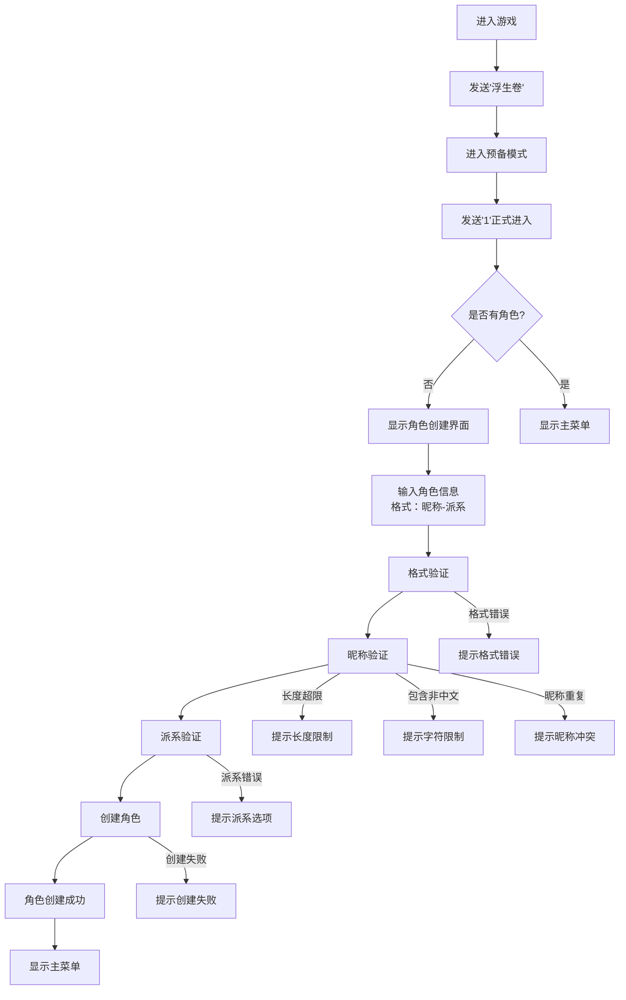
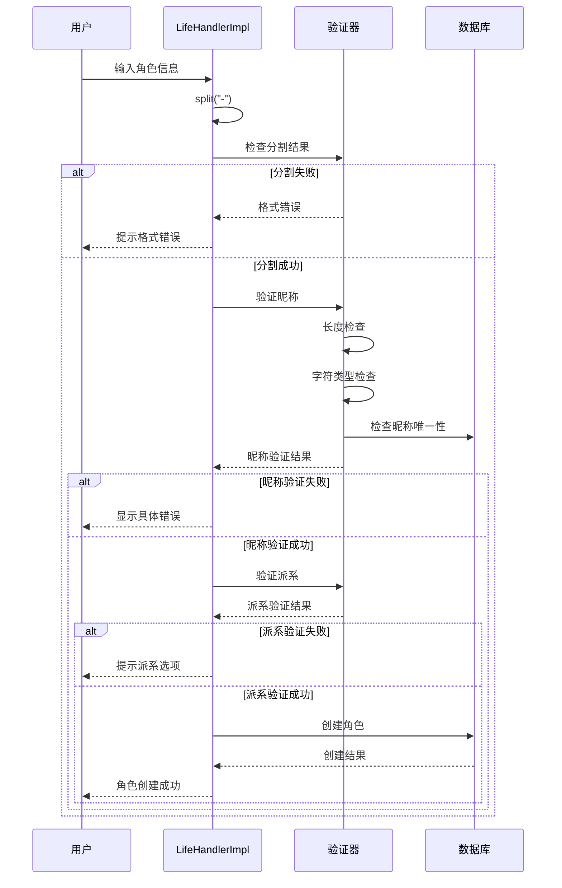
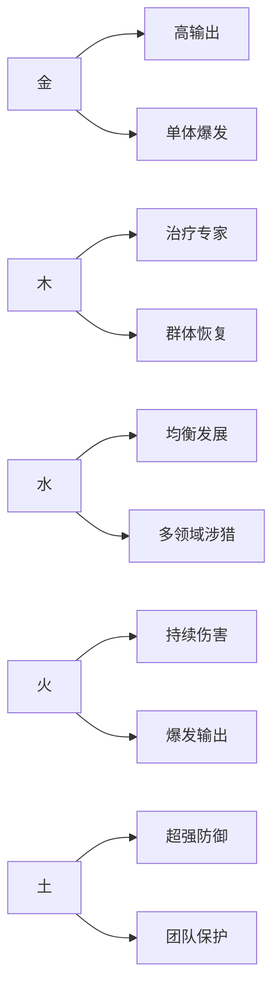
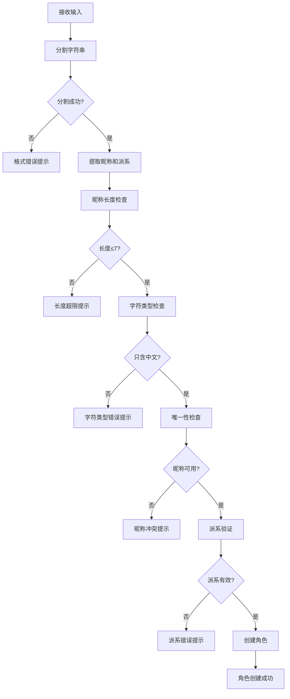
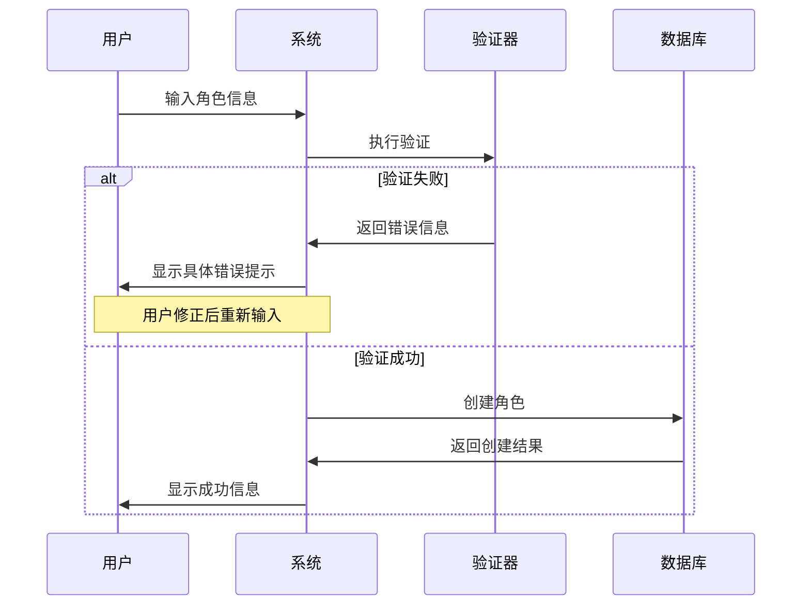
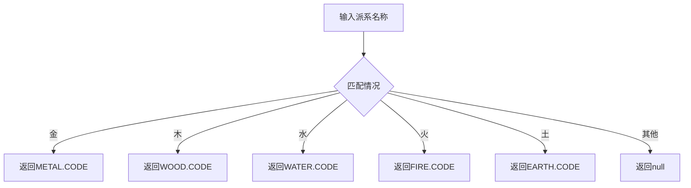
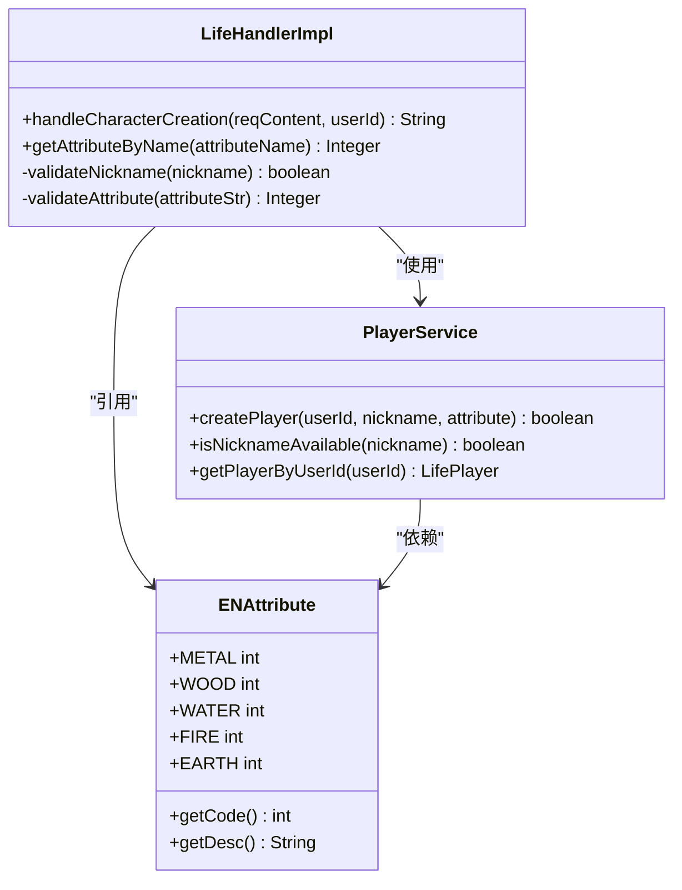

# 角色创建操作文档

<cite>
**本文档引用的文件**
- [Life_User_Manual.md](file://Life_User_Manual.md)
- [LifeHandlerImpl.java](file://Life\src\main\java\com\bot\life\service\impl\LifeHandlerImpl.java)
- [PlayerService.java](file://Life\src\main\java\com\bot\life\service\PlayerService.java)
- [MainMenuPrinter.java](file://Base\src\main\java\com\bot\base\chain\menu\MainMenuPrinter.java)
- [ENAttribute.java](file://Life\src\main\java\com\bot\life\enums\ENAttribute.java)
</cite>

## 目录
1. [简介](#简介)
2. [角色创建流程概览](#角色创建流程概览)
3. [角色创建格式要求](#角色创建格式要求)
4. [昵称验证规则](#昵称验证规则)
5. [派系属性差异](#派系属性差异)
6. [创建步骤详解](#创建步骤详解)
7. [错误处理机制](#错误处理机制)
8. [代码验证逻辑分析](#代码验证逻辑分析)
9. [最佳实践建议](#最佳实践建议)
10. [故障排除指南](#故障排除指南)

## 简介

浮生卷是一款修仙主题的文字RPG游戏，新用户首次进入游戏时需要创建角色。角色创建是游戏旅程的第一步，决定了玩家的初始属性和游戏风格。本文档详细说明了角色创建的操作流程、格式要求和注意事项。

## 角色创建流程概览

**图表来源**
- [LifeHandlerImpl.java](file://Life\src\main\java\com\bot\life\service\impl\LifeHandlerImpl.java#L197-L218)
- [LifeHandlerImpl.java](file://Life\src\main\java\com\bot\life\service\impl\LifeHandlerImpl.java#L337-L382)

## 角色创建格式要求

### 基本格式

角色创建采用严格的`昵称-派系`格式，这是游戏的核心识别标准：

- **格式规范**：`昵称-派系`
- **示例**：`张三-金`、`小明-木`、`云中鹤-水`
- **分隔符**：必须使用英文连字符`-`作为分隔符

### 格式验证逻辑

**图表来源**
- [LifeHandlerImpl.java](file://Life\src\main\java\com\bot\life\service\impl\LifeHandlerImpl.java#L337-L382)

**节来源**
- [LifeHandlerImpl.java](file://Life\src\main\java\com\bot\life\service\impl\LifeHandlerImpl.java#L337-L382)
- [Life_User_Manual.md](file://Life_User_Manual.md#L23-L31)

## 昵称验证规则

### 长度限制

- **最大长度**：7个汉字字符
- **验证逻辑**：使用`nickname.length() > 7`进行检查
- **错误提示**：`昵称不能超过7个字！`

### 字符类型限制

- **允许字符**：仅支持中文字符（Unicode范围：`\u4e00-\u9fa5`）
- **验证逻辑**：使用正则表达式`[\\u4e00-\\u9fa5]+`检查
- **错误提示**：`昵称只能包含中文！`

### 唯一性检查

- **检查机制**：数据库查询确认昵称未被占用
- **验证方法**：调用`playerService.isNicknameAvailable(nickname)`
- **错误提示**：`昵称已被使用，请选择其他昵称！`

### 验证流程表

| 验证项目 | 验证条件 | 错误提示 |
|---------|---------|---------|
| 格式分割 | 分割结果长度≠2 | 格式错误！请按照格式输入：昵称-派系 |
| 长度检查 | nickname.length() > 7 | 昵称不能超过7个字！ |
| 字符类型 | !nickname.matches("[\\u4e00-\\u9fa5]+") | 昵称只能包含中文！ |
| 唯一性检查 | !isNicknameAvailable(nickname) | 昵称已被使用，请选择其他昵称！ |

**节来源**
- [LifeHandlerImpl.java](file://Life\src\main\java\com\bot\life\service\impl\LifeHandlerImpl.java#L346-L356)

## 派系属性差异

### 可选派系列表

| 派系 | 特色描述 | 攻击力评分 | 防御力评分 | 养成难度评分 |
|------|---------|-----------|-----------|-------------|
| 金 | 强大破坏力，一力破万法 | ★★★★★ | ★★ | ★★★★ |
| 木 | 强大恢复能力，治疗用毒 | ★★★ | ★★★★ | ★★★ |
| 水 | 包容万物，各领域涉及 | ★★★★ | ★★★★ | ★★★★ |
| 火 | 持续伤害，可观爆发力 | ★★★★ | ★★★ | ★★★ |
| 土 | 超强防御，不俗控制力 | ★★★ | ★★★★★ | ★★★★★ |

### 派系特性对比

**图表来源**
- [Life_User_Manual.md](file://Life_User_Manual.md#L33-L41)

### 派系选择建议

- **新手推荐**：水系（均衡发展，适合各种玩法）
- **喜欢输出**：金系或火系（高攻击力，爆发能力强）
- **喜欢辅助**：木系（治疗能力强，生存能力好）
- **喜欢坦克**：土系（超高防御，团队保护）

**节来源**
- [Life_User_Manual.md](file://Life_User_Manual.md#L33-L41)
- [LifeHandlerImpl.java](file://Life\src\main\java\com\bot\life\service\impl\LifeHandlerImpl.java#L820-L827)

## 创建步骤详解

### 第一步：进入游戏准备模式

1. 在聊天窗口发送`浮生卷`
2. 系统显示欢迎界面
3. 发送`1`进入正式游戏模式
4. 系统检测是否有角色

### 第二步：输入角色信息

- **格式要求**：`昵称-派系`
- **示例**：`李逍遥-金`、`白芷仙子-木`
- **注意事项**：
  - 使用英文连字符`-`分隔
  - 昵称为中文字符
  - 派系为金、木、水、火、土之一

### 第三步：系统验证过程

**图表来源**
- [LifeHandlerImpl.java](file://Life\src\main\java\com\bot\life\service\impl\LifeHandlerImpl.java#L337-L382)

### 第四步：角色创建完成

- 系统显示创建成功的欢迎信息
- 自动跳转到游戏主菜单
- 开始修仙之旅

**节来源**
- [LifeHandlerImpl.java](file://Life\src\main\java\com\bot\life\service\impl\LifeHandlerImpl.java#L317-L382)

## 错误处理机制

### 常见错误类型

#### 1. 格式错误
- **原因**：未按`昵称-派系`格式输入
- **表现**：分割结果长度不为2
- **解决方案**：检查输入格式，确保使用英文连字符

#### 2. 昵称长度超限
- **原因**：昵称超过7个汉字
- **表现**：`nickname.length() > 7`
- **解决方案**：缩短昵称至7个字以内

#### 3. 字符类型错误
- **原因**：昵称包含非中文字符
- **表现**：不符合正则表达式`[\\u4e00-\\u9fa5]+`
- **解决方案**：使用纯中文字符

#### 4. 昵称冲突
- **原因**：昵称已被其他玩家使用
- **表现**：`!isNicknameAvailable(nickname)`
- **解决方案**：选择其他昵称

#### 5. 派系错误
- **原因**：派系名称不在可选范围内
- **表现**：`getAttributeByName(attributeStr) == null`
- **解决方案**：使用金、木、水、火、土之一

### 错误处理流程

**图表来源**
- [LifeHandlerImpl.java](file://Life\src\main\java\com\bot\life\service\impl\LifeHandlerImpl.java#L337-L382)

**节来源**
- [LifeHandlerImpl.java](file://Life\src\main\java\com\bot\life\service\impl\LifeHandlerImpl.java#L337-L382)

## 代码验证逻辑分析

### 核心验证方法

#### handleCharacterCreation 方法

该方法是角色创建的核心逻辑，包含完整的验证和创建流程：

**主要验证步骤**：
1. **格式分割验证**：检查输入是否包含一个连字符
2. **昵称长度验证**：确保不超过7个字符
3. **字符类型验证**：确认只包含中文字符
4. **唯一性验证**：检查昵称是否已被使用
5. **派系有效性验证**：确认派系名称正确
6. **角色创建**：调用服务层创建角色

#### getAttributeByName 方法

负责将中文派系名称转换为内部代码：

**图表来源**
- [LifeHandlerImpl.java](file://Life\src\main\java\com\bot\life\service\impl\LifeHandlerImpl.java#L820-L827)

### 数据验证架构

**图表来源**
- [LifeHandlerImpl.java](file://Life\src\main\java\com\bot\life\service\impl\LifeHandlerImpl.java#L337-L382)
- [PlayerService.java](file://Life\src\main\java\com\bot\life\service\PlayerService.java#L18-L25)
- [ENAttribute.java](file://Life\src\main\java\com\bot\life\enums\ENAttribute.java#L8-L12)

**节来源**
- [LifeHandlerImpl.java](file://Life\src\main\java\com\bot\life\service\impl\LifeHandlerImpl.java#L337-L382)
- [LifeHandlerImpl.java](file://Life\src\main\java\com\bot\life\service\impl\LifeHandlerImpl.java#L820-L827)

## 最佳实践建议

### 昵称命名建议

1. **简洁明了**：选择简短易记的昵称
2. **特色鲜明**：体现个人特点或游戏风格
3. **避免雷同**：选择独特昵称，避免与他人重复
4. **文化内涵**：可考虑使用有意义的中文词汇

### 派系选择策略

1. **根据兴趣选择**：选择自己喜欢的游戏风格
2. **考虑团队配合**：如果经常组队，考虑团队需求
3. **平衡发展**：水系适合各种玩法，易于上手
4. **专业专精**：金火适合追求高输出，木土适合稳健玩法

### 创建时机建议

1. **空闲时间**：选择网络稳定、时间充裕时创建
2. **首次尝试**：建议新手选择水系，便于适应游戏
3. **多次尝试**：如果创建失败，可稍作修改后重试

## 故障排除指南

### 常见问题及解决方案

#### 问题1：角色创建总是失败

**可能原因**：
- 昵称已被使用
- 输入格式不正确
- 网络连接不稳定

**解决步骤**：
1. 检查输入格式是否为`昵称-派系`
2. 更换昵称，确保唯一性
3. 重新发送创建请求
4. 检查网络连接状态

#### 问题2：派系选择提示错误

**可能原因**：
- 派系名称拼写错误
- 使用了非标准派系名称

**解决步骤**：
1. 确认使用标准派系名称：金、木、水、火、土
2. 检查大小写是否正确
3. 确保没有多余空格

#### 问题3：昵称长度限制

**可能原因**：
- 昵称超过7个字符
- 包含非中文字符

**解决步骤**：
1. 缩短昵称至7个字符以内
2. 确保只使用中文字符
3. 排除隐藏字符或空格

### 技术支持联系方式

- **游戏客服**：通过游戏内邮件系统联系
- **社区论坛**：访问官方游戏社区寻求帮助
- **常见问题**：参考游戏内帮助文档

**节来源**
- [LifeHandlerImpl.java](file://Life\src\main\java\com\bot\life\service\impl\LifeHandlerImpl.java#L337-L382)

## 结论

角色创建是浮生卷游戏的重要环节，正确的创建流程和格式要求确保了游戏的公平性和趣味性。通过本文档的详细说明，新用户可以：

1. 理解角色创建的基本概念和重要性
2. 掌握正确的输入格式和验证规则
3. 了解不同派系的特点和选择策略
4. 学会处理常见的创建问题
5. 获得最佳的游戏体验建议

记住，角色创建一旦完成将无法更改，因此请仔细考虑您的选择。祝您在浮生卷的修仙之旅中取得成功！