# 进入游戏操作文档

<cite>
**本文档引用的文件**
- [Life_User_Manual.md](file://Life_User_Manual.md)
- [LifeHandlerImpl.java](file://Life\src\main\java\com\bot\life\service\impl\LifeHandlerImpl.java)
- [ENGameMode.java](file://Life\src\main\java\com\bot\life\enums\ENGameMode.java)
- [LifeGameStatus.java](file://Life\src\main\java\com\bot\life\dao\entity\LifeGameStatus.java)
- [ImageGenerationService.java](file://Life\src\main\java\com\bot\life\service\ImageGenerationService.java)
- [ImageGenerationServiceImpl.java](file://Life\src\main\java\com\bot\life\service\impl\ImageGenerationServiceImpl.java)
</cite>

## 目录
1. [概述](#概述)
2. [游戏入口流程架构](#游戏入口流程架构)
3. [状态管理系统](#状态管理系统)
4. [欢迎界面生成机制](#欢迎界面生成机制)
5. [确认进入交互逻辑](#确认进入交互逻辑)
6. [角色创建流程](#角色创建流程)
7. [主菜单展示](#主菜单展示)
8. [错误处理与异常情况](#错误处理与异常情况)
9. [性能优化考虑](#性能优化考虑)
10. [故障排除指南](#故障排除指南)

## 概述

浮生卷游戏的进入操作是玩家开始修仙之旅的第一步。通过发送"浮生卷"指令，玩家将经历一个精心设计的状态转换流程，从初始状态逐步过渡到游戏主界面。该流程包含欢迎界面展示、确认进入交互、角色创建（如果需要）以及主菜单展示等多个关键环节。

## 游戏入口流程架构

**图表来源**
- [LifeHandlerImpl.java](file://Life\src\main\java\com\bot\life\service\impl\LifeHandlerImpl.java#L148-L218)

**节来源**
- [LifeHandlerImpl.java](file://Life\src\main\java\com\bot\life\service\impl\LifeHandlerImpl.java#L148-L218)

## 状态管理系统

浮生卷游戏采用基于枚举的状态管理机制，通过ENGameMode枚举定义了四种主要游戏状态：

**图表来源**
- [ENGameMode.java](file://Life\src\main\java\com\bot\life\enums\ENGameMode.java#L8-L12)

### 状态转换机制

系统通过LifeGameStatus实体维护玩家的游戏状态，包含以下关键字段：

| 字段名 | 类型 | 描述 | 默认值 |
|--------|------|------|--------|
| userId | String | 用户唯一标识 | - |
| gameMode | Integer | 游戏模式状态码 | 0 (未进入) |
| currentMenu | String | 当前菜单状态 | null |
| contextData | String | JSON格式上下文数据 | null |
| createTime | Date | 创建时间 | 当前时间 |
| updateTime | Date | 更新时间 | 当前时间 |

**节来源**
- [LifeGameStatus.java](file://Life\src\main\java\com\bot\life\dao\entity\LifeGameStatus.java#L13-L20)

## 欢迎界面生成机制

当玩家发送"浮生卷"指令后，系统会调用handleGameEntry方法生成欢迎界面。该过程包含以下关键步骤：

### 欢迎界面内容结构

欢迎界面采用统一的文本格式，包含以下元素：
- 游戏标题和简介
- 游戏特色说明
- 操作指引
- 退出说明

### 图片生成流程

```mermaid
sequenceDiagram
participant User as 用户
participant Handler as LifeHandlerImpl
participant ImageGen as ImageGenerationService
participant FileSystem as 文件系统
User->>Handler : 发送'浮生卷'
Handler->>Handler : 验证输入内容
Handler->>Handler : 设置PREPARE状态
Handler->>ImageGen : generateGameImage(欢迎内容)
ImageGen->>FileSystem : 加载背景图片
ImageGen->>ImageGen : 设置图形上下文
ImageGen->>ImageGen : 绘制文本内容
ImageGen->>FileSystem : 保存图片文件
ImageGen-->>Handler : 返回图片URL
Handler-->>User : 发送欢迎界面图片
```

**图表来源**
- [LifeHandlerImpl.java](file://Life\src\main\java\com\bot\life\service\impl\LifeHandlerImpl.java#L174-L191)
- [ImageGenerationServiceImpl.java](file://Life\src\main\java\com\bot\life\service\impl\ImageGenerationServiceImpl.java#L44-L75)

**节来源**
- [LifeHandlerImpl.java](file://Life\src\main\java\com\bot\life\service\impl\LifeHandlerImpl.java#L174-L191)

## 确认进入交互逻辑

在显示欢迎界面后，系统进入等待用户确认的阶段。用户有两种选择：

### 正确确认流程
- 用户发送数字"1"
- 系统验证输入有效性
- 设置游戏状态为IN_GAME
- 检查是否存在角色
- 根据角色存在情况跳转到相应界面

### 取消进入流程
- 用户发送任何非"1"的内容
- 系统重置游戏状态为NOT_ENTERED
- 返回取消确认消息

### 状态持久化

每次状态变更都会通过gameStatusMapper.updateByPrimaryKey()方法持久化到数据库，确保状态的一致性和可靠性。

**节来源**
- [LifeHandlerImpl.java](file://Life\src\main\java\com\bot\life\service\impl\LifeHandlerImpl.java#L197-L218)

## 角色创建流程

如果玩家是首次进入游戏，系统会引导其创建角色。角色创建包含严格的验证机制：

### 角色信息格式验证

**图表来源**
- [LifeHandlerImpl.java](file://Life\src\main\java\com\bot\life\service\impl\LifeHandlerImpl.java#L337-L382)

### 派系特性说明

系统提供了详细的派系介绍，帮助玩家做出选择：

| 派系 | 攻击力 | 防御力 | 养成难度 | 特色描述 |
|------|--------|--------|----------|----------|
| 金 | ★★★★★ | ★★ | ★★★★ | 强大破坏力，一力破万法 |
| 木 | ★★★ | ★★★★ | ★★★ | 强大恢复能力，治疗用毒 |
| 水 | ★★★★ | ★★★★ | ★★★★ | 包容万物，各领域涉及 |
| 火 | ★★★★ | ★★★ | ★★★ | 持续伤害，可观爆发力 |
| 土 | ★★★ | ★★★★★ | ★★★★★ | 超强防御，不俗控制力 |

**节来源**
- [LifeHandlerImpl.java](file://Life\src\main\java\com\bot\life\service\impl\LifeHandlerImpl.java#L317-L335)

## 主菜单展示

角色创建完成后或已有角色的玩家进入游戏时，系统会显示主菜单。主菜单包含以下功能模块：

### 主菜单布局

主菜单采用表格形式展示，包含12个功能选项：

| 功能编号 | 功能名称 | 快捷指令 | 功能描述 |
|----------|----------|----------|----------|
| 0 | 每日签到 | 签到 | 领取每日奖励 |
| 1 | 角色信息 | - | 查看详细属性面板 |
| 2 | 游历探索 | - | 随机遭遇怪物战斗 |
| 3 | 地图传送 | - | 前往其他地图 |
| 4 | 查看背包 | - | 管理道具和装备 |
| 5 | 鬼市交易 | - | 购买道具或摆摊交易 |
| 6 | 好友系统 | - | 管理好友关系 |
| 7 | 邮件中心 | - | 收发邮件 |
| 8 | 成就记录 | - | 查看已完成成就 |
| 9 | 技能修炼 | - | 学习和管理技能 |
| 11 | 境界突破 | 突破 | 提升修炼境界 |

### 自动状态更新

主菜单显示时会执行以下自动更新操作：
- 检查并恢复血量
- 增加修为值
- 恢复体力值
- 更新世界BOSS信息

**节来源**
- [LifeHandlerImpl.java](file://Life\src\main\java\com\bot\life\service\impl\LifeHandlerImpl.java#L385-L432)

## 错误处理与异常情况

系统实现了完善的错误处理机制，涵盖各种异常情况：

### 常见错误类型

1. **输入格式错误**
   - 角色创建格式不正确
   - 数字输入超出范围
   - 字符串格式不符合规范

2. **状态异常**
   - 数据库连接失败
   - 状态同步错误
   - 并发访问冲突

3. **资源加载失败**
   - 图片生成服务异常
   - 背景图片缺失
   - 文件系统权限问题

### 错误恢复策略

**节来源**
- [LifeHandlerImpl.java](file://Life\src\main\java\com\bot\life\service\impl\LifeHandlerImpl.java#L337-L382)

## 性能优化考虑

### 图片生成优化

1. **缓存机制**：对于重复的文本内容，考虑实现图片缓存
2. **异步处理**：大型图片生成采用异步方式避免阻塞
3. **资源池管理**：合理管理Graphics2D对象的创建和销毁

### 数据库访问优化

1. **连接池配置**：确保数据库连接池大小合理
2. **批量操作**：对于频繁的状态更新，考虑批量提交
3. **索引优化**：为userId字段建立适当索引

### 内存管理

1. **对象复用**：重用StringBuilder等对象
2. **及时释放**：确保Graphics2D等资源及时释放
3. **垃圾回收**：避免创建大量临时对象

## 故障排除指南

### 常见问题及解决方案

1. **欢迎界面无法显示**
   - 检查图片生成服务是否正常运行
   - 验证背景图片文件是否存在
   - 确认文件写入权限

2. **角色创建失败**
   - 检查数据库连接状态
   - 验证昵称唯一性约束
   - 确认派系参数有效性

3. **状态切换异常**
   - 检查数据库事务完整性
   - 验证状态转换逻辑
   - 确认并发访问控制

### 调试工具和方法

1. **日志记录**：启用详细的日志记录
2. **状态监控**：监控游戏状态变化
3. **性能分析**：分析图片生成性能瓶颈

**节来源**
- [LifeHandlerImpl.java](file://Life\src\main\java\com\bot\life\service\impl\LifeHandlerImpl.java#L830-L842)

## 结论

浮生卷游戏的进入操作设计体现了良好的用户体验和系统架构原则。通过清晰的状态转换、完善的验证机制和友好的用户界面，为玩家提供了流畅的入门体验。系统的模块化设计和错误处理机制确保了稳定性和可维护性，为后续功能扩展奠定了坚实基础。

开发者在维护和扩展此功能时，应重点关注状态一致性、用户体验优化和系统稳定性，确保新功能能够无缝集成到现有的游戏流程中。