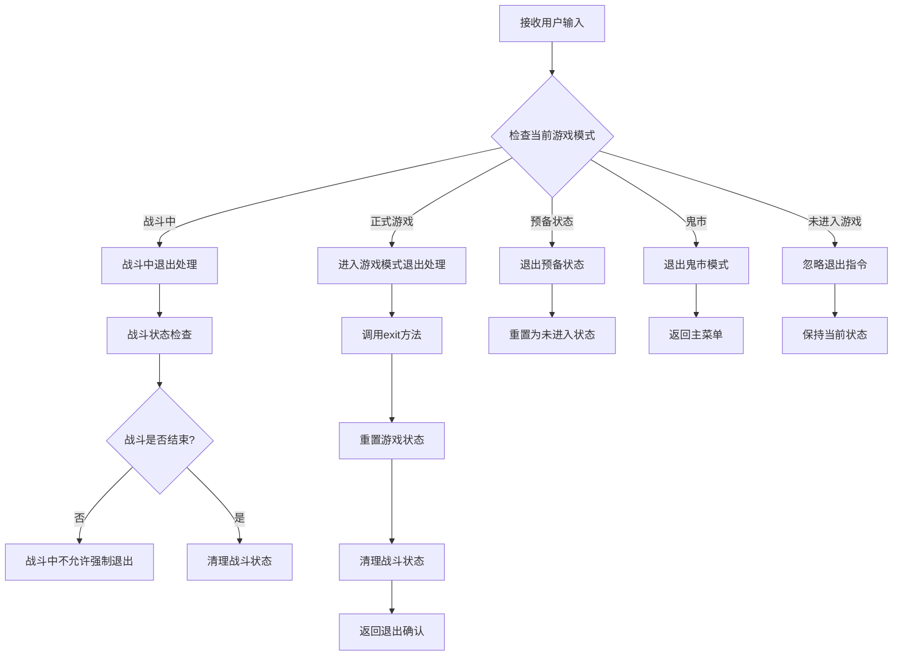
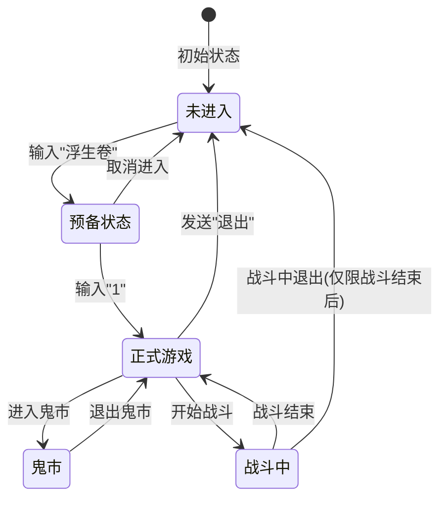
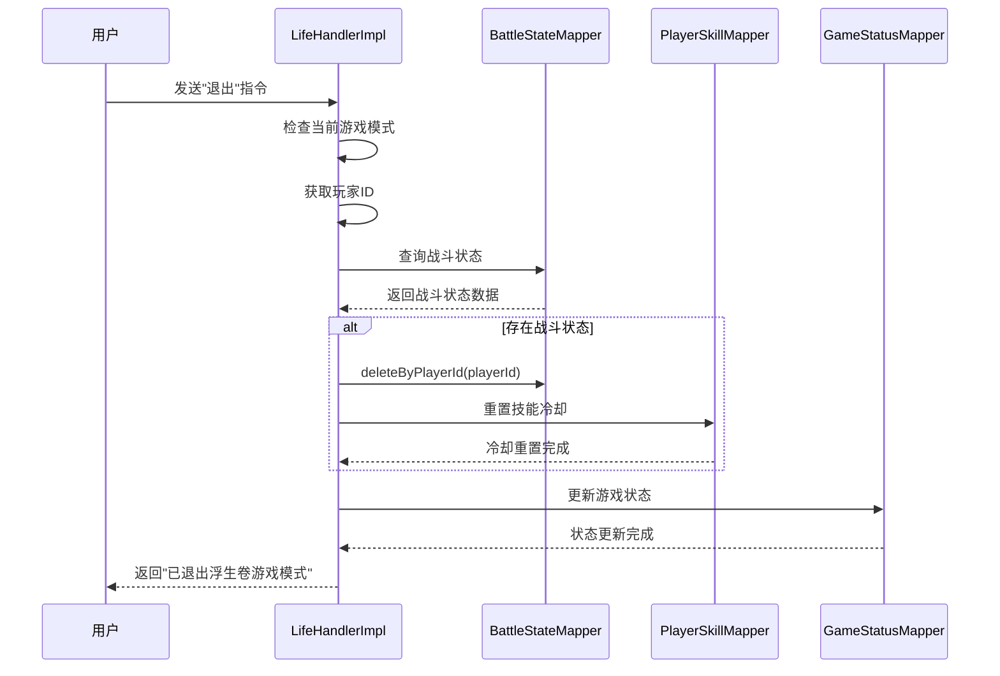

# 退出游戏操作文档

<cite>
**本文档引用的文件**
- [Life_User_Manual.md](file://Life_User_Manual.md)
- [LifeHandlerImpl.java](file://Life\src\main\java\com\bot\life\service\impl\LifeHandlerImpl.java)
- [LifeHandler.java](file://Life\src\main\java\com\bot\life\service\LifeHandler.java)
- [ENGameMode.java](file://Life\src\main\java\com\bot\life\enums\ENGameMode.java)
- [LifeGameStatus.java](file://Life\src\main\java\com\bot\life\dao\entity\LifeGameStatus.java)
- [LifeBattleState.java](file://Life\src\main\java\com\bot\life\dao\entity\LifeBattleState.java)
</cite>

## 目录
1. [概述](#概述)
2. [退出游戏操作流程](#退出游戏操作流程)
3. [系统状态管理机制](#系统状态管理机制)
4. [战斗状态清理](#战斗状态清理)
5. [数据库状态更新](#数据库状态更新)
6. [退出操作的影响](#退出操作的影响)
7. [常见问题与解决方案](#常见问题与解决方案)
8. [总结](#总结)

## 概述

浮生卷游戏提供了灵活的退出机制，允许玩家在任何游戏状态下随时退出游戏模式。退出操作不仅终止当前的游戏会话，还会清理相关的游戏状态和战斗数据，确保系统的整洁性和数据一致性。

根据《浮生卷游戏操作手册》第17-19节的说明，玩家只需在游戏模式中发送"退出"指令即可立即退出游戏模式，返回到正常的聊天状态。

## 退出游戏操作流程

### 退出指令识别



**图表来源**
- [LifeHandlerImpl.java](file://Life\src\main\java\com\bot\life\service\impl\LifeHandlerImpl.java#L221-L224)
- [ENGameMode.java](file://Life\src\main\java\com\bot\life\enums\ENGameMode.java#L8-L12)

### 退出方法实现

退出操作的核心实现在`LifeHandlerImpl.exit()`方法中，该方法负责：

1. **游戏状态重置**：将游戏模式设置为未进入状态
2. **上下文清理**：清除当前菜单和上下文数据
3. **战斗状态清理**：处理可能存在的战斗状态
4. **响应生成**：返回退出确认信息

**章节来源**
- [LifeHandlerImpl.java](file://Life\src\main\java\com\bot\life\service\impl\LifeHandlerImpl.java#L129-L144)

## 系统状态管理机制

### 游戏模式枚举

浮生卷游戏采用状态机模式管理不同的游戏阶段：



**图表来源**
- [ENGameMode.java](file://Life\src\main\java\com\bot\life\enums\ENGameMode.java#L8-L12)

### 状态数据结构

游戏状态通过`LifeGameStatus`实体类管理，包含以下关键字段：

| 字段名 | 类型 | 描述 | 默认值 |
|--------|------|------|--------|
| gameMode | Integer | 游戏模式状态 | 0 (未进入) |
| currentMenu | String | 当前菜单标识 | null |
| contextData | String | 上下文数据(JSON) | null |
| updateTime | Date | 最后更新时间 | 当前时间 |

**章节来源**
- [LifeGameStatus.java](file://Life\src\main\java\com\bot\life\dao\entity\LifeGameStatus.java#L15-L17)

## 战斗状态清理

### 战斗状态实体

战斗状态通过`LifeBattleState`实体类维护，包含战斗过程中的关键数据：

| 字段名 | 类型 | 描述 |
|--------|------|------|
| playerId | Long | 玩家ID |
| monsterId | Long | 怪物ID |
| currentTurn | Integer | 当前回合数 |
| playerHp | Integer | 玩家当前血量 |
| monsterHp | Integer | 怪物当前血量 |
| monsterSkillCooldowns | String | 怪物技能冷却状态(JSON) |
| playerBuffs | String | 玩家buff状态(JSON) |
| monsterBuffs | String | 怪物buff状态(JSON) |

### 战斗清理流程



**图表来源**
- [LifeHandlerImpl.java](file://Life\src\main\java\com\bot\life\service\impl\LifeHandlerImpl.java#L138-L144)
- [LifeHandlerImpl.java](file://Life\src\main\java\com\bot\life\service\impl\LifeHandlerImpl.java#L1738-L1744)

**章节来源**
- [LifeHandlerImpl.java](file://Life\src\main\java\com\bot\life\service\impl\LifeHandlerImpl.java#L1738-L1744)
- [LifeBattleState.java](file://Life\src\main\java\com\bot\life\dao\entity\LifeBattleState.java#L12-L24)

## 数据库状态更新

### 状态重置操作

退出操作会执行以下数据库更新操作：

1. **游戏状态更新**：
   ```sql
   UPDATE life_game_status 
   SET game_mode = 0, 
       current_menu = NULL, 
       context_data = NULL, 
       update_time = CURRENT_TIMESTAMP
   WHERE user_id = ?
   ```

2. **战斗状态清理**：
   ```sql
   DELETE FROM life_battle_state 
   WHERE player_id = ?
   ```

3. **技能冷却重置**：
   ```sql
   UPDATE life_player_skill 
   SET current_cooldown = 0 
   WHERE player_id = ?
   ```

### 数据一致性保证

系统通过以下机制确保数据一致性：

- **原子性操作**：退出操作在单个事务中完成
- **状态验证**：检查玩家是否存在和战斗状态
- **时间戳更新**：记录每次状态变更的时间

**章节来源**
- [LifeHandlerImpl.java](file://Life\src\main\java\com\bot\life\service\impl\LifeHandlerImpl.java#L130-L136)

## 退出操作的影响

### 对玩家的影响

退出操作对玩家产生以下影响：

1. **即时退出**：立即停止游戏进程
2. **状态保留**：玩家的角色数据和进度被保存
3. **战斗中断**：正在进行的战斗会被中断
4. **资源保留**：玩家的灵粹、道具、装备等资源不受影响

### 对系统的影响

1. **内存释放**：清理临时缓存和会话数据
2. **数据库更新**：更新游戏状态和时间戳
3. **连接释放**：释放相关的数据库连接
4. **状态同步**：确保所有组件的状态同步

### 对其他玩家的影响

退出操作不会直接影响其他玩家，系统保持独立的玩家状态管理。

## 常见问题与解决方案

### 问题1：战斗中无法退出

**现象**：在战斗中发送"退出"指令没有反应

**原因**：战斗中不允许强制退出，必须分出胜负或逃跑

**解决方案**：
- 完成当前战斗回合
- 选择"逃跑"选项尝试逃离战斗
- 战斗结束后自然退出

### 问题2：退出后状态异常

**现象**：退出后再次进入游戏出现状态错误

**原因**：数据库状态更新失败或网络异常

**解决方案**：
- 检查网络连接稳定性
- 等待系统自动恢复
- 联系管理员处理

### 问题3：战斗状态残留

**现象**：退出后战斗状态仍然存在

**原因**：战斗状态清理失败

**解决方案**：
- 系统自动清理机制
- 管理员手动清理
- 重启服务

## 总结

浮生卷游戏的退出操作设计体现了良好的用户体验和系统设计原则：

1. **用户友好**：简单的"退出"指令即可完成操作
2. **状态安全**：完整的状态管理和清理机制
3. **数据保护**：确保玩家数据的安全性和完整性
4. **系统稳定**：防止状态不一致和资源泄漏

通过本文档的详细说明，用户可以全面了解退出操作的完整流程和系统机制，有助于更好地理解和使用浮生卷游戏的各项功能。