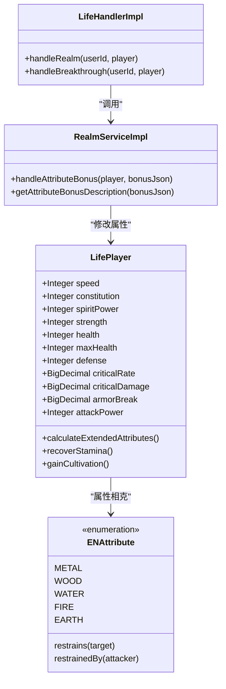
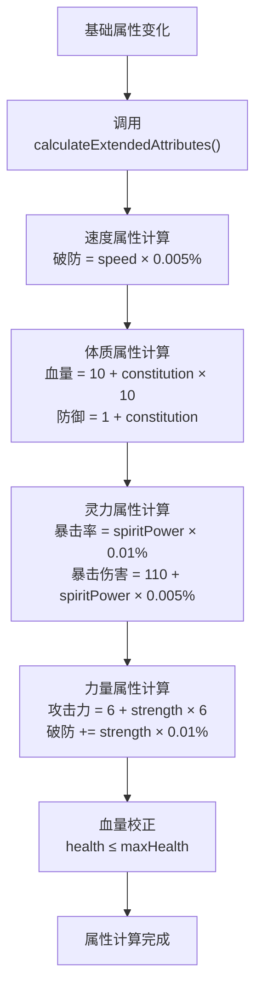
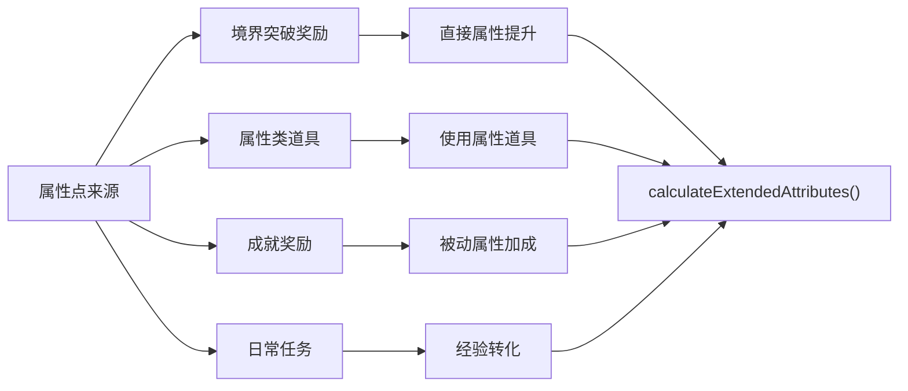
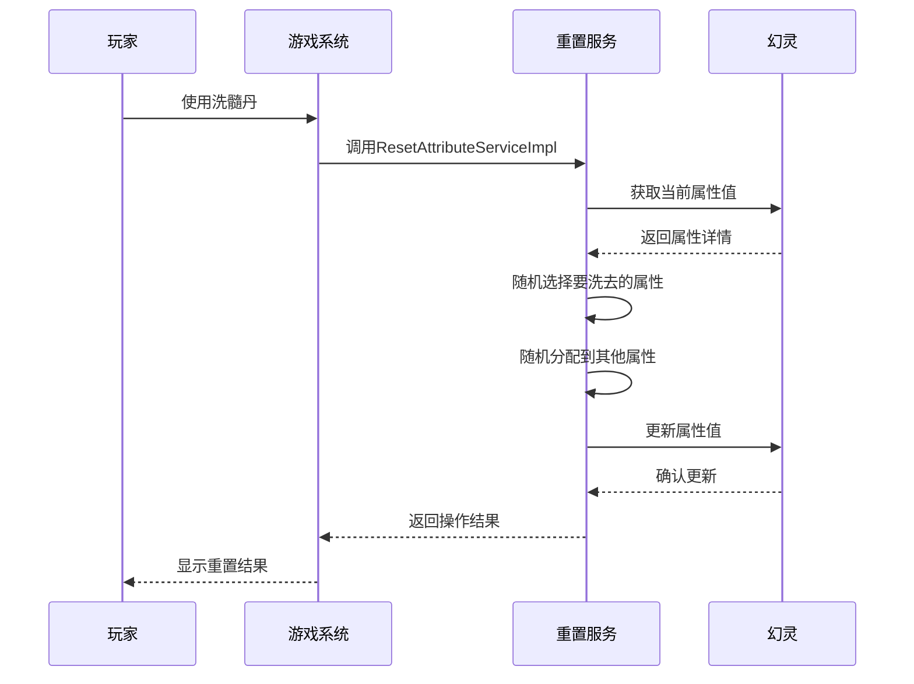

# 基础属性

<cite>
**本文档引用的文件**
- [Life_User_Manual.md](file://Life_User_Manual.md)
- [LifeHandlerImpl.java](file://Life\src\main\java\com\bot\life\service\impl\LifeHandlerImpl.java)
- [LifePlayer.java](file://Life\src\main\java\com\bot\life\dao\entity\LifePlayer.java)
- [RealmServiceImpl.java](file://Life\src\main\java\com\bot\life\service\impl\RealmServiceImpl.java)
- [AddAttributeServiceImpl.java](file://Game\src\main\java\com\bot\game\service\impl\AddAttributeServiceImpl.java)
- [ResetAttributeServiceImpl.java](file://Game\src\main\java\com\bot\game\service\impl\ResetAttributeServiceImpl.java)
- [ENAttribute.java](file://Life\src\main\java\com\bot\life\enums\ENAttribute.java)
- [ENPhantomAttribute.java](file://Game\src\main\java\com\bot\game\enums\ENPhantomAttribute.java)
- [GameConsts.java](file://Common\src\main\java\com\bot\common\constant\GameConsts.java)
- [BaseConsts.java](file://Common\src\main\java\com\bot\common\constant\BaseConsts.java)
</cite>

## 目录
1. [概述](#概述)
2. [基础属性系统架构](#基础属性系统架构)
3. [四大基础属性详解](#四大基础属性详解)
4. [战斗属性计算机制](#战斗属性计算机制)
5. [属性点分配系统](#属性点分配系统)
6. [属性重置与调整](#属性重置与调整)
7. [属性策略建议](#属性策略建议)
8. [总结](#总结)

## 概述

浮生卷游戏的基础属性系统是角色成长的核心机制，通过四大基础属性（速度、体质、灵力、力量）直接影响角色的战斗能力和生存能力。系统采用配置化的属性加成机制，每1点基础属性对应特定的战斗属性提升，形成了完整的角色培养体系。

## 基础属性系统架构



**图表来源**
- [LifePlayer.java](file://Life\src\main\java\com\bot\life\dao\entity\LifePlayer.java#L55-L84)
- [ENAttribute.java](file://Life\src\main\java\com\bot\life\enums\ENAttribute.java#L40-L64)
- [RealmServiceImpl.java](file://Life\src\main\java\com\bot\life\service\impl\RealmServiceImpl.java#L210-L240)

**章节来源**
- [LifePlayer.java](file://Life\src\main\java\com\bot\life\dao\entity\LifePlayer.java#L24-L38)
- [ENAttribute.java](file://Life\src\main\java\com\bot\life\enums\ENAttribute.java#L8-L13)

## 四大基础属性详解

### 1. 速度属性

速度属性决定了角色在战斗中的出手顺序，同时影响破防能力。

**属性特性：**
- 决定战斗行动顺序
- 每增加1点速度，破防能力提升0.005%
- 影响逃跑成功率
- 在属性相克中具有优势地位

**计算公式：**
```java
// 破防计算（速度贡献）
this.armorBreak = BigDecimal.valueOf(speed * 0.005);
```

### 2. 体质属性

体质属性直接影响角色的生命值和防御能力，是生存能力的核心指标。

**属性特性：**
- 每增加1点体质，血量增加10点
- 每增加1点体质，防御力增加1点
- 直接影响角色的生存能力
- 是坦克型角色的重要属性

**计算公式：**
```java
// 血量计算
this.maxHealth = 10 + constitution * 10;
// 防御计算  
this.defense = 1 + constitution;
```

### 3. 灵力属性

灵力属性影响角色的暴击能力和伤害输出效率。

**属性特性：**
- 每增加1点灵力，暴击率提升0.01%
- 每增加1点灵力，暴击伤害提升0.005%
- 影响技能效果和伤害计算
- 是输出型角色的关键属性

**计算公式：**
```java
// 暴击率计算
this.criticalRate = BigDecimal.valueOf(spiritPower * 0.01);
// 暴击伤害计算
this.criticalDamage = BigDecimal.valueOf(110 + spiritPower * 0.005);
```

### 4. 力量属性

力量属性直接提升角色的攻击力和破防能力。

**属性特性：**
- 每增加1点力量，攻击力增加6点
- 每增加1点力量，破防能力提升0.01%
- 影响物理伤害输出
- 是战士型角色的主要属性

**计算公式：**
```java
// 攻击力计算
this.attackPower = 6 + strength * 6;
// 破防计算（力量贡献）
this.armorBreak = this.armorBreak.add(BigDecimal.valueOf(strength * 0.01));
```

**章节来源**
- [LifePlayer.java](file://Life\src\main\java\com\bot\life\dao\entity\LifePlayer.java#L55-L84)

## 战斗属性计算机制

### 属性计算流程



**图表来源**
- [LifePlayer.java](file://Life\src\main\java\com\bot\life\dao\entity\LifePlayer.java#L55-L84)

### 属性相克系统

游戏采用五行相克机制，不同属性之间存在克制关系：

| 克制关系 | 效果 |
|---------|------|
| 金克木 | 对木属性目标造成20%额外伤害 |
| 木克土 | 对土属性目标造成20%额外伤害 |
| 土克水 | 对水属性目标造成20%额外伤害 |
| 水克火 | 对火属性目标造成20%额外伤害 |
| 火克金 | 对金属性目标造成20%额外伤害 |

**特殊效果：**
- 被克制属性：防御力降低10%
- 克制属性：最终伤害增加20%

**章节来源**
- [ENAttribute.java](file://Life\src\main\java\com\bot\life\enums\ENAttribute.java#L45-L63)
- [Life_User_Manual.md](file://Life_User_Manual.md#L66-L72)

## 属性点分配系统

### 分配机制

属性点分配通过多种途径实现：



**图表来源**
- [RealmServiceImpl.java](file://Life\src\main\java\com\bot\life\service\impl\RealmServiceImpl.java#L210-L240)

### 属性点配置表

| 属性类型 | 每点加成效果 | 配置参数 |
|---------|-------------|----------|
| 速度 | 破防+0.005% | `speed * 0.005` |
| 体质 | 血量+10，防御+1 | `constitution * 10` |
| 灵力 | 暴击+0.01%，暴击效果+0.005% | `spiritPower * 0.01` |
| 力量 | 攻击+6，破防+0.01% | `strength * 6` |

### 自动计算更新

每次属性变化后，系统会自动重新计算所有战斗属性：

```java
// 重新计算拓展属性（战斗属性）
player.calculateExtendedAttributes();
```

**章节来源**
- [RealmServiceImpl.java](file://Life\src\main\java\com\bot\life\service\impl\RealmServiceImpl.java#L229-L231)
- [LifePlayer.java](file://Life\src\main\java\com\bot\life\dao\entity\LifePlayer.java#L55-L84)

## 属性重置与调整

### 重置系统

游戏提供属性重置功能，允许玩家重新分配属性点：



**图表来源**
- [ResetAttributeServiceImpl.java](file://Game\src\main\java\com\bot\game\service\impl\ResetAttributeServiceImpl.java#L35-L50)

### 属性调整策略

**重置规则：**
- 每次重置洗去1点选定属性
- 自动随机分配到其他属性
- 属性最低值为1
- 需要使用洗髓丹道具

**调整时机：**
- 初始分配不满意时
- 角色定位发生变化时
- 新玩法适应需要时

**章节来源**
- [ResetAttributeServiceImpl.java](file://Game\src\main\java\com\bot\game\service\impl\ResetAttributeServiceImpl.java#L35-L50)

## 属性策略建议

### 派系属性推荐

根据不同的派系特点，推荐的属性分配策略：

| 派系 | 推荐属性重点 | 属性比例建议 |
|------|-------------|-------------|
| 金 | 破坏力、攻击力 | 力量:速度 = 3:1 |
| 木 | 恢复、治疗 | 体质:灵力 = 2:1 |
| 水 | 全能发展 | 速度:体质:灵力:力量 = 1:1:1:1 |
| 火 | 持续伤害 | 灵力:力量 = 2:1 |
| 土 | 防御、控制 | 体质:速度 = 3:1 |

### 角色定位策略

**坦克型角色：**
- 重点培养体质属性
- 适当增加速度保证行动顺序
- 灵力属性保持基础水平
- 力量属性作为辅助

**输出型角色：**
- 优先提升灵力和力量
- 适当增加速度保证出手
- 体质属性保持基本生存
- 灵力暴击是核心输出手段

**平衡型角色：**
- 四项属性均衡发展
- 根据具体玩法微调
- 注重属性相克优势
- 保持整体战斗力稳定

### 成长阶段建议

**初期阶段（1-10级）：**
- 优先提升体质保证生存
- 均衡发展其他属性
- 为后期专精打基础

**中期阶段（11-30级）：**
- 根据角色定位确定主属性
- 适当提升辅助属性
- 开始关注属性相克

**后期阶段（31级以上）：**
- 专精主属性追求极致
- 微调辅助属性优化
- 关注境界突破奖励

### 实际应用案例

**案例1：金系战士**
- 体质：15（生存保障）
- 力量：25（主要输出）
- 速度：10（保证出手）
- 灵力：5（基础暴击）

**案例2：木系治疗师**
- 体质：20（生存能力）
- 灵力：25（治疗效果）
- 速度：10（支援及时）
- 力量：5（基础防御）

**案例3：水系全能者**
- 体质：15（均衡生存）
- 灵力：15（均衡输出）
- 速度：15（均衡行动）
- 力量：15（均衡攻击）

## 总结

浮生卷游戏的基础属性系统通过四大核心属性（速度、体质、灵力、力量）构建了完整的角色培养体系。系统采用配置化的属性加成机制，每1点属性对应明确的战斗属性提升，形成了可量化、可规划的角色成长路径。

**核心特点：**
1. **配置化设计**：属性加成比例可灵活调整
2. **相克机制**：增加了战斗策略深度
3. **自动计算**：简化了属性管理复杂度
4. **多样化途径**：提供了丰富的属性获取方式

**战略价值：**
- 为不同玩法提供差异化发展路径
- 支持角色定位的动态调整
- 促进了游戏策略的多样性
- 增强了角色培养的成就感

通过合理运用基础属性系统，玩家可以在浮生卷的世界中打造出独具特色的修仙角色，体验丰富的成长乐趣。