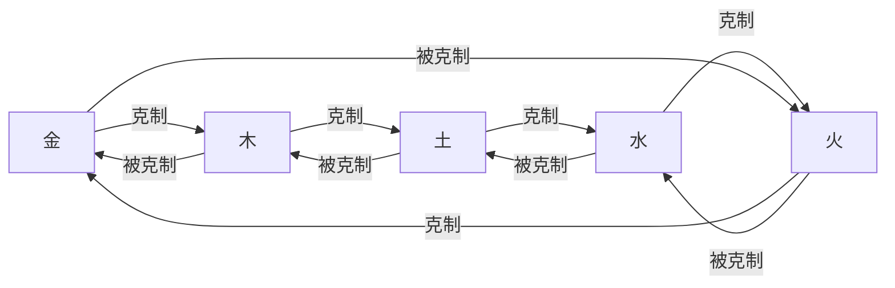

# 属性克制

<cite>
**本文档引用文件**  
- [ENAttribute.java](file://Life\src\main\java\com\bot\life\enums\ENAttribute.java)
- [BattleServiceImpl.java](file://Life\src\main\java\com\bot\life\service\impl\BattleServiceImpl.java)
- [WorldBossServiceImpl.java](file://Life\src\main\java\com\bot\life\service\impl\WorldBossServiceImpl.java)
- [Life_User_Manual.md](file://Life_User_Manual.md)
- [浮生卷开发说明.md](file://浮生卷开发说明.md)
- [LifeHandlerImpl.java](file://Life\src\main\java\com\bot\life\service\impl\LifeHandlerImpl.java)
</cite>

## 目录
1. [属性克制系统概述](#属性克制系统概述)
2. [五行相克规则](#五行相克规则)
3. [属性克制对战斗的影响](#属性克制对战斗的影响)
4. [派系选择与属性克制的关系](#派系选择与属性克制的关系)
5. [实战应用策略](#实战应用策略)
6. [属性克制关系表](#属性克制关系表)

## 属性克制系统概述

浮生卷游戏中的属性克制系统是基于中国传统五行哲学构建的核心战斗机制。该系统通过"金克木、木克土、土克水、水克火、火克金"的相克关系，为战斗增添了深度策略性。当角色属性克制对手时，将获得显著的战斗优势；反之，若被对手属性克制，则会处于不利地位。

属性克制不仅影响角色的基础战斗能力，还与派系选择、技能搭配和战术决策密切相关。玩家在创建角色时选择的派系直接决定了其属性，从而影响其在各种战斗场景中的表现。

**Section sources**
- [浮生卷开发说明.md](file://浮生卷开发说明.md#L21-L49)
- [Life_User_Manual.md](file://Life_User_Manual.md#L66-L72)

## 五行相克规则

浮生卷游戏中的五行相克系统严格遵循传统五行哲学的相克规律，具体规则如下：

- **金克木**：金属性角色对木属性角色具有克制优势
- **木克土**：木属性角色对土属性角色具有克制优势
- **土克水**：土属性角色对水属性角色具有克制优势
- **水克火**：水属性角色对火属性角色具有克制优势
- **火克金**：火属性角色对金属性角色具有克制优势

这一相克关系形成了一个循环链条：金 → 木 → 土 → 水 → 火 → 金，确保了游戏平衡性，没有绝对强势的属性。

在代码实现中，这一规则通过`ENAttribute`枚举类的`restrains`方法进行定义：

```java
public boolean restrains(ENAttribute target) {
    if (this == NONE || target == NONE) {
        return false;
    }
    return (this == METAL && target == WOOD) ||
           (this == WOOD && target == EARTH) ||
           (this == EARTH && target == WATER) ||
           (this == WATER && target == FIRE) ||
           (this == FIRE && target == METAL);
}
```

**Section sources**
- [ENAttribute.java](file://Life\src\main\java\com\bot\life\enums\ENAttribute.java#L45-L54)
- [Life_User_Manual.md](file://Life_User_Manual.md#L68)

## 属性克制对战斗的影响

属性克制在战斗中产生两种主要影响：攻击方获得伤害加成，防御方承受防御惩罚。

### 克制时的伤害加成

当攻击方属性克制防御方时，攻击方的最终伤害将增加20%。这一机制在`BattleServiceImpl`类的`executeNormalAttack`方法中实现：

```java
if (attackerAttr.restrains(defenderAttr)) {
    damage = (int) (damage * 1.2); // 克制伤害增加20%
    context.addLog(String.format("『属性克制！』%s对%s造成额外伤害！", attackerAttr.getDesc(), defenderAttr.getDesc()));
}
```

系统会明确提示玩家"属性克制！"的信息，让玩家清楚地了解当前的战斗优势。

### 被克制时的防御惩罚

当角色被对手属性克制时，其防御力将降低10%。虽然在提供的代码片段中没有直接显示防御降低的计算，但在`WorldBossServiceImpl`类中通过属性优势判断实现了类似的机制：

```java
// 属性克制加成
if (isAttributeAdvantage(player.getAttribute(), boss.getAttribute())) {
    attributeBonus = 1.2;
} else if (isAttributeDisadvantage(player.getAttribute(), boss.getAttribute())) {
    attributeBonus = 0.8;
}
```

这里的`attributeBonus = 0.8`表明当玩家处于属性劣势时，整体战斗效能降低到80%，这与防御力降低10%的效果相辅相成，共同构成了被克制时的惩罚机制。

**Section sources**
- [BattleServiceImpl.java](file://Life\src\main\java\com\bot\life\service\impl\BattleServiceImpl.java#L129-L132)
- [WorldBossServiceImpl.java](file://Life\src\main\java\com\bot\life\service\impl\WorldBossServiceImpl.java#L202-L205)

## 派系选择与属性克制的关系

在浮生卷游戏中，玩家创建角色时选择的派系直接决定了其属性，这使得派系选择成为影响长期游戏体验的关键决策。

### 派系属性对应关系

根据游戏设定，五个派系分别对应五行中的五种属性：
- 金派系 → 金属性
- 木派系 → 木属性  
- 水派系 → 水属性
- 火派系 → 火属性
- 土派系 → 土属性

### 各派系特色

每个派系都有其独特的战斗风格和养成特点：

| 派系 | 特色 | 攻击力 | 防御力 | 养成难度 |
|------|------|--------|--------|----------|
| 金 | 强大破坏力，一力破万法 | ★★★★★ | ★★ | ★★★★ |
| 木 | 强大恢复能力，治疗用毒 | ★★★ | ★★★★ | ★★★ |
| 水 | 包容万物，各领域涉及 | ★★★★ | ★★★★ | ★★★★ |
| 火 | 持续伤害，可观爆发力 | ★★★★ | ★★★ | ★★★ |
| 土 | 超强防御，不俗控制力 | ★★★ | ★★★★★ | ★★★★★ |

派系选择不仅影响初始属性，还会影响角色的成长方向和技能搭配策略。例如，金派系虽然攻击力极高，但防御力较弱，在面对火属性对手时会更加脆弱；而土派系虽然防御力极强，但在面对木属性对手时防御优势会被削弱。

**Section sources**
- [Life_User_Manual.md](file://Life_User_Manual.md#L34-L40)
- [LifeHandlerImpl.java](file://Life\src\main\java\com\bot\life\service\impl\LifeHandlerImpl.java#L322-L332)

## 实战应用策略

了解属性克制系统后，玩家可以制定更有效的战斗策略，最大化利用属性优势。

### 战前准备策略

1. **情报收集**：在挑战重要敌人（如世界BOSS）前，尽可能收集对手的属性信息
2. **属性匹配**：根据已知的敌人属性，选择具有克制优势的队伍配置
3. **装备调整**：在面对被克制的敌人时，优先选择提升防御力的装备和法宝

### 战斗中决策

1. **优先克制目标**：在多目标战斗中，优先攻击被自己克制的敌人
2. **保护被克制单位**：当队伍中有成员被敌人克制时，使用防御、治疗等技能进行保护
3. **技能搭配**：选择与当前属性优势相配合的技能，最大化伤害输出

### 长期发展策略

1. **多元化培养**：不要只培养单一属性的角色，建立具有多种属性的队伍以应对不同情况
2. **灵活调整**：根据游戏进程中遇到的主要敌人类型，适时调整主力队伍的属性构成
3. **利用循环优势**：理解五行相克的循环特性，避免陷入被特定属性克制的困境

**Section sources**
- [浮生卷开发说明.md](file://浮生卷开发说明.md#L43-L45)
- [Life_User_Manual.md](file://Life_User_Manual.md#L98-L107)

## 属性克制关系表

以下是浮生卷游戏中完整的属性克制关系表：



**Diagram sources**
- [ENAttribute.java](file://Life\src\main\java\com\bot\life\enums\ENAttribute.java#L45-L54)
- [Life_User_Manual.md](file://Life_User_Manual.md#L68)

该关系表清晰地展示了五行相克的循环关系。玩家可以将其作为战斗参考，快速判断自己与对手之间的属性关系，从而制定相应的战斗策略。