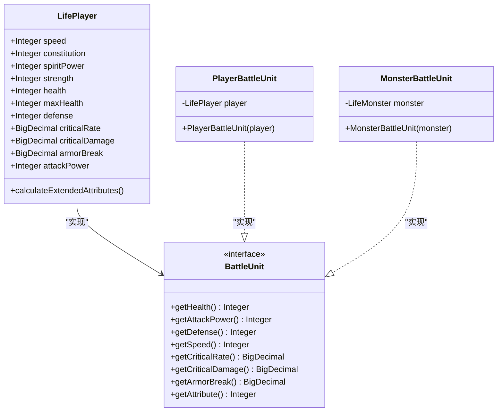
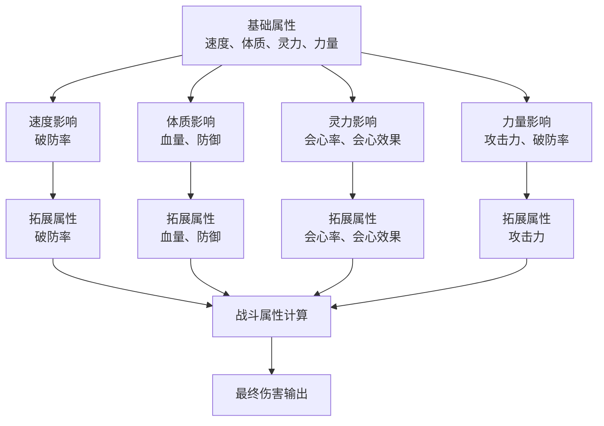
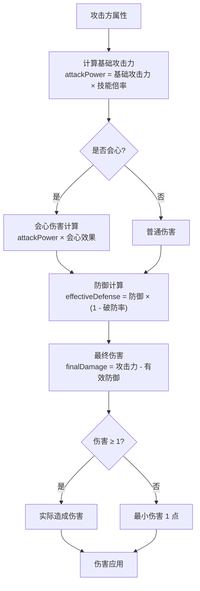
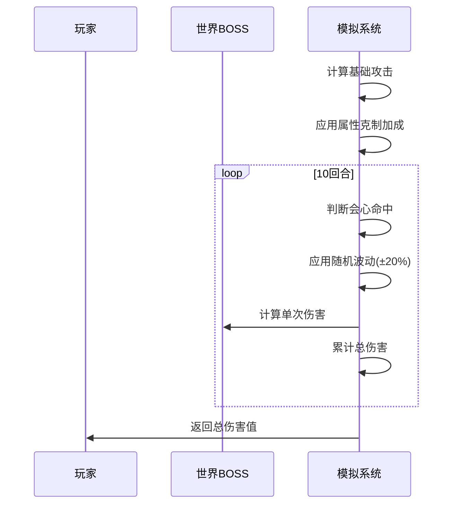
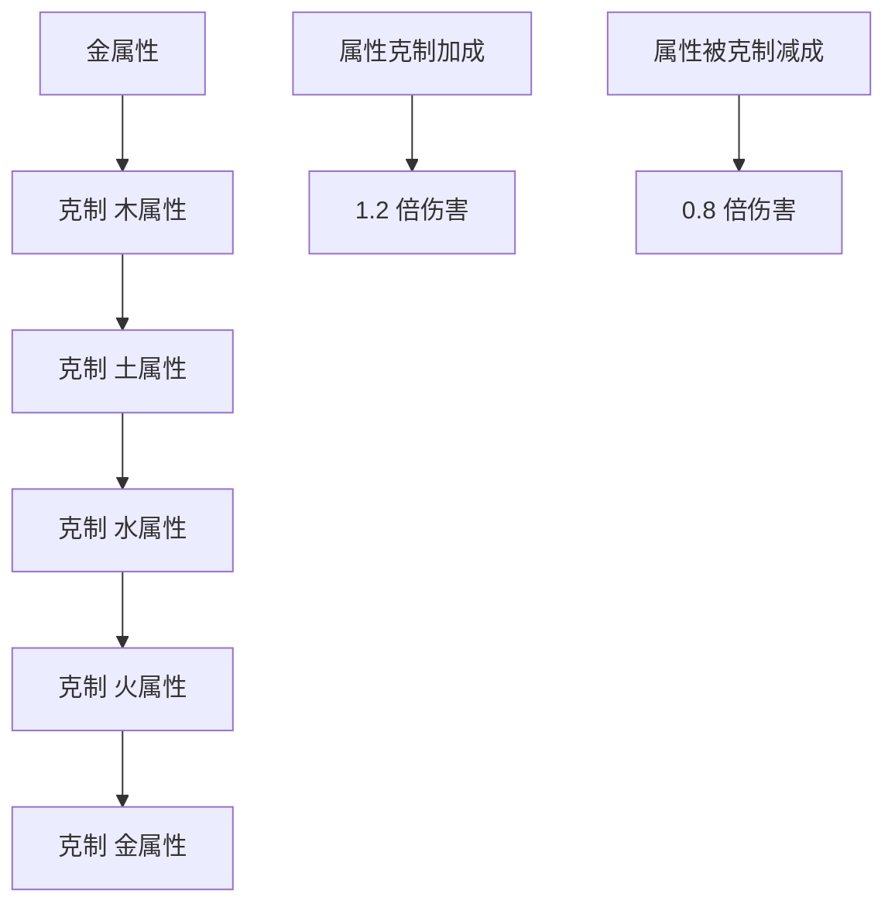
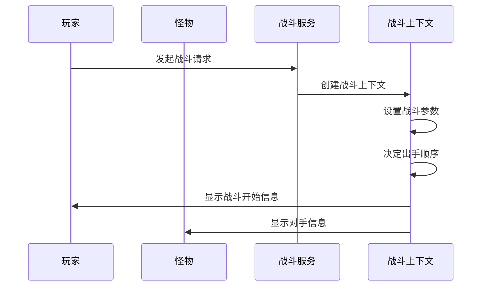
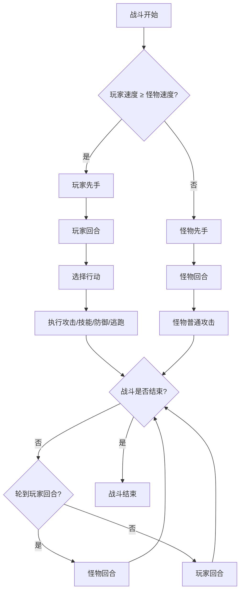
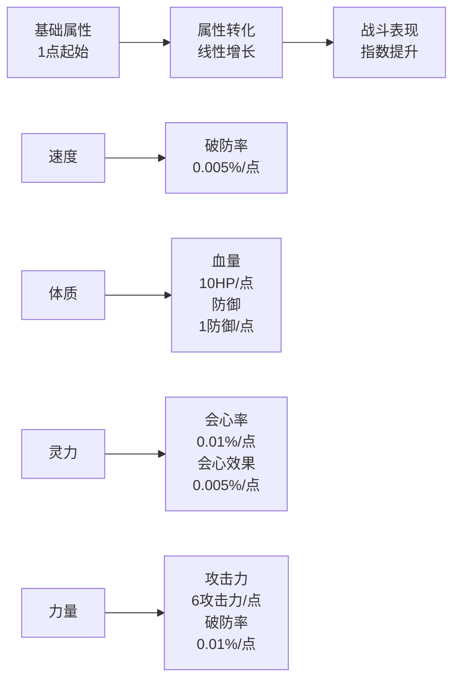

# 战斗属性

<cite>
**本文档引用的文件**
- [BattleServiceImpl.java](file://Life/src/main/java/com/bot/life/service/impl/BattleServiceImpl.java)
- [LifeHandlerImpl.java](file://Life/src/main/java/com/bot/life/service/impl/LifeHandlerImpl.java)
- [LifePlayer.java](file://Life/src/main/java/com/bot/life/dao/entity/LifePlayer.java)
- [ENAttribute.java](file://Life/src/main/java/com/bot/life/enums/ENAttribute.java)
- [BattleContext.java](file://Life/src/main/java/com/bot/life/dto/BattleContext.java)
- [GameConsts.java](file://Common/src/main/java/com/bot/common/constant/GameConsts.java)
- [WorldBossServiceImpl.java](file://Life/src/main/java/com/bot/life/service/impl/WorldBossServiceImpl.java)
- [Life_User_Manual.md](file://Life_User_Manual.md)
</cite>

## 目录
1. [简介](#简介)
2. [战斗属性体系](#战斗属性体系)
3. [基础属性与拓展属性](#基础属性与拓展属性)
4. [伤害计算机制](#伤害计算机制)
5. [属性克制系统](#属性克制系统)
6. [战斗流程详解](#战斗流程详解)
7. [属性优化策略](#属性优化策略)
8. [总结](#总结)

## 简介

浮生卷游戏采用了一套完整的战斗属性体系，通过基础属性与拓展属性的转换机制，构建了丰富的战斗计算模型。本文档详细解析了游戏中的战斗属性计算机制，包括血量、攻击力、防御、会心率等核心属性的生成逻辑，以及伤害计算公式和属性克制系统的工作原理。

## 战斗属性体系

### 属性分类架构

**图表来源**
- [LifePlayer.java](file://Life/src/main/java/com/bot/life/dao/entity/LifePlayer.java#L55-L75)
- [BattleServiceImpl.java](file://Life/src/main/java/com/bot/life/service/impl/BattleServiceImpl.java#L197-L302)

### 属性数据结构

游戏中的战斗属性分为两大类：

| 属性类别 | 包含属性 | 数据类型 | 单位 |
|---------|---------|---------|------|
| 基础属性 | 速度(Speed)、体质(Constitution)、灵力(SpiritPower)、力量(Strength) | Integer | 纯数值 |
| 拓展属性 | 血量(Health)、防御(Defense)、会心率(CriticalRate)、会心效果(CriticalDamage)、破防(ArmorBreak)、攻击力(AttackPower) | Integer/BigDecimal | 百分比/纯数值 |

**节来源**
- [LifePlayer.java](file://Life/src/main/java/com/bot/life/dao/entity/LifePlayer.java#L24-L37)

## 基础属性与拓展属性

### 基础属性转化机制

游戏通过`calculateExtendedAttributes()`方法实现了基础属性到拓展属性的转化，建立了完整的属性计算链。

**图表来源**
- [LifePlayer.java](file://Life/src/main/java/com/bot/life/dao/entity/LifePlayer.java#L55-L75)

### 属性转化公式

根据源码分析，属性转化遵循以下数学关系：

| 基础属性 | 拓展属性 | 转化公式 | 参考常量 |
|---------|---------|---------|---------|
| 速度 | 破防率 | `armorBreak = speed × 0.005%` | 0.005% |
| 体质 | 血量 | `maxHealth = 10 + constitution × 10` | 10HP/点 |
| 体质 | 防御 | `defense = 1 + constitution` | 1防御/点 |
| 灵力 | 会心率 | `criticalRate = spiritPower × 0.01%` | 0.01%/点 |
| 灵力 | 会心效果 | `criticalDamage = 110 + spiritPower × 0.005%` | 110+0.005%/点 |
| 力量 | 攻击力 | `attackPower = 6 + strength × 6` | 6攻击力/点 |
| 力量 | 破防率 | `armorBreak += strength × 0.01%` | 0.01%/点 |

**节来源**
- [LifePlayer.java](file://Life/src/main/java/com/bot/life/dao/entity/LifePlayer.java#L55-L75)

## 伤害计算机制

### 核心伤害公式

游戏采用经典的伤害计算公式：`攻击力×倍率-防御×(1-破防率)`，并在其中加入了会心判定和属性克制等高级机制。

**图表来源**
- [BattleServiceImpl.java](file://Life/src/main/java/com/bot/life/service/impl/BattleServiceImpl.java#L148-L162)

### 伤害计算详细步骤

基于源码实现的伤害计算流程如下：

1. **基础攻击力计算**：`attackPower = attacker.getAttackPower() × skillMultiplier`
2. **会心判定**：`random.nextDouble() * 100 < attacker.getCriticalRate().doubleValue()`
3. **会心伤害倍率**：`attackPower × attacker.getCriticalDamage().doubleValue() / 100.0`
4. **破防率限制**：`armorBreakRate = Math.min(0.3, attacker.getArmorBreak().doubleValue() / 100.0)`
5. **有效防御计算**：`effectiveDefense = defender.getDefense() × (1.0 - armorBreakRate)`
6. **最终伤害**：`finalDamage = attackPower - effectiveDefense`
7. **最小伤害保证**：`Math.max(1, (int) finalDamage)`

**节来源**
- [BattleServiceImpl.java](file://Life/src/main/java/com/bot/life/service/impl/BattleServiceImpl.java#L148-L162)

### 世界BOSS战斗特殊机制

对于世界BOSS战斗，游戏采用了模拟10回合攻击的方式，增加了随机波动和属性克制加成：

**图表来源**
- [WorldBossServiceImpl.java](file://Life/src/main/java/com/bot/life/service/impl/WorldBossServiceImpl.java#L200-L224)

**节来源**
- [WorldBossServiceImpl.java](file://Life/src/main/java/com/bot/life/service/impl/WorldBossServiceImpl.java#L200-L224)

## 属性克制系统

### 克制关系矩阵

游戏建立了五行相克的属性克制系统，形成了完整的循环克制关系：

**图表来源**
- [ENAttribute.java](file://Life/src/main/java/com/bot/life/enums/ENAttribute.java#L45-L53)

### 克制判定逻辑

属性克制的判定遵循以下规则：

| 克制关系 | 加成倍率 | 减成倍率 | 应用场景 |
|---------|---------|---------|---------|
| 金克木 | 1.2 | 0.8 | 金属性攻击木属性敌人 |
| 木克土 | 1.2 | 0.8 | 木属性攻击土属性敌人 |
| 土克水 | 1.2 | 0.8 | 土属性攻击水属性敌人 |
| 水克火 | 1.2 | 0.8 | 水属性攻击火属性敌人 |
| 火克金 | 1.2 | 0.8 | 火属性攻击金属性敌人 |

**节来源**
- [ENAttribute.java](file://Life/src/main/java/com/bot/life/enums/ENAttribute.java#L45-L53)
- [BattleServiceImpl.java](file://Life/src/main/java/com/bot/life/service/impl/BattleServiceImpl.java#L128-L132)

## 战斗流程详解

### 战斗开始阶段

**图表来源**
- [BattleServiceImpl.java](file://Life/src/main/java/com/bot/life/service/impl/BattleServiceImpl.java#L38-L53)

### 回合制战斗机制

战斗采用回合制模式，根据速度属性决定出手顺序：

**图表来源**
- [BattleServiceImpl.java](file://Life/src/main/java/com/bot/life/service/impl/BattleServiceImpl.java#L47-L53)
- [BattleServiceImpl.java](file://Life/src/main/java/com/bot/life/service/impl/BattleServiceImpl.java#L166-L178)

### 逃跑机制

游戏提供了基于速度差的逃跑成功率计算：

| 速度差范围 | 成功率计算 | 最低成功率 | 最高成功率 |
|-----------|-----------|-----------|-----------|
| 0-9点 | 50% | 10% | 50% |
| 10-19点 | 48% | 10% | 48% |
| 20-29点 | 46% | 10% | 46% |
| ... | ... | 10% | ... |

**节来源**
- [BattleServiceImpl.java](file://Life/src/main/java/com/bot/life/service/impl/BattleServiceImpl.java#L166-L178)

## 属性优化策略

### 属性分配建议

基于游戏机制，推荐以下属性分配策略：

#### 1. 输出型角色培养
- **优先提升**：力量(攻击力)、灵力(会心效果)
- **次要提升**：速度(破防率)、体质(防御)
- **原因**：最大化输出能力，提高会心伤害

#### 2. 生存型角色培养  
- **优先提升**：体质(血量、防御)
- **次要提升**：速度(破防率)、灵力(会心率)
- **原因**：增强生存能力，提高容错率

#### 3. 平衡型角色培养
- **均衡发展**：力量、体质、灵力、速度
- **重点提升**：根据战斗需求调整
- **原因**：适应多种战斗场景

### 属性成长曲线

### 属性克制利用策略

1. **属性选择**：根据敌人属性选择克制属性的角色
2. **技能搭配**：利用属性克制加成最大化伤害
3. **阵容搭配**：组建包含多种属性的战斗阵容
4. **环境利用**：在特定场景中发挥属性优势

## 总结

浮生卷游戏的战斗属性系统通过精心设计的基础属性转化机制，构建了一个完整而富有策略性的战斗体系。核心特点包括：

1. **完整的属性链**：从基础属性到战斗属性的清晰转化路径
2. **动态伤害计算**：包含会心、破防、属性克制等多个变量的复杂计算
3. **策略性玩法**：鼓励玩家根据战斗情况调整属性分配和战斗策略
4. **平衡性设计**：通过各种限制和平衡机制确保游戏公平性

这套战斗属性系统不仅为游戏提供了深度的策略玩法，也为玩家创造了丰富的成长路径和战斗体验。理解这些机制有助于玩家更好地规划角色培养方向，制定有效的战斗策略，从而在游戏中取得更好的成绩。