# 伤害计算机制详细文档

<cite>
**本文档引用的文件**
- [BattleService.java](file://Life/src/main/java/com/bot/life/service/BattleService.java)
- [BattleServiceImpl.java](file://Life/src/main/java/com/bot/life/service/impl/BattleServiceImpl.java)
- [Life_User_Manual.md](file://Life_User_Manual.md)
- [ENAttribute.java](file://Life/src/main/java/com/bot/life/enums/ENAttribute.java)
- [LifePlayer.java](file://Life/src/main/java/com/bot/life/dao/entity/LifePlayer.java)
- [LifeMonster.java](file://Life/src/main/java/com/bot/life/dao/entity/LifeMonster.java)
- [WorldBossServiceImpl.java](file://Life/src/main/java/com/bot/life/service/impl/WorldBossServiceImpl.java)
</cite>

## 目录
1. [概述](#概述)
2. [伤害计算核心公式](#伤害计算核心公式)
3. [基础伤害计算](#基础伤害计算)
4. [会心（暴击）机制](#会心暴击机制)
5. [属性克制系统](#属性克制系统)
6. [破防机制](#破防机制)
7. [伤害下限保护](#伤害下限保护)
8. [数值计算示例](#数值计算示例)
9. [属性计算公式](#属性计算公式)
10. [战斗流程详解](#战斗流程详解)
11. [性能优化考虑](#性能优化考虑)
12. [总结](#总结)

## 概述

浮生卷战斗系统的伤害计算机制是一个复杂而精密的系统，基于五行相克原理设计，融合了传统修仙元素与现代RPG战斗机制。该系统通过多层次的计算公式，实现了公平且富有策略性的战斗体验。

伤害计算的核心理念是"五行相克，各有千秋"，不同属性之间存在克制关系，同时引入了会心率、破防率等变量，使得战斗策略更加丰富多样。

## 伤害计算核心公式

### 基础伤害公式

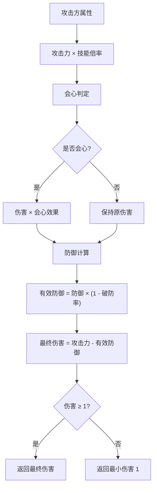

**图表来源**
- [BattleServiceImpl.java](file://Life/src/main/java/com/bot/life/service/impl/BattleServiceImpl.java#L149-L162)

伤害计算遵循以下核心公式：
**普通攻击伤害 = 攻击力 × 倍率 - 防御 × (1 - 破防率)**

其中：
- **攻击力**：攻击方的基础攻击力乘以技能倍率
- **破防率**：攻击方的破防属性，最高不超过30%
- **会心效果**：暴击时的伤害倍数

**章节来源**
- [BattleServiceImpl.java](file://Life/src/main/java/com/bot/life/service/impl/BattleServiceImpl.java#L149-L162)
- [Life_User_Manual.md](file://Life_User_Manual.md#L108-L114)

## 基础伤害计算

### 攻击力计算

攻击力的计算采用以下公式：

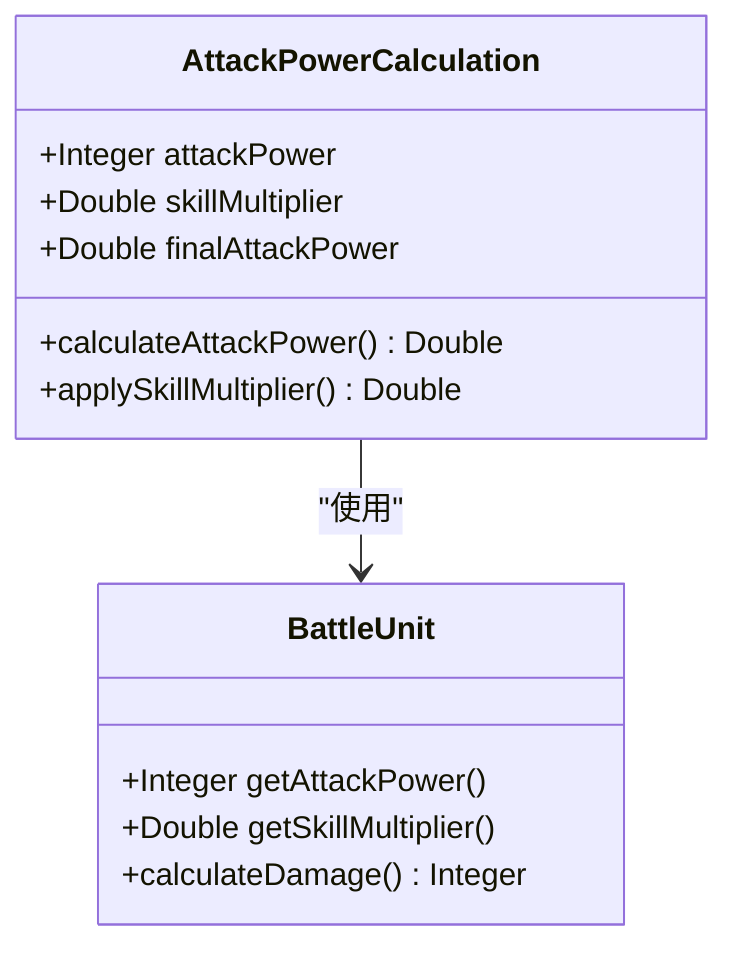

**图表来源**
- [BattleServiceImpl.java](file://Life/src/main/java/com/bot/life/service/impl/BattleServiceImpl.java#L150)

攻击力计算过程包括：
1. **基础攻击力**：从BattleUnit接口获取攻击方的原始攻击力
2. **技能倍率应用**：将基础攻击力乘以技能倍率
3. **属性修正**：根据五行相克关系进行伤害修正

### 防御计算

防御计算采用动态调整机制：

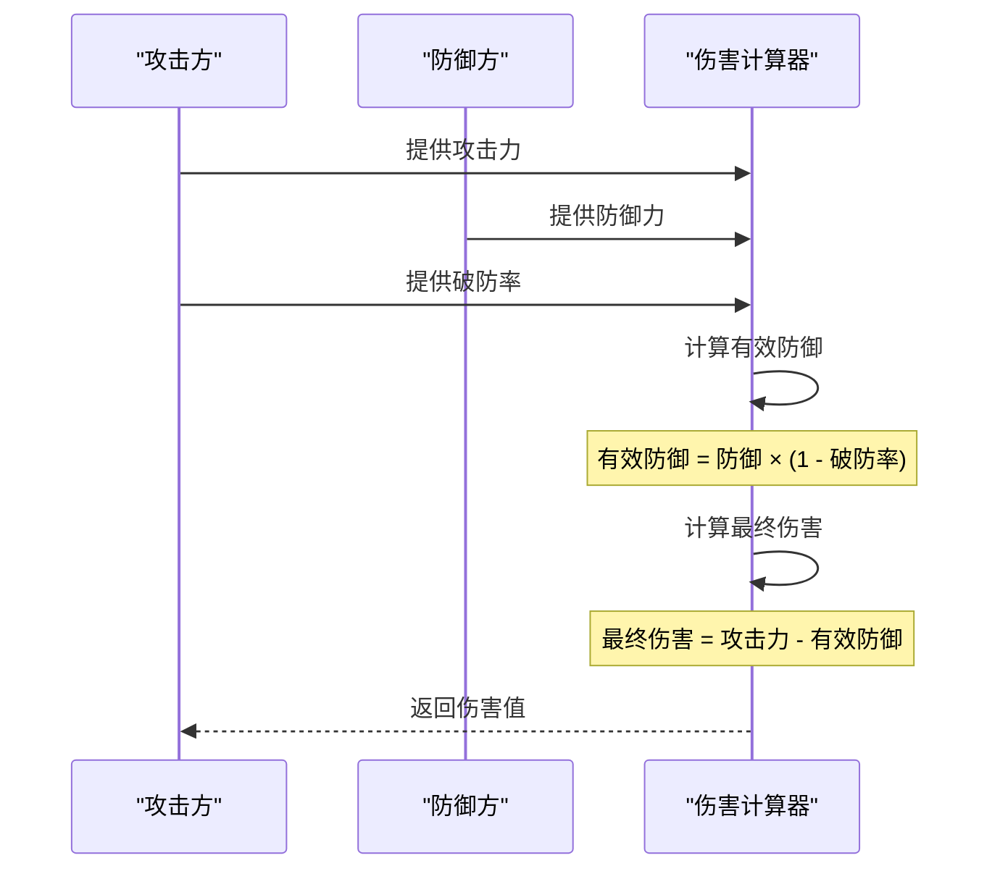

**图表来源**
- [BattleServiceImpl.java](file://Life/src/main/java/com/bot/life/service/impl/BattleServiceImpl.java#L157-L161)

**章节来源**
- [BattleServiceImpl.java](file://Life/src/main/java/com/bot/life/service/impl/BattleServiceImpl.java#L149-L162)

## 会心（暴击）机制

### 会心率计算

会心率是基于灵力属性的重要战斗指标，其计算公式体现了修仙体系中灵力对战斗能力的影响：

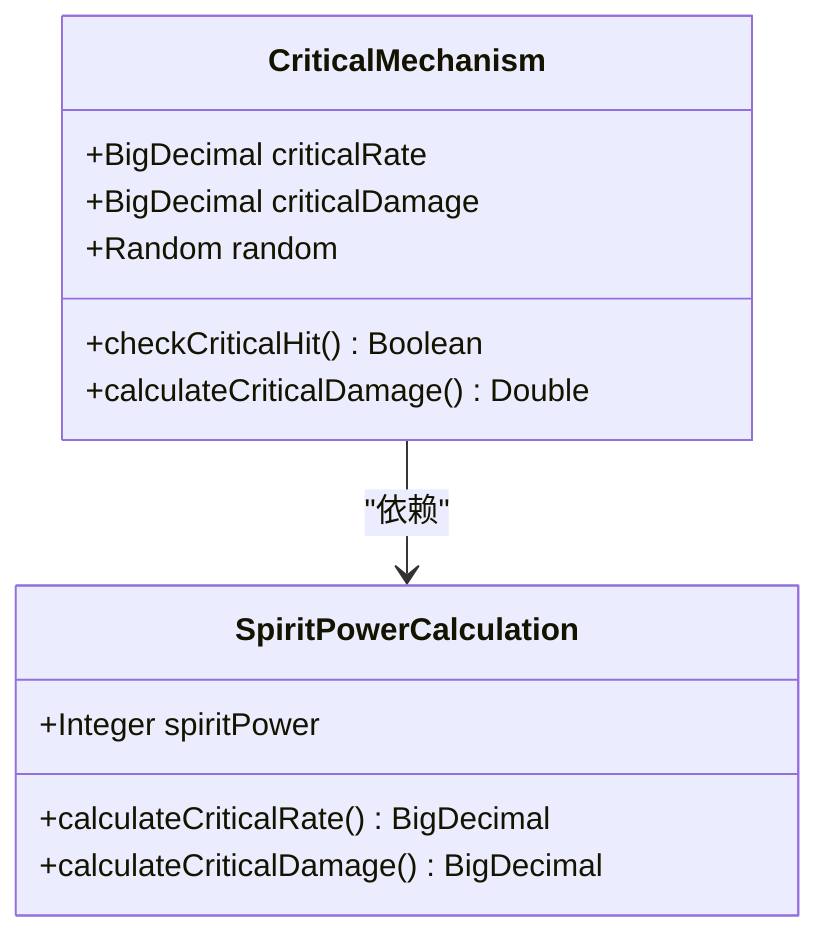

**图表来源**
- [LifePlayer.java](file://Life/src/main/java/com/bot/life/dao/entity/LifePlayer.java#L64-L66)

### 会心判定流程

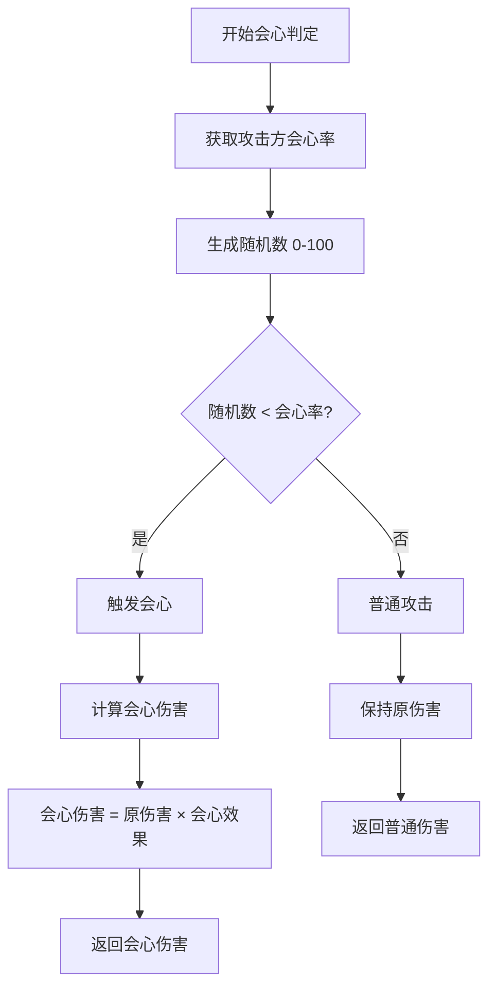

**图表来源**
- [BattleServiceImpl.java](file://Life/src/main/java/com/bot/life/service/impl/BattleServiceImpl.java#L153-L155)

### 会心效果计算

会心效果采用固定基准加浮动计算的方式：

- **基础会心效果**：110%
- **灵力影响**：每1点灵力增加0.005%的会心效果
- **会心率计算**：每1点灵力增加0.01%的会心概率

**章节来源**
- [BattleServiceImpl.java](file://Life/src/main/java/com/bot/life/service/impl/BattleServiceImpl.java#L153-L155)
- [LifePlayer.java](file://Life/src/main/java/com/bot/life/dao/entity/LifePlayer.java#L64-L66)

## 属性克制系统

### 五行相克关系

浮生卷采用了经典的五行相克理论，建立了完整的属性克制体系：

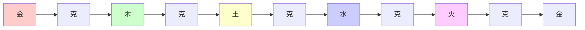

**图表来源**
- [ENAttribute.java](file://Life/src/main/java/com/bot/life/enums/ENAttribute.java#L45-L53)

### 属性克制计算

属性克制系统在伤害计算中发挥重要作用：

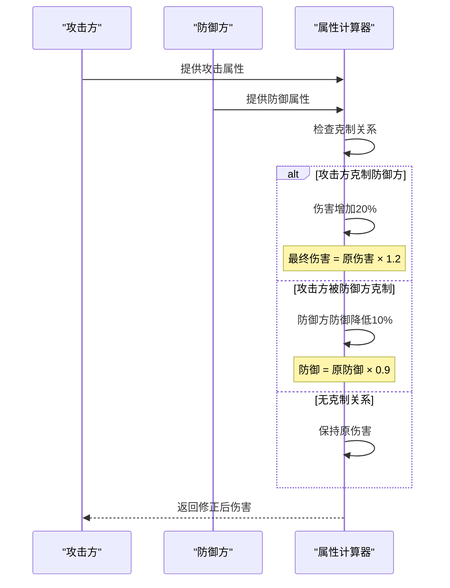

**图表来源**
- [BattleServiceImpl.java](file://Life/src/main/java/com/bot/life/service/impl/BattleServiceImpl.java#L129-L132)

### 属性克制判定规则

| 攻击属性 | 被克制属性 | 效果 |
|---------|-----------|------|
| 金 | 木 | 伤害+20% |
| 木 | 土 | 伤害+20% |
| 土 | 水 | 伤害+20% |
| 水 | 火 | 伤害+20% |
| 火 | 金 | 伤害+20% |

**章节来源**
- [BattleServiceImpl.java](file://Life/src/main/java/com/bot/life/service/impl/BattleServiceImpl.java#L129-L132)
- [ENAttribute.java](file://Life/src/main/java/com/bot/life/enums/ENAttribute.java#L45-L53)

## 破防机制

### 破防率计算

破防机制是战斗系统中的重要平衡因子，防止防御过高的敌人难以被击败：

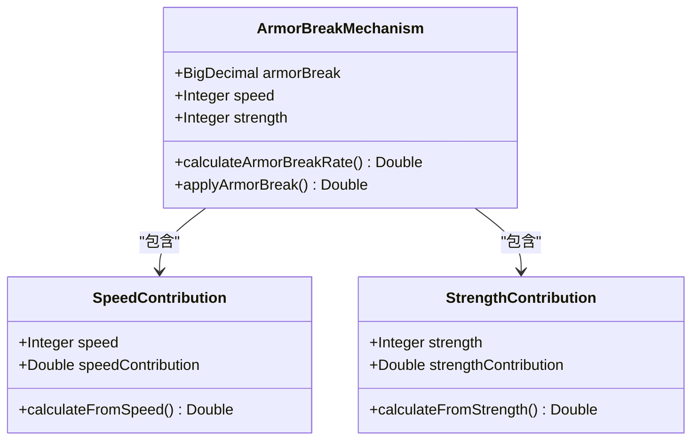

**图表来源**
- [LifePlayer.java](file://Life/src/main/java/com/bot/life/dao/entity/LifePlayer.java#L57-L70)

### 破防率计算公式

破防率的计算采用双因素叠加机制：

1. **速度贡献**：每1点速度提供0.005%的破防率
2. **力量贡献**：每1点力量提供0.01%的破防率
3. **上限限制**：破防率最高不超过30%

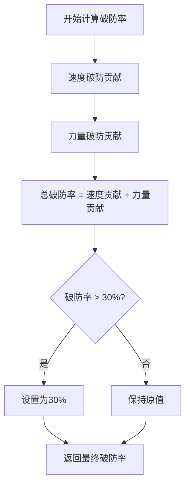

**图表来源**
- [BattleServiceImpl.java](file://Life/src/main/java/com/bot/life/service/impl/BattleServiceImpl.java#L158)

### 破防效果计算

破防效果直接影响防御的计算方式：

**有效防御 = 防御 × (1 - 破防率)**

这意味着：
- 破防率为0%：防御完全有效
- 破防率为30%：防御降低30%
- 破防率为100%：防御完全无效

**章节来源**
- [BattleServiceImpl.java](file://Life/src/main/java/com/bot/life/service/impl/BattleServiceImpl.java#L158)
- [LifePlayer.java](file://Life/src/main/java/com/bot/life/dao/entity/LifePlayer.java#L57-L70)

## 伤害下限保护

### 最小伤害保证

为了确保战斗的基本可玩性，系统设置了最小伤害保护机制：

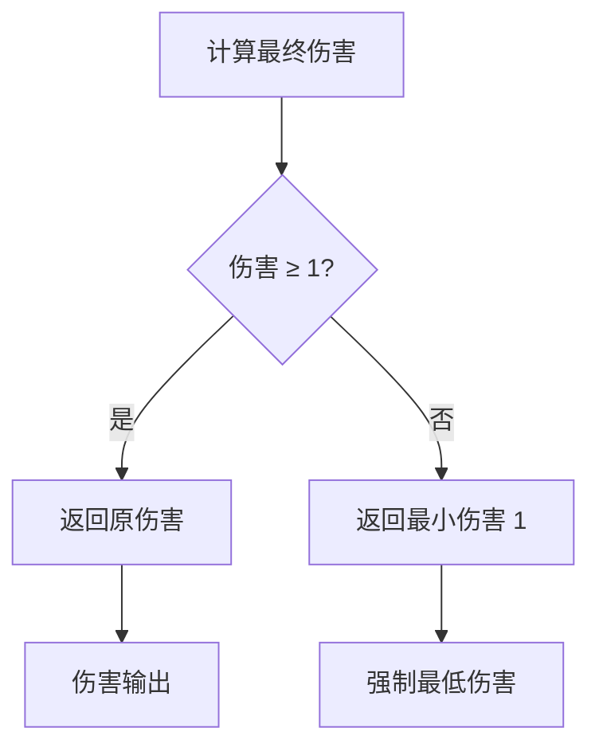

**图表来源**
- [BattleServiceImpl.java](file://Life/src/main/java/com/bot/life/service/impl/BattleServiceImpl.java#L162)

### 下限保护的意义

1. **战斗平衡**：防止出现零伤害的情况
2. **策略价值**：即使防御极高，也有被击败的可能性
3. **心理影响**：给玩家持续战斗的动力
4. **系统稳定性**：避免数学运算异常

**章节来源**
- [BattleServiceImpl.java](file://Life/src/main/java/com/bot/life/service/impl/BattleServiceImpl.java#L162)

## 数值计算示例

### 示例1：普通攻击伤害计算

**场景设定**：
- 攻击方：玩家，攻击力60，破防率25%
- 防御方：怪物，防御50
- 技能倍率：1.0（普通攻击）

**计算步骤**：
1. 基础攻击力 = 60 × 1.0 = 60
2. 破防率 = min(30%, 25%) = 25%
3. 有效防御 = 50 × (1 - 0.25) = 37.5
4. 最终伤害 = 60 - 37.5 = 22.5 → 22（向下取整）

### 示例2：会心攻击伤害计算

**场景设定**：
- 攻击方：玩家，攻击力60，会心率5%，会心效果120%
- 防御方：怪物，防御50，破防率25%
- 技能倍率：1.0（普通攻击）

**计算步骤**：
1. 随机数判定：假设触发会心（5%概率）
2. 会心后攻击力 = 60 × 1.2 = 72
3. 破防率 = 25%
4. 有效防御 = 50 × (1 - 0.25) = 37.5
5. 最终伤害 = 72 - 37.5 = 34.5 → 34

### 示例3：属性克制伤害计算

**场景设定**：
- 攻击方：金属性玩家，攻击力60
- 防御方：木属性怪物，防御50
- 破防率：25%

**计算步骤**：
1. 金克制木，伤害增加20%
2. 基础伤害 = 60 - 50 × (1 - 0.25) = 22.5 → 22
3. 克制修正 = 22 × 1.2 = 26.4 → 26

### 示例4：极限情况计算

**场景设定**：
- 攻击方：高破防玩家，攻击力100，破防率30%
- 防御方：高防御怪物，防御1000
- 技能倍率：1.0

**计算步骤**：
1. 基础攻击力 = 100
2. 破防率 = 30%
3. 有效防御 = 1000 × (1 - 0.3) = 700
4. 最终伤害 = 100 - 700 = -600
5. 由于伤害下限保护，实际伤害 = 1

**章节来源**
- [BattleServiceImpl.java](file://Life/src/main/java/com/bot/life/service/impl/BattleServiceImpl.java#L149-L162)

## 属性计算公式

### 基础属性到战斗属性转换

浮生卷采用了完整的属性转换体系，将基础属性转化为战斗属性：

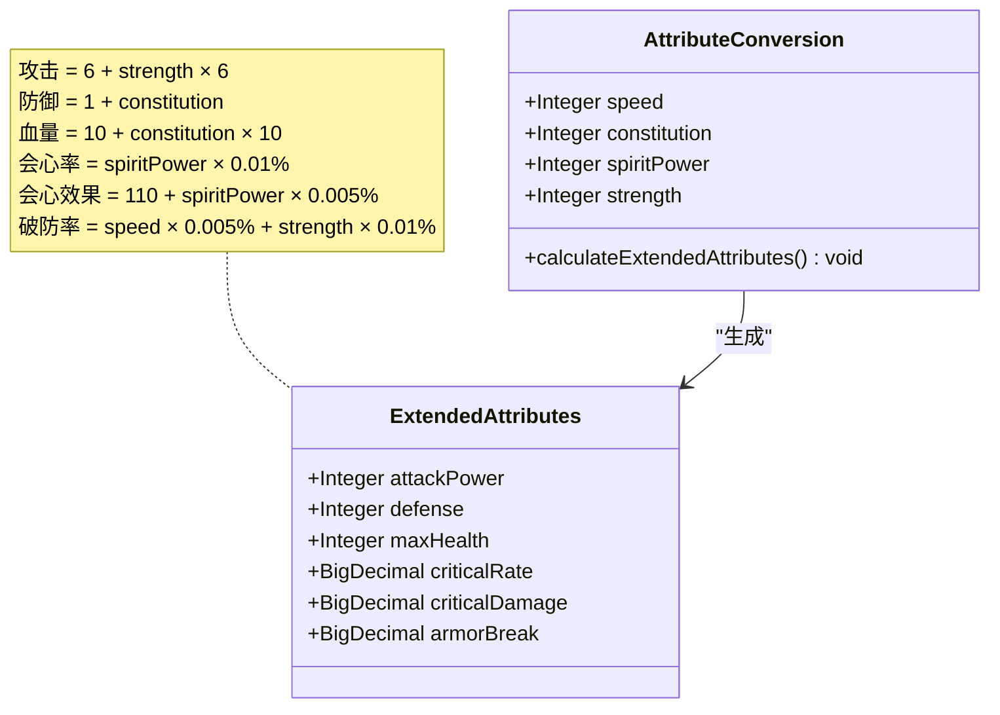

**图表来源**
- [LifePlayer.java](file://Life/src/main/java/com/bot/life/dao/entity/LifePlayer.java#L56-L76)

### 属性转换系数表

| 基础属性 | 战斗属性 | 转换公式 | 影响因素 |
|---------|---------|---------|---------|
| 速度 | 破防率 | speed × 0.005% | 每点速度增加0.005% |
| 体质 | 血量 | 10 + constitution × 10 | 每点体质增加10点血量 |
| 体质 | 防御 | 1 + constitution | 每点体质增加1点防御 |
| 灵力 | 会心率 | spiritPower × 0.01% | 每点灵力增加0.01% |
| 灵力 | 会心效果 | 110 + spiritPower × 0.005% | 每点灵力增加0.005% |
| 力量 | 攻击力 | 6 + strength × 6 | 每点力量增加6点攻击 |
| 力量 | 破防率 | strength × 0.01% | 每点力量增加0.01% |

**章节来源**
- [LifePlayer.java](file://Life/src/main/java/com/bot/life/dao/entity/LifePlayer.java#L56-L76)

## 战斗流程详解

### 完整战斗流程

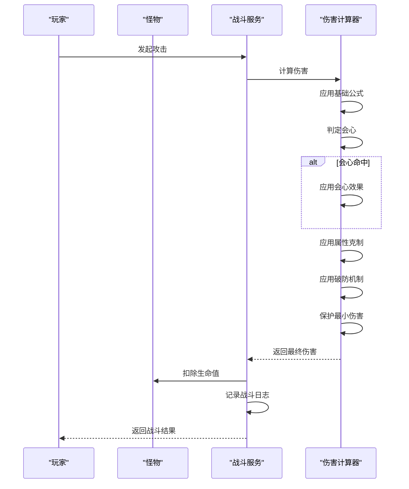

**图表来源**
- [BattleServiceImpl.java](file://Life/src/main/java/com/bot/life/service/impl/BattleServiceImpl.java#L128-L138)

### 战斗状态管理

战斗系统维护了完整的战斗状态信息：

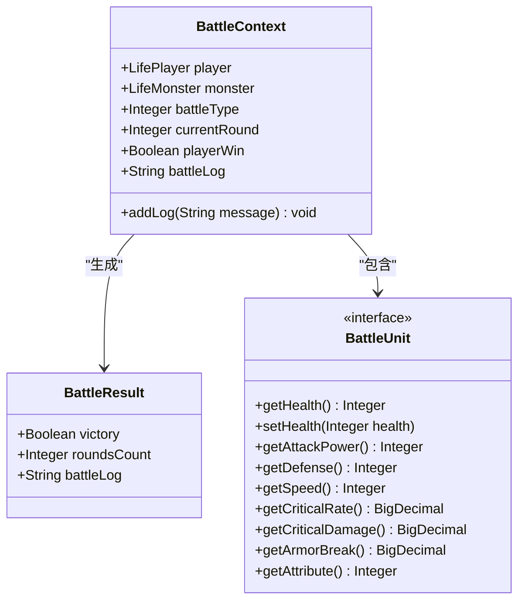

**图表来源**
- [BattleService.java](file://Life/src/main/java/com/bot/life/service/BattleService.java#L39-L80)

**章节来源**
- [BattleServiceImpl.java](file://Life/src/main/java/com/bot/life/service/impl/BattleServiceImpl.java#L128-L138)

## 性能优化考虑

### 计算效率优化

1. **缓存机制**：战斗属性计算结果可以缓存，避免重复计算
2. **随机数优化**：使用单例Random对象，提高并发安全性
3. **分支预测**：会心判定的概率较低，编译器可以优化分支预测
4. **内存管理**：避免频繁的对象创建，使用对象池

### 内存使用优化

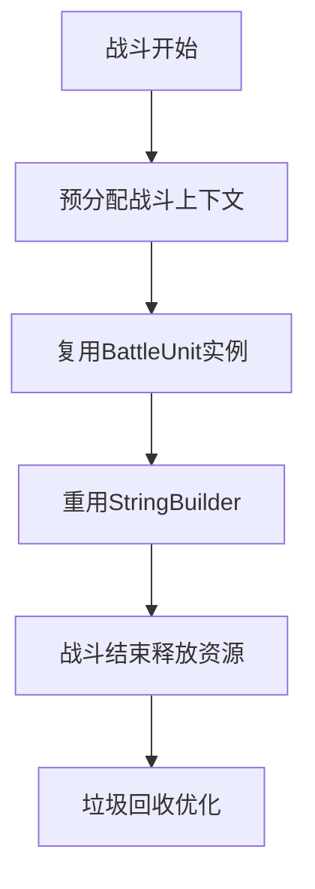

### 并发处理考虑

战斗系统需要支持多玩家并发战斗：
- 使用线程安全的Random对象
- 实现无锁的数据结构
- 采用事件驱动的战斗更新机制

## 总结

浮生卷的伤害计算机制体现了深度的策略性和丰富的游戏性。通过五行相克、会心机制、破防系统等多个维度的相互作用，构建了一个既公平又富有变化的战斗环境。

### 核心特点

1. **策略性**：不同属性之间的克制关系提供了丰富的战术选择
2. **平衡性**：多重保护机制确保战斗的可玩性
3. **成长性**：属性计算公式鼓励玩家合理分配属性点
4. **公平性**：会心机制和破防机制平衡了高防御和高攻击的优势

### 设计亮点

- **五行相克**：传统修仙元素的现代化体现
- **动态平衡**：通过破防率和会心率维持战斗平衡
- **数值保护**：最小伤害保护确保战斗不会陷入僵局
- **属性关联**：基础属性与战斗属性的紧密联系

这套伤害计算机制不仅满足了游戏的平衡性需求，更为玩家提供了深度的策略思考空间，是浮生卷战斗系统的核心竞争力所在。