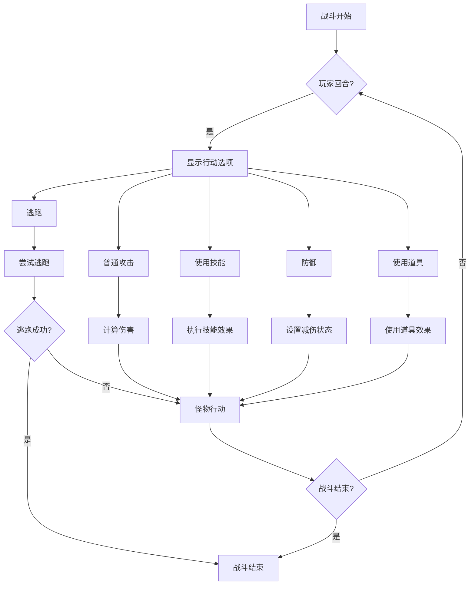
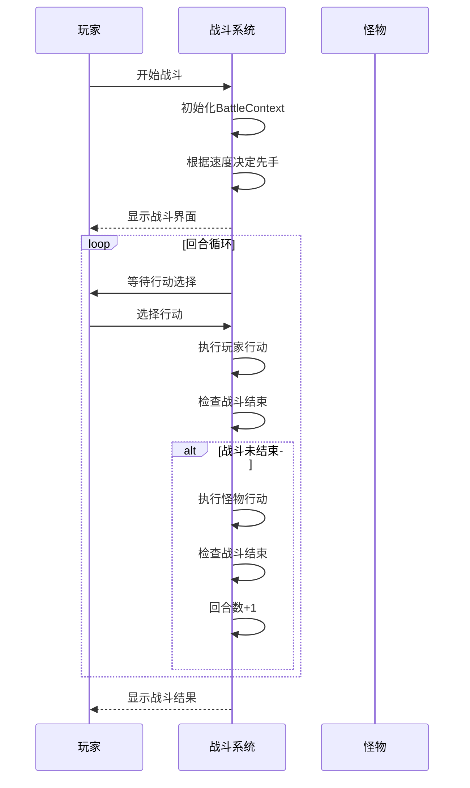
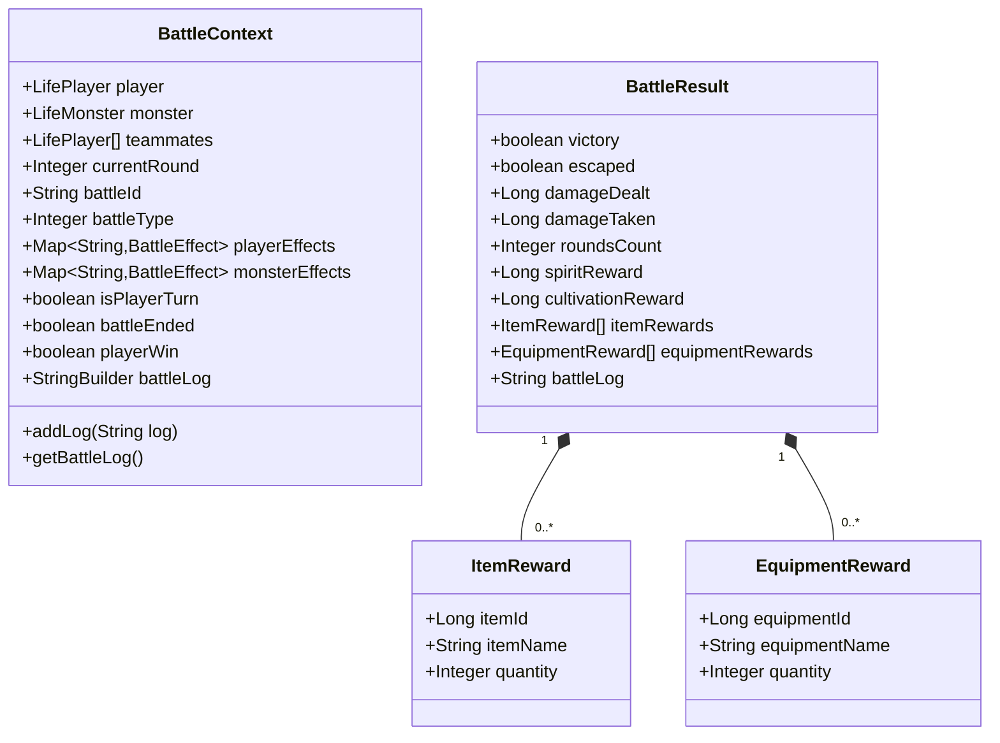

# 战斗系统

<cite>
**本文档引用文件**  
- [Life_User_Manual.md](file://Life_User_Manual.md)
- [BattleService.java](file://Life/src/main/java/com/bot/life/service/BattleService.java)
- [BattleServiceImpl.java](file://Life/src/main/java/com/bot/life/service/impl/BattleServiceImpl.java)
- [LifeHandlerImpl.java](file://Life/src/main/java/com/bot/life/service/impl/LifeHandlerImpl.java)
- [ENBattleAction.java](file://Life/src/main/java/com/bot/life/enums/ENBattleAction.java)
- [BattleContext.java](file://Life/src/main/java/com/bot/life/dto/BattleContext.java)
- [BattleResult.java](file://Life/src/main/java/com/bot/life/dto/BattleResult.java)
</cite>

## 目录
1. [战斗系统概述](#战斗系统概述)
2. [战斗行动选项](#战斗行动选项)
3. [伤害计算机制](#伤害计算机制)
4. [会心机制](#会心机制)
5. [逃跑成功率算法](#逃跑成功率算法)
6. [回合制战斗流程](#回合制战斗流程)
7. [战斗状态与结果](#战斗状态与结果)

## 战斗系统概述

浮生卷的战斗系统是基于回合制的文字RPG战斗机制，玩家在战斗中可选择五种行动：普通攻击、使用技能、防御、使用道具和逃跑。战斗的胜负由角色属性、装备、技能和策略共同决定。战斗过程以文本日志形式展示，所有界面通过图片渲染呈现。

战斗系统的核心组件包括：
- **BattleService**：定义战斗服务接口
- **BattleServiceImpl**：实现战斗逻辑
- **LifeHandlerImpl**：处理战斗相关的用户指令
- **BattleContext**：维护战斗过程中的上下文状态
- **BattleResult**：封装战斗结束后的结果数据

**Section sources**
- [Life_User_Manual.md](file://Life_User_Manual.md#L97-L120)
- [BattleService.java](file://Life/src/main/java/com/bot/life/service/BattleService.java#L13-L80)

## 战斗行动选项

在每回合战斗中，玩家可从以下五种行动中选择一种执行：

### 1. 普通攻击
基础攻击方式，使用角色的攻击力对敌人造成伤害。伤害计算考虑攻击力、防御力、破防率和属性克制关系。

### 2. 使用技能
消耗神通值使用角色已学习的技能。每个技能有特定的伤害倍率和效果。目前系统中该功能正在开发中。

### 3. 防御
选择防御可使本回合受到的伤害减少50%。这是一个有效的生存策略，尤其在面对高伤害敌人时。

### 4. 使用道具
使用背包中的恢复类或其他功能性道具。例如血瓶可以恢复生命值，其他道具可能提供增益效果。

### 5. 逃跑
尝试逃离当前战斗。逃跑成功率取决于玩家与怪物的速度对比，具体算法详见逃跑成功率算法章节。



**Diagram sources**
- [ENBattleAction.java](file://Life/src/main/java/com/bot/life/enums/ENBattleAction.java#L7-L39)
- [BattleServiceImpl.java](file://Life/src/main/java/com/bot/life/service/impl/BattleServiceImpl.java#L56-L86)

**Section sources**
- [Life_User_Manual.md](file://Life_User_Manual.md#L99-L106)
- [BattleServiceImpl.java](file://Life/src/main/java/com/bot/life/service/impl/BattleServiceImpl.java#L56-L86)

## 伤害计算机制

浮生卷的伤害计算公式综合考虑了攻击方的攻击力、防御方的防御力、破防率和属性克制关系。

### 基础伤害公式
```
普通攻击伤害 = 攻击力 × 倍率 - 防御 × (1 - 破防率)
```

### 计算规则
1. **破防率限制**：破防率最高可达30%，超过部分无效
2. **最小伤害**：无论计算结果如何，每次攻击至少造成1点伤害
3. **属性克制**：
   - 攻击方克制防御方：最终伤害增加20%
   - 攻击方被防御方克制：防御方防御力不受影响（但根据手册，被克制时自身防御-10%）

### 属性与破防关系
根据《浮生卷游戏操作手册》，角色属性影响破防能力：
- 每1点力量：破防+0.01%
- 每1点速度：破防+0.005%

```mermaid
flowchart TD
A[开始伤害计算] --> B[获取攻击力和倍率]
B --> C[计算基础伤害 = 攻击力 × 倍率]
C --> D[获取防御方防御力]
D --> E[计算有效防御 = 防御 × (1 - 破防率)]
E --> F[计算最终伤害 = 基础伤害 - 有效防御]
F --> G{伤害 < 1?}
G --> |是| H[伤害 = 1]
G --> |否| I[保留计算伤害]
I --> J{会心?}
J --> |是| K[伤害 × 会心效果]
J --> |否| L[使用当前伤害]
L --> M[属性克制检查]
M --> N{攻击方克制防御方?}
N --> |是| O[伤害 × 1.2]
N --> |否| P[完成计算]
O --> P
H --> P
K --> P
```

**Diagram sources**
- [BattleServiceImpl.java](file://Life/src/main/java/com/bot/life/service/impl/BattleServiceImpl.java#L149-L163)
- [Life_User_Manual.md](file://Life_User_Manual.md#L110-L114)

**Section sources**
- [Life_User_Manual.md](file://Life_User_Manual.md#L109-L114)
- [BattleServiceImpl.java](file://Life/src/main/java/com/bot/life/service/impl/BattleServiceImpl.java#L149-L163)

## 会心机制

会心机制（暴击系统）为战斗增加了随机性和爆发潜力。

### 会心触发条件
会心是否触发由随机数和攻击方的会心率决定：
```
会心触发概率 = 攻击方会心率
```

### 会心伤害计算
当会心触发时，伤害会乘以会心效果倍数：
```
会心伤害 = 基础伤害 × 会心效果
```

### 属性影响
根据《浮生卷游戏操作手册》，灵力属性影响会心能力：
- 每1点灵力：会心率+0.01%，会心效果+0.005%

### 实现逻辑
在代码实现中，系统生成一个0-1之间的随机数，如果该随机数小于会心率的百分比值，则判定为会心。

```mermaid
flowchart TD
A[开始会心判定] --> B[获取攻击方会心率]
B --> C[生成随机数(0-1)]
C --> D{随机数 < 会心率?}
D --> |是| E[触发会心]
D --> |否| F[普通伤害]
E --> G[获取会心效果倍数]
G --> H[伤害 = 原伤害 × 会心效果]
H --> I[返回最终伤害]
F --> I
```

**Diagram sources**
- [BattleServiceImpl.java](file://Life/src/main/java/com/bot/life/service/impl/BattleServiceImpl.java#L153-L155)
- [Life_User_Manual.md](file://Life_User_Manual.md#L49)

**Section sources**
- [Life_User_Manual.md](file://Life_User_Manual.md#L49)
- [BattleServiceImpl.java](file://Life/src/main/java/com/bot/life/service/impl/BattleServiceImpl.java#L153-L155)

## 逃跑成功率算法

逃跑机制允许玩家在不利情况下尝试脱离战斗，其成功率由双方速度属性决定。

### 逃跑规则
1. **速度优势**：当玩家速度≥怪物速度时，逃跑必定成功
2. **速度劣势**：当玩家速度<怪物速度时，采用概率算法

### 成功率计算公式
```
基础成功率 = 50%
速度差惩罚 = (怪物速度 - 玩家速度) / 10 × 2%
最终成功率 = 基础成功率 - 速度差惩罚
最低成功率 = 10%
```

### 算法特点
- 每相差10点速度，成功率降低2个百分点
- 即使速度差距很大，仍保留10%的最低逃跑成功率
- 逃跑尝试不影响当前回合，失败后将进入怪物行动阶段

```mermaid
flowchart TD
A[尝试逃跑] --> B{玩家速度 ≥ 怪物速度?}
B --> |是| C[逃跑成功]
B --> |否| D[计算基础成功率=50%]
D --> E[计算速度差]
E --> F[计算惩罚值 = (速度差/10)×2%]
F --> G[最终成功率 = 50% - 罚值]
G --> H{最终成功率 < 10%?}
H --> |是| I[成功率=10%]
H --> |否| J[使用计算成功率]
I --> K[生成随机数]
J --> K
K --> L{随机数 < 成功率?}
L --> |是| C
L --> |否| M[逃跑失败]
```

**Diagram sources**
- [BattleServiceImpl.java](file://Life/src/main/java/com/bot/life/service/impl/BattleServiceImpl.java#L165-L178)
- [Life_User_Manual.md](file://Life_User_Manual.md#L117-L120)

**Section sources**
- [Life_User_Manual.md](file://Life_User_Manual.md#L116-L120)
- [BattleServiceImpl.java](file://Life/src/main/java/com/bot/life/service/impl/BattleServiceImpl.java#L165-L178)

## 回合制战斗流程

浮生卷采用经典的回合制战斗流程，由行动顺序、玩家回合、怪物回合和战斗结束判定组成。

### 行动顺序决定
战斗开始时，根据玩家和怪物的速度属性决定谁先行动：
- 速度高者先手
- 速度相同时，玩家先手

### 完整战斗流程
1. **战斗初始化**：创建BattleContext，设置双方信息
2. **行动判定**：根据速度决定首回合行动方
3. **玩家回合**：显示行动选项，等待玩家选择
4. **执行行动**：根据选择执行相应逻辑
5. **怪物回合**：怪物执行行动（目前仅支持普通攻击）
6. **状态检查**：检查是否有角色血量归零
7. **回合递增**：回合数+1，继续下一回合
8. **战斗结束**：当一方被击败或逃跑成功时结束

### 代码实现
在BattleServiceImpl中，通过`isPlayerTurn`布尔值跟踪当前回合方，交替执行`executePlayerAction`和`executeMonsterAction`方法。



**Diagram sources**
- [BattleContext.java](file://Life/src/main/java/com/bot/life/dto/BattleContext.java#L28-L30)
- [BattleServiceImpl.java](file://Life/src/main/java/com/bot/life/service/impl/BattleServiceImpl.java#L38-L54)
- [LifeHandlerImpl.java](file://Life/src/main/java/com/bot/life/service/impl/LifeHandlerImpl.java#L1138-L1173)

**Section sources**
- [BattleContext.java](file://Life/src/main/java/com/bot/life/dto/BattleContext.java#L28-L30)
- [BattleServiceImpl.java](file://Life/src/main/java/com/bot/life/service/impl/BattleServiceImpl.java#L38-L116)
- [LifeHandlerImpl.java](file://Life/src/main/java/com/bot/life/service/impl/LifeHandlerImpl.java#L1138-L1173)

## 战斗状态与结果

战斗系统通过BattleContext和BattleResult两个DTO类来管理战斗状态和结果。

### BattleContext（战斗上下文）
在战斗过程中持续存在的状态数据：
- **参与者信息**：玩家、怪物、队友
- **战斗状态**：当前回合数、是否玩家回合、战斗是否结束
- **战斗效果**：玩家和怪物身上的增益/减益效果
- **战斗日志**：记录所有战斗事件的文本日志

### BattleResult（战斗结果）
战斗结束后生成的结果数据：
- **战斗结果**：是否获胜、是否逃跑
- **战斗统计**：造成的伤害、受到的伤害、战斗回合数
- **奖励信息**：灵粹奖励、修为奖励、道具奖励
- **战斗日志**：完整的战斗过程记录

### 战斗生命周期
1. **开始**：调用`startBattle`创建BattleContext
2. **进行中**：通过`executePlayerAction`和`executeMonsterAction`更新状态
3. **结束**：调用`endBattle`生成BattleResult并清理资源



**Diagram sources**
- [BattleContext.java](file://Life/src/main/java/com/bot/life/dto/BattleContext.java#L15-L55)
- [BattleResult.java](file://Life/src/main/java/com/bot/life/dto/BattleResult.java#L11-L41)

**Section sources**
- [BattleContext.java](file://Life/src/main/java/com/bot/life/dto/BattleContext.java#L15-L55)
- [BattleResult.java](file://Life/src/main/java/com/bot/life/dto/BattleResult.java#L11-L41)