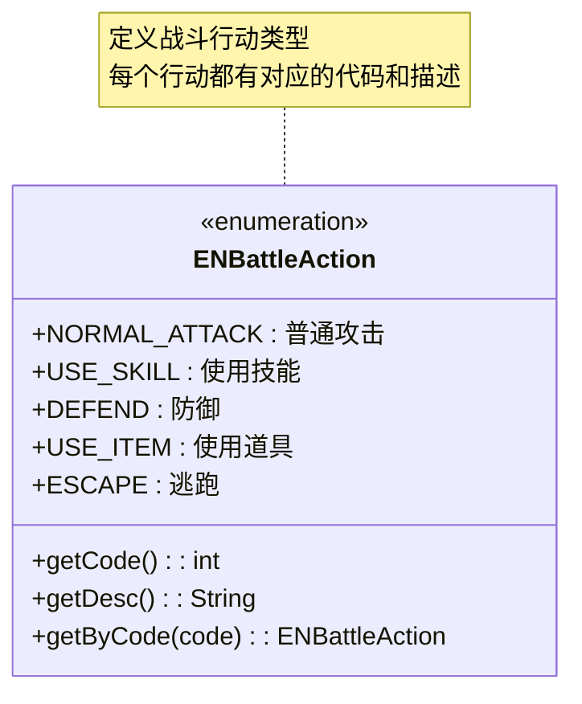
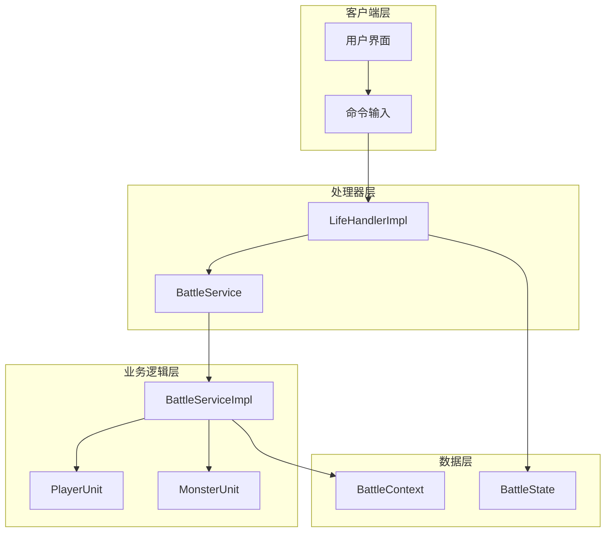
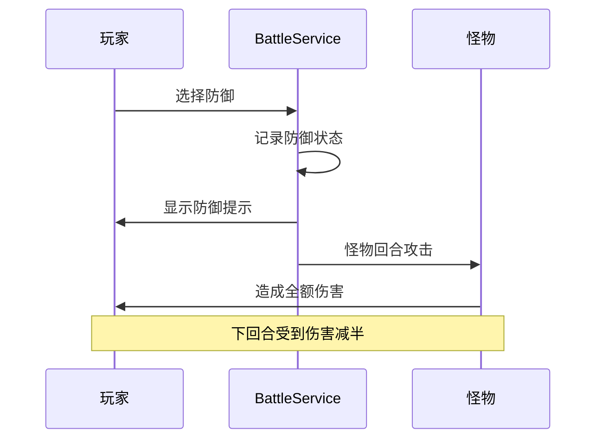
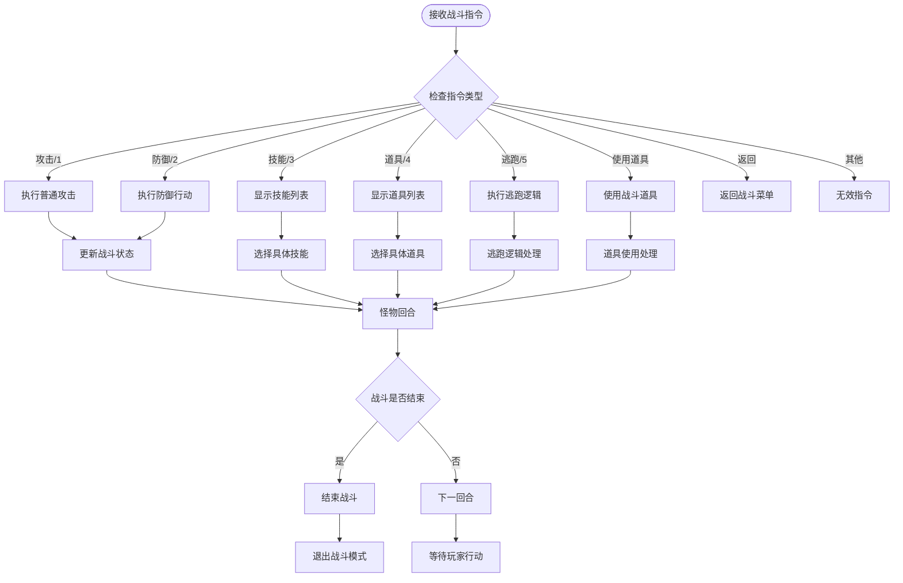
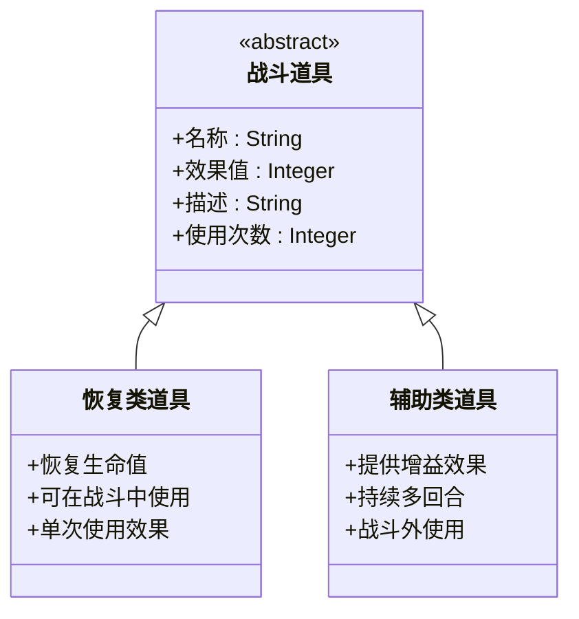
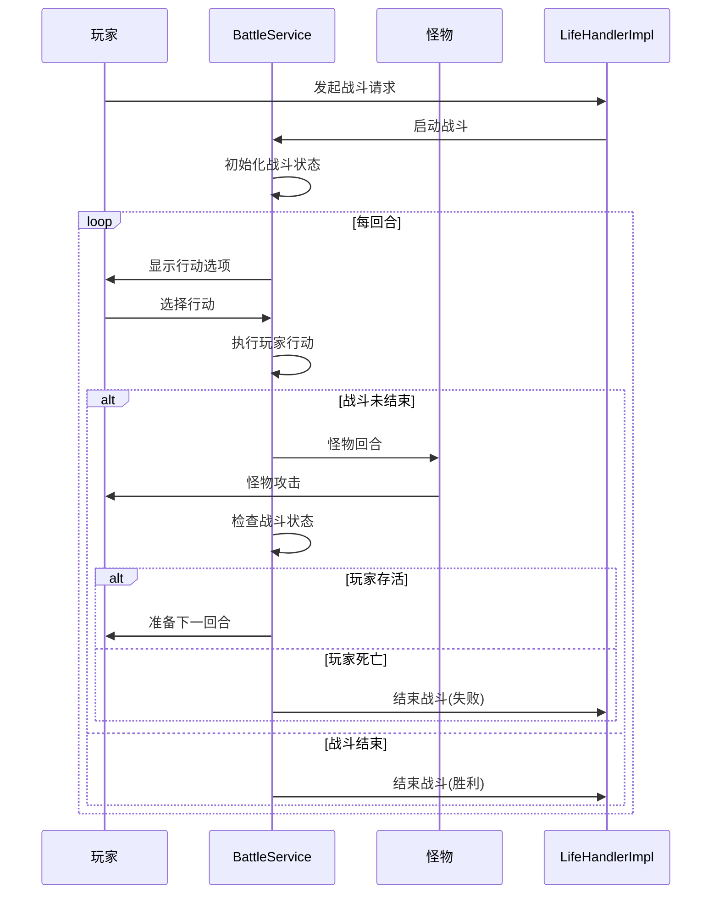

# 战斗行动

<cite>
**本文档引用的文件**
- [ENBattleAction.java](file://Life/src/main/java/com/bot/life/enums/ENBattleAction.java)
- [BattleService.java](file://Life/src/main/java/com/bot/life/service/BattleService.java)
- [BattleServiceImpl.java](file://Life/src/main/java/com/bot/life/service/impl/BattleServiceImpl.java)
- [LifeHandlerImpl.java](file://Life/src/main/java/com/bot/life/service/impl/LifeHandlerImpl.java)
</cite>

## 目录
1. [概述](#概述)
2. [战斗行动枚举](#战斗行动枚举)
3. [战斗服务架构](#战斗服务架构)
4. [五种战斗行动详解](#五种战斗行动详解)
5. [指令解析与行动分发](#指令解析与行动分发)
6. [防御行动机制](#防御行动机制)
7. [道具使用系统](#道具使用系统)
8. [战斗流程总结](#战斗流程总结)

## 概述

浮生卷游戏中的战斗系统采用回合制战斗模式，玩家在每回合可以选择五种不同的战斗行动：普通攻击、使用技能、防御、使用道具和逃跑。这些行动通过ENBattleAction枚举定义，并由BattleService接口统一管理，最终由LifeHandlerImpl类负责指令解析和战斗状态维护。

## 战斗行动枚举

ENBattleAction枚举定义了战斗中的五种基本行动类型：



**图表来源**
- [ENBattleAction.java](file://Life/src/main/java/com/bot/life/enums/ENBattleAction.java#L7-L12)

### 枚举常量说明

| 行动类型 | 代码 | 描述 |
|---------|------|------|
| NORMAL_ATTACK | 1 | 普通攻击，直接对敌人造成物理伤害 |
| USE_SKILL | 2 | 使用技能，消耗特定资源释放特殊效果 |
| DEFEND | 3 | 防御姿态，减少下回合受到的伤害 |
| USE_ITEM | 4 | 使用道具，在战斗中恢复或产生效果 |
| ESCAPE | 5 | 逃跑，尝试脱离战斗状态 |

**节来源**
- [ENBattleAction.java](file://Life/src/main/java/com/bot/life/enums/ENBattleAction.java#L7-L37)

## 战斗服务架构

战斗系统采用分层架构设计，核心组件包括：



**图表来源**
- [LifeHandlerImpl.java](file://Life/src/main/java/com/bot/life/service/impl/LifeHandlerImpl.java#L52-L106)
- [BattleService.java](file://Life/src/main/java/com/bot/life/service/BattleService.java#L12-L80)

**节来源**
- [LifeHandlerImpl.java](file://Life/src/main/java/com/bot/life/service/impl/LifeHandlerImpl.java#L52-L106)
- [BattleService.java](file://Life/src/main/java/com/bot/life/service/BattleService.java#L12-L80)

## 五种战斗行动详解

### 1. 普通攻击 (NORMAL_ATTACK)

普通攻击是最基础的战斗行动，玩家直接对敌人造成物理伤害。

#### 执行逻辑
- 调用executeNormalAttack方法
- 计算基础伤害值
- 应用属性相克效果
- 更新战斗状态

#### 伤害计算公式
```
最终伤害 = (攻击者攻击力 × 技能倍率) - (防御者防御力 × (1 - 破防率))
最小伤害 = 1
```

**节来源**
- [BattleServiceImpl.java](file://Life/src/main/java/com/bot/life/service/impl/BattleServiceImpl.java#L119-L138)

### 2. 使用技能 (USE_SKILL)

技能系统目前处于待实现状态，未来将支持各种特殊效果和连携技能。

#### 当前状态
- 显示"使用技能功能待实现"提示
- 需要扩展技能数据库和技能效果系统
- 支持冷却时间机制

**节来源**
- [BattleServiceImpl.java](file://Life/src/main/java/com/bot/life/service/impl/BattleServiceImpl.java#L65-L68)

### 3. 防御 (DEFEND)

防御行动可以减少下回合受到的伤害，是重要的生存策略。

#### 防御效果
- 下回合受到的伤害减少50%
- 提高生存能力
- 适合面对强敌时使用

#### 实现细节


**图表来源**
- [BattleServiceImpl.java](file://Life/src/main/java/com/bot/life/service/impl/BattleServiceImpl.java#L69-L71)

**节来源**
- [BattleServiceImpl.java](file://Life/src/main/java/com/bot/life/service/impl/BattleServiceImpl.java#L69-L71)

### 4. 使用道具 (USE_ITEM)

道具系统允许玩家在战斗中使用恢复类道具，提升生存能力。

#### 道具使用流程
1. **筛选可用道具**：只显示可在战斗中使用的恢复类道具
2. **选择道具**：根据道具序号选择要使用的物品
3. **应用效果**：恢复玩家生命值
4. **扣除道具**：减少道具数量

#### 道具限制
- 只有恢复类道具可在战斗中使用
- 使用后立即生效，无需等待回合结束
- 道具数量实时更新

**节来源**
- [LifeHandlerImpl.java](file://Life/src/main/java/com/bot/life/service/impl/LifeHandlerImpl.java#L1359-L1417)

### 5. 逃跑 (ESCAPE)

逃跑机制基于速度对比计算成功率，是战斗中的重要脱身手段。

#### 逃跑成功率计算
```
基础成功率 = 50%
速度差惩罚 = (怪物速度 - 玩家速度) / 10 × 2%
最终成功率 = max(10%, 基础成功率 - 速度差惩罚)
```

#### 逃跑结果处理
- **成功**：战斗结束，玩家安全离开
- **失败**：怪物发动攻击，玩家承受伤害

**节来源**
- [BattleServiceImpl.java](file://Life/src/main/java/com/bot/life/service/impl/BattleServiceImpl.java#L166-L178)
- [LifeHandlerImpl.java](file://Life/src/main/java/com/bot/life/service/impl/LifeHandlerImpl.java#L1419-L1484)

## 指令解析与行动分发

战斗模式下的指令解析由LifeHandlerImpl类负责，通过handleBattleMode方法实现：



**图表来源**
- [LifeHandlerImpl.java](file://Life/src/main/java/com/bot/life/service/impl/LifeHandlerImpl.java#L1151-L1206)

### 指令映射表

| 输入指令 | 对应行动 | 处理方法 |
|---------|---------|---------|
| 攻击/1 | NORMAL_ATTACK | handleAttack() |
| 防御/2 | DEFEND | handleDefense() |
| 技能/3 | USE_SKILL | handleBattleSkill() |
| 道具/4 | USE_ITEM | handleBattleItem() |
| 逃跑/5 | ESCAPE | handleBattleEscape() |
| 使用道具+序号 | USE_ITEM | handleUseBattleItem() |

**节来源**
- [LifeHandlerImpl.java](file://Life/src/main/java/com/bot/life/service/impl/LifeHandlerImpl.java#L1151-L1206)

## 防御行动机制

防御行动是战斗中的重要生存策略，具有以下特点：

### 防御效果实现
- **伤害减免**：下回合受到的伤害减少50%
- **状态标记**：在战斗上下文中记录防御状态
- **视觉反馈**：向玩家显示防御效果说明

### 防御时机
- 在玩家回合开始时生效
- 影响怪物的下一次攻击
- 不影响当前回合的攻击

### 防御策略建议
- 面对强敌时优先使用
- 结合道具使用提高生存能力
- 在关键战斗节点使用

**节来源**
- [BattleServiceImpl.java](file://Life/src/main/java/com/bot/life/service/impl/BattleServiceImpl.java#L69-L71)

## 道具使用系统

战斗道具系统提供了灵活的生存和辅助机制：

### 道具分类


**图表来源**
- [LifeHandlerImpl.java](file://Life/src/main/java/com/bot/life/service/impl/LifeHandlerImpl.java#L1328-L1356)

### 道具使用流程
1. **道具筛选**：只显示可在战斗中使用的恢复类道具
2. **数量检查**：确保玩家有足够的道具数量
3. **效果应用**：立即恢复生命值，不超过最大生命值
4. **库存更新**：扣除使用的道具数量

### 道具限制机制
- **类型限制**：只有恢复类道具可在战斗中使用
- **数量限制**：使用后道具数量相应减少
- **冷却机制**：部分道具可能有使用间隔

**节来源**
- [LifeHandlerImpl.java](file://Life/src/main/java/com/bot/life/service/impl/LifeHandlerImpl.java#L1359-L1417)

## 战斗流程总结

战斗系统遵循标准的回合制战斗流程：



**图表来源**
- [BattleServiceImpl.java](file://Life/src/main/java/com/bot/life/service/impl/BattleServiceImpl.java#L56-L96)
- [LifeHandlerImpl.java](file://Life/src/main/java/com/bot/life/service/impl/LifeHandlerImpl.java#L1151-L1206)

### 战斗胜利条件
- 怪物生命值降至0或以下
- 玩家获得经验值和灵粹奖励
- 可能获得怪物掉落物品

### 战斗失败条件
- 玩家生命值降至0或以下
- 玩家体力消耗过多
- 无法逃脱且无法战胜敌人

### 战斗状态管理
- 每回合更新战斗日志
- 维护玩家和怪物的状态信息
- 处理技能和道具的冷却时间

**节来源**
- [BattleServiceImpl.java](file://Life/src/main/java/com/bot/life/service/impl/BattleServiceImpl.java#L56-L96)
- [LifeHandlerImpl.java](file://Life/src/main/java/com/bot/life/service/impl/LifeHandlerImpl.java#L1151-L1206)

## 结论

浮生卷的战斗系统设计完善，涵盖了五种基本战斗行动，每种行动都有其独特的战略价值。通过ENBattleAction枚举统一管理行动类型，BattleService接口提供标准化的战斗逻辑，而LifeHandlerImpl类则负责具体的指令解析和状态维护。

防御行动的50%伤害减免机制为玩家提供了重要的生存保障，道具使用系统增加了战斗的策略深度，而逃跑机制则为不利局面提供了脱身机会。整个系统结构清晰，扩展性强，为未来的功能增强奠定了良好的基础。