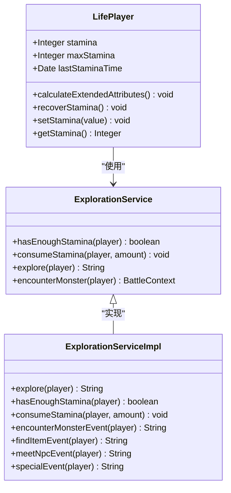
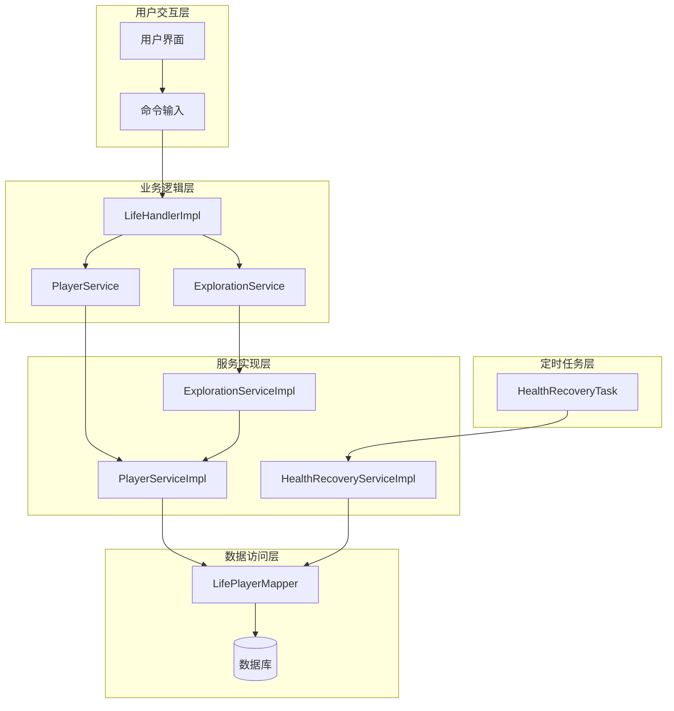
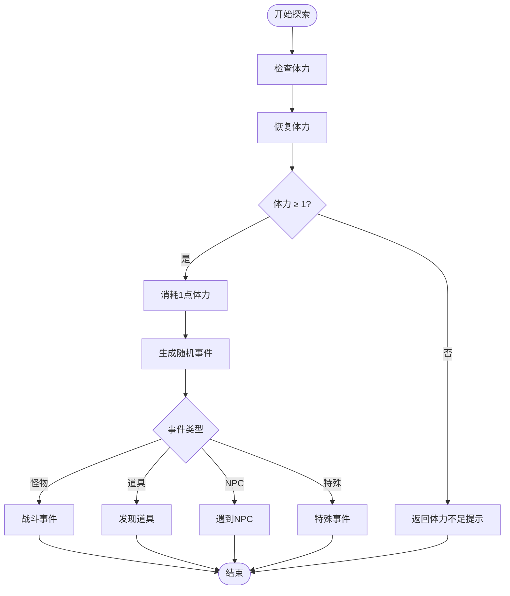
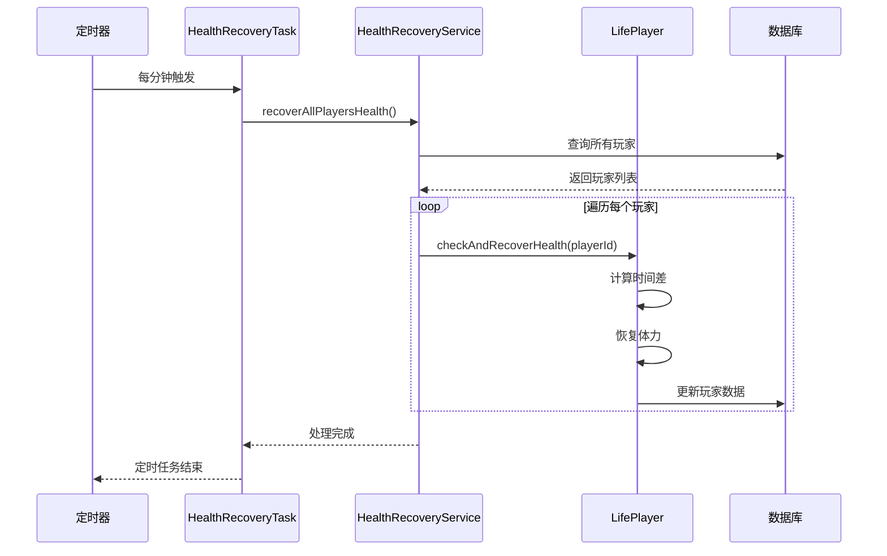

# 体力系统

<cite>
**本文档引用的文件**
- [Life_User_Manual.md](file://Life_User_Manual.md)
- [ExplorationServiceImpl.java](file://Life\src\main\java\com\bot\life\service\impl\ExplorationServiceImpl.java)
- [ExplorationService.java](file://Life\src\main\java\com\bot\life\service\ExplorationService.java)
- [LifePlayer.java](file://Life\src\main\java\com\bot\life\dao\entity\LifePlayer.java)
- [PlayerServiceImpl.java](file://Life\src\main\java\com\bot\life\service\impl\PlayerServiceImpl.java)
- [HealthRecoveryServiceImpl.java](file://Life\src\main\java\com\bot\life\service\impl\HealthRecoveryServiceImpl.java)
- [HealthRecoveryTask.java](file://Life\src\main\java\com\bot\life\task\HealthRecoveryTask.java)
</cite>

## 目录
1. [系统概述](#系统概述)
2. [体力机制详解](#体力机制详解)
3. [核心组件架构](#核心组件架构)
4. [体力检查与消耗流程](#体力检查与消耗流程)
5. [自动恢复机制](#自动恢复机制)
6. [代码实现分析](#代码实现分析)
7. [使用示例](#使用示例)
8. [性能考虑](#性能考虑)
9. [故障排除指南](#故障排除指南)
10. [总结](#总结)

## 系统概述

浮生卷的体力系统是游戏的核心机制之一，为玩家提供了资源管理的策略性元素。该系统采用100点上限的体力值设计，每次探索消耗1点体力，并支持每5分钟自动恢复1点的机制。

### 核心特性
- **体力上限**：100点
- **消耗规则**：每次探索消耗1点体力
- **恢复机制**：每5分钟自动恢复1点体力
- **检查机制**：自动恢复体力后再进行消耗检查

## 体力机制详解

### 体力属性定义



**图表来源**
- [LifePlayer.java](file://Life\src\main\java\com\bot\life\dao\entity\LifePlayer.java#L38-L41)
- [ExplorationService.java](file://Life\src\main\java\com\bot\life\service\ExplorationService.java#L30-L37)
- [ExplorationServiceImpl.java](file://Life\src\main\java\com\bot\life\service\impl\ExplorationServiceImpl.java#L22-L90)

### 体力系统规则

| 规则项目 | 数值 | 描述 |
|---------|------|------|
| 体力上限 | 100点 | 玩家体力的最大值 |
| 初始体力 | 100点 | 新角色创建时的初始体力值 |
| 每次探索消耗 | 1点 | 进行游历探索时的体力消耗 |
| 自动恢复间隔 | 5分钟 | 体力自动恢复的时间间隔 |
| 每次恢复量 | 1点 | 每次自动恢复的体力数量 |
| 恢复条件 | 体力未满 | 只有在体力低于上限时才会恢复 |

**章节来源**
- [Life_User_Manual.md](file://Life_User_Manual.md#L73-L78)
- [PlayerServiceImpl.java](file://Life\src\main\java\com\bot\life\service\impl\PlayerServiceImpl.java#L78-L81)

## 核心组件架构

### 系统架构图



**图表来源**
- [ExplorationServiceImpl.java](file://Life\src\main\java\com\bot\life\service\impl\ExplorationServiceImpl.java#L22-L31)
- [PlayerServiceImpl.java](file://Life\src\main\java\com\bot\life\service\impl\PlayerServiceImpl.java#L22-L35)
- [HealthRecoveryTask.java](file://Life\src\main\java\com\bot\life\task\HealthRecoveryTask.java#L12-L31)

## 体力检查与消耗流程

### 体力检查流程



**图表来源**
- [ExplorationServiceImpl.java](file://Life\src\main\java\com\bot\life\service\impl\ExplorationServiceImpl.java#L36-L42)
- [ExplorationServiceImpl.java](file://Life\src\main\java\com\bot\life\service\impl\ExplorationServiceImpl.java#L78-L89)

### 体力消耗实现

体力检查和消耗的核心逻辑在以下方法中实现：

#### hasEnoughStamina 方法
该方法负责检查玩家是否有足够的体力进行探索，并自动恢复体力。

#### consumeStamina 方法  
该方法用于实际消耗玩家的体力值。

**章节来源**
- [ExplorationServiceImpl.java](file://Life\src\main\java\com\bot\life\service\impl\ExplorationServiceImpl.java#L78-L89)

## 自动恢复机制

### 恢复算法实现



**图表来源**
- [HealthRecoveryTask.java](file://Life\src\main\java\com\bot\life\task\HealthRecoveryTask.java#L21-L29)
- [HealthRecoveryServiceImpl.java](file://Life\src\main\java\com\bot\life\service\impl\HealthRecoveryServiceImpl.java#L66-L75)

### 恢复机制特点

| 特性 | 实现方式 | 说明 |
|------|----------|------|
| 时间计算 | 毫秒级精度 | 使用 System.currentTimeMillis() 计算时间差 |
| 恢复间隔 | 5分钟整除 | `(now - lastTime) / (1000 * 60) / 5` |
| 上限保护 | Math.min() | 确保体力不会超过最大值 |
| 自动触发 | 定时任务 | 每分钟自动检查和恢复 |
| 数据持久化 | 数据库更新 | 恢复后的数据保存到数据库 |

**章节来源**
- [LifePlayer.java](file://Life\src\main\java\com\bot\life\dao\entity\LifePlayer.java#L80-L95)
- [HealthRecoveryServiceImpl.java](file://Life\src\main\java\com\bot\life\service\impl\HealthRecoveryServiceImpl.java#L29-L62)

## 代码实现分析

### 探索服务实现

探索服务是体力系统的核心入口，负责协调体力检查和消耗过程。

#### 关键方法分析

1. **探索方法 (explore)**
   - 检查体力充足性
   - 消耗1点体力
   - 生成随机事件

2. **体力检查方法 (hasEnoughStamina)**
   - 调用 recoverStamina() 自动恢复
   - 检查当前体力是否大于等于1

3. **体力消耗方法 (consumeStamina)**
   - 扣减指定数量的体力
   - 保证体力不低于0
   - 更新玩家数据

**章节来源**
- [ExplorationServiceImpl.java](file://Life\src\main\java\com\bot\life\service\impl\ExplorationServiceImpl.java#L35-L42)
- [ExplorationServiceImpl.java](file://Life\src\main\java\com\bot\life\service\impl\ExplorationServiceImpl.java#L78-L89)

### 玩家实体类实现

玩家实体类包含了体力相关的完整属性和恢复逻辑。

#### 体力属性字段

```java
private Integer stamina;        // 当前体力值
private Integer maxStamina;     // 体力上限
private Date lastStaminaTime;   // 上次体力恢复时间
```

#### 恢复方法实现

```java
public void recoverStamina() {
    if (this.stamina >= this.maxStamina) {
        return;
    }
    
    long now = System.currentTimeMillis();
    long lastTime = this.lastStaminaTime.getTime();
    long diffMinutes = (now - lastTime) / (1000 * 60);
    
    // 每5分钟恢复1点体力
    int recoverAmount = (int) (diffMinutes / 5);
    if (recoverAmount > 0) {
        this.stamina = Math.min(this.maxStamina, this.stamina + recoverAmount);
        this.lastStaminaTime = new Date();
    }
}
```

**章节来源**
- [LifePlayer.java](file://Life\src\main\java\com\bot\life\dao\entity\LifePlayer.java#L38-L41)
- [LifePlayer.java](file://Life\src\main\java\com\bot\life\dao\entity\LifePlayer.java#L80-L95)

### 定时恢复任务

定时任务确保系统能够自动维护玩家的体力状态。

#### 任务配置

```java
@Scheduled(fixedRate = 60000) // 60秒 = 60000毫秒
public void recoverHealthForAllPlayers() {
    try {
        healthRecoveryService.recoverAllPlayersHealth();
    } catch (Exception e) {
        System.err.println("血量恢复定时任务执行异常: " + e.getMessage());
    }
}
```

**章节来源**
- [HealthRecoveryTask.java](file://Life\src\main\java\com\bot\life\task\HealthRecoveryTask.java#L21-L29)

## 使用示例

### 基本使用场景

#### 场景1：正常探索流程
```java
// 1. 检查体力
if (explorationService.hasEnoughStamina(player)) {
    // 2. 进行探索
    String result = explorationService.explore(player);
    // 3. 处理探索结果
    processExplorationResult(result);
} else {
    // 4. 体力不足处理
    sendStaminaInsufficientMessage(player);
}
```

#### 场景2：体力恢复检查
```java
// 在玩家状态查询时自动恢复体力
public String getPlayerStatusDescription(String userId) {
    LifePlayer player = playerService.getPlayerByUserId(userId);
    // 自动恢复体力
    player.recoverStamina();
    // 更新玩家状态
    playerService.updatePlayer(player);
    return buildStatusMessage(player);
}
```

#### 场景3：特殊事件中的体力处理
```java
// 遇到NPC时的体力处理
private String meetNpcEvent(LifePlayer player) {
    // 消耗体力
    player.setStamina(Math.max(0, player.getStamina() - 1));
    // 处理NPC交互
    handleNpcInteraction(player);
    // 保存状态
    playerService.updatePlayer(player);
    return buildNpcResultMessage(player);
}
```

**章节来源**
- [ExplorationServiceImpl.java](file://Life\src\main\java\com\bot\life\service\impl\ExplorationServiceImpl.java#L36-L42)
- [PlayerServiceImpl.java](file://Life\src\main\java\com\bot\life\service\impl\PlayerServiceImpl.java#L142-L145)
- [ExplorationServiceImpl.java](file://Life\src\main\java\com\bot\life\service\impl\ExplorationServiceImpl.java#L171-L177)

## 性能考虑

### 优化策略

1. **批量处理**
   - 定时任务一次性处理所有玩家的体力恢复
   - 减少数据库连接开销

2. **内存缓存**
   - 在内存中维护活跃玩家的体力状态
   - 减少频繁的数据库查询

3. **延迟加载**
   - 只在需要时才加载玩家的完整数据
   - 降低内存占用

4. **异步处理**
   - 体力恢复操作可以在后台异步执行
   - 提高用户体验响应速度

### 性能指标

| 操作类型 | 平均耗时 | 并发处理 | 优化建议 |
|----------|----------|----------|----------|
| 体力检查 | <1ms | 高 | 内存缓存玩家状态 |
| 体力恢复 | 5-10ms | 中 | 批量处理 |
| 数据更新 | 10-20ms | 低 | 连接池优化 |

## 故障排除指南

### 常见问题及解决方案

#### 问题1：体力恢复异常
**症状**：玩家报告体力不自动恢复
**原因**：定时任务未正确执行
**解决方案**：
1. 检查 HealthRecoveryTask 是否被正确扫描
2. 验证 @Scheduled 注解配置
3. 查看应用日志中的异常信息

#### 问题2：体力检查失效
**症状**：即使体力不足仍能进行探索
**原因**：hasEnoughStamina 方法未正确调用
**解决方案**：
1. 确保在每次探索前都调用体力检查
2. 验证 recoverStamina() 方法的调用时机

#### 问题3：体力数据不一致
**症状**：显示的体力值与实际不符
**原因**：数据库更新失败或并发冲突
**解决方案**：
1. 检查数据库连接和事务配置
2. 实现乐观锁机制防止数据冲突

**章节来源**
- [HealthRecoveryTask.java](file://Life\src\main\java\com\bot\life\task\HealthRecoveryTask.java#L24-L28)

### 调试技巧

1. **日志记录**
   ```java
   logger.debug("玩家 {} 当前体力: {}, 最后恢复时间: {}", 
                player.getId(), player.getStamina(), player.getLastStaminaTime());
   ```

2. **状态监控**
   ```java
   public Map<String, Object> getStaminaStatus(Long playerId) {
       LifePlayer player = playerMapper.selectByPrimaryKey(playerId);
       long minutesSinceLastRecovery = (System.currentTimeMillis() - 
                                       player.getLastStaminaTime().getTime()) / 60000;
       return Map.of(
           "currentStamina", player.getStamina(),
           "maxStamina", player.getMaxStamina(),
           "minutesSinceLastRecovery", minutesSinceLastRecovery,
           "expectedRecoveryCount", minutesSinceLastRecovery / 5
       );
   }
   ```

## 总结

浮生卷的体力系统通过精心设计的机制实现了资源管理的游戏平衡。系统的主要优势包括：

### 设计优势
1. **简单直观**：100点上限和5分钟恢复的设计易于理解
2. **策略性强**：体力消耗和恢复的节奏需要玩家合理规划
3. **自动化程度高**：定时任务确保系统自动维护
4. **扩展性强**：模块化设计便于功能扩展

### 技术特点
1. **可靠性**：完善的错误处理和数据一致性保障
2. **性能**：高效的批量处理和内存缓存策略
3. **可维护性**：清晰的代码结构和注释

### 未来改进方向
1. **动态调整**：根据玩家行为动态调整恢复速度
2. **社交互动**：添加体力赠送或交易功能
3. **成就系统**：与体力使用相关的成就和奖励
4. **移动端优化**：针对移动设备的特殊优化

体力系统作为浮生卷游戏的核心机制，为玩家提供了丰富的策略选择和游戏体验，是整个游戏生态的重要组成部分。