# 探索机制

<cite>
**本文档引用的文件**
- [ExplorationServiceImpl.java](file://Life/src/main/java/com/bot/life/service/impl/ExplorationServiceImpl.java)
- [ExplorationService.java](file://Life/src/main/java/com/bot/life/service/ExplorationService.java)
- [BattleService.java](file://Life/src/main/java/com/bot/life/service/BattleService.java)
- [PlayerService.java](file://Life/src/main/java/com/bot/life/service/PlayerService.java)
- [LifePlayer.java](file://Life/src/main/java/com/bot/life/dao/entity/LifePlayer.java)
- [LifeMonster.java](file://Life/src/main/java/com/bot/life/dao/entity/LifeMonster.java)
- [Life_User_Manual.md](file://Life_User_Manual.md)
- [GameConsts.java](file://Common/src/main/java/com/bot/common/constant/GameConsts.java)
</cite>

## 目录
1. [概述](#概述)
2. [探索系统架构](#探索系统架构)
3. [核心组件分析](#核心组件分析)
4. [探索流程详解](#探索流程详解)
5. [事件概率分配机制](#事件概率分配机制)
6. [事件处理逻辑](#事件处理逻辑)
7. [体力系统集成](#体力系统集成)
8. [战斗系统集成](#战斗系统集成)
9. [NPC交互系统](#npc交互系统)
10. [特殊事件处理](#特殊事件处理)
11. [性能优化考虑](#性能优化考虑)
12. [故障排除指南](#故障排除指南)

## 概述

浮生卷的探索机制是一个基于随机事件的概率系统，玩家通过"游历探索"功能在游戏世界中进行冒险。该系统采用概率分布设计，为玩家提供多样化的游戏体验，包括遭遇怪物、发现道具、遇到NPC以及触发特殊事件等多种可能性。

探索系统的核心特点：
- **随机性**：基于概率的事件触发机制
- **多样性**：多种事件类型提供丰富的游戏体验
- **资源管理**：体力系统确保游戏平衡
- **战斗集成**：与战斗系统无缝衔接
- **状态反馈**：清晰的事件结果展示

## 探索系统架构

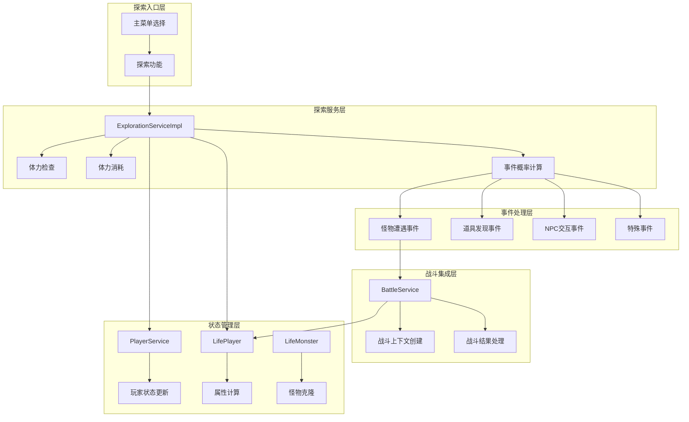

**图表来源**
- [ExplorationServiceImpl.java](file://Life/src/main/java/com/bot/life/service/impl/ExplorationServiceImpl.java#L34-L60)
- [BattleService.java](file://Life/src/main/java/com/bot/life/service/BattleService.java#L16-L22)

## 核心组件分析

### ExplorationServiceImpl 核心实现

探索服务的核心实现包含了完整的探索逻辑，主要包含以下关键方法：

#### 主探索方法
- **explore()**：执行完整的探索流程，包括体力检查、事件触发和结果处理
- **encounterMonster()**：专门处理怪物遭遇逻辑
- **hasEnoughStamina()**：检查并恢复玩家体力
- **consumeStamina()**：消耗玩家体力

#### 事件处理方法
- **encounterMonsterEvent()**：怪物遭遇事件处理
- **findItemEvent()**：道具发现事件处理
- **meetNpcEvent()**：NPC交互事件处理
- **specialEvent()**：特殊事件处理

**章节来源**
- [ExplorationServiceImpl.java](file://Life/src/main/java/com/bot/life/service/impl/ExplorationServiceImpl.java#L34-L224)

### 探索服务接口

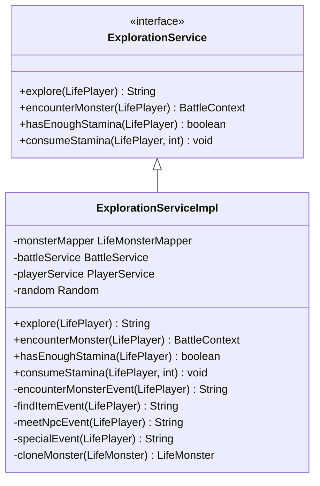

**图表来源**
- [ExplorationService.java](file://Life/src/main/java/com/bot/life/service/ExplorationService.java#L10-L39)
- [ExplorationServiceImpl.java](file://Life/src/main/java/com/bot/life/service/impl/ExplorationServiceImpl.java#L20-L33)

## 探索流程详解

探索流程遵循严格的步骤顺序，确保游戏平衡性和用户体验的一致性：

```mermaid
flowchart TD
A[玩家发起探索] --> B{检查体力}
B --> |体力不足| C[返回体力不足消息]
B --> |体力充足| D[消耗1点体力]
D --> E[生成随机数 0-99]
E --> F{事件概率判断}
F --> |0-69 (70%)| G[怪物遭遇事件]
F --> |70-84 (15%)| H[道具发现事件]
F --> |85-94 (10%)| I[NPC交互事件]
F --> |95-99 (5%)| J[特殊事件]
G --> K[查找当前地图怪物]
K --> L{是否有怪物}
L --> |有怪物| M[随机选择怪物]
L --> |无怪物| N[返回空闲消息]
M --> O[创建战斗上下文]
O --> P[返回战斗邀请]
H --> Q[随机选择道具]
Q --> R[返回发现消息]
I --> S[随机选择NPC]
S --> T[执行NPC交互逻辑]
T --> U[返回交互结果]
J --> V[随机选择特殊事件]
V --> W[应用事件效果]
W --> X[返回事件结果]
C --> Y[结束]
N --> Y
P --> Y
R --> Y
U --> Y
X --> Y
```

**图表来源**
- [ExplorationServiceImpl.java](file://Life/src/main/java/com/bot/life/service/impl/ExplorationServiceImpl.java#L35-L59)

**章节来源**
- [ExplorationServiceImpl.java](file://Life/src/main/java/com/bot/life/service/impl/ExplorationServiceImpl.java#L35-L59)

## 事件概率分配机制

探索系统采用精确的概率分配机制，确保各种事件类型的出现频率符合设计预期：

| 事件类型 | 概率范围 | 百分比 | 事件描述 |
|---------|---------|--------|----------|
| 怪物遭遇 | 0-69 | 70% | 遭遇随机怪物，可能触发战斗 |
| 道具发现 | 70-84 | 15% | 发现随机道具，暂未实际获得 |
| NPC交互 | 85-94 | 10% | 遇到不同类型的NPC，提供各种奖励 |
| 特殊事件 | 95-99 | 5% | 随机特殊事件，提供丰厚奖励 |

### 概率计算实现

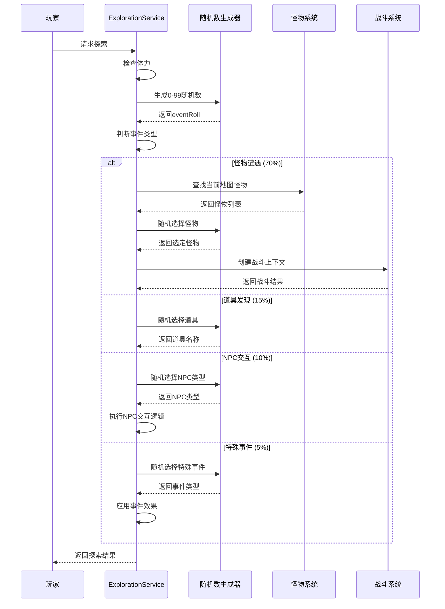

**图表来源**
- [ExplorationServiceImpl.java](file://Life/src/main/java/com/bot/life/service/impl/ExplorationServiceImpl.java#L45-L59)

**章节来源**
- [ExplorationServiceImpl.java](file://Life/src/main/java/com/bot/life/service/impl/ExplorationServiceImpl.java#L45-L59)

## 事件处理逻辑

### 怪物遭遇事件处理

怪物遭遇是最常见的探索事件，系统会根据玩家所在地图查找合适的怪物：

#### 怪物选择机制
1. **地图匹配**：根据玩家当前地图ID查找怪物
2. **随机选择**：从符合条件的怪物列表中随机选择
3. **副本创建**：创建怪物副本避免修改原始数据
4. **战斗准备**：启动战斗系统准备战斗

#### 怪物遭遇流程

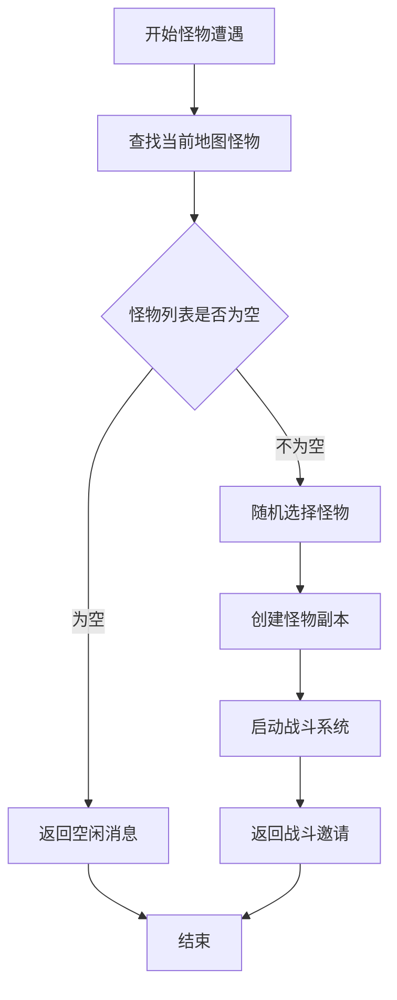

**图表来源**
- [ExplorationServiceImpl.java](file://Life/src/main/java/com/bot/life/service/impl/ExplorationServiceImpl.java#L63-L76)

### 道具发现事件处理

道具发现事件目前处于开发阶段，系统预留了基本框架：

#### 道具池设计
- **小修为丹**：基础修炼道具
- **回春丹**：恢复血量道具
- **灵石**：游戏货币
- **神秘卷轴**：特殊功能道具

**章节来源**
- [ExplorationServiceImpl.java](file://Life/src/main/java/com/bot/life/service/impl/ExplorationServiceImpl.java#L108-L114)

### NPC交互事件处理

NPC交互是最复杂的事件类型，包含四种不同类型的NPC：

#### NPC类型及交互逻辑

| NPC类型 | 交互内容 | 奖励类型 | 实现复杂度 |
|---------|----------|----------|------------|
| 神秘商人 | 展示珍贵道具 | 灵粹/道具 | 中等 |
| 云游道士 | 传授修炼心得 | 修为奖励 | 简单 |
| 采药老人 | 提供血量恢复 | 血量恢复 | 简单 |
| 剑客 | 教授战斗技巧 | 临时buff | 复杂 |

#### NPC交互流程

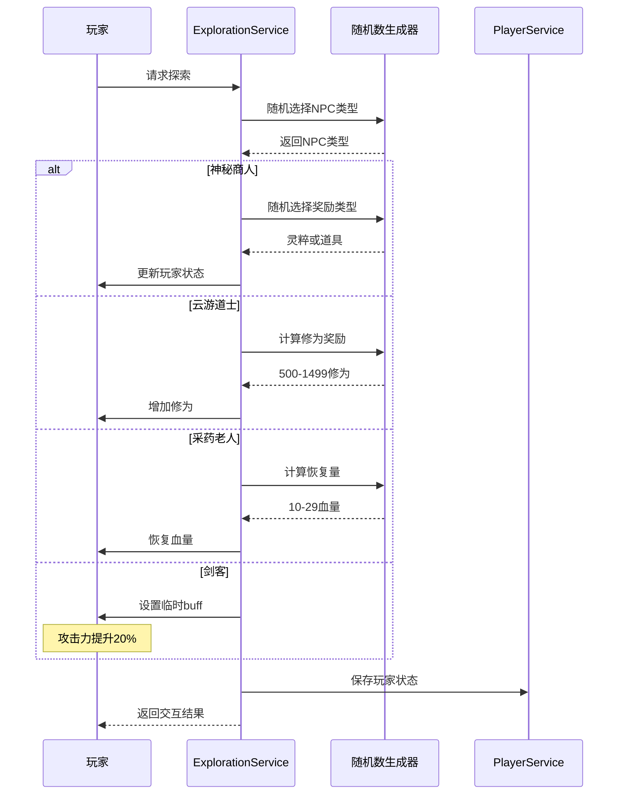

**图表来源**
- [ExplorationServiceImpl.java](file://Life/src/main/java/com/bot/life/service/impl/ExplorationServiceImpl.java#L116-L178)

**章节来源**
- [ExplorationServiceImpl.java](file://Life/src/main/java/com/bot/life/service/impl/ExplorationServiceImpl.java#L116-L178)

## 体力系统集成

探索系统与体力系统紧密集成，确保游戏平衡性：

### 体力检查机制

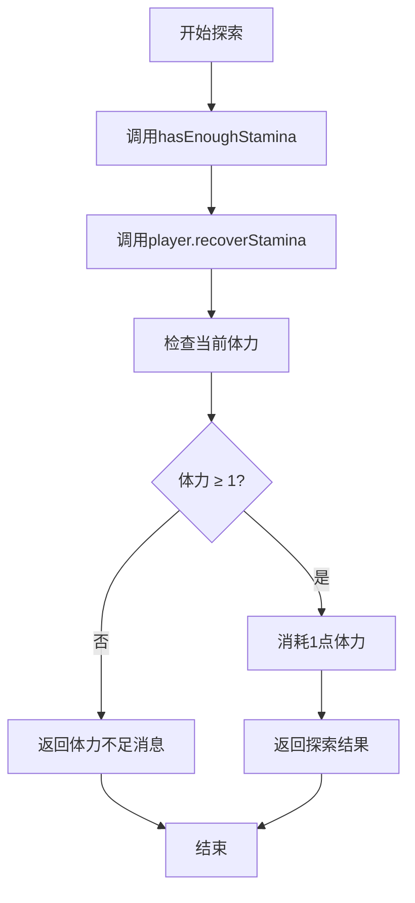

**图表来源**
- [ExplorationServiceImpl.java](file://Life/src/main/java/com/bot/life/service/impl/ExplorationServiceImpl.java#L79-L83)

### 体力消耗与恢复

- **消耗规则**：每次探索消耗1点体力
- **恢复机制**：每5分钟恢复1点体力
- **检查时机**：探索前自动检查并恢复体力

**章节来源**
- [ExplorationServiceImpl.java](file://Life/src/main/java/com/bot/life/service/impl/ExplorationServiceImpl.java#L79-L89)

## 战斗系统集成

探索系统与战斗系统的集成是核心功能之一：

### 战斗上下文创建

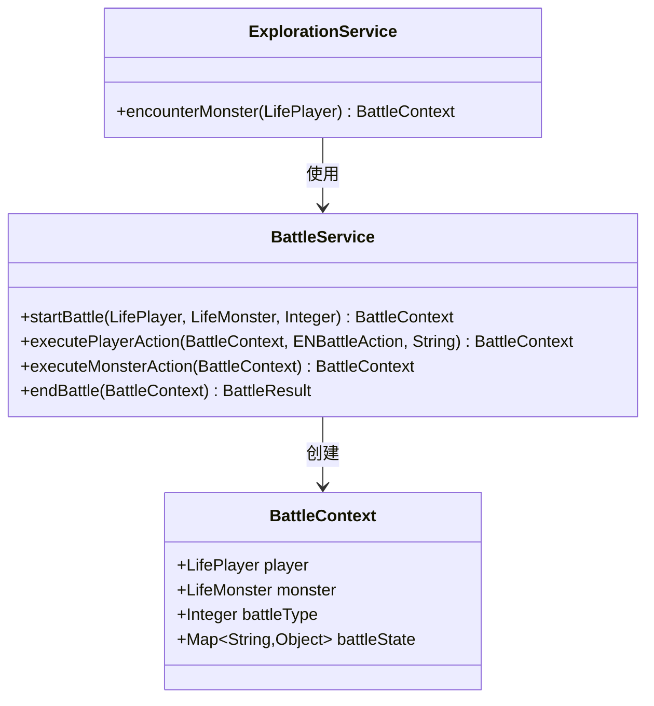

**图表来源**
- [ExplorationServiceImpl.java](file://Life/src/main/java/com/bot/life/service/impl/ExplorationServiceImpl.java#L63-L76)
- [BattleService.java](file://Life/src/main/java/com/bot/life/service/BattleService.java#L16-L22)

### 怪物克隆机制

为了避免修改原始怪物数据，系统采用克隆机制：

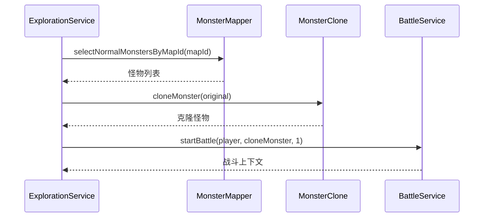

**图表来源**
- [ExplorationServiceImpl.java](file://Life/src/main/java/com/bot/life/service/impl/ExplorationServiceImpl.java#L206-L222)

**章节来源**
- [ExplorationServiceImpl.java](file://Life/src/main/java/com/bot/life/service/impl/ExplorationServiceImpl.java#L63-L76)
- [ExplorationServiceImpl.java](file://Life/src/main/java/com/bot/life/service/impl/ExplorationServiceImpl.java#L206-L222)

## NPC交互系统

NPC交互系统提供了丰富的游戏内容和奖励机制：

### NPC类型设计

#### 神秘商人
- **交互内容**：展示珍贵道具
- **奖励机制**：随机给予灵粹或道具
- **概率计算**：50%灵粹，50%道具

#### 云游道士
- **交互内容**：传授修炼心得
- **奖励机制**：固定范围的修为奖励
- **数值范围**：500-1499修为

#### 采药老人
- **交互内容**：提供血量恢复
- **奖励机制**：随机血量恢复
- **数值范围**：10-29血量

#### 剑客
- **交互内容**：教授战斗技巧
- **奖励机制**：临时攻击力提升
- **效果持续**：下次战斗中生效

### NPC交互状态管理

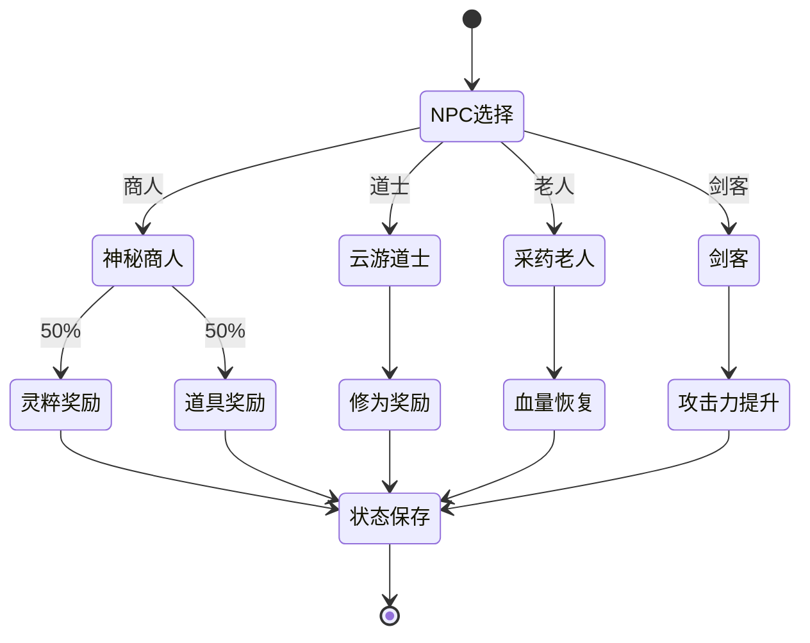

**图表来源**
- [ExplorationServiceImpl.java](file://Life/src/main/java/com/bot/life/service/impl/ExplorationServiceImpl.java#L116-L178)

**章节来源**
- [ExplorationServiceImpl.java](file://Life/src/main/java/com/bot/life/service/impl/ExplorationServiceImpl.java#L116-L178)

## 特殊事件处理

特殊事件系统提供了最丰厚的奖励和最佳的游戏体验：

### 特殊事件类型

#### 奇遇事件
- **事件描述**：发现隐秘修炼之地
- **奖励内容**：1000修为
- **触发概率**：5%

#### 顿悟事件
- **事件描述**：突然有所感悟
- **奖励内容**：所有属性+1
- **触发概率**：5%

#### 灵泉事件
- **事件描述**：发现灵泉，精神大振
- **奖励内容**：体力完全恢复
- **触发概率**：5%

### 特殊事件处理流程

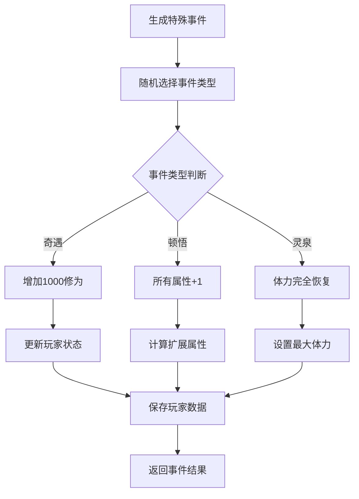

**图表来源**
- [ExplorationServiceImpl.java](file://Life/src/main/java/com/bot/life/service/impl/ExplorationServiceImpl.java#L180-L204)

**章节来源**
- [ExplorationServiceImpl.java](file://Life/src/main/java/com/bot/life/service/impl/ExplorationServiceImpl.java#L180-L204)

## 性能优化考虑

### 内存管理优化

#### 怪物克隆优化
- **深拷贝控制**：只复制必要的怪物属性
- **内存复用**：避免频繁的对象创建
- **垃圾回收友好**：及时释放不需要的对象

#### 随机数生成优化
- **单例模式**：使用单一Random实例
- **种子管理**：避免重复的随机序列
- **性能监控**：监控随机数生成性能

### 数据库访问优化

#### 怪物查询优化
- **索引利用**：确保mapId字段有索引
- **批量查询**：一次性获取所有可用怪物
- **缓存策略**：缓存常用的地图怪物数据

#### 玩家状态更新优化
- **批量操作**：合并多个状态更新
- **异步处理**：非关键状态更新异步执行
- **事务管理**：合理使用数据库事务

### 并发处理优化

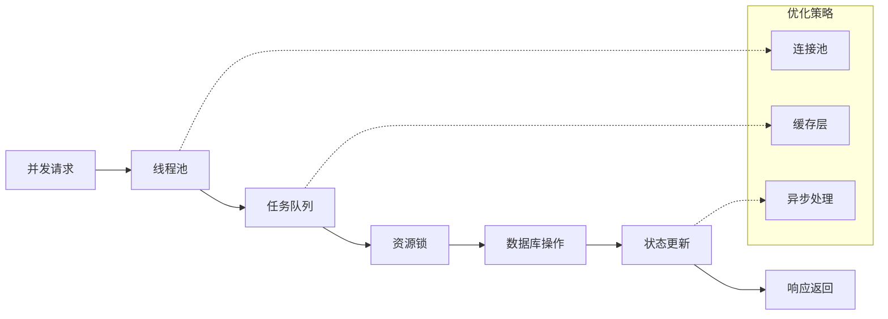

## 故障排除指南

### 常见问题及解决方案

#### 体力不足问题
**症状**：无法进行探索，提示体力不足
**原因**：当前体力小于1点
**解决方案**：
1. 等待5分钟自动恢复
2. 检查体力恢复机制是否正常工作
3. 验证player.recoverStamina()方法调用

#### 怪物遭遇异常
**症状**：探索时没有怪物可遭遇
**原因**：当前地图没有可用怪物
**解决方案**：
1. 检查地图怪物配置
2. 验证monsterMapper查询逻辑
3. 确认怪物数据完整性

#### NPC交互失败
**症状**：NPC交互逻辑异常
**原因**：随机数生成或状态更新问题
**解决方案**：
1. 检查Random实例状态
2. 验证玩家状态保存逻辑
3. 确认NPC交互分支逻辑

#### 战斗系统集成问题
**症状**：怪物遭遇后战斗异常
**原因**：战斗上下文创建失败
**解决方案**：
1. 检查怪物克隆过程
2. 验证战斗服务调用
3. 确认战斗状态初始化

### 调试工具和方法

#### 日志记录
- **探索开始**：记录玩家状态和地图信息
- **事件触发**：记录事件类型和概率
- **结果处理**：记录最终结果和状态变化

#### 性能监控
- **响应时间**：监控探索响应时间
- **内存使用**：监控内存占用情况
- **数据库查询**：监控数据库查询性能

#### 异常处理
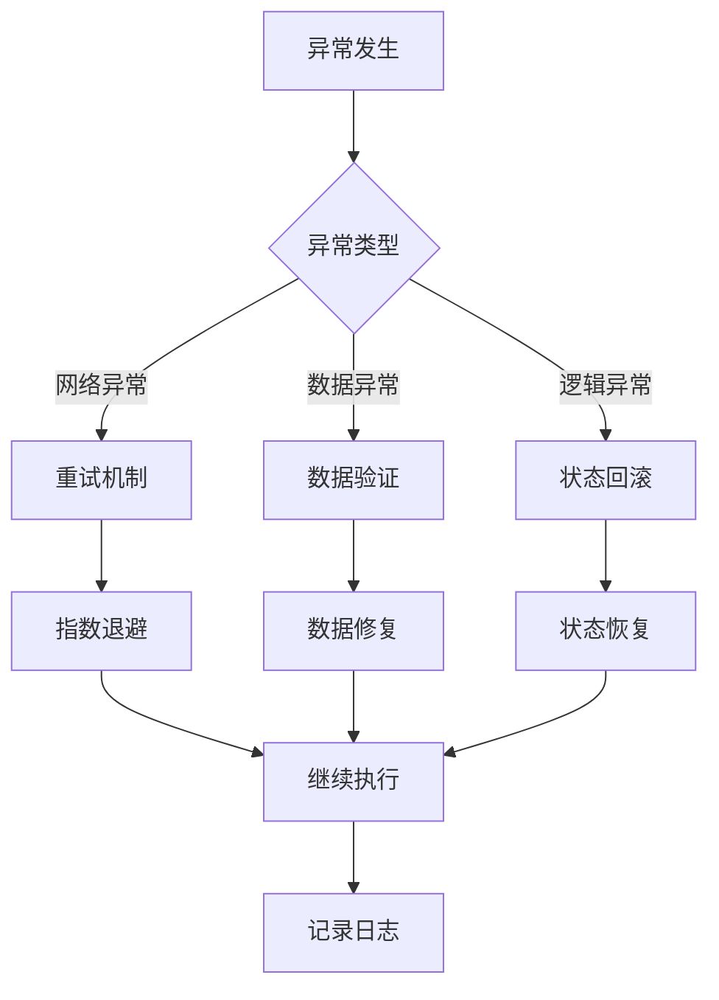

**章节来源**
- [ExplorationServiceImpl.java](file://Life/src/main/java/com/bot/life/service/impl/ExplorationServiceImpl.java#L37-L40)
- [ExplorationServiceImpl.java](file://Life/src/main/java/com/bot/life/service/impl/ExplorationServiceImpl.java#L91-L101)

## 总结

浮生卷的探索机制是一个精心设计的概率系统，通过合理的事件概率分配、完善的体力管理系统和丰富的交互内容，为玩家提供了充满惊喜和挑战的游戏体验。系统采用模块化设计，具有良好的可扩展性和维护性，能够支持未来更多的探索事件类型和交互方式。

探索机制的成功实施依赖于以下几个关键因素：
- **概率平衡**：合理的事件概率确保游戏体验的多样性
- **系统集成**：与战斗、NPC、道具系统的无缝集成
- **性能优化**：高效的算法和数据结构保证系统响应速度
- **错误处理**：完善的异常处理机制确保系统稳定性

通过持续的优化和改进，探索机制将继续为玩家带来更加丰富和有趣的游戏体验。