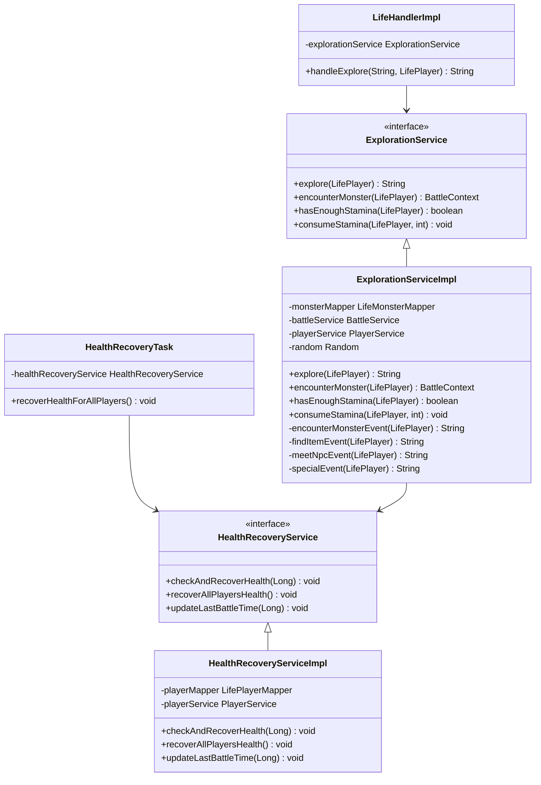
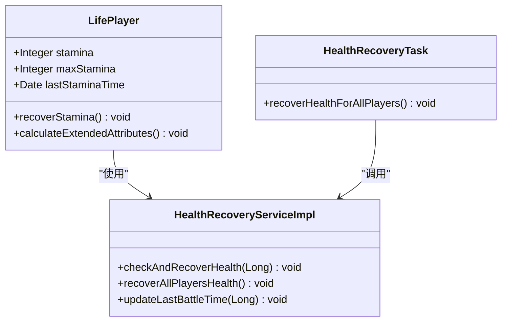
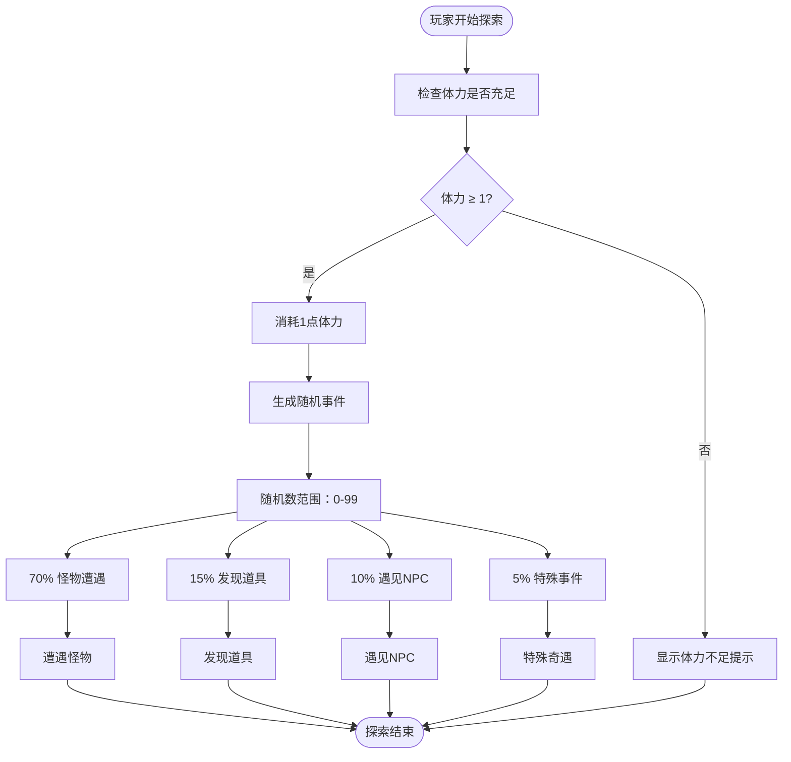
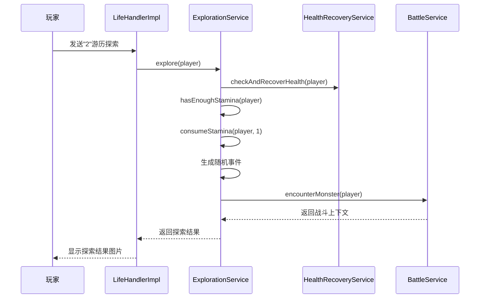
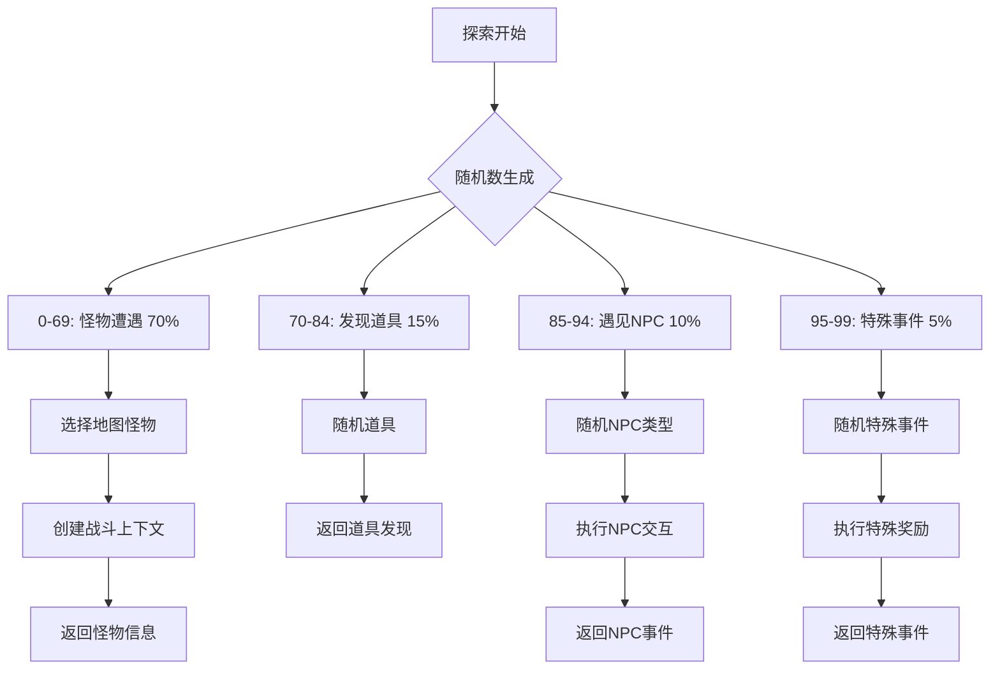
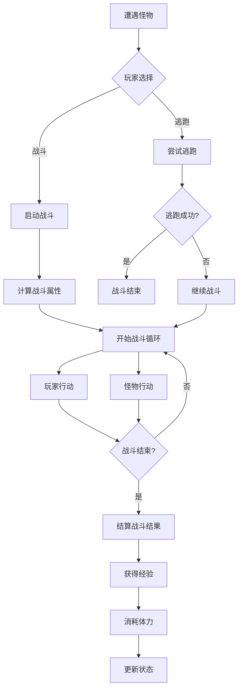
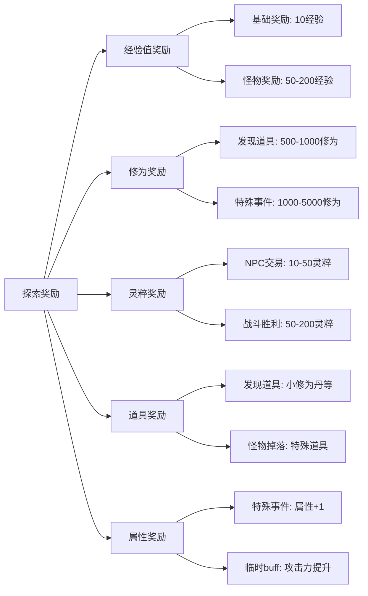
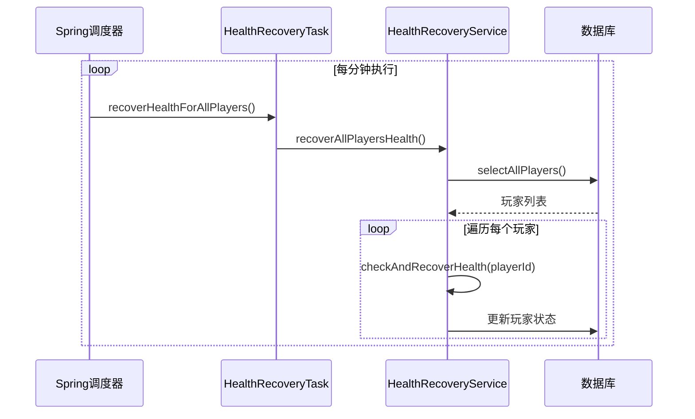

# 游历探索

<cite>
**本文档引用的文件**
- [ExplorationService.java](file://Life/src/main/java/com/bot/life/service/ExplorationService.java)
- [ExplorationServiceImpl.java](file://Life/src/main/java/com/bot/life/service/impl/ExplorationServiceImpl.java)
- [LifeHandlerImpl.java](file://Life/src/main/java/com/bot/life/service/impl/LifeHandlerImpl.java)
- [HealthRecoveryService.java](file://Life/src/main/java/com/bot/life/service/impl/HealthRecoveryServiceImpl.java)
- [HealthRecoveryTask.java](file://Life/src/main/java/com/bot/life/task/HealthRecoveryTask.java)
- [LifePlayer.java](file://Life/src/main/java/com/bot/life/dao/entity/LifePlayer.java)
- [Life_User_Manual.md](file://Life_User_Manual.md)
</cite>

## 目录
1. [概述](#概述)
2. [探索机制架构](#探索机制架构)
3. [体力系统](#体力系统)
4. [探索流程](#探索流程)
5. [随机事件系统](#随机事件系统)
6. [战斗机制](#战斗机制)
7. [奖励机制](#奖励机制)
8. [性能优化](#性能优化)
9. [故障排除](#故障排除)
10. [总结](#总结)

## 概述

游历探索是浮生卷游戏中的核心功能之一，允许玩家在游戏世界中进行探索，随机遭遇各种事件。该系统通过复杂的概率算法和事件处理机制，为玩家提供丰富的游戏体验。

### 主要特性

- **体力消耗机制**：每次探索消耗1点体力
- **自动恢复机制**：每5分钟恢复1点体力
- **随机事件系统**：包括怪物遭遇、道具发现、NPC互动等
- **战斗触发**：随机遭遇怪物并触发战斗
- **奖励多样化**：经验值、道具、修为等多种奖励

## 探索机制架构

**图表来源**
- [ExplorationService.java](file://Life/src/main/java/com/bot/life/service/ExplorationService.java#L9-L39)
- [ExplorationServiceImpl.java](file://Life/src/main/java/com/bot/life/service/impl/ExplorationServiceImpl.java#L20-L224)
- [LifeHandlerImpl.java](file://Life/src/main/java/com/bot/life/service/impl/LifeHandlerImpl.java#L473-L476)

**章节来源**
- [ExplorationService.java](file://Life/src/main/java/com/bot/life/service/ExplorationService.java#L1-L40)
- [ExplorationServiceImpl.java](file://Life/src/main/java/com/bot/life/service/impl/ExplorationServiceImpl.java#L1-L224)

## 体力系统

### 体力属性结构

**图表来源**
- [LifePlayer.java](file://Life/src/main/java/com/bot/life/dao/entity/LifePlayer.java#L38-L40)
- [HealthRecoveryServiceImpl.java](file://Life/src/main/java/com/bot/life/service/impl/HealthRecoveryServiceImpl.java#L28-L86)

### 体力消耗机制

每次进行游历探索时，玩家会消耗1点体力：

| 操作 | 体力变化 | 触发条件 |
|------|----------|----------|
| 开始探索 | -1 | 执行"游历探索"命令 |
| 自动恢复 | +1 | 每5分钟 |
| 战斗胜利 | -1 | 战斗结束后 |
| 战斗失败 | -1 | 战斗结束后 |

### 自动恢复机制

**图表来源**
- [ExplorationServiceImpl.java](file://Life/src/main/java/com/bot/life/service/impl/ExplorationServiceImpl.java#L34-L60)

**章节来源**
- [LifePlayer.java](file://Life/src/main/java/com/bot/life/dao/entity/LifePlayer.java#L77-L95)
- [HealthRecoveryServiceImpl.java](file://Life/src/main/java/com/bot/life/service/impl/HealthRecoveryServiceImpl.java#L28-L62)

## 探索流程

### 探索入口

玩家通过主菜单选择"游历探索"（数字2）来启动探索功能：

**图表来源**
- [LifeHandlerImpl.java](file://Life/src/main/java/com/bot/life/service/impl/LifeHandlerImpl.java#L473-L476)
- [ExplorationServiceImpl.java](file://Life/src/main/java/com/bot/life/service/impl/ExplorationServiceImpl.java#L34-L60)

### 探索结果处理

探索系统根据随机事件概率返回不同的结果：

| 事件类型 | 概率 | 结果示例 |
|----------|------|----------|
| 怪物遭遇 | 70% | "你在游历中遇到了『野狼』！是否要与它战斗？" |
| 发现道具 | 15% | "你在游历中发现了『小修为丹』！" |
| 遇见NPC | 10% | "你在游历中遇到了『神秘商人』！" |
| 特殊事件 | 5% | "你发现了一处隐秘的修炼之地，修为+1000！" |

**章节来源**
- [ExplorationServiceImpl.java](file://Life/src/main/java/com/bot/life/service/impl/ExplorationServiceImpl.java#L34-L60)

## 随机事件系统

### 事件分类与概率

**图表来源**
- [ExplorationServiceImpl.java](file://Life/src/main/java/com/bot/life/service/impl/ExplorationServiceImpl.java#L44-L59)

### 怪物遭遇机制

当玩家遭遇怪物时，系统会：

1. **查询可用怪物**：根据玩家所在地图获取可遭遇的怪物列表
2. **随机选择怪物**：从可用怪物中随机选择一个
3. **创建战斗上下文**：为战斗准备必要的数据
4. **返回战斗信息**：告知玩家遭遇的怪物并提供战斗选项

### NPC交互系统

NPC系统提供多种交互类型：

| NPC类型 | 交互内容 | 奖励类型 |
|---------|----------|----------|
| 神秘商人 | 展示道具，出售物品 | 灵粹、道具 |
| 云游道士 | 传授修炼心得 | 修为 |
| 采药老人 | 提供治疗 | 血量恢复 |
| 剑客 | 教授战斗技巧 | 临时属性提升 |

**章节来源**
- [ExplorationServiceImpl.java](file://Life/src/main/java/com/bot/life/service/impl/ExplorationServiceImpl.java#L91-L178)

## 战斗机制

### 战斗触发流程

**图表来源**
- [ExplorationServiceImpl.java](file://Life/src/main/java/com/bot/life/service/impl/ExplorationServiceImpl.java#L91-L106)

### 战斗奖励

战斗结束后，玩家可以获得：
- **经验值**：根据怪物等级和战斗表现获得
- **灵粹**：战斗胜利后获得的游戏货币
- **道具掉落**：部分怪物会掉落特殊道具

**章节来源**
- [ExplorationServiceImpl.java](file://Life/src/main/java/com/bot/life/service/impl/ExplorationServiceImpl.java#L91-L106)

## 奖励机制

### 探索奖励类型

**图表来源**
- [ExplorationServiceImpl.java](file://Life/src/main/java/com/bot/life/service/impl/ExplorationServiceImpl.java#L108-L204)

### 特殊事件奖励

特殊事件提供高质量的奖励：

| 事件类型 | 奖励内容 | 概率 |
|----------|----------|------|
| 奇遇 | 修为+1000 | 33.3% |
| 顿悟 | 所有属性+1 | 33.3% |
| 灵泉 | 体力完全恢复 | 33.3% |

**章节来源**
- [ExplorationServiceImpl.java](file://Life/src/main/java/com/bot/life/service/impl/ExplorationServiceImpl.java#L180-L204)

## 性能优化

### 定时任务优化

系统采用定时任务机制进行血量恢复：

**图表来源**
- [HealthRecoveryTask.java](file://Life/src/main/java/com/bot/life/task/HealthRecoveryTask.java#L18-L30)

### 内存管理

- **随机数缓存**：使用单例Random对象避免频繁创建
- **对象池化**：怪物对象采用克隆机制避免重复创建
- **延迟加载**：按需加载数据库资源

**章节来源**
- [HealthRecoveryTask.java](file://Life/src/main/java/com/bot/life/task/HealthRecoveryTask.java#L1-L31)
- [ExplorationServiceImpl.java](file://Life/src/main/java/com/bot/life/service/impl/ExplorationServiceImpl.java#L32-L224)

## 故障排除

### 常见问题及解决方案

| 问题类型 | 症状 | 解决方案 |
|----------|------|----------|
| 体力不足 | 无法进行探索 | 等待5分钟自动恢复或战斗胜利后恢复 |
| 怪物不出现 | 遭遇怪物概率低 | 检查玩家所在地图是否有怪物配置 |
| 探索卡死 | 无响应状态 | 检查数据库连接和随机数生成器 |
| 奖励异常 | 获得意外奖励 | 检查事件概率分布和奖励计算逻辑 |

### 调试信息

系统提供详细的调试信息：
- 探索事件的概率分布
- 怪物选择的随机种子
- 奖励计算的中间结果

**章节来源**
- [ExplorationServiceImpl.java](file://Life/src/main/java/com/bot/life/service/impl/ExplorationServiceImpl.java#L37-L40)

## 总结

浮生卷的游历探索系统是一个复杂而精巧的游戏机制，通过以下关键特性为玩家提供丰富的游戏体验：

### 核心优势

1. **平衡性设计**：体力消耗与恢复机制保持游戏平衡
2. **随机性保证**：完善的概率系统确保探索的不可预测性
3. **多样性奖励**：多种奖励类型满足不同玩家需求
4. **性能优化**：定时任务和内存管理确保系统稳定运行

### 技术特点

- **模块化设计**：清晰的服务接口分离关注点
- **事件驱动**：基于事件的随机系统易于扩展
- **状态管理**：完善的玩家状态跟踪机制
- **并发安全**：定时任务的异常处理保证系统稳定性

这个探索系统不仅为玩家提供了丰富的游戏内容，也为游戏开发者提供了一个可扩展的技术框架，支持未来添加更多的探索事件和奖励类型。