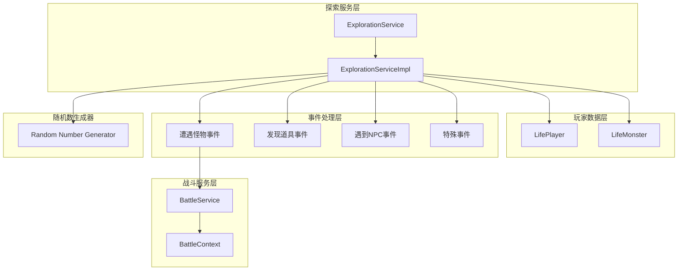
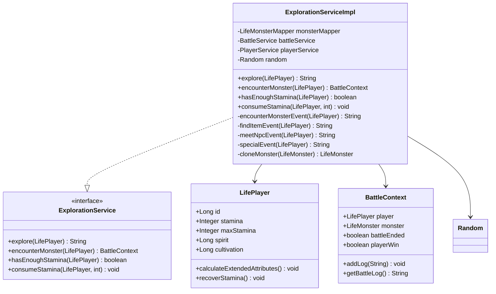
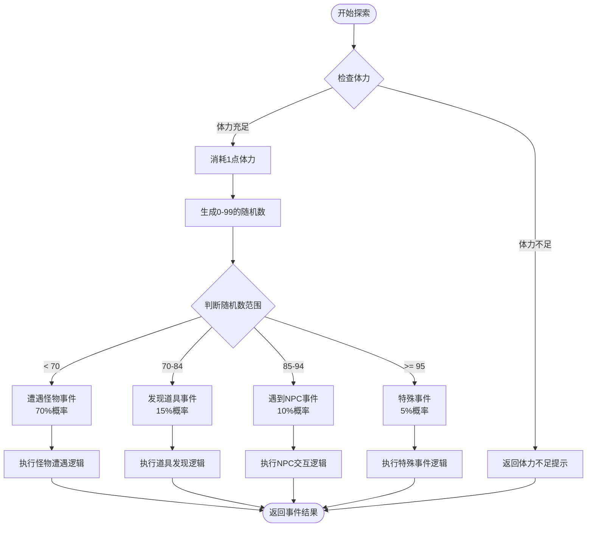
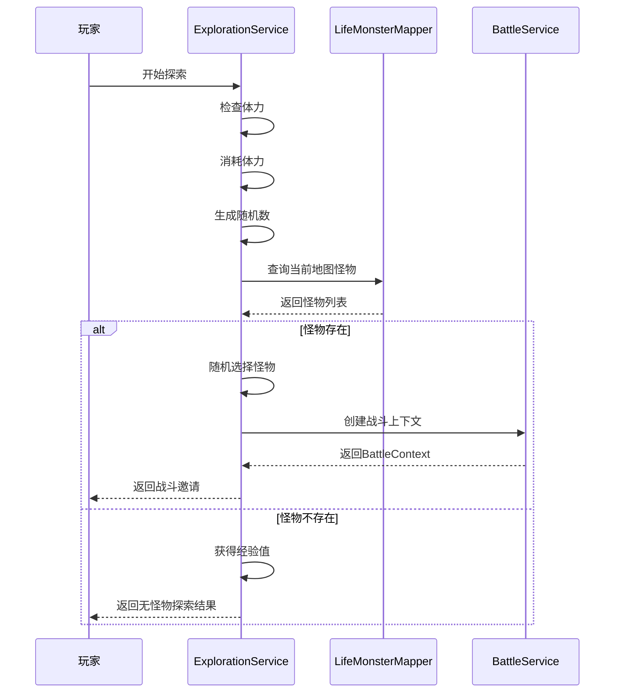
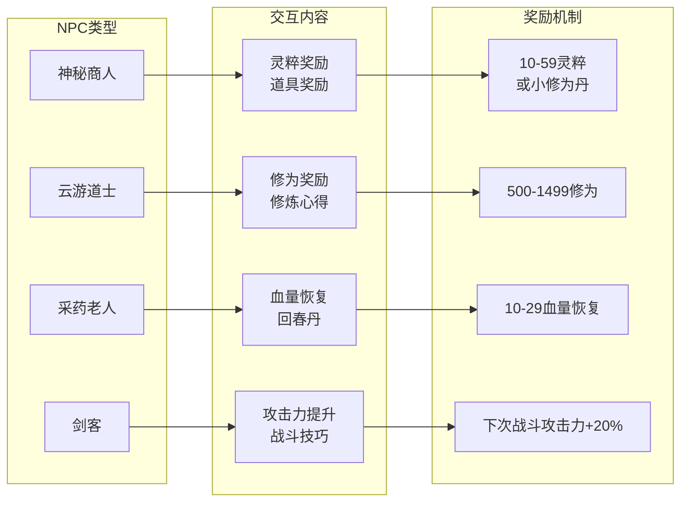
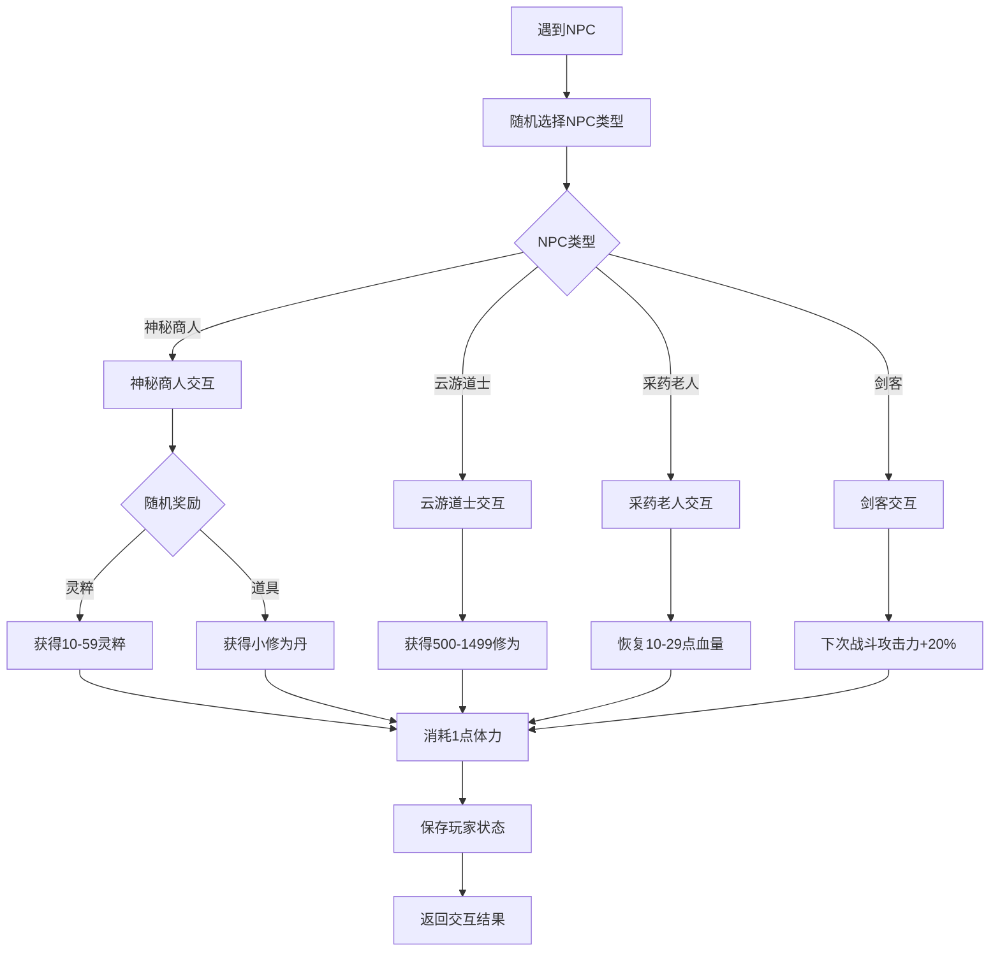
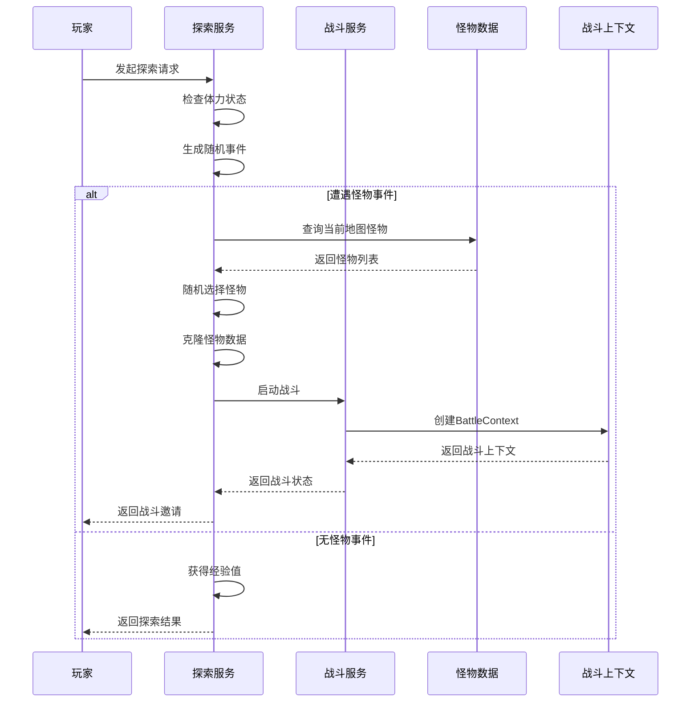
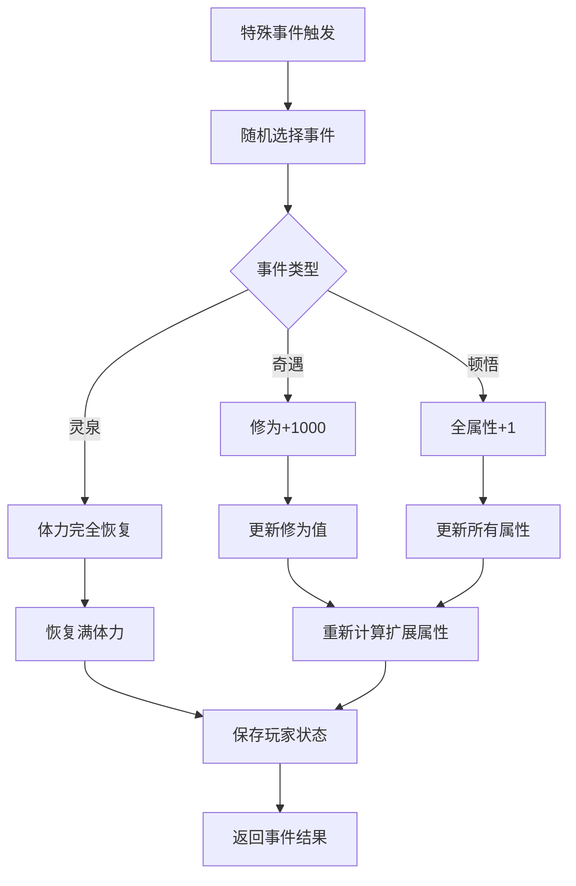

# 遭遇事件

<cite>
**本文档引用的文件**
- [ExplorationServiceImpl.java](file://Life/src/main/java/com/bot/life/service/impl/ExplorationServiceImpl.java)
- [ExplorationService.java](file://Life/src/main/java/com/bot/life/service/ExplorationService.java)
- [LifePlayer.java](file://Life/src/main/java/com/bot/life/dao/entity/LifePlayer.java)
- [BattleContext.java](file://Life/src/main/java/com/bot/life/dto/BattleContext.java)
- [MarketService.java](file://Life/src/main/java/com/bot/life/service/MarketService.java)
- [LifeHandlerImpl.java](file://Life/src/main/java/com/bot/life/service/impl/LifeHandlerImpl.java)
</cite>

## 目录
1. [简介](#简介)
2. [系统架构](#系统架构)
3. [核心组件分析](#核心组件分析)
4. [随机事件概率机制](#随机事件概率机制)
5. [事件类型详解](#事件类型详解)
6. [战斗系统集成](#战斗系统集成)
7. [NPC交互系统](#npc交互系统)
8. [道具发现机制](#道具发现机制)
9. [特殊事件处理](#特殊事件处理)
10. [性能优化考虑](#性能优化考虑)
11. [故障排除指南](#故障排除指南)
12. [总结](#总结)

## 简介

浮生卷探索系统是一个基于随机事件的概率驱动型冒险机制，通过随机数生成器分配不同类型的遭遇事件。该系统主要包含四种事件类型：怪物战斗、道具发现、NPC互动和特殊事件，每种事件都有独特的触发条件和奖励机制。

系统的核心设计理念是为玩家提供不可预测的游戏体验，同时保持合理的概率分布，确保玩家能够频繁体验到各种类型的事件。

## 系统架构

**图表来源**
- [ExplorationServiceImpl.java](file://Life/src/main/java/com/bot/life/service/impl/ExplorationServiceImpl.java#L21-L32)
- [ExplorationService.java](file://Life/src/main/java/com/bot/life/service/ExplorationService.java#L10-L39)

**章节来源**
- [ExplorationServiceImpl.java](file://Life/src/main/java/com/bot/life/service/impl/ExplorationServiceImpl.java#L1-L224)
- [ExplorationService.java](file://Life/src/main/java/com/bot/life/service/ExplorationService.java#L1-L39)

## 核心组件分析

### ExplorationServiceImpl类结构

**图表来源**
- [ExplorationServiceImpl.java](file://Life/src/main/java/com/bot/life/service/impl/ExplorationServiceImpl.java#L21-L32)
- [ExplorationService.java](file://Life/src/main/java/com/bot/life/service/ExplorationService.java#L10-L39)
- [LifePlayer.java](file://Life/src/main/java/com/bot/life/dao/entity/LifePlayer.java#L12-L130)
- [BattleContext.java](file://Life/src/main/java/com/bot/life/dto/BattleContext.java#L14-L55)

**章节来源**
- [ExplorationServiceImpl.java](file://Life/src/main/java/com/bot/life/service/impl/ExplorationServiceImpl.java#L21-L224)

## 随机事件概率机制

### eventRoll随机机制

系统采用基于100的随机数生成器来分配事件概率，这是整个随机事件系统的核心机制：

**图表来源**
- [ExplorationServiceImpl.java](file://Life/src/main/java/com/bot/life/service/impl/ExplorationServiceImpl.java#L44-L59)

### 概率分布表

| 事件类型 | 概率范围 | 百分比 | 事件描述 |
|---------|---------|--------|----------|
| 遭遇怪物 | 0-69 | 70% | 主要事件类型，触发战斗 |
| 发现道具 | 70-84 | 15% | 随机获得游戏道具 |
| 遇到NPC | 85-94 | 10% | 与不同NPC交互 |
| 特殊事件 | 95-99 | 5% | 奇遇、顿悟、灵泉等 |

**章节来源**
- [ExplorationServiceImpl.java](file://Life/src/main/java/com/bot/life/service/impl/ExplorationServiceImpl.java#L44-L59)

## 事件类型详解

### 遭遇怪物事件

遭遇怪物是探索系统中最主要的事件类型，具有最高的触发概率（70%）。

#### 怪物选择机制

**图表来源**
- [ExplorationServiceImpl.java](file://Life/src/main/java/com/bot/life/service/impl/ExplorationServiceImpl.java#L63-L76)
- [ExplorationServiceImpl.java](file://Life/src/main/java/com/bot/life/service/impl/ExplorationServiceImpl.java#L91-L106)

#### 怪物克隆机制

为了避免修改原始怪物数据，系统实现了怪物克隆机制：

**章节来源**
- [ExplorationServiceImpl.java](file://Life/src/main/java/com/bot/life/service/impl/ExplorationServiceImpl.java#L63-L76)
- [ExplorationServiceImpl.java](file://Life/src/main/java/com/bot/life/service/impl/ExplorationServiceImpl.java#L205-L222)

### 发现道具事件

道具发现事件提供给玩家获取游戏内资源的机会，虽然概率较低但仍具有吸引力。

#### 道具池配置

系统维护了一个预定义的道具池，包含以下常见道具：
- 小修为丹
- 回春丹
- 灵石
- 神秘卷轴

这些道具目前处于开发阶段，实际获取功能尚未完全实现。

**章节来源**
- [ExplorationServiceImpl.java](file://Life/src/main/java/com/bot/life/service/impl/ExplorationServiceImpl.java#L108-L114)

### NPC交互系统

NPC事件提供了丰富的剧情交互和奖励机制，包含四种不同类型的NPC：

#### NPC类型及交互

**图表来源**
- [ExplorationServiceImpl.java](file://Life/src/main/java/com/bot/life/service/impl/ExplorationServiceImpl.java#L117-L177)

#### NPC交互流程

**图表来源**
- [ExplorationServiceImpl.java](file://Life/src/main/java/com/bot/life/service/impl/ExplorationServiceImpl.java#L125-L177)

**章节来源**
- [ExplorationServiceImpl.java](file://Life/src/main/java/com/bot/life/service/impl/ExplorationServiceImpl.java#L116-L177)

## 战斗系统集成

### BattleContext集成机制

探索系统与战斗系统的深度集成体现在BattleContext的使用上：

#### 战斗触发流程

**图表来源**
- [ExplorationServiceImpl.java](file://Life/src/main/java/com/bot/life/service/impl/ExplorationServiceImpl.java#L63-L76)
- [ExplorationServiceImpl.java](file://Life/src/main/java/com/bot/life/service/impl/ExplorationServiceImpl.java#L91-L106)

#### 怪物克隆策略

为了保护原始怪物数据不被修改，系统实现了完整的怪物克隆机制：

**章节来源**
- [ExplorationServiceImpl.java](file://Life/src/main/java/com/bot/life/service/impl/ExplorationServiceImpl.java#L63-L76)
- [ExplorationServiceImpl.java](file://Life/src/main/java/com/bot/life/service/impl/ExplorationServiceImpl.java#L205-L222)

## 特殊事件处理

### 特殊事件类型

系统设计了三种特殊事件类型，提供独特的游戏体验：

#### 特殊事件池

| 事件名称 | 奖励内容 | 触发条件 |
|---------|---------|----------|
| 奇遇 | 修为+1000 | 随机触发 |
| 顿悟 | 属性+1（全属性） | 随机触发 |
| 灵泉 | 体力完全恢复 | 随机触发 |

#### 特殊事件处理流程

**图表来源**
- [ExplorationServiceImpl.java](file://Life/src/main/java/com/bot/life/service/impl/ExplorationServiceImpl.java#L180-L204)

**章节来源**
- [ExplorationServiceImpl.java](file://Life/src/main/java/com/bot/life/service/impl/ExplorationServiceImpl.java#L180-L204)

## 性能优化考虑

### 随机数生成优化

系统使用Java标准Random类进行随机数生成，这种实现方式在大多数情况下已经足够高效。对于大规模并发场景，可以考虑以下优化：

1. **线程安全考虑**：当前实现不是线程安全的，多线程环境下需要同步控制
2. **随机数种子管理**：可以考虑使用ThreadLocalRandom替代Random
3. **缓存机制**：对于重复的概率计算可以考虑缓存结果

### 数据访问优化

1. **怪物查询优化**：当前实现每次探索都会查询数据库，可以考虑缓存常用地图的怪物数据
2. **玩家状态检查**：体力恢复逻辑可以考虑批量处理
3. **事件结果缓存**：对于某些重复事件可以考虑缓存结果

### 内存使用优化

1. **对象生命周期管理**：BattleContext等对象应该及时释放
2. **字符串拼接优化**：大量字符串拼接可以考虑StringBuilder链式调用
3. **集合使用优化**：合理使用集合类型，避免不必要的对象创建

## 故障排除指南

### 常见问题及解决方案

#### 1. 体力不足问题

**问题描述**：玩家经常收到"体力不足"的提示

**解决方案**：
- 检查玩家的体力恢复机制是否正常工作
- 确认`lastStaminaTime`字段是否正确更新
- 验证体力恢复算法的时间计算是否准确

#### 2. 随机事件不均衡

**问题描述**：某种事件类型出现频率异常

**排查步骤**：
1. 检查随机数生成器是否正常工作
2. 验证概率分布计算是否正确
3. 确认数据库中相关数据是否完整

#### 3. 战斗上下文异常

**问题描述**：战斗相关功能出现异常

**解决方案**：
- 检查BattleContext对象的初始化是否完整
- 验证怪物数据克隆过程是否正确
- 确认战斗服务的依赖注入是否正常

#### 4. NPC交互异常

**问题描述**：NPC交互功能无法正常使用

**排查要点**：
- 检查NPC名称数组是否完整
- 验证随机奖励逻辑是否正确
- 确认玩家状态更新是否及时保存

**章节来源**
- [ExplorationServiceImpl.java](file://Life/src/main/java/com/bot/life/service/impl/ExplorationServiceImpl.java#L36-L42)
- [ExplorationServiceImpl.java](file://Life/src/main/java/com/bot/life/service/impl/ExplorationServiceImpl.java#L78-L89)

## 总结

浮生卷的遭遇事件系统是一个设计精良的概率驱动型冒险机制，通过合理的概率分布和多样化的事件类型，为玩家提供了丰富而不可预测的游戏体验。

### 系统优势

1. **概率平衡**：70%的怪物事件保证了主要的游戏体验，15%的道具发现提供了资源获取机会，10%的NPC交互增加了剧情趣味性，5%的特殊事件提供了惊喜元素
2. **模块化设计**：清晰的职责分离使得系统易于维护和扩展
3. **深度集成**：与战斗系统、NPC系统、道具系统的良好集成提供了完整的用户体验
4. **可扩展性**：预留的扩展点支持未来添加新的事件类型和交互方式

### 改进建议

1. **概率调整**：根据玩家反馈调整各事件类型的概率分布
2. **事件丰富度**：增加更多类型的NPC和特殊事件
3. **奖励系统**：完善道具获取和使用系统
4. **性能优化**：针对高并发场景进行性能优化
5. **用户体验**：改进事件触发的视觉和文本提示

该系统为浮生卷游戏的核心玩法奠定了坚实的基础，通过持续的优化和改进，将为玩家带来更加精彩的游戏体验。