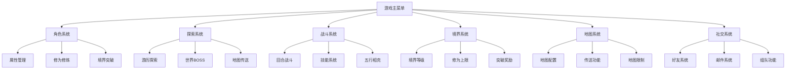
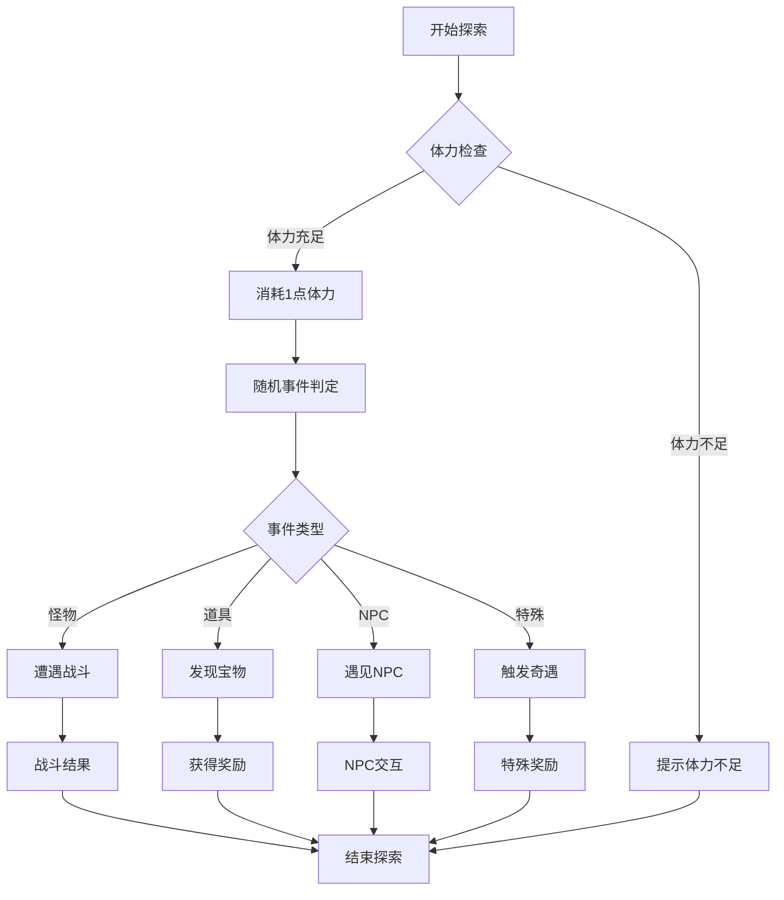
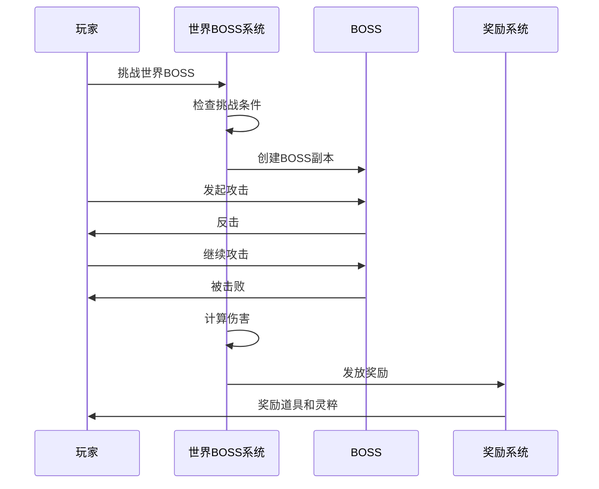
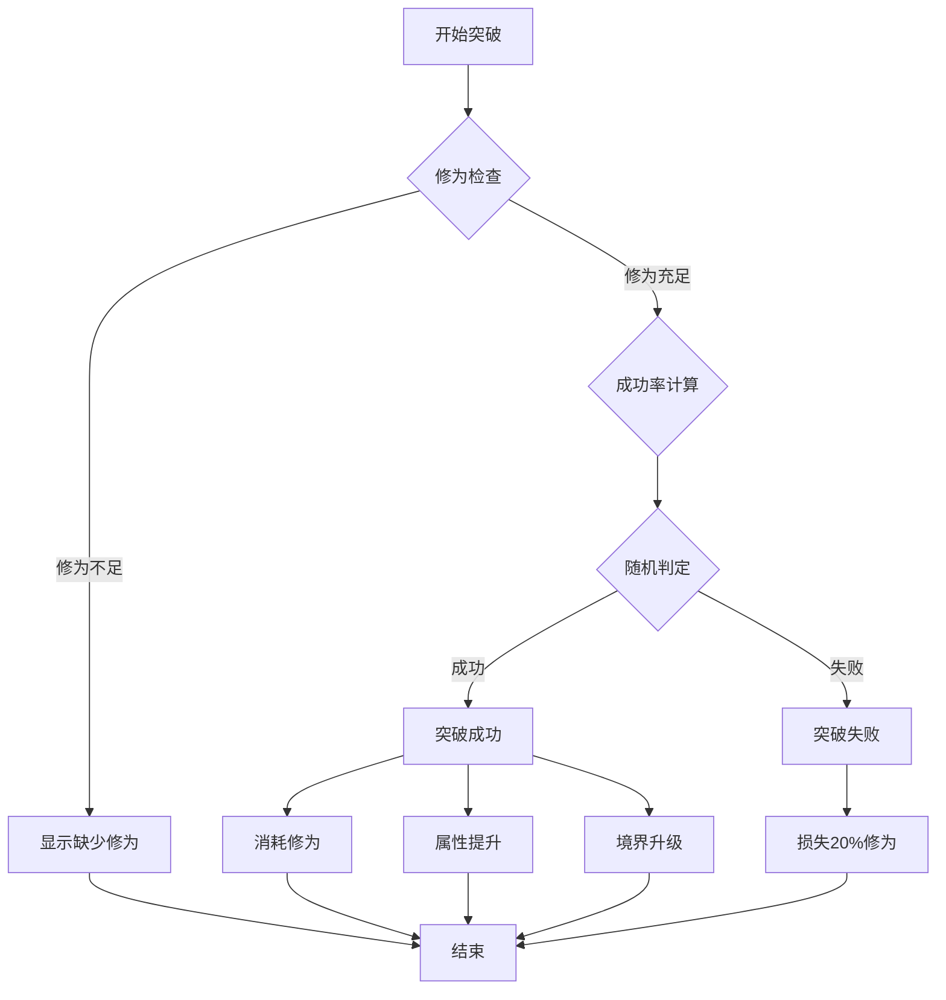
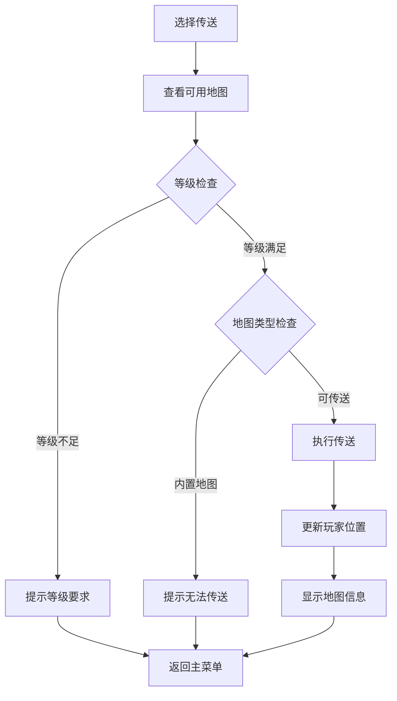
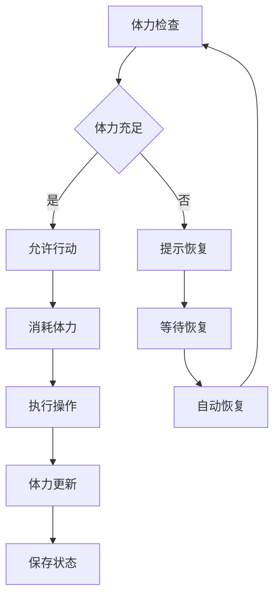
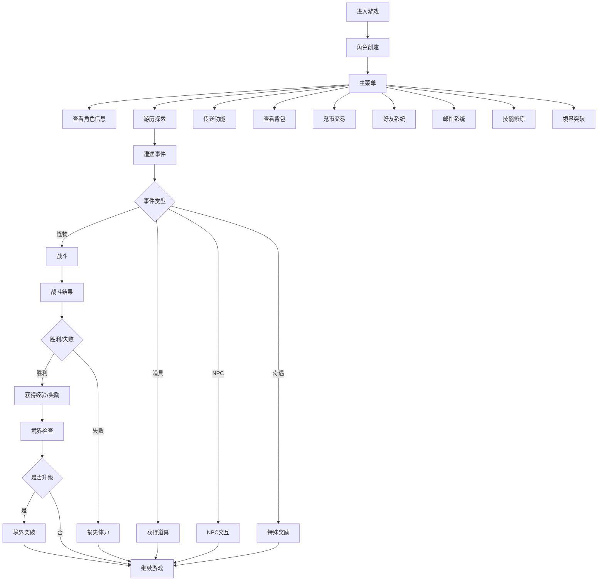

# 游戏玩法

<cite>
**本文档引用的文件**
- [LifeHandlerImpl.java](file://Life/src/main/java/com/bot/life/service/impl/LifeHandlerImpl.java)
- [Life_User_Manual.md](file://Life_User_Manual.md)
- [ExplorationServiceImpl.java](file://Life/src/main/java/com/bot/life/service/impl/ExplorationServiceImpl.java)
- [WorldBossServiceImpl.java](file://Life/src/main/java/com/bot/life/service/impl/WorldBossServiceImpl.java)
- [RealmServiceImpl.java](file://Life/src/main/java/com/bot/life/service/impl/RealmServiceImpl.java)
- [MapServiceImpl.java](file://Life/src/main/java/com/bot/life/service/impl/MapServiceImpl.java)
- [浮生卷开发说明.md](file://浮生卷开发说明.md)
- [Life_Realm_Breakthrough_System.md](file://Life_Realm_Breakthrough_System.md)
</cite>

## 目录
1. [游戏简介](#游戏简介)
2. [核心系统概览](#核心系统概览)
3. [角色创建与基础属性](#角色创建与基础属性)
4. [游历探索系统](#游历探索系统)
5. [战斗系统](#战斗系统)
6. [世界BOSS挑战](#世界BOSS挑战)
7. [境界突破系统](#境界突破系统)
8. [地图与传送系统](#地图与传送系统)
9. [属性系统详解](#属性系统详解)
10. [体力与修为系统](#体力与修为系统)
11. [高级玩法机制](#高级玩法机制)
12. [游戏流程总结](#游戏流程总结)

## 游戏简介

浮生卷是一款修仙主题的文字RPG游戏，集成在聊天机器人中。玩家通过文字指令进行游戏，所有游戏界面以图片形式展示。游戏采用回合制战斗模式，融合了修仙元素、策略战斗和养成系统，为玩家提供沉浸式的修仙体验。

### 游戏特色
- **修仙养成**：从练气期到大乘期的完整修仙成长线
- **策略战斗**：五行相克、技能搭配的深度战斗系统
- **丰富探索**：多样化的地图探索和随机事件
- **社交互动**：好友系统、邮件系统等社交功能
- **持续更新**：可扩展的系统架构支持新内容添加

## 核心系统概览

浮生卷游戏包含以下核心系统：

**图表来源**
- [LifeHandlerImpl.java](file://Life/src/main/java/com/bot/life/service/impl/LifeHandlerImpl.java#L435-L470)

## 角色创建与基础属性

### 角色创建流程

玩家首次进入游戏时需要创建角色，格式为：`昵称-派系`。例如：`张三-金`

### 派系特性对比

| 派系 | 特色 | 攻击力 | 防御力 | 养成难度 |
|------|------|--------|--------|----------|
| 金 | 强大破坏力，一力破万法 | ★★★★★ | ★★ | ★★★★ |
| 木 | 强大恢复能力，治疗用毒 | ★★★ | ★★★★ | ★★★ |
| 水 | 包容万物，各领域涉及 | ★★★★ | ★★★★ | ★★★★ |
| 火 | 持续伤害，可观爆发力 | ★★★★ | ★★★ | ★★★ |
| 土 | 超强防御，不俗控制力 | ★★★ | ★★★★★ | ★★★★★ |

### 基础属性体系

游戏包含四大基础属性和六大战斗属性：

#### 基础属性
- **速度**：决定出手顺序，影响破防
- **体质**：影响血量和防御
- **灵力**：影响会心率和会心效果
- **力量**：影响攻击力和破防

#### 战斗属性
- **血量/最大血量**：生命值
- **攻击力**：普通攻击伤害
- **防御**：减少受到的伤害
- **会心率**：暴击概率
- **会心效果**：暴击伤害倍数
- **破防**：无视对方防御的比例

**节来源**
- [Life_User_Manual.md](file://Life_User_Manual.md#L32-L64)
- [浮生卷开发说明.md](file://浮生卷开发说明.md#L26-L65)

## 游历探索系统

### 探索机制

游历探索是游戏的核心玩法之一，玩家可以在地图上进行探索，触发各种随机事件。

#### 探索事件概率分布
- **70% 怪物遭遇**：最常见的探索事件
- **15% 发现道具**：获得各种有用的物品
- **10% 遇见NPC**：触发特殊对话和事件
- **5% 特殊事件**：奇遇、顿悟、灵泉等

### 探索流程

**图表来源**
- [ExplorationServiceImpl.java](file://Life/src/main/java/com/bot/life/service/impl/ExplorationServiceImpl.java#L34-L60)

### 遇见NPC类型

游戏中的NPC提供多种功能：
- **神秘商人**：出售珍贵道具，可能赠送灵粹
- **云游道士**：传授修炼心得，增加修为
- **采药老人**：恢复血量，提供治疗
- **剑客**：传授战斗技巧，提升攻击力

**节来源**
- [ExplorationServiceImpl.java](file://Life/src/main/java/com/bot/life/service/impl/ExplorationServiceImpl.java#L91-L203)

## 战斗系统

### 战斗行动选择

每回合玩家可选择以下行动：
1. **普通攻击** - 基础攻击
2. **使用技能** - 消耗神通
3. **防御** - 减少50%受到伤害
4. **使用道具** - 使用恢复类道具
5. **逃跑** - 尝试逃离战斗

### 伤害计算公式

普通攻击伤害 = 攻击力 × 倍率 - 防御 × (1 - 破防率)

#### 伤害计算细节
- **会心时**：伤害 × 会心效果
- **破防率**：最高30%
- **最小伤害**：至少造成1点伤害

### 逃跑机制

- **速度≥对方**：必定成功
- **速度<对方**：基础成功率50%，每低10点速度-2%成功率

### 五行相克系统

属性之间存在克制关系：金克木，木克土，土克水，水克火，火克金

#### 克制效果
- **克制对方**：最终伤害+20%
- **被克制**：自身防御-10%

**节来源**
- [Life_User_Manual.md](file://Life_User_Manual.md#L98-L120)
- [Life_Compile_Error_Fix.md](file://Life_Compile_Error_Fix.md#L36-L117)

## 世界BOSS挑战

### 世界BOSS系统概述

世界BOSS是多人同时挑战的大型BOSS，具有以下特点：
- **定时刷新**：每天11:00-12:00和19:00-20:00出现
- **多人挑战**：所有玩家都可以挑战
- **即时结算**：根据造成的伤害即时发放奖励
- **分段奖励**：不同伤害区间有不同的奖励

### 挑战流程

**图表来源**
- [WorldBossServiceImpl.java](file://Life/src/main/java/com/bot/life/service/impl/WorldBossServiceImpl.java#L76-L118)

### 奖励机制

世界BOSS根据玩家造成的伤害发放奖励：
- **0-10000伤害**：100灵粹和1颗大还丹
- **10001-20000伤害**：200灵粹和2颗大还丹和1颗小修为丹
- **更高伤害**：对应更丰厚的奖励

**节来源**
- [WorldBossServiceImpl.java](file://Life/src/main/java/com/bot/life/service/impl/WorldBossServiceImpl.java#L1-L202)
- [浮生卷开发说明.md](file://浮生卷开发说明.md#L125-L135)

## 境界突破系统

### 境界等级体系

浮生卷支持完整的修仙境界体系：

| 境界名称 | 等级范围 | 描述 |
|---------|----------|------|
| **练气期** | 1-9级 | 修仙入门境界，刚踏入修仙之路 |
| **筑基期** | 10-19级 | 巩固根基，为后续修炼做准备 |
| **金丹期** | 20-29级 | 结成金丹，实力大幅提升 |
| **元婴期** | 30-39级 | 凝聚元婴，已是高阶修士 |
| **化神期** | 40-49级 | 神识化形，接近仙人境界 |
| **大乘期** | 50级以上 | 最高境界，已臻化境 |

### 突破机制

#### 突破条件检查

**图表来源**
- [RealmServiceImpl.java](file://Life/src/main/java/com/bot/life/service/impl/RealmServiceImpl.java#L41-L119)

#### 突破奖励配置
每个境界突破都有对应的属性奖励：
- **练气期**：无奖励
- **筑基期**：全属性+5
- **金丹期**：全属性+10，灵力+15，修炼速度+20
- **元婴期**：全属性+20，修炼速度+50
- **化神期**：全属性+30，修炼速度+100
- **大乘期**：全属性+50，修炼速度+200

**节来源**
- [RealmServiceImpl.java](file://Life/src/main/java/com/bot/life/service/impl/RealmServiceImpl.java#L1-L306)
- [Life_Realm_Breakthrough_System.md](file://Life_Realm_Breakthrough_System.md#L1-L203)

## 地图与传送系统

### 地图类型

游戏包含两种地图类型：
- **可传送地图**：玩家可以直接传送到达
- **内置地图**：需要特殊方式进入（如副本）

### 地图传送机制

**图表来源**
- [MapServiceImpl.java](file://Life/src/main/java/com/bot/life/service/impl/MapServiceImpl.java#L37-L60)

### 地图限制系统

每个地图都有境界要求，例如：
- **青云山**：需要筑基期才能进入
- **幽冥谷**：需要金丹期才能进入
- **天外仙境**：需要元婴期才能进入

**节来源**
- [MapServiceImpl.java](file://Life/src/main/java/com/bot/life/service/impl/MapServiceImpl.java#L1-L83)
- [Life_User_Manual.md](file://Life_User_Manual.md#L161-L171)

## 属性系统详解

### 属性计算公式

游戏中的属性计算遵循以下公式：

#### 速度属性
- 每1点速度：破防+0.005%

#### 体质属性
- 每1点体质：血量+10，防御+1

#### 灵力属性
- 每1点灵力：会心+0.01%，会心效果+0.005%

#### 力量属性
- 每1点力量：攻击力+6，破防+0.01%

### 属性克制机制

五行相克关系决定了战斗中的伤害加成：
- **金克木**：金属性攻击对木属性敌人伤害+20%
- **木克土**：木属性攻击对土属性敌人伤害+20%
- **土克水**：土属性攻击对水属性敌人伤害+20%
- **水克火**：水属性攻击对火属性敌人伤害+20%
- **火克金**：火属性攻击对金属性敌人伤害+20%

**节来源**
- [Life_User_Manual.md](file://Life_User_Manual.md#L60-L72)
- [浮生卷开发说明.md](file://浮生卷开发说明.md#L31-L46)

## 体力与修为系统

### 体力系统

#### 体力特性
- **上限**：100点
- **消耗**：参与战斗消耗1点体力
- **恢复**：每5分钟自动恢复1点体力

#### 体力管理

### 修为系统

#### 修为获取
- **离线修炼**：即使离线也会增加修为
- **默认速度**：10修为/分钟
- **功法加成**：功法可以提升修炼速度

#### 修为上限
每个境界都有修为上限，当修为达到上限时：
- 不再获得新的修为
- 可以通过境界突破来提升上限

**节来源**
- [Life_User_Manual.md](file://Life_User_Manual.md#L73-L84)
- [RealmServiceImpl.java](file://Life/src/main/java/com/bot/life/service/impl/RealmServiceImpl.java#L162-L170)

## 高级玩法机制

### 组队系统

游戏支持简单的组队功能：
- **队伍人数**：最多2人
- **组队方式**：队长创建队伍，其他玩家申请加入
- **副本支持**：仅副本支持组队
- **行动托管**：战斗中队员行动由程序托管

### 成就系统

游戏包含成就系统，达成特定条件可触发成就：
- **属性成就**：达到特定属性值
- **境界成就**：突破到特定境界
- **战斗成就**：完成特定战斗目标
- **探索成就**：探索特定地图或事件

### 道具系统

游戏包含多种类型的道具：
1. **修为类**：直接增加修为
2. **属性类**：永久增加属性（有使用次数限制）
3. **体力类**：恢复体力
4. **升级法宝类**：增加法宝熟练度
5. **恢复类**：战斗中使用恢复血量

**节来源**
- [Life_User_Manual.md](file://Life_User_Manual.md#L179-L200)
- [浮生卷开发说明.md](file://浮生卷开发说明.md#L131-L135)

## 游戏流程总结

### 完整游戏流程

### 游戏核心循环

1. **探索阶段**：通过游历探索触发各种事件
2. **战斗阶段**：遭遇怪物进行战斗
3. **修炼阶段**：通过战斗和探索获得修为
4. **突破阶段**：修为积累到一定程度进行境界突破
5. **成长阶段**：境界提升带来属性增强和新能力

这种循环设计确保了游戏的持续性和可玩性，让玩家能够体验完整的修仙成长过程。

**节来源**
- [LifeHandlerImpl.java](file://Life/src/main/java/com/bot/life/service/impl/LifeHandlerImpl.java#L147-L472)

## 结语

浮生卷作为一款修仙主题的文字RPG游戏，成功地将传统的修仙元素与现代的游戏机制相结合。通过完善的属性系统、策略性的战斗机制、丰富的探索内容和深度的养成系统，为玩家提供了沉浸式的修仙体验。

游戏的核心优势在于：
- **完整的修仙体系**：从练气到大乘的完整成长线
- **策略性战斗**：五行相克和技能搭配的深度战斗
- **多样化玩法**：探索、战斗、修炼、突破等多种玩法
- **社交互动**：好友系统和邮件系统增强社交体验

随着游戏的不断完善和新内容的添加，相信浮生卷能够为更多玩家带来精彩的修仙冒险体验。