# 世界BOSS功能文档

<cite>
**本文档引用的文件**
- [LifeHandlerImpl.java](file://Life/src/main/java/com/bot/life/service/impl/LifeHandlerImpl.java)
- [WorldBossService.java](file://Life/src/main/java/com/bot/life/service/WorldBossService.java)
- [WorldBossServiceImpl.java](file://Life/src/main/java/com/bot/life/service/impl/WorldBossServiceImpl.java)
- [LifeWorldBoss.java](file://Life/src/main/java/com/bot/life/dao/entity/LifeWorldBoss.java)
- [LifeWorldBossReward.java](file://Life/src/main/java/com/bot/life/dao/entity/LifeWorldBossReward.java)
- [LifeWorldBossChallenge.java](file://Life/src/main/java/com/bot/life/dao/entity/LifeWorldBossChallenge.java)
- [LifeWorldBossMapper.java](file://Life/src/main/resources/mapper/LifeWorldBossMapper.xml)
- [LifeWorldBossRewardMapper.java](file://Life/src/main/resources/mapper/LifeWorldBossRewardMapper.xml)
- [LifeWorldBossChallengeMapper.java](file://Life/src/main/resources/mapper/LifeWorldBossChallengeMapper.xml)
- [Life_User_Manual.md](file://Life_User_Manual.md)
- [浮生卷开发说明.md](file://浮生卷开发说明.md)
</cite>

## 目录
1. [功能概述](#功能概述)
2. [系统架构](#系统架构)
3. [核心组件分析](#核心组件分析)
4. [世界BOSS挑战机制](#世界boss挑战机制)
5. [伤害分段奖励系统](#伤害分段奖励系统)
6. [挑战限制与规则](#挑战限制与规则)
7. [玩家参与流程](#玩家参与流程)
8. [数据库设计](#数据库设计)
9. [技术实现细节](#技术实现细节)
10. [故障排除指南](#故障排除指南)

## 功能概述

世界BOSS是《浮生卷》游戏中的重要玩法机制，为玩家提供全服参与的挑战机会。该系统支持指定时间段内所有玩家在同一地点挑战BOSS，根据玩家造成的伤害即时结算奖励，具有独特的伤害分段奖励和挑战限制机制。

### 主要特性

- **全服参与**：指定时间段内所有玩家可在指定地图挑战世界BOSS
- **时间限制**：每日固定时间段（11:00-12:00 和 19:00-20:00）开放挑战
- **伤害分段奖励**：根据玩家造成的伤害量获得不同档次的奖励
- **挑战次数限制**：每位玩家每日可挑战次数有限制
- **属性克制系统**：玩家属性与BOSS属性相克时获得额外伤害加成

## 系统架构

**架构图来源**
- [LifeHandlerImpl.java](file://Life/src/main/java/com/bot/life/service/impl/LifeHandlerImpl.java#L60-L110)
- [WorldBossServiceImpl.java](file://Life/src/main/java/com/bot/life/service/impl/WorldBossServiceImpl.java#L24-L42)

## 核心组件分析

### WorldBossService 接口

世界BOSS服务的核心接口，定义了世界BOSS功能的主要方法：

**类图来源**
- [WorldBossService.java](file://Life/src/main/java/com/bot/life/service/WorldBossService.java#L12-L55)
- [WorldBossServiceImpl.java](file://Life/src/main/java/com/bot/life/service/impl/WorldBossServiceImpl.java#L24-L42)

### 数据模型设计

```mermaid
erDiagram
LIFE_WORLD_BOSS {
bigint id PK
bigint monster_id FK
bigint map_id FK
time start_time
time end_time
int max_challenge_count
int is_active
}
LIFE_WORLD_BOSS_REWARD {
bigint id PK
bigint world_boss_id FK
bigint min_damage
bigint max_damage
int spirit_reward
longvarchar item_rewards
}
LIFE_WORLD_BOSS_CHALLENGE {
bigint id PK
bigint player_id FK
bigint world_boss_id FK
bigint damage_dealt
int spirit_reward
longvarchar item_rewards
timestamp challenge_time
}
LIFE_MONSTER {
bigint id PK
varchar name
bigint map_id FK
int monster_type
int attribute
int level
int health
int attack_power
int defense
int speed
decimal critical_rate
decimal critical_damage
int armor_break
}
LIFE_MAP {
bigint id PK
varchar name
int min_level
}
LIFE_PLAYER {
bigint id PK
varchar user_id
varchar nickname
int attribute
int level
int health
int max_health
int attack_power
decimal critical_rate
decimal critical_damage
}
LIFE_WORLD_BOSS ||--|| LIFE_MONSTER : "references"
LIFE_WORLD_BOSS ||--|| LIFE_MAP : "located_in"
LIFE_WORLD_BOSS ||--o{ LIFE_WORLD_BOSS_REWARD : "has_rewards"
LIFE_WORLD_BOSS ||--o{ LIFE_WORLD_BOSS_CHALLENGE : "records_challenges"
LIFE_PLAYER ||--o{ LIFE_WORLD_BOSS_CHALLENGE : "participates"
```

**实体关系图来源**
- [LifeWorldBoss.java](file://Life/src/main/java/com/bot/life/dao/entity/LifeWorldBoss.java#L11-L24)
- [LifeWorldBossReward.java](file://Life/src/main/java/com/bot/life/dao/entity/LifeWorldBossReward.java#L9-L17)
- [LifeWorldBossChallenge.java](file://Life/src/main/java/com/bot/life/dao/entity/LifeWorldBossChallenge.java#L11-L18)

**节来源**
- [LifeWorldBoss.java](file://Life/src/main/java/com/bot/life/dao/entity/LifeWorldBoss.java#L1-L25)
- [LifeWorldBossReward.java](file://Life/src/main/java/com/bot/life/dao/entity/LifeWorldBossReward.java#L1-L18)
- [LifeWorldBossChallenge.java](file://Life/src/main/java/com/bot/life/dao/entity/LifeWorldBossChallenge.java#L1-L25)

## 世界BOSS挑战机制

### 出现时间规则

世界BOSS采用固定时间段激活机制：

**流程图来源**
- [WorldBossServiceImpl.java](file://Life/src/main/java/com/bot/life/service/impl/WorldBossServiceImpl.java#L181-L192)

世界BOSS活动时间为：
- **上午时段**：11:00 - 12:00
- **下午时段**：19:00 - 20:00

### 全服玩家参与机制

1. **BOSS刷新**：系统在活动时间自动刷新世界BOSS
2. **地图定位**：BOSS出现在配置的地图上
3. **挑战指令**：玩家发送"挑战世界BOSS"参与战斗
4. **战斗模式**：系统自动进行战斗模拟

### 战斗系统

世界BOSS战斗采用简化版自动战斗模式：

**序列图来源**
- [WorldBossServiceImpl.java](file://Life/src/main/java/com/bot/life/service/impl/WorldBossServiceImpl.java#L77-L107)
- [LifeHandlerImpl.java](file://Life/src/main/java/com/bot/life/service/impl/LifeHandlerImpl.java#L648-L660)

**节来源**
- [WorldBossServiceImpl.java](file://Life/src/main/java/com/bot/life/service/impl/WorldBossServiceImpl.java#L181-L202)
- [LifeHandlerImpl.java](file://Life/src/main/java/com/bot/life/service/impl/LifeHandlerImpl.java#L648-L660)

## 伤害分段奖励系统

### 奖励配置机制

世界BOSS的奖励系统采用分段配置方式：

| 段位 | 最小伤害 | 最大伤害 | 奖励内容 |
|------|----------|----------|----------|
| 第一段 | 0 | 10000 | 100灵粹 + 1颗大还丹 |
| 第二段 | 10001 | 20000 | 200灵粹 + 2颗大还丹 + 1颗小修为丹 |
| 第三段 | 20001 | 30000 | 300灵粹 + 3颗大还丹 + 2颗小修为丹 |

### 奖励计算逻辑

**流程图来源**
- [WorldBossServiceImpl.java](file://Life/src/main/java/com/bot/life/service/impl/WorldBossServiceImpl.java#L241-L249)

### 奖励类型

1. **灵粹奖励**：基础货币奖励
2. **道具奖励**：JSON格式的道具列表
3. **组合奖励**：灵粹与道具的混合奖励

**节来源**
- [WorldBossServiceImpl.java](file://Life/src/main/java/com/bot/life/service/impl/WorldBossServiceImpl.java#L241-L267)
- [LifeWorldBossReward.java](file://Life/src/main/java/com/bot/life/dao/entity/LifeWorldBossReward.java#L1-L18)

## 挑战限制与规则

### 时间限制

世界BOSS挑战严格遵循时间限制规则：

- **活动时间**：每日11:00-12:00 和 19:00-20:00
- **地图限制**：必须在BOSS所在地图才能挑战
- **冷却时间**：挑战后立即生效，当日有效

### 挑战次数限制

**流程图来源**
- [WorldBossServiceImpl.java](file://Life/src/main/java/com/bot/life/service/impl/WorldBossServiceImpl.java#L54-L74)

### 属性克制系统

世界BOSS战斗支持属性克制加成：

| 玩家属性 | 克制属性 | 加成倍率 |
|----------|----------|----------|
| 金 | 木 | 1.2倍 |
| 木 | 土 | 1.2倍 |
| 土 | 水 | 1.2倍 |
| 水 | 火 | 1.2倍 |
| 火 | 金 | 1.2倍 |

**节来源**
- [WorldBossServiceImpl.java](file://Life/src/main/java/com/bot/life/service/impl/WorldBossServiceImpl.java#L54-L74)
- [WorldBossServiceImpl.java](file://Life/src/main/java/com/bot/life/service/impl/WorldBossServiceImpl.java#L227-L239)

## 玩家参与流程

### 参与步骤

1. **查看BOSS信息**
   - 玩家进入BOSS所在地图
   - 系统自动显示BOSS信息
   - 包含BOSS名称、当前血量、可挑战次数

2. **发起挑战**
   - 发送"挑战世界BOSS"指令
   - 系统验证挑战条件
   - 进入战斗模拟阶段

3. **战斗过程**
   - 系统模拟10回合攻击
   - 基于玩家属性和随机因素计算伤害
   - 应用属性克制加成

4. **结果结算**
   - 根据伤害值计算奖励
   - 记录挑战数据
   - 返回挑战结果

### 指令流程

**序列图来源**
- [LifeHandlerImpl.java](file://Life/src/main/java/com/bot/life/service/impl/LifeHandlerImpl.java#L648-L660)
- [WorldBossServiceImpl.java](file://Life/src/main/java/com/bot/life/service/impl/WorldBossServiceImpl.java#L77-L107)

### 挑战结果展示

挑战完成后，系统返回以下信息：
- BOSS名称和造成的伤害
- 获得的灵粹奖励
- 获得的道具奖励
- 今日挑战记录统计

**节来源**
- [LifeHandlerImpl.java](file://Life/src/main/java/com/bot/life/service/impl/LifeHandlerImpl.java#L648-L660)
- [WorldBossServiceImpl.java](file://Life/src/main/java/com/bot/life/service/impl/WorldBossServiceImpl.java#L77-L107)

## 数据库设计

### 核心表结构

#### life_world_boss 表
| 字段名 | 类型 | 描述 |
|--------|------|------|
| id | BIGINT | 主键ID |
| monster_id | BIGINT | 怪物ID（关联life_monster） |
| map_id | BIGINT | 地图ID（关联life_map） |
| start_time | TIME | 开始时间 |
| end_time | TIME | 结束时间 |
| max_challenge_count | INTEGER | 最大挑战次数 |
| is_active | INTEGER | 是否激活（1:激活，0:未激活） |

#### life_world_boss_reward 表
| 字段名 | 类型 | 描述 |
|--------|------|------|
| id | BIGINT | 主键ID |
| world_boss_id | BIGINT | 世界BOSS ID |
| min_damage | BIGINT | 最小伤害阈值 |
| max_damage | BIGINT | 最大伤害阈值 |
| spirit_reward | INTEGER | 灵粹奖励数量 |
| item_rewards | LONGVARCHAR | 道具奖励（JSON格式） |

#### life_world_boss_challenge 表
| 字段名 | 类型 | 描述 |
|--------|------|------|
| id | BIGINT | 主键ID |
| player_id | BIGINT | 玩家ID |
| world_boss_id | BIGINT | 世界BOSS ID |
| damage_dealt | BIGINT | 造成的伤害 |
| spirit_reward | INTEGER | 获得的灵粹奖励 |
| item_rewards | LONGVARCHAR | 获得的道具奖励 |
| challenge_time | TIMESTAMP | 挑战时间 |

### 数据库关系图

**实体关系图来源**
- [LifeWorldBossMapper.java](file://Life/src/main/resources/mapper/LifeWorldBossMapper.xml#L5-L13)
- [LifeWorldBossRewardMapper.java](file://Life/src/main/resources/mapper/LifeWorldBossRewardMapper.xml#L5-L12)
- [LifeWorldBossChallengeMapper.java](file://Life/src/main/resources/mapper/LifeWorldBossChallengeMapper.xml#L5-L13)

**节来源**
- [LifeWorldBossMapper.java](file://Life/src/main/resources/mapper/LifeWorldBossMapper.xml#L1-L66)
- [LifeWorldBossRewardMapper.java](file://Life/src/main/resources/mapper/LifeWorldBossRewardMapper.xml#L1-L56)
- [LifeWorldBossChallengeMapper.java](file://Life/src/main/resources/mapper/LifeWorldBossChallengeMapper.xml#L1-L57)

## 技术实现细节

### 战斗模拟算法

世界BOSS战斗采用简化版模拟算法：

**流程图来源**
- [WorldBossServiceImpl.java](file://Life/src/main/java/com/bot/life/service/impl/WorldBossServiceImpl.java#L194-L224)

### 随机因素计算

战斗中的随机因素包括：
1. **会心攻击**：基于玩家会心率判断
2. **伤害波动**：±20%的随机波动
3. **属性克制**：1.2倍或0.8倍的属性加成

### 挑战记录管理

挑战记录采用实时写入策略：
- 每次挑战完成后立即记录
- 使用事务保证数据一致性
- 支持今日挑战次数查询

**节来源**
- [WorldBossServiceImpl.java](file://Life/src/main/java/com/bot/life/service/impl/WorldBossServiceImpl.java#L194-L224)
- [WorldBossServiceImpl.java](file://Life/src/main/java/com/bot/life/service/impl/WorldBossServiceImpl.java#L253-L267)

## 故障排除指南

### 常见问题及解决方案

#### 1. 无法挑战世界BOSS

**问题现象**：发送"挑战世界BOSS"后返回"无法挑战该世界BOSS"

**可能原因**：
- 不在活动时间范围内
- 玩家不在BOSS所在地图
- 已达到今日挑战次数限制

**解决方法**：
- 检查当前时间是否在11:00-12:00或19:00-20:00
- 确认玩家当前位置与BOSS地图ID一致
- 查询今日挑战次数：调用`getTodayWorldBossChallenges`方法

#### 2. BOSS数据异常

**问题现象**：返回"世界BOSS数据异常"

**可能原因**：
- BOSS配置缺失
- 怪物数据损坏
- 数据库连接问题

**解决方法**：
- 检查`life_world_boss`表配置
- 验证关联的`life_monster`数据完整性
- 确认数据库连接状态

#### 3. 奖励计算错误

**问题现象**：挑战后未获得预期奖励

**可能原因**：
- 奖励配置缺失
- 伤害值超出奖励范围
- 数据库插入失败

**解决方法**：
- 检查`life_world_boss_reward`表配置
- 验证伤害值是否在有效范围内
- 查看挑战记录是否成功插入

### 性能优化建议

1. **缓存机制**：缓存活跃的BOSS信息减少数据库查询
2. **异步处理**：将奖励发放改为异步处理
3. **索引优化**：为挑战记录表添加合适的索引
4. **连接池**：优化数据库连接池配置

### 监控指标

建议监控以下关键指标：
- BOSS刷新成功率
- 挑战请求响应时间
- 奖励发放成功率
- 挑战次数使用率

**节来源**
- [WorldBossServiceImpl.java](file://Life/src/main/java/com/bot/life/service/impl/WorldBossServiceImpl.java#L54-L74)
- [WorldBossServiceImpl.java](file://Life/src/main/java/com/bot/life/service/impl/WorldBossServiceImpl.java#L253-L267)

## 总结

世界BOSS功能是《浮生卷》游戏中的重要社交玩法，通过全服参与的挑战机制，为玩家提供了丰富的游戏体验。系统采用模块化设计，具有良好的扩展性和维护性。通过合理的时间限制、挑战次数控制和奖励机制，确保了游戏的平衡性和趣味性。

该系统的核心优势在于：
- **简单易用**：玩家只需发送指令即可参与
- **公平竞争**：基于伤害值的奖励分配机制
- **丰富奖励**：多层次的奖励系统激励玩家参与
- **稳定可靠**：完善的错误处理和数据验证机制

未来可以考虑的改进方向包括：
- 增加BOSS种类和难度层次
- 引入团队协作挑战模式
- 添加BOSS特殊技能和事件
- 优化战斗动画和视觉效果