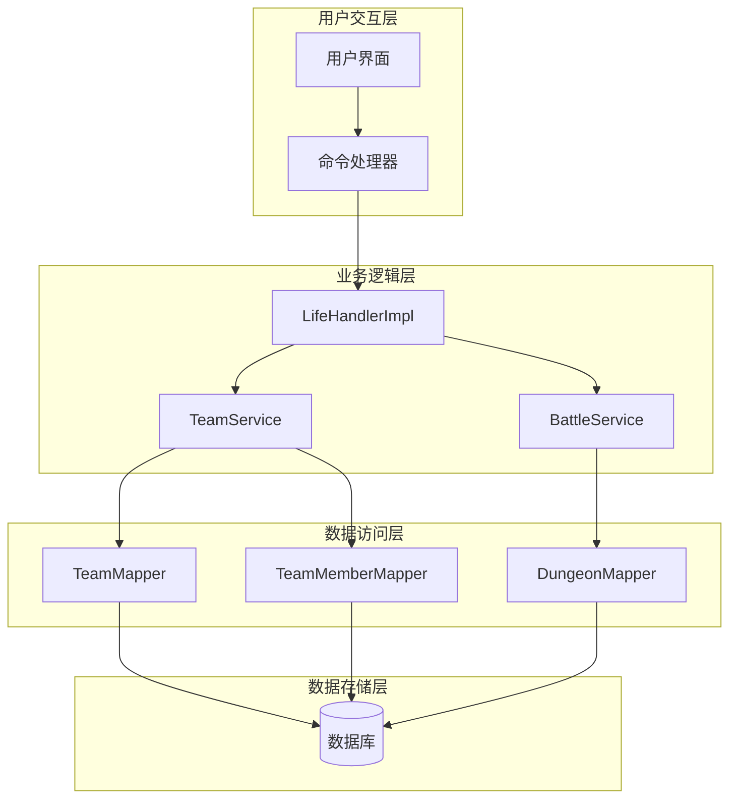
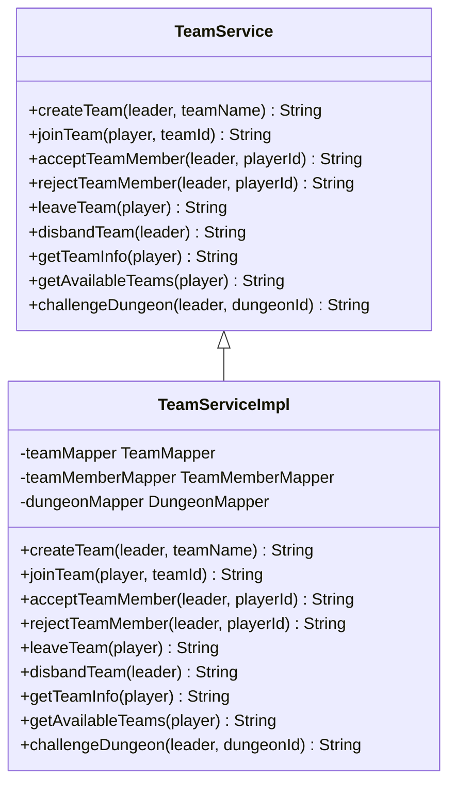
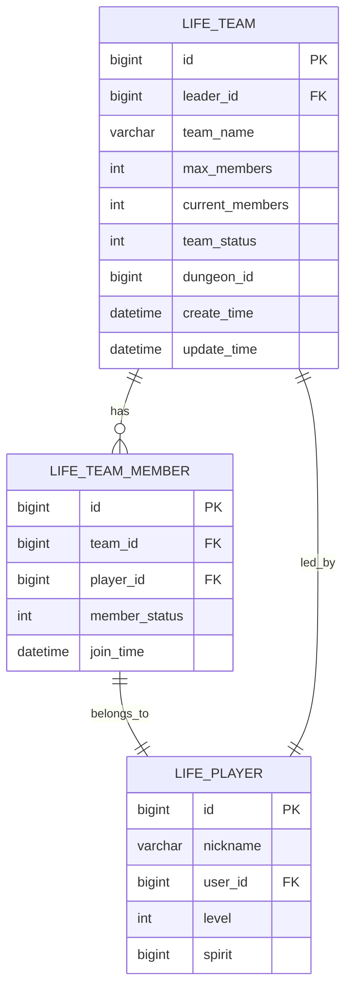
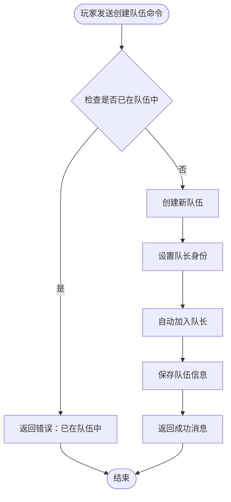
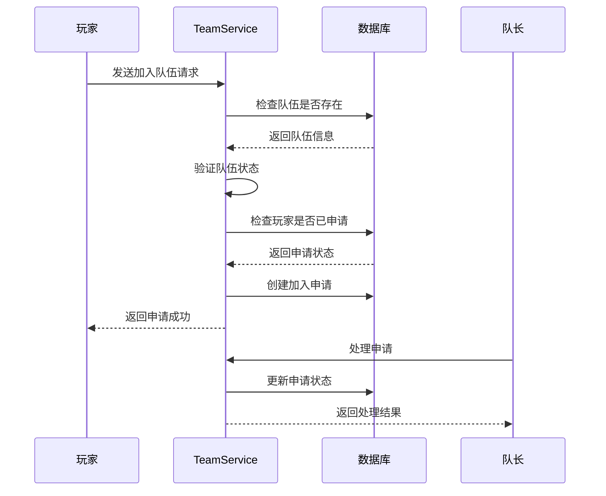
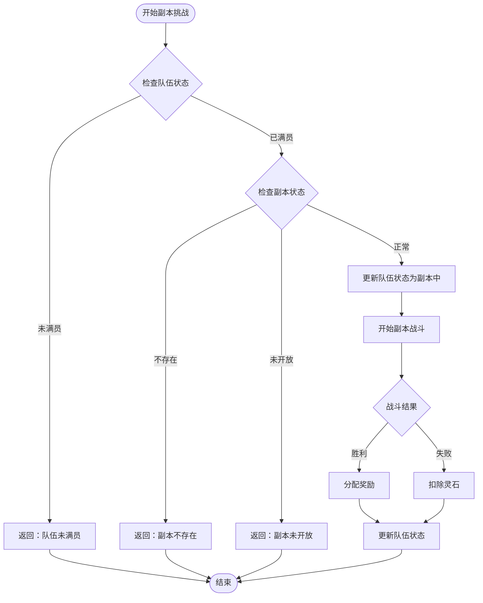
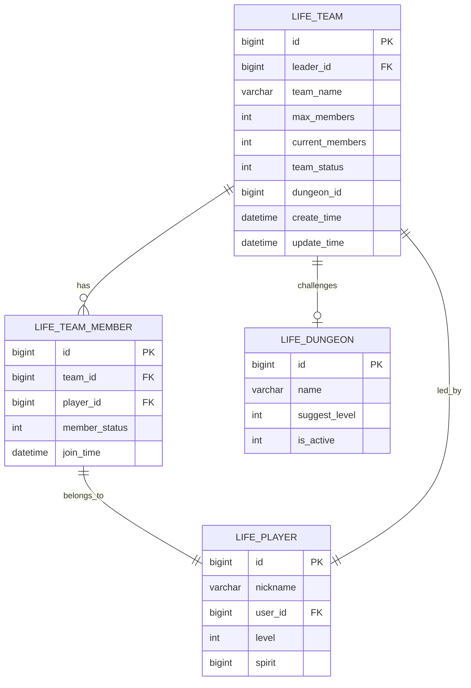
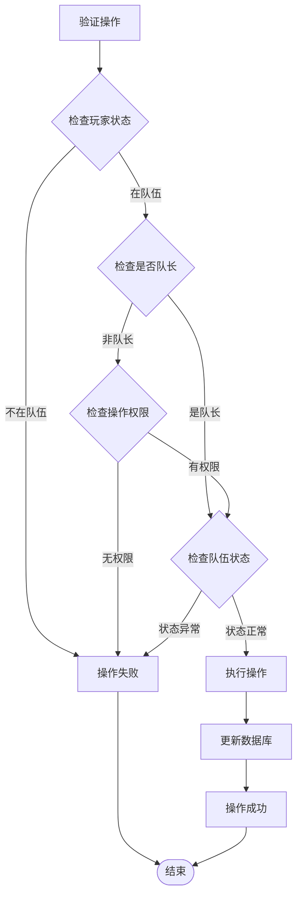

# 组队副本功能文档

<cite>
**本文档引用的文件**
- [Life_User_Manual.md](file://Life_User_Manual.md)
- [LifeHandlerImpl.java](file://Life\src\main\java\com\bot\life\service\impl\LifeHandlerImpl.java)
- [TeamService.java](file://Life\src\main\java\com\bot\life\service\TeamService.java)
- [TeamServiceImpl.java](file://Life\src\main\java\com\bot\life\service\impl\TeamServiceImpl.java)
- [LifeTeam.java](file://Life\src\main\java\com\bot\life\dao\entity\LifeTeam.java)
- [LifeTeamMember.java](file://Life\src\main\java\com\bot\life\dao\entity\LifeTeamMember.java)
- [GameConsts.java](file://Common\src\main\java\com\bot\common\constant\GameConsts.java)
- [DungeonGroupDTO.java](file://Game\src\main\java\com\bot\game\dto\DungeonGroupDTO.java)
- [CreateGroupPrinter.java](file://Game\src\main\java\com\bot\game\chain\menu\dungeon\CreateGroupPrinter.java)
- [JoinGroupServiceImpl.java](file://Game\src\main\java\com\bot\game\service\impl\dungeon\JoinGroupServiceImpl.java)
- [QuitGroupServiceImpl.java](file://Game\src\main\java\com\bot\game\service\impl\dungeon\QuitGroupServiceImpl.java)
</cite>

## 目录
1. [功能概述](#功能概述)
2. [系统架构](#系统架构)
3. [核心组件分析](#核心组件分析)
4. [组队系统详解](#组队系统详解)
5. [副本挑战机制](#副本挑战机制)
6. [奖励共享规则](#奖励共享规则)
7. [操作流程详解](#操作流程详解)
8. [数据库设计](#数据库设计)
9. [技术实现细节](#技术实现细节)
10. [故障排除指南](#故障排除指南)

## 功能概述

浮生卷的组队副本系统是一个基于2人组队的多人协作玩法，允许玩家通过创建队伍、邀请队友、共同挑战副本的方式获得更丰富的游戏体验和奖励。该系统具有以下特点：

- **最多2人组队**：严格限制队伍规模，确保游戏平衡性
- **队长管理模式**：队长负责队伍的创建、成员管理和副本挑战
- **队员托管机制**：队员加入后自动参与队伍的所有操作
- **奖励共享分配**：副本挑战成功后奖励自动分配给所有队员
- **灵活的队伍管理**：支持创建、加入、退出、解散等多种队伍操作

**章节来源**
- [Life_User_Manual.md](file://Life_User_Manual.md#L210-L214)

## 系统架构

组队副本系统采用分层架构设计，包含业务逻辑层、数据访问层和用户交互层：

**图表来源**
- [LifeHandlerImpl.java](file://Life\src\main\java\com\bot\life\service\impl\LifeHandlerImpl.java#L53-L120)
- [TeamService.java](file://Life\src\main\java\com\bot\life\service\TeamService.java#L9-L79)

## 核心组件分析

### TeamService 接口

TeamService 定义了组队系统的核心业务接口，包含以下主要方法：

**图表来源**
- [TeamService.java](file://Life\src\main\java\com\bot\life\service\TeamService.java#L9-L79)
- [TeamServiceImpl.java](file://Life\src\main\java\com\bot\life\service\impl\TeamServiceImpl.java#L16-L378)

### 队伍实体模型

队伍系统的核心数据结构包括队伍基本信息和成员信息：

**图表来源**
- [LifeTeam.java](file://Life\src\main\java\com\bot\life\dao\entity\LifeTeam.java#L11-L26)
- [LifeTeamMember.java](file://Life\src\main\java\com\bot\life\dao\entity\LifeTeamMember.java#L11-L23)

**章节来源**
- [LifeTeam.java](file://Life\src\main\java\com\bot\life\dao\entity\LifeTeam.java#L11-L26)
- [LifeTeamMember.java](file://Life\src\main\java\com\bot\life\dao\entity\LifeTeamMember.java#L11-L23)

## 组队系统详解

### 队伍状态管理

队伍系统维护三种基本状态：

| 状态码 | 状态名称 | 描述 |
|--------|----------|------|
| 0 | 招募中 | 队伍正在寻找成员，可加入 |
| 1 | 已满员 | 队伍成员已达到上限 |
| 2 | 副本中 | 队伍正在进行副本挑战 |

### 队伍创建流程

**图表来源**
- [TeamServiceImpl.java](file://Life\src\main\java\com\bot\life\service\impl\TeamServiceImpl.java#L29-L58)

### 队伍加入机制

**图表来源**
- [TeamServiceImpl.java](file://Life\src\main\java\com\bot\life\service\impl\TeamServiceImpl.java#L66-L114)

**章节来源**
- [TeamServiceImpl.java](file://Life\src\main\java\com\bot\life\service\impl\TeamServiceImpl.java#L29-L114)

## 副本挑战机制

### 副本挑战流程

**图表来源**
- [TeamServiceImpl.java](file://Life\src\main\java\com\bot\life\service\impl\TeamServiceImpl.java#L318-L354)

### 队长操作权限

队长在队伍中拥有特殊权限：

| 权限类型 | 操作内容 | 描述 |
|----------|----------|------|
| 队伍管理 | 创建队伍 | 创建新的队伍并成为队长 |
| 成员管理 | 同意申请 | 处理队员加入申请 |
| 成员管理 | 拒绝申请 | 拒绝队员加入申请 |
| 副本管理 | 挑战副本 | 发起副本挑战 |
| 队伍解散 | 解散队伍 | 解散整个队伍 |
| 队伍退出 | 队长退出 | 解散队伍并退出 |

**章节来源**
- [TeamServiceImpl.java](file://Life\src\main\java\com\bot\life\service\impl\TeamServiceImpl.java#L318-L354)

## 奖励共享规则

### 奖励分配机制

虽然当前实现中副本挑战功能仍在开发中，但系统设计遵循以下奖励共享原则：

- **胜利奖励**：副本挑战成功后，奖励自动分配给所有队伍成员
- **失败惩罚**：副本挑战失败时，扣除相应灵石作为惩罚
- **公平分配**：所有参与挑战的队员均获得同等比例的奖励
- **团队协作**：鼓励队员之间的协作和配合

### 奖励金额标准

根据系统常量定义，副本挑战的奖励和惩罚金额：

| 结果类型 | 奖励金额 | 描述 |
|----------|----------|------|
| 挑战成功 | 200灵石 | 副本挑战胜利后的奖励 |
| 挑战失败 | 50灵石 | 副本挑战失败后的补偿 |

**章节来源**
- [GameConsts.java](file://Common\src\main\java\com\bot\common\constant\GameConsts.java#L314-L316)

## 操作流程详解

### 玩家操作指南

#### 创建队伍

玩家可以通过以下步骤创建队伍：
1. 发送命令：`创建队伍+队伍名称`
2. 系统验证玩家是否已在队伍中
3. 创建新队伍并自动加入
4. 返回队伍ID和相关信息

#### 加入队伍

玩家加入已有队伍的操作流程：
1. 查询可用队伍：发送`查看队伍`
2. 选择目标队伍并获取队伍ID
3. 发送命令：`加入队伍+队伍ID`
4. 等待队长处理申请

#### 队伍管理

队长对队伍的管理操作：
- 查看队伍信息：`查看队伍`
- 处理成员申请：`同意队员+玩家ID` 或 `拒绝队员+玩家ID`
- 离开队伍：`离开队伍`（非队长）
- 解散队伍：`解散队伍`（队长）

#### 副本挑战

队长发起副本挑战的完整流程：
1. 确保队伍已满员（2人）
2. 发送命令：`挑战副本+副本ID`
3. 系统验证副本状态和队伍资格
4. 开始副本战斗
5. 根据战斗结果分配奖励或扣除灵石

**章节来源**
- [LifeHandlerImpl.java](file://Life\src\main\java\com\bot\life\service\impl\LifeHandlerImpl.java#L756-L818)

## 数据库设计

### 队伍相关表结构

#### LIFE_TEAM 表

| 字段名 | 类型 | 描述 |
|--------|------|------|
| id | bigint | 主键ID |
| leader_id | bigint | 队长ID |
| team_name | varchar(255) | 队伍名称 |
| max_members | int | 最大成员数（固定为2） |
| current_members | int | 当前成员数 |
| team_status | int | 队伍状态（0:招募中,1:已满员,2:副本中） |
| dungeon_id | bigint | 当前副本ID |
| create_time | datetime | 创建时间 |
| update_time | datetime | 更新时间 |

#### LIFE_TEAM_MEMBER 表

| 字段名 | 类型 | 描述 |
|--------|------|------|
| id | bigint | 主键ID |
| team_id | bigint | 队伍ID |
| player_id | bigint | 玩家ID |
| member_status | int | 成员状态（0:申请中,1:已同意） |
| join_time | datetime | 加入时间 |

### 数据关系图

**图表来源**
- [LifeTeam.java](file://Life\src\main\java\com\bot\life\dao\entity\LifeTeam.java#L11-L26)
- [LifeTeamMember.java](file://Life\src\main\java\com\bot\life\dao\entity\LifeTeamMember.java#L11-L23)

**章节来源**
- [LifeTeam.java](file://Life\src\main\java\com\bot\life\dao\entity\LifeTeam.java#L11-L26)
- [LifeTeamMember.java](file://Life\src\main\java\com\bot\life\dao\entity\LifeTeamMember.java#L11-L23)

## 技术实现细节

### 队伍状态验证

系统在执行各种队伍操作时，都会进行严格的权限和状态验证：

**图表来源**
- [TeamServiceImpl.java](file://Life\src\main\java\com\bot\life\service\impl\TeamServiceImpl.java#L116-L154)

### 并发控制

系统采用乐观锁机制防止并发冲突：

- **队伍创建**：通过唯一约束防止重复创建
- **成员加入**：使用事务保证成员状态的一致性
- **状态更新**：采用版本号控制防止并发修改

### 错误处理机制

系统实现了完善的错误处理和回滚机制：

- **数据库异常**：捕获SQL异常并回滚事务
- **业务逻辑异常**：验证输入参数的有效性
- **状态异常**：检查队伍和成员状态的合法性

**章节来源**
- [TeamServiceImpl.java](file://Life\src\main\java\com\bot\life\service\impl\TeamServiceImpl.java#L116-L154)

## 故障排除指南

### 常见问题及解决方案

#### 队伍创建失败

**问题现象**：发送创建队伍命令后返回失败消息

**可能原因**：
1. 玩家已在其他队伍中
2. 数据库连接异常
3. 队伍名称重复

**解决方法**：
1. 确认玩家已退出当前队伍
2. 检查数据库连接状态
3. 更换队伍名称

#### 加入队伍失败

**问题现象**：申请加入队伍时收到错误提示

**可能原因**：
1. 队伍不存在或已解散
2. 队伍已满员
3. 玩家已提交过申请

**解决方法**：
1. 确认队伍ID正确
2. 等待其他成员退出
3. 等待队长处理申请

#### 副本挑战异常

**问题现象**：发起副本挑战时出现问题

**可能原因**：
1. 队伍未满员
2. 副本不存在或未开放
3. 队伍状态异常

**解决方法**：
1. 确保队伍包含2名成员
2. 检查副本状态
3. 重新创建队伍

### 性能优化建议

1. **缓存策略**：缓存常用的队伍信息和成员列表
2. **批量操作**：对于大量成员的操作使用批量处理
3. **异步处理**：将非关键操作异步化处理
4. **连接池**：合理配置数据库连接池参数

### 监控指标

建议监控以下关键指标：
- 队伍创建成功率
- 成员加入响应时间
- 副本挑战完成率
- 系统错误率

这些指标有助于及时发现和解决系统问题，确保组队副本系统的稳定运行。