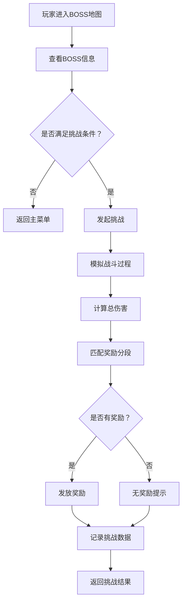
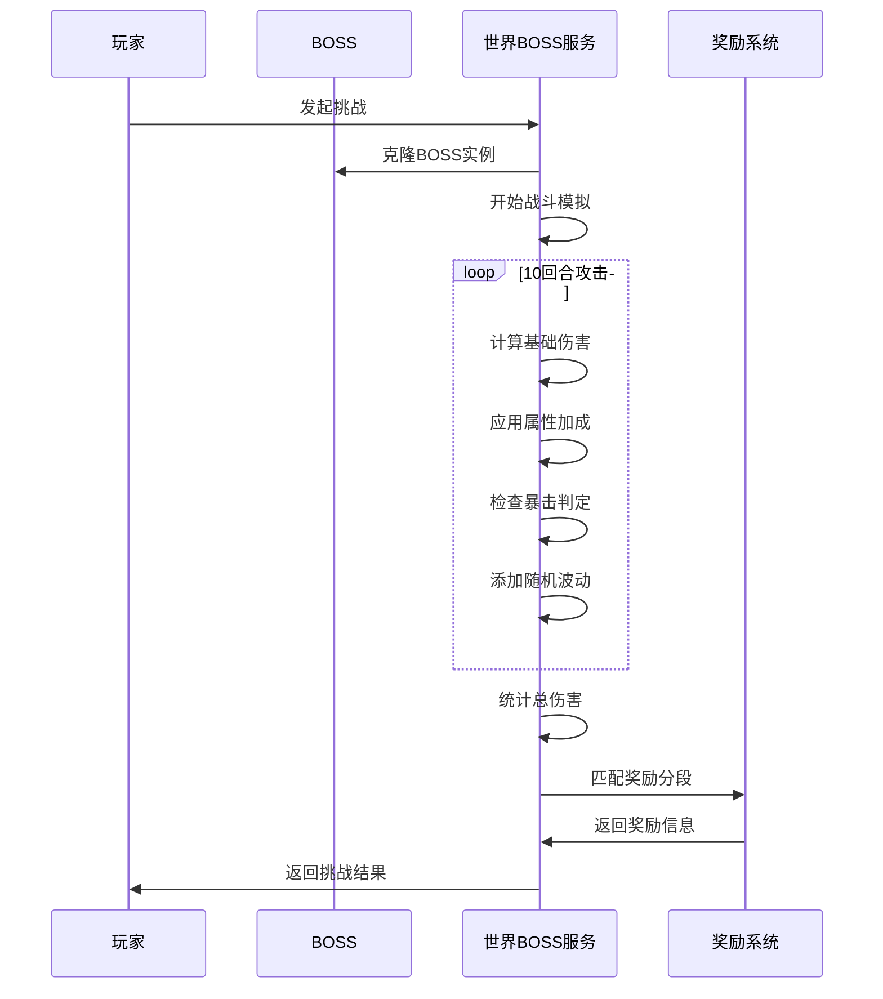
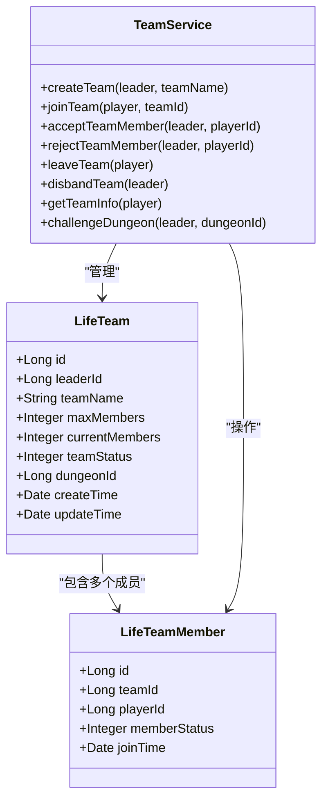
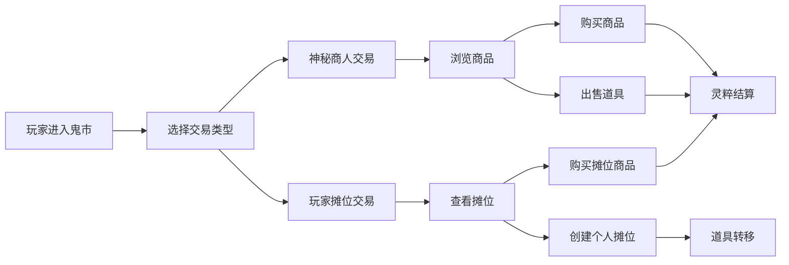
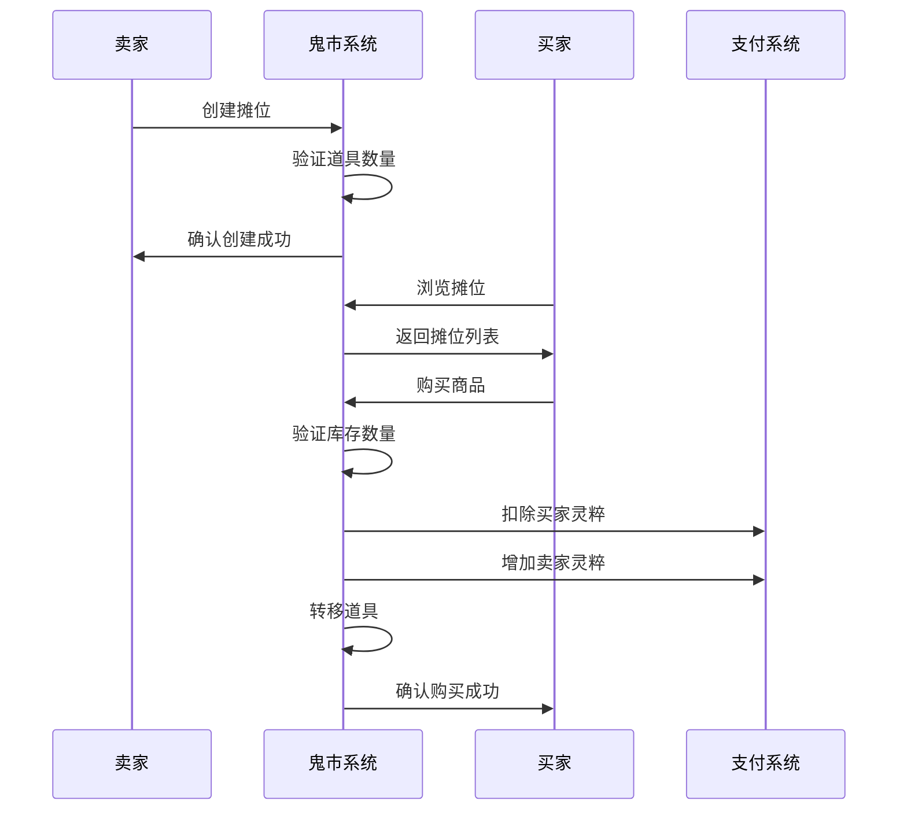
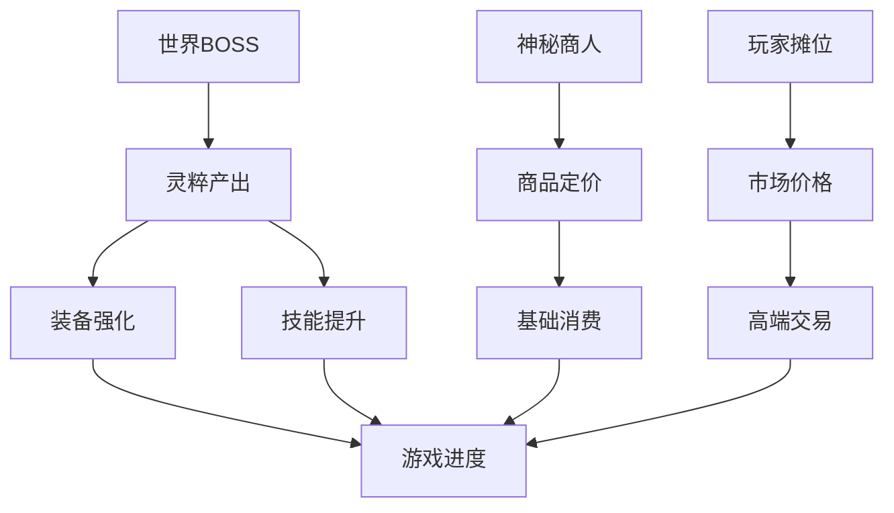

# 高级玩法

<cite>
**本文档引用的文件**
- [LifeHandlerImpl.java](file://Life/src/main/java/com/bot/life/service/impl/LifeHandlerImpl.java)
- [WorldBossServiceImpl.java](file://Life/src/main/java/com/bot/life/service/impl/WorldBossServiceImpl.java)
- [TeamServiceImpl.java](file://Life/src/main/java/com/bot/life/service/impl/TeamServiceImpl.java)
- [MarketServiceImpl.java](file://Life/src/main/java/com/bot/life/service/impl/MarketServiceImpl.java)
- [LifeWorldBossReward.java](file://Life/src/main/java/com/bot/life/dao/entity/LifeWorldBossReward.java)
- [LifeTeam.java](file://Life/src/main/java/com/bot/life/dao/entity/LifeTeam.java)
- [浮生卷开发说明.md](file://浮生卷开发说明.md)
</cite>

## 目录
1. [简介](#简介)
2. [世界BOSS挑战机制](#世界boss挑战机制)
3. [组队副本系统](#组队副本系统)
4. [鬼市交易功能](#鬼市交易功能)
5. [高级玩法对游戏生态的影响](#高级玩法对游戏生态的影响)
6. [总结](#总结)

## 简介

浮生卷作为一款修仙文字游戏，提供了丰富的高级玩法内容，包括世界BOSS挑战、组队副本系统和鬼市交易功能。这些玩法不仅增加了游戏的策略性和互动性，还构建了一个完整的修仙世界生态系统，让玩家能够体验到真实的修仙生活。

## 世界BOSS挑战机制

### 核心特性

世界BOSS挑战是浮生卷中最具有代表性的PVE玩法之一，具有以下核心特性：

- **全服参与机制**：所有玩家都可以参与挑战，形成大规模的战斗场景
- **分段奖励系统**：根据玩家造成的伤害量提供不同层次的奖励
- **时间限制**：每天固定时间段开放挑战机会
- **属性相克**：战斗中存在五行相克关系，影响伤害计算

### 挑战流程

**图表来源**
- [WorldBossServiceImpl.java](file://Life/src/main/java/com/bot/life/service/impl/WorldBossServiceImpl.java#L76-L118)

### 奖励分段机制

世界BOSS的奖励采用严格的分段制度，确保公平性和激励效果：

| 伤害范围 | 灵粹奖励 | 道具奖励 |
|---------|---------|---------|
| 0-1000 | 0 | 无 |
| 1001-5000 | 100 | 基础丹药 |
| 5001-10000 | 500 | 中级丹药 |
| 10001-20000 | 1000 | 高级丹药 |
| 20001+ | 2000 | 稀有宝物 |

**节来源**
- [WorldBossServiceImpl.java](file://Life/src/main/java/com/bot/life/service/impl/WorldBossServiceImpl.java#L241-L249)

### 战斗机制

世界BOSS战斗采用简化的自动战斗模式：

**图表来源**
- [WorldBossServiceImpl.java](file://Life/src/main/java/com/bot/life/service/impl/WorldBossServiceImpl.java#L194-L225)

**节来源**
- [WorldBossServiceImpl.java](file://Life/src/main/java/com/bot/life/service/impl/WorldBossServiceImpl.java#L76-L118)

## 组队副本系统

### 系统架构

组队副本系统支持最多2人小队的协作玩法，为玩家提供了深度的社交互动体验：

**图表来源**
- [TeamServiceImpl.java](file://Life/src/main/java/com/bot/life/service/impl/TeamServiceImpl.java#L17-L378)
- [LifeTeam.java](file://Life/src/main/java/com/bot/life/dao/entity/LifeTeam.java#L11-L25)

### 队伍状态管理

队伍系统采用状态机管理模式，确保队伍行为的规范性：

| 状态码 | 状态名称 | 描述 | 可执行操作 |
|-------|---------|------|-----------|
| 0 | 招募中 | 队伍正在寻找成员 | 加入申请、解散队伍 |
| 1 | 已满员 | 队伍达到最大人数 | 挑战副本、解散队伍 |
| 2 | 副本中 | 队伍正在进行副本挑战 | 离开队伍、强制解散 |

### 队长权限体系

队长拥有完整的队伍管理权限：

- **成员管理**：批准或拒绝玩家加入申请
- **队伍运营**：启动副本挑战、解散队伍
- **资源分配**：协调队伍内的资源使用
- **决策制定**：决定队伍行动方向和策略

**节来源**
- [TeamServiceImpl.java](file://Life/src/main/java/com/bot/life/service/impl/TeamServiceImpl.java#L177-L306)

## 鬼市交易功能

### 交易系统架构

鬼市交易系统融合了神秘商人和玩家交易两大模块，构建了一个完整的修仙市场：

**图表来源**
- [MarketServiceImpl.java](file://Life/src/main/java/com/bot/life/service/impl/MarketServiceImpl.java#L46-L61)

### 神秘商人系统

神秘商人提供每日刷新的商品列表，采用折扣机制平衡市场：

| 商品类型 | 基础价格倍率 | 折扣范围 | 特殊规则 |
|---------|-------------|---------|---------|
| 修为类 | 1.0 | 6-9折 | 影响修炼速度 |
| 属性类 | 1.2 | 6-9折 | 提升基础属性 |
| 体力类 | 0.8 | 6-9折 | 恢复体力值 |
| 升级法宝类 | 1.5 | 6-9折 | 提升法宝品质 |
| 恢复类 | 0.9 | 6-9折 | 快速恢复状态 |
| 技能书 | 2.0 | 6-9折 | 学习特殊技能 |

### 玩家摊位系统

玩家摊位允许玩家之间直接交易，促进社区经济：

**图表来源**
- [MarketServiceImpl.java](file://Life/src/main/java/com/bot/life/service/impl/MarketServiceImpl.java#L256-L354)

**节来源**
- [MarketServiceImpl.java](file://Life/src/main/java/com/bot/life/service/impl/MarketServiceImpl.java#L220-L354)

## 高级玩法对游戏生态的影响

### 社交互动增强

高级玩法显著提升了玩家间的互动频率和深度：

- **团队协作**：组队副本要求玩家间密切配合，培养团队精神
- **资源共享**：世界BOSS挑战中玩家需要合理分配伤害输出
- **经济交流**：鬼市交易促进了玩家间的物资交换和价值流通

### 游戏经济平衡

高级玩法建立了多层次的游戏经济体系：

### 策略深度提升

高级玩法引入了多种策略选择：

- **职业搭配**：不同属性的玩家在世界BOSS中有不同的作用
- **时机把握**：世界BOSS挑战需要选择最佳参与时机
- **资源规划**：组队副本需要合理分配队伍资源
- **市场投机**：鬼市交易存在套利机会和风险

### 成就系统联动

高级玩法与成就系统紧密结合，形成完整的激励体系：

| 玩法类型 | 成就目标 | 奖励类型 |
|---------|---------|---------|
| 世界BOSS | 累计伤害达到XX | 称号、外观 |
| 组队副本 | 完成副本挑战 | 特殊道具 |
| 鬼市交易 | 达成交易金额 | 稀有物品 |

## 总结

浮生卷的高级玩法系统通过世界BOSS挑战、组队副本和鬼市交易三大核心功能，构建了一个完整而富有深度的修仙世界。这些玩法不仅丰富了游戏内容，更重要的是：

1. **增强了社交粘性**：通过团队协作和市场交易建立玩家间的联系
2. **提升了游戏深度**：多层次的策略选择和资源管理增加了游戏可玩性
3. **完善了经济体系**：建立了自循环的市场机制，促进玩家活跃度
4. **丰富了游戏体验**：多样化的玩法满足不同玩家的需求偏好

这些高级玩法的成功实施，使得浮生卷不仅仅是一款简单的文字游戏，而是一个充满活力和互动性的修仙世界，为玩家提供了真实而有趣的修仙体验。