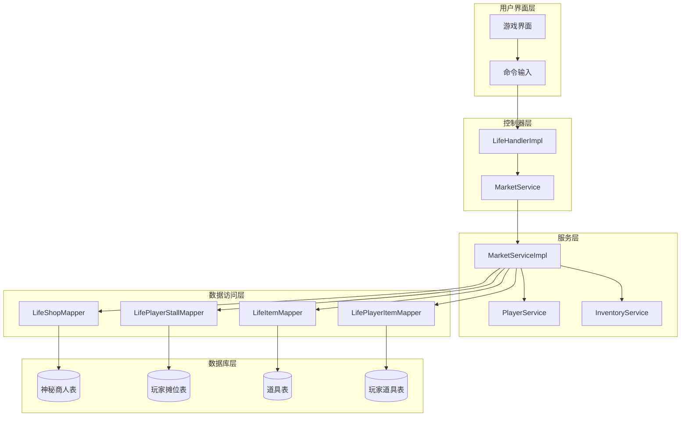
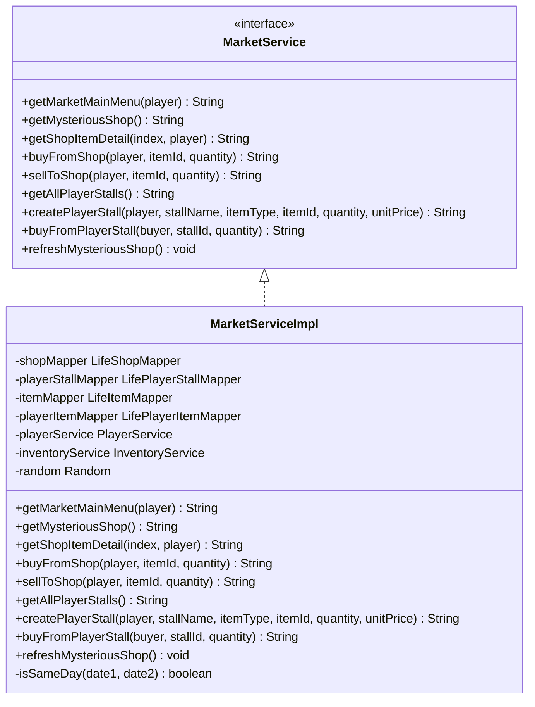
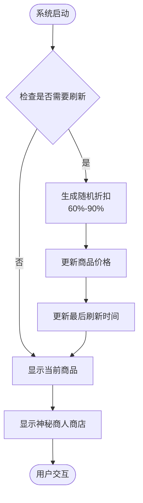
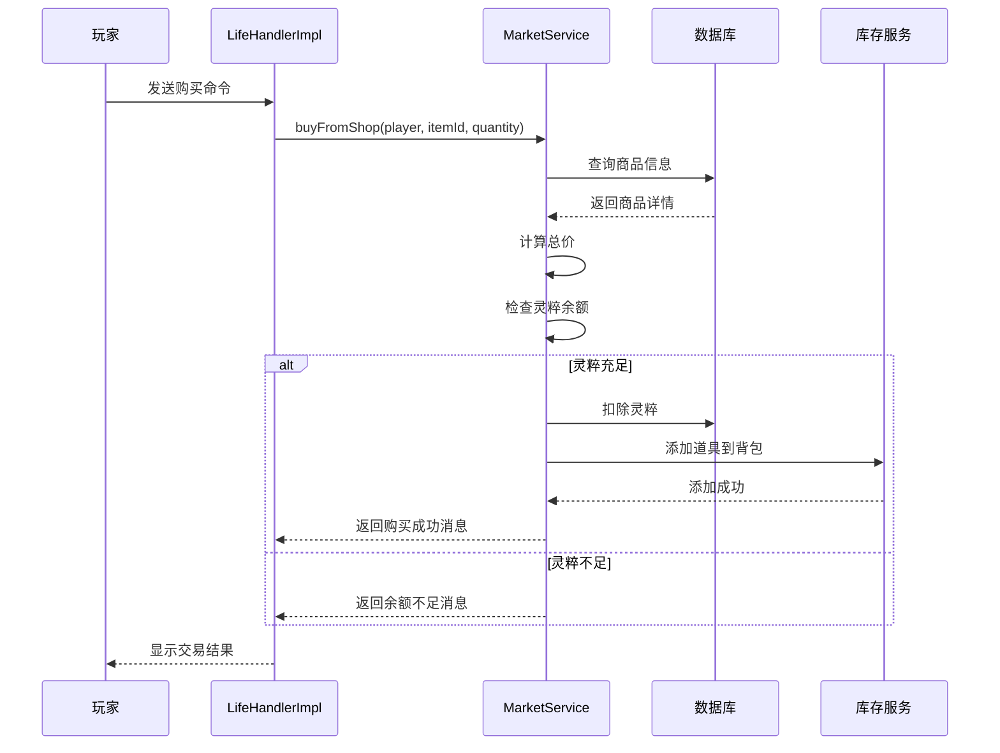
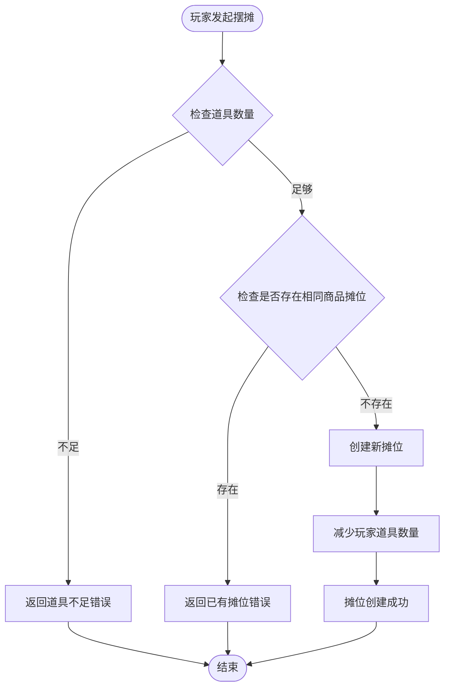
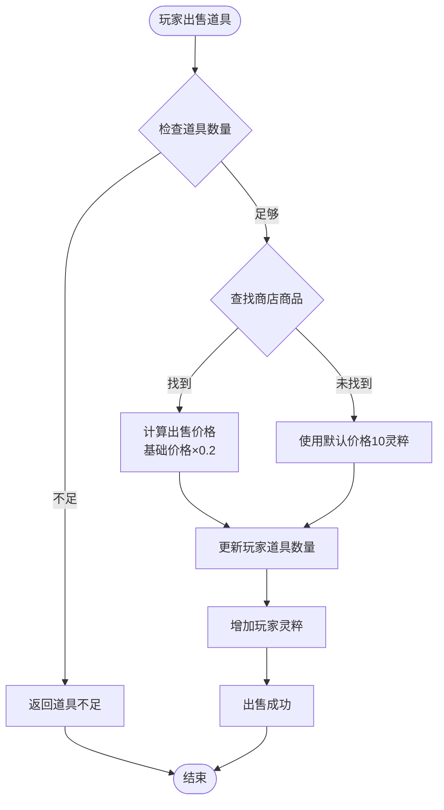
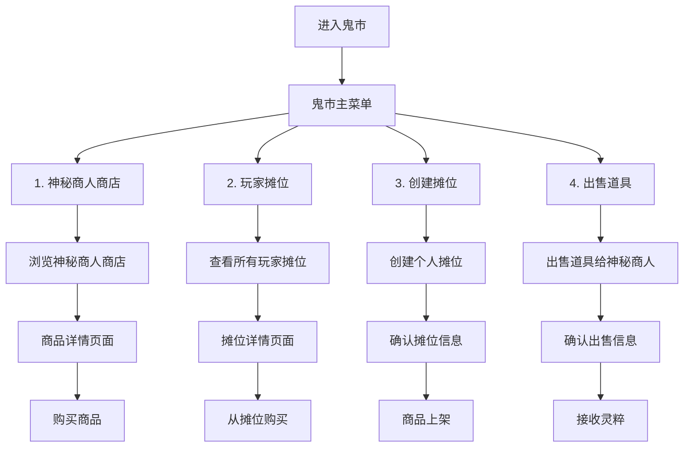
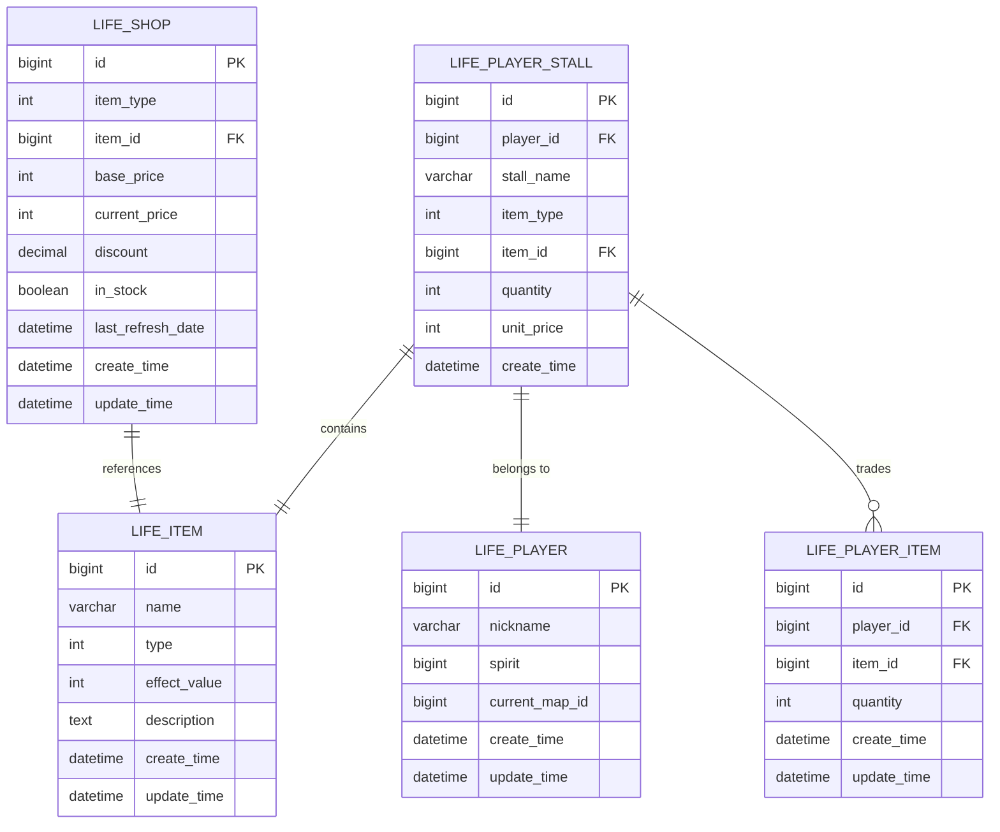
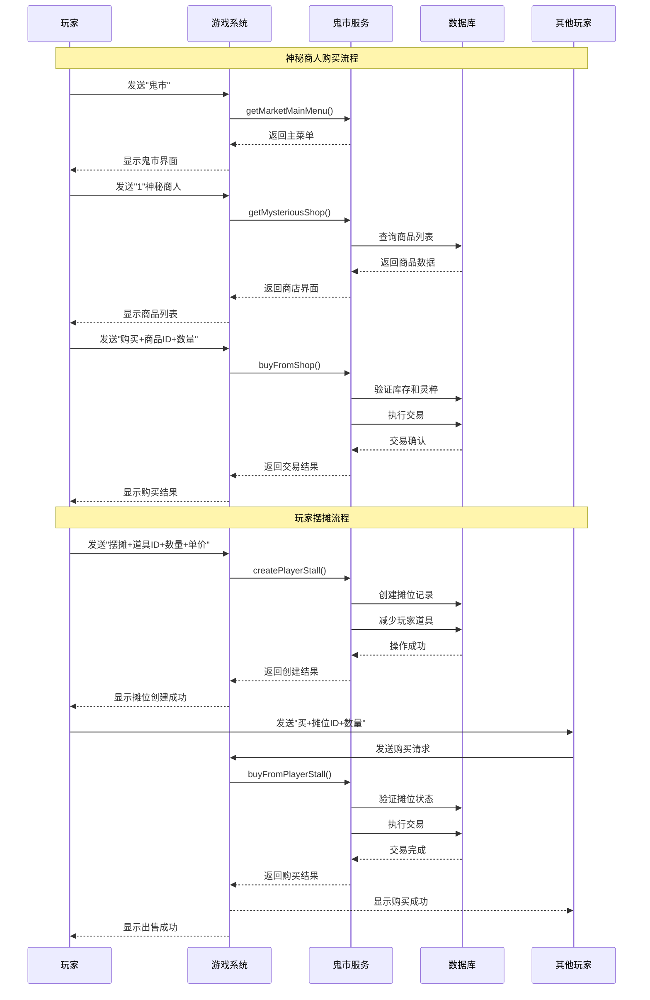
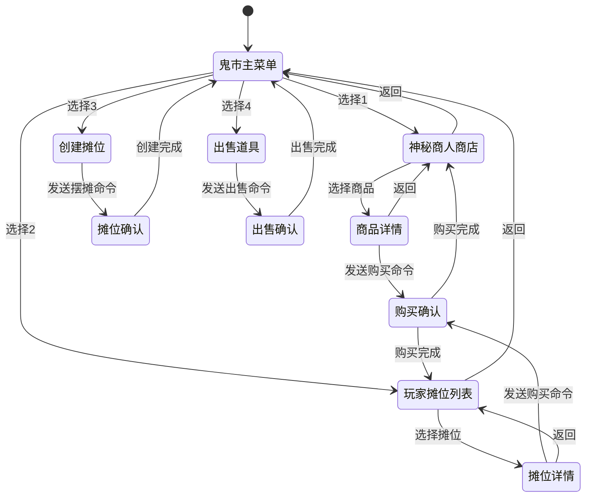

# 鬼市交易功能文档

<cite>
**本文档引用的文件**
- [Life_User_Manual.md](file://Life_User_Manual.md)
- [MarketService.java](file://Life\src\main\java\com\bot\life\service\MarketService.java)
- [MarketServiceImpl.java](file://Life\src\main\java\com\bot\life\service\impl\MarketServiceImpl.java)
- [LifeHandlerImpl.java](file://Life\src\main\java\com\bot\life\service\impl\LifeHandlerImpl.java)
- [LifeShop.java](file://Life\src\main\java\com\bot\life\dao\entity\LifeShop.java)
- [LifePlayerStall.java](file://Life\src\main\java\com\bot\life\dao\entity\LifePlayerStall.java)
- [Life_Method_Call_Fix.md](file://Life_Method_Call_Fix.md)
</cite>

## 目录
1. [概述](#概述)
2. [系统架构](#系统架构)
3. [核心组件分析](#核心组件分析)
4. [神秘商人系统](#神秘商人系统)
5. [玩家摆摊系统](#玩家摆摊系统)
6. [交易流程详解](#交易流程详解)
7. [数据库设计](#数据库设计)
8. [用户交互流程](#用户交互流程)
9. [性能优化考虑](#性能优化考虑)
10. [故障排除指南](#故障排除指南)

## 概述

鬼市交易系统是浮生卷游戏中的核心经济系统，提供了两种主要的交易方式：神秘商人系统和玩家摆摊系统。该系统支持所有类型的道具和装备交易，为玩家提供了丰富的资源获取和流通渠道。

### 主要特性

- **神秘商人系统**：提供固定商品，每日随机折扣
- **玩家摆摊系统**：支持自由定价的个人交易平台
- **全道具支持**：涵盖修为类、属性类、体力类等各种道具
- **双向交易**：支持购买和出售两种交易模式
- **实时更新**：商品价格和库存实时变化

## 系统架构



**图表来源**
- [LifeHandlerImpl.java](file://Life\src\main\java\com\bot\life\service\impl\LifeHandlerImpl.java#L556-L570)
- [MarketServiceImpl.java](file://Life\src\main\java\com\bot\life\service\impl\MarketServiceImpl.java#L22-L42)

## 核心组件分析

### MarketService 接口

MarketService 定义了鬼市交易的核心接口，包含了所有必要的交易功能。



**图表来源**
- [MarketService.java](file://Life\src\main\java\com\bot\life\service\MarketService.java#L9-L56)
- [MarketServiceImpl.java](file://Life\src\main\java\com\bot\life\service\impl\MarketServiceImpl.java#L22-L42)

### LifeShop 实体

神秘商人商店的商品信息存储结构。

| 字段名 | 类型 | 描述 | 约束 |
|--------|------|------|------|
| id | Long | 商品唯一标识 | 主键 |
| itemType | Integer | 商品类型：1道具2装备 | 非空 |
| itemId | Long | 对应道具或装备ID | 非空 |
| basePrice | Integer | 基础价格 | 非空 |
| currentPrice | Integer | 当前价格（含折扣） | 非空 |
| discount | BigDecimal | 折扣比例（0.6-0.9） | 非空 |
| inStock | Boolean | 是否有库存 | 非空 |
| lastRefreshDate | Date | 最后刷新日期 | 可空 |
| createTime | Date | 创建时间 | 非空 |
| updateTime | Date | 更新时间 | 非空 |

### LifePlayerStall 实体

玩家摆摊系统的摊位信息存储结构。

| 字段名 | 类型 | 描述 | 约束 |
|--------|------|------|------|
| id | Long | 摊位唯一标识 | 主键 |
| playerId | Long | 摊主玩家ID | 非空 |
| stallName | String | 摊位名称 | 非空 |
| itemType | Integer | 商品类型：1道具2装备 | 非空 |
| itemId | Long | 对应道具或装备ID | 非空 |
| quantity | Integer | 商品数量 | 非空 |
| unitPrice | Integer | 单价 | 非空 |
| createTime | Date | 创建时间 | 非空 |

**节来源**
- [LifeShop.java](file://Life\src\main\java\com\bot\life\dao\entity\LifeShop.java#L11-L27)
- [LifePlayerStall.java](file://Life\src\main\java\com\bot\life\dao\entity\LifePlayerStall.java#L10-L25)

## 神秘商人系统

神秘商人系统是鬼市交易的核心组成部分，提供固定商品和每日随机折扣机制。

### 每日折扣机制

神秘商人的商品价格每天刷新，采用6-9折的随机折扣策略：



**图表来源**
- [MarketServiceImpl.java](file://Life\src\main\java\com\bot\life\service\impl\MarketServiceImpl.java#L356-L377)

### 商品分类系统

神秘商人出售的商品按类型分为以下几类：

| 类型ID | 商品类型 | 描述 | 示例 |
|--------|----------|------|------|
| 1 | 修为类 | 直接增加修为的道具 | 修炼丹、灵根果 |
| 2 | 属性类 | 永久增加属性的道具 | 功法书、灵石 |
| 3 | 体力类 | 恢复体力的道具 | 体力丸、灵泉 |
| 4 | 升级法宝类 | 增加法宝熟练度的道具 | 法宝精炼石 |
| 5 | 恢复类 | 战斗中使用的恢复道具 | 回血丹、解毒丸 |
| 6 | 技能书 | 学习新技能的道具 | 心法残篇、神通秘籍 |

### 购买流程



**图表来源**
- [MarketServiceImpl.java](file://Life\src\main\java\com\bot\life\service\impl\MarketServiceImpl.java#L146-L179)

**节来源**
- [MarketServiceImpl.java](file://Life\src\main\java\com\bot\life\service\impl\MarketServiceImpl.java#L356-L377)
- [MarketServiceImpl.java](file://Life\src\main\java\com\bot\life\service\impl\MarketServiceImpl.java#L146-L179)

## 玩家摆摊系统

玩家摆摊系统允许玩家创建个人摊位，自由设定商品和价格，实现玩家间的直接交易。

### 摊位创建流程



**图表来源**
- [MarketServiceImpl.java](file://Life\src\main\java\com\bot\life\service\impl\MarketServiceImpl.java#L255-L295)

### 摊位管理机制

玩家摊位具有以下特点：

- **唯一性**：每位玩家对同一商品只能创建一个摊位
- **自动清理**：商品售罄后自动删除摊位
- **实时更新**：摊位信息实时同步更新
- **安全机制**：不能从自己的摊位购买

### 出售给神秘商人

玩家可以将道具出售给神秘商人，采用固定比例的回收机制：



**图表来源**
- [MarketServiceImpl.java](file://Life\src\main\java\com\bot\life\service\impl\MarketServiceImpl.java#L182-L218)

**节来源**
- [MarketServiceImpl.java](file://Life\src\main\java\com\bot\life\service\impl\MarketServiceImpl.java#L255-L295)
- [MarketServiceImpl.java](file://Life\src\main\java\com\bot\life\service\impl\MarketServiceImpl.java#L182-L218)

## 交易流程详解

### 鬼市主菜单

玩家通过发送"鬼市"命令进入鬼市交易系统，主菜单提供以下功能选项：



**图表来源**
- [LifeHandlerImpl.java](file://Life\src\main\java\com\bot\life\service\impl\LifeHandlerImpl.java#L556-L570)
- [MarketServiceImpl.java](file://Life\src\main\java\com\bot\life\service\impl\MarketServiceImpl.java#L46-L61)

### 购买流程

#### 从神秘商人购买

1. **选择商品**：玩家输入商品序号查看详细信息
2. **确认购买**：发送"购买+数量"命令
3. **验证条件**：检查灵粹余额和库存
4. **执行交易**：扣除灵粹，添加道具到背包
5. **更新状态**：刷新商店商品列表

#### 从玩家摊位购买

1. **浏览摊位**：查看所有可用摊位
2. **选择摊位**：输入摊位ID和购买数量
3. **验证条件**：检查灵粹余额和摊位库存
4. **执行交易**：扣除买家灵粹，增加卖家灵粹
5. **更新库存**：减少摊位商品数量或删除摊位

### 命令格式规范

| 功能 | 命令格式 | 示例 | 参数说明 |
|------|----------|------|----------|
| 访问神秘商人商店 | 1 | 1 | 数字1 |
| 查看玩家摊位 | 2 | 2 | 数字2 |
| 创建摊位 | 摆摊+道具ID+数量+单价 | 摆摊1+10+100 | 摆摊+物品ID+数量+单价 |
| 购买商品 | 购买+商品ID+数量 | 购买1+5 | 购买+商品ID+数量 |
| 出售道具 | 出售+道具ID+数量 | 出售1+3 | 出售+道具ID+数量 |
| 从摊位购买 | 买+摊位ID+数量 | 买1+2 | 买+摊位ID+数量 |
| 返回上级菜单 | 返回 | 返回 | 文本"返回" |

**节来源**
- [LifeHandlerImpl.java](file://Life\src\main\java\com\bot\life\service\impl\LifeHandlerImpl.java#L556-L570)
- [MarketServiceImpl.java](file://Life\src\main\java\com\bot\life\service\impl\MarketServiceImpl.java#L46-L61)

## 数据库设计

### 神秘商人表结构

神秘商人系统的核心数据存储在 `life_shop` 表中，包含以下关键字段：

```sql
CREATE TABLE life_shop (
    id BIGINT PRIMARY KEY AUTO_INCREMENT,
    item_type INT NOT NULL COMMENT '商品类型：1道具2装备',
    item_id BIGINT NOT NULL COMMENT '对应道具或装备ID',
    base_price INT NOT NULL COMMENT '基础价格',
    current_price INT NOT NULL COMMENT '当前价格（含折扣）',
    discount DECIMAL(3,2) NOT NULL COMMENT '折扣比例',
    in_stock BOOLEAN NOT NULL DEFAULT TRUE COMMENT '是否有库存',
    last_refresh_date DATE COMMENT '最后刷新日期',
    create_time DATETIME NOT NULL,
    update_time DATETIME NOT NULL
);
```

### 玩家摊位表结构

玩家摊位系统的数据存储在 `life_player_stall` 表中：

```sql
CREATE TABLE life_player_stall (
    id BIGINT PRIMARY KEY AUTO_INCREMENT,
    player_id BIGINT NOT NULL COMMENT '摊主玩家ID',
    stall_name VARCHAR(50) NOT NULL COMMENT '摊位名称',
    item_type INT NOT NULL COMMENT '商品类型：1道具2装备',
    item_id BIGINT NOT NULL COMMENT '对应道具或装备ID',
    quantity INT NOT NULL COMMENT '商品数量',
    unit_price INT NOT NULL COMMENT '单价',
    create_time DATETIME NOT NULL,
    UNIQUE KEY unique_player_item (player_id, item_id)
);
```

### 数据关联关系



**图表来源**
- [LifeShop.java](file://Life\src\main\java\com\bot\life\dao\entity\LifeShop.java#L11-L27)
- [LifePlayerStall.java](file://Life\src\main\java\com\bot\life\dao\entity\LifePlayerStall.java#L10-L25)

**节来源**
- [LifeShop.java](file://Life\src\main\java\com\bot\life\dao\entity\LifeShop.java#L11-L27)
- [LifePlayerStall.java](file://Life\src\main\java\com\bot\life\dao\entity\LifePlayerStall.java#L10-L25)

## 用户交互流程

### 完整交易生命周期



**图表来源**
- [LifeHandlerImpl.java](file://Life\src\main\java\com\bot\life\service\impl\LifeHandlerImpl.java#L556-L570)
- [MarketServiceImpl.java](file://Life\src\main\java\com\bot\life\service\impl\MarketServiceImpl.java#L255-L295)

### 错误处理机制

系统实现了完善的错误处理机制，包括：

- **库存不足**：当商品数量不足以满足购买需求时
- **灵粹不足**：当玩家灵粹不足以支付商品价格时  
- **道具不存在**：当指定的道具ID无效时
- **摊位不存在**：当指定的摊位ID无效时
- **重复摊位**：当玩家尝试创建重复商品的摊位时

### 状态管理

鬼市交易系统维护了详细的状态信息：



**图表来源**
- [LifeHandlerImpl.java](file://Life\src\main\java\com\bot\life\service\impl\LifeHandlerImpl.java#L980-L1070)

**节来源**
- [LifeHandlerImpl.java](file://Life\src\main\java\com\bot\life\service\impl\LifeHandlerImpl.java#L556-L570)
- [MarketServiceImpl.java](file://Life\src\main\java\com\bot\life\service\impl\MarketServiceImpl.java#L255-L295)

## 性能优化考虑

### 缓存策略

为了提高系统性能，建议实施以下缓存策略：

1. **商品列表缓存**：缓存神秘商人的商品列表，减少数据库查询
2. **摊位信息缓存**：缓存活跃的玩家摊位信息
3. **玩家状态缓存**：缓存玩家的基本信息和灵粹余额

### 并发控制

系统需要处理多个玩家同时进行交易的情况：

- **库存锁定**：在交易过程中锁定商品库存
- **灵粹同步**：确保灵粹余额的一致性
- **摊位状态**：防止摊位被重复购买

### 数据库优化

- **索引优化**：在 `player_id` 和 `item_id` 上建立复合索引
- **分区策略**：对历史交易数据进行分区存储
- **连接池配置**：合理配置数据库连接池大小

## 故障排除指南

### 常见问题及解决方案

#### 1. 商品购买失败

**症状**：玩家购买商品后，灵粹被扣除但道具未到账

**原因分析**：
- 库存不足
- 数据库事务未提交
- 道具添加失败

**解决步骤**：
1. 检查商品库存状态
2. 验证数据库事务完整性
3. 确认库存服务正常工作

#### 2. 摊位创建失败

**症状**：玩家创建摊位后，摊位信息未显示

**原因分析**：
- 玩家道具数量不足
- 数据库约束冲突
- 服务异常

**解决步骤**：
1. 验证玩家道具数量
2. 检查数据库约束
3. 重启相关服务

#### 3. 神秘商人商店为空

**症状**：神秘商人商店显示"商人暂时没有商品出售..."

**原因分析**：
- 商店商品初始化失败
- 数据库连接异常
- 商品刷新逻辑错误

**解决步骤**：
1. 检查商品数据完整性
2. 验证数据库连接
3. 手动触发商品刷新

### 监控指标

建议监控以下关键指标：

| 指标类型 | 监控项目 | 正常范围 | 告警阈值 |
|----------|----------|----------|----------|
| 性能指标 | 响应时间 | < 500ms | > 1000ms |
| 性能指标 | 并发用户数 | < 1000 | > 500 |
| 业务指标 | 日活用户数 | > 100 | < 50 |
| 业务指标 | 交易成功率 | > 95% | < 90% |
| 错误指标 | 错误率 | < 1% | > 5% |

### 日志分析

系统记录详细的交易日志，便于问题追踪：

```bash
# 成功交易日志示例
2024-01-15 10:30:45 INFO  MarketServiceImpl - Player[12345] purchased item[789] x 3 from shop, cost: 1500 spirit

# 失败交易日志示例  
2024-01-15 10:31:12 ERROR MarketServiceImpl - Player[12345] failed to buy item[789], reason: insufficient stock
```

**节来源**
- [MarketServiceImpl.java](file://Life\src\main\java\com\bot\life\service\impl\MarketServiceImpl.java#L146-L179)
- [MarketServiceImpl.java](file://Life\src\main\java\com\bot\life\service\impl\MarketServiceImpl.java#L255-L295)

## 结论

浮生卷的鬼市交易系统是一个功能完整、设计合理的经济系统。它通过神秘商人和玩家摆摊两种方式，为玩家提供了丰富的交易选择。系统具有良好的扩展性，支持所有类型的道具和装备交易，同时具备完善的错误处理和状态管理机制。

该系统的设计充分考虑了用户体验和系统性能，通过合理的架构分层和模块化设计，确保了系统的稳定性和可维护性。随着游戏的发展，该系统还可以进一步优化和扩展，以满足更多样化的交易需求。