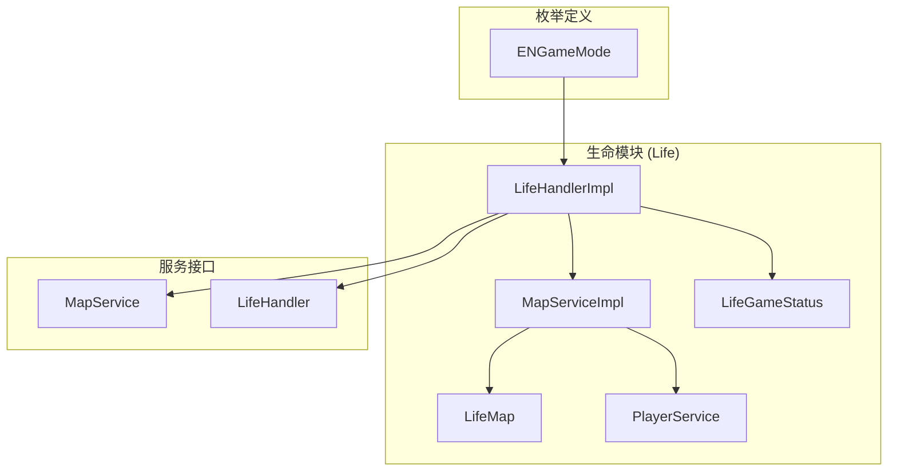
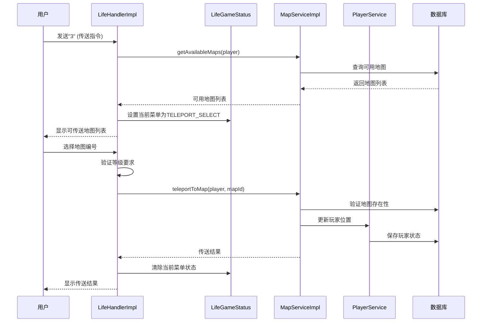
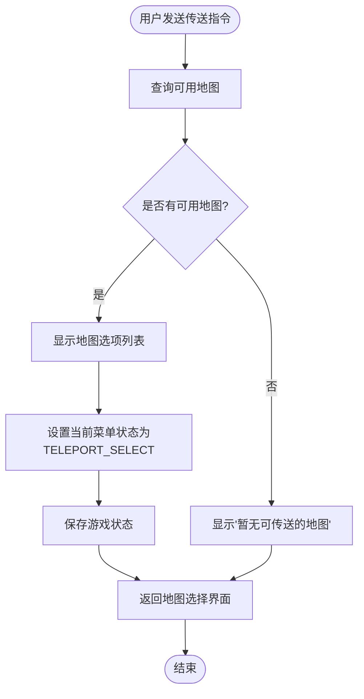
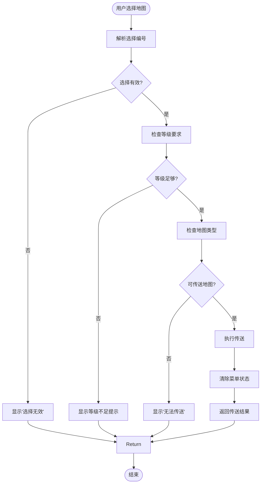
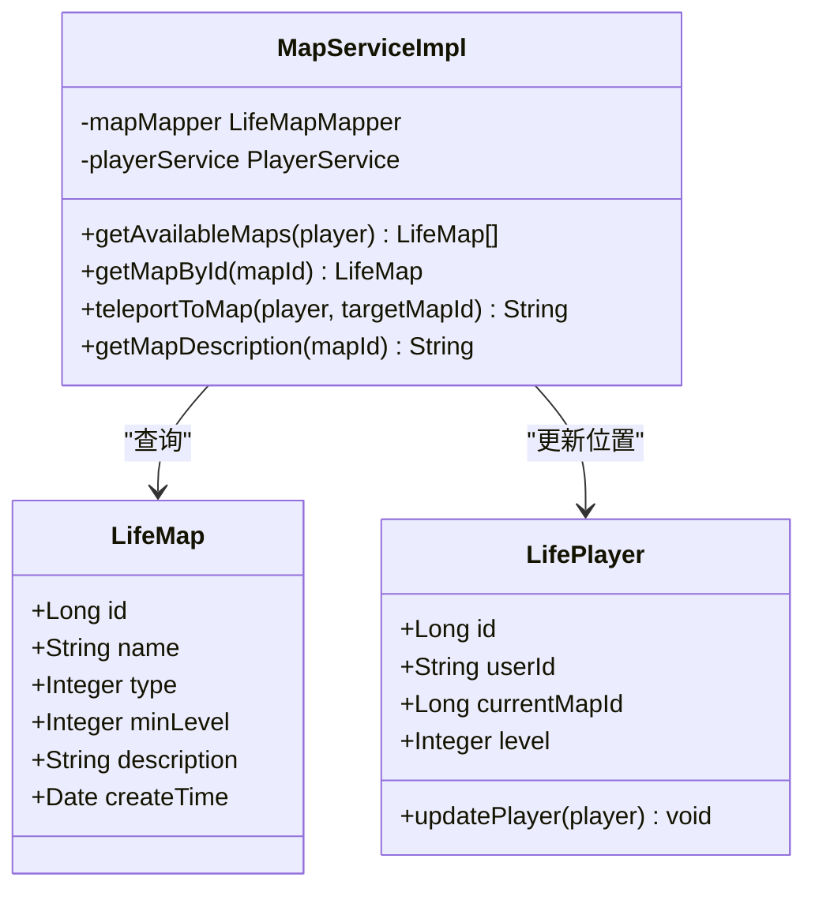
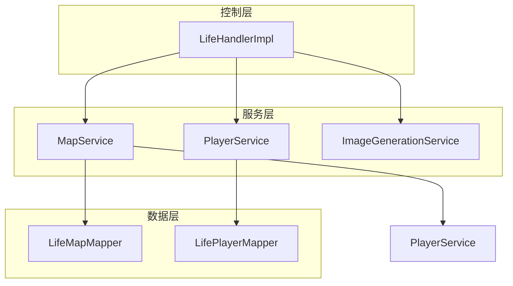

# 传送功能

<cite>
**本文档引用的文件**
- [LifeHandlerImpl.java](file://Life/src/main/java/com/bot/life/service/impl/LifeHandlerImpl.java)
- [MapServiceImpl.java](file://Life/src/main/java/com/bot/life/service/impl/MapServiceImpl.java)
- [LifeMap.java](file://Life/src/main/java/com/bot/life/dao/entity/LifeMap.java)
- [LifeGameStatus.java](file://Life/src/main/java/com/bot/life/dao/entity/LifeGameStatus.java)
- [ENGameMode.java](file://Life/src/main/java/com/bot/life/enums/ENGameMode.java)
- [MapService.java](file://Life/src/main/java/com/bot/life/service/MapService.java)
- [LifeHandler.java](file://Life/src/main/java/com/bot/life/service/LifeHandler.java)
</cite>

## 目录
1. [简介](#简介)
2. [项目结构](#项目结构)
3. [核心组件](#核心组件)
4. [架构概览](#架构概览)
5. [详细组件分析](#详细组件分析)
6. [依赖关系分析](#依赖关系分析)
7. [性能考虑](#性能考虑)
8. [故障排除指南](#故障排除指南)
9. [结论](#结论)

## 简介

传送功能是浮生卷游戏中的核心导航系统，允许玩家在不同地图之间进行快速移动。该功能实现了完整的用户交互流程，包括地图选择、等级验证、位置更新等关键步骤。通过状态管理系统和多层验证机制，确保传送过程的安全性和用户体验的流畅性。

## 项目结构

传送功能的核心组件分布在以下模块中：

**图表来源**
- [LifeHandlerImpl.java](file://Life/src/main/java/com/bot/life/service/impl/LifeHandlerImpl.java#L1-L50)
- [MapServiceImpl.java](file://Life/src/main/java/com/bot/life/service/impl/MapServiceImpl.java#L1-L30)

**章节来源**
- [LifeHandlerImpl.java](file://Life/src/main/java/com/bot/life/service/impl/LifeHandlerImpl.java#L1-L100)
- [MapServiceImpl.java](file://Life/src/main/java/com/bot/life/service/impl/MapServiceImpl.java#L1-L84)

## 核心组件

传送功能由以下核心组件构成：

### 1. 生命处理器 (LifeHandlerImpl)
负责处理游戏整体逻辑，包括传送功能的入口和状态管理。

### 2. 地图服务 (MapServiceImpl)
提供地图相关的业务逻辑，包括可用地图查询和传送执行。

### 3. 游戏状态管理
通过游戏状态实体维护用户的当前菜单状态和游戏模式。

### 4. 地图实体
存储地图的基本信息，包括名称、类型、等级要求和描述。

**章节来源**
- [LifeHandlerImpl.java](file://Life/src/main/java/com/bot/life/service/impl/LifeHandlerImpl.java#L479-L549)
- [MapServiceImpl.java](file://Life/src/main/java/com/bot/life/service/impl/MapServiceImpl.java#L36-L61)

## 架构概览

传送功能采用分层架构设计，确保职责分离和代码可维护性：

**图表来源**
- [LifeHandlerImpl.java](file://Life/src/main/java/com/bot/life/service/impl/LifeHandlerImpl.java#L479-L549)
- [MapServiceImpl.java](file://Life/src/main/java/com/bot/life/service/impl/MapServiceImpl.java#L36-L61)

## 详细组件分析

### 传送入口处理 (handleTeleport)

传送功能的入口点位于 `handleTeleport` 方法中，该方法负责初始化传送流程：

**图表来源**
- [LifeHandlerImpl.java](file://Life/src/main/java/com/bot/life/service/impl/LifeHandlerImpl.java#L479-L502)

该方法的主要功能包括：
- 查询玩家可访问的地图列表
- 验证地图可用性
- 设置菜单状态以捕获后续用户输入
- 生成带有地图信息的交互界面

**章节来源**
- [LifeHandlerImpl.java](file://Life/src/main/java/com/bot/life/service/impl/LifeHandlerImpl.java#L479-L502)

### 传送选择处理 (handleTeleportSelect)

当用户选择具体地图时，`handleTeleportSelect` 方法负责处理用户的选择并执行传送：

**图表来源**
- [LifeHandlerImpl.java](file://Life/src/main/java/com/bot/life/service/impl/LifeHandlerImpl.java#L505-L549)

该方法实现了完整的验证流程：
1. **输入验证**：确保用户输入的是有效的数字选择
2. **等级检查**：验证玩家是否达到目标地图的最低等级要求
3. **类型验证**：确认目标地图支持直接传送
4. **执行传送**：调用地图服务完成实际的传送操作

**章节来源**
- [LifeHandlerImpl.java](file://Life/src/main/java/com/bot/life/service/impl/LifeHandlerImpl.java#L505-L549)

### 地图传送服务 (teleportToMap)

`MapServiceImpl` 中的 `teleportToMap` 方法是传送功能的核心实现：

**图表来源**
- [MapServiceImpl.java](file://Life/src/main/java/com/bot/life/service/impl/MapServiceImpl.java#L36-L61)
- [LifeMap.java](file://Life/src/main/java/com/bot/life/dao/entity/LifeMap.java#L12-L19)

该方法的验证逻辑包括：
1. **地图存在性检查**：确认目标地图在数据库中存在
2. **等级要求验证**：确保玩家等级满足传送条件
3. **地图类型验证**：确认地图支持直接传送（type=1）
4. **位置更新**：更新玩家的当前位置信息

**章节来源**
- [MapServiceImpl.java](file://Life/src/main/java/com/bot/life/service/impl/MapServiceImpl.java#L36-L61)

### 游戏状态管理

传送功能依赖于完善的游戏状态管理系统来维护用户交互状态：

| 字段 | 类型 | 描述 | 默认值 |
|------|------|------|--------|
| userId | String | 用户唯一标识 | - |
| gameMode | Integer | 游戏模式状态 | 2 (IN_GAME) |
| currentMenu | String | 当前菜单状态 | null |
| contextData | String | 上下文数据(JSON格式) | null |

**状态转换表**

| 当前状态 | 新状态 | 触发条件 | 操作 |
|----------|--------|----------|------|
| IN_GAME | TELEPORT_SELECT | 用户选择传送功能 | 设置currentMenu="TELEPORT_SELECT" |
| TELEPORT_SELECT | IN_GAME | 用户选择返回或完成传送 | 清除currentMenu=null |
| TELEPORT_SELECT | IN_GAME | 传送失败 | 清除currentMenu=null |

**章节来源**
- [LifeGameStatus.java](file://Life/src/main/java/com/bot/life/dao/entity/LifeGameStatus.java#L12-L20)
- [ENGameMode.java](file://Life/src/main/java/com/bot/life/enums/ENGameMode.java#L6-L11)

## 依赖关系分析

传送功能的依赖关系体现了清晰的分层架构：

**图表来源**
- [LifeHandlerImpl.java](file://Life/src/main/java/com/bot/life/service/impl/LifeHandlerImpl.java#L56-L108)
- [MapServiceImpl.java](file://Life/src/main/java/com/bot/life/service/impl/MapServiceImpl.java#L20-L25)

主要依赖关系：
1. **LifeHandlerImpl** 依赖 **MapService** 和 **PlayerService** 来获取地图信息和更新玩家状态
2. **MapServiceImpl** 依赖 **LifeMapMapper** 和 **PlayerService** 进行数据持久化
3. **状态管理** 通过 **LifeGameStatus** 实体维护用户交互上下文

**章节来源**
- [LifeHandlerImpl.java](file://Life/src/main/java/com/bot/life/service/impl/LifeHandlerImpl.java#L56-L108)
- [MapServiceImpl.java](file://Life/src/main/java/com/bot/life/service/impl/MapServiceImpl.java#L20-L25)

## 性能考虑

传送功能在设计时考虑了以下性能优化策略：

### 1. 数据缓存
- 地图信息通过数据库查询缓存，避免重复查询
- 玩家状态实时更新，确保数据一致性

### 2. 异步处理
- 图像生成与业务逻辑分离，提高响应速度
- 状态更新采用异步方式，减少用户等待时间

### 3. 输入验证
- 早期输入验证减少不必要的数据库查询
- 数字格式验证防止SQL注入风险

### 4. 错误处理
- 完善的异常处理机制，确保系统稳定性
- 友好的错误提示，提升用户体验

## 故障排除指南

### 常见问题及解决方案

#### 1. 传送失败：等级不足
**症状**：显示"需要达到X级才能进入！"
**原因**：玩家等级低于目标地图的最低要求
**解决**：提升玩家等级或选择更低等级的地图

#### 2. 传送失败：地图不存在
**症状**：显示"目标地图不存在！"
**原因**：数据库中缺少目标地图记录
**解决**：检查地图配置，确保地图正确添加

#### 3. 传送失败：无法传送
**症状**：显示"该地图无法直接传送！"
**原因**：目标地图类型不支持直接传送（type≠1）
**解决**：选择可传送地图或通过其他方式到达

#### 4. 状态异常
**症状**：菜单状态混乱，无法正常交互
**原因**：游戏状态未正确清理
**解决**：调用 `exit` 方法重置游戏状态

**章节来源**
- [MapServiceImpl.java](file://Life/src/main/java/com/bot/life/service/impl/MapServiceImpl.java#L38-L52)
- [LifeHandlerImpl.java](file://Life/src/main/java/com/bot/life/service/impl/LifeHandlerImpl.java#L524-L530)

## 结论

传送功能作为浮生卷游戏的核心导航系统，通过精心设计的架构和完善的验证机制，为玩家提供了安全、便捷的地图移动体验。该功能的成功实现得益于：

1. **清晰的职责分离**：各组件专注于特定功能，便于维护和扩展
2. **完善的验证机制**：多层次的验证确保传送过程的安全性
3. **良好的用户体验**：直观的交互流程和及时的状态反馈
4. **可靠的状态管理**：稳定的游戏状态维护机制

未来可以考虑的功能增强包括：
- 增加传送冷却时间机制
- 支持批量传送功能
- 添加传送点收藏系统
- 实现跨服务器传送功能