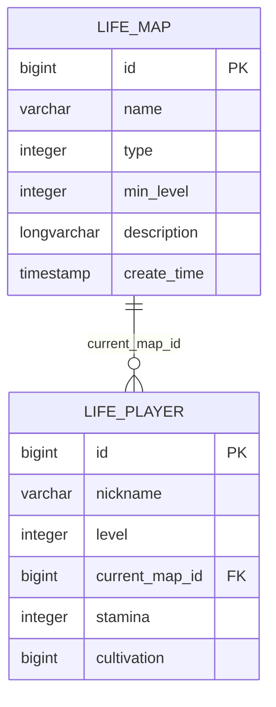
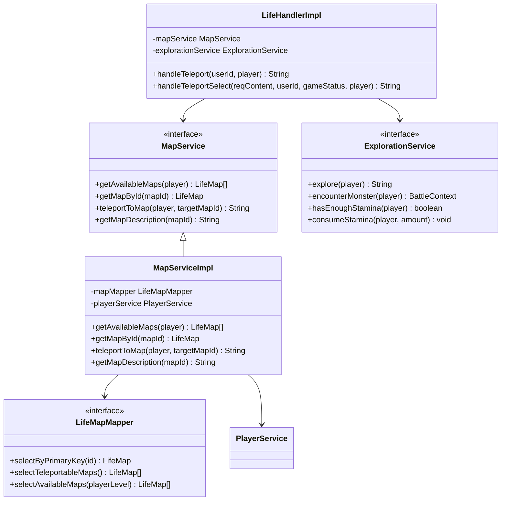
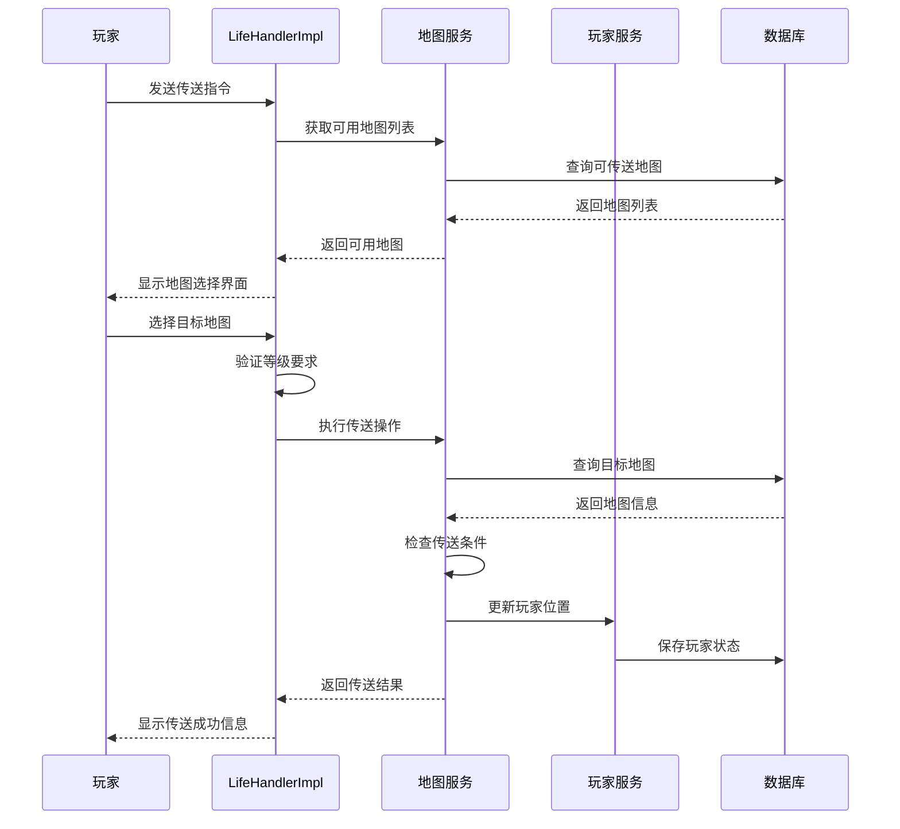
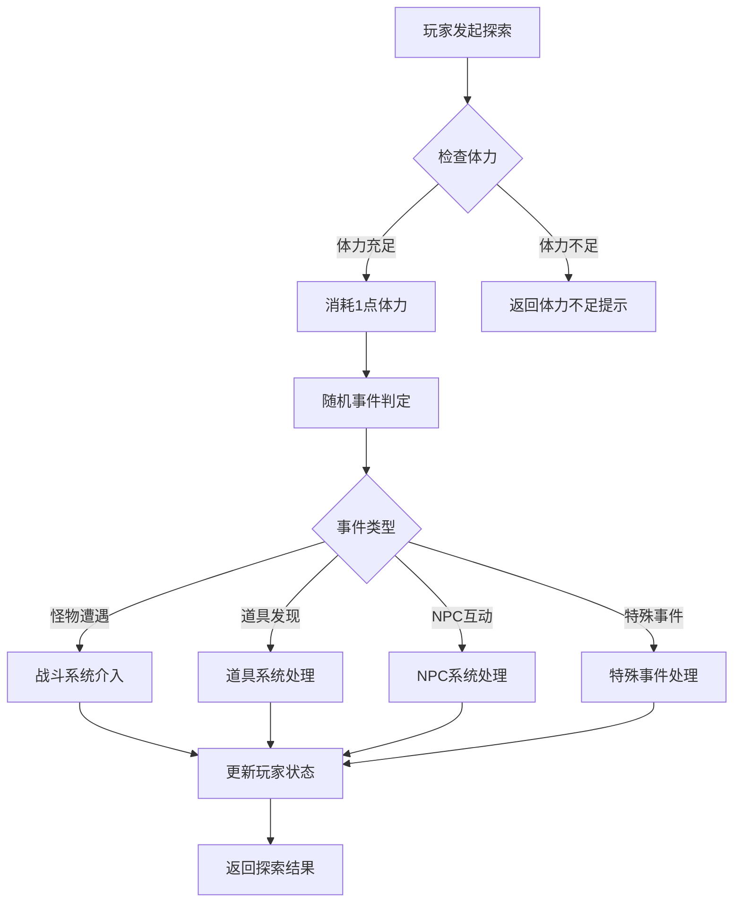
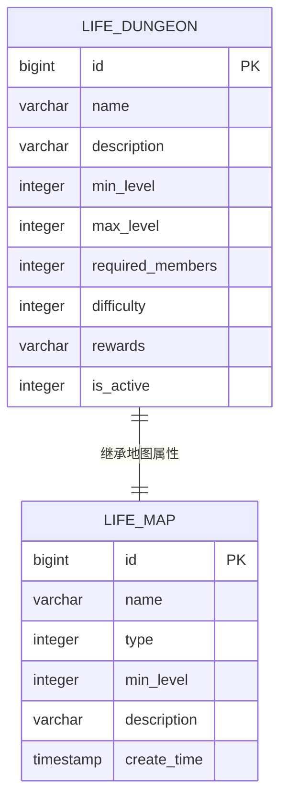
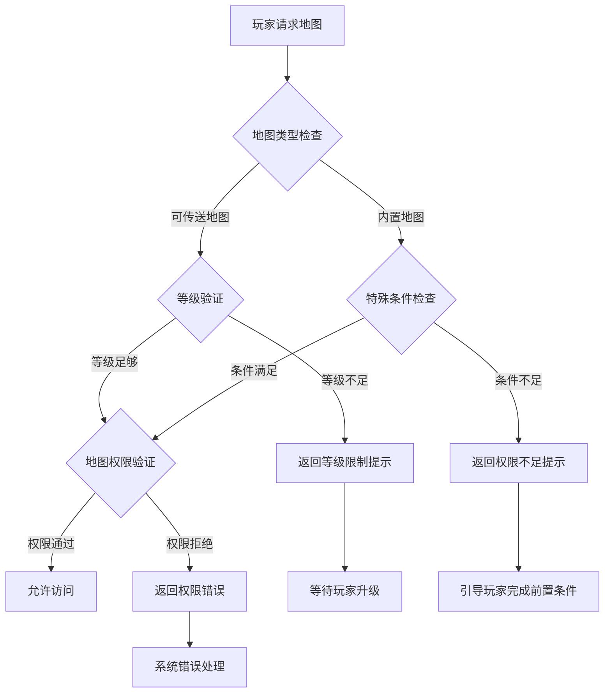
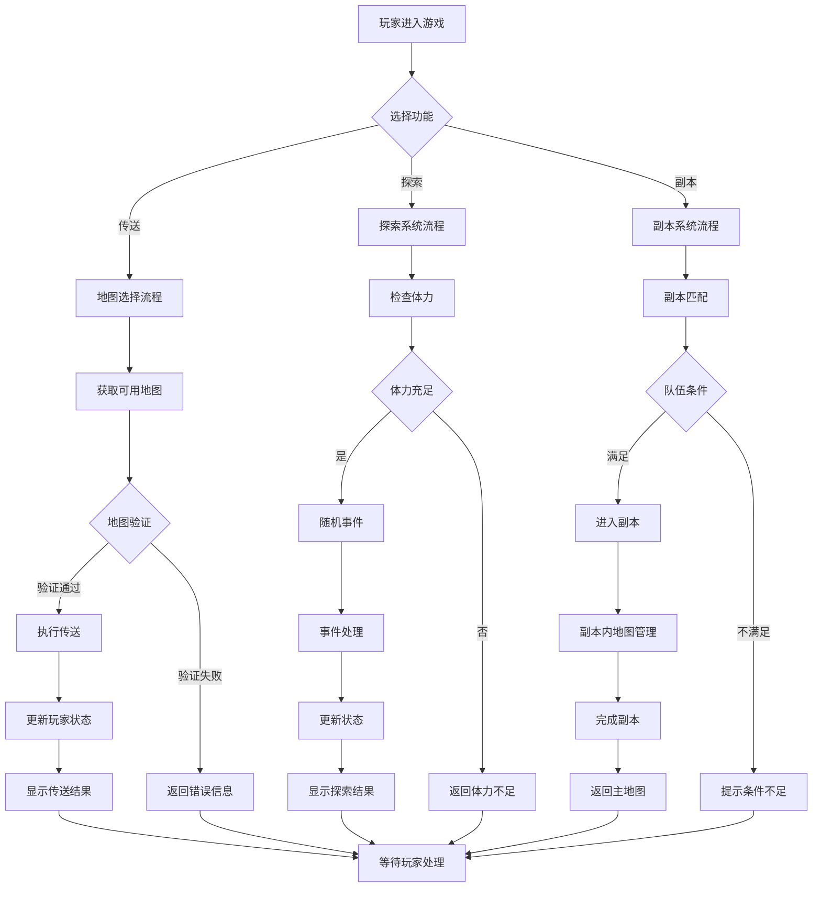
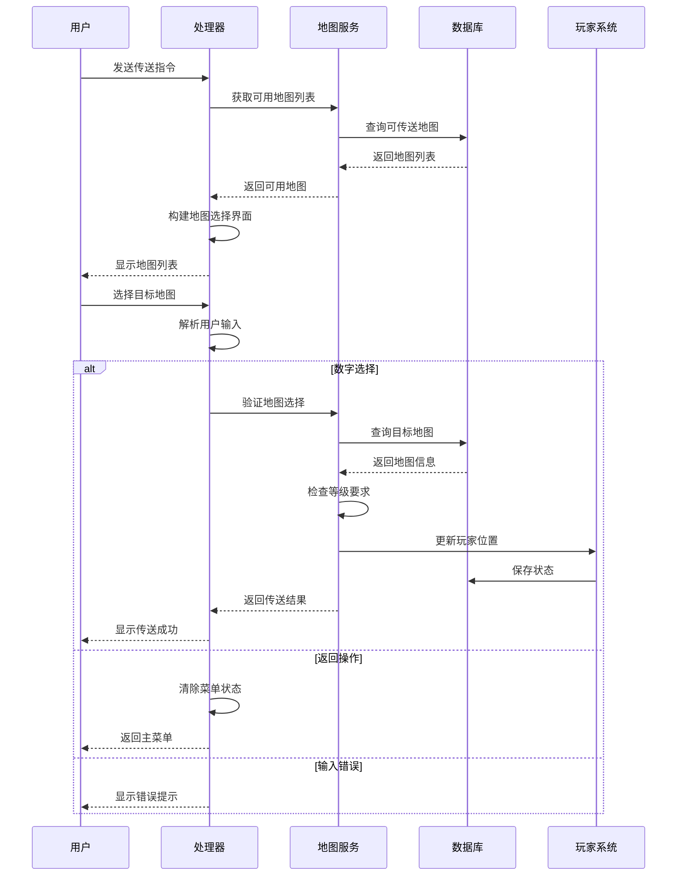

# 地图系统

<cite>
**本文档引用的文件**
- [LifeMap.java](file://Life/src/main/java/com/bot/life/dao/entity/LifeMap.java)
- [LifeMapMapper.java](file://Life/src/main/java/com/bot/life/dao/mapper/LifeMapMapper.java)
- [LifeMapMapper.xml](file://Life/src/main/resources/mapper/LifeMapMapper.xml)
- [MapService.java](file://Life/src/main/java/com/bot/life/service/MapService.java)
- [MapServiceImpl.java](file://Life/src/main/java/com/bot/life/service/impl/MapServiceImpl.java)
- [LifeHandlerImpl.java](file://Life/src/main/java/com/bot/life/service/impl/LifeHandlerImpl.java)
- [ExplorationService.java](file://Life/src/main/java/com/bot/life/service/ExplorationService.java)
- [ExplorationServiceImpl.java](file://Life/src/main/java/com/bot/life/service/impl/ExplorationServiceImpl.java)
- [LifeDungeon.java](file://Life/src/main/java/com/bot/life/dao/entity/LifeDungeon.java)
- [LifeDungeonMapper.java](file://Life/src/main/java/com/bot/life/dao/mapper/LifeDungeonMapper.java)
- [ENDungeon.java](file://Game/src/main/java/com/bot/game/enums/ENDungeon.java)
- [Life_User_Manual.md](file://Life_User_Manual.md)
</cite>

## 目录
1. [系统概述](#系统概述)
2. [地图类型与分类](#地图类型与分类)
3. [地图数据库设计](#地图数据库设计)
4. [地图服务架构](#地图服务架构)
5. [传送系统详解](#传送系统详解)
6. [探索系统关联](#探索系统关联)
7. [副本系统集成](#副本系统集成)
8. [等级限制机制](#等级限制机制)
9. [系统流程图](#系统流程图)
10. [总结](#总结)

## 系统概述

地图系统是浮生卷游戏的核心功能模块之一，负责管理游戏中的各种地图场景，包括可传送地图和内置地图两种类型。系统提供了完整的地图选择、传送、探索和等级验证功能，与战斗、副本等玩法深度集成。

地图系统的主要特点：
- **双类型地图支持**：可传送地图和内置地图的差异化处理
- **等级限制机制**：基于玩家等级的地图访问控制
- **无缝集成**：与探索、副本、战斗等系统紧密关联
- **动态验证**：实时检查玩家状态和地图权限

## 地图类型与分类

### 可传送地图（Type 1）

可传送地图是最常见的地图类型，玩家可以通过传送功能直接到达这些地图。

**特征**：
- 类型标识：`type = 1`
- 可直接传送：无需特殊条件即可访问
- 等级要求：设置最低等级门槛
- 位置更新：传送后立即更新玩家当前位置

**示例用途**：
- 主城：玩家的基地和主要活动场所
- 修炼场：专门用于修炼和提升修为的区域
- 商业区：进行交易和购买道具的地点

### 内置地图（Type 2）

内置地图需要特殊的进入方式，通常包含副本、特殊事件或隐藏区域。

**特征**：
- 类型标识：`type = 2`
- 特殊入口：需要特定条件或触发事件
- 功能多样：可能包含副本、奇遇、特殊玩法
- 权限控制：可能有额外的访问限制

**示例用途**：
- 副本区域：团队挑战的特殊地图
- 隐藏洞府：特殊奖励的隐藏地点
- 奇遇场景：随机事件的发生地

**节来源**
- [LifeMap.java](file://Life/src/main/java/com/bot/life/dao/entity/LifeMap.java#L15)
- [Life_User_Manual.md](file://Life_User_Manual.md#L163-L167)

## 地图数据库设计

地图系统采用关系型数据库设计，核心表结构如下：



**图表来源**
- [LifeMap.java](file://Life/src/main/java/com/bot/life/dao/entity/LifeMap.java#L13-L18)
- [LifeMapMapper.xml](file://Life/src/main/resources/mapper/LifeMapMapper.xml#L5-L11)

### 核心字段说明

| 字段名 | 数据类型 | 说明 | 约束 |
|--------|----------|------|------|
| id | BIGINT | 地图唯一标识符 | 主键，自增 |
| name | VARCHAR(255) | 地图名称 | 必填，唯一性 |
| type | INTEGER | 地图类型 | 1=可传送，2=内置地图 |
| min_level | INTEGER | 最低等级要求 | 默认0，表示无限制 |
| description | LONGVARCHAR | 地图描述信息 | 详细的文字说明 |
| create_time | TIMESTAMP | 创建时间 | 自动生成 |

### 数据库查询优化

系统针对不同查询场景进行了优化：

**可传送地图查询**：
```sql
SELECT * FROM life_map WHERE type = 1 ORDER BY min_level, id
```

**等级限制查询**：
```sql
SELECT * FROM life_map 
WHERE type = 1 AND min_level <= #{playerLevel} 
ORDER BY min_level, id
```

**节来源**
- [LifeMapMapper.xml](file://Life/src/main/resources/mapper/LifeMapMapper.xml#L25-L39)

## 地图服务架构

地图系统采用分层架构设计，确保功能的模块化和可维护性：



**图表来源**
- [MapService.java](file://Life/src/main/java/com/bot/life/service/MapService.java#L12-L41)
- [MapServiceImpl.java](file://Life/src/main/java/com/bot/life/service/impl/MapServiceImpl.java#L18-L83)
- [LifeHandlerImpl.java](file://Life/src/main/java/com/bot/life/service/impl/LifeHandlerImpl.java#L478-L555)

### 服务层职责

**MapService接口**：
- 提供地图查询和传送的核心功能
- 封装数据库访问逻辑
- 处理业务规则和验证

**MapServiceImpl实现**：
- 实现具体的业务逻辑
- 处理等级验证和权限检查
- 更新玩家状态和位置信息

**节来源**
- [MapService.java](file://Life/src/main/java/com/bot/life/service/MapService.java#L12-L41)
- [MapServiceImpl.java](file://Life/src/main/java/com/bot/life/service/impl/MapServiceImpl.java#L18-L83)

## 传送系统详解

传送系统是地图系统的核心功能，提供了完整的地图选择和传送流程。

### 传送流程架构



**图表来源**
- [LifeHandlerImpl.java](file://Life/src/main/java/com/bot/life/service/impl/LifeHandlerImpl.java#L478-L555)
- [MapServiceImpl.java](file://Life/src/main/java/com/bot/life/service/impl/MapServiceImpl.java#L36-L61)

### 传送验证机制

传送系统实现了多层次的验证机制：

**1. 地图存在性验证**：
```java
// 检查目标地图是否存在
LifeMap targetMap = getMapById(targetMapId);
if (targetMap == null) {
    return "目标地图不存在！";
}
```

**2. 等级限制验证**：
```java
// 检查玩家等级是否满足要求
if (player.getLevel() < targetMap.getMinLevel()) {
    return String.format("『%s』需要达到%d级才能进入！", 
                       targetMap.getName(), targetMap.getMinLevel());
}
```

**3. 地图类型验证**：
```java
// 检查是否为可传送地图
if (targetMap.getType() != 1) {
    return "该地图无法直接传送！";
}
```

### 传送结果处理

传送成功后，系统会执行以下操作：

**位置更新**：
- 更新玩家的`currentMapId`字段
- 保存玩家状态到数据库

**信息反馈**：
- 返回传送成功的提示信息
- 包含地图名称和描述信息
- 显示详细的传送结果

**节来源**
- [MapServiceImpl.java](file://Life/src/main/java/com/bot/life/service/impl/MapServiceImpl.java#L36-L61)
- [LifeHandlerImpl.java](file://Life/src/main/java/com/bot/life/service/impl/LifeHandlerImpl.java#L478-L555)

## 探索系统关联

地图系统与探索系统紧密集成，形成了完整的游历体验。

### 探索与地图的关系



**图表来源**
- [ExplorationServiceImpl.java](file://Life/src/main/java/com/bot/life/service/impl/ExplorationServiceImpl.java#L34-L60)

### 地图级别的探索限制

探索系统根据玩家所在地图进行不同的处理：

**1. 怪物遭遇**：
```java
// 在当前地图查找可遭遇的怪物
List<LifeMonster> monsters = monsterMapper.selectNormalMonstersByMapId(player.getCurrentMapId());
```

**2. 地图特定事件**：
- 不同地图可能有不同的探索事件概率
- 地图特性会影响探索结果
- 特殊地图可能有专属事件

**3. 体力消耗机制**：
```java
// 每次探索消耗1点体力
consumeStamina(player, 1);
```

### 探索结果与地图状态

探索系统会根据结果更新玩家的地图状态：

**成功探索**：
- 体力减少
- 可能获得经验或道具
- 可能触发特殊事件

**失败探索**：
- 体力减少
- 无收益但无损失
- 可能获得修炼经验

**节来源**
- [ExplorationServiceImpl.java](file://Life/src/main/java/com/bot/life/service/impl/ExplorationServiceImpl.java#L34-L224)

## 副本系统集成

地图系统与副本系统协同工作，为玩家提供丰富的挑战内容。

### 副本地图类型

副本系统使用特殊的地图配置：



**图表来源**
- [LifeDungeon.java](file://Life/src/main/java/com/bot/life/dao/entity/LifeDungeon.java#L11-L20)
- [LifeMap.java](file://Life/src/main/java/com/bot/life/dao/entity/LifeMap.java#L13-L18)

### 副本系统特性

**1. 团队挑战**：
- 需要至少2名玩家组队
- 队长负责操作，队员托管
- 奖励共享机制

**2. 难度分级**：
- 简单（1级）：适合新手
- 普通（2级）：标准挑战
- 困难（3级）：高难度挑战

**3. 时间限制**：
- 每日重置挑战次数
- 队伍组队有时间限制
- 挑战超时自动解散

### 副本与地图的协作

副本系统通过地图系统实现：

**地图作为副本入口**：
- 副本地图具有特殊的进入条件
- 需要满足等级和人数要求
- 可能需要特殊道具或任务

**副本内的地图管理**：
- 副本内部可能有多个子地图
- 地图切换不影响玩家状态
- 完成副本后返回原地图

**节来源**
- [LifeDungeon.java](file://Life/src/main/java/com/bot/life/dao/entity/LifeDungeon.java#L11-L20)
- [ENDungeon.java](file://Game/src/main/java/com/bot/game/enums/ENDungeon.java#L13-L25)

## 等级限制机制

等级限制是地图系统的重要安全机制，确保游戏平衡性和渐进式成长。

### 等级验证层次



**图表来源**
- [MapServiceImpl.java](file://Life/src/main/java/com/bot/life/service/impl/MapServiceImpl.java#L44-L52)

### 等级验证实现

**1. 地图级别验证**：
```java
// 在地图服务中验证等级要求
@Override
public List<LifeMap> getAvailableMaps(LifePlayer player) {
    return mapMapper.selectAvailableMaps(player.getLevel());
}
```

**2. 传送时验证**：
```java
// 在传送过程中进行实时验证
if (player.getLevel() < targetMap.getMinLevel()) {
    return String.format("『%s』需要达到%d级才能进入！", 
                       targetMap.getName(), targetMap.getMinLevel());
}
```

**3. 动态等级检查**：
- 玩家升级后自动更新可用地图
- 实时反映玩家的最新状态
- 支持等级变化的即时响应

### 等级限制策略

**渐进式解锁**：
- 新手地图：1-10级
- 中级地图：11-30级  
- 高级地图：31级以上
- 特殊地图：根据剧情解锁

**保护机制**：
- 防止玩家过早进入高难度地图
- 确保游戏体验的连贯性
- 平衡不同阶段的挑战难度

**节来源**
- [MapServiceImpl.java](file://Life/src/main/java/com/bot/life/service/impl/MapServiceImpl.java#L26-L29)
- [MapServiceImpl.java](file://Life/src/main/java/com/bot/life/service/impl/MapServiceImpl.java#L44-L52)

## 系统流程图

### 完整地图系统流程



**图表来源**
- [LifeHandlerImpl.java](file://Life/src/main/java/com/bot/life/service/impl/LifeHandlerImpl.java#L478-L555)
- [ExplorationServiceImpl.java](file://Life/src/main/java/com/bot/life/service/impl/ExplorationServiceImpl.java#L34-L60)

### 地图选择与传送详细流程



**图表来源**
- [LifeHandlerImpl.java](file://Life/src/main/java/com/bot/life/service/impl/LifeHandlerImpl.java#L505-L549)

## 总结

地图系统作为浮生卷游戏的核心基础设施，实现了以下关键功能：

### 系统优势

**1. 结构清晰**：
- 分层架构设计，职责明确
- 接口抽象良好，易于扩展
- 数据库设计合理，查询高效

**2. 功能完善**：
- 支持两种地图类型的差异化处理
- 完整的传送验证机制
- 与探索、副本系统的深度集成

**3. 安全可靠**：
- 多层次的等级限制验证
- 实时的状态检查
- 错误处理和回滚机制

### 技术特色

**1. 可扩展性**：
- 新地图类型可通过修改type字段轻松添加
- 等级限制可根据游戏需求灵活调整
- 插件化的事件处理机制

**2. 性能优化**：
- 数据库查询使用索引优化
- 缓存常用地图信息
- 异步处理非关键操作

**3. 用户体验**：
- 直观的地图选择界面
- 及时的反馈和提示
- 流畅的操作流程

### 应用价值

地图系统不仅为玩家提供了丰富的游戏体验，还为后续功能的扩展奠定了坚实的基础。通过合理的架构设计和完善的验证机制，系统能够支持游戏的长期发展和功能迭代。

该系统的设计理念体现了现代软件工程的最佳实践，既保证了功能的完整性，又兼顾了性能和可维护性，是游戏开发中地图系统设计的优秀范例。